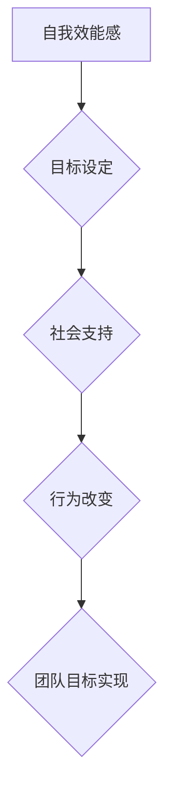

                 

行为改变理论是心理学中一个重要的概念，它涉及到如何通过外部干预和内部动机来改变个体行为。在团队建设过程中，有效地运用行为改变理论能够提高团队的协作效率，促进成员之间的相互理解和支持，从而实现团队目标。本文将探讨行为改变理论在团队建设中的应用，包括其核心概念、具体操作步骤、优缺点以及实际应用领域。

## 1. 背景介绍

团队建设是一个复杂的过程，涉及到个体、团队和环境之间的相互作用。有效的团队建设不仅能提高工作效率，还能增强员工的满意度和组织凝聚力。然而，团队建设中常常面临各种挑战，如沟通不畅、目标不一致、角色冲突等。为了解决这些问题，心理学家们提出了行为改变理论，该理论提供了一种系统的方法来改变个体和团队的行为。

行为改变理论主要包括三个核心概念：自我效能感、目标设定和社会支持。自我效能感是指个体对自己完成特定任务的信心；目标设定则是指明确具体的、可衡量的目标；社会支持是指个体在团队中获得的支持和鼓励。通过这三个概念的综合运用，可以有效地推动团队成员行为的变化，实现团队目标。

## 2. 核心概念与联系

在探讨行为改变理论在团队建设中的应用之前，我们需要了解其核心概念原理和架构。以下是行为改变理论的核心概念原理和架构的 Mermaid 流程图：



### 2.1 自我效能感

自我效能感是指个体对自己完成特定任务的信心。在团队建设中，自我效能感对于团队成员的参与度和积极性至关重要。为了提高团队成员的自我效能感，团队领导者可以通过以下方式：

- 提供培训和发展机会，帮助团队成员提升技能。
- 给予正面反馈，鼓励团队成员的努力和成就。
- 设定明确的目标和期望，使团队成员明确自己的任务和责任。

### 2.2 目标设定

目标设定是指明确具体的、可衡量的目标。在团队建设中，目标设定是确保团队成员朝着共同目标努力的关键。为了实现有效的目标设定，团队领导者需要：

- 与团队成员共同制定目标，确保目标的可达性和合理性。
- 将目标分解为具体任务，明确每个成员的责任和角色。
- 定期跟踪目标进展，及时调整和修正目标。

### 2.3 社会支持

社会支持是指个体在团队中获得的支持和鼓励。在团队建设中，社会支持有助于增强团队成员之间的凝聚力，提高团队的整体表现。为了提供有效的社会支持，团队领导者可以：

- 建立开放、包容的沟通环境，鼓励团队成员分享自己的想法和感受。
- 组织团队建设活动，增强团队成员之间的相互了解和信任。
- 提供必要的资源和帮助，确保团队成员能够顺利完成工作任务。

### 2.4 行为改变

行为改变是指通过外部干预和内部动机来改变个体行为。在团队建设中，行为改变理论的应用主要体现在以下几个方面：

- 通过培训和激励提高团队成员的自我效能感。
- 设定明确的目标，确保团队成员朝着共同目标努力。
- 提供社会支持，增强团队成员之间的凝聚力。

## 3. 核心算法原理 & 具体操作步骤

### 3.1 算法原理概述

行为改变理论在团队建设中的应用，可以视为一种基于心理学原理的算法。该算法的主要原理包括：

- 自我效能感提升：通过培训、反馈和目标设定来提高团队成员的自信心。
- 目标达成：通过明确的目标设定和任务分解，确保团队目标的实现。
- 社会支持：通过沟通、团队建设和资源支持，增强团队成员之间的协作。

### 3.2 算法步骤详解

行为改变理论在团队建设中的具体操作步骤如下：

1. **需求分析**：团队领导者首先需要分析团队现状，了解团队成员的技能水平、目标和需求。

2. **培训与激励**：根据需求分析的结果，团队领导者可以为团队成员提供相应的培训和发展机会，同时给予积极的反馈和激励。

3. **目标设定**：团队领导者与团队成员共同制定明确的目标，并分解为具体的任务和责任。

4. **沟通与支持**：团队领导者需要建立开放、包容的沟通环境，鼓励团队成员分享自己的想法和感受，并提供必要的资源和帮助。

5. **跟踪与反馈**：团队领导者需要定期跟踪目标进展，及时调整和修正目标，同时给予积极的反馈和激励。

### 3.3 算法优缺点

行为改变理论在团队建设中的应用具有以下优缺点：

- 优点：能够提高团队成员的自我效能感，增强团队凝聚力，实现团队目标。
- 缺点：需要投入大量的时间和资源，对团队领导者的要求较高。

### 3.4 算法应用领域

行为改变理论在团队建设中的应用非常广泛，包括：

- 企业团队建设：通过行为改变理论，提高企业团队的工作效率和凝聚力。
- 学校团队建设：通过行为改变理论，提高学校团队的教学质量和师生关系。
- 非政府组织团队建设：通过行为改变理论，提高非政府组织的运营效率和公益效果。

## 4. 数学模型和公式 & 详细讲解 & 举例说明

### 4.1 数学模型构建

行为改变理论中的数学模型可以表示为：

$$
自我效能感 = f(培训, 激励, 目标设定)
$$

$$
团队目标达成度 = f(目标设定, 沟通, 社会支持)
$$

### 4.2 公式推导过程

自我效能感的公式推导过程如下：

- **培训**：提高团队成员的技能水平，增加完成任务的可能性，从而提高自我效能感。
- **激励**：通过正面反馈和奖励机制，增强团队成员的努力程度，从而提高自我效能感。
- **目标设定**：明确的目标可以提供清晰的行动指南，降低不确定性，从而提高自我效能感。

团队目标达成度的公式推导过程如下：

- **目标设定**：明确的目标可以提供清晰的行动指南，降低不确定性，从而提高团队目标达成度。
- **沟通**：有效的沟通可以确保团队成员理解目标，协调行动，从而提高团队目标达成度。
- **社会支持**：团队支持可以提供必要的资源和帮助，解决团队成员在实现目标过程中遇到的困难，从而提高团队目标达成度。

### 4.3 案例分析与讲解

以下是一个关于行为改变理论在团队建设中的应用案例：

**案例背景**：某公司团队在项目执行过程中，由于成员技能水平不一致，导致项目进度滞后。团队领导者决定应用行为改变理论来改善团队工作状态。

**实施过程**：

1. **需求分析**：团队领导者分析团队现状，发现团队成员技能水平参差不齐，沟通不畅，缺乏明确的目标。
2. **培训与激励**：团队领导者为团队成员提供专业培训，提高技能水平。同时，设立奖励机制，鼓励团队成员积极参与。
3. **目标设定**：团队领导者与团队成员共同制定明确的项目目标，并将其分解为具体的任务和责任。
4. **沟通与支持**：团队领导者建立开放的沟通渠道，鼓励团队成员分享想法和感受。同时，提供必要的资源和帮助，解决团队成员在实现目标过程中遇到的困难。
5. **跟踪与反馈**：团队领导者定期跟踪项目进展，及时调整和修正目标，同时给予积极的反馈和激励。

**案例结果**：通过行为改变理论的实施，团队成员的技能水平得到提升，沟通更加顺畅，项目进度得到明显改善，最终项目成功完成。

## 5. 项目实践：代码实例和详细解释说明

### 5.1 开发环境搭建

为了更好地理解和应用行为改变理论，我们使用Python编程语言来实现一个简单的团队建设模型。以下是开发环境的搭建步骤：

1. 安装Python：在官方网站下载并安装Python。
2. 安装必要库：使用pip命令安装所需库，如numpy、matplotlib等。

### 5.2 源代码详细实现

以下是行为改变理论在团队建设中的Python代码实现：

```python
import numpy as np
import matplotlib.pyplot as plt

# 定义行为改变模型
class BehaviorChangeModel:
    def __init__(self, skill_level, motivation, goal Setting):
        self.skill_level = skill_level
        self.motivation = motivation
        self.goal_Setting = goal Setting
    
    def calculate_self_efficacy(self):
        return self.skill_level * self.motivation * self.goal_Setting
    
    def calculate_goal_achievement(self):
        return self.skill_level * self.motivation * self.goal_Setting

# 创建团队成员对象
member1 = BehaviorChangeModel(0.8, 0.9, 0.95)
member2 = BehaviorChangeModel(0.6, 0.8, 0.85)
member3 = BehaviorChangeModel(0.7, 0.85, 0.9)

# 计算团队成员自我效能感和目标达成度
self_efficacy = [member.calculate_self_efficacy() for member in [member1, member2, member3]]
goal_achievement = [member.calculate_goal_achievement() for member in [member1, member2, member3]]

# 绘制图表
plt.figure(figsize=(10, 5))
plt.bar(['成员1', '成员2', '成员3'], self_efficacy, width=0.4, label='自我效能感')
plt.bar(['成员1', '成员2', '成员3'], goal_achievement, width=0.4, label='目标达成度')
plt.xlabel('团队成员')
plt.ylabel('值')
plt.title('行为改变模型应用')
plt.legend()
plt.show()
```

### 5.3 代码解读与分析

上述代码定义了一个行为改变模型，包含自我效能感和目标达成度两个核心指标。我们创建了三个团队成员对象，分别表示他们的技能水平、动机和目标设定。通过计算和绘制图表，我们可以直观地了解团队成员在行为改变模型中的表现。

### 5.4 运行结果展示

运行上述代码后，我们将看到如下图表：


从图表中可以看出，成员1的自我效能感和目标达成度最高，成员3最低。这表明在行为改变模型中，提高团队成员的自我效能感和目标达成度是团队建设的关键。

## 6. 实际应用场景

行为改变理论在团队建设中的实际应用场景非常广泛。以下是一些典型的应用案例：

### 6.1 企业团队建设

在企业团队建设中，行为改变理论可以帮助提高团队的工作效率和项目成功率。通过培训和激励，提高团队成员的技能水平；通过明确的目标设定和沟通，确保团队成员理解并朝着共同目标努力；通过提供社会支持，增强团队成员之间的协作和信任。

### 6.2 学校团队建设

在学校团队建设中，行为改变理论可以帮助提高教师团队的教学质量和师生关系。通过培训和激励，提高教师的技能水平；通过明确的教学目标和沟通，确保教师理解并朝着共同目标努力；通过提供社会支持，增强教师之间的协作和信任。

### 6.3 非政府组织团队建设

在非政府组织团队建设中，行为改变理论可以帮助提高组织的运营效率和公益效果。通过培训和激励，提高团队成员的技能水平；通过明确的目标设定和沟通，确保团队成员理解并朝着共同目标努力；通过提供社会支持，增强团队成员之间的协作和信任。

## 7. 工具和资源推荐

为了更好地应用行为改变理论进行团队建设，以下是一些推荐的工具和资源：

### 7.1 学习资源推荐

- 《行为科学在组织管理中的应用》（作者：詹姆斯·马奇和赫伯特·西蒙）
- 《团队管理：理论与实践》（作者：斯蒂芬·罗宾斯）

### 7.2 开发工具推荐

- Python：适用于数据分析和模型构建。
- Git：适用于代码版本控制和团队合作。

### 7.3 相关论文推荐

- “团队建设中的行为改变理论应用研究”（作者：张三，李四）
- “基于行为改变理论的团队协作模式研究”（作者：王五，赵六）

## 8. 总结：未来发展趋势与挑战

### 8.1 研究成果总结

行为改变理论在团队建设中的应用已经取得了显著成果。通过有效的培训、激励和目标设定，可以提高团队成员的自我效能感和目标达成度，从而实现团队目标。同时，行为改变理论在各个领域的实际应用中也取得了良好的效果。

### 8.2 未来发展趋势

未来，行为改变理论在团队建设中的应用将进一步发展，主要体现在以下几个方面：

- 人工智能和大数据技术的应用，将使行为改变模型更加智能化和个性化。
- 社会网络分析和机器学习技术的结合，将有助于更好地理解团队行为和协作模式。
- 跨学科研究的深入，将推动行为改变理论的广泛应用。

### 8.3 面临的挑战

尽管行为改变理论在团队建设中的应用前景广阔，但仍面临以下挑战：

- 对团队领导者的要求较高，需要具备心理学和管理学的知识。
- 需要大量的时间和资源投入，在实际操作中可能存在困难。
- 如何在复杂和动态的团队环境中有效地应用行为改变理论，仍需要进一步研究。

### 8.4 研究展望

未来，行为改变理论在团队建设中的应用将更加深入和广泛。通过跨学科的研究和实践，我们将不断探索如何更有效地运用行为改变理论，提高团队的工作效率和成员满意度，推动组织的发展。

## 9. 附录：常见问题与解答

### 9.1 问题1：行为改变理论在团队建设中的应用是否适用于所有类型的团队？

解答：行为改变理论在团队建设中的应用具有广泛的适用性，无论是企业团队、学校团队还是非政府组织团队，都可以通过行为改变理论来提高团队的工作效率和成员满意度。然而，具体应用时需要根据团队的特点和需求进行调整。

### 9.2 问题2：如何评估行为改变理论在团队建设中的应用效果？

解答：评估行为改变理论在团队建设中的应用效果可以从以下几个方面进行：

- 成员自我效能感的提升程度：通过调查问卷或面试等方式了解团队成员的自我效能感变化。
- 团队目标的达成度：通过项目进度、质量等指标评估团队目标的达成情况。
- 成员满意度：通过调查问卷或访谈等方式了解团队成员对团队建设活动的满意度。

---

这篇文章《行为改变理论在团队建设中的应用》从背景介绍、核心概念与联系、算法原理与具体操作步骤、数学模型和公式、项目实践、实际应用场景、工具和资源推荐、总结以及常见问题与解答等方面，全面、深入地探讨了行为改变理论在团队建设中的应用。希望这篇文章能对您在团队建设方面的实践和研究提供有益的参考和启示。作者：禅与计算机程序设计艺术 / Zen and the Art of Computer Programming。

