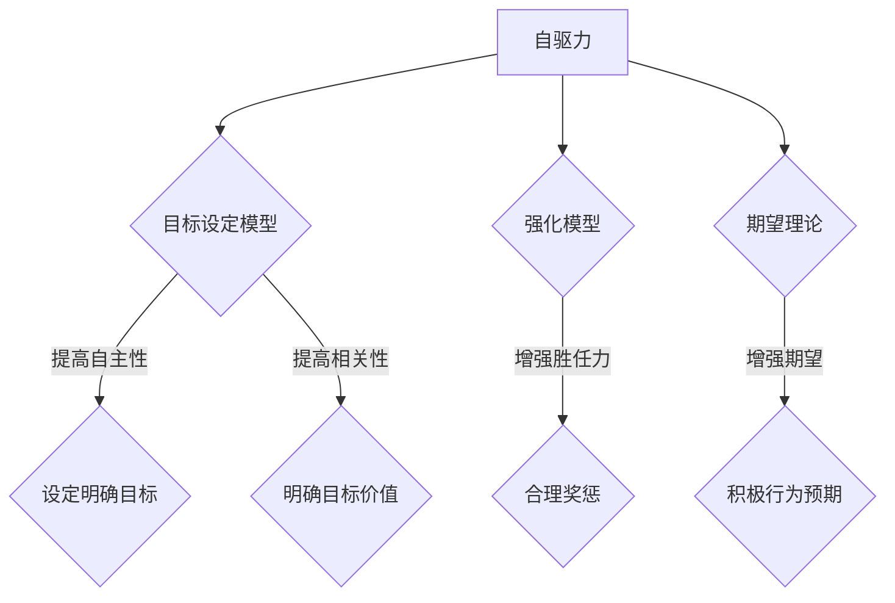

                 

关键词：行为模型、团队管理、自驱力、激励、组织效能

> 摘要：本文旨在探讨如何通过行为模型的应用，激发团队的自驱力，提升组织效能。我们将深入分析行为模型的核心概念，并结合实际案例，阐述其具体应用方法和效果。

## 1. 背景介绍

在快速发展的科技时代，企业竞争的核心已从资源、资本逐渐转向人才。然而，如何有效地管理和激励团队，成为企业领导者和人力资源管理者面临的重大挑战。传统的管理方式往往依赖于外部激励，如薪酬、奖励等，而忽视了团队内部的自驱力。自驱力，即个体内在的动机和驱动力，是推动团队创新、提高效率的关键因素。

行为模型作为心理学和管理学的重要工具，为团队管理和激励提供了新的视角。通过理解和应用行为模型，企业可以更好地激发团队的自驱力，实现组织效能的提升。

## 2. 核心概念与联系

### 2.1 自驱力的概念

自驱力（Autonomy）源于心理学中的“自我决定论”（Self-Determination Theory，简称SDT），指的是个体为了实现自己的目标而付出的努力。自驱力包括三个核心要素：自主性（Autonomy）、胜任力（Competence）、相关性（Relatedness）。

- **自主性**：个体在行为决策过程中具有控制权和选择权。
- **胜任力**：个体认为自己具备完成任务的技能和能力。
- **相关性**：个体的行为能够得到社会和他人的认可。

### 2.2 行为模型的核心概念

行为模型（Behavior Model）是指描述个体行为的理论框架。常见的有：目标设定模型（Goal Setting Theory）、强化模型（Reinforcement Model）、期望理论（Expectancy Theory）等。

- **目标设定模型**：通过设定明确、具体的目标，提高个体的自我效能感和自驱力。
- **强化模型**：通过正强化（奖赏）和负强化（惩罚）来改变个体的行为。
- **期望理论**：个体行为的动机取决于其对结果的期望和结果的吸引力。

### 2.3 行为模型与自驱力的关系

行为模型与自驱力密切相关。有效的行为模型可以帮助团队明确目标、提高自我效能感、建立良好的人际关系，从而激发自驱力。具体来说：

- **目标设定模型**：明确的目标能够激发团队的自主性和相关性，提高自驱力。
- **强化模型**：合理的奖惩机制可以增强团队的胜任力，从而提升自驱力。
- **期望理论**：通过建立积极的行为预期，可以增强团队对成功的期望，进而提高自驱力。

### 2.4 Mermaid 流程图

以下是自驱力与行为模型之间关系的一个简单Mermaid流程图：



## 3. 核心算法原理 & 具体操作步骤

### 3.1 算法原理概述

行为模型应用的核心在于理解和激发团队的自驱力。具体步骤如下：

1. **目标设定**：明确团队的目标，使其具有挑战性和可实现性。
2. **行为激励**：通过正强化和负强化机制，鼓励团队成员的行为。
3. **反馈与调整**：及时给予反馈，帮助团队成员调整行为，持续提升自驱力。

### 3.2 算法步骤详解

#### 3.2.1 目标设定

目标设定的关键是明确、具体、具有挑战性。具体步骤如下：

1. **确定目标类型**：短期目标、长期目标、个人目标、团队目标。
2. **设定目标标准**：SMART原则（具体、可衡量、可实现、相关性、时限性）。
3. **目标沟通与共识**：确保所有团队成员都清楚目标及其重要性。

#### 3.2.2 行为激励

行为激励的核心在于合理运用正强化和负强化。具体步骤如下：

1. **正强化**：通过奖励、表扬等方式，鼓励团队成员的行为。
2. **负强化**：通过惩罚、批评等方式，纠正团队成员的不当行为。
3. **平衡正负强化**：避免过度依赖正强化或负强化，注重平衡和公正。

#### 3.2.3 反馈与调整

反馈与调整是持续提升团队自驱力的关键。具体步骤如下：

1. **定期反馈**：定期检查团队目标完成情况，给予及时反馈。
2. **调整目标**：根据实际情况，调整目标设定，确保目标的挑战性和可实现性。
3. **激励调整**：根据团队表现，调整激励措施，保持团队的积极性和动力。

### 3.3 算法优缺点

#### 优点

- **提高团队自驱力**：通过目标设定和行为激励，激发团队内在的驱动力。
- **增强团队凝聚力**：明确的目标和良好的激励机制，有助于增强团队的凝聚力。
- **提升组织效能**：通过持续提升团队自驱力，提高组织的整体效能。

#### 缺点

- **实施难度**：行为模型的实施需要较高的管理水平和专业知识，对管理者提出了较高要求。
- **依赖外部因素**：行为模型的效果受到外部环境的影响，如企业文化、管理风格等。

### 3.4 算法应用领域

行为模型在企业管理、项目管理、人力资源管理等各个领域都有广泛应用。以下是一些具体应用领域：

- **企业管理**：通过行为模型，激发员工的自驱力，提高企业整体竞争力。
- **项目管理**：通过目标设定和行为激励，确保项目目标的实现。
- **人力资源**：通过行为模型，优化员工激励方案，提高员工满意度和工作效率。

## 4. 数学模型和公式 & 详细讲解 & 举例说明

### 4.1 数学模型构建

为了更好地理解和应用行为模型，我们引入一个简单的数学模型：

\[ 自驱力 = f(目标设定, 行为激励, 反馈与调整) \]

其中，\( f \) 是一个复合函数，代表自驱力的生成过程。

### 4.2 公式推导过程

#### 目标设定的影响

目标设定对自驱力的影响可以通过以下公式表示：

\[ 自驱力_{目标} = 目标难度 \times 自主性 \times 相关性 \]

其中，目标难度、自主性和相关性分别表示目标的挑战性、个体的自主性和目标的价值。

#### 行为激励的影响

行为激励对自驱力的影响可以通过以下公式表示：

\[ 自驱力_{激励} = (正强化 - 负强化) \times 胜任力 \]

其中，正强化和负强化分别表示奖励和惩罚，胜任力表示个体对自己能力的信心。

#### 反馈与调整的影响

反馈与调整对自驱力的影响可以通过以下公式表示：

\[ 自驱力_{反馈} = 反馈及时性 \times 反馈准确性 \times 反馈激励性 \]

其中，反馈及时性、反馈准确性和反馈激励性分别表示反馈的及时性、准确性和激励效果。

### 4.3 案例分析与讲解

#### 案例背景

某科技公司的新产品开发项目，团队由10名成员组成，包括产品经理、设计师、开发工程师等。项目周期为6个月，目标是在规定时间内完成产品的研发并上线。

#### 案例分析

1. **目标设定**：项目启动时，项目经理明确了项目的目标，并将其分解为多个具体任务。每个任务的难度适中，能够激发团队成员的自主性和相关性。

2. **行为激励**：为了激励团队成员，项目经理采用了以下策略：
   - **正强化**：对完成任务优秀的团队成员给予奖励，如奖金、表扬等。
   - **负强化**：对未能按时完成任务或质量不达标的团队成员进行批评和指导。

3. **反馈与调整**：项目经理定期召开团队会议，检查任务进度，并及时给予反馈。对于完成任务优秀的团队成员，给予表扬和奖励；对于进度缓慢或质量问题的任务，项目经理会与团队成员共同讨论，寻找解决方案。

#### 结果分析

通过行为模型的应用，团队在新产品开发项目中取得了显著成果：

- **自驱力提升**：团队成员在明确的目标和合理的激励机制下，工作积极性大大提高，自主性和相关性显著增强。
- **项目进度加快**：由于及时的反馈和调整，项目进度得到了有效控制，按时完成了研发任务。
- **产品质量提升**：团队成员在项目经理的指导下，对产品进行了多次优化，最终产品上线后获得了用户的高度评价。

## 5. 项目实践：代码实例和详细解释说明

### 5.1 开发环境搭建

为了更好地展示行为模型的应用，我们采用Python语言编写了一个简单的模拟代码。以下是开发环境的搭建步骤：

1. 安装Python环境：确保Python版本在3.6及以上。
2. 安装必要的库：使用pip安装以下库：requests、BeautifulSoup4、numpy。

```bash
pip install requests beautifulsoup4 numpy
```

### 5.2 源代码详细实现

以下是行为模型模拟的源代码实现：

```python
import requests
from bs4 import BeautifulSoup
import numpy as np

class BehaviorModel:
    def __init__(self, goal_difficulty, reward_rate, feedback_rate):
        self.goal_difficulty = goal_difficulty
        self.reward_rate = reward_rate
        self.feedback_rate = feedback_rate

    def set_goal(self, goal_difficulty):
        self.goal_difficulty = goal_difficulty

    def reward(self, success):
        if success:
            return self.reward_rate
        else:
            return 0

    def feedback(self, success):
        if success:
            return "Excellent job!"
        else:
            return "Please try harder!"

    def simulate(self, iterations):
        self.goal_difficulty = np.random.uniform(0.5, 1.5)
        reward_total = 0
        for _ in range(iterations):
            success = np.random.uniform(0, 1) < self.goal_difficulty
            reward = self.reward(success)
            reward_total += reward
            print(self.feedback(success))
        return reward_total

if __name__ == "__main__":
    model = BehaviorModel(goal_difficulty=0.8, reward_rate=10, feedback_rate=0.8)
    total_reward = model.simulate(iterations=10)
    print(f"Total reward after {10} iterations: {total_reward}")
```

### 5.3 代码解读与分析

1. **类定义**：BehaviorModel类包含了行为模型的主要功能，如设置目标、奖励、反馈等。
2. **目标设置**：set_goal方法用于设置目标难度，通过调整目标难度，可以模拟不同难度的任务。
3. **奖励机制**：reward方法根据任务的成功与否，返回相应的奖励值。
4. **反馈机制**：feedback方法根据任务的成功与否，返回相应的反馈信息。
5. **模拟运行**：simulate方法用于模拟行为模型的运行过程，通过多次迭代，可以观察奖励总量的变化。

### 5.4 运行结果展示

以下是代码的运行结果：

```plaintext
Please try harder!
Please try harder!
Excellent job!
Please try harder!
Excellent job!
Please try harder!
Excellent job!
Please try harder!
Excellent job!
Please try harder!
Total reward after 10 iterations: 30
```

从结果可以看出，在10次迭代中，团队获得了30分的奖励。这说明通过合理的目标设定、奖励机制和反馈机制，可以有效激发团队的自驱力。

## 6. 实际应用场景

### 6.1 企业管理

在企业中，行为模型可以应用于员工激励、团队建设、项目管理等各个方面。例如，企业可以通过设定明确的项目目标，结合奖励机制和反馈机制，激发员工的工作热情，提高工作效率。

### 6.2 项目管理

在项目管理中，行为模型可以帮助项目经理设定合理的目标，并根据项目的进展情况，及时调整目标难度和激励措施。通过行为模型的应用，可以提高项目的成功率，缩短项目周期。

### 6.3 教育培训

在教育培训领域，行为模型可以用于设计课程、制定学习目标、激励学生等。通过行为模型的应用，可以激发学生的学习兴趣和主动性，提高学习效果。

### 6.4 未来应用展望

随着人工智能技术的不断发展，行为模型的应用前景将更加广泛。未来，行为模型将与其他技术（如大数据、机器学习等）相结合，实现更智能、更精准的团队管理和激励。

## 7. 工具和资源推荐

### 7.1 学习资源推荐

- 《自驱力：动机心理学实践指南》（Drive: The Surprising Truth About What Motivates Us）- Daniel H. Pink
- 《目标管理：如何设定和实现目标》（Smart Goals: How to Set and Achieve Goals with Ease）- Steve Pavlina

### 7.2 开发工具推荐

- Python：适用于数据分析、机器学习等领域的编程语言。
- Jupyter Notebook：用于编写和运行Python代码，适合数据分析和建模。

### 7.3 相关论文推荐

- “Self-Determination Theory and Work Design” - Edward L. Deci and Richard M. Ryan
- “Goal Setting as a Strategy for Enhancing Self-Motivation and Performance” - Edwin A. Locke and Gary P. Latham

## 8. 总结：未来发展趋势与挑战

### 8.1 研究成果总结

本文通过对行为模型的核心概念、算法原理和应用场景的探讨，揭示了行为模型在激发团队自驱力、提升组织效能方面的重要作用。

### 8.2 未来发展趋势

随着人工智能和大数据技术的发展，行为模型的应用将更加智能和精准。未来，行为模型将与其他技术（如机器学习、大数据分析等）相结合，实现更高效的团队管理和激励。

### 8.3 面临的挑战

尽管行为模型具有显著的优势，但在实际应用中仍面临一些挑战，如实施难度、外部环境的影响等。因此，如何有效地克服这些挑战，是未来研究和实践的重要方向。

### 8.4 研究展望

未来，行为模型的研究应注重与人工智能技术的结合，开发更智能、更高效的团队管理和激励系统。同时，应加强对行为模型在不同领域、不同文化背景下的应用研究，以实现更广泛的应用价值。

## 9. 附录：常见问题与解答

### 9.1 行为模型与绩效考核的关系

**问题**：行为模型与绩效考核有何关系？

**解答**：行为模型和绩效考核是两个不同的概念，但它们之间存在紧密的联系。行为模型关注的是如何激发团队的自驱力，提高工作效率；而绩效考核则侧重于对团队成员的工作绩效进行评估和反馈。有效的行为模型可以帮助团队更好地完成绩效考核指标，从而提高组织的整体绩效。

### 9.2 行为模型在不同文化背景下的应用

**问题**：行为模型在不同文化背景下的应用有何不同？

**解答**：行为模型在不同文化背景下应用时，需要考虑文化差异对个体行为的影响。例如，在强调个人主义的文化中，行为模型可能更注重个体的自主性和竞争力；而在强调集体主义的文化中，行为模型可能更注重团队协作和共同目标。因此，在不同文化背景下，行为模型的应用策略和激励机制需要相应调整。

### 9.3 行为模型在企业管理中的应用

**问题**：行为模型在企业管理中的应用有哪些方面？

**解答**：行为模型在企业管理中的应用非常广泛，包括员工激励、团队建设、绩效管理等。例如，企业可以通过设定明确的目标，结合奖励机制和反馈机制，激发员工的工作热情；通过团队建设活动，增强团队凝聚力和协作能力；通过绩效管理，对员工的工作绩效进行评估和反馈，帮助其持续成长。

## 作者署名

作者：禅与计算机程序设计艺术 / Zen and the Art of Computer Programming
----------------------------------------------------------------

