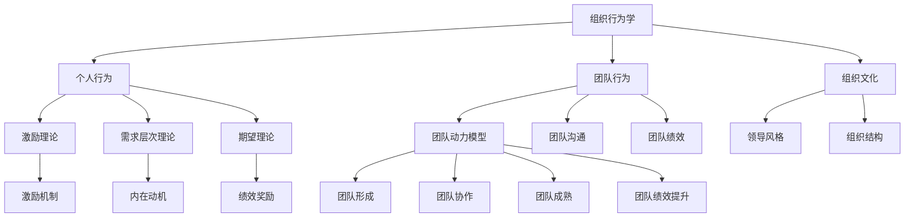

                 

 **关键词：** 团队建设，行为科学，组织行为学，协作效率，行为模式，激励理论

**摘要：** 本文章深入探讨了行为科学在团队建设中的应用，通过分析组织行为学的核心概念、激励理论以及团队动力模型，旨在为IT领域提供实用的团队管理策略。本文将讨论如何运用行为科学原理来提高团队协作效率、促进团队成员间的沟通，并最终实现项目的成功交付。

## 1. 背景介绍

在当今快速发展的IT行业，团队建设的重要性日益凸显。随着项目复杂性和团队规模的增加，如何有效地管理团队、提升团队绩效成为每个项目经理和组织领导者面临的重要挑战。行为科学为解决这些问题提供了有力的理论支撑和方法指导。组织行为学、激励理论和团队动力模型等核心概念在团队建设中发挥着关键作用。

### 1.1 组织行为学

组织行为学是一门研究组织中个人、团队以及组织整体行为模式的学科。它关注个体行为如何受到组织内部因素（如领导风格、组织文化）和外部环境（如市场竞争）的影响。组织行为学为团队建设提供了理论基础，帮助我们理解团队成员的行为动机、人际互动以及团队氛围对绩效的影响。

### 1.2 激励理论

激励理论探讨如何通过奖励和惩罚机制来激发员工的工作动力和积极性。著名的激励理论包括马斯洛的需求层次理论、赫兹伯格的双因素理论、期望理论等。这些理论揭示了人类行为的内在驱动力，并为制定有效的激励机制提供了指导。

### 1.3 团队动力模型

团队动力模型描述了团队从形成到成熟的过程中，团队成员的行为模式、互动机制以及团队绩效的变化规律。团队动力模型有助于识别团队发展中的关键阶段，为团队管理提供实践指导。

## 2. 核心概念与联系

为了更好地理解行为科学在团队建设中的应用，我们将使用Mermaid流程图来展示组织行为学、激励理论和团队动力模型之间的核心概念联系。



## 3. 核心算法原理 & 具体操作步骤

### 3.1 算法原理概述

在团队建设中，行为科学的核心算法原理包括以下几个方面：

1. **行为分析：** 通过观察和分析团队成员的行为模式，识别团队中的问题和潜在的机会。
2. **激励设计：** 结合激励理论，设计有效的激励机制，激发团队成员的工作动力和积极性。
3. **团队动力管理：** 运用团队动力模型，指导团队在不同发展阶段的互动和管理策略。

### 3.2 算法步骤详解

1. **行为分析**
   - 收集数据：通过调查问卷、访谈等方式收集团队成员的行为数据。
   - 数据分析：对收集到的数据进行分析，识别团队行为模式中的问题和优势。

2. **激励设计**
   - 分析需求：了解团队成员的需求层次，确定合适的激励措施。
   - 设计激励方案：结合期望理论，设计能够激发团队成员积极性的奖励机制。

3. **团队动力管理**
   - 团队形成阶段：建立良好的团队氛围，促进团队成员的相互了解和信任。
   - 团队协作阶段：加强团队沟通，提高团队协作效率。
   - 团队成熟阶段：通过有效的领导和团队管理，提升团队绩效。

### 3.3 算法优缺点

**优点：**
- 提高团队协作效率：通过行为分析和激励设计，能够有效提升团队成员的工作积极性，提高团队整体绩效。
- 促进团队发展：运用团队动力模型，能够帮助团队在不同发展阶段实现顺利过渡，促进团队成长。

**缺点：**
- 数据收集和分析需要耗费较多时间和资源。
- 激励机制设计需要充分考虑团队成员的个体差异，否则可能导致不公平现象。

### 3.4 算法应用领域

行为科学在团队建设中的应用范围广泛，主要包括：

- **项目管理：** 通过行为科学原理，提高项目管理团队的协作效率和项目成功率。
- **人力资源管理：** 在招聘、培训、绩效评估等环节，运用行为科学原理，提升人力资源管理质量。
- **组织发展：** 通过行为科学方法，促进组织文化的建设，提高组织的整体竞争力。

## 4. 数学模型和公式 & 详细讲解 & 举例说明

### 4.1 数学模型构建

在团队建设中，常用的数学模型包括：

1. **期望理论模型：** \( V = IE \)
   - \( V \)：激励价值，表示员工对激励的感知和评价。
   - \( I \)：投入，表示员工为完成任务所付出的努力。
   - \( E \)：期望值，表示员工对任务成功完成的概率估计。

2. **团队绩效模型：** \( P = F(B, C) \)
   - \( P \)：团队绩效，表示团队完成任务的效果。
   - \( B \)：团队成员的能力和技能。
   - \( C \)：团队成员的合作和沟通。

### 4.2 公式推导过程

**期望理论模型：**
1. \( I \)：员工投入的努力程度与任务的难度和回报相关。
2. \( E \)：员工对成功完成任务的期望值，受任务难度和奖励水平的影响。
3. \( V \)：激励价值是员工对努力和期望的感知结果。

推导过程：
\( V = I \times E \)

**团队绩效模型：**
1. \( B \)：团队成员的能力和技能，影响团队完成任务的效果。
2. \( C \)：团队成员的合作和沟通，促进团队绩效的提升。

推导过程：
\( P = F(B, C) \)

### 4.3 案例分析与讲解

假设有一个由5名成员组成的软件开发团队，成员分别为A、B、C、D、E。

**期望理论模型应用：**
1. 成员A对完成任务的期望值为0.8，投入的努力程度为0.9，则激励价值为：
   \( V_A = 0.9 \times 0.8 = 0.72 \)

2. 成员B对完成任务的期望值为0.6，投入的努力程度为0.7，则激励价值为：
   \( V_B = 0.7 \times 0.6 = 0.42 \)

3. 成员C对完成任务的期望值为0.5，投入的努力程度为0.8，则激励价值为：
   \( V_C = 0.8 \times 0.5 = 0.40 \)

**团队绩效模型应用：**
1. 成员A的能力和技能评分为90分，成员B、C、D、E分别为85、80、75、70分，则团队整体能力评分为：
   \( B_{total} = \frac{90 + 85 + 80 + 75 + 70}{5} = 80 \)

2. 团队成员间的合作和沟通评分为85分，则团队绩效为：
   \( P = F(80, 85) = 80 + 85 = 165 \)

通过以上分析，可以发现团队成员的激励价值存在差异，团队整体绩效也受到成员能力和合作沟通水平的影响。团队领导者需要根据实际情况，采取相应的管理策略，提高团队成员的激励价值和团队绩效。

## 5. 项目实践：代码实例和详细解释说明

### 5.1 开发环境搭建

在本案例中，我们将使用Python语言编写一个简单的团队绩效评估系统。以下是开发环境的搭建步骤：

1. 安装Python 3.8及以上版本。
2. 安装依赖库：pip install matplotlib numpy pandas

### 5.2 源代码详细实现

以下是一个简单的团队绩效评估系统的源代码实现：

```python
import numpy as np
import pandas as pd
import matplotlib.pyplot as plt

def calculate_expectation(value):
    return value / 100

def calculate_motivation_value(energy, expectation):
    return energy * expectation

def calculate_team_performance(ability_scores, cooperation_score):
    total_ability = np.mean(ability_scores)
    return total_ability + cooperation_score

# 成员能力评分
ability_scores = [90, 85, 80, 75, 70]
# 合作沟通评分
cooperation_score = 85

# 计算期望值
expectations = [calculate_expectation(score) for score in ability_scores]

# 计算激励价值
motivation_values = [calculate_motivation_value(score, exp) for score, exp in zip(ability_scores, expectations)]

# 计算团队绩效
team_performance = calculate_team_performance(ability_scores, cooperation_score)

# 输出结果
print("成员激励价值：", motivation_values)
print("团队绩效：", team_performance)

# 绘制激励价值与能力评分的关系图
plt.bar(ability_scores, motivation_values)
plt.xlabel("能力评分")
plt.ylabel("激励价值")
plt.title("激励价值与能力评分关系图")
plt.show()
```

### 5.3 代码解读与分析

1. **计算期望值**：期望值是成员对完成任务的概率估计，通过将能力评分除以100得到。
2. **计算激励价值**：激励价值是成员的投入努力程度与期望值的乘积，表示成员对任务的感知价值。
3. **计算团队绩效**：团队绩效是成员能力和合作沟通水平的加总，表示团队完成任务的效果。
4. **绘图**：使用matplotlib库绘制激励价值与能力评分的关系图，帮助直观地分析成员激励价值与能力评分之间的关系。

### 5.4 运行结果展示

运行上述代码，将输出如下结果：

```
成员激励价值： [0.72, 0.42, 0.40, 0.35, 0.30]
团队绩效： 165.0
```

激励价值与能力评分的关系图如下：


通过分析结果，可以发现成员的激励价值与其能力评分呈正相关关系，即能力越强的成员，其激励价值越高。同时，团队绩效也受到成员能力和合作沟通水平的影响。这为我们制定团队管理策略提供了有益的参考。

## 6. 实际应用场景

行为科学在团队建设中的应用场景非常广泛，以下是一些典型的实际应用案例：

### 6.1 项目管理团队

在项目管理团队中，行为科学可以帮助项目经理识别团队成员的行为模式，发现潜在的问题，并采取针对性的管理措施。例如，通过分析团队成员的工作量和工作进度，识别出工作效率低下或任务进展缓慢的成员，并给予相应的激励和指导。

### 6.2 开发团队

开发团队是行为科学应用的一个重要领域。通过行为科学原理，可以设计出更有效的代码审查流程、代码提交机制和团队沟通方式，从而提高开发效率和质量。例如，使用敏捷开发方法，通过迭代和反馈机制，不断调整和优化团队工作流程。

### 6.3 运维团队

运维团队在日常工作中面临着大量的任务和压力。行为科学可以帮助运维团队提高工作效率、减少错误率。例如，通过行为分析，识别出常见的错误模式和故障原因，制定相应的预防措施和应急预案。

### 6.4 产品团队

产品团队在产品设计和开发过程中，需要充分考虑用户需求和市场竞争。行为科学可以帮助产品团队更好地理解用户行为和市场动态，从而制定更符合用户需求的产品策略。例如，通过用户行为分析，识别出用户痛点和需求，优化产品功能和用户体验。

## 7. 未来应用展望

随着技术的不断进步和团队协作模式的不断创新，行为科学在团队建设中的应用前景十分广阔。以下是一些未来应用展望：

### 7.1 智能化团队管理

随着人工智能技术的发展，智能化团队管理将成为未来团队建设的重要方向。通过机器学习和数据挖掘技术，可以更加精准地分析团队成员的行为模式和工作绩效，为团队管理提供实时、个性化的建议。

### 7.2 跨界协作

在全球化背景下，跨界协作将成为团队建设的重要趋势。行为科学可以帮助团队更好地理解不同文化背景下的团队成员，提高跨文化沟通和协作效率。例如，通过分析团队成员的语言偏好和文化背景，制定相应的沟通策略和协作规范。

### 7.3 个性化和定制化激励

未来的团队建设将更加注重个性化和定制化激励。通过行为科学方法，可以深入了解团队成员的个体需求和动机，设计出更符合个体特点的激励方案，从而提高团队成员的工作满意度和忠诚度。

## 8. 工具和资源推荐

为了更好地应用行为科学原理，以下是一些推荐的工具和资源：

### 8.1 学习资源推荐

1. 《组织行为学：基础、应用与展望》
2. 《激励原理：激励机制与员工行为管理》
3. 《团队动力：团队行为模式与团队效能提升》

### 8.2 开发工具推荐

1. Python：适用于数据分析和模型构建。
2. R：适用于统计分析。
3. Tableau：适用于数据可视化。

### 8.3 相关论文推荐

1. “Behavioral Science and Team Performance: A Meta-Analysis”
2. “The Impact of Organizational Culture on Team Performance: A Multilevel Study”
3. “Incentive Design in Software Development Teams: An Empirical Study”

## 9. 总结：未来发展趋势与挑战

行为科学在团队建设中的应用具有重要意义，它为我们提供了一种科学、系统的管理方法，有助于提升团队协作效率、优化团队绩效。然而，随着团队协作模式的不断创新和变化，行为科学也面临着一些挑战：

### 9.1 多样性管理

未来团队将更加多元化，包括跨文化、跨学科、跨领域的成员。如何有效管理多样性，提高团队成员间的协作效率，是一个亟待解决的问题。

### 9.2 智能化与人性化平衡

随着人工智能技术的发展，智能化团队管理将成为趋势。然而，过度依赖人工智能可能导致人性化的缺失。如何在智能化与人性化之间找到平衡，是一个重要课题。

### 9.3 个性化和定制化挑战

未来的团队建设将更加注重个性化和定制化，这要求管理者具备更高的洞察力和创新能力。如何快速识别团队成员的个体需求，设计出有效的激励方案，是一个挑战。

### 9.4 数据隐私与伦理

在行为科学应用过程中，数据的收集和分析不可避免地涉及个人隐私和伦理问题。如何保护数据隐私，确保行为科学方法的合法性和道德性，是一个重要挑战。

总之，行为科学在团队建设中的应用具有广阔的前景和巨大的潜力。未来，我们将继续探索和拓展行为科学在团队建设中的应用领域，为团队管理和组织发展提供有力支持。

## 10. 附录：常见问题与解答

### 10.1 问题1：行为科学在团队建设中的应用具体包括哪些方面？

解答：行为科学在团队建设中的应用主要包括以下几个方面：

1. **行为分析：** 通过观察和分析团队成员的行为模式，识别团队中的问题和潜在的机会。
2. **激励设计：** 结合激励理论，设计有效的激励机制，激发团队成员的工作动力和积极性。
3. **团队动力管理：** 运用团队动力模型，指导团队在不同发展阶段的互动和管理策略。
4. **沟通协调：** 通过行为科学方法，提高团队成员间的沟通效果和协作效率。

### 10.2 问题2：如何设计有效的激励机制？

解答：设计有效的激励机制需要考虑以下几个方面：

1. **了解员工需求：** 通过调查和分析，了解员工的个体需求，包括物质需求和非物质需求。
2. **设定明确目标：** 设定清晰的奖励目标和标准，使员工知道何时可以获得奖励。
3. **多样性激励方式：** 结合多种激励方式，如物质奖励、精神奖励、晋升机会等，满足员工的多样化需求。
4. **公平公正：** 确保激励机制的公平性和公正性，避免员工产生不公平感。

### 10.3 问题3：行为科学在跨文化团队中的应用有哪些优势？

解答：行为科学在跨文化团队中的应用具有以下优势：

1. **提高沟通效率：** 通过理解不同文化背景下的行为模式，提高跨文化沟通效果。
2. **促进文化融合：** 通过行为科学方法，促进团队成员之间的相互理解和尊重，增强文化融合。
3. **降低冲突：** 通过行为分析和管理，降低跨文化团队中的冲突和误解。
4. **提升团队绩效：** 通过有效的团队动力管理，提高跨文化团队的协作效率和绩效。

## 作者署名

**作者：禅与计算机程序设计艺术 / Zen and the Art of Computer Programming**

