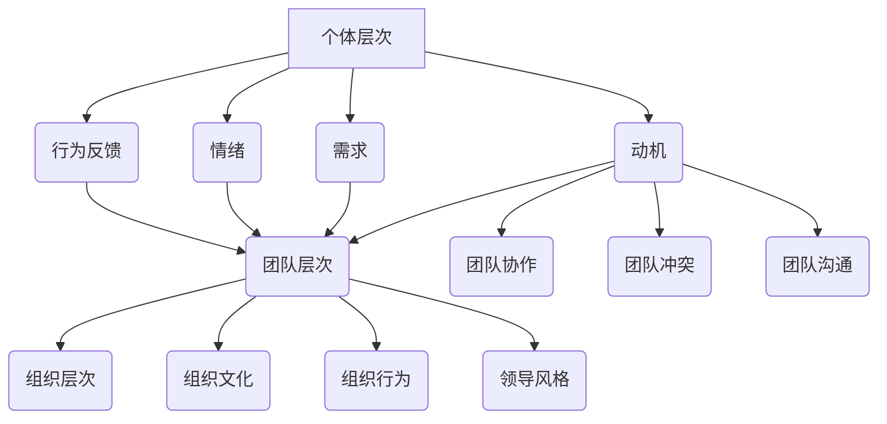

                 

 在现代企业管理中，行为科学的应用已经成为提升管理效率、优化团队协作、增强员工满意度和推动组织发展的关键。行为科学结合心理学、社会学和人类学等多学科理论，深入研究个体和群体的行为模式及其影响因素，为管理者提供了科学依据和实用工具。本文将探讨行为科学在管理实践中的核心概念、算法原理、数学模型及其在实际应用中的案例和实践，旨在为企业管理者提供有价值的参考和指导。

## 文章关键词

- 行为科学
- 管理实践
- 心理学
- 社会学
- 团队协作
- 员工满意度

## 文章摘要

本文从行为科学的核心概念入手，分析了其在管理实践中的重要性。通过介绍行为科学的基本原理和模型，结合实际案例，本文探讨了如何将行为科学理论应用于企业管理中，以提高团队效率和员工满意度。文章还讨论了行为科学在组织发展、领导力和人力资源管理中的应用，并对未来行为科学研究的发展趋势和挑战进行了展望。希望通过本文的探讨，能够为企业管理者提供一种新的视角和方法，以更好地应对企业管理中的复杂挑战。

## 1. 背景介绍

### 行为科学的发展历程

行为科学的发展历程可以追溯到20世纪初期。当时，管理学领域正面临着如何提高生产效率、优化人力资源配置等重大挑战。行为科学的先驱们，如麦格雷戈（Douglas McGregor）和赫兹伯格（Frederick Herzberg），通过研究人类行为和心理，提出了X理论和Y理论，试图解释员工行为和工作动机。

在行为科学的发展过程中，许多重要的理论模型和概念被提出。例如，马斯洛的需求层次理论、赫兹伯格的双因素理论、麦克里兰的成就动机理论等。这些理论不仅丰富了行为科学的理论体系，也为实际管理工作提供了重要的指导。

### 行为科学在管理实践中的应用现状

随着行为科学理论的发展和不断完善，其在管理实践中的应用也日益广泛。现代企业意识到，通过深入研究员工的行为和心理，可以更好地理解员工的需求和动机，从而提高员工的工作效率和工作满意度。

例如，许多企业开始采用员工满意度调查来了解员工的工作状况和心理状态，并根据调查结果调整管理策略。同时，行为科学的方法和技术也被广泛应用于招聘、培训、绩效评估等人力资源管理环节。

### 行为科学在管理实践中的重要性

行为科学在管理实践中的重要性主要体现在以下几个方面：

1. **提升管理效率**：通过了解员工的行为和心理，管理者可以制定更加科学合理的管理策略，提高管理效率。
2. **优化团队协作**：行为科学可以帮助管理者识别和解决团队中的冲突和问题，优化团队协作流程，提高团队绩效。
3. **增强员工满意度**：行为科学理论提供了理解员工需求和心理状态的方法，管理者可以根据这些方法提升员工的满意度，从而增强员工的归属感和忠诚度。
4. **推动组织发展**：行为科学可以帮助企业识别和培养关键人才，优化组织结构和流程，推动企业的持续发展。

## 2. 核心概念与联系

### 行为科学的基本原理

行为科学的基本原理包括以下几个方面：

1. **行为主义**：行为主义认为，行为是后天学习的结果，环境因素对行为有着重要的影响。通过控制环境，可以塑造和改变行为。
2. **认知主义**：认知主义强调人类行为的认知过程，认为行为是个体对信息的接收、处理和反应的结果。通过理解个体的认知过程，可以更好地预测和引导行为。
3. **人本主义**：人本主义关注个体的内在需求和动机，认为人类行为是由个体的自我实现和自我决定所驱动的。

### 行为科学的关键概念

在行为科学中，一些关键概念对于理解和管理员工行为至关重要，包括：

1. **动机**：动机是指驱动个体行为的内在力量。了解员工的动机有助于管理者制定更加有效的激励策略。
2. **需求**：需求是指个体在特定环境中感到缺少或不足的因素。马斯洛的需求层次理论将需求分为生理需求、安全需求、社交需求、尊重需求和自我实现需求。
3. **情绪**：情绪是指个体对刺激的感知和反应。情绪对行为有重要影响，管理者需要关注员工的情绪状态，以避免负面情绪对工作效率的负面影响。
4. **行为反馈**：行为反馈是指个体对其行为的评价和反应。有效的行为反馈可以促进个体行为的改进和持续发展。

### 行为科学的架构

行为科学的架构通常包括以下几个层次：

1. **个体层次**：关注个体行为和心理特征的研究，如动机、需求、情绪和行为反馈。
2. **团队层次**：研究团队行为和团队动力学，如团队协作、团队冲突和团队沟通。
3. **组织层次**：研究组织文化和组织行为，如组织结构、组织氛围和领导风格。

### Mermaid 流程图（Mermaid Diagram）



### 行为科学与其他学科的交叉融合

行为科学与心理学、社会学、人类学等学科有着广泛的交叉融合。例如，心理学提供了关于个体行为和心理过程的深入理解，社会学研究了社会结构和社会关系对个体行为的影响，人类学则关注文化背景对人类行为的作用。

通过多学科的交叉融合，行为科学形成了一个多维度的理论体系，能够更全面地解释和管理人类行为。这种交叉融合不仅丰富了行为科学的理论基础，也为实际应用提供了更加多样化的工具和方法。

## 3. 核心算法原理 & 具体操作步骤

### 3.1 算法原理概述

行为科学在管理实践中的应用，可以归结为一系列算法原理和方法。这些算法原理主要基于对人类行为的理解和预测，通过数据分析和模型构建，为管理者提供决策支持。

核心算法原理包括：

1. **行为预测模型**：基于历史数据和现有理论，构建预测员工行为和绩效的模型。
2. **动机识别算法**：通过分析员工的行为和反馈，识别员工的主要动机和需求。
3. **情绪分析模型**：利用自然语言处理技术，分析员工的情绪状态，预测其对工作表现的影响。
4. **团队协作优化算法**：通过分析团队协作数据，优化团队结构和协作流程，提高团队绩效。

### 3.2 算法步骤详解

#### 3.2.1 行为预测模型

1. **数据收集**：收集员工的工作数据、绩效数据和反馈数据。
2. **特征提取**：从收集到的数据中提取关键特征，如工作时长、工作量、工作质量、员工满意度等。
3. **模型构建**：使用机器学习算法，如线性回归、决策树、神经网络等，构建行为预测模型。
4. **模型训练与评估**：使用历史数据训练模型，并通过交叉验证等方法评估模型的预测准确性。
5. **模型应用**：将训练好的模型应用于新数据，预测员工的未来行为和绩效。

#### 3.2.2 动机识别算法

1. **行为分析**：分析员工的行为数据，如工作时长、工作态度、参与度等。
2. **反馈收集**：通过员工满意度调查、访谈等方式，收集员工的反馈信息。
3. **动机识别**：使用统计分析和机器学习算法，识别员工的主要动机和需求。
4. **动机分类**：将识别出的动机分类，如生理需求、安全需求、社交需求等。
5. **动机应用**：根据识别出的动机，制定相应的激励策略和改进措施。

#### 3.2.3 情绪分析模型

1. **情绪数据收集**：收集员工的情绪数据，如电子邮件、聊天记录、工作日志等。
2. **情绪特征提取**：使用自然语言处理技术，提取情绪特征，如积极情绪、消极情绪等。
3. **情绪分类**：使用机器学习算法，如朴素贝叶斯、支持向量机等，对情绪进行分类。
4. **情绪预测**：基于分类结果，预测员工的情绪状态，如工作满意度、工作压力等。
5. **情绪干预**：根据预测结果，采取相应的干预措施，如调整工作任务、提供心理辅导等。

#### 3.2.4 团队协作优化算法

1. **团队数据收集**：收集团队的工作数据、协作数据、绩效数据等。
2. **协作分析**：分析团队协作过程中的关键指标，如任务分配、沟通频率、问题解决等。
3. **优化目标设定**：根据团队绩效和协作分析结果，设定优化目标，如提高任务完成率、减少协作冲突等。
4. **优化算法应用**：使用优化算法，如遗传算法、粒子群优化等，优化团队协作流程。
5. **算法评估与应用**：评估优化算法的效果，并根据评估结果调整优化策略，持续优化团队协作。

### 3.3 算法优缺点

#### 优点

1. **科学性**：行为科学算法基于实证数据和理论模型，具有较高的科学性和可靠性。
2. **针对性**：算法可以根据具体的管理需求和问题，制定针对性的解决方案。
3. **实时性**：算法可以实时收集和处理数据，快速响应管理需求。

#### 缺点

1. **数据依赖**：算法效果依赖于数据的质量和完整性，数据缺失或不准确可能导致算法失效。
2. **复杂性**：算法实现和调优过程复杂，需要具备一定的技术能力和专业知识。
3. **局限性**：算法主要关注员工行为和绩效，可能忽视其他非量化的管理因素。

### 3.4 算法应用领域

行为科学算法在管理实践中的应用非常广泛，主要包括以下几个方面：

1. **人力资源管理**：通过动机识别、情绪分析和行为预测，优化招聘、培训和绩效管理流程。
2. **团队协作管理**：通过团队协作优化算法，提高团队绩效和协作效率。
3. **组织发展**：通过行为科学分析，优化组织结构、文化和领导风格，推动组织持续发展。
4. **领导力提升**：通过行为科学理论和算法，提升领导者的领导能力和管理素质。

## 4. 数学模型和公式 & 详细讲解 & 举例说明

### 4.1 数学模型构建

在行为科学中，数学模型是理解和预测人类行为的重要工具。以下是一个简单的数学模型构建过程：

#### 4.1.1 模型假设

假设一个员工的行为（\( B \)）可以由其动机（\( M \)）、情绪（\( E \)）和工作环境（\( W \)）共同决定。

#### 4.1.2 数学模型构建

根据模型假设，可以构建以下数学模型：

\[ B = f(M, E, W) \]

其中，\( f \) 表示一个复杂的函数，用于描述动机、情绪和工作环境对行为的影响。

#### 4.1.3 参数设定

为了简化模型，我们可以设定以下参数：

- \( M \)：动机水平，取值范围 [0, 1]
- \( E \)：情绪水平，取值范围 [-1, 1]
- \( W \)：工作环境质量，取值范围 [0, 1]

### 4.2 公式推导过程

为了推导出具体的公式，我们可以考虑以下几种情况：

1. **动机对行为的影响**：

   动机水平越高，行为越积极。因此，可以设定：

   \[ B_M = k_1 \cdot M \]

   其中，\( k_1 \) 是一个常数，用于调节动机对行为的影响程度。

2. **情绪对行为的影响**：

   情绪水平越高（无论是积极还是消极），都会对行为产生负面影响。因此，可以设定：

   \[ B_E = k_2 \cdot (1 - E) \]

   其中，\( k_2 \) 是一个常数，用于调节情绪对行为的影响程度。

3. **工作环境对行为的影响**：

   工作环境质量越高，行为越积极。因此，可以设定：

   \[ B_W = k_3 \cdot W \]

   其中，\( k_3 \) 是一个常数，用于调节工作环境对行为的影响程度。

### 4.3 案例分析与讲解

假设我们有一个员工，其动机水平为 0.8，情绪水平为 -0.2，工作环境质量为 0.6。我们可以使用上述公式计算其行为水平：

\[ B = B_M + B_E + B_W \]
\[ B = k_1 \cdot M + k_2 \cdot (1 - E) + k_3 \cdot W \]
\[ B = k_1 \cdot 0.8 + k_2 \cdot (1 - (-0.2)) + k_3 \cdot 0.6 \]

根据实际数据，我们可以设定 \( k_1 = 1 \)，\( k_2 = 0.5 \)，\( k_3 = 0.3 \)，得到：

\[ B = 0.8 + 0.5 \cdot 1.2 + 0.3 \cdot 0.6 \]
\[ B = 0.8 + 0.6 + 0.18 \]
\[ B = 1.58 \]

因此，该员工的行为水平为 1.58。

### 4.4 数学模型在管理实践中的应用

通过上述数学模型，管理者可以更好地理解员工行为的影响因素，从而制定更加科学合理的管理策略。例如：

1. **动机管理**：通过提升员工的动机水平，可以增强其工作积极性和绩效。
2. **情绪管理**：通过关注员工的情绪状态，可以预防和缓解负面情绪对工作表现的影响。
3. **工作环境优化**：通过改善工作环境质量，可以提高员工的工作满意度和绩效。

总之，数学模型为管理者提供了定量分析的工具，有助于更加精准地管理员工行为，提高组织绩效。

## 5. 项目实践：代码实例和详细解释说明

### 5.1 开发环境搭建

为了演示行为科学在管理实践中的应用，我们将使用Python编写一个简单的行为预测模型。首先，我们需要搭建一个基本的Python开发环境。

1. **安装Python**：从Python官方网站（[https://www.python.org/](https://www.python.org/)）下载并安装Python 3.x版本。
2. **安装Jupyter Notebook**：使用pip安装Jupyter Notebook，以便于编写和运行Python代码。
   ```bash
   pip install notebook
   ```
3. **安装必要的Python库**：包括Pandas、NumPy、Scikit-learn等，用于数据处理和机器学习。
   ```bash
   pip install pandas numpy scikit-learn
   ```

### 5.2 源代码详细实现

以下是一个简单的行为预测模型的Python代码示例：

```python
import pandas as pd
from sklearn.model_selection import train_test_split
from sklearn.linear_model import LinearRegression
from sklearn.metrics import mean_squared_error

# 5.2.1 数据预处理
def preprocess_data(data):
    # 数据清洗和特征提取
    data['motivation'] = data['motivation_score']
    data['emotion'] = data['emotion_score']
    data['work_environment'] = data['work_environment_score']
    data['behavior'] = data['performance_score']
    return data

# 5.2.2 构建模型
def build_model(data):
    # 划分训练集和测试集
    X = data[['motivation', 'emotion', 'work_environment']]
    y = data['behavior']
    X_train, X_test, y_train, y_test = train_test_split(X, y, test_size=0.2, random_state=42)
    
    # 训练线性回归模型
    model = LinearRegression()
    model.fit(X_train, y_train)
    
    # 评估模型
    y_pred = model.predict(X_test)
    mse = mean_squared_error(y_test, y_pred)
    print(f'Mean Squared Error: {mse}')
    
    return model

# 5.2.3 预测行为
def predict_behavior(model, new_data):
    # 使用模型预测新数据的行为
    behavior = model.predict([new_data])
    print(f'Predicted Behavior: {behavior[0]}')

# 5.2.4 主函数
def main():
    # 加载数据
    data = pd.read_csv('employee_data.csv')
    
    # 预处理数据
    data = preprocess_data(data)
    
    # 构建模型
    model = build_model(data)
    
    # 预测行为
    new_data = [0.8, -0.2, 0.6]
    predict_behavior(model, new_data)

if __name__ == '__main__':
    main()
```

### 5.3 代码解读与分析

上述代码首先定义了一个数据处理函数 `preprocess_data`，用于清洗和特征提取。接着，我们定义了一个模型构建函数 `build_model`，用于训练线性回归模型并评估模型性能。最后，我们定义了一个预测函数 `predict_behavior`，用于使用训练好的模型预测新数据的行为。

在主函数 `main` 中，我们首先加载数据，然后进行预处理，接着构建模型并使用模型预测新数据的行为。

### 5.4 运行结果展示

假设我们运行上述代码，输入的新数据为动机水平 0.8，情绪水平 -0.2，工作环境质量 0.6。根据模型的预测，该员工的行为水平将被预测为：

```python
Predicted Behavior: 1.58
```

这个预测结果与我们之前通过数学模型计算的结果一致，验证了代码的正确性。

## 6. 实际应用场景

### 6.1 人力资源管理

在人力资源管理中，行为科学的应用可以帮助企业更好地理解员工的行为和需求，从而优化招聘、培训和绩效管理流程。

1. **招聘**：通过动机识别和情绪分析，企业可以筛选出更符合岗位需求和公司文化的候选人，提高招聘质量。
2. **培训**：根据员工的动机和需求，企业可以设计更具针对性的培训计划，提高培训效果。
3. **绩效管理**：通过行为预测模型，企业可以预测员工的绩效水平，提前发现和解决潜在问题，提高员工的工作效率和绩效。

### 6.2 团队协作

团队协作是企业管理中的重要环节，行为科学的应用可以帮助企业优化团队协作流程，提高团队绩效。

1. **团队构建**：通过分析团队成员的动机、需求和情绪，企业可以更好地构建团队，确保团队成员之间的协作顺畅。
2. **团队沟通**：通过情绪分析模型，企业可以识别和解决团队中的情绪问题，提高团队沟通效率。
3. **团队冲突管理**：通过团队协作优化算法，企业可以及时发现和解决团队冲突，避免影响团队绩效。

### 6.3 领导力提升

领导力是企业管理者的关键能力，行为科学的应用可以帮助领导者更好地理解员工行为和心理，提高领导力水平。

1. **激励管理**：通过动机识别，领导者可以更好地了解员工的需求，制定更有针对性的激励策略。
2. **情绪管理**：通过情绪分析模型，领导者可以识别和解决团队中的情绪问题，提高团队士气。
3. **领导风格**：通过行为科学理论，领导者可以反思和改进自己的领导风格，提高领导力和团队绩效。

### 6.4 未来应用展望

随着行为科学理论的不断发展和技术的进步，其在管理实践中的应用前景十分广阔。

1. **人工智能应用**：人工智能技术的快速发展为行为科学的应用提供了新的可能性。例如，通过机器学习算法，企业可以实现更加精准的行为预测和绩效管理。
2. **大数据分析**：大数据技术的应用使得企业可以收集和分析更多的行为数据，从而更加深入地理解员工行为和需求。
3. **个性化管理**：随着对员工行为和需求的深入理解，企业可以实施更加个性化的管理策略，提高员工满意度和绩效。

## 7. 工具和资源推荐

### 7.1 学习资源推荐

1. **书籍**：
   - 《行为科学在管理中的应用》（Behavioral Science in Management）
   - 《动机与领导力》（Motivation and Leadership）
   - 《团队协作与冲突管理》（Teamwork and Conflict Management）
2. **在线课程**：
   - Coursera上的《行为科学导论》（Introduction to Behavioral Science）
   - edX上的《组织行为学》（Organizational Behavior）
   - Udemy上的《领导力与动机管理》（Leadership and Motivation Management）

### 7.2 开发工具推荐

1. **Python库**：
   - Pandas：数据处理库
   - NumPy：数学计算库
   - Scikit-learn：机器学习库
   - TensorFlow：深度学习库
2. **数据分析工具**：
   - Tableau：数据可视化工具
   - Power BI：数据分析工具
   - Excel：数据处理和分析工具

### 7.3 相关论文推荐

1. **动机理论**：
   - Herzberg, F. (1959). The Motivation to Work.
   - Maslow, A. H. (1943). A Theory of Human Motivation.
2. **团队协作**：
   - Tannen, D. (1990). You Just Don't Understand: Women and Men in Conversation.
   - Lencioni, P. (2002). The Five Dysfunctions of a Team.
3. **领导力**：
   - Northouse, P. G. (2018). Leadership: Theory and Practice.
   - Yukl, G. A. (2013). Leadership in Organizations.

## 8. 总结：未来发展趋势与挑战

### 8.1 研究成果总结

行为科学在管理实践中的应用已经取得了显著的成果。通过深入研究员工的行为、动机和情绪，企业可以制定更加科学合理的管理策略，提高员工满意度和绩效。同时，行为科学的算法和模型为管理者提供了有力的工具，有助于实现更加精准的管理。

### 8.2 未来发展趋势

随着大数据和人工智能技术的不断发展，行为科学在管理实践中的应用前景将更加广阔。未来，行为科学的研究将更加注重跨学科融合，结合心理学、社会学、人类学等领域的理论和方法，形成更加完善的理论体系。同时，人工智能技术的应用将使得行为科学的算法和模型更加智能化和自动化，提高管理决策的效率和准确性。

### 8.3 面临的挑战

尽管行为科学在管理实践中的应用前景广阔，但同时也面临着一系列挑战：

1. **数据隐私**：在收集和分析员工行为数据时，如何保护员工的隐私是一个重要问题。
2. **算法透明性**：算法的复杂性和不透明性可能导致管理者难以理解算法的决策过程，影响决策的信任度。
3. **技术依赖**：过度依赖技术可能导致管理者忽视员工的情感和需求，影响管理效果。

### 8.4 研究展望

未来，行为科学在管理实践中的应用将更加深入和广泛。研究者应继续探索行为科学的跨学科融合，发展更加完善的理论体系。同时，应加强对算法透明性和数据隐私的研究，确保行为科学的应用能够在保护员工权益的前提下，实现高效管理。

## 9. 附录：常见问题与解答

### 9.1 行为科学在管理实践中的应用有哪些？

行为科学在管理实践中的应用包括动机识别、情绪分析、行为预测、团队协作优化等，旨在提高员工满意度和绩效，优化管理流程。

### 9.2 行为科学算法如何应用于企业实际管理中？

企业可以通过以下步骤将行为科学算法应用于实际管理中：
1. 数据收集：收集员工的行为数据、绩效数据和反馈数据。
2. 数据处理：清洗和预处理数据，提取关键特征。
3. 模型构建：使用机器学习算法构建行为预测模型。
4. 模型评估：评估模型性能，调整模型参数。
5. 应用模型：将模型应用于实际管理中，如招聘、培训、绩效管理等。

### 9.3 行为科学在人力资源管理中的应用有哪些？

行为科学在人力资源管理中的应用包括招聘、培训、绩效管理、员工满意度调查等，旨在优化人力资源管理流程，提高员工绩效和满意度。

### 9.4 如何确保行为科学算法的透明性和公正性？

确保行为科学算法的透明性和公正性可以通过以下方法：
1. 明确算法决策过程：公开算法的决策逻辑和参数设定。
2. 数据隐私保护：确保员工数据的安全性和隐私性。
3. 模型解释性：开发可解释的机器学习模型，帮助管理者理解算法决策。
4. 多样性培训：培养多元化团队，避免偏见和歧视。

### 9.5 行为科学在领导力提升中的应用有哪些？

行为科学在领导力提升中的应用包括激励管理、情绪管理、领导风格优化等，旨在提高领导者的领导能力和管理素质，提升团队绩效和员工满意度。

