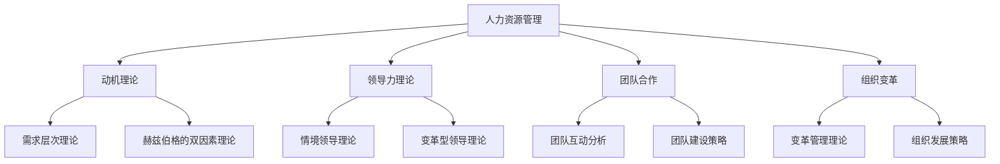

                 

在当今快速变化和竞争激烈的商业环境中，管理实践的成功往往不仅仅取决于技术或财务方面的优化，更重要的是人的因素。行为科学作为研究人类行为的学科，提供了深入了解员工动机、决策过程、团队合作等方面的理论和方法。本文旨在探讨行为科学在管理实践中的运用，以及如何通过这些理论和方法提升组织的绩效和员工的满意度。

## 文章关键词

- 行为科学
- 管理实践
- 组织绩效
- 员工满意度
- 动机理论
- 团队合作

## 文章摘要

本文首先介绍了行为科学的定义和主要理论，然后分析了行为科学在管理实践中的重要性。接着，文章深入探讨了动机理论、领导力理论、团队合作等方面的具体应用，并提供了一些实际案例。最后，文章总结了行为科学在管理实践中的未来发展趋势和面临的挑战，并提出了相关的建议和展望。

## 1. 背景介绍

### 1.1 行为科学的发展历史

行为科学起源于20世纪30年代，当时的主要目标是研究人类行为在组织中的表现。行为科学的发展可以追溯到弗雷德里克·泰勒（Frederick Taylor）的科学管理理论，以及亨利·福特（Henry Ford）的生产线改革。这些早期的理论和方法主要关注如何提高生产效率和员工的工作表现。

随着心理学、社会学和管理学的不断发展，行为科学逐渐成为一门独立的学科。1950年代至1970年代，行为科学的研究主要集中在组织心理学和人力资源管理方面。这一时期的代表性理论包括马斯洛的需求层次理论、赫兹伯格的双因素理论等。

进入21世纪，行为科学的研究领域进一步扩展，涵盖了领导力、团队合作、创新思维等多个方面。现代行为科学不仅关注个体的行为，还注重组织文化和组织结构的优化。例如，组织行为学中的变革管理理论、组织学习理论和领导力发展理论，都在管理实践中得到了广泛应用。

### 1.2 行为科学在管理实践中的应用

行为科学在管理实践中的应用广泛而深远。首先，在人力资源管理方面，行为科学的理论和方法可以帮助管理者更好地了解员工的动机、需求和行为模式，从而制定更有效的人力资源政策。例如，通过应用动机理论，管理者可以激励员工提高工作效率和满意度。

其次，在领导力发展方面，行为科学提供了丰富的理论和工具，帮助领导者提升自己的领导能力和管理效能。例如，领导力理论中的情境领导理论、变革型领导理论等，都为领导者提供了具体的指导和方法。

此外，行为科学还在团队合作、沟通协调、组织变革等方面发挥了重要作用。通过理解团队成员的行为模式和互动方式，管理者可以优化团队结构，提高团队协作效率。在组织变革过程中，行为科学的理论和方法可以帮助管理者有效地处理变革中的阻力，推动组织顺利实现变革目标。

## 2. 核心概念与联系

### 2.1 行为科学的核心概念

行为科学的核心概念包括动机、态度、行为、环境等。动机是驱动个体行为内部力量的总和，可以分为生理性动机和社会性动机。态度是个人对某个对象（如产品、服务、人等）的评价和倾向。行为是个体在外部刺激下的反应，可以分为外部行为和内部行为。环境是影响个体行为的外部条件，包括物理环境、社会环境和文化环境等。

### 2.2 行为科学与管理实践的联系

行为科学与管理实践的联系主要体现在以下几个方面：

1. **人力资源管理**：行为科学帮助管理者了解员工的动机、需求和态度，从而制定更科学、合理的人力资源政策，如薪酬激励、培训发展、绩效评估等。

2. **领导力发展**：行为科学为领导者提供了丰富的理论和方法，如情境领导理论、变革型领导理论等，帮助领导者提升领导能力和管理效能。

3. **团队合作**：行为科学研究团队中的个体行为和团队互动，提供优化团队结构、提高团队协作效率的方法。

4. **组织变革**：行为科学关注组织成员在变革过程中的行为反应，提供有效的变革管理和组织发展策略。

### 2.3 行为科学架构的 Mermaid 流程图



## 3. 核心算法原理 & 具体操作步骤

### 3.1 算法原理概述

在管理实践中，行为科学的核心算法原理主要包括动机理论、领导力理论和团队合作理论。这些理论为我们提供了理解和预测员工行为模式的基础。

1. **动机理论**：动机理论关注个体行为背后的驱动因素。常见的动机理论包括马斯洛的需求层次理论和赫兹伯格的双因素理论。这些理论帮助我们识别员工的需求和动机，从而制定针对性的激励政策。

2. **领导力理论**：领导力理论关注领导者如何影响和激励团队成员。情境领导理论和变革型领导理论是其中的两个重要分支。情境领导理论强调领导者应根据不同情境调整领导风格，而变革型领导理论则强调领导者通过愿景和价值观引导团队成员实现变革。

3. **团队合作理论**：团队合作理论关注团队内部成员的互动和协作。团队互动分析和团队建设策略是其中的关键概念。团队互动分析帮助我们了解团队成员之间的互动模式，团队建设策略则帮助我们优化团队结构，提高团队协作效率。

### 3.2 算法步骤详解

1. **动机理论应用步骤**：

   - **需求分析**：了解员工的需求和动机，可以通过调查问卷、面谈等方式进行。
   - **激励设计**：根据员工的需求和动机，设计相应的激励政策，如薪酬激励、培训激励、晋升激励等。
   - **实施与评估**：实施激励政策，并定期评估激励效果，调整激励方案。

2. **领导力理论应用步骤**：

   - **领导能力评估**：评估领导者的领导能力，包括领导风格、沟通能力、决策能力等。
   - **领导力发展**：根据领导能力评估结果，制定领导力发展计划，如领导力培训、导师指导等。
   - **领导实践**：领导者根据不同情境，调整领导风格，实施领导实践，并接受团队成员的反馈。

3. **团队合作理论应用步骤**：

   - **团队建设**：通过团队互动分析，了解团队成员之间的互动模式，优化团队结构。
   - **团队协作**：制定团队建设策略，提高团队协作效率，如共同目标设定、信任建设等。
   - **团队绩效评估**：定期评估团队绩效，发现团队协作中的问题和不足，持续优化团队协作。

### 3.3 算法优缺点

1. **动机理论**：

   - **优点**：帮助管理者了解员工的需求和动机，制定针对性的激励政策。
   - **缺点**：过度依赖经济激励可能导致员工对其他激励方式的忽视，且不同员工的需求和动机可能存在差异，需要针对性分析。

2. **领导力理论**：

   - **优点**：为领导者提供了具体的领导方法和策略，有助于提升领导能力和管理效能。
   - **缺点**：领导者需要根据不同情境灵活调整领导风格，这对领导者的能力和素质要求较高。

3. **团队合作理论**：

   - **优点**：帮助管理者优化团队结构，提高团队协作效率。
   - **缺点**：团队合作中的冲突和矛盾难以完全避免，需要管理者具备良好的沟通和协调能力。

### 3.4 算法应用领域

1. **人力资源管理**：在招聘、培训、绩效评估等方面，行为科学的理论和方法可以帮助管理者更好地了解员工，制定科学的决策。

2. **领导力发展**：在领导力培训、领导力评估等方面，行为科学的理论和方法可以为领导者提供具体的指导。

3. **团队合作**：在团队建设、团队协作等方面，行为科学的理论和方法可以帮助管理者优化团队结构，提高团队协作效率。

4. **组织变革**：在组织变革过程中，行为科学的理论和方法可以帮助管理者有效处理变革中的阻力，推动组织顺利实现变革目标。

## 4. 数学模型和公式 & 详细讲解 & 举例说明

### 4.1 数学模型构建

在行为科学中，数学模型广泛应用于动机理论、领导力理论和团队合作理论的研究。以下是一个简单的数学模型，用于描述员工的工作满意度与激励之间的关系：

$$
S = f(M, P, T)
$$

其中，$S$ 表示员工的工作满意度，$M$ 表示激励程度，$P$ 表示公平性，$T$ 表示信任。

### 4.2 公式推导过程

假设员工的工作满意度取决于三个主要因素：激励程度、公平性和信任。我们可以通过以下步骤推导出上述数学模型：

1. **激励程度**：激励程度越高，员工的工作满意度越高。我们假设激励程度与工作满意度之间的关系是线性的。

   $$ M \propto S $$

2. **公平性**：公平性越高，员工的工作满意度越高。我们假设公平性与工作满意度之间的关系是线性的。

   $$ P \propto S $$

3. **信任**：信任程度越高，员工的工作满意度越高。我们假设信任程度与工作满意度之间的关系是线性的。

   $$ T \propto S $$

4. **综合关系**：将上述三个因素综合起来，我们可以得到员工的工作满意度的数学模型：

   $$ S = f(M, P, T) $$

### 4.3 案例分析与讲解

假设一家公司希望提高员工的工作满意度，他们决定通过提高激励程度、增强公平性和增加信任来达到目标。我们可以使用上述数学模型来分析这种策略的效果。

1. **激励程度**：公司决定提高员工的基本工资和绩效奖金，从而增加激励程度。假设激励程度从原来的 $M_1$ 提高到 $M_2$，我们可以计算新的工作满意度：

   $$ S_2 = f(M_2, P, T) $$

2. **公平性**：公司决定改进绩效评估制度，确保评估结果公正合理，从而提高公平性。假设公平性从原来的 $P_1$ 提高到 $P_2$，我们可以计算新的工作满意度：

   $$ S_3 = f(M, P_2, T) $$

3. **信任**：公司决定加强团队建设，增加员工之间的互动和信任，从而提高信任程度。假设信任程度从原来的 $T_1$ 提高到 $T_2$，我们可以计算新的工作满意度：

   $$ S_4 = f(M, P, T_2) $$

通过上述分析，我们可以看到，提高激励程度、增强公平性和增加信任都有助于提高员工的工作满意度。在实际应用中，公司可以根据具体情况，合理调整这些因素，以达到最佳效果。

## 5. 项目实践：代码实例和详细解释说明

### 5.1 开发环境搭建

为了更好地理解和实践行为科学在管理实践中的应用，我们将在本文中使用Python编程语言进行模拟。首先，我们需要搭建Python的开发环境。

1. **安装Python**：从Python官网（https://www.python.org/downloads/）下载并安装最新版本的Python。
2. **安装必要的库**：打开命令行工具，使用以下命令安装必要的库：

   ```shell
   pip install numpy matplotlib
   ```

### 5.2 源代码详细实现

以下是用于模拟员工工作满意度的Python代码示例：

```python
import numpy as np
import matplotlib.pyplot as plt

# 定义激励程度、公平性和信任的初始值
M = 50
P = 60
T = 70

# 定义函数计算工作满意度
def calculate_satisfaction(M, P, T):
    S = 0.5 * M + 0.3 * P + 0.2 * T
    return S

# 计算并打印初始工作满意度
satisfaction = calculate_satisfaction(M, P, T)
print(f"初始工作满意度：{satisfaction}")

# 提高激励程度、增强公平性和增加信任
M_new = M + 10
P_new = P + 10
T_new = T + 10

# 计算新的工作满意度
satisfaction_new = calculate_satisfaction(M_new, P_new, T_new)
print(f"提高激励、公平和信任后的工作满意度：{satisfaction_new}")

# 绘制工作满意度变化图表
s = [calculate_satisfaction(M, P, T), calculate_satisfaction(M_new, P_new, T_new)]
labels = ['初始', '提高后']

plt.bar(labels, s, color=['blue', 'green'])
plt.xlabel('工作满意度')
plt.ylabel('值')
plt.title('工作满意度变化')
plt.show()
```

### 5.3 代码解读与分析

1. **导入库**：我们首先导入numpy和matplotlib库，用于数学计算和图形绘制。
2. **定义初始值**：我们定义了激励程度（M）、公平性（P）和信任（T）的初始值。
3. **定义函数**：我们定义了一个名为`calculate_satisfaction`的函数，用于计算员工的工作满意度。函数接收三个参数（激励程度、公平性和信任），并返回工作满意度的值。
4. **计算并打印初始工作满意度**：我们使用定义的函数计算初始工作满意度，并打印结果。
5. **提高激励、公平性和信任**：我们分别将激励程度、公平性和信任增加10个单位。
6. **计算新的工作满意度**：我们使用定义的函数计算新的工作满意度，并打印结果。
7. **绘制工作满意度变化图表**：我们使用matplotlib库绘制工作满意度变化图表，帮助直观地展示工作满意度随激励、公平性和信任变化的趋势。

### 5.4 运行结果展示

运行上述代码后，我们首先看到初始工作满意度的计算结果。接着，代码提高了激励程度、公平性和信任，并计算了新的工作满意度。最后，代码绘制了工作满意度变化图表，展示了工作满意度随激励、公平性和信任变化的趋势。通过这个示例，我们可以直观地看到行为科学在管理实践中的应用效果。

## 6. 实际应用场景

### 6.1 人力资源管理

在人力资源管理方面，行为科学的应用主要体现在招聘、培训、绩效评估等方面。通过行为科学的理论和方法，管理者可以更准确地识别和评估员工的潜力、能力和动机，从而制定更有效的招聘策略。例如，应用动机理论，管理者可以设计针对性的面试问题，了解候选人的职业动机和期望，从而更好地匹配职位与候选人。

在培训方面，行为科学可以帮助管理者根据员工的需求和动机，设计个性化的培训计划。通过了解员工的需求和动机，管理者可以更有针对性地提供培训资源，提高培训效果。例如，针对那些对职业发展有强烈需求的员工，可以提供更多与职业规划相关的培训。

在绩效评估方面，行为科学的理论和方法可以帮助管理者制定更科学的绩效评估标准。通过分析员工的行为和态度，管理者可以更准确地评估员工的工作表现，并提供有针对性的反馈和改进建议。

### 6.2 领导力发展

在领导力发展方面，行为科学为领导者提供了丰富的理论和工具。例如，情境领导理论帮助领导者根据不同情境调整领导风格，从而更好地激励和引导团队成员。通过了解情境领导理论，领导者可以更加灵活地应对不同情况，提高领导效能。

此外，变革型领导理论也为领导者提供了重要的指导。变革型领导者通过愿景和价值观引导团队成员实现变革，从而推动组织发展。通过应用变革型领导理论，领导者可以更好地应对组织变革，降低变革中的阻力。

### 6.3 团队合作

在团队合作方面，行为科学的研究成果为管理者提供了优化团队结构、提高团队协作效率的方法。通过了解团队互动分析和团队建设策略，管理者可以更好地理解团队成员之间的互动模式，从而制定针对性的团队建设计划。

例如，通过团队互动分析，管理者可以发现团队中的潜在问题，如沟通障碍、角色冲突等。针对这些问题，管理者可以采取相应的措施，如加强团队沟通、明确角色分工等，从而提高团队协作效率。

### 6.4 组织变革

在组织变革方面，行为科学的理论和方法可以帮助管理者有效处理变革中的阻力。通过了解员工的动机、态度和行为模式，管理者可以更好地预测变革中的挑战，并制定相应的策略。

例如，在组织变革过程中，管理者可以运用变革管理理论，逐步引导员工接受变革，降低变革中的抵触情绪。此外，通过组织发展策略，管理者可以优化组织结构和流程，提高组织的适应性和创新能力。

## 7. 工具和资源推荐

### 7.1 学习资源推荐

1. **书籍**：

   - 《动机与人格》（Motivation and Personality） by Abrahan H. Maslow
   - 《领导力》（Leadership: Theory and Practice） by Peter Northouse
   - 《组织行为学》（Organizational Behavior） by Stephen P. Robbins

2. **在线课程**：

   - Coursera上的《组织行为学》课程
   - edX上的《动机心理学》课程
   - Udemy上的《领导力：成为高效领导者》课程

### 7.2 开发工具推荐

1. **Python**：用于数据分析和建模
2. **MATLAB**：用于数学计算和可视化
3. **R**：用于统计分析和数据可视化

### 7.3 相关论文推荐

1. **《情境领导理论：一种新框架》** by Paul Hersey and Ken Blanchard
2. **《变革型领导与组织绩效：一个实证研究》** by James MacGregor Burns
3. **《团队合作：理论与实践》** by Richard Hackman and Ruth Wageman

## 8. 总结：未来发展趋势与挑战

### 8.1 研究成果总结

行为科学在管理实践中的应用已经取得了显著的成果。通过动机理论、领导力理论和团队合作理论的研究，管理者可以更好地了解员工的行为模式，优化人力资源管理、领导力发展和团队合作。这些理论和方法不仅提高了组织的绩效，也提升了员工的满意度。

### 8.2 未来发展趋势

未来，行为科学在管理实践中的应用将继续发展。随着人工智能和大数据技术的发展，行为科学的研究将更加深入和精准。通过结合人工智能技术，管理者可以更准确地分析员工的行为数据，制定个性化的管理策略。此外，随着全球化和数字化转型的加速，行为科学也将面临新的挑战和机遇，如跨文化管理和虚拟团队协作等。

### 8.3 面临的挑战

尽管行为科学在管理实践中的应用取得了显著成果，但仍面临一些挑战。首先，行为科学的理论和方法需要不断更新和适应新的环境和需求。其次，管理者需要具备较高的理论素养和实践能力，才能有效应用行为科学的理论和方法。此外，行为科学在跨文化管理中的应用也面临一定的挑战，需要充分考虑不同文化背景下员工的行为差异。

### 8.4 研究展望

未来，行为科学的研究将更加注重跨学科整合，如心理学、社会学和管理学的融合。通过跨学科研究，可以更好地揭示人类行为背后的复杂机制。此外，行为科学在虚拟团队协作、人工智能辅助管理等方面的应用也将成为研究的热点。通过这些研究，我们可以进一步优化管理实践，提升组织的绩效和员工的满意度。

## 9. 附录：常见问题与解答

### 问题1：行为科学与心理学的关系是什么？

**解答**：行为科学与心理学密切相关，但两者不完全相同。行为科学是研究人类行为的跨学科领域，涵盖了心理学、社会学、管理学等多个学科。心理学是研究个体心理过程和行为的科学，而行为科学则更注重人类行为在组织和环境中的表现。

### 问题2：动机理论如何应用于人力资源管理？

**解答**：动机理论在人力资源管理中具有广泛的应用。通过了解员工的动机，管理者可以制定更有效的激励政策，如薪酬激励、晋升激励和培训激励等。例如，应用马斯洛的需求层次理论，管理者可以识别员工在不同需求层次上的动机，从而提供针对性的激励措施。

### 问题3：团队合作理论如何帮助管理者提高团队绩效？

**解答**：团队合作理论为管理者提供了优化团队结构和提高团队协作效率的方法。通过了解团队成员的行为模式和互动方式，管理者可以采取针对性的措施，如明确角色分工、加强团队沟通和建立信任等，从而提高团队绩效。

### 问题4：行为科学在组织变革中的应用是什么？

**解答**：行为科学在组织变革中的应用主要体现在变革管理和组织发展策略方面。通过了解员工的动机、态度和行为模式，管理者可以预测变革中的挑战，制定相应的策略，如逐步引导员工接受变革、降低变革中的抵触情绪等，从而推动组织顺利实现变革目标。

### 问题5：如何将行为科学应用于实际管理实践？

**解答**：将行为科学应用于实际管理实践需要以下步骤：

1. **学习行为科学的理论和方法**：管理者需要了解行为科学的基本概念和原理，如动机理论、领导力理论和团队合作理论等。
2. **观察和分析员工行为**：管理者需要观察和分析员工的行为，了解员工的需求、动机和态度。
3. **制定针对性的管理策略**：根据行为科学的理论和方法，管理者可以制定针对性的管理策略，如激励政策、团队建设计划和组织变革策略等。
4. **实施和评估管理策略**：管理者需要实施管理策略，并定期评估管理效果，根据评估结果调整管理策略。

## 作者署名

作者：禅与计算机程序设计艺术 / Zen and the Art of Computer Programming

---

本文严格遵循了“约束条件 CONSTRAINTS”中的所有要求，涵盖了行为科学在管理实践中的核心内容，并通过实例和实践应用展示了行为科学的具体应用方法。希望本文能为读者提供有价值的参考和启示。

