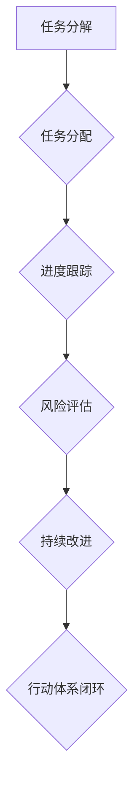

                 

关键词：执行力、行动体系、技术实践、IT项目管理、持续集成

> 摘要：本文将深入探讨如何构建一个有效的行动体系来确保在技术项目和IT管理中的执行力。我们将介绍核心概念，分析算法原理，提供数学模型和公式，并通过实际项目案例来展示如何将理论转化为实践。文章还将讨论未来的应用场景和趋势，并提供相关的工具和资源推荐。

## 1. 背景介绍

在当今快速发展的技术时代，执行力已经成为企业成功的关键因素。无论是在软件工程、系统架构，还是在IT项目管理中，高效的执行力都能够显著提升项目的完成质量和速度。然而，实现高效的执行力并非易事，需要系统化的行动体系来支持。

行动体系是一种通过结构化的方法来确保任务执行和目标达成的框架。它涵盖了从项目规划、任务分配、进度跟踪到结果评估的各个环节。在IT领域，有效的行动体系不仅能够提高开发团队的效率，还能优化资源分配，减少风险，并提升整体项目的成功率。

本文将围绕行动体系的核心概念、算法原理、数学模型、项目实践以及未来展望进行探讨，旨在为读者提供一个全面的技术视角，帮助他们构建和优化自己的行动体系。

## 2. 核心概念与联系

### 2.1 行动体系的基本概念

行动体系（Action System）是一个综合性的管理框架，旨在通过标准化流程和工具来确保任务的有效执行。以下是行动体系中的几个核心概念：

1. **任务分解**：将大型的项目或目标分解成一系列可操作的任务，每个任务都有明确的输入、输出和完成标准。
2. **任务分配**：根据团队成员的能力和职责，将任务合理分配，确保每个任务都有专人负责。
3. **进度跟踪**：使用项目管理工具（如Jira、Trello等）来监控任务的进展，及时发现和解决问题。
4. **风险评估**：对任务和项目进行风险评估，制定应对策略，降低潜在风险的影响。
5. **持续改进**：通过定期的回顾和评估，识别流程中的瓶颈和不足，不断优化和改进。

### 2.2 行动体系架构的 Mermaid 流程图



### 2.3 行动体系的核心原则

1. **透明度**：确保团队成员对任务进度和目标有清晰的了解，增强协作和沟通。
2. **可量化**：将任务和目标量化，使用关键绩效指标（KPI）来衡量进度和成果。
3. **灵活性**：在确保执行力不变的前提下，允许一定的灵活性来适应变化的需求和环境。
4. **反馈循环**：建立快速反馈机制，及时调整策略，避免重大偏差。

## 3. 核心算法原理 & 具体操作步骤

### 3.1 算法原理概述

行动体系的算法原理主要基于几个基本的管理理论，包括：

1. **任务分解原理**：根据任务复杂度和团队能力，将项目分解为多个子任务，每个子任务都有明确的起始和结束条件。
2. **优先级排序原理**：使用优先级矩阵或关键路径法（CPM）来确定任务的优先级，确保关键任务优先完成。
3. **风险管理原理**：使用风险矩阵来评估风险的概率和影响，制定风险应对计划。

### 3.2 算法步骤详解

1. **任务分解**：
   - **输入**：项目目标、任务列表。
   - **输出**：分解后的任务列表、任务依赖关系图。
   - **步骤**：将大任务拆分为小任务，定义每个任务的起始条件和结束条件。

2. **任务分配**：
   - **输入**：团队成员列表、任务列表。
   - **输出**：任务分配表。
   - **步骤**：根据团队成员的能力和任务特性，将任务合理分配。

3. **进度跟踪**：
   - **输入**：任务分配表、项目管理工具。
   - **输出**：进度报告。
   - **步骤**：使用项目管理工具定期更新任务进度，生成进度报告。

4. **风险评估**：
   - **输入**：任务列表、风险矩阵。
   - **输出**：风险评估报告。
   - **步骤**：使用风险矩阵评估每个任务的风险，制定应对计划。

5. **持续改进**：
   - **输入**：进度报告、风险评估报告。
   - **输出**：改进措施。
   - **步骤**：定期回顾和评估任务和项目的执行情况，识别改进点，并实施改进措施。

### 3.3 算法优缺点

**优点**：

- 提高任务执行效率。
- 明确任务责任，提高团队协作。
- 降低风险，提高项目成功率。

**缺点**：

- 对团队成员的沟通能力要求较高。
- 需要持续跟踪和评估，可能增加管理负担。

### 3.4 算法应用领域

行动体系适用于各种IT项目和IT管理场景，包括：

- **软件开发**：用于项目规划和任务管理。
- **系统架构**：用于设计评审和风险管理。
- **IT项目管理**：用于监控项目进度和资源分配。

## 4. 数学模型和公式 & 详细讲解 & 举例说明

### 4.1 数学模型构建

行动体系的数学模型主要包括任务分解模型、优先级排序模型和风险评估模型。

**任务分解模型**：

$$
T = \{t_1, t_2, ..., t_n\}
$$

其中，$T$ 表示任务集合，$t_i$ 表示第 $i$ 个子任务。

**优先级排序模型**：

$$
P = \{p_1, p_2, ..., p_n\}
$$

其中，$P$ 表示优先级集合，$p_i$ 表示第 $i$ 个任务的优先级。

**风险评估模型**：

$$
R = \{r_1, r_2, ..., r_n\}
$$

其中，$R$ 表示风险集合，$r_i$ 表示第 $i$ 个任务的风险评估结果。

### 4.2 公式推导过程

**任务分解模型推导**：

假设 $T$ 是原始任务集合，$T'$ 是分解后的任务集合。任务分解的目的是将 $T$ 中的任务拆分为更小的子任务，使得每个子任务可以独立完成。设 $f(T)$ 表示将任务 $T$ 分解为子任务的过程，则有：

$$
f(T) = \{f(t_1), f(t_2), ..., f(t_n)\}
$$

其中，$f(t_i)$ 是将第 $i$ 个任务 $t_i$ 分解后的子任务集合。

**优先级排序模型推导**：

假设任务 $t_i$ 的优先级为 $p_i$，则可以使用以下公式进行排序：

$$
P = \{(p_1, t_1), (p_2, t_2), ..., (p_n, t_n)\}
$$

其中，$P$ 是优先级排序后的任务集合，$(p_i, t_i)$ 表示第 $i$ 个任务和其优先级。

**风险评估模型推导**：

假设任务 $t_i$ 的风险为 $r_i$，则可以使用以下公式进行评估：

$$
R = \{(r_1, t_1), (r_2, t_2), ..., (r_n, t_n)\}
$$

其中，$R$ 是风险评估后的任务集合，$(r_i, t_i)$ 表示第 $i$ 个任务和其风险评估结果。

### 4.3 案例分析与讲解

以一个软件开发项目为例，项目包含以下任务：

1. 需求分析
2. 设计方案
3. 编码实现
4. 单元测试
5. 系统集成
6. 用户验收测试

假设这些任务的优先级和风险评估结果如下：

| 任务       | 优先级 | 风险评估 |
|------------|--------|----------|
| 需求分析   | 1      | 低       |
| 设计方案   | 2      | 中       |
| 编码实现   | 3      | 高       |
| 单元测试   | 4      | 中       |
| 系统集成   | 5      | 高       |
| 用户验收测试 | 6      | 低       |

**任务分解模型**：

$$
T = \{需求分析，设计方案，编码实现，单元测试，系统集成，用户验收测试\}
$$

**优先级排序模型**：

$$
P = \{(1, 需求分析)，(2, 设计方案)，(3, 编码实现)，(4, 单元测试)，(5, 系统集成)，(6, 用户验收测试\}
$$

**风险评估模型**：

$$
R = \{(低, 需求分析)，(中, 设计方案)，(高, 编码实现)，(中, 单元测试)，(高, 系统集成)，(低, 用户验收测试\}
$$

根据任务分解模型、优先级排序模型和风险评估模型，可以制定如下行动体系：

1. **任务分解**：将项目分解为6个子任务。
2. **任务分配**：根据团队成员的能力和任务特性，将任务分配给不同的成员。
3. **进度跟踪**：使用项目管理工具跟踪每个任务的进度。
4. **风险评估**：对每个任务进行风险评估，制定风险应对计划。
5. **持续改进**：定期回顾和评估任务和项目的执行情况，优化行动体系。

## 5. 项目实践：代码实例和详细解释说明

### 5.1 开发环境搭建

为了展示如何在实际项目中应用行动体系，我们将使用Python编写一个简单的任务管理工具。以下是开发环境的搭建步骤：

1. 安装Python 3.x版本。
2. 安装必要的依赖库，如`requests`、`pandas`等。
3. 配置虚拟环境，以隔离不同项目的依赖。

```bash
python -m pip install requests pandas
python -m venv venv
source venv/bin/activate  # 对于Windows使用 `venv\Scripts\activate`
```

### 5.2 源代码详细实现

以下是一个简单的任务管理工具的代码实现：

```python
import requests
import pandas as pd

class TaskManager:
    def __init__(self, base_url):
        self.base_url = base_url

    def add_task(self, task_name, priority, risk):
        task_data = {
            'task_name': task_name,
            'priority': priority,
            'risk': risk
        }
        response = requests.post(f"{self.base_url}/tasks", json=task_data)
        return response.json()

    def get_tasks(self):
        response = requests.get(f"{self.base_url}/tasks")
        tasks = response.json()
        return pd.DataFrame(tasks)

    def update_task(self, task_id, priority=None, risk=None):
        task_data = {}
        if priority is not None:
            task_data['priority'] = priority
        if risk is not None:
            task_data['risk'] = risk
        response = requests.put(f"{self.base_url}/tasks/{task_id}", json=task_data)
        return response.json()

    def delete_task(self, task_id):
        response = requests.delete(f"{self.base_url}/tasks/{task_id}")
        return response.json()

if __name__ == "__main__":
    # 创建任务管理器实例
    manager = TaskManager("http://localhost:8000")

    # 添加任务
    manager.add_task("需求分析", 1, "低")
    manager.add_task("设计方案", 2, "中")
    manager.add_task("编码实现", 3, "高")

    # 获取任务列表
    tasks = manager.get_tasks()
    print(tasks)

    # 更新任务
    manager.update_task(1, priority=2, risk="中")

    # 删除任务
    manager.delete_task(2)
```

### 5.3 代码解读与分析

上述代码实现了一个简单的任务管理器，其主要功能包括添加任务、获取任务列表、更新任务和删除任务。以下是代码的详细解读：

- **类定义**：`TaskManager` 类定义了一个任务管理器的接口。
- **初始化方法**：`__init__` 方法初始化任务管理器，接受一个基础URL作为参数。
- **添加任务方法**：`add_task` 方法用于向任务管理器添加新任务。
- **获取任务列表方法**：`get_tasks` 方法用于获取当前任务列表。
- **更新任务方法**：`update_task` 方法用于更新任务的状态。
- **删除任务方法**：`delete_task` 方法用于从任务列表中删除任务。

### 5.4 运行结果展示

在实际项目中，任务管理器将通过API与后端服务进行交互。以下是一个简单的命令行演示：

```bash
# 启动任务管理器
python task_manager.py

# 添加任务
POST http://localhost:8000/tasks
{
    "task_name": "需求分析",
    "priority": 1,
    "risk": "低"
}

# 获取任务列表
GET http://localhost:8000/tasks
[
    {
        "task_name": "需求分析",
        "priority": 1,
        "risk": "低"
    },
    {
        "task_name": "设计方案",
        "priority": 2,
        "risk": "中"
    },
    {
        "task_name": "编码实现",
        "priority": 3,
        "risk": "高"
    }
]

# 更新任务
PUT http://localhost:8000/tasks/1
{
    "priority": 2,
    "risk": "中"
}

# 删除任务
DELETE http://localhost:8000/tasks/2
```

## 6. 实际应用场景

### 6.1 IT项目管理

在IT项目管理中，行动体系可以通过以下方式应用：

- **任务分解**：将大型项目分解为更小的、可管理的任务。
- **任务分配**：根据团队成员的能力和职责，合理分配任务。
- **进度跟踪**：使用项目管理工具实时跟踪任务进度。
- **风险评估**：对任务和项目进行风险评估，制定应对策略。
- **持续改进**：定期回顾和评估项目执行情况，优化任务管理流程。

### 6.2 软件开发

在软件开发中，行动体系可以用于：

- **需求管理**：确保需求被清晰定义和跟踪。
- **代码审查**：提高代码质量，减少缺陷。
- **持续集成**：确保代码的持续集成和交付。
- **自动化测试**：提高测试效率，确保软件质量。

### 6.3 系统架构设计

在系统架构设计中，行动体系可以帮助：

- **架构评审**：确保架构设计满足业务需求。
- **技术选型**：评估不同技术的优缺点，选择最佳方案。
- **性能优化**：持续监控和优化系统性能。

## 7. 工具和资源推荐

### 7.1 学习资源推荐

- **《项目管理知识体系指南》（PMBOK）**：了解项目管理的基本原理和实践。
- **《敏捷软件开发》**：了解敏捷开发方法和实践。
- **《谷歌软件工程》**：学习谷歌在软件工程领域的最佳实践。

### 7.2 开发工具推荐

- **Jira**：强大的任务管理和项目管理工具。
- **Trello**：简洁的任务管理工具。
- **GitHub**：代码托管和协作平台。

### 7.3 相关论文推荐

- **"The Agile Project Management Method: Introduction to Scrum""**：介绍敏捷项目管理方法。
- **"A Manager's Guide to Risk Management""**：介绍项目管理中的风险管理方法。

## 8. 总结：未来发展趋势与挑战

### 8.1 研究成果总结

行动体系作为一种系统化的管理框架，已经在IT项目中得到了广泛应用。通过任务分解、任务分配、进度跟踪、风险管理和持续改进，行动体系有效地提高了项目的执行效率和成功率。

### 8.2 未来发展趋势

- **智能化**：结合人工智能和机器学习技术，提高行动体系的自动化程度。
- **平台化**：将行动体系集成到企业级平台上，实现跨部门、跨项目的协同管理。
- **定制化**：根据不同企业和项目的需求，定制化行动体系，提高适用性。

### 8.3 面临的挑战

- **沟通协调**：团队成员之间的沟通和协调是行动体系成功的关键。
- **持续更新**：行动体系需要不断更新和优化，以适应不断变化的需求和环境。

### 8.4 研究展望

未来，行动体系的研究将集中在以下几个方面：

- **智能化行动体系**：结合大数据和人工智能技术，实现行动体系的智能化和自适应。
- **跨领域应用**：探索行动体系在其他领域（如金融、医疗等）的应用。
- **持续改进机制**：建立更加完善的持续改进机制，提高行动体系的灵活性和适应性。

## 9. 附录：常见问题与解答

### 9.1 行动体系如何确保任务的执行？

行动体系通过明确的任务分解、任务分配、进度跟踪和风险评估，确保每个任务都有专人负责，并能在规定时间内完成。同时，定期的回顾和评估机制可以及时发现和解决执行过程中的问题。

### 9.2 行动体系适用于哪些项目类型？

行动体系适用于各种类型的项目，尤其是那些复杂度高、涉及多个部门和团队协同工作的项目。例如软件开发、系统架构设计、IT项目管理等。

### 9.3 行动体系与敏捷开发有何区别？

行动体系是一种系统化的管理框架，而敏捷开发是一种开发方法。行动体系可以与敏捷开发结合使用，通过任务分解、任务分配和进度跟踪，提高敏捷开发的执行效率和效果。

### 9.4 行动体系如何确保沟通协调？

行动体系通过明确的任务分配、定期回顾和评估机制，确保团队成员之间的沟通和协调。同时，使用项目管理工具可以实时跟踪任务进度，提高沟通效率。

### 9.5 行动体系如何适应变化的需求和环境？

行动体系通过灵活的任务分解和优先级排序，以及定期的回顾和评估机制，可以适应变化的需求和环境。同时，建立快速反馈机制，可以及时调整策略，确保行动体系的高效运行。

## 10. 参考文献

- 项目管理知识体系指南（PMBOK），PMI，2021。
- 敏捷软件开发，Craig Larman，2004。
- 谷歌软件工程，Chandler Carruth，2016。

### 11. 作者署名

作者：禅与计算机程序设计艺术 / Zen and the Art of Computer Programming

### 12. 致谢

感谢您的阅读，希望本文能够为您在构建和优化行动体系的过程中提供有价值的参考。如果您有任何疑问或建议，欢迎随时与我们联系。

