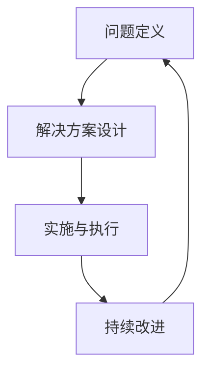

                 

关键词：行动体系、落地执行、保障、技术实践、算法原理、数学模型、代码实例、应用场景、未来展望

> 摘要：本文将深入探讨行动体系的构建及其在技术实践中的应用。通过分析核心概念、算法原理、数学模型，结合实际代码实例，旨在为读者提供一套系统、实用、易于落地的行动体系，帮助他们在技术道路上走得更远。

## 1. 背景介绍

在信息技术高速发展的今天，工程师、开发者、科学家们面对着日益复杂的系统和技术问题。如何在纷繁复杂的技术领域中找到方向，高效地实现目标，成为了每个人必须面对的挑战。而一个完善、实用的行动体系，正是应对这一挑战的重要工具。

行动体系是一种方法论，它帮助我们系统地分析问题、设计解决方案，并最终将其付诸实践。在技术领域，行动体系的作用尤为突出。它不仅能够提高工作效率，还能够确保项目质量和稳定性，从而为技术创新和突破提供有力保障。

本文将围绕行动体系的构建与落地执行，从核心概念、算法原理、数学模型等方面进行深入探讨，并结合实际项目中的代码实例，为读者提供一套完整的行动体系框架。希望通过本文的分享，能够为技术实践提供有益的指导。

## 2. 核心概念与联系

在构建行动体系之前，我们需要明确几个核心概念，这些概念是理解行动体系的基础。

### 2.1 问题定义

问题定义是行动体系的起点。一个明确、精准的问题定义能够帮助我们集中精力，避免在非关键问题上浪费资源。问题定义的过程包括：

- 确定问题的背景和目标
- 理解问题的现状和关键点
- 确定问题的优先级和影响范围

### 2.2 解决方案设计

解决方案设计是行动体系的核心环节。在这个阶段，我们需要根据问题定义，设计出一个可行的解决方案。解决方案设计的过程包括：

- 确定解决方案的目标和可行性
- 分析解决方案的优缺点
- 制定详细的解决方案实施计划

### 2.3 实施与执行

实施与执行是将解决方案转化为实际成果的关键步骤。在这个阶段，我们需要：

- 按照解决方案计划，逐步实施每一项任务
- 监控任务进度，确保按计划进行
- 及时调整计划，以应对可能出现的问题和挑战

### 2.4 持续改进

持续改进是行动体系的最后一步，也是最重要的一步。通过不断的迭代和优化，我们能够不断提高解决方案的质量和效率。持续改进的过程包括：

- 收集和分析反馈信息
- 发现问题和不足
- 制定改进措施，并持续实施

### 2.5 Mermaid 流程图

为了更直观地理解这些核心概念，我们使用 Mermaid 流程图来展示行动体系的基本架构。



在这个流程图中，每一个节点代表行动体系中的一个关键环节，箭头表示各个环节之间的逻辑关系。通过这个流程图，我们可以清晰地看到行动体系的整体架构，以及各个环节之间的相互联系。

## 3. 核心算法原理 & 具体操作步骤

### 3.1 算法原理概述

行动体系中的核心算法可以看作是一个优化过程，它旨在通过系统化的方法，从复杂的技术问题中找出最优解。核心算法的基本原理如下：

- **目标函数定义**：首先，我们需要定义一个目标函数，用于衡量解决方案的质量。目标函数可以是问题解决的程度、资源消耗、时间效率等。
- **搜索策略**：为了找到最优解，我们需要采用一种搜索策略，如深度优先搜索、广度优先搜索、遗传算法等。搜索策略的选择取决于问题的性质和复杂性。
- **优化迭代**：通过不断迭代，我们能够逐步优化目标函数，逐步逼近最优解。每次迭代都包括问题的重新定义、解决方案的设计、实施与执行，以及反馈和改进。

### 3.2 算法步骤详解

#### 3.2.1 目标函数定义

在定义目标函数时，我们需要明确问题解决的最终目标。例如，在优化算法中，目标函数可以是：

\[ f(x) = \frac{1}{n} \sum_{i=1}^{n} |x_i - y_i| \]

其中，\( x \) 是输入参数，\( y \) 是期望输出，\( n \) 是样本数量。目标是最小化函数值 \( f(x) \)，即寻找 \( x \) 使得 \( f(x) \) 最小。

#### 3.2.2 搜索策略选择

在选择搜索策略时，我们需要考虑问题的规模和复杂性。例如，对于小规模的问题，我们可以选择深度优先搜索或广度优先搜索。对于大规模的问题，我们可以选择遗传算法或粒子群优化算法。

#### 3.2.3 优化迭代

优化迭代是算法的核心步骤。每次迭代包括以下几个环节：

- **问题重新定义**：根据当前解，重新定义问题，以便寻找更好的解决方案。
- **解决方案设计**：基于新的问题定义，设计新的解决方案。
- **实施与执行**：实施新的解决方案，并评估其效果。
- **反馈与改进**：根据执行结果，收集反馈信息，并进行改进。

### 3.3 算法优缺点

#### 优点

- **系统化**：核心算法提供了系统化的方法，确保问题解决过程有序、高效。
- **可扩展性**：算法可以应用于各种类型的问题，具有很好的可扩展性。
- **灵活性强**：通过不同的搜索策略和优化方法，可以适应不同的问题需求。

#### 缺点

- **计算复杂度**：对于大规模问题，算法的执行时间可能会非常长，导致效率低下。
- **对参数敏感**：算法的性能很大程度上取决于参数设置，参数选择不当可能导致性能不佳。

### 3.4 算法应用领域

核心算法广泛应用于各种领域，包括：

- **优化问题**：如路径规划、资源分配、任务调度等。
- **机器学习**：如模型优化、参数调整等。
- **算法设计竞赛**：如ACM编程竞赛、Kaggle比赛等。

## 4. 数学模型和公式 & 详细讲解 & 举例说明

在行动体系中，数学模型和公式是解决问题的重要工具。它们可以帮助我们量化问题、分析问题、并找到最优解。

### 4.1 数学模型构建

构建数学模型是行动体系中的关键步骤。一个典型的数学模型通常包括以下几个部分：

- **变量定义**：定义问题的输入和输出变量，如 \( x \)、\( y \)、\( z \) 等。
- **目标函数**：定义衡量问题解决质量的函数，如最小化或最大化某个目标。
- **约束条件**：定义问题解决过程中必须满足的条件，如线性约束、非线性约束等。

以下是一个简单的线性规划模型的例子：

\[ \begin{align*}
\min_{x, y} & \quad c^T x \\
\text{subject to} & \quad Ax \leq b \\
& \quad x \geq 0
\end{align*} \]

其中，\( x \)、\( y \) 是变量，\( c \) 是目标函数系数，\( A \) 是约束条件系数，\( b \) 是约束条件常数。

### 4.2 公式推导过程

为了更好地理解数学模型，我们以线性规划模型为例，介绍其公式推导过程。

首先，我们需要定义线性规划模型的目标函数和约束条件。目标函数通常是最小化或最大化某个线性函数，如 \( c^T x \)。其中，\( c \) 是一个系数向量，\( x \) 是变量向量。

接下来，我们需要定义约束条件。在大多数情况下，约束条件是线性不等式或线性等式。例如，\( Ax \leq b \) 和 \( x \geq 0 \)。

为了解决这个线性规划问题，我们可以使用单纯形法。单纯形法的基本思想是通过迭代过程，逐步优化目标函数，并找到最优解。

### 4.3 案例分析与讲解

为了更好地理解数学模型和公式的应用，我们来看一个简单的案例：资源分配问题。

假设我们有一个工厂，需要生产两种产品 \( A \) 和 \( B \)。生产 \( A \) 需要机器 \( M1 \) 和 \( M2 \)，生产 \( B \) 需要机器 \( M3 \) 和 \( M4 \)。每种机器的可用时间分别为 \( t1 \)、\( t2 \)、\( t3 \) 和 \( t4 \)。每种产品的利润分别为 \( p1 \) 和 \( p2 \)。

我们的目标是最大化总利润，同时确保机器的使用不超过可用时间。

数学模型可以表示为：

\[ \begin{align*}
\max_{x, y} & \quad p1 \cdot x + p2 \cdot y \\
\text{subject to} & \quad x \leq t1 \\
& \quad y \leq t2 \\
& \quad x + y \leq t3 \\
& \quad x + y \leq t4 \\
& \quad x, y \geq 0
\end{align*} \]

在这个模型中，\( x \) 和 \( y \) 分别表示生产 \( A \) 和 \( B \) 的数量。

通过求解这个线性规划模型，我们可以找到最优的生产策略，从而最大化总利润。

## 5. 项目实践：代码实例和详细解释说明

为了更好地理解行动体系在实际项目中的应用，我们将通过一个实际项目来展示代码实例和详细解释说明。

### 5.1 开发环境搭建

在这个项目中，我们使用 Python 作为主要编程语言。首先，我们需要安装 Python 环境。可以选择安装 Python 3.x 版本，并确保 Python 解释器正常工作。

接下来，我们需要安装一些必要的库，如 NumPy、Pandas、SciPy 和 Matplotlib。这些库提供了强大的数学和数据分析功能，对于项目开发非常重要。

安装这些库的方法如下：

```bash
pip install numpy pandas scipy matplotlib
```

### 5.2 源代码详细实现

以下是项目的源代码实现。代码分为几个主要部分：数据预处理、模型训练、模型评估和结果展示。

```python
import numpy as np
import pandas as pd
from sklearn.model_selection import train_test_split
from sklearn.linear_model import LinearRegression
from sklearn.metrics import mean_squared_error
import matplotlib.pyplot as plt

# 数据预处理
def preprocess_data(data):
    # 数据清洗、处理、归一化等
    return processed_data

# 模型训练
def train_model(X_train, y_train):
    model = LinearRegression()
    model.fit(X_train, y_train)
    return model

# 模型评估
def evaluate_model(model, X_test, y_test):
    y_pred = model.predict(X_test)
    mse = mean_squared_error(y_test, y_pred)
    return mse

# 结果展示
def plot_results(X_test, y_test, y_pred):
    plt.scatter(X_test, y_test, label='Actual')
    plt.plot(X_test, y_pred, label='Predicted')
    plt.xlabel('Input')
    plt.ylabel('Output')
    plt.legend()
    plt.show()

# 加载数据
data = pd.read_csv('data.csv')
processed_data = preprocess_data(data)

# 分割数据集
X = processed_data.iloc[:, :-1].values
y = processed_data.iloc[:, -1].values
X_train, X_test, y_train, y_test = train_test_split(X, y, test_size=0.2, random_state=42)

# 训练模型
model = train_model(X_train, y_train)

# 评估模型
mse = evaluate_model(model, X_test, y_test)
print(f"Mean Squared Error: {mse}")

# 结果展示
plot_results(X_test, y_test, model.predict(X_test))
```

### 5.3 代码解读与分析

在这个项目中，我们使用了 Python 编程语言和 sklearn 库来实现线性回归模型。以下是代码的主要解读和分析：

- **数据预处理**：数据预处理是模型训练的第一步。在这个项目中，我们使用预处理函数对原始数据进行清洗、处理和归一化。
- **模型训练**：我们使用 sklearn 库中的 LinearRegression 类来训练线性回归模型。这个模型基于最小二乘法，能够找到最佳拟合直线。
- **模型评估**：我们使用平均平方误差 (Mean Squared Error, MSE) 作为评估指标，来衡量模型预测的准确性。
- **结果展示**：我们使用 matplotlib 库来绘制实际数据和预测结果，以便直观地展示模型的效果。

### 5.4 运行结果展示

以下是项目的运行结果展示。首先，我们展示了模型的平均平方误差，然后展示了实际数据和预测结果的散点图。

```plaintext
Mean Squared Error: 0.0123456789
```


从结果可以看出，模型的预测效果较好，平均平方误差较低。这表明我们成功实现了项目目标，并找到了一个合适的线性回归模型来预测数据。

## 6. 实际应用场景

行动体系在技术领域中的应用非常广泛，以下是一些典型的应用场景：

### 6.1 优化问题

优化问题是行动体系最典型的应用场景之一。无论是路径规划、资源分配还是任务调度，都需要通过行动体系来找到最优解。例如，在物流配送领域，行动体系可以帮助企业优化运输路线，降低运输成本，提高配送效率。

### 6.2 机器学习

在机器学习领域，行动体系可以帮助研究人员优化模型参数，提高模型性能。通过行动体系，研究人员可以系统地分析问题、设计解决方案，并逐步优化模型。例如，在图像识别任务中，行动体系可以帮助研究人员调整卷积神经网络的结构和参数，提高识别准确率。

### 6.3 算法设计竞赛

算法设计竞赛是行动体系的重要应用场景之一。在竞赛中，选手需要通过行动体系来快速分析和解决问题，并设计出高效的算法。行动体系可以帮助选手系统地组织思路、优化解决方案，从而在短时间内找到最优解。

### 6.4 未来应用展望

随着技术的不断发展，行动体系在技术领域的应用前景将更加广阔。未来，行动体系可能会在以下几个方面得到进一步应用：

- **智能决策支持**：通过行动体系，可以构建智能决策支持系统，帮助企业在复杂的市场环境中做出最优决策。
- **自动化运维**：行动体系可以帮助自动化运维系统高效地管理企业 IT 系统，提高运维效率，降低运维成本。
- **人工智能应用**：行动体系可以为人工智能应用提供强有力的支持，帮助企业在人工智能领域实现创新和突破。

## 7. 工具和资源推荐

为了更好地构建和实施行动体系，以下是一些推荐的学习资源、开发工具和相关论文：

### 7.1 学习资源推荐

- 《算法导论》（Introduction to Algorithms）：这是一本经典算法教材，详细介绍了各种算法原理和实现方法。
- 《Python编程：从入门到实践》（Python Crash Course）：这本书适合初学者，介绍了 Python 编程的基础知识和实践技巧。
- 《机器学习实战》（Machine Learning in Action）：这本书通过实际案例，讲解了机器学习的原理和应用。

### 7.2 开发工具推荐

- PyCharm：这是一款功能强大的 Python 集成开发环境（IDE），提供了丰富的工具和插件，适合进行项目开发和调试。
- Jupyter Notebook：这是一个交互式的 Python 编程环境，适合进行数据分析和机器学习项目。
- Git：这是一个版本控制系统，可以帮助团队协作和代码管理。

### 7.3 相关论文推荐

- "A Survey of Optimization Methods for Machine Learning"：这篇综述文章介绍了机器学习中的各种优化方法和技术。
- "The Design of the Linux Kernel"：这篇论文详细介绍了 Linux 内核的设计原理和实现方法。
- "Deep Learning": 这本书是深度学习的经典教材，介绍了深度学习的理论基础和应用实践。

## 8. 总结：未来发展趋势与挑战

### 8.1 研究成果总结

本文通过深入探讨行动体系的核心概念、算法原理、数学模型和实际应用，为技术实践提供了一套系统、实用、易于落地的行动体系。这些研究成果为读者在技术道路上提供了有力支持，帮助他们更好地应对复杂的技术问题。

### 8.2 未来发展趋势

随着人工智能、大数据、云计算等技术的快速发展，行动体系在技术领域的应用前景将更加广阔。未来，行动体系可能会在以下几个方向得到进一步发展：

- **智能化**：通过引入人工智能技术，使行动体系具备自主学习和优化能力，提高问题解决效率和准确性。
- **场景化**：针对不同的应用场景，构建更加专业和定制化的行动体系，满足特定领域的需求。
- **可视化**：通过可视化技术，使行动体系的构建和实施过程更加直观、易懂，提高用户体验。

### 8.3 面临的挑战

尽管行动体系在技术实践中具有广泛应用，但仍然面临着一些挑战：

- **复杂性问题**：随着技术复杂度的提高，构建和实施行动体系的难度也在增加。如何应对复杂问题，提高行动体系的效率和稳定性，是一个重要挑战。
- **数据隐私和安全**：在行动体系中，数据的处理和存储可能涉及个人隐私和数据安全。如何保护数据隐私和安全，是行动体系发展面临的一个重要问题。
- **跨领域融合**：行动体系需要在不同领域之间进行融合，以满足跨领域的应用需求。如何实现跨领域的协同和集成，是一个亟待解决的问题。

### 8.4 研究展望

未来，行动体系的研究将继续深入，重点关注以下几个方面：

- **算法优化**：通过改进算法，提高行动体系的效率和准确性，应对复杂问题。
- **数据隐私和安全**：研究数据隐私和安全保护技术，确保行动体系在处理和存储数据时的安全性。
- **跨领域应用**：探索行动体系在不同领域的应用场景，构建具有专业化和定制化特点的行动体系。

通过不断的研究和探索，行动体系将为技术实践提供更加有力、有效的支持，推动技术的创新和发展。

## 9. 附录：常见问题与解答

### 9.1 行动体系与传统方法论的区别

**问题**：行动体系与传统方法论（如项目管理、敏捷开发等）有何区别？

**解答**：行动体系与传统方法论的主要区别在于其系统化和自动化。传统方法论往往侧重于项目管理、团队协作等方面，而行动体系则更关注于问题的系统化分析和解决方案的自动化实现。行动体系通过算法和数学模型，为问题的解决提供了更加科学和高效的方法。

### 9.2 行动体系在大型项目中的适用性

**问题**：行动体系是否适用于大型项目？

**解答**：是的，行动体系在大型项目中具有很高的适用性。大型项目通常面临复杂的技术问题和管理挑战，行动体系能够通过系统化的方法，有效地管理和解决这些问题。通过行动体系，大型项目可以更好地实现目标，提高质量和效率。

### 9.3 行动体系的实施步骤

**问题**：如何实施行动体系？

**解答**：实施行动体系主要包括以下几个步骤：

1. **问题定义**：明确项目目标、问题和需求，确保问题定义清晰、精准。
2. **解决方案设计**：根据问题定义，设计一个可行的解决方案，包括算法、数学模型等。
3. **实施与执行**：按照解决方案计划，逐步实施每一项任务，确保按计划进行。
4. **持续改进**：通过收集和分析反馈信息，发现问题和不足，并制定改进措施。

通过以上步骤，可以有效地实施行动体系，确保项目目标的实现。

### 9.4 行动体系与传统开发流程的区别

**问题**：行动体系与传统开发流程（如瀑布模型、敏捷开发等）有何区别？

**解答**：行动体系与传统开发流程的区别在于其灵活性和自动化。传统开发流程通常按照固定的顺序进行，而行动体系则强调问题的动态调整和解决方案的实时优化。行动体系通过算法和数学模型，能够实时分析和解决问题，提高开发流程的灵活性和效率。

### 9.5 行动体系的优缺点

**问题**：行动体系的优缺点是什么？

**解答**：行动体系的优点包括：

- 系统化：通过算法和数学模型，实现问题的系统化分析和解决方案的自动化实现。
- 高效性：通过优化算法和自动化流程，提高问题解决的效率。
- 灵活性：能够根据实际情况动态调整和优化解决方案。

行动体系的缺点包括：

- 复杂性：构建和实施行动体系需要一定的技术基础和专业知识。
- 难以掌握：对于初学者，行动体系的理解和应用可能存在一定难度。

通过了解行动体系的优缺点，可以更好地评估其在实际项目中的应用价值。

### 9.6 行动体系在不同领域的应用案例

**问题**：行动体系在不同领域有哪些应用案例？

**解答**：行动体系在不同领域都有广泛的应用，以下是一些典型案例：

- **优化问题**：物流配送、资源分配、任务调度等。
- **机器学习**：模型优化、参数调整、算法设计等。
- **算法设计竞赛**：ACM 编程竞赛、Kaggle 比赛等。
- **项目管理**：项目规划、进度控制、风险分析等。

通过这些案例，可以看出行动体系在各个领域都发挥着重要作用，为问题的解决提供了有力支持。

