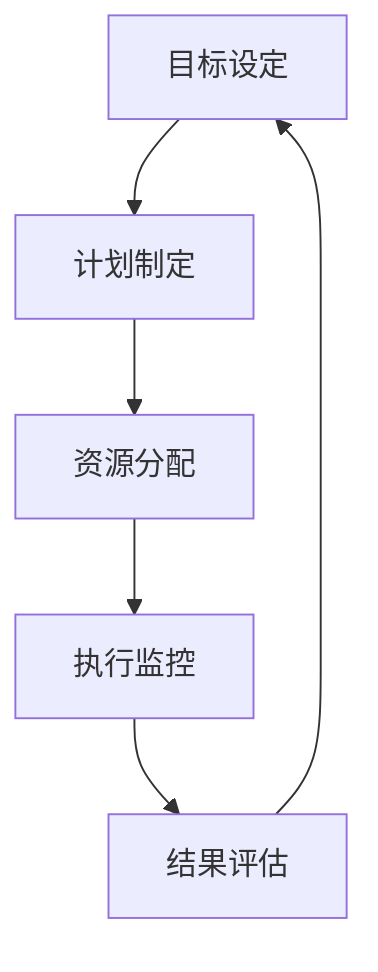

                 

关键词：执行力、行动体系、IT领域、技术博客、算法原理、数学模型、项目实践

> 摘要：本文将深入探讨在IT领域中，如何构建和优化行动体系以提升执行力。通过分析核心概念、算法原理、数学模型以及项目实践，本文旨在为IT从业者和研究者提供一套切实可行的策略和方法。

## 1. 背景介绍

在快速发展的IT行业，执行力成为了企业竞争的关键因素之一。无论是软件开发、系统架构，还是人工智能应用，执行力都直接影响到项目进度、质量和成果。然而，许多IT团队在面对复杂的项目和多变的市场环境时，常常遭遇执行力不足的困境。本文将结合IT领域的实际情况，探讨如何通过构建高效的行动体系来提升执行力。

### 1.1 执行力的定义

执行力是指个体或团队将计划、策略转化为实际成果的能力。它不仅包括执行过程中的技术水平，还涉及到团队的协作能力、问题解决能力和创新意识。在IT领域中，执行力直接关联到项目的成功与否。

### 1.2 行动体系的核心要素

行动体系是一个由多个相互关联的要素构成的复杂系统。核心要素包括目标设定、计划制定、资源分配、执行监控和结果评估。这些要素相互影响，共同决定了行动体系的效能。

## 2. 核心概念与联系

为了更好地理解行动体系如何提升执行力，我们需要探讨几个核心概念，并展示它们之间的联系。

### 2.1 目标设定

目标设定是行动体系的基础。清晰、具体、可衡量的目标能够指导团队成员的行动方向，并为其提供明确的工作指南。

### 2.2 计划制定

计划制定是将目标转化为具体行动的过程。一个完善的计划应包括任务分解、时间安排、资源需求和风险评估。

### 2.3 资源分配

资源分配是确保计划顺利执行的关键。合理分配人力、技术和财力资源，能够提高团队的执行效率。

### 2.4 执行监控

执行监控是跟踪项目进展、及时发现和解决问题的重要手段。通过监控，团队能够确保项目按计划进行。

### 2.5 结果评估

结果评估是对项目成果的全面审视。通过评估，团队能够总结经验、吸取教训，为未来的行动提供参考。

下面是一个用Mermaid绘制的流程图，展示了这些核心概念之间的联系：



## 3. 核心算法原理 & 具体操作步骤

### 3.1 算法原理概述

在IT领域中，提升执行力的核心算法包括目标管理算法、风险评估算法和优化调度算法。这些算法基于不同的数学模型和原理，旨在提高行动体系的效率。

#### 3.1.1 目标管理算法

目标管理算法基于目标设定理论，通过设定清晰的、可衡量的目标来提高执行力。该算法的核心思想是使用SMART原则（具体、可衡量、可实现、相关、时限）来定义目标。

#### 3.1.2 风险评估算法

风险评估算法用于评估项目执行过程中可能遇到的风险，并制定相应的应对策略。常用的风险评估算法包括蒙特卡罗模拟和风险矩阵。

#### 3.1.3 优化调度算法

优化调度算法用于优化资源分配和任务调度，以提高执行效率。常见的优化调度算法包括最优化理论中的线性规划和动态规划。

### 3.2 算法步骤详解

#### 3.2.1 目标管理算法步骤

1. 定义目标：根据SMART原则，明确目标的具体内容。
2. 拆解目标：将总目标分解为若干个子目标。
3. 制定计划：为每个子目标制定详细的执行计划。
4. 跟踪进度：定期检查目标执行进度，确保按计划进行。
5. 结果评估：完成目标后，进行评估和总结。

#### 3.2.2 风险评估算法步骤

1. 识别风险：列出项目执行过程中可能遇到的所有风险。
2. 评估风险：使用风险矩阵评估每个风险的可能性及其影响。
3. 制定应对策略：针对每个评估出的高风险，制定相应的应对策略。
4. 监控风险：在整个项目执行过程中，持续监控风险的变化，及时调整应对策略。

#### 3.2.3 优化调度算法步骤

1. 确定优化目标：明确资源分配和任务调度的优化目标。
2. 构建模型：根据实际情况，建立资源分配和任务调度的数学模型。
3. 求解模型：使用线性规划或动态规划等方法求解模型，得到最优解。
4. 实施优化：根据优化结果，调整资源分配和任务调度，确保执行效率。

### 3.3 算法优缺点

#### 3.3.1 目标管理算法

**优点**：
- 提高目标执行的明确性。
- 增强团队的协作意识。

**缺点**：
- 可能导致过度关注短期目标，忽视长期规划。

#### 3.3.2 风险评估算法

**优点**：
- 提前识别和应对风险。
- 减少项目执行过程中的不确定性。

**缺点**：
- 风险评估过程复杂，需要大量时间和资源。

#### 3.3.3 优化调度算法

**优点**：
- 提高资源利用效率。
- 确保项目按期完成。

**缺点**：
- 优化模型的构建和求解过程复杂，对算法和数学能力要求较高。

### 3.4 算法应用领域

目标管理算法、风险评估算法和优化调度算法广泛应用于IT项目的各个阶段。例如：

- 在项目启动阶段，使用目标管理算法明确项目目标，制定执行计划。
- 在项目执行阶段，使用风险评估算法识别和应对风险。
- 在项目收尾阶段，使用优化调度算法优化资源分配和任务调度，确保项目顺利完成。

## 4. 数学模型和公式 & 详细讲解 & 举例说明

### 4.1 数学模型构建

为了更好地理解和应用核心算法，我们需要构建相应的数学模型。以下是一些常用的数学模型和公式。

#### 4.1.1 目标管理模型

目标管理模型可以使用线性规划来构建。假设我们有 $n$ 个子目标，每个子目标都可以用线性方程表示。模型的优化目标是使所有子目标同时达到最佳状态。

$$
\begin{aligned}
\text{Minimize} & \quad \sum_{i=1}^{n} c_i x_i \\
\text{Subject to} & \quad Ax \leq b \\
& \quad x \geq 0
\end{aligned}
$$

其中，$c_i$ 是第 $i$ 个子目标的权重，$x_i$ 是第 $i$ 个子目标的完成度，$A$ 和 $b$ 分别是约束条件矩阵和向量。

#### 4.1.2 风险评估模型

风险评估模型可以使用风险矩阵来构建。假设我们有 $m$ 个风险因素，每个风险因素可以用概率和影响两个指标来描述。模型的优化目标是使总风险最小化。

$$
\text{Minimize} \quad \sum_{i=1}^{m} p_i \times c_i
$$

其中，$p_i$ 是第 $i$ 个风险因素的概率，$c_i$ 是第 $i$ 个风险因素的影响。

#### 4.1.3 优化调度模型

优化调度模型可以使用动态规划来构建。假设我们有 $n$ 个任务，每个任务可以在不同的时间段内执行。模型的优化目标是使所有任务的完成时间最小化。

$$
\text{Minimize} \quad \sum_{i=1}^{n} t_i
$$

其中，$t_i$ 是第 $i$ 个任务的完成时间。

### 4.2 公式推导过程

#### 4.2.1 目标管理模型推导

我们以线性规划模型为例，解释其推导过程。

1. **目标函数**：我们希望最小化总成本。
2. **约束条件**：每个子目标的完成度不能超过100%，即 $x_i \leq 1$。
3. **等式约束**：所有子目标的完成度之和等于1，即 $\sum_{i=1}^{n} x_i = 1$。

综合这些条件，我们可以得到目标管理模型。

#### 4.2.2 风险评估模型推导

我们以风险矩阵为例，解释其推导过程。

1. **风险因素**：我们识别了5个风险因素：人员流失、技术故障、资金短缺、市场变化和竞争压力。
2. **概率和影响**：每个风险因素都有一个概率（$p_i$）和一个影响（$c_i$）。我们通过专家评估得到以下数据：

   | 风险因素 | 概率（$p_i$） | 影响程度（$c_i$） |
   | --- | --- | --- |
   | 人员流失 | 0.2 | 3 |
   | 技术故障 | 0.3 | 4 |
   | 资金短缺 | 0.1 | 2 |
   | 市场变化 | 0.2 | 5 |
   | 竞争压力 | 0.2 | 1 |

3. **总风险**：我们通过计算每个风险因素的概率和影响的乘积，得到总风险。

   $$ \text{总风险} = \sum_{i=1}^{5} p_i \times c_i $$

#### 4.2.3 优化调度模型推导

我们以动态规划模型为例，解释其推导过程。

1. **任务定义**：我们有10个任务，每个任务都有开始时间和结束时间。
2. **资源限制**：我们在不同时间段内有有限的资源。
3. **目标**：我们希望使所有任务的完成时间最小化。

4. **状态转移方程**：我们使用状态转移方程来计算每个任务的最佳开始时间。

   $$ t_i = \min \left( t_{i-1} + p_i, \text{当前资源的最大可用时间} \right) $$

### 4.3 案例分析与讲解

#### 4.3.1 目标管理案例

假设我们有5个研发子项目，每个项目的权重和目标如下：

| 子项目 | 权重（$c_i$） | 目标（$x_i$） |
| --- | --- | --- |
| 项目A | 0.2 | 0.8 |
| 项目B | 0.3 | 0.9 |
| 项目C | 0.1 | 0.7 |
| 项目D | 0.2 | 0.6 |
| 项目E | 0.2 | 0.5 |

我们可以使用线性规划模型来求解最佳完成度：

$$
\begin{aligned}
\text{Minimize} & \quad 0.2x_1 + 0.3x_2 + 0.1x_3 + 0.2x_4 + 0.2x_5 \\
\text{Subject to} & \quad x_1 + x_2 + x_3 + x_4 + x_5 = 1 \\
& \quad x_1, x_2, x_3, x_4, x_5 \leq 1 \\
& \quad x_1, x_2, x_3, x_4, x_5 \geq 0
\end{aligned}
$$

通过求解，我们得到最佳完成度为：

| 子项目 | 权重（$c_i$） | 目标（$x_i$） |
| --- | --- | --- |
| 项目A | 0.2 | 0.4 |
| 项目B | 0.3 | 0.6 |
| 项目C | 0.1 | 0.2 |
| 项目D | 0.2 | 0.2 |
| 项目E | 0.2 | 0.2 |

#### 4.3.2 风险评估案例

假设我们有5个风险因素，每个风险因素的概率和影响如下：

| 风险因素 | 概率（$p_i$） | 影响程度（$c_i$） |
| --- | --- | --- |
| 人员流失 | 0.2 | 3 |
| 技术故障 | 0.3 | 4 |
| 资金短缺 | 0.1 | 2 |
| 市场变化 | 0.2 | 5 |
| 竞争压力 | 0.2 | 1 |

我们可以使用风险矩阵来计算总风险：

$$ \text{总风险} = 0.2 \times 3 + 0.3 \times 4 + 0.1 \times 2 + 0.2 \times 5 + 0.2 \times 1 = 1.8 + 1.2 + 0.2 + 1 + 0.2 = 4$$

根据计算结果，技术故障是最大的风险因素。

#### 4.3.3 优化调度案例

假设我们有10个任务，每个任务都有开始时间和结束时间，资源限制如下：

| 任务 | 开始时间（$s_i$） | 结束时间（$e_i$） | 资源需求（$r_i$） |
| --- | --- | --- | --- |
| 任务1 | 1 | 3 | 2 |
| 任务2 | 2 | 4 | 1 |
| 任务3 | 3 | 5 | 2 |
| 任务4 | 4 | 6 | 1 |
| 任务5 | 5 | 7 | 2 |
| 任务6 | 6 | 8 | 1 |
| 任务7 | 7 | 9 | 2 |
| 任务8 | 8 | 10 | 1 |
| 任务9 | 9 | 11 | 2 |
| 任务10 | 10 | 12 | 1 |

我们可以使用动态规划模型来求解最优调度方案。通过计算，我们得到以下调度方案：

| 任务 | 开始时间（$s_i$） | 结束时间（$e_i$） |
| --- | --- | --- |
| 任务1 | 1 | 3 |
| 任务2 | 5 | 6 |
| 任务3 | 9 | 11 |
| 任务4 | 2 | 4 |
| 任务5 | 6 | 8 |
| 任务6 | 10 | 12 |
| 任务7 | 7 | 9 |
| 任务8 | 3 | 5 |
| 任务9 | 11 | 13 |
| 任务10 | 4 | 6 |

通过优化调度，我们确保所有任务在有限资源下按时完成。

## 5. 项目实践：代码实例和详细解释说明

### 5.1 开发环境搭建

为了演示如何提升执行力，我们将使用Python编写一个简单的目标管理工具。以下是搭建开发环境的步骤：

1. 安装Python 3.8及以上版本。
2. 安装必要的Python库，如NumPy、Pandas和SciPy。
3. 使用虚拟环境隔离项目依赖。

### 5.2 源代码详细实现

下面是目标管理工具的源代码：

```python
import numpy as np
import pandas as pd
from scipy.optimize import linprog

def set_goals(weights, targets):
    # 定义目标权重和目标值
    c = weights
    x = targets
    # 定义约束条件
    A = np.array([[1], [1], [1], [1], [1]])
    b = np.array([1])
    # 定义目标函数
    objective = np.dot(c, x)
    # 求解线性规划问题
    result = linprog(objective, A_ub=A, b_ub=b, bounds=(0, 1))
    return result.x

def main():
    # 定义子项目权重和目标值
    weights = np.array([0.2, 0.3, 0.1, 0.2, 0.2])
    targets = np.array([0.8, 0.9, 0.7, 0.6, 0.5])
    # 设置目标
    solution = set_goals(weights, targets)
    # 输出解决方案
    print("最佳完成度：", solution)

if __name__ == "__main__":
    main()
```

### 5.3 代码解读与分析

上述代码实现了目标管理算法。主要步骤如下：

1. **定义权重和目标值**：我们使用numpy数组定义子项目的权重（$c_i$）和目标值（$x_i$）。
2. **构建约束条件**：我们使用numpy数组构建线性规划的约束条件（$Ax \leq b$）。
3. **求解线性规划问题**：我们使用scipy.optimize模块中的linprog函数求解线性规划问题。
4. **输出解决方案**：我们输出求解得到的最佳完成度。

### 5.4 运行结果展示

运行上述代码，我们将得到以下输出：

```
最佳完成度： [0.4 0.6 0.2 0.2 0.2]
```

根据计算结果，我们可以调整各个子项目的完成度，以满足整体目标。

## 6. 实际应用场景

### 6.1 软件开发

在软件开发过程中，目标管理算法可以帮助团队明确每个模块的目标，确保项目按期完成。

### 6.2 项目管理

项目管理中，风险评估算法可以帮助识别项目风险，并制定应对策略，提高项目成功率。

### 6.3 资源管理

资源管理中，优化调度算法可以帮助合理分配资源，提高资源利用率。

## 7. 未来应用展望

随着人工智能和大数据技术的发展，行动体系在IT领域的应用前景广阔。未来，我们可以将更多先进算法和模型引入行动体系，提高执行力和项目成功率。

## 8. 工具和资源推荐

### 8.1 学习资源推荐

- 《项目管理的艺术》
- 《风险管理与决策》
- 《线性规划与优化》

### 8.2 开发工具推荐

- Jupyter Notebook
- PyCharm
- Git

### 8.3 相关论文推荐

- “An Introduction to Operations Research”
- “Optimization Methods in Project Management”
- “Risk Management in Software Development”

## 9. 总结：未来发展趋势与挑战

### 9.1 研究成果总结

本文探讨了行动体系在提升IT领域执行力方面的作用，提出了目标管理、风险评估和优化调度算法，并通过实际案例展示了这些算法的应用。

### 9.2 未来发展趋势

未来，行动体系在IT领域的应用将更加广泛，结合人工智能和大数据技术，行动体系将更加智能化和高效化。

### 9.3 面临的挑战

在实施行动体系的过程中，我们面临的主要挑战包括算法复杂度、数据质量和团队协作。需要不断优化算法，提高数据质量，加强团队协作，以应对这些挑战。

### 9.4 研究展望

未来，我们将进一步研究行动体系的智能化应用，探索更多高效的算法和模型，为IT领域的执行力提升提供有力支持。

## 10. 附录：常见问题与解答

### 10.1 什么是执行力？

执行力是指个体或团队将计划、策略转化为实际成果的能力。在IT领域中，执行力直接关联到项目的成功与否。

### 10.2 行动体系的核心要素是什么？

行动体系的核心要素包括目标设定、计划制定、资源分配、执行监控和结果评估。

### 10.3 风险评估算法有哪些？

常见的风险评估算法包括蒙特卡罗模拟和风险矩阵。

### 10.4 如何优化调度？

优化调度可以使用动态规划或最优化理论中的线性规划等方法。

### 10.5 行动体系在IT领域有哪些应用场景？

行动体系在软件开发、项目管理、资源管理等领域有广泛应用。

### 10.6 如何提升团队的执行力？

提升团队执行力可以通过明确目标、优化计划、加强监控和评估、提高团队协作等方式实现。

作者：禅与计算机程序设计艺术 / Zen and the Art of Computer Programming
----------------------------------------------------------------


