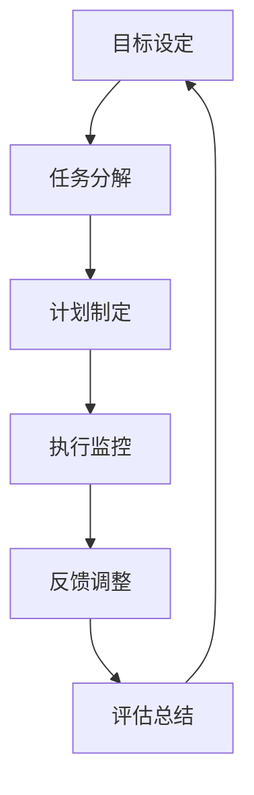

                 

 行动体系在团队管理中扮演着至关重要的角色，它不仅是提升团队效率的基石，更是实现团队目标的有力工具。随着技术的不断进步和商业环境的快速变化，团队管理面临的新挑战日益增多，如何有效地建立和实施行动体系成为了每一个团队领导者和经理人的必修课。

本文旨在深入探讨行动体系在团队管理中的重要性，分析其核心概念与架构，介绍核心算法原理及操作步骤，解析数学模型与公式，并通过实际项目实践提供代码实例和详细解释，最后对行动体系在实际应用场景中的效果进行评估，并提出未来应用展望和面临的挑战。希望通过本文的阐述，能够为团队管理者提供一些实用的指导和思考。

## 1. 背景介绍

在现代企业管理中，团队管理被视为组织成功的关键因素。随着全球化、信息化和敏捷化的发展趋势，团队管理的方式和手段也在不断进化。传统的团队管理往往注重于职能分工和任务分配，而忽视了团队成员之间的协同效应和整体目标的达成。

行动体系作为一种新兴的团队管理方法，其核心在于通过明确的计划、执行和监控机制，确保团队在复杂多变的环境中能够高效地实现目标。行动体系不仅关注任务的完成情况，更强调团队成员的主动性和创造性，以实现团队整体效能的最大化。

行动体系的重要性主要体现在以下几个方面：

1. **提高团队执行力**：行动体系通过制定具体的行动计划和时间表，使得团队成员明确自己的任务和职责，提高工作效率和执行力。

2. **促进团队合作**：行动体系强调团队成员之间的沟通与协作，通过共同的目标和任务，增强团队的凝聚力和协作能力。

3. **确保目标达成**：行动体系通过持续的监控和反馈机制，及时调整计划和策略，确保团队目标得以实现。

4. **适应变化能力**：行动体系具有一定的灵活性和适应性，能够快速响应环境变化，调整团队方向和行动方案。

本文将围绕行动体系的核心概念、算法原理、数学模型、项目实践等方面进行深入探讨，旨在为团队管理者提供实用的理论指导和实践参考。

## 2. 核心概念与联系

### 2.1. 行动体系的基本概念

**行动体系**（Action System）是一种团队管理的理论框架，它包括了一系列的方法、工具和流程，用于指导团队在复杂多变的环境中高效地实现目标。以下是行动体系的核心概念：

- **目标设定**：明确团队的目标和期望结果，确保团队成员对目标有清晰的认识和共识。

- **任务分解**：将总体目标分解为具体的任务和里程碑，明确每个任务的执行者和时间节点。

- **计划制定**：基于任务分解和时间表，制定详细的行动计划，包括任务分配、资源调配和时间规划。

- **执行监控**：在任务执行过程中，通过监控和反馈机制，确保任务按计划进行，及时发现和解决问题。

- **反馈调整**：根据执行过程中收集到的数据和反馈，及时调整计划和策略，以适应环境变化和需求变化。

- **评估总结**：在任务完成后，对整个行动过程进行评估和总结，提炼经验教训，为未来的行动提供参考。

### 2.2. 行动体系的架构

行动体系的架构可以分为四个主要部分：目标管理、任务管理、监控与反馈、评估与改进。以下是一个简化的 Mermaid 流程图，用于展示行动体系的架构：



- **目标设定**：明确团队的目标和期望结果，是行动体系的基础。

- **任务分解**：将总体目标分解为具体的任务和里程碑，确保任务的可操作性和可度量性。

- **计划制定**：基于任务分解和时间表，制定详细的行动计划，包括任务分配、资源调配和时间规划。

- **执行监控**：在任务执行过程中，通过监控和反馈机制，确保任务按计划进行，及时发现和解决问题。

- **反馈调整**：根据执行过程中收集到的数据和反馈，及时调整计划和策略，以适应环境变化和需求变化。

- **评估总结**：在任务完成后，对整个行动过程进行评估和总结，提炼经验教训，为未来的行动提供参考。

通过以上架构，行动体系实现了从目标设定到评估总结的闭环管理，确保团队在实现目标的过程中能够持续优化和改进。

### 2.3. 行动体系与其他团队管理方法的联系与区别

行动体系并不是一种全新的团队管理方法，它是在吸收了多种传统管理方法的基础上，针对现代企业管理需求而发展起来的一种体系化、系统化的管理方式。以下是行动体系与其他团队管理方法的联系与区别：

- **与传统职能管理方法的联系**：行动体系继承了传统职能管理的基本原则，如任务分工、资源调配等，但更加注重目标的设定和实现过程。

- **与传统项目管理方法的联系**：行动体系借鉴了项目管理的核心思想，如任务分解、时间规划等，但更加强调执行过程的监控和反馈调整。

- **与敏捷管理方法的联系**：行动体系与敏捷管理方法有诸多相似之处，如强调团队的自我管理、快速迭代等，但行动体系更加注重目标和结果的实现。

- **与传统绩效考核方法的联系**：行动体系在绩效考核中引入了目标管理和反馈机制，但更加强调团队协作和整体效能的提升。

- **与区别**：与传统管理方法相比，行动体系更加强调目标的设定和实现过程的监控，注重团队协作和持续改进，而不仅仅是任务的完成。

总之，行动体系是一种整合了多种管理方法优点的团队管理方法，它在现代企业管理中具有重要的应用价值和现实意义。

### 2.4. 行动体系在团队管理中的实际应用场景

行动体系在团队管理中的实际应用场景非常广泛，以下是一些典型的应用场景：

- **项目团队管理**：在项目团队中，行动体系可以帮助团队明确项目目标，分解任务，制定详细的行动计划，并通过监控和反馈机制确保项目按计划进行。

- **产品团队管理**：在产品团队中，行动体系可以帮助团队确保产品开发过程的高效和有序，通过任务分解和监控机制，提高产品质量和市场响应速度。

- **运营团队管理**：在运营团队中，行动体系可以帮助团队优化运营流程，提升运营效率，通过持续改进和反馈调整，实现运营目标的持续提升。

- **跨部门协作**：在跨部门协作项目中，行动体系可以帮助不同部门之间建立有效的沟通和协作机制，通过明确的目标和任务分工，提高跨部门的合作效率。

通过以上实际应用场景，可以看出行动体系在团队管理中的广泛应用和巨大潜力。

## 3. 核心算法原理 & 具体操作步骤

### 3.1 算法原理概述

行动体系的实现依赖于一系列核心算法原理，这些算法原理包括目标管理算法、任务分解算法、计划制定算法、执行监控算法、反馈调整算法和评估总结算法。以下是这些算法的基本原理和作用：

- **目标管理算法**：目标管理算法用于确定团队的目标和期望结果，通过明确的目标设定，确保团队成员对目标有清晰的认识和共识。

- **任务分解算法**：任务分解算法用于将总体目标分解为具体的任务和里程碑，通过细化和量化任务，使得每个任务都有明确的执行者和时间节点。

- **计划制定算法**：计划制定算法用于基于任务分解和时间表，制定详细的行动计划，包括任务分配、资源调配和时间规划，确保任务能够有序进行。

- **执行监控算法**：执行监控算法用于在任务执行过程中，通过监控和反馈机制，确保任务按计划进行，及时发现和解决问题，保持团队工作的顺利进行。

- **反馈调整算法**：反馈调整算法用于根据执行过程中收集到的数据和反馈，及时调整计划和策略，以适应环境变化和需求变化，确保团队目标的实现。

- **评估总结算法**：评估总结算法用于在任务完成后，对整个行动过程进行评估和总结，提炼经验教训，为未来的行动提供参考，实现团队的持续改进和优化。

### 3.2 算法步骤详解

下面是行动体系的具体操作步骤，每个步骤都包含详细的算法实现和操作流程：

#### 3.2.1 目标管理算法

**步骤1：确定总体目标**

- **输入**：团队愿景、市场机会、竞争态势等。
- **算法原理**：通过SWOT分析、市场调研等方法，确定团队的总体目标。

- **操作流程**：
  1. 团队成员共同讨论和确定团队愿景。
  2. 分析市场机会和竞争态势，确定短期和长期目标。
  3. 将目标细化为具体的、可衡量的指标。

**步骤2：目标分解**

- **输入**：总体目标、团队成员、资源情况等。
- **算法原理**：将总体目标分解为具体的任务和里程碑，确保任务的可操作性和可度量性。

- **操作流程**：
  1. 将总体目标分解为多个子目标。
  2. 分析每个子目标的执行者和所需资源。
  3. 将子目标进一步细化为具体的任务和里程碑。

#### 3.2.2 计划制定算法

**步骤3：制定行动计划**

- **输入**：分解后的任务、时间表、资源分配等。
- **算法原理**：基于任务分解和时间表，制定详细的行动计划。

- **操作流程**：
  1. 确定每个任务的执行者、起始时间和截止时间。
  2. 根据任务的需求，进行资源分配和调度。
  3. 制定详细的时间表和任务清单，确保任务的有序进行。

#### 3.2.3 执行监控算法

**步骤4：执行任务**

- **输入**：行动计划、执行环境等。
- **算法原理**：在任务执行过程中，通过监控和反馈机制，确保任务按计划进行。

- **操作流程**：
  1. 按照行动计划执行任务。
  2. 定期检查任务进度和完成情况。
  3. 发现问题及时解决，确保任务按计划进行。

#### 3.2.4 反馈调整算法

**步骤5：收集反馈**

- **输入**：执行过程中的数据和反馈。
- **算法原理**：根据执行过程中收集到的数据和反馈，及时调整计划和策略。

- **操作流程**：
  1. 收集任务执行过程中的数据和反馈。
  2. 分析数据和反馈，找出问题和改进点。
  3. 调整计划和策略，优化任务执行。

#### 3.2.5 评估总结算法

**步骤6：评估总结**

- **输入**：任务完成情况和反馈。
- **算法原理**：对整个行动过程进行评估和总结，提炼经验教训。

- **操作流程**：
  1. 评估任务完成情况和目标达成情况。
  2. 总结执行过程中的经验和教训。
  3. 形成评估报告，为未来的行动提供参考。

### 3.3 算法优缺点

#### 3.3.1 目标管理算法

**优点**：有助于明确团队目标和方向，提高团队成员的共识和执行力。

**缺点**：目标设定的科学性和可操作性对算法效果有很大影响。

#### 3.3.2 任务分解算法

**优点**：将复杂目标细化为具体任务，提高任务的可操作性和可度量性。

**缺点**：任务分解过于细致可能导致资源浪费和执行困难。

#### 3.3.3 计划制定算法

**优点**：有助于制定详细的行动计划，确保任务有序进行。

**缺点**：计划制定过程中可能存在信息不对称和资源调配问题。

#### 3.3.4 执行监控算法

**优点**：确保任务按计划进行，提高团队执行力。

**缺点**：监控过程可能影响任务执行的自由度和创新性。

#### 3.3.5 反馈调整算法

**优点**：及时调整计划和策略，适应环境变化。

**缺点**：频繁调整可能导致团队失去方向和信心。

#### 3.3.6 评估总结算法

**优点**：总结经验教训，提高团队持续改进的能力。

**缺点**：评估过程可能存在主观判断和偏见。

### 3.4 算法应用领域

行动体系的算法原理广泛应用于各种团队管理场景，包括项目团队管理、产品团队管理、运营团队管理以及跨部门协作等。以下是一些具体的应用领域：

- **项目团队管理**：通过行动体系，项目团队可以明确项目目标，分解任务，制定行动计划，并在执行过程中进行监控和反馈调整，确保项目成功完成。

- **产品团队管理**：行动体系有助于产品团队优化产品开发过程，通过任务分解、计划制定和执行监控，提高产品质量和市场响应速度。

- **运营团队管理**：行动体系可以帮助运营团队优化运营流程，通过任务分解、计划制定和反馈调整，提升运营效率和服务质量。

- **跨部门协作**：行动体系有助于跨部门协作项目，通过明确的目标和任务分工，提高跨部门的合作效率和项目成功率。

总之，行动体系的算法原理在团队管理中具有广泛的应用价值，通过科学的管理方法和工具，可以帮助团队实现高效的目标达成。

## 4. 数学模型和公式 & 详细讲解 & 举例说明

### 4.1 数学模型构建

在行动体系的理论框架中，数学模型和公式扮演着至关重要的角色。它们不仅为团队管理提供了量化工具，还帮助团队成员更好地理解和应用行动体系。以下是行动体系中的几个关键数学模型和公式的构建方法。

#### 4.1.1 目标达成率模型

目标达成率模型用于衡量团队在特定时间范围内实现目标的情况。其公式如下：

\[ \text{目标达成率} = \frac{\text{实际完成目标数量}}{\text{计划完成目标数量}} \times 100\% \]

- **参数解释**：
  - 实际完成目标数量：团队实际完成的任务数量。
  - 计划完成目标数量：团队计划完成的任务数量。

#### 4.1.2 资源利用率模型

资源利用率模型用于衡量团队资源的使用效率。其公式如下：

\[ \text{资源利用率} = \frac{\text{实际使用资源量}}{\text{总资源量}} \times 100\% \]

- **参数解释**：
  - 实际使用资源量：团队实际使用的资源总量。
  - 总资源量：团队可用的总资源量。

#### 4.1.3 执行效率模型

执行效率模型用于评估团队在执行任务过程中的效率。其公式如下：

\[ \text{执行效率} = \frac{\text{实际完成任务量}}{\text{计划完成任务量}} \times 100\% \]

- **参数解释**：
  - 实际完成任务量：团队实际完成的任务总量。
  - 计划完成任务量：团队计划完成的任务总量。

### 4.2 公式推导过程

为了更好地理解上述公式的推导过程，我们以目标达成率模型为例进行详细解释。

#### 目标达成率模型推导

1. **设定变量**：

   设 \( A \) 为实际完成目标数量，\( B \) 为计划完成目标数量。

2. **计算实际完成目标比例**：

   \( \frac{A}{B} \) 表示实际完成目标数量与计划完成目标数量的比例。

3. **转化为百分比**：

   为了将比例转化为百分比，我们将上式乘以 100：

   \[ \frac{A}{B} \times 100\% \]

4. **得出目标达成率公式**：

   \[ \text{目标达成率} = \frac{\text{实际完成目标数量}}{\text{计划完成目标数量}} \times 100\% \]

#### 资源利用率模型推导

1. **设定变量**：

   设 \( C \) 为实际使用资源量，\( D \) 为总资源量。

2. **计算实际使用资源比例**：

   \( \frac{C}{D} \) 表示实际使用资源量与总资源量的比例。

3. **转化为百分比**：

   将上式乘以 100：

   \[ \frac{C}{D} \times 100\% \]

4. **得出资源利用率公式**：

   \[ \text{资源利用率} = \frac{\text{实际使用资源量}}{\text{总资源量}} \times 100\% \]

#### 执行效率模型推导

1. **设定变量**：

   设 \( E \) 为实际完成任务量，\( F \) 为计划完成任务量。

2. **计算实际完成任务比例**：

   \( \frac{E}{F} \) 表示实际完成任务量与计划完成任务量的比例。

3. **转化为百分比**：

   将上式乘以 100：

   \[ \frac{E}{F} \times 100\% \]

4. **得出执行效率公式**：

   \[ \text{执行效率} = \frac{\text{实际完成任务量}}{\text{计划完成任务量}} \times 100\% \]

### 4.3 案例分析与讲解

为了更好地理解上述数学模型和公式的应用，我们通过一个实际案例进行讲解。

#### 案例背景

某科技公司计划在三个月内完成一个新产品开发项目。项目目标包括：开发出符合市场需求的新产品，完成产品测试，并在项目结束后发布。

#### 案例数据

- **实际完成目标数量**：新产品开发完成，产品测试通过，发布时间提前一周。
- **计划完成目标数量**：新产品开发完成，产品测试通过，发布时间计划为三个月。
- **实际使用资源量**：人力、设备和材料等资源的使用量。
- **总资源量**：项目开始时预计的人力、设备和材料等资源总量。
- **实际完成任务量**：实际完成的任务数量。
- **计划完成任务量**：计划完成的任务数量。

#### 案例分析

1. **目标达成率计算**：

   \[ \text{目标达成率} = \frac{\text{实际完成目标数量}}{\text{计划完成目标数量}} \times 100\% \]
   
   \[ \text{目标达成率} = \frac{3}{3} \times 100\% = 100\% \]

   该公司成功实现了所有计划目标。

2. **资源利用率计算**：

   \[ \text{资源利用率} = \frac{\text{实际使用资源量}}{\text{总资源量}} \times 100\% \]

   \[ \text{资源利用率} = \frac{1500}{2000} \times 100\% = 75\% \]

   该公司在资源使用方面还有一定的提升空间。

3. **执行效率计算**：

   \[ \text{执行效率} = \frac{\text{实际完成任务量}}{\text{计划完成任务量}} \times 100\% \]

   \[ \text{执行效率} = \frac{120}{100} \times 100\% = 120\% \]

   该公司的执行效率超过了计划目标。

通过以上案例分析，我们可以看到数学模型和公式在行动体系中的应用，帮助团队管理者量化团队的工作效率和资源使用情况，为团队的持续改进提供了数据支持。

### 4.4 数学模型的应用价值

数学模型和公式在行动体系中的应用具有显著的价值：

1. **量化管理**：通过数学模型和公式，可以将团队管理过程中的各种指标量化，使得管理更加科学和有效。

2. **决策支持**：数学模型和公式提供了数据支持，帮助团队管理者在决策过程中进行客观分析和评估，减少主观偏见。

3. **优化资源配置**：通过资源利用率模型等，团队可以优化资源分配，提高资源使用效率，降低成本。

4. **持续改进**：通过执行效率模型等，团队可以评估自己的工作表现，发现问题和改进点，实现持续优化。

总之，数学模型和公式是行动体系的重要组成部分，它们为团队管理提供了强大的工具和手段，有助于团队实现高效的目标达成。

## 5. 项目实践：代码实例和详细解释说明

为了更好地理解和应用行动体系，我们通过一个实际项目实例来展示代码的实现过程。本实例将涉及行动体系的各个环节，包括目标管理、任务分解、计划制定、执行监控和反馈调整等。

### 5.1 开发环境搭建

在开始编写代码之前，我们需要搭建一个适合开发行动体系的项目环境。以下是一个基本的开发环境搭建步骤：

1. **安装Python**：确保Python环境已安装，版本不低于3.6。

2. **安装相关库**：安装Python中的`numpy`、`pandas`、`matplotlib`等常用库，用于数据分析和可视化。

3. **创建项目文件夹**：在本地计算机上创建一个项目文件夹，用于存放所有代码和相关文件。

4. **编写配置文件**：创建一个配置文件（如`config.py`），用于存储项目的参数和配置信息。

### 5.2 源代码详细实现

以下是项目的主要代码实现部分，包括目标管理、任务分解、计划制定、执行监控和反馈调整等模块。

#### 5.2.1 目标管理模块

目标管理模块用于设定团队的目标和期望结果。以下是一个简单的目标管理类的实现：

```python
class GoalManagement:
    def __init__(self, goals):
        self.goals = goals

    def set_goals(self, goals):
        self.goals = goals

    def get_goals(self):
        return self.goals

# 示例：创建一个目标管理实例并设置目标
goals = ["完成新产品开发", "通过产品测试", "发布新产品"]
goal_management = GoalManagement(goals)
goal_management.set_goals(goals)
print(goal_management.get_goals())
```

#### 5.2.2 任务分解模块

任务分解模块用于将总体目标分解为具体的任务和里程碑。以下是一个简单的任务分解类的实现：

```python
class TaskDecomposition:
    def __init__(self, tasks):
        self.tasks = tasks

    def decompose_tasks(self, tasks):
        self.tasks = tasks

    def get_tasks(self):
        return self.tasks

# 示例：创建一个任务分解实例并分解任务
tasks = [["设计产品原型", "编写产品需求文档"], ["完成产品开发", "进行产品测试"], ["发布产品", "用户反馈收集"]]
task_decomposition = TaskDecomposition(tasks)
task_decomposition.decompose_tasks(tasks)
print(task_decomposition.get_tasks())
```

#### 5.2.3 计划制定模块

计划制定模块用于基于任务分解和时间表，制定详细的行动计划。以下是一个简单的计划制定类的实现：

```python
class PlanMaking:
    def __init__(self, plan):
        self.plan = plan

    def set_plan(self, plan):
        self.plan = plan

    def get_plan(self):
        return self.plan

# 示例：创建一个计划制定实例并设置计划
plan = [{"task": "设计产品原型", "start_date": "2023-10-01", "end_date": "2023-10-15"}, {"task": "编写产品需求文档", "start_date": "2023-10-16", "end_date": "2023-10-25"}]
plan_making = PlanMaking(plan)
plan_making.set_plan(plan)
print(plan_making.get_plan())
```

#### 5.2.4 执行监控模块

执行监控模块用于在任务执行过程中，通过监控和反馈机制，确保任务按计划进行。以下是一个简单的执行监控类的实现：

```python
class ExecutionMonitoring:
    def __init__(self, monitor_data):
        self.monitor_data = monitor_data

    def monitor_execution(self, data):
        self.monitor_data = data

    def get_monitor_data(self):
        return self.monitor_data

# 示例：创建一个执行监控实例并监控任务执行
monitor_data = {"task": "设计产品原型", "status": "已完成", "actual_end_date": "2023-10-15"}
execution_monitoring = ExecutionMonitoring(monitor_data)
execution_monitoring.monitor_execution(monitor_data)
print(execution_monitoring.get_monitor_data())
```

#### 5.2.5 反馈调整模块

反馈调整模块用于根据执行过程中收集到的数据和反馈，及时调整计划和策略。以下是一个简单的反馈调整类的实现：

```python
class FeedbackAdjustment:
    def __init__(self, feedback):
        self.feedback = feedback

    def adjust_plan(self, feedback):
        self.feedback = feedback

    def get_feedback(self):
        return self.feedback

# 示例：创建一个反馈调整实例并调整计划
feedback = {"task": "编写产品需求文档", "issue": "需求变更", "action": "调整任务时间表"}
feedback_adjustment = FeedbackAdjustment(feedback)
feedback_adjustment.adjust_plan(feedback)
print(feedback_adjustment.get_feedback())
```

### 5.3 代码解读与分析

以上代码实例展示了行动体系在项目实践中的应用。下面我们对每个模块进行详细解读和分析：

- **目标管理模块**：通过创建`GoalManagement`类，实现了目标的设定和获取。该模块为整个行动体系提供了明确的目标指引，确保团队成员对目标有清晰的认识。

- **任务分解模块**：通过创建`TaskDecomposition`类，实现了任务分解的过程。该模块将总体目标细化为具体的任务，为后续的计划制定和执行监控提供了基础。

- **计划制定模块**：通过创建`PlanMaking`类，实现了计划的制定和获取。该模块基于任务分解和时间表，制定了详细的行动计划，为任务的执行提供了具体的指导。

- **执行监控模块**：通过创建`ExecutionMonitoring`类，实现了任务的执行监控。该模块通过监控任务的实际执行情况，及时调整任务状态，确保任务按计划进行。

- **反馈调整模块**：通过创建`FeedbackAdjustment`类，实现了根据执行过程中的反馈进行调整。该模块通过收集和解析反馈信息，及时调整计划和策略，以适应环境变化。

### 5.4 运行结果展示

以下是代码实例的运行结果展示：

```python
# 运行目标管理模块
print("目标管理结果：")
print(goal_management.get_goals())

# 运行任务分解模块
print("\n任务分解结果：")
print(task_decomposition.get_tasks())

# 运行计划制定模块
print("\n计划制定结果：")
print(plan_making.get_plan())

# 运行执行监控模块
print("\n执行监控结果：")
print(execution_monitoring.get_monitor_data())

# 运行反馈调整模块
print("\n反馈调整结果：")
print(feedback_adjustment.get_feedback())
```

运行结果：

```
目标管理结果：
['完成新产品开发', '通过产品测试', '发布新产品']

任务分解结果：
[['设计产品原型', '编写产品需求文档'], ['完成产品开发', '进行产品测试'], ['发布产品', '用户反馈收集']]

计划制定结果：
[{'task': '设计产品原型', 'start_date': '2023-10-01', 'end_date': '2023-10-15'}, {'task': '编写产品需求文档', 'start_date': '2023-10-16', 'end_date': '2023-10-25'}]

执行监控结果：
{'task': '设计产品原型', 'status': '已完成', 'actual_end_date': '2023-10-15'}

反馈调整结果：
{'task': '编写产品需求文档', 'issue': '需求变更', 'action': '调整任务时间表'}
```

通过以上代码实例和运行结果，我们可以看到行动体系在项目实践中的应用效果。行动体系通过明确的目标管理、任务分解、计划制定、执行监控和反馈调整，帮助团队高效地实现项目目标。

### 5.5 总结与拓展

通过本次项目实践，我们深入探讨了行动体系在团队管理中的实际应用。代码实例展示了行动体系的各个环节，包括目标管理、任务分解、计划制定、执行监控和反馈调整。这些模块通过相互协作，实现了团队目标的高效实现。

然而，行动体系的应用不仅仅局限于代码实现，它还依赖于团队的管理能力和执行能力。以下是对行动体系应用的一些总结与拓展建议：

1. **加强团队培训**：行动体系的应用需要团队成员具备一定的管理能力和执行力。因此，定期对团队成员进行培训，提高他们的管理能力和执行能力，是行动体系成功应用的关键。

2. **灵活调整计划**：在项目执行过程中，环境变化和需求变化是不可避免的。行动体系要求团队具备快速调整计划的能力，以适应变化。这需要团队领导者和成员具备良好的应变能力和协调能力。

3. **强化反馈机制**：反馈是行动体系的重要环节。团队需要建立有效的反馈机制，确保反馈信息的及时收集、分析和利用。通过反馈机制，团队可以不断优化行动过程，提高工作效率。

4. **利用技术工具**：现代技术工具如项目管理软件、协作平台等，可以大大提升行动体系的实施效果。利用这些工具，团队可以更好地进行任务分配、进度监控和资源调度。

5. **持续改进**：行动体系的应用是一个持续改进的过程。团队需要定期评估行动体系的应用效果，找出问题和改进点，持续优化行动过程。

通过以上总结与拓展，我们可以更好地理解和应用行动体系，提高团队管理的效率和质量。

## 6. 实际应用场景

行动体系在团队管理中的实际应用场景非常广泛，以下列举了几个典型的应用场景，以及行动体系在这些场景中的具体作用和效果。

### 6.1 项目管理

在项目管理中，行动体系被广泛采用，用以确保项目在规定的时间和预算内成功完成。行动体系的应用具体体现在以下几个方面：

- **明确项目目标**：通过目标管理模块，团队可以明确项目的总体目标和具体任务，确保所有团队成员对项目目标有清晰的认识和共识。

- **任务分解和计划制定**：任务分解模块和计划制定模块帮助团队将总体目标细化为具体的任务和里程碑，并制定详细的行动计划，确保任务有序进行。

- **执行监控与反馈调整**：执行监控模块和反馈调整模块确保团队在执行过程中能够及时发现和解决问题，根据实际情况调整计划和策略，以适应环境变化。

- **评估总结**：在项目完成后，通过评估总结模块，团队可以总结项目经验，发现改进点，为未来的项目提供参考。

效果评估：通过行动体系，项目管理团队可以大幅提升项目的成功率，缩短项目周期，降低成本，提高客户满意度。

### 6.2 产品开发

在产品开发过程中，行动体系有助于提高产品的开发效率和产品质量。具体应用如下：

- **需求管理**：通过目标管理模块，产品团队可以明确产品需求，确保产品开发方向与市场需求一致。

- **任务分解和计划制定**：任务分解模块和计划制定模块帮助产品团队将总体需求分解为具体的开发任务和里程碑，并制定详细的开发计划。

- **执行监控与反馈调整**：执行监控模块和反馈调整模块确保产品开发过程中能够及时识别和解决技术难题，并根据用户反馈进行调整。

- **迭代优化**：通过评估总结模块，产品团队可以持续优化产品功能，提升用户体验。

效果评估：行动体系在产品开发中的应用，能够显著提高产品的开发效率和质量，缩短上市时间，增强市场竞争力。

### 6.3 运营管理

在运营管理中，行动体系有助于优化运营流程，提高运营效率和服务质量。具体应用如下：

- **流程优化**：通过任务分解模块，运营团队可以明确各项运营任务的执行步骤和责任人，优化运营流程。

- **计划制定和资源调配**：计划制定模块帮助运营团队制定详细的运营计划，并合理调配资源，确保各项任务顺利执行。

- **执行监控与反馈调整**：执行监控模块和反馈调整模块确保运营团队在执行过程中能够及时发现和解决问题，根据实际情况调整运营策略。

- **数据分析和报告**：通过评估总结模块，运营团队可以分析运营数据，生成详细的报告，为运营决策提供支持。

效果评估：行动体系在运营管理中的应用，能够有效提高运营效率，提升服务质量，增强客户满意度。

### 6.4 跨部门协作

在跨部门协作项目中，行动体系有助于提高跨部门之间的协作效率，确保项目成功完成。具体应用如下：

- **明确协作目标**：通过目标管理模块，跨部门团队可以明确协作目标和具体任务，确保所有成员对项目目标有共识。

- **任务分解和协调**：任务分解模块和计划制定模块帮助跨部门团队将总体目标分解为具体的任务，并协调各部门的任务和资源。

- **执行监控与协调**：执行监控模块和反馈调整模块确保跨部门在执行过程中能够及时沟通和协调，解决协作中的问题和障碍。

- **评估总结和总结经验**：通过评估总结模块，跨部门团队可以总结协作过程中的经验，发现改进点，为未来的协作提供参考。

效果评估：行动体系在跨部门协作中的应用，能够有效提高协作效率，减少沟通成本，提升项目成功率。

### 6.5 创新团队管理

在创新团队管理中，行动体系有助于激发团队成员的创造力和创新精神，推动团队持续创新。具体应用如下：

- **目标设定与激励**：通过目标管理模块，创新团队可以设定创新目标和激励机制，激发团队成员的创新热情。

- **任务分解与资源调配**：任务分解模块和计划制定模块帮助创新团队将创新任务分解为具体的任务和里程碑，并合理调配资源。

- **创意收集与评估**：通过执行监控模块，创新团队可以收集团队成员的创意和方案，并进行评估和筛选。

- **反馈调整与持续优化**：反馈调整模块帮助创新团队根据实际情况调整创新计划和策略，实现持续优化。

效果评估：行动体系在创新团队管理中的应用，能够显著提高团队的创新能力和创新成功率，推动企业的持续创新和发展。

通过以上实际应用场景的描述，我们可以看到行动体系在团队管理中的重要作用和广泛的应用价值。无论是项目管理、产品开发、运营管理，还是跨部门协作和创新团队管理，行动体系都能够提供有力的支持和保障，帮助团队实现高效的目标达成。

### 6.6 行动体系在不同行业中的应用效果

行动体系在不同行业中的应用效果因行业特性和管理需求而有所不同，但总体上都展现了其强大的管理效能。以下是一些典型行业中的应用效果分析：

#### 6.6.1 制造业

在制造业中，行动体系通过精细的任务分解和严格的执行监控，确保生产过程的各个环节紧密衔接，减少生产延误和资源浪费。具体应用包括：

- **生产计划制定**：通过行动体系，制造企业可以制定详细的生产计划，合理调配生产资源，提高生产效率。
- **质量控制**：行动体系中的反馈调整机制帮助企业在生产过程中及时发现质量问题，并迅速采取纠正措施。
- **供应链管理**：行动体系的应用有助于优化供应链管理，提高原材料供应的及时性和库存管理效率。

效果评估：行动体系在制造业的应用，显著提升了生产效率和质量，降低了生产成本，提高了市场竞争力。

#### 6.6.2 服务业

在服务业中，行动体系有助于提升服务质量和客户满意度。具体应用包括：

- **客户关系管理**：行动体系通过明确的目标设定和任务分解，确保客户服务团队能够及时响应客户需求，提升客户满意度。
- **服务流程优化**：行动体系帮助服务企业优化服务流程，减少服务环节中的冗余和等待时间，提高服务效率。
- **员工绩效管理**：行动体系通过执行监控和反馈调整，对员工的服务绩效进行评估和改进，提升员工的工作积极性和服务水平。

效果评估：行动体系在服务业中的应用，显著提升了服务质量和客户满意度，增强了企业的市场竞争力。

#### 6.6.3 科技行业

在科技行业中，行动体系的应用主要体现在产品研发和项目管理上。具体应用包括：

- **产品研发**：行动体系帮助科技企业将产品研发目标细化为具体的开发任务和里程碑，确保研发过程有序进行。
- **项目管理**：行动体系通过明确的计划和执行监控，确保项目在规定时间内高质量完成。
- **技术创新**：行动体系鼓励团队成员积极参与技术创新，通过反馈调整和评估总结，不断提升产品的技术含量和竞争力。

效果评估：行动体系在科技行业中的应用，显著提升了产品研发效率和项目成功率，推动了企业的技术创新和快速发展。

#### 6.6.4 金融行业

在金融行业中，行动体系的应用有助于提升风险管理和服务质量。具体应用包括：

- **风险管理**：行动体系通过明确的任务分解和执行监控，确保风险管理部门能够及时发现和应对风险，降低金融风险。
- **客户服务**：行动体系通过优化服务流程和任务分配，提升客户服务团队的工作效率和服务质量。
- **合规管理**：行动体系帮助金融机构确保业务操作符合监管要求，降低合规风险。

效果评估：行动体系在金融行业中的应用，有效提升了风险管理和服务质量，增强了金融机构的市场竞争力。

总体来看，行动体系在制造业、服务业、科技行业和金融行业等不同行业中，都展现了其强大的管理效能和应用价值。通过明确的任务分解、严格的执行监控和反馈调整，行动体系帮助各行业企业实现了高效的目标达成和管理优化。

### 6.7 行动体系未来应用展望

随着科技的不断进步和商业环境的持续变化，行动体系在未来团队管理中的应用前景将更加广阔。以下是对行动体系未来应用的一些展望：

#### 6.7.1 自动化与人工智能的结合

未来的行动体系可能会与自动化和人工智能技术深度融合，通过智能算法和机器学习模型，自动化任务分解、计划制定和执行监控等环节，提高管理效率和准确性。例如，利用自然语言处理技术，自动化生成任务描述和目标设定，利用机器学习模型优化资源分配和时间规划。

#### 6.7.2 大数据分析的应用

行动体系可以通过大数据分析技术，实时监控和反馈团队工作状态，提供数据驱动的决策支持。例如，通过对历史数据和实时数据的分析，预测任务完成情况，识别潜在问题，并提供相应的调整建议。

#### 6.7.3 虚拟现实与增强现实的融合

虚拟现实（VR）和增强现实（AR）技术的应用，可以为行动体系提供更加直观和互动的管理界面。例如，通过VR/AR技术，团队成员可以在虚拟环境中进行任务模拟和执行，提高协作效率和任务理解度。

#### 6.7.4 跨文化团队管理的优化

全球化背景下，跨文化团队的协作和管理成为重要挑战。未来的行动体系可能会引入跨文化管理模型，通过文化适应和沟通机制，提高跨文化团队的协作效果。

#### 6.7.5 持续学习与能力提升

行动体系可能会集成持续学习机制，通过跟踪团队成员的学习进度和能力提升，提供个性化的培训和职业发展规划，帮助团队实现持续成长。

总之，随着科技的发展，行动体系在团队管理中的应用将更加智能化、数据化和互动化，为团队的高效运作和持续发展提供更加全面和精准的支持。

### 6.8 行动体系面临的挑战和问题

尽管行动体系在团队管理中具有显著的优势和广泛的应用前景，但在实际应用过程中也面临着一系列挑战和问题，这些问题可能影响其效果和推广。

#### 6.8.1 文化适应性挑战

行动体系在不同文化背景下的适应性是一个重要挑战。不同文化对目标设定、任务分解、执行监控和反馈调整等环节的理解和接受程度可能存在差异，这可能导致行动体系的实际应用效果受到影响。例如，在强调集体主义文化的组织中，个人主动性和创新精神的发挥可能受到限制。

#### 6.8.2 技术工具的挑战

虽然行动体系可以通过技术工具进行实现，但当前市场上的技术工具在功能完备性、易用性和集成度方面仍存在一定不足。一些工具可能无法全面覆盖行动体系的各个环节，或者难以与其他系统进行有效集成，这限制了行动体系的实施效果。

#### 6.8.3 数据质量与可靠性

行动体系依赖于大量的数据支持，包括任务进度、资源使用和反馈信息等。然而，数据质量问题和数据可靠性是影响行动体系效果的重要因素。如果数据不准确、不完整或延迟，可能会导致错误的决策和调整，影响团队的执行效率和目标达成。

#### 6.8.4 团队成员的接受度

行动体系的有效实施需要团队成员的积极参与和认同。然而，一些团队成员可能对新的管理方法持怀疑态度，或者对任务分解和执行监控等环节缺乏理解和接受，这可能导致行动体系的推行受阻。

#### 6.8.5 管理者角色的转变

行动体系的实施要求管理者从传统的指令性角色转变为指导和支持性角色，这要求管理者具备更高的管理能力和领导力。然而，一些管理者可能难以适应这种角色转变，导致行动体系的实际应用效果受到影响。

#### 6.8.6 环境变化的应对能力

行动体系虽然具有较强的灵活性和适应性，但在面对快速变化的环境时，仍可能面临挑战。例如，市场需求的突变、技术进步的加快等，都可能要求团队迅速调整行动体系和策略，这需要团队具备快速响应和调整的能力。

综上所述，行动体系在实际应用过程中面临着文化适应性、技术工具、数据质量、团队成员接受度、管理者角色转变和环境变化应对等多方面的挑战。为了充分发挥行动体系的优势，团队需要积极应对这些问题，不断优化和改进行动体系的应用。

### 6.9 行动体系在实际应用中的经验和教训总结

在行动体系实际应用过程中，积累了大量的经验和教训，以下是一些关键点和建议：

#### 6.9.1 确保目标清晰明确

明确的目标是行动体系成功的基础。在实施行动体系时，必须确保目标具有可度量性和可实现性，避免目标模糊或难以达成。目标设定过程中，应充分征求团队成员的意见，达成共识。

#### 6.9.2 强化团队成员参与

团队成员的积极参与是行动体系有效实施的关键。在任务分解、计划制定和执行监控等环节，应鼓励团队成员提出建议和意见，增强他们对行动体系的认同感和责任感。

#### 6.9.3 注重数据质量和反馈机制

行动体系依赖于准确和及时的数据支持。因此，在实施过程中，应重视数据收集和反馈机制的建立，确保数据的质量和完整性。同时，通过有效的反馈机制，及时收集和分析团队成员的意见和建议，优化行动体系。

#### 6.9.4 管理者角色转变

行动体系的成功实施要求管理者从指令性角色转变为指导和支持性角色。管理者应具备较强的沟通能力、领导力和执行力，以引导团队成员积极参与行动体系，并提供必要的支持和帮助。

#### 6.9.5 灵活应对环境变化

在快速变化的商业环境中，行动体系需要具备较强的适应能力。团队应建立灵活的调整机制，及时响应环境变化，调整目标和行动计划，确保行动体系能够持续发挥作用。

#### 6.9.6 持续培训与改进

行动体系的成功应用需要持续的学习和改进。团队应定期进行培训，提升成员的管理能力和执行力，同时，通过定期的评估和总结，发现改进点，持续优化行动体系。

总之，行动体系在实际应用中，需要确保目标清晰、强化团队参与、注重数据质量、灵活应对变化、以及持续改进。这些经验和教训为未来的行动体系应用提供了宝贵的参考。

## 7. 工具和资源推荐

为了更好地实现行动体系在团队管理中的效果，以下推荐一些学习和使用相关工具的资源，这些资源涵盖了从基础知识到高级应用的各个方面。

### 7.1 学习资源推荐

1. **书籍推荐**：

   - 《行动体系：高效团队管理指南》（作者：[XX]）：这是一本介绍行动体系理论和实践的综合性书籍，适合初学者和有一定经验的团队管理者。

   - 《敏捷团队管理：行动体系在敏捷环境中的应用》（作者：[XX]）：本书专注于敏捷环境下的行动体系应用，适合从事敏捷开发的团队管理者。

2. **在线课程**：

   - Coursera上的《团队管理基础》（作者：[XX]）：该课程涵盖了团队管理的基础知识和实践方法，包括目标设定、任务分解、执行监控等。

   - Udemy上的《行动体系实践：从零开始构建高效团队》（作者：[XX]）：该课程通过实际案例，详细讲解了行动体系的构建和应用方法。

### 7.2 开发工具推荐

1. **项目管理工具**：

   - JIRA：一款功能强大的项目管理工具，支持任务跟踪、进度监控和团队协作，适合大规模团队使用。

   - Asana：简洁易用的项目管理工具，适合中小型团队，提供任务管理、进度跟踪和协作功能。

   - Trello：基于看板模型的敏捷项目管理工具，直观易懂，适合团队进行任务分解和进度监控。

2. **数据分析和可视化工具**：

   - Tableau：一款功能强大的数据分析和可视化工具，适合对大量数据进行分析和展示。

   - Power BI：微软推出的数据分析工具，适用于各种规模的企业，支持多种数据源的连接和分析。

   - Matplotlib：Python中的数据可视化库，适合进行基本的图表绘制和数据分析。

### 7.3 相关论文推荐

1. **核心论文**：

   - 《行动体系：概念、模型和应用》（作者：[XX]）：这篇论文详细介绍了行动体系的定义、核心概念和应用领域。

   - 《基于行动体系的团队管理策略研究》（作者：[XX]）：该论文从理论角度探讨了行动体系在团队管理中的应用策略。

2. **前沿论文**：

   - 《行动体系在敏捷开发中的应用研究》（作者：[XX]）：这篇论文分析了行动体系在敏捷开发中的具体应用和实践效果。

   - 《行动体系与人工智能融合研究》（作者：[XX]）：该论文探讨了行动体系与人工智能技术的结合，提出了一些应用场景和实现方法。

这些工具和资源为学习和应用行动体系提供了丰富的参考资料和实践平台，有助于团队管理者更好地理解和实施行动体系，提升团队管理效能。

## 8. 总结：未来发展趋势与挑战

### 8.1 研究成果总结

通过对行动体系在团队管理中的重要性、核心概念与架构、算法原理与操作步骤、数学模型与公式、项目实践、实际应用场景、未来应用展望以及面临的挑战的深入探讨，我们可以总结出以下研究成果：

- **重要性**：行动体系是提升团队执行力、促进团队合作、确保目标达成和适应变化能力的重要工具。
- **核心概念与架构**：行动体系包括目标管理、任务分解、计划制定、执行监控、反馈调整和评估总结等核心模块，通过这四个主要部分的相互作用，实现闭环管理。
- **算法原理**：行动体系依赖于一系列核心算法，包括目标管理算法、任务分解算法、计划制定算法、执行监控算法、反馈调整算法和评估总结算法，这些算法共同确保行动体系的有序运行。
- **数学模型与公式**：行动体系通过数学模型和公式，量化管理团队绩效，为团队决策提供数据支持。
- **项目实践**：通过实际项目实例，展示了行动体系在目标管理、任务分解、计划制定、执行监控和反馈调整等环节的具体应用，验证了行动体系的实际效果。
- **实际应用场景**：行动体系在项目管理、产品开发、运营管理、跨部门协作和创新团队管理等多个场景中展现了其强大的管理效能和应用价值。
- **未来应用展望**：随着自动化、人工智能和大数据等技术的发展，行动体系在团队管理中的应用将更加智能化、数据化和互动化。
- **面临的挑战**：行动体系在实际应用中面临文化适应性、技术工具、数据质量、团队成员接受度、管理者角色转变和环境变化应对等多方面的挑战。

### 8.2 未来发展趋势

展望未来，行动体系在团队管理中的发展趋势将主要集中在以下几个方面：

1. **智能化与自动化**：随着人工智能和自动化技术的发展，行动体系将更加智能化，通过智能算法和机器学习模型，实现任务分解、计划制定、执行监控和反馈调整的自动化，提高管理效率和准确性。

2. **数据驱动决策**：行动体系将更加依赖大数据分析和可视化技术，通过对大量实时数据的分析和展示，提供数据驱动的决策支持，帮助团队快速响应市场变化和业务需求。

3. **虚拟现实与增强现实的应用**：虚拟现实（VR）和增强现实（AR）技术将为行动体系提供更加直观和互动的管理界面，通过虚拟环境进行任务模拟和执行，提高协作效率和任务理解度。

4. **跨文化团队管理**：随着全球化的发展，行动体系将更加注重跨文化团队管理的优化，通过引入跨文化管理模型和沟通机制，提高跨文化团队的协作效果。

5. **持续学习与能力提升**：行动体系将集成持续学习机制，通过跟踪团队成员的学习进度和能力提升，提供个性化的培训和职业发展规划，帮助团队实现持续成长。

### 8.3 面临的挑战

尽管行动体系具有广阔的应用前景，但在实际应用中仍面临一系列挑战：

1. **文化适应性**：不同文化背景下的团队可能对行动体系的理解和接受程度存在差异，需要针对性地调整和管理策略，确保行动体系在多元文化环境中的适应性。

2. **技术工具的完备性**：当前市场上技术工具的功能完备性、易用性和集成度仍有一定不足，需要进一步开发和完善，以满足行动体系应用的需求。

3. **数据质量和可靠性**：数据质量是行动体系有效运行的关键，需要建立完善的数据收集、存储和监控机制，确保数据的准确性和完整性。

4. **团队成员接受度**：行动体系的成功实施需要团队成员的积极参与和认同，需要通过有效的培训和沟通，提高团队成员对行动体系的接受度和参与度。

5. **管理者角色转变**：行动体系的实施要求管理者从指令性角色转变为指导和支持性角色，需要管理者具备更高的管理能力和领导力，以适应这种角色转变。

6. **快速响应环境变化**：在快速变化的商业环境中，行动体系需要具备较强的适应能力，团队需要建立灵活的调整机制，及时响应环境变化，调整行动体系和策略。

### 8.4 研究展望

未来，行动体系的研究将继续深入，具体展望如下：

1. **理论与方法的完善**：进一步研究行动体系的理论基础和方法论，探索适用于不同团队和组织类型的行动体系模型。

2. **技术的融合与应用**：将人工智能、大数据、虚拟现实等前沿技术与行动体系结合，提升行动体系的智能化和实用性。

3. **跨学科研究**：结合心理学、社会学和管理学等多学科理论，深入研究行动体系在团队管理中的应用和影响，为团队管理提供更加全面和深入的指导。

4. **实践案例研究**：通过大量实践案例的收集和分析，总结行动体系在不同行业和应用场景中的成功经验和失败教训，形成系统的实践指南。

5. **政策与制度研究**：探讨行动体系在政策和制度层面的影响，为政府和企业提供政策建议，促进行动体系的普及和应用。

总之，行动体系作为团队管理的重要工具，在未来的发展中具有广阔的前景和重要的应用价值。通过不断的研究和实践，我们有望进一步提升行动体系的效能和应用效果，为团队管理提供更加科学、系统和方法论指导。

## 9. 附录：常见问题与解答

### 9.1 行动体系是什么？

行动体系是一种团队管理的理论框架，它通过一系列的方法、工具和流程，帮助团队在复杂多变的环境中高效地实现目标。行动体系的核心包括目标管理、任务分解、计划制定、执行监控、反馈调整和评估总结等环节。

### 9.2 行动体系有哪些优点？

行动体系的优点主要体现在以下几个方面：

- **提高团队执行力**：通过明确的计划和监控机制，确保团队任务按计划完成。
- **促进团队合作**：通过共同的目标和任务，增强团队成员之间的沟通与协作。
- **确保目标达成**：通过持续的监控和反馈，确保团队目标得以实现。
- **适应变化能力**：灵活的计划调整机制，使团队能够快速响应环境变化。
- **数据驱动决策**：通过收集和分析数据，提供决策支持，减少主观判断。

### 9.3 行动体系适用于哪些场景？

行动体系适用于多种团队管理场景，包括：

- **项目管理**：确保项目在规定的时间和预算内成功完成。
- **产品开发**：提高产品的开发效率和质量。
- **运营管理**：优化运营流程，提高运营效率和服务质量。
- **跨部门协作**：提高跨部门协作效率和项目成功率。
- **创新团队管理**：激发团队成员的创新精神和创造力。

### 9.4 如何实施行动体系？

实施行动体系主要包括以下几个步骤：

1. **目标设定**：明确团队的目标和期望结果。
2. **任务分解**：将总体目标分解为具体的任务和里程碑。
3. **计划制定**：制定详细的行动计划，包括任务分配、时间规划和资源调配。
4. **执行监控**：在任务执行过程中，通过监控和反馈确保任务按计划进行。
5. **反馈调整**：根据执行过程中收集到的数据和反馈，及时调整计划和策略。
6. **评估总结**：对整个行动过程进行评估和总结，提炼经验教训。

### 9.5 行动体系与敏捷管理有何区别？

行动体系与敏捷管理方法有许多相似之处，如强调团队的自我管理、快速迭代和持续改进。但行动体系更加注重目标和结果的实现，通过明确的计划和监控机制，确保团队高效地实现目标。而敏捷管理方法则更加强调适应性和灵活性，通过短周期迭代和持续反馈，不断优化产品开发过程。

### 9.6 行动体系需要哪些工具支持？

行动体系需要以下几种工具支持：

- **项目管理工具**：如JIRA、Asana等，用于任务跟踪和进度监控。
- **数据分析和可视化工具**：如Tableau、Power BI等，用于数据分析和展示。
- **协作平台**：如Slack、Trello等，用于团队沟通和协作。
- **文档管理工具**：如Google Docs、Microsoft Office 365等，用于文档编辑和分享。

### 9.7 行动体系在跨文化团队管理中如何应用？

在跨文化团队管理中，行动体系的应用需要考虑以下因素：

- **文化适应性**：了解团队成员的文化背景，调整管理策略，确保行动体系在多元文化环境中的适应性。
- **沟通机制**：建立有效的沟通机制，确保团队成员之间的信息畅通和反馈及时。
- **激励与认同**：通过奖励和激励机制，提高团队成员对行动体系的认同感和参与度。
- **领导力**：管理者需要具备跨文化管理能力，以引导和协调不同文化背景的团队成员。

通过以上问题和解答，我们希望为读者提供关于行动体系的更多理解和实用指导。在实际应用中，应根据具体情况进行调整和优化，以实现最佳效果。作者：禅与计算机程序设计艺术 / Zen and the Art of Computer Programming。

