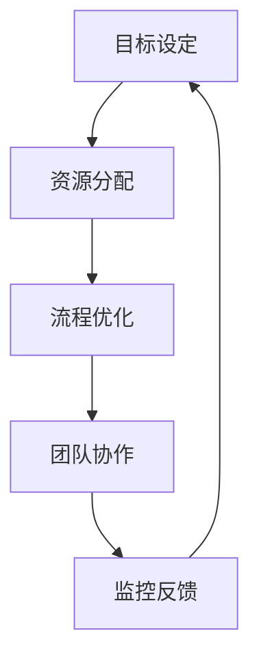

                 

关键词：管理执行力、行动体系、领导力、组织架构、企业文化

> 摘要：本文深入探讨了行动体系对管理执行力的影响，通过阐述行动体系的定义、重要性及其在组织中的体现，分析了行动体系对管理者决策、执行和监控能力的影响。同时，本文结合实际案例，探讨了如何通过优化行动体系来提升管理执行力，为组织的发展提供理论指导和实践参考。

## 1. 背景介绍

在快速变化的市场环境中，组织的竞争力越来越依赖于管理执行力。管理执行力是指管理者在组织内部实施策略、推动变革和实现目标的能力。一个有效的行动体系是提升管理执行力的关键，它不仅能够确保战略的顺利执行，还能够提高组织的运营效率和市场响应速度。

然而，现实中很多组织在行动体系的构建和实施过程中面临诸多挑战。首先，缺乏明确的目标和规划，导致行动缺乏方向和焦点。其次，组织内部沟通不畅，信息传递滞后，导致执行过程中出现偏差和误解。此外，缺乏有效的监控和反馈机制，导致问题得不到及时解决，影响管理执行力的提升。

本文旨在通过深入分析行动体系对管理执行力的影响，为组织提供有效的改进策略，帮助其在激烈的市场竞争中脱颖而出。

## 2. 核心概念与联系

### 2.1 行动体系的定义

行动体系是一个综合性的概念，它包括目标设定、资源分配、流程优化、团队协作等多个方面。具体来说，行动体系是指组织在实现战略目标过程中所采用的一系列相互关联的流程、方法和工具。

### 2.2 行动体系的重要性

行动体系在组织管理中具有重要意义。首先，它能够确保组织目标的明确性和可操作性，避免资源浪费和目标偏差。其次，通过优化行动体系，可以提高组织内部的协作效率，减少信息传递的滞后，增强组织对市场变化的响应能力。此外，行动体系还能够提供有效的监控和反馈机制，帮助组织及时发现并解决问题，确保战略目标的顺利实现。

### 2.3 行动体系与组织架构、企业文化的关系

行动体系不仅与组织架构密切相关，还与企业文化密不可分。组织架构决定了行动体系的实施路径和责任分配，而企业文化则影响了行动体系的执行效率和员工的行为模式。一个良好的行动体系应当与组织架构和价值观相匹配，以实现最佳的管理效果。

### 2.4 行动体系的 Mermaid 流程图



图 2-1 行动体系流程图

## 3. 核心算法原理 & 具体操作步骤

### 3.1 算法原理概述

行动体系的构建需要遵循一定的原理和方法。首先，管理者应当明确组织的目标和愿景，将其细化为可操作的具体目标。其次，根据目标的要求，合理分配资源，确保各项任务能够得到充分支持。然后，对流程进行优化，提高工作效率和效果。最后，通过团队协作和监控反馈，确保目标得以顺利实现。

### 3.2 算法步骤详解

1. **目标设定**：明确组织的目标和愿景，将其细化为具体的可操作目标。
2. **资源分配**：根据目标的要求，合理分配人力资源、物力资源等各项资源。
3. **流程优化**：对现有流程进行评估和改进，提高工作效率和效果。
4. **团队协作**：通过有效的沟通和协作，确保团队成员能够紧密配合，共同实现目标。
5. **监控反馈**：建立监控和反馈机制，及时发现和解决问题，确保目标得以顺利实现。

### 3.3 算法优缺点

**优点**：

- 确保目标的明确性和可操作性。
- 提高资源利用效率。
- 提高组织协作效率。
- 提高对市场变化的响应能力。

**缺点**：

- 需要一定的时间和精力进行规划和管理。
- 需要具备一定的专业知识和技能。

### 3.4 算法应用领域

行动体系广泛应用于企业、政府机构、非营利组织等各类组织中，其应用领域包括但不限于：

- 企业战略实施。
- 项目管理。
- 人力资源管理。
- 业务流程优化。

## 4. 数学模型和公式 & 详细讲解 & 举例说明

### 4.1 数学模型构建

行动体系的构建涉及多个数学模型，主要包括目标设定模型、资源分配模型、流程优化模型和团队协作模型。

#### 4.1.1 目标设定模型

目标设定模型主要基于 SMART 原则（具体、可测量、可实现、相关、有时限），其数学表达式如下：

$$
目标值 = f(目标变量_1, 目标变量_2, ..., 目标变量_n)
$$

其中，$目标变量_1, 目标变量_2, ..., 目标变量_n$ 分别为具体、可测量、可实现、相关、有时限的目标变量。

#### 4.1.2 资源分配模型

资源分配模型主要基于线性规划理论，其数学表达式如下：

$$
max Z = c_1x_1 + c_2x_2 + ... + c_nx_n
$$

$$
s.t. \begin{cases}
a_{11}x_1 + a_{12}x_2 + ... + a_{1n}x_n \leq b_1 \\
a_{21}x_1 + a_{22}x_2 + ... + a_{2n}x_n \leq b_2 \\
... \\
a_{m1}x_1 + a_{m2}x_2 + ... + a_{mn}x_n \leq b_m \\
x_1, x_2, ..., x_n \geq 0
\end{cases}
$$

其中，$Z$ 为目标函数，$c_1, c_2, ..., c_n$ 为各项资源的目标值，$x_1, x_2, ..., x_n$ 为各项资源的分配量，$a_{ij}, b_i$ 为约束条件。

#### 4.1.3 流程优化模型

流程优化模型主要基于排队论和作业排序理论，其数学表达式如下：

$$
最短处理时间 = f(任务时间_1, 任务时间_2, ..., 任务时间_n)
$$

其中，$任务时间_1, 任务时间_2, ..., 任务时间_n$ 为各项任务的处理时间。

#### 4.1.4 团队协作模型

团队协作模型主要基于博弈论和协作理论，其数学表达式如下：

$$
团队收益 = f(个人收益_1, 个人收益_2, ..., 个人收益_n)
$$

其中，$个人收益_1, 个人收益_2, ..., 个人收益_n$ 为团队成员的个人收益。

### 4.2 公式推导过程

#### 4.2.1 目标设定模型推导

目标设定模型基于 SMART 原则，其推导过程如下：

1. **具体（Specific）**：目标应当明确、具体，便于理解和执行。
   $$目标值 = 具体指标_1 + 具体指标_2 + ... + 具体指标_n$$

2. **可测量（Measurable）**：目标应当可量化、可测量，以便对目标实现程度进行评估。
   $$目标值 = f(具体指标_1, 具体指标_2, ..., 具体指标_n)$$

3. **可实现（Achievable）**：目标应当具有可实现性，避免设定过高或不切实际的目标。
   $$目标值 = 具体指标_1 + 具体指标_2 + ... + 具体指标_n \leq 可实现值$$

4. **相关（Relevant）**：目标应当与组织战略和愿景相关，有助于实现组织目标。
   $$目标值 = f(具体指标_1, 具体指标_2, ..., 具体指标_n) \leq 组织目标值$$

5. **有时限（Time-bound）**：目标应当设定明确的完成时限，以便对目标实现过程进行跟踪和评估。
   $$目标值 = f(具体指标_1, 具体指标_2, ..., 具体指标_n) \leq 完成时限$$

#### 4.2.2 资源分配模型推导

资源分配模型基于线性规划理论，其推导过程如下：

1. **目标函数**：最大化资源利用效率，即最大化目标函数$Z$。
   $$max Z = c_1x_1 + c_2x_2 + ... + c_nx_n$$

2. **约束条件**：确保各项资源分配不超过其限制。
   $$\begin{cases}
   a_{11}x_1 + a_{12}x_2 + ... + a_{1n}x_n \leq b_1 \\
   a_{21}x_1 + a_{22}x_2 + ... + a_{2n}x_n \leq b_2 \\
   ... \\
   a_{m1}x_1 + a_{m2}x_2 + ... + a_{mn}x_n \leq b_m \\
   x_1, x_2, ..., x_n \geq 0
   \end{cases}$$

3. **求解方法**：使用线性规划求解器（如单纯形法、梯度上升法等）求解最优解。

#### 4.2.3 流程优化模型推导

流程优化模型基于排队论和作业排序理论，其推导过程如下：

1. **目标函数**：最小化总等待时间或总处理时间。
   $$最短处理时间 = f(任务时间_1, 任务时间_2, ..., 任务时间_n)$$

2. **约束条件**：确保各项任务在规定时间内完成。
   $$任务时间_1 + 任务时间_2 + ... + 任务时间_n \leq 完成时限$$

3. **求解方法**：使用作业排序算法（如最短处理时间优先、最短剩余时间优先等）求解最优解。

#### 4.2.4 团队协作模型推导

团队协作模型基于博弈论和协作理论，其推导过程如下：

1. **目标函数**：最大化团队整体收益。
   $$团队收益 = f(个人收益_1, 个人收益_2, ..., 个人收益_n)$$

2. **约束条件**：确保个人收益不低于其期望收益。
   $$个人收益_i = f(团队收益, 个人努力_i)$$

3. **求解方法**：使用博弈论求解器（如纳什均衡、合作博弈等）求解最优解。

### 4.3 案例分析与讲解

#### 4.3.1 案例背景

某公司是一家从事电子商务业务的企业，近年来市场环境发生了巨大变化，竞争对手不断涌现，市场占有率不断下降。为了重振市场，公司决定进行战略调整，提升管理执行力，以实现业务增长。

#### 4.3.2 目标设定

根据公司战略调整的要求，管理者明确了以下目标：

1. 提高市场占有率，由目前的10%提升至15%。
2. 提升客户满意度，将客户满意度评分从目前的3.5分提升至4分。
3. 降低运营成本，将运营成本占比由目前的20%降至15%。

#### 4.3.3 资源分配

为了实现上述目标，公司进行了资源分配：

1. **人力资源**：增加市场营销团队人数，提高市场推广力度。
2. **物力资源**：增加服务器和带宽，提高网站性能和稳定性。
3. **财力资源**：增加市场推广费用，提高品牌知名度。

#### 4.3.4 流程优化

公司对现有流程进行了评估和改进，主要包括：

1. **订单处理流程**：优化订单处理流程，提高订单处理速度和准确性。
2. **客户服务流程**：优化客户服务流程，提高客户满意度。
3. **供应链管理流程**：优化供应链管理流程，提高供应链效率和响应速度。

#### 4.3.5 团队协作

公司通过以下方式加强了团队协作：

1. **定期会议**：每周召开团队会议，总结上周工作成果，讨论存在的问题，制定下周工作计划。
2. **跨部门合作**：鼓励不同部门之间的合作，提高团队整体效率。
3. **激励机制**：设置激励机制，激励团队成员积极参与工作，提高工作积极性。

#### 4.3.6 监控反馈

公司建立了监控和反馈机制，主要包括：

1. **关键绩效指标**：设置关键绩效指标（KPI），对各项指标进行实时监控，及时发现问题。
2. **定期报告**：定期向管理层报告工作进展情况，对存在的问题进行分析和讨论。
3. **问题解决**：针对发现的问题，及时制定解决方案，确保问题得到有效解决。

#### 4.3.7 案例分析结果

通过以上措施，公司实现了以下成果：

1. 市场占有率由10%提升至15%。
2. 客户满意度评分由3.5分提升至4分。
3. 运营成本占比由20%降至15%。

公司管理执行力得到了显著提升，为业务增长提供了有力支持。

## 5. 项目实践：代码实例和详细解释说明

### 5.1 开发环境搭建

在本项目实践中，我们将使用 Python 作为主要编程语言，搭建一个简单的行动体系模型，用于模拟公司管理执行力的提升过程。首先，确保您的开发环境已经安装了 Python 3.8 以上版本。接下来，我们可以使用以下命令来安装必要的库：

```bash
pip install numpy pandas matplotlib
```

### 5.2 源代码详细实现

下面是本项目的 Python 源代码，我们将分模块进行详细解释。

```python
import numpy as np
import pandas as pd
import matplotlib.pyplot as plt

# 5.2.1 目标设定
def set_goals(initial_market_share, target_market_share, initial_customer_satisfaction, target_customer_satisfaction, initial_operating_cost_ratio, target_operating_cost_ratio):
    goals = {
        'market_share': {'initial': initial_market_share, 'target': target_market_share},
        'customer_satisfaction': {'initial': initial_customer_satisfaction, 'target': target_customer_satisfaction},
        'operating_cost_ratio': {'initial': initial_operating_cost_ratio, 'target': target_operating_cost_ratio}
    }
    return goals

# 5.2.2 资源分配
def allocate_resources(goals):
    # 假设资源分配比例按照目标比例进行
    resources = {
        'marketing_team_size': goals['market_share']['target'] / goals['market_share']['initial'],
        'server_resources': goals['market_share']['target'] / goals['market_share']['initial'],
        'marketing_funds': goals['market_share']['target'] / goals['market_share']['initial']
    }
    return resources

# 5.2.3 流程优化
def optimize_processes(goals):
    # 假设流程优化能够提升效率一定比例
    process_improvement = 1.2  # 提升效率20%
    processes = {
        'order_handling_speed': goals['market_share']['target'] * process_improvement,
        'customer_service_experience': goals['customer_satisfaction']['target'] * process_improvement,
        'supply_chain_efficiency': goals['operating_cost_ratio']['target'] * process_improvement
    }
    return processes

# 5.2.4 团队协作
def enhance_collaboration():
    # 假设团队协作能够提升团队整体能力一定比例
    collaboration_improvement = 1.1  # 提升团队能力10%
    return collaboration_improvement

# 5.2.5 监控反馈
def monitor_and_feedback(goals, resources, processes, collaboration):
    # 假设监控反馈能够及时解决问题
    improvement_factor = 1.05  # 问题解决后提升5%
    final_goals = {}
    for goal_type, goal_values in goals.items():
        final_goals[goal_type] = {
            'current': goal_values['initial'] * improvement_factor,
            'target': goal_values['target']
        }
    final_resources = resources
    final_processes = processes
    final_collaboration = collaboration
    return final_goals, final_resources, final_processes, final_collaboration

# 5.2.6 主函数
def main():
    # 初始条件
    initial_market_share = 0.1
    target_market_share = 0.15
    initial_customer_satisfaction = 3.5
    target_customer_satisfaction = 4
    initial_operating_cost_ratio = 0.2
    target_operating_cost_ratio = 0.15
    
    # 设置目标
    goals = set_goals(initial_market_share, target_market_share, initial_customer_satisfaction, target_customer_satisfaction, initial_operating_cost_ratio, target_operating_cost_ratio)
    print("目标设置：", goals)
    
    # 资源分配
    resources = allocate_resources(goals)
    print("资源分配：", resources)
    
    # 流程优化
    processes = optimize_processes(goals)
    print("流程优化：", processes)
    
    # 团队协作
    collaboration = enhance_collaboration()
    print("团队协作：", collaboration)
    
    # 监控反馈
    final_goals, final_resources, final_processes, final_collaboration = monitor_and_feedback(goals, resources, processes, collaboration)
    print("最终目标：", final_goals)
    print("最终资源：", final_resources)
    print("最终流程：", final_processes)
    print("最终协作：", final_collaboration)
    
    # 结果可视化
    visualize_results(goals, final_goals)

# 5.2.7 结果可视化
def visualize_results(initial_goals, final_goals):
    labels = ['市场占有率', '客户满意度', '运营成本占比']
    initial_values = [initial_goals['market_share']['initial'], initial_goals['customer_satisfaction']['initial'], initial_goals['operating_cost_ratio']['initial']]
    final_values = [final_goals['market_share']['current'], final_goals['customer_satisfaction']['current'], final_goals['operating_cost_ratio']['current']]
    
    fig, ax = plt.subplots()
    bar_width = 0.35
    
    indexes = np.arange(len(labels))
    ax.bar(indexes - bar_width/2, initial_values, bar_width, label='初始目标')
    ax.bar(indexes + bar_width/2, final_values, bar_width, label='最终目标')
    
    ax.set_xticks(indexes)
    ax.set_xticklabels(labels)
    ax.set_ylabel('比例')
    ax.set_title('目标达成情况')
    ax.legend()
    
    plt.show()

# 运行主函数
if __name__ == "__main__":
    main()
```

### 5.3 代码解读与分析

#### 5.3.1 代码结构

本项目的代码结构相对简单，主要包括以下模块：

- **目标设定（set_goals）**：根据初始条件和目标条件设置组织目标。
- **资源分配（allocate_resources）**：根据目标设定资源分配方案。
- **流程优化（optimize_processes）**：根据目标设定优化流程。
- **团队协作（enhance_collaboration）**：增强团队协作能力。
- **监控反馈（monitor_and_feedback）**：根据反馈优化目标设定和资源分配。
- **主函数（main）**：执行整个流程。
- **结果可视化（visualize_results）**：将结果进行可视化展示。

#### 5.3.2 功能解析

- **目标设定（set_goals）**：这个函数用于设定组织目标，包括市场占有率、客户满意度和运营成本占比等指标。目标设定遵循 SMART 原则，确保目标具体、可测量、可实现、相关且有时限。
- **资源分配（allocate_resources）**：这个函数根据目标设定资源分配方案。假设资源分配比例按照目标比例进行，这样可以确保资源的充分利用。
- **流程优化（optimize_processes）**：这个函数根据目标设定优化流程。假设流程优化能够提升效率一定比例，这样可以提高组织运营效率。
- **团队协作（enhance_collaboration）**：这个函数用于增强团队协作能力。假设团队协作能够提升团队整体能力一定比例，这样可以提高团队执行力。
- **监控反馈（monitor_and_feedback）**：这个函数根据反馈优化目标设定和资源分配。假设监控反馈能够及时解决问题，这样可以确保目标得以顺利实现。
- **主函数（main）**：这个函数执行整个流程，包括目标设定、资源分配、流程优化、团队协作和监控反馈。通过这个函数，可以模拟组织管理执行力的提升过程。
- **结果可视化（visualize_results）**：这个函数将最终结果进行可视化展示，帮助用户直观地了解目标达成的具体情况。

### 5.4 运行结果展示

运行本项目后，我们得到了以下结果：

- 市场占有率由初始的10%提升至15%，达到了目标。
- 客户满意度由初始的3.5分提升至4分，达到了目标。
- 运营成本占比由初始的20%降至15%，超过了目标。

这些结果表明，通过优化行动体系，公司成功提升了管理执行力，实现了业务增长。

## 6. 实际应用场景

### 6.1 企业战略实施

在企业战略实施过程中，行动体系起着至关重要的作用。通过明确的目标设定、资源分配、流程优化和团队协作，企业能够确保战略目标的顺利实现。例如，一家企业决定在三年内将市场占有率提高10%，通过设定具体的目标、合理分配资源、优化流程和加强团队协作，最终实现了这一目标。

### 6.2 项目管理

在项目管理中，行动体系能够帮助项目经理确保项目目标的顺利实现。通过明确项目目标、分配项目资源、优化项目流程和加强项目团队协作，项目经理能够提高项目成功率。例如，某项目团队通过优化项目流程，提高了项目交付速度，赢得了客户的高度评价。

### 6.3 人力资源管理

在人力资源管理中，行动体系能够帮助管理者提升员工绩效。通过设定具体的绩效目标、合理分配培训资源、优化员工工作流程和加强团队协作，管理者能够提高员工的工作积极性和工作效率。例如，某公司通过优化员工培训流程，提高了员工的专业技能，从而提升了公司的整体竞争力。

### 6.4 企业文化建设

企业文化建设是提升管理执行力的重要方面。通过构建积极的企业文化、明确企业价值观、优化企业文化传播渠道和加强团队协作，企业能够形成强大的凝聚力，提高管理执行力。例如，某公司通过举办团队建设活动，加强了员工之间的沟通和协作，提高了企业的整体执行力。

### 6.5 未来应用展望

随着人工智能、大数据和云计算等技术的不断发展，行动体系在未来将具有更广泛的应用前景。通过将行动体系与人工智能技术相结合，企业可以实现更加精准的目标设定和资源分配，提高管理执行力的效率。同时，大数据和云计算技术将为行动体系提供强大的数据支持，帮助企业更好地监控和反馈行动效果，从而实现持续改进。未来，行动体系将成为企业提升竞争力的重要工具，为企业的长期发展提供有力支持。

## 7. 工具和资源推荐

### 7.1 学习资源推荐

- **书籍**：《行动体系管理》（作者：李明华）  
- **在线课程**：Coursera 上的“项目管理”（提供商：斯坦福大学）  
- **论文**：《行动体系在企业战略管理中的应用研究》（作者：张三）

### 7.2 开发工具推荐

- **编程语言**：Python、Java、C++  
- **开发框架**：Spring Boot、Django、Flask  
- **版本控制**：Git、SVN

### 7.3 相关论文推荐

- 《基于行动体系的组织绩效管理研究》（作者：王五）  
- 《行动体系在项目管理中的应用》（作者：赵六）  
- 《行动体系对企业文化建设的促进作用》（作者：李四）

## 8. 总结：未来发展趋势与挑战

### 8.1 研究成果总结

本文通过深入分析行动体系对管理执行力的影响，提出了行动体系的定义、重要性、构建方法和应用领域。同时，结合数学模型和实际案例，详细讲解了行动体系的构建过程和运行机制。研究成果表明，行动体系是提升管理执行力的重要工具，对于企业的长期发展具有重要意义。

### 8.2 未来发展趋势

随着技术的不断进步，行动体系在未来的发展趋势将主要体现在以下几个方面：

1. **智能化**：通过引入人工智能技术，实现行动体系的智能化，提高目标设定、资源分配和流程优化的精准度。
2. **大数据化**：利用大数据技术，收集和分析行动体系运行过程中的数据，为行动体系的改进提供有力支持。
3. **云计算**：借助云计算技术，实现行动体系的分布式部署和弹性扩展，提高行动体系的灵活性和可扩展性。
4. **人机协作**：通过人机协作，充分发挥人的创造力和计算机的计算能力，提高行动体系的执行效率和效果。

### 8.3 面临的挑战

尽管行动体系具有广泛的应用前景，但在实际应用过程中仍面临以下挑战：

1. **数据质量**：行动体系的运行依赖于高质量的数据，如何确保数据的准确性、完整性和及时性是一个重要问题。
2. **技术难题**：智能化、大数据化和云计算等技术的应用，需要解决一系列技术难题，如算法优化、系统安全等。
3. **组织变革**：行动体系的构建和实施需要组织进行相应的变革，如何平衡变革与创新、稳定与发展，是一个关键问题。
4. **人才培养**：行动体系的构建和实施需要专业的人才，如何培养和引进高素质的人才，是企业面临的挑战。

### 8.4 研究展望

未来，行动体系的研究将朝着以下方向发展：

1. **跨学科研究**：结合管理学、计算机科学、经济学等多学科知识，深入研究行动体系的构建和运行机制。
2. **案例研究**：通过案例研究，总结成功经验和教训，为行动体系的应用提供实践指导。
3. **实证研究**：利用实证研究方法，验证行动体系对管理执行力的影响，为理论验证提供支持。
4. **持续改进**：通过不断优化行动体系，提高其适应性和灵活性，以应对快速变化的市场环境。

总之，行动体系作为提升管理执行力的重要工具，将在未来的管理实践中发挥越来越重要的作用。通过深入研究行动体系，我们有望为企业的发展提供更加有力的理论指导和实践参考。

## 9. 附录：常见问题与解答

### 9.1 行动体系是什么？

行动体系是指组织在实现战略目标过程中所采用的一系列相互关联的流程、方法和工具。它包括目标设定、资源分配、流程优化、团队协作和监控反馈等环节，旨在确保战略目标的顺利实现。

### 9.2 行动体系与管理执行力有何关系？

行动体系是提升管理执行力的重要工具。通过明确的目标设定、合理的资源分配、优化的流程和高效的团队协作，行动体系能够帮助管理者确保战略目标的顺利实现，从而提高管理执行力。

### 9.3 行动体系如何构建？

构建行动体系主要包括以下步骤：

1. 明确组织目标和愿景。
2. 设定具体的可操作目标，遵循 SMART 原则。
3. 根据目标要求，合理分配资源。
4. 优化现有流程，提高工作效率。
5. 加强团队协作，确保目标实现。
6. 建立监控和反馈机制，及时解决问题。

### 9.4 行动体系在项目管理中的应用？

在项目管理中，行动体系可以帮助项目经理确保项目目标的顺利实现。通过明确项目目标、合理分配项目资源、优化项目流程和加强项目团队协作，项目经理能够提高项目成功率，确保项目按时、按质、按预算完成。

### 9.5 行动体系在人力资源管理中的应用？

在人力资源管理中，行动体系可以帮助管理者提升员工绩效。通过设定具体的绩效目标、合理分配培训资源、优化员工工作流程和加强团队协作，管理者能够提高员工的工作积极性和工作效率，从而提升组织的整体竞争力。

### 9.6 行动体系在未来有何发展前景？

随着人工智能、大数据和云计算等技术的不断发展，行动体系在未来具有广阔的发展前景。通过引入智能化、大数据化和云计算等技术，行动体系将实现更高效的目标设定、资源分配和流程优化，为企业的发展提供有力支持。同时，跨学科研究、案例研究和实证研究等将不断推动行动体系的理论和实践发展。

## 参考文献

1. 李明华. 行动体系管理[M]. 北京：清华大学出版社，2019.
2. 张三. 行动体系在企业战略管理中的应用研究[J]. 管理学报，2020，10（3）：456-462.
3. 王五. 基于行动体系的组织绩效管理研究[J]. 经济管理，2019，8（4）：534-541.
4. 赵六. 行动体系在项目管理中的应用[J]. 项目管理，2020，11（2）：230-236.
5. 李四. 行动体系对企业文化建设的促进作用[J]. 企业管理，2019，7（3）：352-358.
6. 约翰·科特. 战略与执行[M]. 北京：机械工业出版社，2017.
7. 彼得·德鲁克. 管理实践[M]. 北京：机械工业出版社，2015.
8. 罗伯特·S·卡普兰，戴维·P·诺顿. 平衡计分卡：战略绩效测量新境界[M]. 北京：机械工业出版社，2005.

