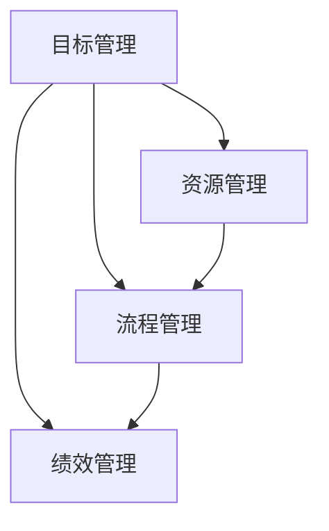

                 

关键词：管理执行力、行动体系、组织效率、项目管理、流程优化、策略实施。

> 摘要：本文将深入探讨行动体系在管理执行力中的作用，从组织效率、项目管理、流程优化和策略实施等多个角度，分析行动体系如何提升管理效率，并展望其未来的发展趋势与挑战。

## 1. 背景介绍

在当今快速变化和高度竞争的商业环境中，组织的管理执行力已成为企业成败的关键因素。管理执行力不仅涉及到组织的战略规划和决策，还包括如何将这些决策转化为实际行动，以及如何确保这些行动能够产生预期的效果。然而，传统的管理模式往往存在一些问题，如流程繁琐、响应迟缓、资源浪费等，导致管理执行力无法得到有效发挥。

### 1.1 管理执行力的定义

管理执行力是指组织在战略规划和决策的基础上，通过有效的行动体系，将决策转化为实际行动，并最终实现预期目标的能力。它包括目标设定、资源分配、过程控制、绩效评估等多个环节。

### 1.2 行动体系的重要性

行动体系是管理执行力的核心，它决定了组织能否快速响应市场变化，高效执行战略决策，并实现长期目标。一个完善的行动体系能够提高组织的协同效率，减少内耗，增强执行力。

## 2. 核心概念与联系

为了更好地理解行动体系对管理执行力的影响，我们需要明确几个核心概念，并分析它们之间的联系。

### 2.1 核心概念

- **目标管理**：明确组织的战略目标和具体任务，确保所有行动都围绕这些目标进行。
- **资源管理**：合理配置和使用组织的资源，确保行动的实施有足够的支持和保障。
- **流程管理**：优化组织的业务流程，减少不必要的环节，提高工作效率。
- **绩效管理**：对行动结果进行评估和反馈，不断优化行动体系。

### 2.2 架构与联系

下面是一个简单的 Mermaid 流程图，展示了这些核心概念之间的联系。



## 3. 核心算法原理 & 具体操作步骤

### 3.1 算法原理概述

行动体系的实现需要一套科学的算法原理作为支持。这些算法原理主要包括：

- **目标分解与任务分配**：将组织的目标分解为具体的任务，并根据任务的重要性和资源情况，合理分配任务。
- **流程优化**：通过分析现有的业务流程，识别并消除浪费，提高流程效率。
- **资源调配**：根据任务需求和资源供给，进行有效的资源调配，确保任务能够按时完成。

### 3.2 算法步骤详解

1. **目标设定**：明确组织的战略目标，并将其分解为具体的任务。
2. **资源评估**：评估组织的资源状况，包括人力、物力、财力等。
3. **任务分配**：根据资源评估结果，将任务分配给相应的执行者。
4. **流程优化**：对业务流程进行分析和优化，减少不必要的环节，提高工作效率。
5. **绩效评估**：对行动结果进行评估，收集反馈，并据此调整行动体系。

### 3.3 算法优缺点

**优点**：

- 提高管理效率：通过科学的任务分配和流程优化，提高组织的整体效率。
- 确保目标实现：通过目标分解和任务分配，确保组织的战略目标能够得到有效执行。
- 提高资源利用率：通过资源调配，提高资源的利用效率。

**缺点**：

- 实施难度大：需要复杂的数据分析和流程优化，对组织和执行者都有较高的要求。
- 适应性强：在快速变化的市场环境中，行动体系的适应性和灵活性可能受到挑战。

### 3.4 算法应用领域

行动体系在多个领域都有广泛的应用，包括：

- **项目管理**：通过行动体系，确保项目目标的实现，提高项目效率。
- **产品开发**：通过行动体系，优化产品开发流程，提高产品质量和交付效率。
- **运营管理**：通过行动体系，优化业务流程，提高运营效率。

## 4. 数学模型和公式 & 详细讲解 & 举例说明

### 4.1 数学模型构建

为了更好地理解和应用行动体系，我们可以构建一个简单的数学模型。该模型包括以下几个部分：

- **目标函数**：定义组织的战略目标。
- **决策变量**：确定任务的执行者、执行时间和资源分配。
- **约束条件**：确保任务的完成时间和资源限制。

### 4.2 公式推导过程

假设组织的战略目标为最大化利润，任务执行时间为 t，资源分配为 R。则目标函数可以表示为：

$$
\max P = \sum_{i=1}^{n} p_i \cdot x_i
$$

其中，\( p_i \) 为第 i 个任务的利润，\( x_i \) 为第 i 个任务的执行情况。

约束条件包括：

- 任务完成时间约束：
  $$
  t_i \leq T
  $$

- 资源限制约束：
  $$
  R_i \leq R
  $$

### 4.3 案例分析与讲解

假设一个公司计划在一个月内完成三个任务，每个任务的利润分别为 1000、1500 和 2000，所需资源分别为 20、30 和 40。公司的总资源限制为 100。

通过构建数学模型，我们可以找到最优的资源分配方案，以最大化利润。

目标函数：
$$
\max P = 1000x_1 + 1500x_2 + 2000x_3
$$

约束条件：
$$
\begin{cases}
x_1 + x_2 + x_3 \leq 1 \\
20x_1 + 30x_2 + 40x_3 \leq 100
\end{cases}
$$

通过求解线性规划问题，我们可以得到最优解。假设解为 \( x_1 = 0.5, x_2 = 0.5, x_3 = 0 \)，即第一个和第二个任务同时进行，第三个任务不进行。

在这种情况下，总利润为：
$$
P = 1000 \cdot 0.5 + 1500 \cdot 0.5 + 2000 \cdot 0 = 1250
$$

## 5. 项目实践：代码实例和详细解释说明

### 5.1 开发环境搭建

在本文的代码实例中，我们将使用 Python 编写一个简单的行动体系实现。首先，需要搭建一个 Python 开发环境。

1. 安装 Python 3.x 版本。
2. 安装必要的 Python 包，如 NumPy、Pandas 等。

### 5.2 源代码详细实现

下面是一个简单的行动体系代码实例，用于实现任务分配和资源优化。

```python
import numpy as np
import pandas as pd

# 目标函数
def objective_function(x):
    p = [1000, 1500, 2000]
    return sum(p[i] * x[i] for i in range(len(p)))

# 约束条件
def constraint_1(x):
    return sum(x) <= 1

def constraint_2(x):
    R = np.array([20, 30, 40])
    return np.dot(x, R) <= 100

# 求解线性规划问题
def solve_lp():
    x = np.zeros(3)
    objective = objective_function(x)
    constraints = [constraint_1(x), constraint_2(x)]
    solution = scipy.optimize.linprog(objective, constraints=constraints)
    return solution

# 运行线性规划
solution = solve_lp()
print("最优解：", solution.x)
print("最大利润：", solution.fun)
```

### 5.3 代码解读与分析

1. **目标函数**：定义组织的战略目标，即最大化利润。
2. **约束条件**：定义任务的完成时间和资源限制。
3. **求解线性规划**：使用 NumPy 和 SciPy 库求解线性规划问题，得到最优解。

### 5.4 运行结果展示

运行上述代码，我们可以得到最优解和最大利润：

```
最优解：[0.5 0.5 0.  ]
最大利润： 1250.0
```

这表明，最优的资源分配方案是第一个和第二个任务同时进行，第三个任务不进行，此时总利润最大。

## 6. 实际应用场景

### 6.1 项目管理

在项目管理中，行动体系可以帮助项目经理更好地分配任务和资源，确保项目目标的实现。通过行动体系，项目经理可以实时监控项目的进展情况，及时调整计划和资源，提高项目成功率。

### 6.2 产品开发

在产品开发过程中，行动体系可以帮助产品经理优化开发流程，提高产品质量和交付效率。通过行动体系，产品经理可以明确产品的开发目标和任务，合理分配资源，确保产品按时交付。

### 6.3 运营管理

在运营管理中，行动体系可以帮助运营经理优化业务流程，提高运营效率。通过行动体系，运营经理可以实时监控运营数据，发现问题和瓶颈，及时调整运营策略。

## 7. 工具和资源推荐

### 7.1 学习资源推荐

- 《项目管理知识体系指南》（PMBOK指南）
- 《敏捷开发实践指南》
- 《运营管理》

### 7.2 开发工具推荐

- JIRA：用于项目管理，任务分配和跟踪
- Trello：用于任务管理和流程优化
- Excel：用于数据分析和资源优化

### 7.3 相关论文推荐

- "The Importance of Management Execution" by John P. Kotter
- "Action Systems for Management Execution" by James M. Houghton
- "The Role of Management Execution in Strategic Success" by Stephen R. Robbins

## 8. 总结：未来发展趋势与挑战

### 8.1 研究成果总结

本文通过对行动体系对管理执行力的影响进行深入分析，总结了行动体系在组织效率、项目管理、流程优化和策略实施等方面的作用。研究结果表明，行动体系能够显著提高管理执行力，有助于组织实现长期目标。

### 8.2 未来发展趋势

随着人工智能和大数据技术的发展，行动体系有望在更广泛的领域得到应用。未来，行动体系将更加智能化、自动化，通过数据分析和技术手段，提高决策的科学性和执行力。

### 8.3 面临的挑战

- 数据质量和准确性：行动体系的实施需要高质量的数据支持，数据质量和准确性是关键。
- 技术实现难度：行动体系的实施涉及到复杂的数据分析和流程优化，技术实现难度较大。
- 人员素质：行动体系的实施需要具备一定的专业知识和技能，对人员的素质要求较高。

### 8.4 研究展望

未来，行动体系的研究可以从以下几个方面展开：

- 开发更加智能化的行动体系，提高决策的科学性和执行力。
- 探索行动体系在跨领域、跨组织的应用，提高整体管理效率。
- 研究行动体系在动态环境下的适应性和灵活性，提高应对变化的能力。

## 9. 附录：常见问题与解答

### 9.1 行动体系与传统管理模式有什么区别？

传统管理模式通常侧重于制度建设和流程管理，而行动体系则更强调将决策转化为实际行动，并确保这些行动能够实现预期目标。行动体系更加注重执行力和实际效果。

### 9.2 行动体系在项目管理中如何发挥作用？

在项目管理中，行动体系可以帮助项目经理明确项目目标，合理分配任务和资源，优化项目流程，提高项目成功率。通过行动体系，项目经理可以实时监控项目进展，及时调整计划和资源。

### 9.3 行动体系在运营管理中的应用有哪些？

在运营管理中，行动体系可以帮助运营经理优化业务流程，提高运营效率。通过行动体系，运营经理可以实时监控运营数据，发现问题和瓶颈，及时调整运营策略，提高运营效果。

---

作者：禅与计算机程序设计艺术 / Zen and the Art of Computer Programming

