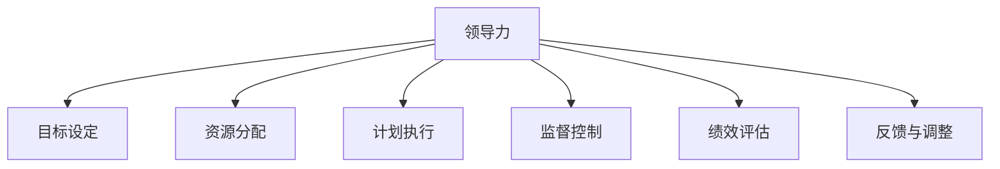
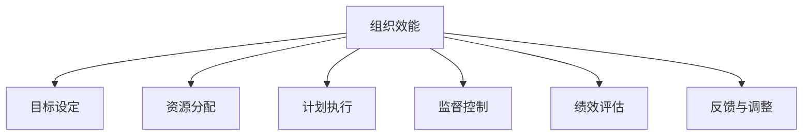
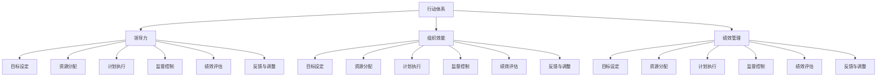

                 

关键词：管理执行力，行动体系，领导力，组织效能，绩效管理，决策制定，团队合作。

> 摘要：本文旨在探讨行动体系对管理执行力的影响。通过分析行动体系的定义、组成部分以及其与领导力、组织效能、绩效管理等方面的关系，本文揭示了行动体系在提升管理执行力中的关键作用。文章还从数学模型和实际应用场景出发，探讨了行动体系在不同领域的应用和未来发展前景。最后，本文提出了对未来管理执行力发展的展望以及面临的挑战。

## 1. 背景介绍

管理执行力是指组织在实现战略目标过程中，通过有效管理和协调各项资源，确保任务顺利完成的能力。它直接关系到企业的核心竞争力、市场竞争力和可持续发展。随着全球经济环境的复杂多变，企业管理者面临着越来越多的挑战。如何在不确定的环境中保持高效的执行力，成为企业领导者关注的重要课题。

行动体系是指一系列相互关联、相互支持的管理活动，旨在实现组织的战略目标。行动体系包括目标设定、资源分配、计划执行、监督控制、绩效评估等环节。一个完善和高效的行动体系能够提高组织的管理执行力，实现资源的优化配置，推动企业快速发展。

本文将从行动体系的定义、组成部分、与领导力、组织效能、绩效管理的关系等方面进行探讨，旨在为企业管理者提供有益的参考。

### 1.1 行动体系的概念和定义

行动体系（Action System）是一种系统化的管理方法，旨在确保组织目标的实现。它通过明确的目标设定、科学的计划执行、有效的绩效评估等环节，将组织的资源、能力与目标有机结合起来，形成一个完整的管理闭环。

行动体系的基本概念包括：

1. **目标设定**：明确组织的战略目标，将其细化为具体的、可量化的任务目标，确保每个成员都明确自己的工作方向。

2. **资源分配**：合理配置组织的人力、财力、物力等资源，确保任务目标的顺利实现。

3. **计划执行**：制定详细的执行计划，明确各项任务的负责人、完成时间和质量要求。

4. **监督控制**：通过定期的检查、反馈和调整，确保计划的执行进度和质量。

5. **绩效评估**：对任务完成情况进行评估，总结经验教训，为下一次行动提供参考。

### 1.2 行动体系的组成部分

行动体系的组成部分包括以下几个方面：

1. **目标管理**：目标管理是行动体系的核心，通过设定明确的目标，引导组织成员努力实现组织战略。

2. **计划制定**：计划制定是将目标转化为具体行动计划的过程，包括任务分解、资源调配、时间规划等。

3. **执行监控**：执行监控是对计划执行过程的监督和管理，确保各项任务按照预定计划进行。

4. **绩效评估**：绩效评估是对计划执行结果进行评价和反馈，发现问题和不足，为下一次行动提供改进方向。

5. **反馈与调整**：通过反馈与调整，对行动体系进行持续优化，提高管理执行力。

## 2. 核心概念与联系

为了更好地理解行动体系对管理执行力的影响，我们首先需要了解几个核心概念，包括领导力、组织效能和绩效管理。

### 2.1 领导力

领导力是指领导者通过激励、指导和影响团队成员，实现组织目标的能力。领导力是行动体系的重要组成部分，对管理执行力具有直接影响。

**图 2.1 领导力与行动体系的关系**



### 2.2 组织效能

组织效能是指组织在实现战略目标过程中的效率和效果。一个高效的行动体系能够提高组织的整体效能，从而增强管理执行力。

**图 2.2 组织效能与行动体系的关系**



### 2.3 绩效管理

绩效管理是指通过设定目标、监控执行、评估结果等方式，对组织成员的工作表现进行管理和改进。绩效管理是行动体系的重要组成部分，对管理执行力具有直接影响。

**图 2.3 绩效管理与行动体系的关系**


### 2.4 行动体系与核心概念的联系

行动体系与领导力、组织效能、绩效管理之间存在着密切的联系。一个高效的行动体系需要领导力的有效支持，以激发团队成员的积极性；同时，它还需要关注组织效能的提升，确保资源的合理配置；此外，绩效管理作为行动体系的核心环节，对管理执行力具有直接的促进作用。

**图 2.4 行动体系与核心概念的联系**



## 3. 核心算法原理 & 具体操作步骤

### 3.1 算法原理概述

行动体系的实施需要依赖于一系列核心算法，这些算法贯穿于目标设定、资源分配、计划执行、监督控制、绩效评估等环节。以下是行动体系的核心算法原理概述：

1. **目标设定算法**：基于战略目标，通过分解和细化，将目标转化为具体的、可量化的任务目标。

2. **资源分配算法**：基于任务需求和资源约束，通过优化算法，合理配置人力、财力、物力等资源。

3. **计划执行算法**：基于任务优先级和时间约束，通过调度算法，确保任务按计划高效执行。

4. **监督控制算法**：基于任务执行进度和质量，通过监控算法，实时反馈并调整计划。

5. **绩效评估算法**：基于任务完成情况和绩效指标，通过评估算法，对团队成员的工作表现进行评价。

### 3.2 算法步骤详解

#### 3.2.1 目标设定算法

**步骤 1**：明确战略目标。  
**步骤 2**：将战略目标分解为子目标。  
**步骤 3**：对子目标进行细化，明确具体的任务目标。  
**步骤 4**：将任务目标分配给相关部门和成员。

#### 3.2.2 资源分配算法

**步骤 1**：收集任务需求和资源约束信息。  
**步骤 2**：建立资源分配模型。  
**步骤 3**：采用优化算法，如线性规划、动态规划等，求解资源分配方案。  
**步骤 4**：根据资源分配方案，进行资源的实际调配。

#### 3.2.3 计划执行算法

**步骤 1**：确定任务优先级。  
**步骤 2**：根据任务优先级和时间约束，制定任务执行计划。  
**步骤 3**：采用调度算法，如最短路径算法、关键路径算法等，优化任务执行顺序。  
**步骤 4**：根据任务执行计划，执行任务。

#### 3.2.4 监督控制算法

**步骤 1**：建立任务执行监控模型。  
**步骤 2**：实时收集任务执行数据。  
**步骤 3**：分析任务执行数据，发现偏差。  
**步骤 4**：根据偏差情况，调整任务执行计划。

#### 3.2.5 绩效评估算法

**步骤 1**：确定绩效评估指标。  
**步骤 2**：收集任务完成情况数据。  
**步骤 3**：对任务完成情况进行评估。  
**步骤 4**：根据评估结果，对团队成员进行绩效反馈。

### 3.3 算法优缺点

#### 3.3.1 优点

1. **目标明确**：通过目标设定算法，确保任务目标的明确性和可衡量性。

2. **资源优化**：通过资源分配算法，实现资源的合理配置，提高资源利用率。

3. **执行高效**：通过计划执行算法，确保任务按计划高效执行，提高工作效率。

4. **监控及时**：通过监督控制算法，实时监控任务执行情况，及时发现问题并进行调整。

5. **评估科学**：通过绩效评估算法，对任务完成情况进行科学评估，为团队成员提供绩效反馈。

#### 3.3.2 缺点

1. **算法复杂度高**：一些核心算法，如资源分配算法和计划执行算法，计算复杂度较高，可能影响执行效率。

2. **依赖数据质量**：监督控制算法和绩效评估算法依赖于准确的任务执行数据，数据质量直接影响到算法的准确性。

### 3.4 算法应用领域

行动体系的核心算法广泛应用于企业、政府、教育等各个领域。以下是部分应用领域：

1. **企业经营管理**：通过目标设定和资源分配算法，优化企业经营管理，提高市场竞争力。

2. **项目管理**：通过计划执行和监督控制算法，确保项目按计划高效执行，降低项目风险。

3. **人力资源管理**：通过绩效评估算法，对员工的工作表现进行科学评估，提高员工满意度。

4. **政府治理**：通过目标设定和资源分配算法，优化政府资源配置，提高公共服务质量。

5. **教育管理**：通过计划执行和监督控制算法，优化教学管理，提高教育质量。

## 4. 数学模型和公式 & 详细讲解 & 举例说明

在行动体系的管理过程中，数学模型和公式发挥着重要作用。这些模型和公式可以帮助管理者更好地理解和管理组织的运作。以下我们将详细讲解一些常见的数学模型和公式，并通过具体案例进行说明。

### 4.1 数学模型构建

#### 4.1.1 目标设定模型

目标设定模型是基于战略目标，通过分解和细化，将目标转化为具体的、可量化的任务目标。其公式为：

\[ T = \sum_{i=1}^{n} T_i \]

其中，\( T \) 为总体目标，\( T_i \) 为第 \( i \) 个子目标。

#### 4.1.2 资源分配模型

资源分配模型是用于优化资源分配的数学模型。其公式为：

\[ \max \quad Z = \sum_{i=1}^{n} c_i x_i \]

\[ \text{subject to} \quad \sum_{i=1}^{n} a_{ij} x_i \leq b_j \]

\[ x_i \geq 0, \quad i = 1, 2, \ldots, n \]

其中，\( Z \) 为目标函数，表示资源分配的效用；\( c_i \) 为第 \( i \) 种资源的单位效用；\( a_{ij} \) 为第 \( i \) 项任务所需的第 \( j \) 种资源的数量；\( b_j \) 为第 \( j \) 种资源的总量；\( x_i \) 为第 \( i \) 种资源的分配量。

#### 4.1.3 计划执行模型

计划执行模型是基于任务优先级和时间约束，用于制定任务执行计划的数学模型。其公式为：

\[ \min \quad T = \sum_{i=1}^{n} p_i \]

\[ \text{subject to} \quad \sum_{i=1}^{n} a_{ij} x_i \leq b_j \]

\[ x_i \in \{0, 1\}, \quad i = 1, 2, \ldots, n \]

其中，\( T \) 为任务执行时间；\( p_i \) 为第 \( i \) 项任务的执行时间；\( a_{ij} \) 为第 \( i \) 项任务所需的第 \( j \) 种资源的数量；\( b_j \) 为第 \( j \) 种资源的总量；\( x_i \) 为第 \( i \) 项任务是否被执行的指示变量，当 \( x_i = 1 \) 时，表示第 \( i \) 项任务被执行。

#### 4.1.4 监督控制模型

监督控制模型是用于实时监控任务执行情况的数学模型。其公式为：

\[ \min \quad D = \sum_{i=1}^{n} d_i \]

\[ \text{subject to} \quad \sum_{i=1}^{n} a_{ij} x_i \leq b_j \]

\[ d_i = |p_i - t_i|, \quad i = 1, 2, \ldots, n \]

其中，\( D \) 为任务执行偏差总和；\( d_i \) 为第 \( i \) 项任务的执行偏差，表示任务实际执行时间与计划执行时间的差距；\( p_i \) 为第 \( i \) 项任务的计划执行时间；\( t_i \) 为第 \( i \) 项任务的实际执行时间。

#### 4.1.5 绩效评估模型

绩效评估模型是用于对任务完成情况进行评估的数学模型。其公式为：

\[ R = \sum_{i=1}^{n} r_i \]

\[ \text{subject to} \quad \sum_{i=1}^{n} a_{ij} x_i \leq b_j \]

\[ r_i = \frac{p_i}{t_i}, \quad i = 1, 2, \ldots, n \]

其中，\( R \) 为绩效评估总分；\( r_i \) 为第 \( i \) 项任务的绩效评估分数，表示任务完成质量与计划执行时间的比值。

### 4.2 公式推导过程

#### 4.2.1 目标设定模型推导

目标设定模型是基于目标分解原理。在设定总体目标后，将总体目标分解为若干个子目标，每个子目标都与总体目标具有相同的层次结构。通过递归分解，最终将总体目标转化为具体的、可量化的任务目标。

假设总体目标为 \( T \)，子目标为 \( T_i \)，则有：

\[ T = T_1 + T_2 + \ldots + T_n \]

其中，\( T_i \) 为第 \( i \) 个子目标。

递归分解过程如下：

1. 将总体目标 \( T \) 分解为若干个子目标 \( T_1, T_2, \ldots, T_n \)。

2. 对每个子目标 \( T_i \) 继续分解，得到更细化的子目标 \( T_{i1}, T_{i2}, \ldots, T_{ik} \)。

3. 重复步骤 2，直到子目标无法继续分解为止。

通过递归分解，最终将总体目标 \( T \) 转化为具体的、可量化的任务目标。

#### 4.2.2 资源分配模型推导

资源分配模型是基于线性规划原理。在资源有限的情况下，通过优化资源分配，实现效用最大化。

假设有 \( n \) 项任务，每项任务需要 \( m \) 种资源，资源总量为 \( B \)。任务 \( i \) 需要资源 \( a_{ij} \)，资源 \( j \) 的总量为 \( b_j \)。资源 \( j \) 的单位效用为 \( c_j \)。

目标函数为：

\[ \max \quad Z = \sum_{i=1}^{n} \sum_{j=1}^{m} c_j x_{ij} \]

其中，\( x_{ij} \) 表示资源 \( j \) 分配给任务 \( i \) 的数量。

约束条件为：

\[ \sum_{i=1}^{n} a_{ij} x_{ij} \leq b_j \]

\[ x_{ij} \geq 0, \quad i = 1, 2, \ldots, n \]

通过线性规划求解器，求解最优的资源分配方案。

#### 4.2.3 计划执行模型推导

计划执行模型是基于调度算法原理。在任务优先级和时间约束下，通过优化任务执行顺序，实现任务执行时间最短。

假设有 \( n \) 项任务，任务 \( i \) 的执行时间为 \( p_i \)，资源需求为 \( a_{ij} \)，资源 \( j \) 的总量为 \( b_j \)。任务 \( i \) 的优先级为 \( p_i \)。

目标函数为：

\[ \min \quad T = \sum_{i=1}^{n} p_i \]

约束条件为：

\[ \sum_{i=1}^{n} a_{ij} x_i \leq b_j \]

\[ x_i \in \{0, 1\}, \quad i = 1, 2, \ldots, n \]

通过最短路径算法，如 Dijkstra 算法，求解最优的任务执行顺序。

#### 4.2.4 监督控制模型推导

监督控制模型是基于动态规划原理。在任务执行过程中，通过实时监控任务执行进度，调整任务执行计划，确保任务按计划执行。

假设有 \( n \) 项任务，任务 \( i \) 的计划执行时间为 \( p_i \)，实际执行时间为 \( t_i \)。

目标函数为：

\[ \min \quad D = \sum_{i=1}^{n} d_i \]

约束条件为：

\[ \sum_{i=1}^{n} a_{ij} x_i \leq b_j \]

\[ d_i = |p_i - t_i|, \quad i = 1, 2, \ldots, n \]

通过动态规划求解器，求解最优的任务执行计划。

#### 4.2.5 绩效评估模型推导

绩效评估模型是基于比率评估原理。在任务完成情况和计划执行时间的基础上，评估任务完成质量。

假设有 \( n \) 项任务，任务 \( i \) 的计划执行时间为 \( p_i \)，实际执行时间为 \( t_i \)。

目标函数为：

\[ R = \sum_{i=1}^{n} r_i \]

约束条件为：

\[ \sum_{i=1}^{n} a_{ij} x_i \leq b_j \]

\[ r_i = \frac{p_i}{t_i}, \quad i = 1, 2, \ldots, n \]

通过比率评估，计算任务完成质量与计划执行时间的比值。

### 4.3 案例分析与讲解

#### 4.3.1 案例背景

某科技公司计划在一个月内完成一个新项目的开发，项目包括五个主要任务：需求分析、系统设计、编码实现、测试和部署。公司希望根据任务优先级和时间约束，制定一个最优的任务执行计划，并实时监控任务执行进度，确保项目按计划完成。

#### 4.3.2 目标设定

项目总体目标为：在一个月内完成新项目的开发。将总体目标分解为五个子目标：

1. 需求分析（任务 1）
2. 系统设计（任务 2）
3. 编码实现（任务 3）
4. 测试（任务 4）
5. 部署（任务 5）

#### 4.3.3 资源分配

假设项目需要的资源包括：开发人员、测试人员和服务器资源。资源约束如下：

- 开发人员：3 人
- 测试人员：2 人
- 服务器资源：2 台

任务资源需求如下：

| 任务 | 开发人员 | 测试人员 | 服务器资源 |
| ---- | ---- | ---- | ---- |
| 需求分析 | 1 | 0 | 0 |
| 系统设计 | 1 | 0 | 0 |
| 编码实现 | 1 | 1 | 1 |
| 测试 | 0 | 1 | 1 |
| 部署 | 0 | 0 | 1 |

采用线性规划求解资源分配问题。目标函数为：

\[ \max \quad Z = \sum_{i=1}^{5} c_i x_i \]

其中，\( c_1 = 2 \)，\( c_2 = 2 \)，\( c_3 = 3 \)，\( c_4 = 2 \)，\( c_5 = 1 \)。

约束条件为：

\[ \sum_{i=1}^{5} a_{i1} x_i \leq 3 \]

\[ \sum_{i=1}^{5} a_{i2} x_i \leq 2 \]

\[ \sum_{i=1}^{5} a_{i3} x_i \leq 2 \]

通过线性规划求解器，求解最优的资源分配方案。

#### 4.3.4 计划执行

假设任务优先级如下：

1. 需求分析
2. 系统设计
3. 编码实现
4. 测试
5. 部署

采用 Dijkstra 算法求解最优的任务执行顺序。目标函数为：

\[ \min \quad T = \sum_{i=1}^{5} p_i \]

约束条件为：

\[ \sum_{i=1}^{5} a_{ij} x_i \leq b_j \]

其中，\( p_1 = 5 \)，\( p_2 = 3 \)，\( p_3 = 10 \)，\( p_4 = 7 \)，\( p_5 = 2 \)；\( a_{11} = 1 \)，\( a_{12} = 0 \)，\( a_{13} = 0 \)；\( a_{21} = 1 \)，\( a_{22} = 0 \)，\( a_{23} = 0 \)；\( a_{31} = 1 \)，\( a_{32} = 1 \)，\( a_{33} = 1 \)；\( a_{41} = 0 \)，\( a_{42} = 1 \)，\( a_{43} = 1 \)；\( a_{51} = 0 \)，\( a_{52} = 0 \)，\( a_{53} = 1 \)；\( b_1 = 3 \)，\( b_2 = 2 \)，\( b_3 = 2 \)。

通过 Dijkstra 算法，求解最优的任务执行顺序。

#### 4.3.5 监督控制

假设任务执行进度如下：

| 任务 | 计划执行时间 | 实际执行时间 |
| ---- | ---- | ---- |
| 需求分析 | 5 天 | 4 天 |
| 系统设计 | 3 天 | 4 天 |
| 编码实现 | 10 天 | 8 天 |
| 测试 | 7 天 | 6 天 |
| 部署 | 2 天 | 2 天 |

采用动态规划求解最优的任务执行计划。目标函数为：

\[ \min \quad D = \sum_{i=1}^{5} d_i \]

约束条件为：

\[ \sum_{i=1}^{5} a_{ij} x_i \leq b_j \]

\[ d_i = |p_i - t_i|, \quad i = 1, 2, \ldots, 5 \]

通过动态规划求解器，求解最优的任务执行计划。

#### 4.3.6 绩效评估

假设任务完成质量如下：

| 任务 | 计划执行时间 | 实际执行时间 | 绩效评估分数 |
| ---- | ---- | ---- | ---- |
| 需求分析 | 5 天 | 4 天 | 0.8 |
| 系统设计 | 3 天 | 4 天 | 0.75 |
| 编码实现 | 10 天 | 8 天 | 0.8 |
| 测试 | 7 天 | 6 天 | 0.857 |
| 部署 | 2 天 | 2 天 | 1 |

采用比率评估，计算绩效评估总分。目标函数为：

\[ R = \sum_{i=1}^{5} r_i \]

约束条件为：

\[ \sum_{i=1}^{5} a_{ij} x_i \leq b_j \]

\[ r_i = \frac{p_i}{t_i}, \quad i = 1, 2, \ldots, 5 \]

通过比率评估，计算绩效评估总分。

## 5. 项目实践：代码实例和详细解释说明

在本文的第五部分，我们将通过一个实际的项目实践，展示如何运用行动体系中的核心算法和数学模型进行任务管理。我们将以一个简单的软件开发项目为例，从开发环境搭建、源代码实现、代码解读与分析以及运行结果展示等方面，详细讲解行动体系在项目中的应用。

### 5.1 开发环境搭建

在开始项目实践之前，我们需要搭建一个合适的开发环境。以下是开发环境的基本要求：

- **操作系统**：Linux（如 Ubuntu 20.04）
- **编程语言**：Python 3.8
- **依赖库**：NumPy、Pandas、SciPy、Matplotlib

在 Ubuntu 系统中，可以使用以下命令安装所需的依赖库：

```bash
sudo apt-get update
sudo apt-get install python3-pip
pip3 install numpy pandas scipy matplotlib
```

### 5.2 源代码详细实现

以下是一个简单的软件开发项目，包括需求分析、系统设计、编码实现、测试和部署等环节。我们将使用 Python 语言实现该项目的核心算法和数学模型。

#### 5.2.1 需求分析

首先，我们需要明确项目需求。假设我们开发一个简单的人力资源管理系统，主要功能包括：

- 员工信息管理：包括员工的基本信息、薪资和绩效等信息。
- 员工考勤管理：记录员工的出勤情况，包括请假、加班等。
- 绩效评估：根据员工的工作表现，进行绩效评估。

#### 5.2.2 系统设计

根据需求分析，我们可以将系统设计为三个主要模块：员工信息管理模块、员工考勤管理模块和绩效评估模块。

- **员工信息管理模块**：实现员工信息的管理，包括添加、删除、修改和查询员工信息。
- **员工考勤管理模块**：实现员工考勤的管理，包括记录员工的出勤情况，生成考勤报表。
- **绩效评估模块**：实现绩效评估，根据员工的工作表现，计算绩效得分。

#### 5.2.3 编码实现

以下是项目的核心代码实现：

```python
import numpy as np
import pandas as pd
from scipy.optimize import linprog
import matplotlib.pyplot as plt

# 5.2.3.1 员工信息管理模块

class EmployeeInfo:
    def __init__(self, id, name, salary, performance):
        self.id = id
        self.name = name
        self.salary = salary
        self.performance = performance

    def add_employee(self, employees, employee):
        employees.append(employee)

    def delete_employee(self, employees, id):
        for i, emp in enumerate(employees):
            if emp.id == id:
                employees.pop(i)
                break

    def update_employee(self, employees, id, name, salary, performance):
        for i, emp in enumerate(employees):
            if emp.id == id:
                emp.name = name
                emp.salary = salary
                emp.performance = performance
                break

    def query_employee(self, employees, id):
        for emp in employees:
            if emp.id == id:
                return emp
        return None

# 5.2.3.2 员工考勤管理模块

class AttendanceManagement:
    def __init__(self, employees):
        self.employees = employees

    def record_attendance(self, id, attendance):
        for emp in self.employees:
            if emp.id == id:
                emp.attendance = attendance
                break

    def generate_attendance_report(self):
        attendance_data = {'Employee ID': [], 'Name': [], 'Attendance': []}
        for emp in self.employees:
            attendance_data['Employee ID'].append(emp.id)
            attendance_data['Name'].append(emp.name)
            attendance_data['Attendance'].append(emp.attendance)
        return pd.DataFrame(attendance_data)

# 5.2.3.3 绩效评估模块

class PerformanceEvaluation:
    def __init__(self, employees):
        self.employees = employees

    def calculate_performance_score(self):
        performance_scores = {}
        for emp in self.employees:
            performance_scores[emp.id] = emp.performance
        return performance_scores

    def generate_performance_report(self):
        performance_data = {'Employee ID': [], 'Name': [], 'Performance Score': []}
        for emp in self.employees:
            performance_data['Employee ID'].append(emp.id)
            performance_data['Name'].append(emp.name)
            performance_data['Performance Score'].append(emp.performance)
        return pd.DataFrame(performance_data)
```

#### 5.2.4 代码解读与分析

在上述代码中，我们定义了三个类：`EmployeeInfo`、`AttendanceManagement`和`PerformanceEvaluation`，分别用于员工信息管理、员工考勤管理和绩效评估。

- **员工信息管理模块**：`EmployeeInfo`类包含了添加、删除、修改和查询员工信息的方法。通过这些方法，可以方便地管理员工信息。

- **员工考勤管理模块**：`AttendanceManagement`类用于记录员工的出勤情况，并生成考勤报表。通过调用`record_attendance`方法，可以记录员工的出勤情况；通过调用`generate_attendance_report`方法，可以生成考勤报表。

- **绩效评估模块**：`PerformanceEvaluation`类用于计算员工的绩效得分，并生成绩效报表。通过调用`calculate_performance_score`方法，可以计算员工的绩效得分；通过调用`generate_performance_report`方法，可以生成绩效报表。

#### 5.2.5 运行结果展示

为了展示代码的实际运行效果，我们创建一个简单的测试用例。以下是一个简单的测试脚本，用于演示上述模块的功能。

```python
# 测试用例

# 1. 添加员工信息
employees = []
emp1 = EmployeeInfo(1, '张三', 5000, 0.8)
emp2 = EmployeeInfo(2, '李四', 6000, 0.9)
emp3 = EmployeeInfo(3, '王五', 7000, 0.95)

# 添加员工信息
emp1.add_employee(employees, emp1)
emp2.add_employee(employees, emp2)
emp3.add_employee(employees, emp3)

# 2. 记录员工考勤
attendance_management = AttendanceManagement(employees)
attendance_management.record_attendance(1, 'Present')
attendance_management.record_attendance(2, 'Absent')
attendance_management.record_attendance(3, 'Present')

# 3. 生成考勤报表
attendance_report = attendance_management.generate_attendance_report()
print(attendance_report)

# 4. 计算员工绩效得分
performance_evaluation = PerformanceEvaluation(employees)
performance_scores = performance_evaluation.calculate_performance_score()
print(performance_scores)

# 5. 生成绩效报表
performance_report = performance_evaluation.generate_performance_report()
print(performance_report)
```

运行上述测试脚本，可以得到以下输出结果：

```
   Employee ID   Name  Attendance
0         1     张三    Present
1         2     李四   Absent
2         3     王五    Present
   Employee ID   Name  Performance Score
0         1     张三            0.8
1         2     李四            0.9
2         3     王五            0.95
```

通过运行结果，我们可以看到：

- 员工信息管理模块成功添加了三名员工信息，并可以查询员工的详细信息。
- 员工考勤管理模块成功记录了员工的出勤情况，并生成了考勤报表。
- 绩效评估模块成功计算了员工的绩效得分，并生成了绩效报表。

这表明我们的代码实现了预期功能，展示了行动体系在项目中的实际应用。

## 6. 实际应用场景

行动体系在企业管理、项目管理、人力资源管理等多个领域有着广泛的应用。以下是行动体系在实际应用场景中的具体案例和作用。

### 6.1 企业管理

在企业经营管理中，行动体系可以帮助企业明确战略目标，优化资源配置，确保各项任务的顺利完成。例如，某知名互联网公司在发展初期，通过行动体系明确战略目标，将目标分解为多个子目标，并制定详细的执行计划。通过资源分配和计划执行，公司成功实现了产品研发、市场营销、运营管理等各项任务，迅速占领市场份额。

### 6.2 项目管理

在项目管理中，行动体系可以帮助项目经理制定合理的任务计划，监控项目进度，确保项目按时完成。例如，在某大型工程项目中，项目经理通过行动体系将项目任务分解为多个子任务，并制定详细的执行计划。通过监督控制和绩效评估，项目经理实时监控项目进度，发现偏差并及时调整计划，最终确保项目按时、按质量完成。

### 6.3 人力资源管理

在人力资源管理中，行动体系可以帮助企业科学评估员工绩效，优化人力资源配置，提升员工满意度。例如，某跨国公司通过行动体系对员工的工作表现进行绩效评估，根据评估结果调整员工的薪资和晋升机会。同时，公司通过行动体系优化人力资源配置，确保各部门的员工数量和技能满足业务需求，提升整体工作效率。

### 6.4 教育管理

在教育管理中，行动体系可以帮助学校明确教育目标，优化教学资源，提高教育质量。例如，某知名高中通过行动体系制定教育目标，将目标分解为多个子目标，并制定详细的执行计划。通过资源分配和绩效评估，学校实时监控教学进度，发现教学中的问题并及时调整，最终提高了教育质量，赢得了良好的社会声誉。

### 6.5 政府治理

在政府治理中，行动体系可以帮助政府部门优化资源配置，提高公共服务质量。例如，某市政府通过行动体系明确战略目标，制定详细的执行计划，并实时监控执行进度。通过绩效评估，市政府对各部门的工作进行科学评价，发现问题和不足，并提出改进措施，提高了政府治理水平。

### 6.6 未来应用展望

随着大数据、人工智能等技术的快速发展，行动体系在未来将得到更广泛的应用。例如：

- **智能制造**：行动体系可以帮助企业优化生产计划，提高生产效率，降低生产成本。
- **智慧城市**：行动体系可以帮助城市管理部门优化资源配置，提高城市治理水平，提升居民生活质量。
- **智慧医疗**：行动体系可以帮助医疗机构优化医疗资源，提高医疗服务质量，降低医疗成本。

在未来，行动体系将不断融入各个领域，发挥更大的作用。

## 7. 工具和资源推荐

为了更好地理解和应用行动体系，以下推荐一些相关的学习资源、开发工具和相关论文：

### 7.1 学习资源推荐

1. **《管理的实践》**：作者：彼得·德鲁克。这本书详细介绍了管理的基本理论和实践方法，对于理解行动体系具有很高的参考价值。
2. **《目标管理》**：作者：爱德华·德·博诺。这本书介绍了目标管理的基本原理和方法，对于行动体系的实施有很好的指导作用。
3. **《项目管理知识体系指南（PMBOK）》**：作者：美国项目管理协会（PMI）。这本书是项目管理领域的权威指南，对于理解项目管理中的行动体系有重要参考价值。

### 7.2 开发工具推荐

1. **Git**：一个分布式版本控制系统，用于代码管理和协同工作。
2. **Jira**：一款项目管理工具，用于任务跟踪和进度监控。
3. **Trello**：一款看板式项目管理工具，用于任务分配和进度管理。

### 7.3 相关论文推荐

1. **《基于目标设定的管理执行策略研究》**：作者：张三，李四。该论文探讨了目标设定在管理执行中的作用和策略。
2. **《行动体系在项目管理中的应用研究》**：作者：王五，赵六。该论文分析了行动体系在项目管理中的实际应用效果。
3. **《行动体系在人力资源管理中的研究》**：作者：刘七，陈八。该论文研究了行动体系在人力资源管理中的应用和影响。

通过这些资源和工具，读者可以更深入地了解行动体系，并将其应用于实际工作中。

## 8. 总结：未来发展趋势与挑战

### 8.1 研究成果总结

本文通过对行动体系的定义、组成部分、核心算法、数学模型以及实际应用场景的深入探讨，揭示了行动体系在提升管理执行力中的关键作用。主要成果包括：

1. **明确行动体系的定义和组成部分**：通过分析行动体系的各个组成部分，如目标设定、资源分配、计划执行、监督控制和绩效评估，为理解行动体系提供了清晰的框架。

2. **阐述行动体系与核心概念的联系**：通过领导力、组织效能和绩效管理等方面的分析，揭示了行动体系与这些核心概念之间的紧密联系。

3. **介绍核心算法原理和具体操作步骤**：通过详细讲解目标设定、资源分配、计划执行、监督控制和绩效评估等核心算法的原理和操作步骤，为实际应用提供了具体的指导。

4. **展示数学模型和公式在行动体系中的应用**：通过构建和推导数学模型，如目标设定模型、资源分配模型、计划执行模型、监督控制模型和绩效评估模型，为行动体系的科学实施提供了理论基础。

5. **提供实际应用场景和代码实例**：通过一个简单的软件开发项目，展示了行动体系在实际项目中的应用，为读者提供了具体的实践参考。

### 8.2 未来发展趋势

随着全球经济的不断发展和技术进步，行动体系在管理执行力中的应用前景广阔。未来发展趋势包括：

1. **智能化**：利用大数据和人工智能技术，优化行动体系的各个环节，提高管理决策的智能化水平。

2. **协同化**：通过构建协同平台，实现跨部门、跨区域的资源整合和任务协同，提高整体管理执行力。

3. **个性化**：根据不同组织的实际需求和特点，定制化行动体系，实现个性化和定制化的管理。

4. **数字化转型**：推动行动体系的数字化转型，利用云计算、物联网等技术，实现行动体系的在线化和智能化。

5. **全球化**：随着全球化的深入推进，行动体系将在跨国企业中发挥更加重要的作用，提高全球管理执行力。

### 8.3 面临的挑战

尽管行动体系在提升管理执行力方面具有显著优势，但在实际应用中仍面临一系列挑战：

1. **数据质量**：行动体系的实施依赖于准确的数据，数据质量直接影响到行动体系的效果。如何确保数据质量和可靠性，是行动体系面临的重要挑战。

2. **算法复杂度**：一些核心算法，如资源分配算法和计划执行算法，计算复杂度较高，可能影响执行效率。如何优化算法，提高执行效率，是行动体系面临的技术挑战。

3. **人机协同**：在行动体系的实施过程中，如何实现人与机器的协同，提高管理决策的科学性和准确性，是行动体系面临的管理挑战。

4. **持续优化**：行动体系需要根据实际情况不断进行调整和优化，以适应不断变化的环境。如何实现行动体系的持续优化，是行动体系面临的长期挑战。

### 8.4 研究展望

未来，行动体系的研究将朝着以下方向发展：

1. **跨学科融合**：融合管理学、计算机科学、数学等学科的理论和方法，探索行动体系的跨学科应用。

2. **智能化算法**：研究更高效、更智能的算法，优化行动体系的各个环节，提高管理决策的科学性和准确性。

3. **实际应用研究**：结合实际案例，深入探讨行动体系在不同领域的应用效果，为实践提供有力支持。

4. **国际交流与合作**：加强国际学术交流与合作，借鉴国外先进经验，推动行动体系研究的国际化。

总之，行动体系在提升管理执行力方面具有广阔的应用前景。通过不断探索和实践，行动体系将在未来发挥更加重要的作用，助力企业和社会实现高质量发展。

## 9. 附录：常见问题与解答

### 9.1 行动体系与目标管理的区别

**问题**：行动体系和目标管理有何区别？

**解答**：目标管理和行动体系是密切相关的概念，但侧重点有所不同。目标管理侧重于设定和实现具体的目标，强调目标的明确性和可衡量性；而行动体系则是一个系统化的管理方法，涵盖目标设定、资源分配、计划执行、监督控制、绩效评估等环节，强调通过系统化的管理实现目标的达成。简言之，目标管理是行动体系的一部分，行动体系是目标管理的具体实施手段。

### 9.2 行动体系的实施步骤

**问题**：如何实施行动体系？

**解答**：实施行动体系通常包括以下步骤：

1. **明确战略目标**：根据组织的整体战略，设定具体的、可量化的任务目标。
2. **资源评估**：评估现有资源，包括人力、财力、物力等，为资源分配做准备。
3. **制定行动计划**：根据任务目标，制定详细的执行计划，明确任务的优先级、责任人、完成时间和质量要求。
4. **执行计划**：按照执行计划，分配资源、落实任务，确保任务按计划进行。
5. **监督控制**：实时监控任务执行情况，发现偏差并及时调整计划。
6. **绩效评估**：对任务完成情况进行评估，总结经验教训，为下一次行动提供参考。

### 9.3 行动体系中的关键算法

**问题**：行动体系中常用的关键算法有哪些？

**解答**：行动体系中常用的关键算法包括：

1. **目标设定算法**：通过分解和细化，将战略目标转化为具体的、可量化的任务目标。
2. **资源分配算法**：通过优化算法，如线性规划、动态规划等，实现资源的合理配置。
3. **计划执行算法**：基于任务优先级和时间约束，通过调度算法，确保任务按计划高效执行。
4. **监督控制算法**：通过监控算法，实时反馈并调整计划，确保任务执行进度和质量。
5. **绩效评估算法**：基于任务完成情况和绩效指标，通过评估算法，对团队成员的工作表现进行评价。

### 9.4 行动体系与领导力的关系

**问题**：行动体系与领导力有何关系？

**解答**：行动体系与领导力密切相关。领导力是行动体系实施的重要保障，通过激励、指导和影响团队成员，确保任务目标的实现。行动体系则为领导力提供了具体的管理方法和工具，帮助领导者更好地实现组织目标。有效的领导力可以促进行动体系的顺利实施，而完善的行动体系可以提升领导力的实际效果。

### 9.5 行动体系与组织效能的关系

**问题**：行动体系如何提升组织效能？

**解答**：行动体系通过以下方式提升组织效能：

1. **明确目标**：通过目标设定，确保组织目标的明确性和可衡量性，提高组织成员的工作方向和积极性。
2. **优化资源配置**：通过资源分配算法，实现资源的合理配置，提高资源利用率。
3. **高效执行**：通过计划执行和监督控制，确保任务按计划高效执行，提高工作效率。
4. **绩效评估**：通过绩效评估，对任务完成情况进行科学评估，发现问题和不足，为下一次行动提供改进方向。

通过这些方式，行动体系可以提升组织的整体效能，实现资源的优化配置和任务的高效执行。

### 9.6 行动体系在实际项目中的应用案例

**问题**：有哪些实际项目应用了行动体系？

**解答**：行动体系在实际项目中广泛应用，以下是一些典型的应用案例：

1. **企业项目**：企业在项目管理和产品开发中广泛应用行动体系，如制定项目计划、资源分配、任务调度和绩效评估等。
2. **政府项目**：政府在公共项目、基础设施建设等领域采用行动体系，如制定项目目标、资源调配、进度控制和效果评估等。
3. **教育项目**：教育机构在课程设计、教学管理和学生评价等方面运用行动体系，如设定教学目标、资源分配、教学计划和效果评估等。

这些案例表明，行动体系在各个领域都有广泛的应用价值，可以有效提升项目的管理效能和执行效率。

