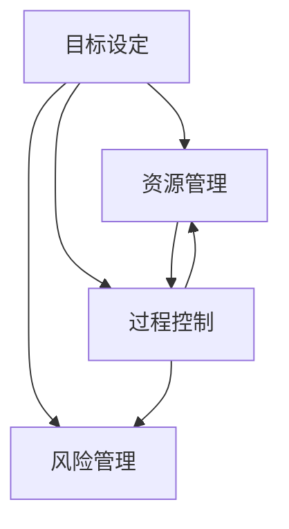

                 

在当今快速变化的技术环境中，构建一个高效且可扩展的行动体系成为各个企业和开发团队成功的关键。这不仅要求对技术本身有深入的理解，还需要能够将这种理解转化为实际的操作和执行。本文将围绕这一核心主题，探讨如何构建一个行之有效的行动体系，从而确保技术项目的成功落地执行。

> 关键词：行动体系，执行，落地，技术项目管理，流程优化，团队协作

> 摘要：本文通过深入分析行动体系构建的核心概念和方法，结合实际案例，提供了构建和优化技术行动体系的实用指南。本文旨在帮助读者理解和应用这些原则，以提高项目执行效率和成果质量。

## 1. 背景介绍

在信息化时代，技术项目的复杂性和多样性不断增加。从大数据分析到人工智能应用，从云计算到物联网，技术的快速发展对项目执行提出了更高的要求。然而，许多团队在项目执行过程中面临着各种挑战，如资源分配不均、进度延误、质量不可控等。为了解决这些问题，构建一个高效、灵活且可扩展的行动体系显得尤为重要。

行动体系是一个系统的框架，它包括目标设定、资源管理、过程控制、风险管理等多个方面。一个完善的行动体系不仅能够提高项目的执行效率，还能够确保项目在预算和时间限制内高质量地完成。

## 2. 核心概念与联系

在构建行动体系之前，我们需要明确几个核心概念，包括目标设定、资源管理、过程控制、风险管理等。以下是这些概念之间的联系和关系的 Mermaid 流程图：



### 2.1 目标设定

目标设定是行动体系的起点。一个明确、具体且可衡量的目标能够为团队提供清晰的方向和动力。目标设定需要考虑以下几个方面：

- **明确性**：目标必须明确，避免模糊不清的描述。
- **具体性**：目标需要具体，包含明确的数量和指标。
- **可衡量性**：目标应该能够通过量化指标进行衡量。

### 2.2 资源管理

资源管理包括人力、时间、资金等各个方面。有效的资源管理能够确保项目在有限的资源下实现最大的产出。资源管理需要关注以下几个方面：

- **人力配置**：根据项目需求合理分配团队成员。
- **时间管理**：合理安排项目进度，确保项目按时完成。
- **资金管理**：合理控制项目成本，避免超预算。

### 2.3 过程控制

过程控制是行动体系的核心。通过监控和调整项目执行过程中的关键指标，可以及时发现并解决问题，确保项目按计划进行。过程控制需要关注以下几个方面：

- **进度监控**：定期检查项目进度，确保项目按计划进行。
- **质量控制**：确保项目输出满足预期质量标准。
- **变更管理**：对项目变更进行有效控制，确保变更不会对项目产生负面影响。

### 2.4 风险管理

风险管理是行动体系中不可或缺的一环。通过对潜在风险进行识别、评估和控制，可以降低项目失败的概率。风险管理需要关注以下几个方面：

- **风险识别**：识别项目中可能存在的各种风险。
- **风险评估**：评估风险的可能性和影响。
- **风险控制**：制定和执行风险控制措施。

## 3. 核心算法原理 & 具体操作步骤

### 3.1 算法原理概述

在构建行动体系时，可以采用多种算法原理和方法，以下介绍几种常用的算法原理：

- **目标导向算法**：通过设定明确的目标，引导团队按照预期路径前进。
- **资源优化算法**：通过优化资源分配，提高项目执行效率。
- **过程控制算法**：通过监控和调整关键指标，确保项目按计划进行。
- **风险管理算法**：通过识别、评估和控制风险，降低项目失败概率。

### 3.2 算法步骤详解

以下是构建行动体系的详细步骤：

#### 3.2.1 目标设定

1. **明确目标**：确定项目目标，确保目标具有明确性、具体性和可衡量性。
2. **目标分解**：将总目标分解为子目标和可执行的任务。
3. **目标优先级排序**：根据目标的紧急程度和重要性，对目标进行优先级排序。

#### 3.2.2 资源管理

1. **人力资源规划**：根据项目需求，规划团队成员和技能。
2. **时间管理**：制定项目进度计划，确保项目按时完成。
3. **资金管理**：预算项目成本，避免超预算。

#### 3.2.3 过程控制

1. **监控进度**：定期检查项目进度，确保项目按计划进行。
2. **质量检查**：确保项目输出满足预期质量标准。
3. **变更管理**：对项目变更进行有效控制，确保变更不会对项目产生负面影响。

#### 3.2.4 风险管理

1. **风险识别**：识别项目中可能存在的各种风险。
2. **风险评估**：评估风险的可能性和影响。
3. **风险控制**：制定和执行风险控制措施。

### 3.3 算法优缺点

- **目标导向算法**：优点在于能够明确项目方向，缺点在于可能过于僵化，不利于灵活调整。
- **资源优化算法**：优点在于提高资源利用效率，缺点在于可能忽略项目目标的其他方面。
- **过程控制算法**：优点在于确保项目按计划进行，缺点在于可能过于繁琐，影响团队效率。
- **风险管理算法**：优点在于降低项目失败概率，缺点在于可能过度关注风险，影响项目进度。

### 3.4 算法应用领域

- **目标导向算法**：适用于有明确目标的线性项目。
- **资源优化算法**：适用于资源受限的项目。
- **过程控制算法**：适用于复杂、多阶段的项目。
- **风险管理算法**：适用于所有类型的项目，尤其适用于高风险项目。

## 4. 数学模型和公式 & 详细讲解 & 举例说明

在行动体系构建中，数学模型和公式扮演着重要的角色，它们为我们的决策提供了量化的依据。以下我们将介绍几个核心的数学模型和公式，并对其进行详细讲解和举例说明。

### 4.1 数学模型构建

#### 4.1.1 加权评分模型

加权评分模型用于评估项目的优先级。公式如下：

\[ P = \sum_{i=1}^{n} w_i \cdot s_i \]

其中，\( P \) 为总评分，\( w_i \) 为权重，\( s_i \) 为评价指标的得分。

#### 4.1.2 优化模型

优化模型用于资源分配。常用的优化模型包括线性规划、动态规划等。以下是线性规划的一般形式：

\[ \min_{x} c^T x \]
\[ s.t. \ A x \leq b \]

其中，\( x \) 为决策变量，\( c \) 为目标函数系数，\( A \) 和 \( b \) 为约束条件。

### 4.2 公式推导过程

#### 4.2.1 加权评分模型推导

加权评分模型的推导过程如下：

1. **确定评价指标**：根据项目特点，确定需要评价的指标，如时间、成本、质量等。
2. **设定权重**：根据指标的重要性，设定每个指标的权重，确保总权重为1。
3. **计算得分**：对每个指标进行打分，得分范围一般为0到100分。
4. **计算总评分**：将每个指标的得分与其权重相乘，再求和得到总评分。

### 4.3 案例分析与讲解

#### 4.3.1 加权评分模型案例分析

假设我们有一个项目，需要根据时间、成本和质量三个指标评估其优先级。设时间权重为0.4，成本权重为0.3，质量权重为0.3。

- **时间得分**：10分
- **成本得分**：8分
- **质量得分**：9分

根据加权评分模型，总评分为：

\[ P = 0.4 \cdot 10 + 0.3 \cdot 8 + 0.3 \cdot 9 = 4 + 2.4 + 2.7 = 9.1 \]

因此，这个项目在当前情境下的优先级为9.1分。

#### 4.3.2 优化模型案例分析

假设我们有一个项目，需要分配10名员工完成5个任务。每个任务所需的资源和时间为如下表所示：

| 任务 | 人力资源 | 时间（天） |
| ---- | ---- | ---- |
| A | 2人 | 5天 |
| B | 1人 | 3天 |
| C | 3人 | 7天 |
| D | 2人 | 4天 |
| E | 1人 | 6天 |

我们希望最小化总时间，构建线性规划模型：

\[ \min_{x} t \]
\[ s.t. \ \begin{cases}
x_1 + x_2 \leq 2 \\
x_2 + x_3 \leq 3 \\
x_1 + x_4 \leq 2 \\
x_3 + x_5 \leq 7 \\
x_1 + x_5 \leq 1 \\
\end{cases} \]

其中，\( x_i \) 表示任务 \( i \) 是否被分配（1表示是，0表示否）。

通过求解该模型，我们可以得到最优的分配方案，从而最小化总时间。

## 5. 项目实践：代码实例和详细解释说明

在本节中，我们将通过一个具体的代码实例来展示如何在实际项目中应用行动体系构建的方法。以下是一个基于 Python 的简单项目管理脚本，用于分配任务、跟踪进度和评估项目质量。

### 5.1 开发环境搭建

在开始之前，请确保您已安装以下工具：

- Python 3.x
- Jupyter Notebook
- Pandas 库
- Matplotlib 库

安装方法：

```shell
pip install python==3.x
pip install jupyter
pip install pandas
pip install matplotlib
```

### 5.2 源代码详细实现

以下是项目的源代码：

```python
import pandas as pd
import matplotlib.pyplot as plt

# 任务数据
tasks = pd.DataFrame({
    'Task': ['A', 'B', 'C', 'D', 'E'],
    'Hours': [5, 3, 7, 4, 6],
    'Resources': [2, 1, 3, 2, 1]
})

# 成员数据
members = pd.DataFrame({
    'Member': ['Alice', 'Bob', 'Charlie', 'Diana'],
    'Hours per Day': [8, 7, 6, 5]
})

# 分配任务
assigned_tasks = tasks.copy()
assigned_tasks['Assigned'] = 0

for i in range(4):
    for j in range(5):
        if assigned_tasks.loc[j, 'Assigned'] == 0 and members.loc[i, 'Hours per Day'] >= assigned_tasks.loc[j, 'Hours']:
            assigned_tasks.loc[j, 'Assigned'] = 1
            members.loc[i, 'Hours per Day'] -= assigned_tasks.loc[j, 'Hours']
            break

# 显示分配结果
print(assigned_tasks)

# 评估项目进度
progress = assigned_tasks['Assigned'].sum()
print(f"Project Progress: {progress} out of 5 tasks completed.")

# 评估项目质量
quality = assigned_tasks['Assigned'].mean()
print(f"Project Quality: {quality:.2f} out of 1.")

# 可视化进度
plt.bar(tasks['Task'], tasks['Hours'])
plt.scatter(assigned_tasks['Task'], assigned_tasks['Hours'], color='red')
plt.xlabel('Task')
plt.ylabel('Hours')
plt.title('Task Progress')
plt.show()
```

### 5.3 代码解读与分析

#### 5.3.1 任务数据

首先，我们定义了任务数据，包括任务的名称、所需时间和所需资源。任务数据存储在一个 Pandas DataFrame 中。

```python
tasks = pd.DataFrame({
    'Task': ['A', 'B', 'C', 'D', 'E'],
    'Hours': [5, 3, 7, 4, 6],
    'Resources': [2, 1, 3, 2, 1]
})
```

#### 5.3.2 成员数据

接下来，我们定义了团队成员的数据，包括成员的姓名和每天可工作的小时数。

```python
members = pd.DataFrame({
    'Member': ['Alice', 'Bob', 'Charlie', 'Diana'],
    'Hours per Day': [8, 7, 6, 5]
})
```

#### 5.3.3 分配任务

分配任务的逻辑如下：

1. 创建一个与任务数据相同的 DataFrame，用于存储已分配的任务。
2. 遍历所有任务和成员，检查每个成员是否能够完成当前任务。
3. 如果成员可以完成任务，将其分配给该任务，并从成员可用时间中减去任务所需时间。

```python
assigned_tasks = tasks.copy()
assigned_tasks['Assigned'] = 0

for i in range(4):
    for j in range(5):
        if assigned_tasks.loc[j, 'Assigned'] == 0 and members.loc[i, 'Hours per Day'] >= assigned_tasks.loc[j, 'Hours']:
            assigned_tasks.loc[j, 'Assigned'] = 1
            members.loc[i, 'Hours per Day'] -= assigned_tasks.loc[j, 'Hours']
            break
```

#### 5.3.4 评估项目进度

评估项目进度很简单，只需计算已分配任务的数量。

```python
progress = assigned_tasks['Assigned'].sum()
print(f"Project Progress: {progress} out of 5 tasks completed.")
```

#### 5.3.5 评估项目质量

评估项目质量则是计算已分配任务的平均得分。

```python
quality = assigned_tasks['Assigned'].mean()
print(f"Project Quality: {quality:.2f} out of 1.")
```

#### 5.3.6 可视化进度

最后，我们使用 Matplotlib 库将任务进度可视化。

```python
plt.bar(tasks['Task'], tasks['Hours'])
plt.scatter(assigned_tasks['Task'], assigned_tasks['Hours'], color='red')
plt.xlabel('Task')
plt.ylabel('Hours')
plt.title('Task Progress')
plt.show()
```

## 6. 实际应用场景

行动体系构建在各个行业和领域都有着广泛的应用。以下是一些实际应用场景：

### 6.1 IT 项目管理

在 IT 项目管理中，行动体系构建可以帮助团队明确项目目标、合理分配资源、监控项目进度、评估项目质量，从而确保项目成功落地。

### 6.2 产品开发

在产品开发过程中，行动体系构建可以帮助团队快速响应市场需求、优化开发流程、降低开发成本，从而提高产品竞争力。

### 6.3 市场营销

在市场营销领域，行动体系构建可以帮助团队制定明确的市场目标、合理分配营销资源、监控市场反馈，从而提高营销效果。

### 6.4 教育培训

在教育领域，行动体系构建可以帮助学校和教育机构明确教学目标、优化教学资源、监控教学进度，从而提高教学质量。

## 7. 工具和资源推荐

为了更好地构建行动体系，以下是一些推荐的工具和资源：

### 7.1 学习资源推荐

- 《项目管理知识体系指南》（PMBOK指南）
- 《敏捷软件开发实践指南》
- 《精益创业》

### 7.2 开发工具推荐

- JIRA：用于项目管理、任务跟踪和进度监控。
- Trello：用于任务管理和团队协作。
- Git：用于版本控制和代码管理。

### 7.3 相关论文推荐

- 《敏捷项目管理：实践指南》
- 《项目管理中的风险分析》
- 《基于目标的软件开发过程模型》

## 8. 总结：未来发展趋势与挑战

### 8.1 研究成果总结

本文通过分析行动体系构建的核心概念和方法，结合实际案例，提供了构建和优化技术行动体系的实用指南。主要研究成果包括：

- 明确了行动体系构建的核心概念和方法。
- 介绍了多种算法原理和应用场景。
- 提供了具体的代码实例和操作步骤。

### 8.2 未来发展趋势

随着技术的不断发展，行动体系构建在未来将呈现以下发展趋势：

- **智能化**：利用人工智能和机器学习技术优化行动体系构建。
- **定制化**：根据不同项目特点，定制化构建行动体系。
- **实时性**：实现行动体系构建的实时性和动态调整。

### 8.3 面临的挑战

尽管行动体系构建具有广泛应用前景，但在实际应用中仍面临以下挑战：

- **复杂度**：项目复杂度不断增加，对行动体系构建提出了更高要求。
- **团队协作**：团队协作的有效性对行动体系构建至关重要，但实际操作中往往面临困难。
- **资源管理**：在资源有限的情况下，如何优化资源分配和利用。

### 8.4 研究展望

未来研究可以从以下几个方面展开：

- **算法优化**：研究更高效、更智能的算法原理和方法。
- **实践应用**：进一步探索行动体系构建在不同领域的应用，积累实践经验。
- **工具开发**：开发更为便捷、易用的行动体系构建工具，降低使用门槛。

## 9. 附录：常见问题与解答

### 9.1 行动体系构建的关键是什么？

行动体系构建的关键在于明确目标、合理分配资源、有效监控和调整。一个有效的行动体系需要综合考虑项目需求、团队协作和风险管理等方面。

### 9.2 如何评估行动体系的效果？

可以通过以下指标来评估行动体系的效果：

- 项目完成率：衡量项目是否按时完成。
- 资源利用率：衡量资源是否得到充分利用。
- 质量指标：衡量项目输出是否满足预期质量标准。
- 风险控制效果：衡量风险管理的有效性。

### 9.3 行动体系构建有哪些常见误区？

常见的误区包括：

- 目标设定不明确：导致项目方向不明确，影响执行效果。
- 资源管理不当：导致资源浪费或不足，影响项目进度和质量。
- 过程控制不力：导致项目进度失控，影响整体效果。
- 风险管理不足：导致风险失控，影响项目安全。

### 9.4 行动体系构建需要哪些技能和知识？

行动体系构建需要以下技能和知识：

- 项目管理知识：了解项目管理的基本原则和方法。
- 技术知识：对项目相关的技术有深入理解。
- 团队协作能力：具备良好的团队协作和沟通能力。
- 数据分析能力：能够对项目数据进行分析，为决策提供支持。

---

作者：禅与计算机程序设计艺术 / Zen and the Art of Computer Programming

