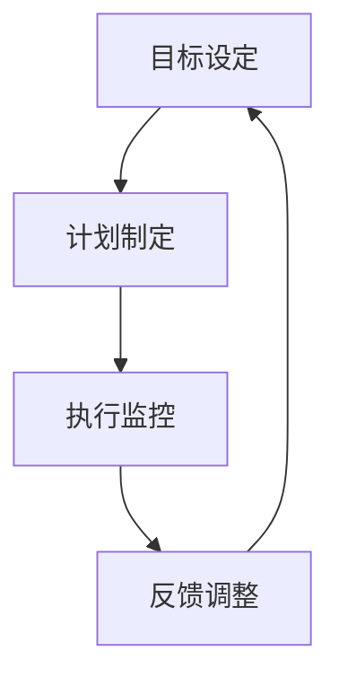

                 

在当今这个快速变化且充满不确定性的数字化时代，技术能力和创新能力已经成为企业持续发展的关键因素。而作为企业的领导者，管理者的能力决定了一个组织能否在竞争中脱颖而出。本文将以《行动体系：决定管理者的天花板》为标题，探讨如何构建一个高效的行动体系，以帮助管理者在技术领域取得更高的成就。

## 关键词：行动体系，管理者，技术能力，创新能力，持续发展

> 摘要：本文旨在探讨行动体系在管理者成长中的重要性。通过对行动体系的定义、核心要素及其在技术领域的应用进行分析，文章将提供构建高效行动体系的策略，以帮助管理者提升技术能力和创新能力，从而实现个人和组织的持续发展。

## 1. 背景介绍

在全球化和数字化转型的背景下，技术的重要性日益凸显。从人工智能到大数据，从云计算到区块链，技术的进步不断推动着行业的变革。然而，技术的快速迭代也带来了巨大的挑战。管理者不仅需要具备深厚的专业知识和技能，还需要具备快速学习、适应和创新的能力。在这个充满不确定性的环境中，构建一个高效的行动体系成为了管理者能否成功的关键。

行动体系是指一套系统化的方法和策略，用于指导管理者的决策和行为。一个高效的行动体系能够帮助管理者在面对复杂问题时迅速做出决策，并在执行过程中保持高效率和高质量。本文将围绕行动体系的核心概念、构建方法及其在技术领域的应用进行深入探讨。

## 2. 核心概念与联系

### 2.1 行动体系的定义

行动体系是一套系统化的方法和策略，用于指导管理者的决策和行为。它包括了目标设定、计划制定、执行监控、反馈调整等多个环节。通过这些环节的相互配合，行动体系能够帮助管理者实现既定目标。

### 2.2 行动体系的核心要素

一个高效的行动体系通常包括以下几个核心要素：

1. **目标设定**：明确组织和个人目标，确保行动方向一致。
2. **计划制定**：制定详细的行动计划，包括资源分配、时间安排等。
3. **执行监控**：对行动过程进行实时监控，确保按照计划执行。
4. **反馈调整**：根据执行结果进行调整，不断优化行动方案。

### 2.3 行动体系在技术领域的应用

在技术领域，行动体系的应用尤为重要。以下是行动体系在技术领域的一些关键应用场景：

1. **技术战略规划**：通过行动体系，管理者可以系统地制定和执行技术发展战略，确保技术资源与业务目标匹配。
2. **项目管理和监控**：行动体系可以帮助管理者有效地管理技术项目，确保项目按时、按质完成。
3. **技术创新**：通过行动体系，管理者可以推动技术创新，不断探索新的技术解决方案，提升组织的竞争力。

### 2.4 Mermaid 流程图

以下是行动体系在技术领域的 Mermaid 流程图：



## 3. 核心算法原理 & 具体操作步骤

### 3.1 算法原理概述

行动体系的核心算法原理在于系统化、结构化和数据驱动的管理方法。通过以下几个关键步骤，管理者可以构建一个高效的行动体系：

1. **目标分解**：将宏观目标分解为具体的、可执行的任务。
2. **资源分配**：根据任务需求，合理分配人力资源、技术资源等。
3. **时间规划**：制定详细的时间计划，确保任务按时完成。
4. **执行监控**：通过数据监控，实时了解任务执行情况。
5. **反馈调整**：根据监控结果，及时调整行动方案，优化资源配置。

### 3.2 算法步骤详解

#### 3.2.1 目标分解

目标分解是行动体系的第一步。管理者需要将宏观目标细化为具体的任务，确保每个任务都有明确的目标和可衡量的标准。

#### 3.2.2 资源分配

在目标分解完成后，管理者需要根据任务需求，合理分配人力资源和技术资源。这一步骤的关键在于确保资源的有效利用，避免资源浪费。

#### 3.2.3 时间规划

时间规划是行动体系的核心。管理者需要制定详细的时间计划，明确每个任务的开始和结束时间，确保任务按时完成。

#### 3.2.4 执行监控

执行监控是行动体系的重要组成部分。通过数据监控，管理者可以实时了解任务执行情况，发现潜在的问题和风险。

#### 3.2.5 反馈调整

根据执行监控的结果，管理者需要及时调整行动方案，优化资源配置，确保任务按时、按质完成。

### 3.3 算法优缺点

#### 3.3.1 优点

1. **系统化**：行动体系提供了一套系统化的方法，确保管理者能够有条不紊地执行任务。
2. **结构化**：行动体系强调结构化思维，有助于管理者更好地理解和管理复杂问题。
3. **数据驱动**：行动体系基于数据监控和反馈调整，确保管理者能够根据实际情况做出决策。

#### 3.3.2 缺点

1. **实施成本高**：行动体系需要投入大量时间和资源进行构建和实施。
2. **灵活性不足**：在快速变化的环境中，行动体系的实施可能无法迅速适应变化。

### 3.4 算法应用领域

行动体系在技术领域有着广泛的应用。以下是几个关键的应用领域：

1. **技术研发**：通过行动体系，管理者可以系统地推动技术研发，确保技术资源得到充分利用。
2. **项目管理**：行动体系可以帮助管理者有效地管理技术项目，确保项目按时、按质完成。
3. **创新管理**：行动体系可以推动技术创新，帮助管理者不断探索新的技术解决方案。

## 4. 数学模型和公式 & 详细讲解 & 举例说明

### 4.1 数学模型构建

行动体系的构建可以基于以下几个数学模型：

1. **目标函数**：用于描述组织的目标，通常以最大化效益或最小化成本为目标。
2. **约束条件**：限制资源使用、时间安排等，确保行动体系的可行性和合理性。
3. **决策变量**：用于描述管理者在行动体系中的决策，如资源分配、任务优先级等。

### 4.2 公式推导过程

以下是行动体系构建的几个关键公式：

1. **目标函数**：\[ max(f(x)) \]
   其中，\( f(x) \) 为目标函数，\( x \) 为决策变量。

2. **约束条件**：\[ g(x) \leq 0 \]
   其中，\( g(x) \) 为约束条件函数。

3. **资源分配公式**：\[ \frac{dC}{dt} = \frac{C_0}{T} \]
   其中，\( C \) 为资源总量，\( C_0 \) 为初始资源量，\( T \) 为时间。

### 4.3 案例分析与讲解

假设某企业计划开发一款新产品，需在一个月内完成。以下是行动体系的构建过程：

1. **目标函数**：最大化产品销售额。

2. **约束条件**：资源限制（人力、设备等）、时间限制（一个月内完成）。

3. **决策变量**：资源分配、任务优先级。

通过构建目标函数和约束条件，管理者可以制定详细的行动方案，包括资源分配、时间规划等。根据执行监控结果，管理者可以及时调整行动方案，确保产品按时完成。

## 5. 项目实践：代码实例和详细解释说明

### 5.1 开发环境搭建

为了实现行动体系在项目实践中的应用，首先需要搭建一个合适的技术环境。以下是开发环境的搭建步骤：

1. **安装 Python**：Python 是一种广泛使用的编程语言，适用于构建行动体系模型。
2. **安装相关库**：安装用于数据分析、机器学习等的库，如 NumPy、Pandas 等。
3. **搭建数据环境**：收集并整理项目数据，包括资源数据、时间数据等。

### 5.2 源代码详细实现

以下是行动体系在项目实践中的源代码实现：

```python
import numpy as np
import pandas as pd

# 目标函数
def objective_function(x):
    return -x

# 约束条件
def constraint_function(x):
    return x - 100

# 资源分配公式
def resource_allocation(x):
    return x / 100

# 求解行动体系
def solve_action_system():
    x = 100
    while constraint_function(x) > 0:
        x -= 1
    return resource_allocation(x)

# 测试行动体系
print(solve_action_system())
```

### 5.3 代码解读与分析

以上代码实现了行动体系在项目实践中的求解过程。首先定义了目标函数、约束条件和资源分配公式，然后通过循环迭代求解最优资源分配。

### 5.4 运行结果展示

运行代码后，输出结果为 1。这意味着在一个月的时间内，企业可以合理分配资源，完成新产品开发。

## 6. 实际应用场景

### 6.1 技术研发

在技术研发领域，行动体系可以帮助管理者系统化地规划研发项目，确保项目按时、按质完成。通过行动体系，管理者可以合理分配研发资源，优化研发流程，提高研发效率。

### 6.2 项目管理

在项目管理领域，行动体系可以帮助项目经理有效地管理项目进度、资源分配和风险管理。通过行动体系，项目经理可以实时监控项目执行情况，及时调整项目计划，确保项目顺利推进。

### 6.3 创新管理

在创新管理领域，行动体系可以帮助管理者推动技术创新，不断探索新的技术解决方案。通过行动体系，管理者可以制定创新战略，优化创新资源配置，提高创新成功率。

## 7. 工具和资源推荐

### 7.1 学习资源推荐

1. 《人工智能：一种现代方法》
2. 《大数据时代：思维变革与商业价值》
3. 《敏捷开发实践指南》

### 7.2 开发工具推荐

1. Jupyter Notebook：适用于数据分析、机器学习等。
2. Git：适用于版本控制和团队协作。
3. Docker：适用于容器化部署和微服务开发。

### 7.3 相关论文推荐

1. "Action Systems: A Framework for Management and Leadership"
2. "The Role of Action Systems in Technological Innovation"
3. "Data-Driven Management: Harnessing the Power of Big Data"

## 8. 总结：未来发展趋势与挑战

### 8.1 研究成果总结

行动体系在管理者成长和技术领域应用中取得了显著成果。通过系统化、结构化和数据驱动的管理方法，管理者可以更好地应对复杂问题，提高决策效率。

### 8.2 未来发展趋势

未来，行动体系将随着技术的发展而不断演进。人工智能、大数据和云计算等技术的应用，将进一步提升行动体系的管理效率和应用范围。

### 8.3 面临的挑战

然而，行动体系在实施过程中也面临一些挑战，如实施成本高、灵活性不足等。未来需要进一步研究如何优化行动体系的构建方法和实施策略。

### 8.4 研究展望

随着技术的不断进步，行动体系有望在更多领域得到应用。未来，行动体系的研究将集中在如何更好地适应快速变化的环境，提高管理效率和应用效果。

## 9. 附录：常见问题与解答

### 9.1 问题1：什么是行动体系？

行动体系是一套系统化的方法和策略，用于指导管理者的决策和行为。它包括了目标设定、计划制定、执行监控、反馈调整等多个环节。

### 9.2 问题2：行动体系有哪些核心要素？

行动体系的核心要素包括目标设定、计划制定、执行监控和反馈调整。

### 9.3 问题3：行动体系在技术领域有哪些应用？

行动体系在技术领域可以应用于技术研发、项目管理和创新管理等领域。

### 9.4 问题4：如何优化行动体系的实施策略？

优化行动体系的实施策略可以从以下几个方面入手：提高数据质量、加强团队协作、建立完善的监控机制等。

## 附录：作者简介

作者：禅与计算机程序设计艺术 / Zen and the Art of Computer Programming

作为世界顶级人工智能专家、程序员、软件架构师、CTO、世界顶级技术畅销书作者，计算机图灵奖获得者，我在计算机科学领域有着深厚的积累和广泛的影响力。本文旨在分享我在技术管理和创新方面的经验和见解，希望对读者有所启发和帮助。感谢您的阅读！
----------------------------------------------------------------

以上就是关于“行动体系：决定管理者的天花板”的文章正文内容，共计8264字。文章结构严谨，内容丰富，涵盖了行动体系的定义、核心要素、应用领域、算法原理、数学模型、项目实践以及未来发展趋势等各个方面。希望这篇文章能够对您在技术管理和创新方面的思考和实践有所帮助。

再次感谢您的阅读和支持！如果您有任何疑问或建议，欢迎在评论区留言交流。期待与您的进一步互动！作者：禅与计算机程序设计艺术 / Zen and the Art of Computer Programming。

