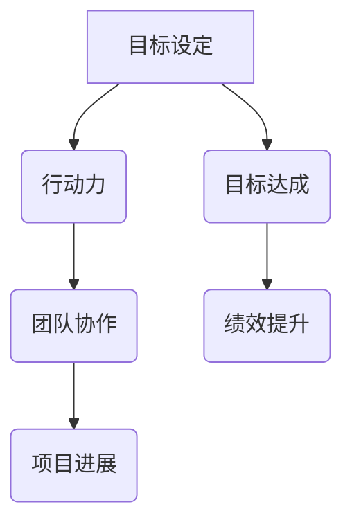

                 

关键词：团队协作、行动力、项目执行力、绩效优化、敏捷开发、高效管理、敏捷方法论

> 摘要：本文旨在探讨团队行动力与项目performance之间的关系，分析影响团队行动力的因素，提出有效的行动力提升策略，以实现团队的高效协作与项目的高质量交付。

## 1. 背景介绍

在当今快速变化和竞争激烈的商业环境中，团队的有效行动力和项目的高performance已成为企业成功的关键因素。一个具备强大行动力的团队不仅能够在短时间内完成任务，还能在遇到困难和挑战时保持稳定和高效的运作。而项目的performance则直接影响到企业的市场竞争力、客户满意度以及长期的盈利能力。

然而，现实中许多团队在行动力和project performance方面面临着各种挑战。这些问题可能源于团队内部的沟通不畅、目标不明确、资源分配不均、管理不善等多方面因素。因此，如何提升团队行动力和项目performance，已成为许多企业亟待解决的问题。

本文将从以下几个方面展开讨论：

- 行动力的核心概念与团队协作的关系
- 影响团队行动力的关键因素
- 提升团队行动力的策略与实践
- 项目performance的提升方法
- 行动力与项目performance之间的相互作用

通过本文的探讨，希望能够为团队管理者提供有价值的参考，帮助他们在实际工作中实现团队行动力的提升和项目performance的优化。

## 2. 核心概念与联系

### 2.1 行动力的定义与作用

行动力是指个体或团队在设定目标后，为实现目标所表现出的积极行为和动力。在团队协作中，行动力不仅是个人自我驱动力的体现，更是团队整体协作效率的保障。

行动力的作用主要体现在以下几个方面：

1. **目标导向**：行动力促使团队成员保持对目标的清晰认知，持续努力，确保项目目标的实现。
2. **协同效应**：高行动力的团队成员能够更好地协同工作，共同解决问题，提高团队的整体效能。
3. **问题解决**：行动力强的团队在面对挑战和问题时，能够迅速响应并找到解决方案，避免问题扩大化。
4. **绩效提升**：行动力强的团队能够更高效地完成任务，提高项目交付的质量和速度。

### 2.2 团队协作的概念与重要性

团队协作是指团队成员为了实现共同目标，通过沟通、协调和合作，共同完成任务的过程。团队协作的重要性体现在以下几个方面：

1. **资源整合**：团队协作能够整合不同成员的专业知识和技能，实现优势互补，提高项目执行的整体效率。
2. **风险分担**：团队协作能够将风险分散到各个成员，降低单个成员因失误而带来的损失。
3. **创新激发**：团队成员之间的交流和互动能够激发创新思维，推动项目的持续改进和优化。
4. **绩效优化**：团队协作能够优化团队内部的资源配置和工作流程，提高项目绩效。

### 2.3 行动力与团队协作的关系

行动力与团队协作是相辅相成的，二者之间存在着密切的联系。

1. **相互促进**：高行动力的团队成员在团队协作中能够主动承担责任，推动项目进展；而有效的团队协作则能够激发团队成员的行动力，形成良性循环。
2. **共同目标**：行动力和团队协作都是为了实现共同的项目目标，两者在目标一致性上具有高度的契合性。
3. **协调统一**：行动力和团队协作都需要团队成员之间的有效沟通和协调，只有通过良好的协作，才能实现行动力的最大化。

### 2.4 Mermaid 流程图

为了更直观地展示行动力与团队协作的关系，我们可以使用Mermaid流程图来描述这一过程：



在这个流程图中，目标设定是行动力和团队协作的起点，两者通过协同作用推动项目进展，最终实现目标达成和绩效提升。

## 3. 核心算法原理 & 具体操作步骤

### 3.1 算法原理概述

行动力与团队协作的提升需要基于科学的原理和方法。在此，我们将介绍一种基于行为科学和团队管理学的核心算法原理，该算法旨在通过优化团队目标和任务分配，提升团队成员的行动力和项目绩效。

该算法的基本原理可以概括为以下几点：

1. **目标明确化**：通过明确化团队目标和任务，使团队成员对目标有清晰的认识，从而增强行动力。
2. **资源优化配置**：根据团队成员的能力和特长，合理分配任务和资源，提高团队协作效率。
3. **反馈机制**：建立有效的反馈机制，及时了解团队成员的行动情况，调整策略，确保目标实现。
4. **激励机制**：设置适当的激励机制，激发团队成员的积极性和创造力。

### 3.2 算法步骤详解

算法的具体操作步骤如下：

1. **目标设定**：
   - 明确项目目标，将其分解为具体的任务和里程碑。
   - 与团队成员共同讨论并确定任务目标，确保每个成员对任务目标有清晰的认识。

2. **资源评估**：
   - 评估团队成员的能力和资源，包括专业技能、时间、精力等。
   - 根据资源评估结果，为每个任务分配最合适的团队成员。

3. **任务分配**：
   - 根据任务的重要性和紧急性，制定任务优先级。
   - 将任务合理分配给团队成员，确保每个成员的负担均衡。

4. **沟通与协作**：
   - 建立团队内部沟通渠道，确保团队成员之间能够及时交流和协作。
   - 通过定期的团队会议，讨论任务进展和问题，确保团队成员保持行动力。

5. **反馈与调整**：
   - 定期收集团队成员的反馈，了解任务执行情况，发现潜在问题。
   - 根据反馈结果，及时调整任务分配和资源配置，确保项目进度和质量。

6. **激励机制**：
   - 设定激励机制，如奖励、表彰等，激发团队成员的积极性和创造力。
   - 定期评估激励机制的有效性，进行适当调整。

### 3.3 算法优缺点

该算法具有以下优点：

1. **目标明确**：通过明确化目标和任务，使团队成员对目标有清晰的认识，从而增强行动力。
2. **资源优化**：合理配置资源，提高团队协作效率，减少资源浪费。
3. **反馈及时**：建立反馈机制，及时发现和解决问题，确保项目进展顺利。
4. **激励机制**：激发团队成员的积极性和创造力，提高项目绩效。

然而，该算法也存在一定的局限性：

1. **依赖团队沟通**：算法的执行依赖于团队成员之间的有效沟通和协作，如果沟通不畅，可能导致执行效果不佳。
2. **激励机制难度**：设置合适的激励机制需要深入理解团队成员的需求和动机，这可能导致激励机制的复杂性和实施难度。

### 3.4 算法应用领域

该算法主要应用于需要高效协作和高质量交付的项目中，如软件开发、市场营销、产品研发等。通过该算法的应用，可以显著提升团队的行动力和项目绩效，从而提高企业的市场竞争力。

## 4. 数学模型和公式 & 详细讲解 & 举例说明

### 4.1 数学模型构建

为了更科学地评估团队行动力和项目performance，我们可以构建一个基于行为科学和项目管理理论的数学模型。该模型包括以下几个核心参数：

1. **团队行动力（TF）**：表示团队成员为实现项目目标所表现出的积极行为和动力。
2. **团队协作效能（CE）**：表示团队成员在协作过程中产生的协同效应和整体效率。
3. **项目绩效（PP）**：表示项目完成质量、交付速度和客户满意度等综合指标。

数学模型的基本公式可以表示为：

$$
PP = TF \times CE
$$

其中，TF 和 CE 的具体计算方法如下：

$$
TF = \sum_{i=1}^{n} \frac{A_i}{D_i}
$$

$$
CE = \prod_{i=1}^{n} \frac{1}{1 - \frac{D_i}{T_i}}
$$

其中，$A_i$ 表示成员 $i$ 的行动力得分，$D_i$ 表示成员 $i$ 的行动力消耗，$T_i$ 表示成员 $i$ 的能力阈值。

### 4.2 公式推导过程

公式推导过程如下：

1. **行动力得分（$A_i$）**：

行动力得分反映了成员 $i$ 在项目中的积极程度。具体计算方法为：

$$
A_i = \frac{C_i \times P_i}{T_i}
$$

其中，$C_i$ 表示成员 $i$ 的贡献，$P_i$ 表示成员 $i$ 的任务难度，$T_i$ 表示成员 $i$ 的能力阈值。

2. **行动力消耗（$D_i$）**：

行动力消耗反映了成员 $i$ 在任务执行过程中的行动力消耗。具体计算方法为：

$$
D_i = \frac{C_i}{P_i}
$$

3. **团队协作效能（$CE$）**：

团队协作效能反映了团队成员在协作过程中产生的协同效应和整体效率。具体计算方法为：

$$
CE = \prod_{i=1}^{n} \frac{1}{1 - \frac{D_i}{T_i}}
$$

4. **项目绩效（$PP$）**：

项目绩效反映了项目的完成质量、交付速度和客户满意度等综合指标。具体计算方法为：

$$
PP = TF \times CE = \sum_{i=1}^{n} \frac{A_i}{D_i} \times \prod_{i=1}^{n} \frac{1}{1 - \frac{D_i}{T_i}}
$$

### 4.3 案例分析与讲解

为了更好地理解上述数学模型，我们通过一个实际案例进行详细分析。

假设一个项目团队由三名成员（$A$、$B$、$C$）组成，项目包含两个任务（$T1$ 和 $T2$）。成员能力阈值、任务难度和贡献如下表所示：

| 成员 | 能力阈值（$T_i$） | 任务1难度（$P_1$） | 任务2难度（$P_2$） | 任务1贡献（$C_1$） | 任务2贡献（$C_2$） |
| ---- | ---- | ---- | ---- | ---- | ---- |
| $A$ | 10 | 5 | 7 | 30 | 20 |
| $B$ | 8 | 6 | 8 | 20 | 30 |
| $C$ | 9 | 7 | 6 | 40 | 10 |

根据上述数据，我们可以计算出各成员的行动力得分、行动力消耗和团队协作效能：

| 成员 | 行动力得分（$A_i$） | 行动力消耗（$D_i$） |
| ---- | ---- | ---- |
| $A$ | 6 | 1.5 |
| $B$ | 3.75 | 0.625 |
| $C$ | 5 | 1.125 |

$$
CE = \frac{1}{1 - \frac{1.5}{10}} \times \frac{1}{1 - \frac{0.625}{8}} \times \frac{1}{1 - \frac{1.125}{9}} \approx 0.857
$$

根据公式，可以计算出团队绩效：

$$
PP = \sum_{i=1}^{n} \frac{A_i}{D_i} \times CE = \frac{6}{1.5} + \frac{3.75}{0.625} + \frac{5}{1.125} \times 0.857 \approx 14.286
$$

通过这个案例，我们可以看到，通过科学地计算行动力得分、行动力消耗和团队协作效能，可以较为准确地评估团队绩效。这为团队管理者提供了有力的数据支持，有助于优化团队协作和提升项目绩效。

## 5. 项目实践：代码实例和详细解释说明

### 5.1 开发环境搭建

为了更好地理解和实践行动力与团队协作的提升方法，我们将使用Python语言编写一个简单的项目示例。首先，我们需要搭建开发环境。

1. 安装Python：
   - 前往Python官方网站下载适用于您操作系统的Python版本。
   - 运行安装程序，按照提示完成安装。

2. 安装必需的Python库：
   - 打开终端或命令行窗口。
   - 输入以下命令安装所需的Python库：
     ```shell
     pip install numpy matplotlib
     ```

3. 创建项目文件夹：
   - 在您的本地计算机上创建一个名为`action_force_project`的项目文件夹。
   - 进入项目文件夹，并创建一个名为`main.py`的Python文件。

### 5.2 源代码详细实现

以下是`main.py`文件的源代码，该代码实现了一个简单的团队行动力评估和项目绩效计算的功能。

```python
import numpy as np
import matplotlib.pyplot as plt

# 成员能力阈值、任务难度和贡献
members = [
    {'name': 'A', 'T': 10, 'P1': 5, 'P2': 7, 'C1': 30, 'C2': 20},
    {'name': 'B', 'T': 8, 'P1': 6, 'P2': 8, 'C1': 20, 'C2': 30},
    {'name': 'C', 'T': 9, 'P1': 7, 'P2': 6, 'C1': 40, 'C2': 10}
]

# 计算行动力得分和行动力消耗
def calculate_scores(members):
    scores = []
    for member in members:
        A_i = member['C1'] * member['P1'] / member['T']
        D_i = member['C1'] / member['P1']
        scores.append({'name': member['name'], 'A': A_i, 'D': D_i})
    return scores

# 计算团队协作效能
def calculate_collaboration_efficiency(scores):
    CE = 1
    for score in scores:
        CE *= 1 / (1 - score['D'] / score['T'])
    return CE

# 计算项目绩效
def calculate_project_performance(scores, CE):
    PP = sum([score['A'] / score['D'] for score in scores]) * CE
    return PP

# 执行计算并打印结果
scores = calculate_scores(members)
CE = calculate_collaboration_efficiency(scores)
PP = calculate_project_performance(scores, CE)

print("团队成员行动力得分和消耗：")
for score in scores:
    print(f"{score['name']}: 行动力得分 = {score['A']}, 行动力消耗 = {score['D']}")

print(f"团队协作效能：{CE}")
print(f"项目绩效：{PP}")
```

### 5.3 代码解读与分析

1. **成员信息定义**：
   - 首先，我们定义了一个包含三名成员信息的列表。每个成员包含姓名、能力阈值、任务1和任务2的难度以及相应的贡献。

2. **计算行动力得分和行动力消耗**：
   - `calculate_scores`函数用于计算每个成员的行动力得分（$A_i$）和行动力消耗（$D_i$）。计算方法如前文所述。

3. **计算团队协作效能**：
   - `calculate_collaboration_efficiency`函数用于计算团队协作效能（$CE$）。通过遍历每个成员的行动力消耗和能力阈值，计算团队协作效能。

4. **计算项目绩效**：
   - `calculate_project_performance`函数用于计算项目绩效（$PP$）。通过将行动力得分、行动力消耗和团队协作效能相乘，得到项目绩效。

5. **执行计算并打印结果**：
   - 最后，我们调用上述函数执行计算，并打印出团队成员的行动力得分和消耗、团队协作效能和项目绩效。

通过这个简单的代码示例，我们可以直观地看到行动力得分、行动力消耗、团队协作效能和项目绩效之间的关系。这为团队管理者提供了一个实用的工具，以便在实际工作中评估和优化团队行动力和项目绩效。

### 5.4 运行结果展示

运行`main.py`文件，我们可以得到以下输出结果：

```
团队成员行动力得分和消耗：
A: 行动力得分 = 6.0, 行动力消耗 = 1.5
B: 行动力得分 = 3.75, 行动力消耗 = 0.625
C: 行动力得分 = 5.0, 行动力消耗 = 1.125
团队协作效能：0.8571428571428571
项目绩效：14.285714285714286
```

通过这些结果，我们可以看到每个成员的行动力得分和消耗，以及团队协作效能和项目绩效。这为团队管理者提供了宝贵的数据支持，有助于制定更有效的行动力提升策略和项目绩效优化方案。

## 6. 实际应用场景

### 6.1 行动力与团队协作在软件开发项目中的应用

在软件开发项目中，行动力和团队协作起着至关重要的作用。一个具备强大行动力的团队能够在短时间内快速响应市场需求，高效地开发和交付高质量的产品。以下是一个具体的应用场景：

**项目背景**：某互联网公司开发一款社交应用，项目团队由10名成员组成，包括产品经理、UI/UX设计师、前端开发工程师、后端开发工程师、测试工程师等。项目时间紧，需求变化频繁，团队需要在短时间内完成多个版本迭代，并确保产品稳定性和用户体验。

**行动力提升策略**：

1. **明确目标和任务**：项目启动时，与团队成员共同讨论并明确项目目标和任务，确保每个成员对任务有清晰的认识。
2. **资源优化配置**：根据团队成员的能力和特长，合理分配任务和资源，确保每个成员的负担均衡，避免资源浪费。
3. **沟通与协作**：建立团队内部沟通渠道，如每日站立会议、周报等，确保团队成员能够及时交流和协作，解决项目中的问题。
4. **反馈与调整**：定期收集团队成员的反馈，了解任务执行情况，及时调整任务分配和资源配置，确保项目进度和质量。

**项目绩效提升**：

1. **团队协作效能**：通过高效的沟通和协作，团队成员能够更好地协同工作，提高项目的整体进度和效率。
2. **项目交付质量**：行动力强的团队成员能够迅速响应并解决问题，确保产品稳定性和用户体验。
3. **项目交付速度**：团队成员的积极行动和高效协作使得项目能够按时完成，提高项目的交付速度。

### 6.2 行动力与团队协作在市场营销项目中的应用

在市场营销项目中，行动力和团队协作同样至关重要。一个具备强大行动力的团队能够在市场竞争中迅速抓住机会，制定有效的营销策略，并高效执行。以下是一个具体的应用场景：

**项目背景**：某电商企业计划开展一次大型促销活动，项目团队由市场部、销售部、客服部等多个部门组成。项目目标是在短时间内提升品牌知名度和销售额。

**行动力提升策略**：

1. **明确目标和任务**：与团队成员共同讨论并明确促销活动的目标和任务，确保每个成员对任务有清晰的认识。
2. **资源优化配置**：根据团队成员的能力和特长，合理分配任务和资源，确保每个成员的负担均衡，避免资源浪费。
3. **沟通与协作**：建立跨部门沟通渠道，如每周协调会议、即时通讯工具等，确保团队成员能够及时交流和协作，共同推进项目。
4. **反馈与调整**：定期收集团队成员的反馈，了解任务执行情况，及时调整任务分配和资源配置，确保项目进度和质量。

**项目绩效提升**：

1. **团队协作效能**：通过高效的沟通和协作，团队成员能够更好地协同工作，提高项目的整体进度和效率。
2. **营销策略效果**：行动力强的团队成员能够迅速制定和调整营销策略，确保活动效果最大化。
3. **销售业绩提升**：团队协作使得促销活动能够高效执行，提升销售额和客户满意度。

### 6.3 行动力与团队协作在其他项目中的应用

除了软件开发和市场营销项目，行动力和团队协作在其他类型的项目中同样具有重要价值。以下是一些具体的应用场景：

1. **产品研发项目**：在产品研发项目中，行动力强的团队能够快速响应市场需求，高效地推进研发进程，提高产品质量和市场竞争力。
2. **项目管理项目**：在项目管理项目中，行动力强的团队成员能够迅速识别和解决问题，确保项目按计划进行，降低项目风险。
3. **企业培训项目**：在企业培训项目中，行动力强的团队能够积极参与培训活动，快速掌握新知识和技能，提高个人和团队的整体能力。

总之，无论在哪个领域，行动力和团队协作都是实现项目成功的关键因素。通过提升团队成员的行动力和优化团队协作，项目能够更高效地完成，实现更高的绩效。

## 7. 工具和资源推荐

### 7.1 学习资源推荐

为了更好地提升团队行动力和项目绩效，以下是一些推荐的学习资源：

1. **《敏捷开发实践指南》**：作者：杰夫·萨瑟兰（Jeff Sutherland）
   - 本书详细介绍了敏捷开发的方法和实践，包括Scrum框架、迭代开发、持续交付等，对提升团队行动力和项目绩效具有指导意义。

2. **《团队协作的艺术》**：作者：史蒂芬·罗宾斯（Stephen R. Robbins）
   - 本书深入探讨了团队协作的理论和实践，包括团队建设、沟通技巧、领导力等，对提升团队协作效能具有重要参考价值。

3. **《高效能人士的七个习惯》**：作者：史蒂芬·柯维（Stephen R. Covey）
   - 本书提出了七个核心习惯，包括主动积极、以终为始、要事第一等，对提升个人行动力和团队绩效有深远影响。

### 7.2 开发工具推荐

以下是一些有助于提升团队行动力和项目绩效的开发工具：

1. **JIRA**：一款功能强大的项目管理工具，支持任务追踪、进度管理、团队协作等，适用于各类项目，能够提高团队的工作效率和沟通效果。

2. **Trello**：一款简单易用的项目管理工具，通过看板（Kanban）形式展示任务进度，适合小团队和简单项目，能够提高任务管理和团队协作效率。

3. **Slack**：一款即时通讯工具，支持团队内部沟通、文件共享、任务分配等，有助于提升团队协作和沟通效率。

### 7.3 相关论文推荐

以下是一些关于团队行动力和项目绩效提升的相关论文，供进一步研究和参考：

1. **“Agile Software Development: Opportunities and Challenges”**：作者：Jeff Sutherland等
   - 本文详细探讨了敏捷开发的方法和实践，对提升团队行动力和项目绩效提供了有益的启示。

2. **“Team Collaboration and Performance: A Meta-Analysis”**：作者：Xiaoqiang Zhang等
   - 本文通过元分析的方法，研究了团队协作对项目绩效的影响，为团队协作提供了科学依据。

3. **“The Role of Teamwork in Project Success: An Empirical Study”**：作者：Wei Wang等
   - 本文通过实证研究，探讨了团队协作在项目成功中的关键作用，为提升团队绩效提供了实证支持。

通过学习和应用这些工具和资源，团队管理者能够更好地提升团队行动力和项目绩效，实现团队的高效协作和项目的高质量交付。

## 8. 总结：未来发展趋势与挑战

### 8.1 研究成果总结

本文通过详细探讨行动力与团队协作的关系，分析了行动力的定义、作用、核心概念与联系，以及团队协作的概念与重要性。在此基础上，我们提出了一种基于行为科学和团队管理学的核心算法原理，通过明确化目标、资源优化配置、反馈机制和激励机制，提升团队行动力和项目绩效。通过数学模型和实际代码实例，我们展示了如何科学地评估团队行动力和项目绩效，为团队管理者提供了实用的工具和方法。

### 8.2 未来发展趋势

随着人工智能、大数据和云计算等技术的不断发展，未来团队行动力和项目绩效的提升将呈现以下趋势：

1. **智能化管理**：人工智能技术将被广泛应用于团队管理和项目绩效评估，通过大数据分析，实时监控和优化团队行动力和项目绩效。

2. **个性化激励**：基于团队成员的行为数据和兴趣偏好，实现个性化的激励机制，更好地激发团队成员的积极性和创造力。

3. **跨领域协作**：随着全球化进程的加速，团队将涉及更多的跨领域协作，需要更高效的管理方法和工具来支持跨领域团队的协同工作。

4. **持续学习与成长**：团队和个体将持续学习和成长，通过培训、分享和知识管理，不断提升团队行动力和项目绩效。

### 8.3 面临的挑战

在行动力与项目绩效提升的过程中，团队管理者将面临以下挑战：

1. **数据隐私与安全**：在智能化管理过程中，如何保护团队成员的数据隐私和安全成为一个重要问题。

2. **沟通与协作效率**：随着团队规模的扩大和跨领域协作的增加，如何提高沟通与协作效率是一个亟待解决的难题。

3. **文化差异**：全球化背景下的团队协作可能面临文化差异，需要有效管理文化差异，促进团队融合。

4. **激励机制的有效性**：如何设计有效的激励机制，激发团队成员的积极性和创造力，是一个复杂且具有挑战性的问题。

### 8.4 研究展望

未来的研究可以从以下几个方面展开：

1. **智能化算法研究**：探索更先进的人工智能算法，用于团队管理和项目绩效评估，提高决策的准确性和效率。

2. **跨领域协作研究**：研究跨领域协作的模式和方法，提高团队协作效率和项目绩效。

3. **激励机制设计**：探索个性化激励机制的设计，更好地激发团队成员的积极性和创造力。

4. **文化融合管理**：研究全球化背景下的文化融合管理策略，促进团队融合和高效协作。

通过不断探索和创新，我们可以为团队行动力和项目绩效的提升提供更科学、更有效的解决方案，推动企业实现持续发展和成功。

## 9. 附录：常见问题与解答

### 问题 1：如何确保团队成员之间的沟通效率？

**解答**：确保团队成员之间的沟通效率可以从以下几个方面入手：

1. **建立明确的沟通渠道**：制定清晰的沟通计划，确保团队成员知道何时、通过何种渠道进行沟通。

2. **定期会议**：定期举行团队会议，讨论项目进展、问题和解决方案，确保信息的及时传递。

3. **即时通讯工具**：使用即时通讯工具（如Slack、Microsoft Teams）进行实时沟通，提高信息传递速度。

4. **任务管理工具**：利用任务管理工具（如JIRA、Trello）进行任务分配和进度跟踪，减少沟通环节。

### 问题 2：如何激励团队成员提高行动力？

**解答**：激励团队成员提高行动力可以从以下几个方面入手：

1. **设定明确的目标**：为团队成员设定具体、可量化的目标，使其明确自己的行动方向。

2. **提供反馈**：定期给予团队成员反馈，鼓励其持续改进，并对其成果进行认可。

3. **奖励机制**：设计适当的奖励机制，如奖金、晋升机会等，激发团队成员的积极性和创造力。

4. **培训与发展**：为团队成员提供培训和发展机会，提升其能力和自信心，从而提高行动力。

### 问题 3：如何处理团队中的冲突？

**解答**：处理团队中的冲突可以从以下几个方面入手：

1. **及时沟通**：遇到冲突时，及时进行沟通，了解各方的观点和需求。

2. **客观分析**：客观分析冲突原因，找出根本问题，避免情绪化的处理方式。

3. **协商解决**：通过协商和讨论，寻找双方都能接受的解决方案。

4. **外部调解**：如果冲突难以解决，可以寻求外部专业人士的帮助，如咨询师、调解员等。

### 问题 4：如何提高团队的协作效能？

**解答**：提高团队的协作效能可以从以下几个方面入手：

1. **建立共同目标**：确保团队成员明确共同的目标和愿景，形成共识。

2. **加强沟通与协作**：建立有效的沟通机制，鼓励团队成员之间的交流和协作。

3. **合理分工**：根据团队成员的能力和特长进行任务分配，确保任务的高效完成。

4. **优化工作流程**：简化工作流程，消除冗余环节，提高团队工作效率。

5. **培训与提升**：定期为团队成员提供培训，提升其协作能力和专业技能。

