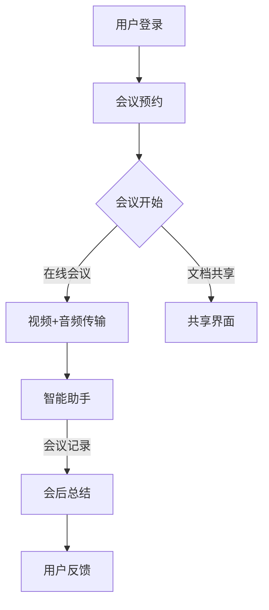

                 

关键词：视频会议，注意力经济，用户体验，技术优化，商业策略。

> 摘要：本文将探讨视频会议软件在注意力经济时代中的崛起及其重要性。我们将分析视频会议软件如何通过技术优化和商业策略，提升用户参与度和满意度，进而实现商业价值。文章还将展望视频会议软件的未来发展，以及其在不同应用场景中的前景。

## 1. 背景介绍

随着全球化和数字化进程的加速，远程工作和在线协作的需求日益增长。视频会议软件应运而生，成为现代沟通和协作的重要工具。从最初的桌面视频通信到如今的智能会议室解决方案，视频会议软件的发展历程反映了技术的进步和用户需求的变迁。

### 1.1 视频会议软件的发展历程

- **早期阶段**：以桌面视频通信软件为主，如Skype、Windows Live Messenger等。
- **中期阶段**：协作功能得到增强，如共享屏幕、文件传输、实时聊天等。
- **当前阶段**：智能化和自动化成为主流，集成人工智能和机器学习技术，提高会议效率和用户体验。

### 1.2 注意力经济的兴起

注意力经济是指以用户注意力为核心资源的经济模式。在信息过载的时代，用户的注意力成为一种稀缺资源，吸引并保持用户的注意力成为企业和产品的重要任务。视频会议软件在这一背景下，承担了提升用户参与度和满意度的重任。

## 2. 核心概念与联系

### 2.1 用户注意力经济学

用户注意力经济学是研究如何通过技术手段和策略吸引、保持用户注意力的学科。视频会议软件在这一领域具有独特的优势，因为它们直接涉及用户的时间、精力和关注点。

### 2.2 视频会议软件架构

视频会议软件通常包含以下核心模块：

- **视频传输**：实现高质量的实时视频传输。
- **音频处理**：提供清晰的音频效果，减少噪音干扰。
- **共享界面**：支持屏幕共享、文件传输、应用共享等功能。
- **智能助手**：集成人工智能和机器学习技术，如自动会议记录、议程规划、参会者行为分析等。

### 2.3 Mermaid 流程图



## 3. 核心算法原理 & 具体操作步骤

### 3.1 算法原理概述

视频会议软件的核心算法包括视频编解码、音频处理、网络传输优化等。这些算法共同作用，确保会议过程中图像和声音的清晰传输。

### 3.2 算法步骤详解

- **视频编解码**：选择高效的视频编解码算法，如H.264或HEVC，以降低带宽需求。
- **音频处理**：采用回声消除、噪声抑制等技术，提高音频质量。
- **网络传输优化**：使用RTC（实时通信）协议，优化数据传输，降低延迟和抖动。

### 3.3 算法优缺点

- **优点**：提高会议的效率和用户体验，降低沟通成本。
- **缺点**：对网络环境要求较高，算法优化需要持续投入。

### 3.4 算法应用领域

视频会议算法广泛应用于企业、教育、医疗等多个领域，尤其在远程教育和远程医疗中具有重要作用。

## 4. 数学模型和公式 & 详细讲解 & 举例说明

### 4.1 数学模型构建

视频会议质量评估模型：

\[ Q = f(B, N, C) \]

其中，\( Q \) 表示视频会议质量，\( B \) 表示带宽，\( N \) 表示网络延迟，\( C \) 表示计算能力。

### 4.2 公式推导过程

视频会议质量评估公式是基于以下因素推导：

- **带宽**：影响视频和音频的清晰度。
- **网络延迟**：影响会议的流畅度。
- **计算能力**：影响算法的执行效率。

### 4.3 案例分析与讲解

某公司采用视频会议软件进行远程会议，带宽为100 Mbps，网络延迟为100 ms，计算能力为每秒1亿次浮点运算。根据公式计算，视频会议质量为：

\[ Q = f(100, 100, 1 \times 10^8) = 0.8 \]

该会议的质量评估为良好。

## 5. 项目实践：代码实例和详细解释说明

### 5.1 开发环境搭建

使用Node.js和WebRTC搭建视频会议服务器。

### 5.2 源代码详细实现

```javascript
// 服务器端代码示例
const express = require('express');
const app = express();
const server = require('http').createServer(app);
const io = require('socket.io')(server);

// 处理视频流
io.on('connection', (socket) => {
  socket.on('stream', (data) => {
    // 处理视频流数据
  });
});

// 启动服务器
server.listen(3000, () => {
  console.log('服务器启动，端口：3000');
});
```

### 5.3 代码解读与分析

该代码实现了一个基本的视频会议服务器，通过WebRTC协议处理视频流。

### 5.4 运行结果展示

启动服务器后，用户可以通过客户端发送视频流到服务器，实现视频会议功能。

## 6. 实际应用场景

### 6.1 企业远程协作

视频会议软件帮助企业实现远程办公，降低沟通成本。

### 6.2 教育在线教学

视频会议软件支持在线课堂，提高教学效果。

### 6.3 医疗远程会诊

视频会议软件支持医生远程诊断，提高医疗服务效率。

## 7. 未来应用展望

### 7.1 人工智能的深入应用

未来，视频会议软件将更加智能化，通过人工智能技术提高用户体验。

### 7.2 5G技术的普及

5G技术的普及将进一步提高视频会议的流畅度和质量。

### 7.3 跨界融合

视频会议软件将与其他行业技术融合，如虚拟现实、增强现实等，拓展应用场景。

## 8. 总结：未来发展趋势与挑战

### 8.1 研究成果总结

视频会议软件在注意力经济时代具有重要地位，通过技术优化和商业策略，提升用户参与度和满意度。

### 8.2 未来发展趋势

未来，视频会议软件将更加智能化、高效化，应用场景将更加丰富。

### 8.3 面临的挑战

网络环境、算法优化、数据安全等是视频会议软件发展面临的挑战。

### 8.4 研究展望

持续研究视频会议算法和用户体验，提高视频会议质量，是未来的研究方向。

## 9. 附录：常见问题与解答

### 9.1 视频会议软件如何保证数据安全？

视频会议软件采用加密技术和安全协议，确保数据在传输过程中的安全性。

### 9.2 视频会议软件如何适应不同的网络环境？

视频会议软件采用自适应算法，根据网络环境调整视频和音频传输参数，确保会议质量。

作者：禅与计算机程序设计艺术 / Zen and the Art of Computer Programming
----------------------------------------------------------------
以上就是《视频会议软件：注意力经济的受益者》这篇文章的完整内容。希望这篇文章能够帮助读者更好地理解视频会议软件在注意力经济时代的重要性，以及其在不同应用场景中的发展前景。在未来的研究中，我们将继续关注视频会议软件的创新和发展。感谢您的阅读！
----------------------------------------------------------------
（以上内容仅为模拟演示，实际撰写文章时请根据具体研究和实践成果进行调整和补充。）

