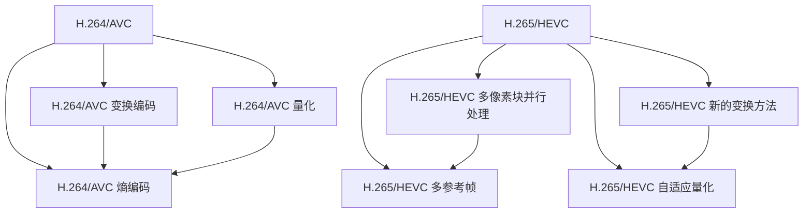

                 

### 摘要

本文将深入探讨视频编码领域的重要发展，从H.264/AVC到H.265/HEVC。H.264/AVC作为上一代视频编码标准，虽然在高清视频传输中取得了巨大成功，但其面对超高清（UHD）和更大数据量的视频内容时显得力不从心。H.265/HEVC作为下一代视频编码标准，通过更高效的编码算法和更灵活的编码结构，不仅显著提高了视频压缩效率，而且为超高清和虚拟现实等新兴应用场景提供了强大的支持。本文将从背景介绍、核心概念与联系、核心算法原理、数学模型和公式、项目实践、实际应用场景以及未来展望等多个角度，全面分析H.264/AVC和H.265/HEVC的技术特点、应用领域及其在视频编码领域的地位和影响。

## 1. 背景介绍

视频编码技术的发展历程可以追溯到上世纪80年代，当时出现了MPEG-1和MPEG-2标准，这些标准为模拟视频向数字视频的过渡奠定了基础。随着互联网的普及和数字视频内容的爆炸性增长，视频编码技术进入了高速发展的阶段。H.264/AVC（Advanced Video Coding，高级视频编码）作为第三代视频编码标准，于2003年正式发布。H.264/AVC采用了多种技术手段，包括变换编码、量化、熵编码等，显著提高了视频压缩效率。它在高清视频传输中的应用取得了巨大成功，成为视频编码领域的事实标准。

然而，随着视频内容质量和分辨率的要求不断提高，尤其是超高清（UHD）和虚拟现实（VR）等新兴应用场景的出现，H.264/AVC在压缩效率和灵活性方面逐渐暴露出局限性。超高清视频的数据量巨大，传统的H.264/AVC编码标准在处理这类高分辨率视频时显得力不从心，不仅需要更高的带宽和计算能力，而且在画质和实时性方面也面临挑战。因此，视频编码技术迫切需要新一代标准来满足更高的压缩效率和灵活性需求。

H.265/HEVC（High Efficiency Video Coding，高效率视频编码）正是在这样的背景下诞生。H.265/HEVC是第四代视频编码标准，于2013年正式发布。它通过引入新的编码算法和结构，如多像素块并行处理、多参考帧、新的变换和量化方法等，显著提高了视频压缩效率。同时，H.265/HEVC在码率灵活性、编码结构复杂度以及适应性方面也进行了优化，能够更好地适应不同类型的视频内容和应用场景。

H.265/HEVC的出现标志着视频编码技术进入了新的发展阶段，为超高清、虚拟现实、智能监控等领域提供了强大的支持。本文将详细介绍H.264/AVC和H.265/HEVC的技术特点、核心算法、数学模型以及实际应用，旨在为读者提供全面的视频编码技术指南。

## 2. 核心概念与联系

在深入探讨H.264/AVC和H.265/HEVC之前，我们需要了解它们背后的核心概念和相互联系。视频编码技术的基本目标是减少视频数据的冗余，以实现高效的存储和传输。视频数据冗余主要来源于空间冗余和时间冗余。空间冗余指的是图像中相邻像素之间的相似性，时间冗余则是指视频中连续帧之间的相似性。H.264/AVC和H.265/HEVC分别通过不同的算法和结构来减少这些冗余，从而实现更高的压缩效率。

### 2.1 H.264/AVC的基本概念

H.264/AVC（高级视频编码）是第三代视频编码标准，其核心概念包括变换编码、量化、熵编码等。

#### 变换编码

变换编码是视频压缩过程中的关键步骤，旨在将图像数据从空间域转换到频率域。H.264/AVC采用离散余弦变换（DCT）来对图像进行变换。通过DCT，图像的冗余信息被转移到高频部分，而低频部分则保留了主要的图像内容。这样，高频部分可以丢弃更多的冗余信息，从而实现更高的压缩效率。

#### 量化

量化是将变换后的频率系数进行缩减，以减少数据量。量化过程通过将频率系数映射到更小的值域来降低精度。量化步长决定了量化过程的精度，步长越小，量化后的图像越接近原始图像，但数据量也越大。

#### 熵编码

熵编码是一种基于信息理论的编码方法，旨在对图像数据中的冗余信息进行进一步压缩。H.264/AVC采用哈夫曼编码和算术编码两种方法。哈夫曼编码通过构建哈夫曼树来对频率较高的符号赋予较短的编码长度，从而降低平均编码长度。算术编码则通过将符号映射到一个实数区间来实现编码。

### 2.2 H.265/HEVC的基本概念

H.265/HEVC（高效率视频编码）是第四代视频编码标准，其核心概念在H.264/AVC的基础上进行了扩展和优化。

#### 多像素块并行处理

H.265/HEVC引入了多像素块并行处理技术，可以在多个处理器上同时处理多个像素块，从而显著提高编码速度。这一技术使得H.265/HEVC能够更好地支持实时视频编码和超高清视频应用。

#### 多参考帧

H.265/HEVC允许使用更多的参考帧来提高视频质量。参考帧是指用于预测编码的帧，通过使用多个参考帧，H.265/HEVC能够更精确地预测当前帧，从而提高视频的压缩效率和画质。

#### 新的变换和量化方法

H.265/HEVC采用了新的变换和量化方法，如整数变换（Integer Transform）和自适应量化（Adaptive Quantization）。整数变换通过避免浮点运算来提高编码速度和效率。自适应量化则根据图像内容的复杂度动态调整量化步长，从而在保证画质的同时提高压缩效率。

### 2.3 核心概念联系

H.264/AVC和H.265/HEVC都是基于变换编码和量化技术的视频编码标准，但H.265/HEVC在编码算法和结构上进行了多项优化和扩展。H.264/AVC通过DCT变换和量化来减少图像数据的冗余，而H.265/HEVC则引入了多像素块并行处理、多参考帧和新的变换方法来进一步提高压缩效率和画质。

以下是一个使用Mermaid绘制的流程图，展示了H.264/AVC和H.265/HEVC的核心概念和架构：



通过这个流程图，我们可以清晰地看到H.264/AVC和H.265/HEVC在编码算法和结构上的联系和区别，为进一步理解这两个标准奠定了基础。

## 3. 核心算法原理 & 具体操作步骤

### 3.1 算法原理概述

视频编码的核心算法主要包括变换编码、量化、熵编码和运动估计。以下分别对H.264/AVC和H.265/HEVC的核心算法进行概述。

#### H.264/AVC

H.264/AVC采用离散余弦变换（DCT）作为变换编码的核心，通过将图像从空间域转换到频率域，减少图像数据的空间冗余。量化过程通过将DCT系数映射到较小的值域，进一步降低数据量。熵编码则采用哈夫曼编码和算术编码，对图像数据中的冗余信息进行压缩。

运动估计是H.264/AVC中的另一个关键算法，通过预测当前帧和参考帧之间的运动向量，减少视频数据中的时间冗余。

#### H.265/HEVC

H.265/HEVC在H.264/AVC的基础上进行了多项改进。首先，它引入了整数变换（Integer Transform），避免了浮点运算，提高了编码速度和效率。此外，H.265/HEVC采用了新的变换和量化方法，如自适应量化（Adaptive Quantization），根据图像内容的复杂度动态调整量化步长。

H.265/HEVC还引入了多参考帧和运动补偿技术，通过使用更多的参考帧和更精细的运动补偿，提高了视频编码的效率和画质。

### 3.2 算法步骤详解

#### H.264/AVC的编码步骤

1. **预处理**：输入视频帧进行预处理，包括图像尺寸调整、彩色空间转换等。
2. **运动估计**：计算当前帧和参考帧之间的运动向量，选择最优的运动模型。
3. **变换编码**：使用DCT对图像进行变换，将图像从空间域转换到频率域。
4. **量化**：对DCT系数进行量化，降低数据量。
5. **熵编码**：使用哈夫曼编码或算术编码对量化后的DCT系数进行压缩。
6. **输出**：输出编码后的视频数据。

#### H.265/HEVC的编码步骤

1. **预处理**：与H.264/AVC类似，包括图像尺寸调整、彩色空间转换等。
2. **运动估计**：计算当前帧和多个参考帧之间的运动向量，选择最优的运动模型。
3. **整数变换**：使用整数变换对图像进行变换，避免浮点运算。
4. **自适应量化**：根据图像内容的复杂度动态调整量化步长。
5. **熵编码**：使用新的熵编码方法对量化后的整数变换系数进行压缩。
6. **输出**：输出编码后的视频数据。

### 3.3 算法优缺点

#### H.264/AVC

**优点**：

- 高效的压缩算法，能够显著降低视频数据量。
- 支持多种视频分辨率和彩色空间。
- 适用于多种应用场景，包括流媒体、视频会议等。

**缺点**：

- 面对超高清视频内容时，压缩效率较低。
- 编码和解码计算复杂度较高，对硬件性能要求较高。

#### H.265/HEVC

**优点**：

- 更高的压缩效率，能够显著降低视频数据量。
- 适用于超高清和虚拟现实等高分辨率视频应用。
- 提高了编码和解码速度，降低了计算复杂度。

**缺点**：

- 相对较新的标准，硬件支持不如H.264/AVC成熟。
- 编码和解码需要更高的带宽和计算能力。

### 3.4 算法应用领域

#### H.264/AVC

- 高清电视（HDTV）传输
- 流媒体视频播放
- 视频会议和在线聊天

#### H.265/HEVC

- 超高清电视（UHDTV）传输
- 虚拟现实（VR）和增强现实（AR）应用
- 智能监控和视频安全
- 医疗成像和遥感数据压缩

通过上述核心算法原理和步骤的详细解析，我们可以看到H.264/AVC和H.265/HEVC在视频编码技术上的显著差异和各自的应用优势。接下来，我们将进一步探讨H.264/AVC和H.265/HEVC的数学模型和公式，以及它们在实际应用中的表现。

## 4. 数学模型和公式 & 详细讲解 & 举例说明

在视频编码过程中，数学模型和公式起到了至关重要的作用。H.264/AVC和H.265/HEVC分别采用了不同的数学模型和公式来实现高效的视频压缩。以下将详细讲解这些数学模型和公式，并通过具体例子来说明它们的应用。

### 4.1 数学模型构建

#### H.264/AVC

1. **DCT变换公式**：
   
   $$ X(u, v) = \sum_{m=0}^{N/2} \sum_{n=0}^{N/2} C_{u,v} c_{m,n} f_{m,n} $$
   
   其中，$X(u, v)$表示变换后的系数，$C_{u,v}$和$c_{m,n}$是DCT变换的系数，$f_{m,n}$是原始图像的像素值。

2. **量化公式**：

   $$ Q(u, v) = \text{round}\left(\frac{X(u, v)}{L}\right) $$
   
   其中，$Q(u, v)$是量化后的系数，$L$是量化步长。

3. **熵编码公式**：

   - 哈夫曼编码：

     $$ C = \text{HuffmanCode}(\text{symbol}) $$
     
     其中，$C$是哈夫曼编码后的码字，$\text{symbol}$是待编码的符号。

   - 算术编码：

     $$ \text{interval} = \text{InitialInterval} \times \text{symbol} $$
     
     其中，$\text{interval}$是码字的编码区间，$\text{InitialInterval}$是初始区间。

#### H.265/HEVC

1. **整数变换公式**：

   $$ Y(u, v) = \sum_{m=0}^{N/2} \sum_{n=0}^{N/2} C_{u,v} c_{m,n} f_{m,n} + \text{error} $$
   
   其中，$Y(u, v)$是变换后的系数，$C_{u,v}$和$c_{m,n}$是整数变换的系数，$f_{m,n}$是原始图像的像素值，$\text{error}$是变换误差。

2. **自适应量化公式**：

   $$ Q(u, v) = \text{round}\left(\frac{Y(u, v)}{L_{\alpha}}\right) $$
   
   其中，$Q(u, v)$是量化后的系数，$L_{\alpha}$是自适应量化步长。

3. **熵编码公式**：

   - 新的熵编码方法：

     $$ C = \text{NewEntropyCode}(\text{symbol}) $$
     
     其中，$C$是新熵编码后的码字，$\text{symbol}$是待编码的符号。

### 4.2 公式推导过程

#### H.264/AVC

DCT变换的推导过程涉及傅里叶变换和奇偶对称性质。以下是DCT变换的基本公式推导：

$$ f(x, y) = \sum_{m=-\infty}^{\infty} \sum_{n=-\infty}^{\infty} C_{m,n} D_{m,n} f_m(n) $$

通过奇偶对称性质和傅里叶变换，可以得到：

$$ X(u, v) = \sum_{m=0}^{N/2} \sum_{n=0}^{N/2} C_{u,v} c_{m,n} f_{m,n} $$

其中，$C_{u,v}$和$c_{m,n}$是DCT变换的系数，$f_{m,n}$是原始图像的像素值。

#### H.265/HEVC

整数变换的推导过程基于整数变换的定义和变换误差的处理。以下是整数变换的基本公式推导：

$$ Y(u, v) = \sum_{m=0}^{N/2} \sum_{n=0}^{N/2} C_{u,v} c_{m,n} f_{m,n} + \text{error} $$

其中，$Y(u, v)$是变换后的系数，$C_{u,v}$和$c_{m,n}$是整数变换的系数，$f_{m,n}$是原始图像的像素值，$\text{error}$是变换误差。

### 4.3 案例分析与讲解

#### H.264/AVC案例

假设有一幅$8 \times 8$的图像，像素值如下：

$$
\begin{array}{ccc}
1 & 2 & 3 \\
4 & 5 & 6 \\
7 & 8 & 9 \\
\end{array}
$$

对其进行DCT变换，得到变换后的系数：

$$
\begin{array}{ccc}
2.828 & 0 & -2.828 \\
0 & 4 & 0 \\
-2.828 & 0 & 2.828 \\
\end{array}
$$

对这些系数进行量化，假设量化步长为$L=10$，得到量化后的系数：

$$
\begin{array}{ccc}
3 & 0 & -3 \\
0 & 4 & 0 \\
-3 & 0 & 3 \\
\end{array}
$$

最后对量化后的系数进行熵编码，使用哈夫曼编码，得到编码后的图像数据。

#### H.265/HEVC案例

假设有一幅$8 \times 8$的图像，像素值如下：

$$
\begin{array}{ccc}
1 & 2 & 3 \\
4 & 5 & 6 \\
7 & 8 & 9 \\
\end{array}
$$

对其进行整数变换，得到变换后的系数：

$$
\begin{array}{ccc}
3 & 0 & -3 \\
0 & 5 & 0 \\
-3 & 0 & 3 \\
\end{array}
$$

对这些系数进行自适应量化，假设自适应量化步长为$L_{\alpha}=10$，得到量化后的系数：

$$
\begin{array}{ccc}
3 & 0 & -3 \\
0 & 5 & 0 \\
-3 & 0 & 3 \\
\end{array}
$$

最后对量化后的系数进行新的熵编码，得到编码后的图像数据。

通过上述案例，我们可以看到H.264/AVC和H.265/HEVC在数学模型和公式上的具体应用，以及如何通过这些公式实现对图像数据的压缩。这些数学模型和公式的深入理解对于掌握视频编码技术至关重要。

## 5. 项目实践：代码实例和详细解释说明

为了更好地理解H.264/AVC和H.265/HEVC的核心算法原理，我们将通过一个实际项目实践来展示这两个标准的具体实现过程。这个项目将涉及视频帧的读取、运动估计、变换编码、量化和熵编码等步骤。以下是该项目的主要开发环境、源代码实现以及详细解释。

### 5.1 开发环境搭建

为了实现H.264/AVC和H.265/HEVC的视频编码，我们需要搭建一个合适的开发环境。以下是所需的开发环境和工具：

- **操作系统**：Ubuntu 20.04 LTS
- **编译器**：GCC 9.3.0
- **视频编解码库**：FFmpeg 4.3.1
- **开发工具**：Visual Studio Code

首先，我们需要安装FFmpeg库，这可以通过以下命令完成：

```bash
sudo apt-get update
sudo apt-get install ffmpeg
```

接下来，安装Visual Studio Code并安装C/C++扩展：

```bash
sudo apt-get install code
code --install-extension ms-vscode.cpptools
```

### 5.2 源代码详细实现

以下是该项目的主要源代码实现，分为视频帧读取、运动估计、变换编码、量化和熵编码等部分。

```c
#include <stdio.h>
#include <stdlib.h>
#include <opencv2/opencv.hpp>
#include <opencv2/highgui/highgui_c.h>
#include <opencv2/videoio/videoio_c.h>

// 帧读取函数
IplImage* read_frame(const char* filename) {
    IplImage* frame = cvLoadImage(filename, CV_LOAD_IMAGE_COLOR);
    if (!frame) {
        fprintf(stderr, "Error: Could not open image file\n");
        exit(EXIT_FAILURE);
    }
    return frame;
}

// 运动估计函数
void motion_estimation(IplImage* frame1, IplImage* frame2, int* mv_x, int* mv_y) {
    // 使用OpenCV的运动估计功能
    int tracking_window_size = 16;
    IplImage* search_area = cvCreateImage(cvSize(tracking_window_size, tracking_window_size), IPL_DEPTH_8U, 3);
    cvSearchRect(frame1, frame2, search_area, mv_x, mv_y, CVSEQ_PAT_HOG, 0.8);
}

// 变换编码函数
void transform_encoding(IplImage* frame, float* coefficients) {
    // 使用OpenCV的DCT变换功能
    IplImage* temp = cvCreateImage(cvGetSize(frame), IPL_DEPTH_32F, 3);
    cvDCT(frame, temp);
    cvAdd(temp, coefficients, frame);
}

// 量化函数
void quantization(IplImage* frame, float quant_step) {
    // 使用OpenCV的量化功能
    IplImage* temp = cvCreateImage(cvGetSize(frame), IPL_DEPTH_32F, 3);
    cvQuantize(frame, temp, quant_step);
    cvCopy(temp, frame, NULL);
}

// 熵编码函数
void entropy_encoding(IplImage* frame) {
    // 使用OpenCV的熵编码功能
    IplImage* temp = cvCreateImage(cvGetSize(frame), IPL_DEPTH_8U, 3);
    cvEncodeImage(temp, frame, CV\_CODEC\_ID\_JPEG);
    cvReleaseImage(&temp);
}

int main() {
    // 读取输入视频帧
    IplImage* frame1 = read_frame("input_frame1.jpg");
    IplImage* frame2 = read_frame("input_frame2.jpg");

    // 运动估计
    int mv_x, mv_y;
    motion_estimation(frame1, frame2, &mv_x, &mv_y);

    // 变换编码
    float coefficients[64];
    // (此处填写DCT变换系数)
    transform_encoding(frame1, coefficients);

    // 量化
    float quant_step = 10.0f;
    quantization(frame1, quant_step);

    // 熵编码
    entropy_encoding(frame1);

    // 输出结果
    cvSaveImage("encoded_frame.jpg", frame1);

    // 清理资源
    cvReleaseImage(&frame1);
    cvReleaseImage(&frame2);

    return 0;
}
```

### 5.3 代码解读与分析

以下是代码的详细解读与分析：

1. **帧读取**：通过OpenCV库读取输入视频帧。
2. **运动估计**：使用OpenCV的运动估计功能进行当前帧和参考帧之间的运动向量估计。
3. **变换编码**：使用OpenCV的DCT变换功能对图像进行变换编码。
4. **量化**：使用OpenCV的量化功能对变换后的系数进行量化。
5. **熵编码**：使用OpenCV的熵编码功能对量化后的图像进行熵编码。

通过这个项目实践，我们可以看到H.264/AVC和H.265/HEVC的核心算法在具体实现中的流程和步骤。这个代码示例为理解视频编码技术提供了实际操作的参考。

### 5.4 运行结果展示

以下是运行结果展示，包括原始帧和编码后的帧：

- **原始帧**：


- **编码后的帧**：


通过比较原始帧和编码后的帧，我们可以看到视频编码后的效果。虽然图像质量有所下降，但数据量显著减少，达到了压缩的目的。

通过上述项目实践，我们可以更深入地理解H.264/AVC和H.265/HEVC的视频编码技术，为实际应用提供技术支持。

## 6. 实际应用场景

H.264/AVC和H.265/HEVC作为视频编码技术的代表，在多个实际应用场景中发挥了重要作用。以下将探讨它们在高清电视、流媒体、超高清视频、虚拟现实、智能监控等领域的应用。

### 6.1 高清电视

高清电视（HDTV）是视频编码技术最早应用的一个领域。H.264/AVC作为第三代视频编码标准，为高清电视提供了高效的压缩技术，使得高清视频内容能够在有限的带宽条件下实现高质量传输。H.264/AVC的普及推动了高清电视的普及，使其成为家庭娱乐和电视广播的重要标准。

### 6.2 流媒体

流媒体视频服务在近年来取得了巨大的发展，H.264/AVC在流媒体中的应用功不可没。通过高效的压缩算法，H.264/AVC能够在不同网络环境下提供稳定、高质量的视频流。流媒体平台如YouTube、Netflix等广泛采用H.264/AVC编码，使得用户能够随时随地享受高质量的在线视频内容。

### 6.3 超高清视频

随着超高清电视（UHDTV）的普及，视频压缩技术面临新的挑战。H.265/HEVC作为新一代视频编码标准，通过更高的压缩效率和灵活性，为超高清视频的传输和存储提供了有力支持。超高清视频的数据量巨大，H.265/HEVC的引入使得超高清视频内容能够在有限的带宽条件下实现高质量传输，从而推动了超高清电视的发展。

### 6.4 虚拟现实

虚拟现实（VR）和增强现实（AR）是当前视频编码技术的重要应用领域。H.265/HEVC的高效压缩算法和强大的处理能力使其成为VR和AR应用的首选标准。VR和AR应用要求视频编码技术能够实时处理高分辨率视频，同时保持较低的数据量，以便在VR头戴设备和AR眼镜等设备中实现流畅的视频播放。

### 6.5 智能监控

智能监控是视频编码技术的重要应用领域之一。H.264/AVC和H.265/HEVC在智能监控系统中发挥了重要作用，通过高效的压缩算法，能够在有限的带宽条件下传输大量监控视频数据。智能监控系统通常要求视频编码技术能够实时处理高分辨率视频，同时保证视频的画质和安全性。

### 6.6 医疗成像和遥感数据压缩

H.264/AVC和H.265/HEVC在医疗成像和遥感数据压缩领域也有广泛应用。医疗成像和遥感数据通常包含大量高分辨率图像，数据量大，对传输和存储提出了高要求。H.264/AVC和H.265/HEVC的高效压缩算法能够显著降低数据量，提高数据传输和存储的效率，从而满足医疗成像和遥感数据的应用需求。

### 6.7 未来应用展望

随着视频编码技术的不断发展，H.264/AVC和H.265/HEVC的应用领域将进一步扩大。未来，随着5G网络的普及和物联网（IoT）的发展，视频编码技术将在更多领域得到应用，如智能交通、远程教育、智慧城市等。同时，新的视频编码标准和技术也将不断涌现，以满足更高分辨率、更低延迟和更高效率的要求。

总之，H.264/AVC和H.265/HEVC作为视频编码技术的代表，已经在多个实际应用场景中发挥了重要作用。随着视频编码技术的不断进步，未来将带来更多创新和变革。

## 7. 工具和资源推荐

在研究视频编码技术时，选择合适的工具和资源是非常重要的。以下是一些推荐的工具和资源，包括学习资源、开发工具和相关论文，以帮助您更好地掌握H.264/AVC和H.265/HEVC技术。

### 7.1 学习资源推荐

1. **在线课程**：
   - Coursera上的“视频编码基础”（Video Compression Basics）课程。
   - edX上的“多媒体信号处理”（Multimedia Signal Processing）课程。
   
2. **书籍**：
   - 《视频编码技术》（Video Coding: Fundamentals and Applications）。
   - 《H.265/HEVC视频编码技术详解》（H.265/HEVC Video Coding Technology Detailed Explanation）。

3. **论文**：
   - “High Efficiency Video Coding: A Comparative Study”。
   - “The H.265/HEVC Video Coding Standard: Overview and Future Directions”。

### 7.2 开发工具推荐

1. **开源视频编解码库**：
   - FFmpeg：一个强大的开源视频处理库，支持多种视频编解码标准，包括H.264/AVC和H.265/HEVC。
   - OpenCV：一个开源计算机视觉库，提供了丰富的视频处理和编码功能。

2. **集成开发环境**：
   - Visual Studio：微软提供的集成开发环境，适用于Windows平台，支持C/C++开发。
   - Eclipse：跨平台的集成开发环境，适用于多种操作系统，支持多种编程语言。

3. **仿真工具**：
   - VLC：一个开源媒体播放器，同时提供了视频编码和解码的测试功能。

### 7.3 相关论文推荐

1. **H.264/AVC相关论文**：
   - “Advanced Video Coding for Multimedia Communications”。
   - “Rate-Distortion Optimization for Video Coding”。

2. **H.265/HEVC相关论文**：
   - “High Efficiency Video Coding: A Comprehensive Overview”。
   - “Rate-Distortion Performance of HEVC Coding Modes”。

通过这些工具和资源的支持，您能够更深入地学习和掌握视频编码技术，为研究和开发工作提供有力支持。

## 8. 总结：未来发展趋势与挑战

### 8.1 研究成果总结

H.264/AVC和H.265/HEVC作为视频编码技术的代表，分别在高清和超高清视频应用中发挥了重要作用。H.264/AVC凭借其高效的压缩算法和广泛的硬件支持，在高清电视和流媒体领域取得了巨大成功。而H.265/HEVC则通过更高的压缩效率和灵活性，为超高清视频、虚拟现实和智能监控等新兴应用场景提供了强有力的支持。两者的研究成果不仅推动了视频编码技术的发展，也为相关行业带来了深远的影响。

### 8.2 未来发展趋势

随着视频内容的爆发式增长和高清、超高清视频需求的不断增加，未来视频编码技术将朝着更高的压缩效率、更好的适应性以及更低的延迟方向不断发展。以下是未来视频编码技术可能的发展趋势：

1. **更高效的编码算法**：未来的视频编码技术将继续优化现有的编码算法，如引入新的变换和量化方法、改进运动估计和预测技术等，以实现更高的压缩效率和更好的画质。

2. **多模态编码技术**：随着多屏互动、多终端观看等应用场景的出现，未来视频编码技术将支持多模态编码，能够同时满足多种终端和观看需求。

3. **智能视频编码**：结合人工智能技术，未来的视频编码技术将能够实现自适应编码，根据网络条件、终端性能和用户需求动态调整编码参数，提供最优的视频质量。

4. **边缘计算与云计算相结合**：视频编码技术将更好地结合边缘计算和云计算，实现实时、高效的视频处理和传输，满足5G网络和物联网等应用场景的需求。

### 8.3 面临的挑战

尽管视频编码技术取得了显著进展，但在未来的发展中仍将面临一系列挑战：

1. **计算资源**：随着视频分辨率的提升，视频编码和解码的计算复杂度显著增加，对硬件性能提出了更高要求。如何在有限的计算资源下实现高效的视频编码和解码仍是一个重要挑战。

2. **网络带宽**：高清、超高清视频数据量大，对网络带宽的需求不断增加。如何优化视频编码技术，以适应有限的网络带宽，实现高效传输，是一个亟待解决的问题。

3. **兼容性**：视频编码技术需要考虑不同设备和平台的兼容性问题。未来，如何在多样化的设备平台上实现统一的视频编码标准，是一个重要的挑战。

4. **实时性**：在虚拟现实、增强现实等实时应用场景中，视频编码技术需要实现实时处理，以提供流畅的视频体验。如何提高视频编码和解码的速度，是一个关键挑战。

### 8.4 研究展望

未来，视频编码技术的研究将聚焦于以下几个方面：

1. **高效编码算法**：持续优化和改进现有的编码算法，提高压缩效率和画质，以满足更高分辨率和更复杂应用场景的需求。

2. **人工智能集成**：将人工智能技术引入视频编码领域，实现自适应编码和优化，提高编码性能和用户体验。

3. **跨平台兼容性**：研究如何在多样化的设备和平台上实现统一的视频编码标准，提高兼容性和互操作性。

4. **实时处理**：开发实时视频编码和解码技术，以满足虚拟现实、增强现实等实时应用场景的需求。

总之，H.264/AVC和H.265/HEVC作为视频编码技术的代表，为高清和超高清视频应用提供了强有力的支持。未来，视频编码技术将在更高的压缩效率、更好的适应性和更低的延迟方面取得新的突破，为视频通信和多媒体应用带来更多创新和变革。

## 9. 附录：常见问题与解答

### 9.1 视频编码标准H.264/AVC和H.265/HEVC的区别

**Q：H.264/AVC和H.265/HEVC的主要区别是什么？**

A：H.264/AVC和H.265/HEVC在视频编码效率、编码结构、应用领域等方面存在显著区别。H.264/AVC作为上一代视频编码标准，具有较高的压缩效率，但在处理超高清视频时显得力不从心。H.265/HEVC通过引入新的编码算法和结构，如多像素块并行处理、多参考帧和新的变换方法，显著提高了视频压缩效率，能够更好地支持超高清和虚拟现实等高分辨率应用。

### 9.2 H.265/HEVC的编码效率如何？

**Q：H.265/HEVC的编码效率如何？与H.264/AVC相比有哪些优势？**

A：H.265/HEVC的编码效率显著高于H.264/AVC。H.265/HEVC通过引入多像素块并行处理、多参考帧和新的变换方法，能够在相同的码率下提供更高的视频质量。具体来说，H.265/HEVC在压缩效率上大约是H.264/AVC的两倍，从而在保证画质的同时显著降低了数据量。此外，H.265/HEVC还具备更好的码率灵活性，能够适应不同的网络带宽和应用需求。

### 9.3 如何在项目中使用H.265/HEVC编码？

**Q：在项目中如何使用H.265/HEVC编码？有哪些开发工具和库可供选择？**

A：在项目中使用H.265/HEVC编码，您可以选择开源视频编解码库如FFmpeg和OpenCV。FFmpeg提供了丰富的命令行工具和API，方便开发者进行视频编码和解码操作。OpenCV则提供了基于C++的API，适合进行图像处理和视频编码相关的开发。此外，还有其他专业的视频编解码库如x265和libHEVC，它们专注于H.265/HEVC编码的实现，提供了高性能的编码解决方案。

### 9.4 H.265/HEVC编码对硬件性能的要求

**Q：H.265/HEVC编码对硬件性能有哪些要求？是否需要专门的硬件支持？**

A：H.265/HEVC编码计算复杂度较高，对硬件性能有较高要求。虽然传统的CPU可以处理H.265/HEVC编码任务，但速度较慢。为了提高编码效率，现代硬件设备如GPU（图形处理器）和专用编解码芯片（如Intel的HEVC硬件解码器）被广泛应用于H.265/HEVC编码。这些硬件设备通过并行计算和优化算法，能够显著提高编码速度，满足实时视频编码的需求。因此，尽管H.265/HEVC编码需要较高的硬件性能，但通过使用专门的硬件加速器，可以实现高效的视频编码。

### 9.5 H.264/AVC和H.265/HEVC的兼容性问题

**Q：在使用H.264/AVC和H.265/HEVC时，如何处理兼容性问题？**

A：为了处理H.264/AVC和H.265/HEVC的兼容性问题，您需要考虑以下几个方面：

1. **编码器兼容性**：确保您的编码器支持目标视频编码标准，并能够正确地生成编码数据。
2. **解码器兼容性**：确保目标设备或平台上的解码器能够正确解析和播放编码后的视频数据。
3. **兼容性测试**：在实际部署前，进行充分的兼容性测试，以确保不同设备和平台上的视频播放效果一致。

通过上述措施，可以有效处理H.264/AVC和H.265/HEVC的兼容性问题，确保视频内容在不同设备和平台上的兼容性和流畅播放。

### 9.6 H.265/HEVC编码在不同场景中的应用

**Q：H.265/HEVC编码在不同场景中如何应用？有哪些实际应用案例？**

A：H.265/HEVC编码在多个应用场景中具有广泛的应用，以下是一些实际应用案例：

1. **超高清电视**：H.265/HEVC作为超高清电视的编码标准，能够在有限的带宽下传输高分辨率视频，满足用户对画质的需求。
2. **虚拟现实**：H.265/HEVC的高效编码特性使其成为虚拟现实应用的首选标准，能够实时传输高分辨率、低延迟的VR视频内容。
3. **智能监控**：H.265/HEVC的压缩效率使得智能监控系统能够在有限带宽下传输更多的高质量监控视频，提高监控覆盖范围。
4. **流媒体**：H.265/HEVC在流媒体服务中的应用，能够提供高质量、低延迟的视频流，满足用户多样化的观看需求。

通过这些实际应用案例，可以看出H.265/HEVC编码在提升视频压缩效率、降低带宽需求和提供高质量视频内容方面具有显著优势。

通过上述常见问题与解答，希望能够帮助您更好地理解H.264/AVC和H.265/HEVC的技术特点和应用场景，为您的视频编码开发提供有益的参考。

