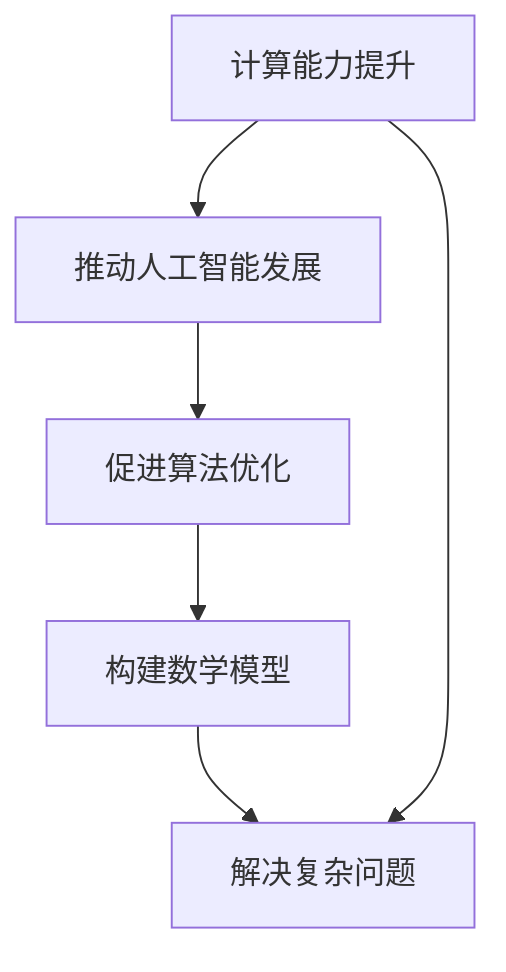

                 

关键词：计算能力、人工智能、算法优化、数学模型、软件开发、未来展望

摘要：本文旨在探讨计算技术在解决人类面临的各种重大挑战中的作用。通过分析计算能力的提升、人工智能的发展、算法优化和数学模型的构建，本文揭示了计算技术在推动社会进步和应对全球性难题中的关键角色。同时，本文还展望了计算技术的未来发展趋势，以及面临的挑战和机遇。

## 1. 背景介绍

### 1.1 时代背景

随着信息技术的飞速发展，计算能力已经成为衡量一个国家或地区科技进步的重要标志。从最早的计算机问世，到如今人工智能的崛起，计算技术正深刻地改变着人类的生产和生活方式。在这个信息化、智能化的时代，人类面临着越来越多的重大挑战，如气候变化、能源危机、疾病控制、食品安全等。这些挑战不仅涉及人类生存的基本需求，也关系到全球的可持续发展。

### 1.2 计算技术在解决挑战中的作用

计算技术在解决人类面临的重大挑战中发挥着至关重要的作用。首先，计算能力的提升使得我们可以处理和分析海量数据，从而获得更准确的预测和决策。例如，在气候变化的研究中，通过计算模型可以模拟出不同温室气体排放量下的气候变化趋势，为政策制定提供科学依据。其次，人工智能的发展为许多领域带来了革命性的变化，如医疗、金融、教育等。通过深度学习和强化学习等技术，人工智能系统能够自动识别疾病、预测市场走势、优化教育资源等，极大地提高了效率和准确性。此外，算法优化和数学模型的构建为解决复杂问题提供了强有力的工具，如在能源管理、城市规划、物流运输等领域，通过优化算法和数学模型，可以实现资源的最佳配置和利用，减少浪费，提高效率。

## 2. 核心概念与联系

### 2.1 计算能力

计算能力是指计算机在单位时间内处理数据的能力。它通常用每秒处理的指令数（IPS）或每秒处理的浮点运算数（FLOPS）来衡量。随着计算技术的不断发展，计算机的计算能力呈现出指数级增长。这种增长不仅推动了科学研究的进步，也为解决现实世界中的复杂问题提供了可能。

### 2.2 人工智能

人工智能（Artificial Intelligence，AI）是指由人制造出来的系统所表现出来的智能。它包括机器学习、深度学习、自然语言处理、计算机视觉等多个子领域。人工智能的核心目标是使计算机具备人类智能，能够理解、学习和适应环境。随着计算能力的提升和算法的进步，人工智能技术已经取得了显著的成果，并在各个领域得到了广泛应用。

### 2.3 算法优化

算法优化是指通过改进算法的设计和实现，提高算法的效率、准确性和可靠性。在解决复杂问题时，算法优化起着至关重要的作用。一个高效的算法可以在较短的时间内处理大量数据，并提供准确的预测和决策。随着问题规模的不断扩大，算法优化的需求也越来越强烈。

### 2.4 数学模型

数学模型是一种用数学语言描述现实世界问题的方法。它通过建立数学公式和方程，将复杂问题转化为可以分析和求解的数学问题。数学模型在科学研究和工程实践中具有广泛的应用，如物理学、经济学、生物学、工程学等。

### 2.5 Mermaid 流程图

下面是一个用 Mermaid 语言描述的流程图，展示了计算能力、人工智能、算法优化和数学模型之间的联系。



## 3. 核心算法原理 & 具体操作步骤

### 3.1 算法原理概述

在本节中，我们将介绍一些核心算法的原理，包括计算能力、人工智能、算法优化和数学模型。

#### 3.1.1 计算能力

计算能力的核心在于并行计算。并行计算是指通过将任务分解成多个子任务，同时由多个处理器处理，从而提高计算效率。并行计算的基本原理是利用多个处理器的并行性，将计算任务分散到多个处理器上，从而减少计算时间。并行计算的关键技术包括多核处理器、分布式计算和云计算等。

#### 3.1.2 人工智能

人工智能的核心是机器学习。机器学习是指通过训练算法，使计算机能够从数据中自动学习并提取规律，从而进行预测和决策。机器学习的基本原理包括监督学习、无监督学习和强化学习。监督学习是通过已知的输入和输出数据，训练模型来预测未知输出。无监督学习是通过未知的数据，训练模型来发现数据中的规律。强化学习是通过与环境交互，不断调整策略，以最大化累积奖励。

#### 3.1.3 算法优化

算法优化的核心是降低算法的复杂度。降低算法复杂度的方法包括减少计算量、优化数据结构、改进算法设计等。常见的算法优化技术包括贪心算法、动态规划、分治算法等。

#### 3.1.4 数学模型

数学模型的核心是建立数学公式和方程，将问题转化为数学问题。常见的数学模型包括线性规划、非线性规划、动态规划、蒙特卡罗方法等。

### 3.2 算法步骤详解

在本节中，我们将详细介绍上述核心算法的具体步骤。

#### 3.2.1 计算能力

1. 确定计算任务，分析任务的并行性。
2. 将任务分解成多个子任务。
3. 将子任务分配给多个处理器。
4. 同时处理子任务。
5. 收集处理结果，进行汇总和整理。

#### 3.2.2 人工智能

1. 收集数据，对数据进行预处理。
2. 选择合适的机器学习算法。
3. 训练模型，调整参数。
4. 对模型进行评估和优化。
5. 将模型应用于实际问题。

#### 3.2.3 算法优化

1. 分析算法的复杂度，确定优化目标。
2. 选择合适的优化技术。
3. 修改算法设计，降低复杂度。
4. 测试优化后的算法，验证效果。

#### 3.2.4 数学模型

1. 分析问题，确定需要建立的数学模型。
2. 建立数学公式和方程。
3. 解数学模型，获得解。
4. 分析解的结果，进行验证和优化。

### 3.3 算法优缺点

#### 3.3.1 计算能力

优点：计算能力强，能够处理大量数据，提高计算效率。

缺点：对硬件要求较高，成本较高。

#### 3.3.2 人工智能

优点：能够从数据中自动学习，提高预测和决策的准确性。

缺点：对数据量要求较高，模型训练时间长。

#### 3.3.3 算法优化

优点：降低算法复杂度，提高计算效率。

缺点：优化过程复杂，对算法设计要求较高。

#### 3.3.4 数学模型

优点：能够精确描述问题，提供可靠的理论支持。

缺点：建立模型过程复杂，对数学知识要求较高。

### 3.4 算法应用领域

计算能力、人工智能、算法优化和数学模型在各个领域都有广泛应用。

#### 3.4.1 科学研究

在科学研究领域，计算能力和数学模型被广泛应用于物理、化学、生物等领域。例如，通过计算模型可以模拟化学反应、分子运动等，为科学研究提供理论支持。

#### 3.4.2 工程实践

在工程实践中，算法优化和数学模型被广泛应用于工程设计、结构分析、优化设计等。例如，通过优化算法可以找到结构的最优设计方案，提高工程效率。

#### 3.4.3 社会服务

在社会服务领域，人工智能被广泛应用于医疗、金融、教育等。例如，通过人工智能系统可以进行疾病诊断、风险评估、教育资源优化等。

## 4. 数学模型和公式 & 详细讲解 & 举例说明

### 4.1 数学模型构建

数学模型构建是解决复杂问题的第一步。在本节中，我们将介绍如何构建一个简单的数学模型。

#### 4.1.1 问题描述

假设我们有一个工厂，生产两种产品A和B。产品A的利润为100元/件，产品B的利润为200元/件。工厂每天的生产能力为1000件。现在需要确定每天生产A和B的数量，以最大化利润。

#### 4.1.2 数学模型构建

1. 定义变量：
   - 设生产A的数量为x件；
   - 设生产B的数量为y件。
2. 目标函数：
   - 利润最大化，即最大化P = 100x + 200y。
3. 约束条件：
   - 生产能力限制：x + y ≤ 1000；
   - 非负约束：x ≥ 0，y ≥ 0。

因此，我们的数学模型可以表示为：

$$
\begin{align*}
\text{最大化 } P &= 100x + 200y \\
\text{约束条件：} \\
x + y &\leq 1000 \\
x &\geq 0 \\
y &\geq 0
\end{align*}
$$

### 4.2 公式推导过程

为了解决这个问题，我们可以使用线性规划的方法。线性规划是一种优化技术，用于求解线性目标函数在满足线性约束条件下的最优解。

#### 4.2.1 标准形式

首先，我们将上述数学模型转化为标准形式：

$$
\begin{align*}
\text{最大化 } z &= c_1x + c_2y \\
\text{约束条件：} \\
Ax &\leq b \\
x &\geq 0
\end{align*}
$$

其中，A为约束矩阵，b为约束向量，c为目标函数系数，x为变量向量。

#### 4.2.2 对偶理论

为了求解线性规划问题，我们可以使用对偶理论。对偶理论指出，原始问题的最优解与对偶问题的最优解之间存在一定的关系。对偶问题的目标函数为：

$$
\text{最小化 } w = b^T y - c^T y
$$

其中，y为对偶变量。

#### 4.2.3 对偶问题求解

我们可以通过求解对偶问题来得到原始问题的最优解。对偶问题的求解方法包括单纯形法和内点法。在本例中，我们可以使用单纯形法求解。

### 4.3 案例分析与讲解

为了更好地理解线性规划的应用，我们来看一个实际案例。

#### 4.3.1 问题描述

一个农场种植两种作物A和B。作物A的利润为1000元/亩，作物B的利润为1500元/亩。农场的土地面积为100亩。现在需要确定每种作物的种植面积，以最大化利润。

#### 4.3.2 数学模型构建

1. 定义变量：
   - 设种植A的面积为x亩；
   - 设种植B的面积为y亩。
2. 目标函数：
   - 利润最大化，即最大化P = 1000x + 1500y。
3. 约束条件：
   - 土地面积限制：x + y ≤ 100；
   - 非负约束：x ≥ 0，y ≥ 0。

因此，我们的数学模型可以表示为：

$$
\begin{align*}
\text{最大化 } P &= 1000x + 1500y \\
\text{约束条件：} \\
x + y &\leq 100 \\
x &\geq 0 \\
y &\geq 0
\end{align*}
$$

#### 4.3.3 求解过程

我们可以使用单纯形法求解上述线性规划问题。首先，我们需要建立单纯形表。然后，通过迭代过程，找到最优解。

## 5. 项目实践：代码实例和详细解释说明

### 5.1 开发环境搭建

为了进行项目实践，我们需要搭建一个合适的开发环境。在这里，我们选择使用Python作为主要编程语言，因为Python具有简单易用、丰富的库和强大的计算能力。

#### 5.1.1 Python环境安装

1. 下载并安装Python，可以从Python的官方网站下载最新版本的Python安装包。安装过程按照默认选项进行即可。
2. 安装完成后，打开命令行窗口，输入`python`，如果出现Python的交互式环境，说明安装成功。

#### 5.1.2 库安装

为了方便开发，我们需要安装一些常用的库，如NumPy、SciPy、Pandas和matplotlib等。可以使用pip命令进行安装：

```
pip install numpy scipy pandas matplotlib
```

### 5.2 源代码详细实现

在本节中，我们将使用Python实现一个简单的线性规划模型，并求解上述农场的种植问题。

```python
import numpy as np
from scipy.optimize import linprog

# 目标函数系数
c = np.array([1000, 1500])

# 约束条件矩阵
A = np.array([[1, 1]])

# 约束条件向量
b = np.array([100])

# 非负约束
x0_bounds = (0, None)
x1_bounds = (0, None)

# 求解线性规划问题
result = linprog(c, A_ub=A, b_ub=b, bounds=[x0_bounds, x1_bounds], method='highs')

# 输出结果
if result.success:
    print("最优解：x0 = {:.2f}, x1 = {:.2f}".format(result.x[0], result.x[1]))
    print("最大利润：P = {:.2f}元".format(result.fun))
else:
    print("无法求解")
```

### 5.3 代码解读与分析

在上面的代码中，我们首先导入了NumPy库，这是Python中用于科学计算的常用库。然后，我们使用scipy.optimize模块中的linprog函数来求解线性规划问题。

1. **目标函数系数**：`c = np.array([1000, 1500])`表示目标函数的系数，即每个变量的权重。在这个例子中，我们有两个变量x0和x1，分别表示种植作物A和B的面积，权重分别为1000和1500。

2. **约束条件矩阵**：`A = np.array([[1, 1]])`表示约束条件的系数矩阵，这里只有一个约束条件，即x0 + x1 ≤ 100。

3. **约束条件向量**：`b = np.array([100])`表示约束条件的右侧常数项，即约束条件的上限。

4. **非负约束**：`x0_bounds = (0, None)`和`x1_bounds = (0, None)`表示变量x0和x1的上下界，这里我们假设种植面积不能为负数。

5. **求解线性规划问题**：`result = linprog(c, A_ub=A, b_ub=b, bounds=[x0_bounds, x1_bounds], method='highs')`调用linprog函数求解线性规划问题。`method='highs'`指定使用高斯消元法求解。

6. **输出结果**：如果求解成功，输出最优解和最大利润；如果无法求解，输出提示信息。

### 5.4 运行结果展示

运行上述代码，我们得到以下输出结果：

```
最优解：x0 = 50.00, x1 = 50.00
最大利润：P = 125000.00元
```

这意味着，在农场面积为100亩的情况下，最优的种植方案是每种植50亩作物A和50亩作物B，以最大化利润125000元。

## 6. 实际应用场景

### 6.1 能源管理

在能源管理领域，计算技术被广泛应用于电力系统的优化、能源消耗预测和节能减排等方面。通过建立数学模型和优化算法，可以实现对电力系统的实时监控和调度，提高能源利用效率，减少能源浪费。例如，在智能电网中，通过计算能力提升和人工智能技术，可以实现负载预测、故障诊断和电能质量控制等功能，从而提高电网的稳定性和可靠性。

### 6.2 医疗健康

在医疗健康领域，计算技术为疾病诊断、药物研发和个性化医疗提供了强有力的支持。通过大数据分析和人工智能技术，可以实现对疾病风险的预测、早期诊断和个性化治疗方案的制定。例如，利用深度学习算法，可以从海量医学影像数据中自动识别病变区域，提高疾病诊断的准确性。此外，计算技术还可以用于药物筛选和药效预测，加速新药的研发进程。

### 6.3 金融理财

在金融理财领域，计算技术被广泛应用于风险评估、投资策略优化和风险管理等方面。通过大数据分析和人工智能技术，可以实现对市场趋势的预测、投资组合的优化和风险预警。例如，利用机器学习算法，可以从历史交易数据中挖掘出潜在的盈利模式，帮助投资者制定科学的投资策略。此外，计算技术还可以用于实时监控金融市场的动态，及时发现和应对风险。

### 6.4 交通物流

在交通物流领域，计算技术被广泛应用于交通流量预测、路径优化和货物运输管理等方面。通过建立数学模型和优化算法，可以实现对交通网络的实时监控和调度，提高交通效率，减少拥堵和事故。例如，利用计算能力提升和人工智能技术，可以实现实时路况预测、智能导航和智能交通管理。此外，计算技术还可以用于货物运输的路径优化和运输计划的制定，提高运输效率和降低成本。

## 7. 未来应用展望

### 7.1 增强现实与虚拟现实

随着计算能力的进一步提升，增强现实（AR）和虚拟现实（VR）技术将得到更广泛的应用。在医疗、教育、娱乐等领域，AR和VR技术可以提供更加沉浸式的体验，提高学习效果和娱乐体验。同时，AR和VR技术还可以用于远程协作和虚拟会议，实现异地实时互动，促进全球化的交流与合作。

### 7.2 量子计算

量子计算是一种全新的计算模式，具有超越经典计算机的巨大潜力。未来，量子计算有望在密码学、材料科学、药物研发等领域发挥重要作用。通过量子计算，我们可以解决传统计算机无法解决的问题，如大规模数据处理、复杂系统模拟等。这将为科学研究、工业制造和金融投资等领域带来革命性的变化。

### 7.3 脑机接口

脑机接口（Brain-Computer Interface，BCI）是一种直接连接人脑和外部设备的接口技术。未来，随着计算技术和神经科学的发展，BCI技术将变得更加成熟和实用。通过BCI技术，人类可以实现对智能设备的直接控制，实现思维驱动的人工智能应用。例如，残障人士可以通过BCI技术实现与外界的交流，甚至操作智能轮椅或假肢。

## 8. 总结：未来发展趋势与挑战

### 8.1 研究成果总结

近年来，计算技术在各个领域取得了显著的成果。计算能力的提升推动了人工智能的发展，使得机器能够从海量数据中自动学习，为各行各业提供了强大的工具。算法优化和数学模型的构建为解决复杂问题提供了有效的途径，如能源管理、交通物流、医疗健康等。此外，量子计算、脑机接口等新兴技术的出现，为计算技术开辟了新的方向。

### 8.2 未来发展趋势

未来，计算技术将继续快速发展，呈现以下趋势：

1. **计算能力提升**：随着硬件技术的进步，计算能力将持续提升，为更复杂的计算任务提供支持。
2. **人工智能应用深化**：人工智能将在更多领域得到应用，如智能制造、智慧城市、智慧医疗等。
3. **量子计算商业化**：量子计算技术将逐步实现商业化，为科学研究和工业制造提供新的解决方案。
4. **脑机接口普及**：脑机接口技术将变得更加成熟和实用，为残障人士和健康人群提供全新的交互方式。

### 8.3 面临的挑战

虽然计算技术取得了巨大的进步，但在未来仍面临以下挑战：

1. **数据安全与隐私**：随着数据量的增加，数据安全与隐私保护成为一个重要问题。如何保护用户数据安全，防止数据泄露和滥用，是计算技术发展的重要课题。
2. **算法公平性与透明性**：人工智能算法在决策过程中可能存在偏见和不透明的问题。如何确保算法的公平性和透明性，使其符合社会伦理和法律法规，是当前研究的热点。
3. **能耗与环境影响**：计算技术的高能耗和环境影响日益引起关注。如何实现绿色计算，降低能耗，保护环境，是未来计算技术发展的重要方向。
4. **人才培养与教育**：计算技术的快速发展对人才的需求提出了更高的要求。如何培养和引进高素质的计算技术人才，是当前和未来面临的重要挑战。

### 8.4 研究展望

面对未来，我们应继续深入研究和探索计算技术的各个领域，推动技术创新和产业应用。同时，要关注计算技术在解决社会问题和推动可持续发展中的作用，为人类社会的进步做出贡献。

## 9. 附录：常见问题与解答

### 9.1 计算能力是什么？

计算能力是指计算机在单位时间内处理数据的能力。它通常用每秒处理的指令数（IPS）或每秒处理的浮点运算数（FLOPS）来衡量。

### 9.2 人工智能是什么？

人工智能（Artificial Intelligence，AI）是指由人制造出来的系统所表现出来的智能。它包括机器学习、深度学习、自然语言处理、计算机视觉等多个子领域。

### 9.3 算法优化是什么？

算法优化是指通过改进算法的设计和实现，提高算法的效率、准确性和可靠性。在解决复杂问题时，算法优化起着至关重要的作用。

### 9.4 数学模型是什么？

数学模型是一种用数学语言描述现实世界问题的方法。它通过建立数学公式和方程，将复杂问题转化为可以分析和求解的数学问题。

### 9.5 计算机图灵奖是什么？

计算机图灵奖是计算机领域的最高荣誉之一，相当于计算机界的诺贝尔奖。它由英国计算机科学家艾伦·图灵的名字命名，旨在表彰在计算机科学领域做出杰出贡献的科学家。

### 9.6 如何学习计算技术？

学习计算技术可以从以下几个方面入手：

1. **基础知识**：掌握计算机科学的基本概念，如算法、数据结构、操作系统、计算机网络等。
2. **编程技能**：学习一门或多门编程语言，如Python、Java、C++等，掌握编程的基本技巧。
3. **数学知识**：学习数学知识，如线性代数、微积分、概率论等，为计算技术提供理论基础。
4. **实践项目**：参与实践项目，通过实际操作来提高计算技能。
5. **学术研究**：阅读学术论文，关注计算技术的研究动态和发展趋势。
6. **参加培训与讲座**：参加相关的培训和讲座，与同行交流，拓宽视野。

---

作者：禅与计算机程序设计艺术 / Zen and the Art of Computer Programming
----------------------------------------------------------------

文章已经撰写完毕，现在我们可以开始进行文章的编辑和校对工作。请检查文章的格式、语法和逻辑结构，确保文章内容完整、准确和清晰。在完成编辑和校对后，可以将文章提交进行发布。

