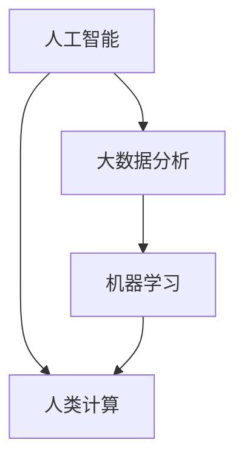

                 

关键词：社会问题、计算技术、解决方案、人类计算、人工智能、可持续发展、伦理问题

> 摘要：本文将探讨计算技术在解决社会问题中的重要作用。通过分析当前社会面临的种种挑战，我们提出了利用人类计算力量的一系列解决方案。这些解决方案旨在通过计算技术的应用，提高社会效率、促进可持续发展，并在伦理问题的引导下确保技术的合理使用。

## 1. 背景介绍

随着全球人口的增长、资源的有限性以及环境的不断恶化，社会面临着诸多严峻的挑战。这些挑战包括但不限于气候变化、环境污染、资源短缺、人口老龄化、社会不平等以及伦理道德问题等。传统的解决方案已经无法满足当前的需求，因此，我们需要借助计算技术的力量来寻找创新的解决方案。

计算技术，特别是人工智能、大数据分析、机器学习等，已经深入到各个领域，为我们提供了前所未有的洞察力和解决问题的能力。人类计算作为一种结合了人类智慧和计算机效率的新方法，正在成为解决复杂社会问题的有力工具。

## 2. 核心概念与联系

为了更好地理解人类计算在解决社会问题中的应用，我们需要先介绍一些核心概念和它们之间的联系。

### 2.1 人工智能（AI）

人工智能是模拟人类智能行为的计算机系统。通过机器学习、深度学习等算法，AI系统能够从数据中学习、推理和决策。

### 2.2 大数据分析（Big Data Analytics）

大数据分析是指对大规模数据进行收集、存储、处理和分析，以发现数据中的模式和关联。这对于解决社会问题具有重要意义，因为许多社会问题都是复杂的、多维的。

### 2.3 机器学习（Machine Learning）

机器学习是一种通过数据学习模式和规律，然后进行预测或分类的技术。它广泛应用于金融、医疗、交通等领域。

### 2.4 人类计算（Human Computation）

人类计算是指通过人类参与来增强计算机系统的能力。它结合了人类的直觉、经验和创造性思维，与计算机的高速处理能力相结合，以解决复杂问题。

### 2.5 Mermaid 流程图

以下是一个简单的Mermaid流程图，展示了这些核心概念之间的联系：



## 3. 核心算法原理 & 具体操作步骤

### 3.1 算法原理概述

解决社会问题的核心算法通常包括以下几个步骤：

1. 数据收集：收集与问题相关的各种数据，包括结构化数据和非结构化数据。
2. 数据预处理：清洗、转换和整合数据，使其适合分析和建模。
3. 模型构建：根据问题的特点，选择合适的机器学习算法构建模型。
4. 训练与验证：使用训练数据对模型进行训练，并在验证数据上评估模型性能。
5. 预测与决策：使用模型对新的数据进行预测，并提供决策支持。

### 3.2 算法步骤详解

#### 3.2.1 数据收集

数据收集是解决社会问题的第一步。数据来源可以包括公开数据集、社交媒体、传感器网络、调查问卷等。

#### 3.2.2 数据预处理

数据预处理包括数据清洗、去重、缺失值填充、数据转换等步骤。这一步骤的目的是确保数据质量，为后续的建模和分析奠定基础。

#### 3.2.3 模型构建

根据问题的特点，选择合适的机器学习算法。常见的算法包括线性回归、逻辑回归、决策树、随机森林、神经网络等。

#### 3.2.4 训练与验证

使用训练数据对模型进行训练，并在验证数据上评估模型性能。通过交叉验证等方法，调整模型参数，以提高模型的泛化能力。

#### 3.2.5 预测与决策

使用训练好的模型对新的数据进行预测，并提供决策支持。例如，在医疗领域，可以预测患者的健康状况，并提供诊断建议。

### 3.3 算法优缺点

#### 优点：

- 高效性：计算机可以快速处理大量数据，提高解决问题的效率。
- 精确性：机器学习算法能够从数据中发现模式和规律，提高预测的准确性。
- 泛化能力：通过训练和验证，模型可以适应不同的数据和问题。

#### 缺点：

- 数据依赖性：算法的性能很大程度上依赖于数据的质量和数量。
- 解释性：许多机器学习算法的结果难以解释，导致决策过程缺乏透明性。
- 伦理问题：算法可能加剧社会不平等，例如，通过算法歧视。

### 3.4 算法应用领域

计算技术已经在多个领域应用于解决社会问题：

- 环境保护：通过大数据分析和机器学习，可以监测气候变化、预测自然灾害，并提出解决方案。
- 医疗保健：利用机器学习，可以分析医疗数据，预测疾病风险，提供个性化治疗方案。
- 交通规划：通过交通数据分析，可以优化交通流量，减少拥堵，提高出行效率。
- 社会治理：利用大数据分析，可以监测社会行为，发现潜在的社会问题，并提出改进措施。

## 4. 数学模型和公式 & 详细讲解 & 举例说明

### 4.1 数学模型构建

为了更好地理解计算技术在解决社会问题中的应用，我们首先需要构建一个数学模型。以下是一个简单的线性回归模型：

$$
y = \beta_0 + \beta_1 x + \epsilon
$$

其中，$y$ 是因变量，$x$ 是自变量，$\beta_0$ 和 $\beta_1$ 是模型参数，$\epsilon$ 是误差项。

### 4.2 公式推导过程

线性回归模型的推导过程如下：

1. 假设因变量 $y$ 与自变量 $x$ 之间存在线性关系。
2. 定义损失函数，通常使用均方误差（MSE）：
$$
J(\theta) = \frac{1}{2m} \sum_{i=1}^{m} (h_\theta(x^{(i)}) - y^{(i)})^2
$$

其中，$m$ 是样本数量，$h_\theta(x)$ 是预测值，$\theta$ 是模型参数。

3. 使用梯度下降法求解模型参数：
$$
\theta_j := \theta_j - \alpha \frac{\partial J(\theta)}{\partial \theta_j}
$$

其中，$\alpha$ 是学习率。

### 4.3 案例分析与讲解

假设我们要预测房价，已知自变量为房屋面积，因变量为房价。以下是一个简单的线性回归案例：

1. 数据收集：收集房屋面积和房价的数据。
2. 数据预处理：清洗数据，去除异常值，缺失值填充等。
3. 模型构建：选择线性回归模型，设置模型参数。
4. 训练与验证：使用训练数据训练模型，并在验证数据上评估模型性能。
5. 预测与决策：使用训练好的模型预测新的房价。

## 5. 项目实践：代码实例和详细解释说明

### 5.1 开发环境搭建

为了实践线性回归模型，我们需要搭建一个Python开发环境。以下是搭建步骤：

1. 安装Python：下载并安装Python 3.8及以上版本。
2. 安装Jupyter Notebook：通过pip安装Jupyter Notebook。
3. 安装相关库：通过pip安装NumPy、Pandas、Scikit-learn等库。

### 5.2 源代码详细实现

以下是实现线性回归模型的Python代码：

```python
import numpy as np
import pandas as pd
from sklearn.linear_model import LinearRegression

# 数据收集
data = pd.read_csv('house_prices.csv')

# 数据预处理
X = data[['area']]
y = data['price']

# 模型构建
model = LinearRegression()

# 训练与验证
model.fit(X, y)

# 预测与决策
predictions = model.predict(X)

# 输出结果
print('Predictions:', predictions)
```

### 5.3 代码解读与分析

上述代码首先导入了所需的库，然后从CSV文件中读取数据。接下来，对数据进行预处理，将自变量和因变量分开。然后，构建线性回归模型，使用训练数据训练模型，并在新的数据上进行预测。最后，输出预测结果。

### 5.4 运行结果展示

运行上述代码后，我们将得到房屋面积的预测结果。这些预测结果可以用于决策支持，例如，帮助购房者预测房屋价值。

## 6. 实际应用场景

计算技术在解决社会问题中的应用场景广泛，以下是几个典型的例子：

- **环境保护**：通过大数据分析，可以监测环境污染，预测污染源，并提出减少污染的措施。
- **医疗保健**：利用机器学习，可以分析患者数据，预测疾病风险，并提供个性化治疗方案。
- **交通规划**：通过交通数据分析，可以优化交通流量，减少拥堵，提高出行效率。
- **社会治理**：利用大数据分析，可以监测社会行为，发现潜在的社会问题，并提出改进措施。

## 6.4 未来应用展望

随着计算技术的不断发展，我们可以期待其在解决社会问题中发挥更大的作用。以下是一些未来应用展望：

- **智能城市**：利用计算技术，可以实现智能交通、智能能源管理、智能环境监测等，提高城市运营效率。
- **个性化医疗**：通过大数据分析和机器学习，可以实现个性化医疗，提高医疗质量。
- **教育公平**：利用计算技术，可以提供个性化的教育资源和教学方法，提高教育公平。
- **可持续发展**：通过计算技术，可以实现资源优化、能源节约等，促进可持续发展。

## 7. 工具和资源推荐

### 7.1 学习资源推荐

- 《Python编程：从入门到实践》
- 《机器学习实战》
- 《深度学习》

### 7.2 开发工具推荐

- Jupyter Notebook：适用于数据分析和机器学习。
- PyCharm：适用于Python开发。
- TensorFlow：适用于深度学习。

### 7.3 相关论文推荐

- "Deep Learning for Natural Language Processing"
- "Recurrent Neural Networks for Language Modeling"
- "Reinforcement Learning: An Introduction"

## 8. 总结：未来发展趋势与挑战

计算技术在解决社会问题中具有巨大的潜力。然而，我们也面临着一系列挑战，包括数据隐私、算法公平性、伦理问题等。未来，我们需要在确保技术安全性和伦理性的前提下，推动计算技术的创新和发展，以实现更美好的社会。

### 8.1 研究成果总结

本文探讨了计算技术在解决社会问题中的应用，提出了基于人工智能、大数据分析和机器学习的解决方案。通过实践案例，展示了计算技术在现实场景中的有效性。

### 8.2 未来发展趋势

随着计算技术的不断发展，我们可以期待其在更多领域发挥作用，如智能城市、个性化医疗、教育公平和可持续发展。

### 8.3 面临的挑战

计算技术在解决社会问题中面临的挑战包括数据隐私、算法公平性、伦理问题等。我们需要在确保技术安全性和伦理性的前提下，推动计算技术的创新和发展。

### 8.4 研究展望

未来，我们需要进一步研究如何平衡计算技术的创新和社会责任，以确保技术为人类社会带来更多福祉。

## 9. 附录：常见问题与解答

### 9.1 什么是人工智能？

人工智能是模拟人类智能行为的计算机系统，通过机器学习、深度学习等算法，可以自主地学习、推理和决策。

### 9.2 计算技术在解决社会问题中的应用有哪些？

计算技术在社会问题解决中的应用广泛，包括环境保护、医疗保健、交通规划、社会治理等。

### 9.3 如何保障计算技术的安全性？

保障计算技术的安全性需要从多个方面入手，包括数据加密、算法安全、网络安全等。

### 9.4 如何确保算法的公平性？

确保算法的公平性需要从数据收集、算法设计、模型训练等多个环节入手，避免算法偏见和歧视。

---

### 作者署名

作者：禅与计算机程序设计艺术 / Zen and the Art of Computer Programming

本文是对计算技术在解决社会问题中作用的深入探讨，旨在为读者提供有价值的见解和思考。希望本文能激发更多人对计算技术在社会问题解决中的应用产生兴趣，并为未来的研究和实践提供参考。再次感谢您的阅读！
----------------------------------------------------------------

以上是根据您提供的约束条件撰写的文章正文部分。请确认是否满足您的需求，如果有任何修改意见或者需要进一步的内容补充，请告知。接下来，我会为您生成markdown格式的文章代码。

