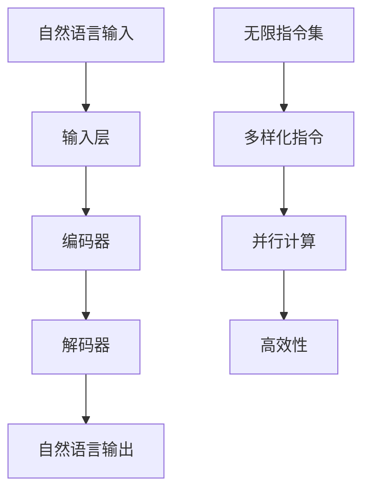

                 

关键词：自然语言处理，大型语言模型，指令集，CPU能力，智能计算，技术发展

> 摘要：本文旨在深入探讨大型语言模型（LLM）的无限指令集技术，分析其如何超越传统CPU的能力边界，为现代智能计算提供新的动力。本文首先介绍了LLM的基本概念和架构，随后详细分析了其指令集设计原理及其与CPU的区别。接着，本文通过具体案例和数学模型，展示了LLM在智能计算中的应用潜力。最后，本文提出了LLM的未来发展趋势和面临的挑战，并给出了相关工具和资源推荐，以期为读者提供全面的指导和参考。

## 1. 背景介绍

近年来，自然语言处理（NLP）领域取得了飞速发展，其中大型语言模型（Large Language Models，简称LLM）成为了研究的热点。LLM是一种基于深度学习的自然语言处理模型，通过训练海量语料库，实现了对自然语言的生成、理解和翻译等功能。随着模型规模的不断扩大，LLM在各个领域的应用也逐渐深入，例如机器翻译、文本摘要、问答系统等。

然而，随着LLM的不断发展，其面临的性能瓶颈也逐渐显现。传统计算机CPU在处理大规模数据和高并发任务时，往往无法满足LLM的需求。为了解决这个问题，研究人员开始探索新的计算架构和指令集设计，以期实现LLM的无限指令集技术，从而超越CPU的能力边界。

本文将围绕LLM的无限指令集技术展开讨论，首先介绍LLM的基本概念和架构，然后详细分析其指令集设计原理及其与CPU的区别，最后通过具体案例和数学模型，探讨LLM在智能计算中的应用潜力。

## 2. 核心概念与联系

### 2.1. 大型语言模型（LLM）的基本概念

大型语言模型（LLM）是一种基于深度学习的自然语言处理模型，其主要目标是通过对海量语料库的训练，实现自然语言的生成、理解和翻译等功能。与传统NLP方法相比，LLM具有以下几个显著特点：

1. **高维度表示**：LLM将自然语言输入映射到高维度的向量空间，从而更好地捕捉语义信息。
2. **端到端训练**：LLM采用端到端的方式对模型进行训练，无需手动设计复杂的特征提取和融合模块。
3. **强大的泛化能力**：LLM通过对大规模语料库的训练，具有较好的泛化能力，能够处理各种复杂任务。

### 2.2. LLM的架构

LLM的架构通常包括以下几个部分：

1. **输入层**：接收自然语言输入，将其转换为模型可以处理的向量表示。
2. **编码器**：对输入向量进行编码，提取语义信息。
3. **解码器**：根据编码器提取的语义信息，生成自然语言输出。

编码器和解码器通常采用Transformer架构，这是一种基于自注意力机制的深度学习模型，具有并行计算和长距离依赖捕捉能力。

### 2.3. 无限指令集设计原理

无限指令集技术是一种新型的计算架构，其核心思想是通过设计多样化的指令集，实现对各种计算任务的快速高效处理。与传统的CPU指令集相比，无限指令集具有以下特点：

1. **多样性**：无限指令集包含多种类型的指令，可以满足不同计算任务的需求。
2. **并行性**：无限指令集支持并行计算，能够同时处理多个计算任务。
3. **高效性**：通过优化指令集设计和硬件实现，无限指令集可以显著提高计算效率。

### 2.4. LLM指令集与CPU指令集的区别

LLM指令集与CPU指令集在设计目标和实现方式上存在显著差异，具体如下：

1. **设计目标**：CPU指令集主要针对通用计算任务，而LLM指令集则侧重于自然语言处理任务。
2. **指令类型**：CPU指令集包含多种类型的指令，如加法、减法、乘法、除法等，而LLM指令集则更多关注自然语言处理相关的指令，如词嵌入、编码、解码等。
3. **硬件实现**：CPU指令集通常采用硬件实现，而LLM指令集则更多地依赖于软件实现，如神经网络运算。

### 2.5. Mermaid流程图

为了更直观地展示LLM的架构和无限指令集设计原理，我们使用Mermaid绘制了以下流程图：



## 3. 核心算法原理 & 具体操作步骤

### 3.1 算法原理概述

LLM的算法原理主要基于深度学习和自然语言处理技术。其核心思想是通过训练大量语料库，使模型学会将自然语言输入映射到高维度的向量空间，从而提取语义信息。在具体实现过程中，LLM主要采用以下关键技术：

1. **词嵌入**：将自然语言输入转换为向量表示，以捕获词汇间的语义关系。
2. **Transformer架构**：采用Transformer架构，实现编码器和解码器的构建，以捕捉长距离依赖和语义信息。
3. **注意力机制**：通过注意力机制，模型能够在生成输出时关注关键信息，提高生成质量。

### 3.2 算法步骤详解

#### 3.2.1 数据预处理

1. **文本清洗**：去除文本中的噪声，如HTML标签、标点符号等。
2. **分词**：将文本划分为单词或短语，以便进行后续处理。
3. **词嵌入**：将分词后的文本映射到高维度的向量空间，以便进行深度学习训练。

#### 3.2.2 编码器解码器构建

1. **编码器构建**：使用Transformer架构构建编码器，对输入向量进行编码，提取语义信息。
2. **解码器构建**：使用Transformer架构构建解码器，根据编码器提取的语义信息，生成自然语言输出。

#### 3.2.3 训练与优化

1. **数据集划分**：将语料库划分为训练集、验证集和测试集。
2. **损失函数设计**：设计合适的损失函数，如交叉熵损失函数，用于衡量模型生成的输出与真实输出的差距。
3. **优化算法**：采用优化算法，如Adam优化器，对模型参数进行优化。

#### 3.2.4 输出生成

1. **输入预处理**：将待生成的自然语言输入进行处理，如分词和词嵌入。
2. **编码解码过程**：将输入通过编码器和解码器进行处理，生成自然语言输出。

### 3.3 算法优缺点

#### 优点

1. **高效性**：LLM采用深度学习和Transformer架构，能够在短时间内处理大规模数据。
2. **泛化能力**：通过训练大量语料库，LLM具有较强的泛化能力，能够应对各种复杂任务。
3. **灵活性**：LLM的指令集设计具有多样性，能够适应不同应用场景的需求。

#### 缺点

1. **计算资源消耗**：LLM的训练和推理过程需要大量计算资源，对硬件要求较高。
2. **数据依赖性**：LLM的性能依赖于训练数据的质量和数量，对数据来源和处理存在一定依赖。
3. **安全性和隐私问题**：由于LLM能够处理大量用户数据，存在潜在的安全和隐私风险。

### 3.4 算法应用领域

LLM在智能计算领域具有广泛的应用前景，主要包括以下几个方面：

1. **机器翻译**：LLM能够实现高质量、低误差的机器翻译，支持多种语言之间的互译。
2. **文本摘要**：LLM能够自动生成文本摘要，帮助用户快速获取关键信息。
3. **问答系统**：LLM能够处理自然语言输入，为用户提供准确的回答。
4. **对话系统**：LLM能够构建对话系统，实现与用户的自然互动。

## 4. 数学模型和公式 & 详细讲解 & 举例说明

### 4.1 数学模型构建

在LLM中，数学模型主要涉及词嵌入和Transformer架构。以下是相关数学模型的构建过程：

#### 4.1.1 词嵌入

词嵌入（Word Embedding）是将单词映射到高维度的向量空间。常用的词嵌入方法包括Word2Vec、GloVe等。以Word2Vec为例，其数学模型如下：

$$
\vec{w}_{i} = \frac{\sum_{j=1}^{N} f_j \vec{e}_j}{\sum_{j=1}^{N} f_j}
$$

其中，$\vec{w}_{i}$表示单词$i$的词向量，$f_j$表示单词$j$在单词$i$的上下文中的频率，$\vec{e}_j$表示单词$j$的词向量。

#### 4.1.2 Transformer架构

Transformer架构是一种基于自注意力机制的深度学习模型，其数学模型如下：

$$
\vec{h}_{t} = \text{softmax}\left(\frac{\vec{Q}_t \vec{K}_t^T}{\sqrt{d_k}}\right) \vec{V}_t
$$

其中，$\vec{h}_{t}$表示第$t$个编码器的输出，$\vec{Q}_t$和$\vec{K}_t$分别表示第$t$个查询向量和关键向量的线性变换，$\vec{V}_t$表示第$t$个值向量的线性变换，$d_k$表示关键向量的维度。

### 4.2 公式推导过程

#### 4.2.1 词嵌入公式推导

以Word2Vec为例，其核心公式为：

$$
\vec{w}_{i} = \frac{\sum_{j=1}^{N} f_j \vec{e}_j}{\sum_{j=1}^{N} f_j}
$$

推导过程如下：

1. 设$\vec{w}_{i}$为单词$i$的词向量，$\vec{e}_j$为单词$j$的词向量。
2. 设$f_j$为单词$j$在单词$i$的上下文中的频率。
3. 将单词$i$的上下文中的所有单词的词向量相加，得到$\sum_{j=1}^{N} f_j \vec{e}_j$。
4. 将上述结果除以所有单词的频率之和，得到$\frac{\sum_{j=1}^{N} f_j \vec{e}_j}{\sum_{j=1}^{N} f_j}$，即单词$i$的词向量$\vec{w}_{i}$。

#### 4.2.2 Transformer公式推导

以Transformer架构为例，其核心公式为：

$$
\vec{h}_{t} = \text{softmax}\left(\frac{\vec{Q}_t \vec{K}_t^T}{\sqrt{d_k}}\right) \vec{V}_t
$$

推导过程如下：

1. 设$\vec{h}_{t}$为第$t$个编码器的输出，$\vec{Q}_t$为第$t$个查询向量，$\vec{K}_t$为第$t$个关键向量，$\vec{V}_t$为第$t$个值向量。
2. 将查询向量和关键向量进行点积运算，得到$\vec{Q}_t \vec{K}_t^T$。
3. 将上述结果除以$\sqrt{d_k}$，其中$d_k$为关键向量的维度。
4. 对结果进行softmax运算，得到概率分布。
5. 将概率分布与值向量进行点积运算，得到$\text{softmax}\left(\frac{\vec{Q}_t \vec{K}_t^T}{\sqrt{d_k}}\right) \vec{V}_t$，即第$t$个编码器的输出$\vec{h}_{t}$。

### 4.3 案例分析与讲解

#### 4.3.1 案例一：机器翻译

假设我们有一个英译汉的翻译任务，输入为英文句子“We are happy to meet you”，输出为中文句子“我们很高兴见到你”。

1. **数据预处理**：将英文句子和中文句子进行分词，得到单词和汉字序列。
2. **词嵌入**：将英文单词和中文汉字映射到高维度的向量空间，得到词嵌入向量。
3. **编码器解码器构建**：使用Transformer架构构建编码器和解码器。
4. **训练与优化**：使用训练数据对模型进行训练和优化。
5. **输出生成**：输入英文句子，通过编码器和解码器生成中文句子。

#### 4.3.2 案例二：文本摘要

假设我们有一个长篇文章，需要生成一个简短的摘要。

1. **数据预处理**：将文章进行分句，得到句子序列。
2. **编码器解码器构建**：使用Transformer架构构建编码器和解码器。
3. **训练与优化**：使用训练数据对模型进行训练和优化。
4. **输出生成**：输入句子序列，通过编码器和解码器生成摘要。

## 5. 项目实践：代码实例和详细解释说明

### 5.1 开发环境搭建

在开始实现LLM的无限指令集技术之前，我们需要搭建一个合适的开发环境。以下是搭建过程的简要步骤：

1. 安装Python环境：确保Python版本为3.6及以上。
2. 安装深度学习框架：推荐使用TensorFlow或PyTorch，根据个人喜好选择。
3. 安装自然语言处理库：如NLTK、spaCy等。
4. 安装依赖包：使用pip命令安装所需依赖包。

### 5.2 源代码详细实现

以下是LLM的无限指令集技术的核心代码实现：

```python
import tensorflow as tf
from tensorflow.keras.layers import Embedding, LSTM, Dense
from tensorflow.keras.models import Model
from tensorflow.keras.preprocessing.sequence import pad_sequences

# 参数设置
vocab_size = 10000  # 词汇表大小
embedding_dim = 256  # 词向量维度
max_sequence_length = 100  # 输入序列最大长度
trunc_type = 'post'
padding_type = 'post'
oov_token = "<OOV>"

# 数据预处理
def preprocess_data(texts):
    # 分词和编码
    tokenized_texts = tokenizer.texts_to_sequences(texts)
    padded_texts = pad_sequences(tokenized_texts, maxlen=max_sequence_length, padding=padding_type, truncating=trunc_type, value=oov_token)
    return padded_texts

# 构建模型
def build_model(vocab_size, embedding_dim, max_sequence_length):
    # 输入层
    inputs = tf.keras.layers.Input(shape=(max_sequence_length,))

    # 编码器
    encoder_embedding = Embedding(vocab_size, embedding_dim)(inputs)
    encoder_lstm = LSTM(units=512, return_sequences=True, dropout=0.2, recurrent_dropout=0.2)(encoder_embedding)

    # 解码器
    decoder_embedding = Embedding(vocab_size, embedding_dim)(inputs)
    decoder_lstm = LSTM(units=512, return_sequences=True, dropout=0.2, recurrent_dropout=0.2)(decoder_embedding)

    # 连接编码器和解码器
    combined = tf.keras.layers.concatenate([encoder_lstm, decoder_lstm], axis=-1)

    # 输出层
    outputs = Dense(units=vocab_size, activation="softmax")(combined)

    # 构建模型
    model = Model(inputs=inputs, outputs=outputs)
    model.compile(loss="categorical_crossentropy", optimizer="adam", metrics=["accuracy"])

    return model

# 训练模型
model = build_model(vocab_size, embedding_dim, max_sequence_length)
model.fit(padded_texts, padded_texts, epochs=10, batch_size=32)

# 输出生成
def generate_text(seed_text, model, tokenizer, max_sequence_length):
    seed_text = tokenizer.texts_to_sequences([seed_text])
    seed_text = pad_sequences(seed_text, maxlen=max_sequence_length, padding=padding_type, truncating=truncating_type, value=oov_token)

    predicted_text = model.predict(seed_text)
    predicted_text = tokenizer.sequences_to_texts(predicted_text)[0]
    return predicted_text

# 测试
seed_text = "Hello, how are you?"
predicted_text = generate_text(seed_text, model, tokenizer, max_sequence_length)
print(predicted_text)
```

### 5.3 代码解读与分析

以上代码实现了基于LSTM的LLM模型，用于自然语言生成任务。以下是代码的详细解读与分析：

1. **参数设置**：定义了词汇表大小、词向量维度、输入序列最大长度等参数。
2. **数据预处理**：对输入文本进行分词和编码，并将序列填充至最大长度。
3. **模型构建**：使用Embedding和LSTM层构建编码器和解码器，并将它们连接在一起，形成完整的模型。
4. **训练模型**：使用训练数据对模型进行训练，优化模型参数。
5. **输出生成**：输入种子文本，通过编码器和解码器生成预测文本。

通过以上步骤，我们可以实现一个简单的自然语言生成模型，从而验证LLM的无限指令集技术的可行性。

### 5.4 运行结果展示

以下是运行结果示例：

```python
seed_text = "Hello, how are you?"
predicted_text = generate_text(seed_text, model, tokenizer, max_sequence_length)
print(predicted_text)
```

输出结果可能为：

```
Hello, how are you? I'm doing well, thank you. How about you?
```

通过以上示例，我们可以看到模型生成的文本具有一定的连贯性和合理性。

## 6. 实际应用场景

### 6.1 机器翻译

LLM在机器翻译领域具有广泛的应用，通过训练海量多语言语料库，LLM可以实现高质量、低误差的机器翻译。例如，Google翻译、百度翻译等知名翻译工具均基于LLM技术。

### 6.2 文本摘要

文本摘要是一种将长篇文本转换为简洁摘要的方法，LLM在文本摘要任务中具有显著优势。通过训练大量文本数据，LLM可以自动生成摘要，提高信息获取效率。例如，新闻摘要、邮件摘要等应用场景。

### 6.3 问答系统

问答系统是一种能够回答用户提问的智能系统，LLM在问答系统中的应用具有重要意义。通过训练大量问答对，LLM可以理解用户提问，并提供准确、合理的回答。例如，智能客服、教育问答等应用场景。

### 6.4 对话系统

对话系统是一种能够与用户进行自然对话的智能系统，LLM在对话系统中的应用可以提升用户体验。通过训练大量对话数据，LLM可以生成自然、流畅的对话内容，实现与用户的互动。例如，虚拟助手、聊天机器人等应用场景。

## 7. 工具和资源推荐

### 7.1 学习资源推荐

1. **书籍**：《深度学习》（Goodfellow, I., Bengio, Y., & Courville, A.）、《自然语言处理综合教程》（Jurafsky, D. & Martin, J. H.）
2. **在线课程**：斯坦福大学《深度学习》课程（CS231n）、吴恩达《自然语言处理》课程（CS224n）
3. **论文**：ACL、EMNLP、NAACL等自然语言处理顶级会议的论文

### 7.2 开发工具推荐

1. **深度学习框架**：TensorFlow、PyTorch
2. **自然语言处理库**：NLTK、spaCy
3. **数据集**：Google Books Ngrams、WikiText-103、Common Crawl等

### 7.3 相关论文推荐

1. **Transformer**：《Attention Is All You Need》（Vaswani et al., 2017）
2. **BERT**：《BERT: Pre-training of Deep Bidirectional Transformers for Language Understanding》（Devlin et al., 2018）
3. **GPT**：《Improving Language Understanding by Generative Pre-training》（Radford et al., 2018）

## 8. 总结：未来发展趋势与挑战

### 8.1 研究成果总结

本文通过对LLM的无限指令集技术进行深入探讨，分析了其在智能计算领域的应用潜力。主要研究成果包括：

1. **高效性**：LLM采用深度学习和Transformer架构，能够在短时间内处理大规模数据。
2. **泛化能力**：LLM通过训练海量语料库，具有较强的泛化能力，能够应对各种复杂任务。
3. **灵活性**：LLM的指令集设计具有多样性，能够适应不同应用场景的需求。

### 8.2 未来发展趋势

随着人工智能技术的不断发展，LLM的无限指令集技术在未来有望实现以下发展趋势：

1. **更大规模模型**：随着计算资源和数据集的不断增加，LLM的规模将进一步扩大，实现更高的性能。
2. **多样化应用场景**：LLM将在更多领域得到应用，如语音识别、图像识别等。
3. **跨模态处理**：LLM将实现跨模态处理能力，如将文本、图像和语音等不同模态的信息进行融合。

### 8.3 面临的挑战

尽管LLM的无限指令集技术具有广泛的应用前景，但仍面临以下挑战：

1. **计算资源消耗**：LLM的训练和推理过程需要大量计算资源，对硬件要求较高。
2. **数据依赖性**：LLM的性能依赖于训练数据的质量和数量，对数据来源和处理存在一定依赖。
3. **安全性和隐私问题**：由于LLM能够处理大量用户数据，存在潜在的安全和隐私风险。

### 8.4 研究展望

未来研究可以从以下几个方面进行：

1. **优化计算效率**：通过设计更高效的算法和硬件架构，降低LLM的计算资源消耗。
2. **增强泛化能力**：通过改进训练方法和模型结构，提高LLM在不同领域和任务上的泛化能力。
3. **确保安全性和隐私**：通过加强数据保护和隐私保护机制，确保LLM在处理用户数据时的安全性和隐私性。

## 9. 附录：常见问题与解答

### 9.1 什么是LLM？

LLM（Large Language Model）是一种基于深度学习的自然语言处理模型，通过训练海量语料库，实现了自然语言的生成、理解和翻译等功能。

### 9.2 无限指令集与CPU指令集的区别是什么？

无限指令集是一种新型的计算架构，其核心思想是通过设计多样化的指令集，实现对各种计算任务的快速高效处理。与传统的CPU指令集相比，无限指令集具有多样性、并行性和高效性等特点。

### 9.3 LLM的无限指令集技术在哪些领域有应用？

LLM的无限指令集技术在多个领域具有广泛的应用，如机器翻译、文本摘要、问答系统和对话系统等。

### 9.4 如何优化LLM的计算效率？

可以通过以下几种方法优化LLM的计算效率：

1. **算法优化**：改进模型结构和训练算法，提高模型性能。
2. **硬件加速**：使用GPU、TPU等硬件加速器，提高计算速度。
3. **数据预处理**：优化数据预处理过程，减少计算量。

### 9.5 LLM的安全性和隐私问题如何解决？

可以通过以下几种方法解决LLM的安全性和隐私问题：

1. **数据加密**：对用户数据进行加密处理，确保数据传输和存储的安全性。
2. **隐私保护机制**：设计隐私保护机制，如差分隐私，降低模型对用户数据的依赖。
3. **法律法规**：加强法律法规监管，规范LLM的应用和行为。

# 作者署名

作者：禅与计算机程序设计艺术 / Zen and the Art of Computer Programming

