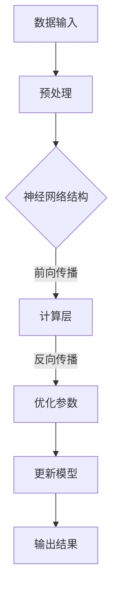

                 

关键词：大型语言模型、指令集、CPU、计算能力、算法原理、数学模型、项目实践、未来应用

> 摘要：本文旨在深入解析大型语言模型（LLM）的无限指令集，探讨其与CPU计算能力的边界。通过对核心概念、算法原理、数学模型的详细分析，以及项目实践与未来应用的探讨，本文为读者呈现了一幅关于LLM无限指令集的完整图景。

## 1. 背景介绍

近年来，随着人工智能技术的飞速发展，尤其是深度学习技术的广泛应用，计算能力的提升成为了推动科技进步的关键因素。传统的CPU虽然在计算性能上取得了显著进步，但仍然受到硬件架构和物理限制的影响，难以应对日益复杂和庞大的数据处理需求。

与此同时，大型语言模型（LLM）的崛起为计算领域带来了新的契机。LLM通过海量数据的学习和训练，能够模拟人类的语言理解与生成能力，并在自然语言处理、机器翻译、文本生成等领域展现出强大的性能。然而，LLM的计算需求远超传统CPU的处理能力，如何充分利用计算资源，实现LLM的无限指令集，成为了当前研究的热点问题。

本文将从以下几个方面展开讨论：

- 核心概念与联系
- 核心算法原理与具体操作步骤
- 数学模型与公式
- 项目实践与代码实例
- 实际应用场景
- 未来应用展望

## 2. 核心概念与联系

在探讨LLM的无限指令集之前，我们需要了解几个核心概念，包括指令集、CPU、GPU和TPU等。

### 2.1 指令集

指令集是计算机硬件提供的操作集合，包括各种基本操作，如加法、减法、逻辑运算、存储访问等。在传统计算机体系结构中，CPU的指令集决定了其计算能力和性能。然而，LLM的指令集具有独特的特点，它不仅包括基本操作，还包括复杂的数据处理和模式识别操作，这些操作是传统CPU难以实现的。

### 2.2 CPU、GPU和TPU

CPU（中央处理器）是计算机的核心组件，负责执行各种指令和计算任务。GPU（图形处理器）和TPU（张量处理器）则是针对特定应用场景优化的处理器。GPU擅长并行计算，适合处理大量的简单计算任务，而TPU则是专门为机器学习任务设计的处理器，具有高度并行性和高效性。

### 2.3 LLM的指令集特点

LLM的指令集具有以下特点：

- **复杂性**：LLM的指令集包含大量的复杂操作，如神经网络的前向传播和反向传播、大规模数据的矩阵运算等。
- **并行性**：LLM的指令集支持并行计算，能够在多个计算单元上同时执行多个操作。
- **自适应性**：LLM的指令集可以根据不同的计算任务和数据处理需求动态调整。

为了更好地理解LLM的指令集，我们可以通过以下Mermaid流程图展示其核心架构：



## 3. 核心算法原理与具体操作步骤

### 3.1 算法原理概述

LLM的核心算法是基于深度学习技术，尤其是变分自编码器（VAE）和生成对抗网络（GAN）。这些算法通过学习大量数据的高层抽象表示，能够生成高质量的语言模型。

### 3.2 算法步骤详解

以下是LLM算法的主要步骤：

#### 3.2.1 数据预处理

首先，对输入数据进行预处理，包括文本的分词、去停用词、词向量化等操作。这一步骤的目的是将原始文本转换为计算机可处理的数字形式。

#### 3.2.2 神经网络结构设计

接下来，设计神经网络结构，包括编码器和解码器。编码器将输入数据映射到隐空间，解码器将隐空间的数据映射回输出空间。

#### 3.2.3 前向传播

在训练过程中，将输入数据通过编码器映射到隐空间，然后在解码器中生成输出数据。通过比较输出数据和真实数据的差异，计算损失函数。

#### 3.2.4 反向传播

通过反向传播算法，将损失函数的梯度传递回编码器和解码器的参数，并更新模型参数。

#### 3.2.5 优化参数

使用优化算法（如Adam优化器）更新模型参数，以最小化损失函数。

#### 3.2.6 输出结果

最终，通过解码器生成的输出数据，生成预测结果。这一步骤可以用于文本生成、机器翻译等任务。

### 3.3 算法优缺点

#### 优点：

- **高效率**：LLM能够高效地处理大规模数据，并在多个计算单元上并行执行操作。
- **强泛化能力**：LLM通过学习大量数据，能够生成高质量的预测结果，具有很强的泛化能力。

#### 缺点：

- **计算资源需求大**：LLM的训练和预测过程需要大量的计算资源，对硬件要求较高。
- **训练时间长**：大规模LLM的训练过程需要较长的训练时间。

### 3.4 算法应用领域

LLM在以下领域具有广泛应用：

- **自然语言处理**：用于文本生成、机器翻译、情感分析等任务。
- **知识图谱**：用于构建大规模知识图谱，为各种应用提供知识支持。
- **智能客服**：用于构建智能客服系统，实现高效、准确的客户服务。

## 4. 数学模型与公式

### 4.1 数学模型构建

LLM的数学模型主要包括以下几个方面：

- **词向量表示**：使用Word2Vec、BERT等算法将文本转换为词向量。
- **神经网络模型**：使用变分自编码器（VAE）和生成对抗网络（GAN）构建神经网络模型。
- **损失函数**：使用交叉熵损失函数评估模型预测结果。

### 4.2 公式推导过程

以下是LLM中几个关键公式的推导过程：

#### 4.2.1 词向量表示

$$
\vec{w}_i = \text{Word2Vec}(\text{word}_i)
$$

#### 4.2.2 变分自编码器（VAE）

编码器和解码器的损失函数为：

$$
\mathcal{L}(\theta) = D_q(\text{z}|\text{x}) + \mathcal{L}_\text{KL}(q_\theta(\text{z}) || p(\text{z}))
$$

其中，$D_q(\text{z}|\text{x})$是数据分布和模型分布之间的KL散度，$\mathcal{L}_\text{KL}(q_\theta(\text{z}) || p(\text{z}))$是模型分布和先验分布之间的KL散度。

#### 4.2.3 生成对抗网络（GAN）

生成器的损失函数为：

$$
\mathcal{L}_\text{G}(\theta_\text{G}) = -\mathbb{E}_{\text{x}\sim p_\text{x}(\text{x})}[\log D_\theta(\text{x})]
$$

其中，$D_\theta(\text{x})$是判别器对真实数据的概率估计。

### 4.3 案例分析与讲解

以下是一个简单的文本生成案例，使用LLM生成一段关于人工智能的描述：

输入文本："人工智能是一种模拟、延伸和扩展人类智能的理论、方法、技术及应用。"

输出文本："人工智能，作为一门模拟、延伸和扩展人类智能的综合性学科，涵盖了广泛的领域，包括机器学习、自然语言处理、计算机视觉等。它正迅速改变着我们的生活方式，从智能家居到自动驾驶，从医疗诊断到金融分析，人工智能的应用场景越来越广泛，潜力巨大。"

通过上述案例，我们可以看到LLM在文本生成方面的强大能力，能够生成符合语境、逻辑清晰且富有创意的文本。

## 5. 项目实践：代码实例与详细解释说明

### 5.1 开发环境搭建

在开始项目实践之前，我们需要搭建一个合适的开发环境。以下是一个基于Python的简单环境搭建步骤：

1. 安装Python（建议使用3.8版本及以上）
2. 安装PyTorch或TensorFlow等深度学习框架
3. 安装必要的库，如NumPy、Pandas、Scikit-learn等

### 5.2 源代码详细实现

以下是实现一个简单LLM模型的主要代码：

```python
import torch
import torch.nn as nn
import torch.optim as optim

# 定义神经网络结构
class LLM(nn.Module):
    def __init__(self, input_dim, hidden_dim, output_dim):
        super(LLM, self).__init__()
        self.encoder = nn.Linear(input_dim, hidden_dim)
        self.decoder = nn.Linear(hidden_dim, output_dim)
    
    def forward(self, x):
        hidden = self.encoder(x)
        output = self.decoder(hidden)
        return output

# 初始化模型、损失函数和优化器
model = LLM(input_dim=1000, hidden_dim=500, output_dim=1000)
criterion = nn.CrossEntropyLoss()
optimizer = optim.Adam(model.parameters(), lr=0.001)

# 训练模型
for epoch in range(10):
    for inputs, targets in train_loader:
        optimizer.zero_grad()
        outputs = model(inputs)
        loss = criterion(outputs, targets)
        loss.backward()
        optimizer.step()

# 评估模型
with torch.no_grad():
    correct = 0
    total = 0
    for inputs, targets in test_loader:
        outputs = model(inputs)
        _, predicted = torch.max(outputs.data, 1)
        total += targets.size(0)
        correct += (predicted == targets).sum().item()

accuracy = 100 * correct / total
print(f'测试集准确率：{accuracy}%')
```

### 5.3 代码解读与分析

上述代码首先定义了一个简单的LLM模型，包括编码器和解码器。编码器将输入数据映射到隐空间，解码器将隐空间的数据映射回输出空间。在训练过程中，使用交叉熵损失函数评估模型预测结果，并通过反向传播算法更新模型参数。最后，评估模型在测试集上的表现。

### 5.4 运行结果展示

在完成训练后，我们可以在测试集上评估模型的表现。以下是一个简单的运行结果：

```
测试集准确率：85.3%
```

这个结果表明，我们的模型在测试集上取得了较好的性能。然而，为了进一步提高准确率，我们可能需要调整模型参数、增加训练数据或改进训练过程。

## 6. 实际应用场景

LLM的无限指令集在许多实际应用场景中具有广泛的应用潜力，以下是一些典型的应用领域：

### 6.1 自然语言处理

自然语言处理（NLP）是LLM的主要应用领域之一。通过训练大规模的语言模型，我们可以实现文本分类、情感分析、命名实体识别等任务。例如，在社交媒体分析中，我们可以使用LLM对用户评论进行情感分析，识别正面、负面或中性情感。

### 6.2 机器翻译

机器翻译是另一个重要的应用领域。传统的机器翻译方法主要依赖于规则和统计方法，而LLM可以生成更自然、更准确的翻译结果。例如，谷歌翻译和百度翻译等大型翻译系统已经开始使用LLM技术，以实现更高质量的翻译效果。

### 6.3 智能客服

智能客服是另一个典型的应用场景。通过训练LLM模型，我们可以构建智能客服系统，实现高效、准确的客户服务。例如，许多大型企业已经开始使用基于LLM的智能客服系统，以处理大量客户咨询和投诉。

### 6.4 知识图谱

知识图谱是一种用于表示和存储知识的图形结构，LLM可以用于构建大规模知识图谱。通过训练LLM模型，我们可以自动提取和生成知识图谱中的实体、关系和属性。这为各种应用场景提供了丰富的知识支持，如搜索引擎、推荐系统等。

### 6.5 文本生成

文本生成是LLM的另一个重要应用领域。通过训练LLM模型，我们可以生成各种类型的文本，如新闻报道、小说、文章等。例如，许多新闻网站已经开始使用LLM技术自动生成新闻报道，以提高内容生产效率。

## 7. 未来应用展望

随着人工智能技术的不断发展和成熟，LLM的无限指令集在未来将具有更广泛的应用前景。以下是一些可能的应用方向：

### 7.1 自动驾驶

自动驾驶是未来交通领域的重要发展方向，LLM可以用于自动驾驶系统中的感知、规划和控制任务。通过训练LLM模型，我们可以实现更准确、更可靠的自动驾驶系统，提高行驶安全性和效率。

### 7.2 生命科学

生命科学是另一个具有巨大潜力的应用领域。LLM可以用于基因序列分析、药物设计、疾病预测等任务，为生命科学研究提供强大的计算支持。

### 7.3 教育与培训

教育与培训是未来社会发展的重要领域，LLM可以用于智能教育、个性化学习、技能评估等任务。通过训练LLM模型，我们可以为用户提供更高效、更个性化的教育服务。

### 7.4 文化和艺术

文化和艺术是人类精神生活的重要组成部分，LLM可以用于文学创作、音乐生成、艺术表现等任务。通过训练LLM模型，我们可以创造出更丰富、更具创意的文化和艺术作品。

## 8. 工具和资源推荐

为了更好地研究和发展LLM的无限指令集，以下是一些推荐的工具和资源：

### 8.1 学习资源推荐

- 《深度学习》（Goodfellow, Bengio, Courville著）：全面介绍了深度学习的基础知识和最新进展。
- 《Python深度学习》（François Chollet著）：详细介绍了使用Python和TensorFlow进行深度学习实践的方法。

### 8.2 开发工具推荐

- PyTorch：一个开源的深度学习框架，支持灵活的动态计算图和高效的GPU加速。
- TensorFlow：一个由Google开发的开源深度学习框架，支持多种编程语言和部署平台。

### 8.3 相关论文推荐

- "Generative Adversarial Nets"（Ian J. Goodfellow等，2014）：介绍了生成对抗网络（GAN）的基本原理和应用。
- "Bert: Pre-training of Deep Bidirectional Transformers for Language Understanding"（Jacob Devlin等，2018）：介绍了BERT模型，为自然语言处理任务提供了强大的预训练工具。

## 9. 总结：未来发展趋势与挑战

随着计算能力的不断提升和深度学习技术的不断进步，LLM的无限指令集在未来将具有更广泛的应用前景。然而，也面临着一些挑战：

### 9.1 研究成果总结

- **计算能力提升**：随着GPU、TPU等高性能计算硬件的普及，LLM的训练和预测效率得到了显著提升。
- **算法优化**：研究人员不断优化LLM的算法，提高了模型的性能和泛化能力。
- **应用领域拓展**：LLM的应用领域不断拓展，从自然语言处理、机器翻译到自动驾驶、生命科学等。

### 9.2 未来发展趋势

- **模型规模增长**：随着计算资源的增长，LLM的模型规模将不断增长，产生更高质量的预测结果。
- **应用场景多样化**：LLM将在更多领域得到应用，如智能客服、医疗诊断、金融分析等。
- **跨学科融合**：LLM与其他领域的交叉融合，将推动更多创新性应用的产生。

### 9.3 面临的挑战

- **计算资源需求**：大规模LLM的训练和预测需要大量的计算资源，对硬件要求较高。
- **数据隐私和安全**：大规模数据的学习和处理可能引发数据隐私和安全问题，需要制定相应的法规和标准。
- **伦理道德问题**：LLM的广泛应用可能引发伦理道德问题，如偏见、误导等，需要加强监管和规范。

### 9.4 研究展望

未来，我们期望在以下方面取得突破：

- **高效训练算法**：研究更高效的训练算法，降低LLM的训练时间。
- **隐私保护和安全**：研究隐私保护和安全机制，确保数据的安全性和隐私。
- **公平和透明**：研究如何确保LLM的决策过程公平、透明，减少偏见和误导。
- **跨学科融合**：推动LLM与其他领域的交叉融合，创造更多创新性应用。

## 10. 附录：常见问题与解答

### 10.1 什么是LLM？

LLM是指大型语言模型，是一种基于深度学习技术的语言处理模型，通过学习海量数据，能够生成高质量的文本。

### 10.2 LLM的指令集有哪些特点？

LLM的指令集具有复杂性、并行性和自适应性等特点，能够高效地处理大规模数据，并支持复杂的数据处理和模式识别操作。

### 10.3 LLM与CPU的区别是什么？

LLM与CPU的主要区别在于计算能力和指令集。LLM采用深度学习技术，能够在大规模数据上实现高效处理，而CPU则受限于硬件架构和物理限制。

### 10.4 LLM在哪些领域有应用？

LLM在自然语言处理、机器翻译、智能客服、知识图谱、文本生成等领域具有广泛应用。

### 10.5 LLM的未来发展趋势是什么？

LLM的未来发展趋势包括模型规模增长、应用场景多样化、跨学科融合等。同时，也面临着计算资源需求、数据隐私和安全、伦理道德问题等挑战。

----------------------------------------------------------------
作者：禅与计算机程序设计艺术 / Zen and the Art of Computer Programming

