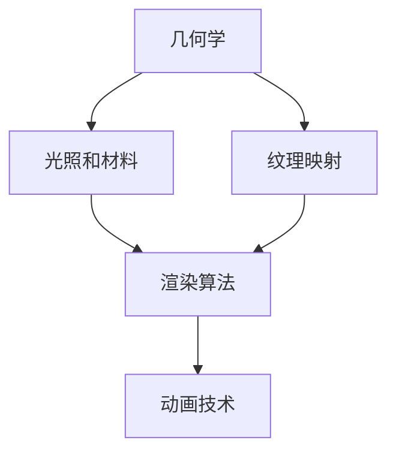
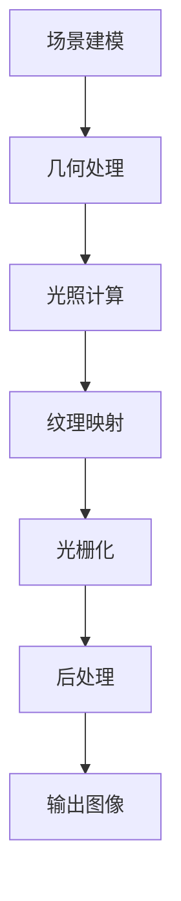

                 

## 1. 背景介绍

计算机图形学是计算机科学中的一个重要分支，它涉及将数学、几何学、物理学和计算机算法结合起来，以生成和处理图像。随着计算机技术的不断发展，计算机图形学在各个领域都得到了广泛的应用，例如娱乐业、医疗领域、工程设计和科学研究等。3D渲染和动画技术是计算机图形学的重要组成部分，它们为我们提供了一个更加真实和互动的视觉体验。

在3D渲染方面，渲染器负责将3D场景转换为2D图像。这个过程包括几何处理、光照计算、纹理映射等。高质量渲染是实现真实感图像的关键，它需要处理复杂的数学和物理问题，如反射、折射、阴影和全局光照等。

动画技术则是通过在时间上连续渲染一系列图像来创建运动的视觉效果。动画可以用于多种用途，从简单的图标动画到复杂的电影特效，它能够增强用户的体验，传达故事和信息。

本文将详细介绍3D渲染和动画技术的基本原理、核心算法、数学模型以及实际应用，帮助读者深入理解这一领域。同时，我们还将探讨未来发展的趋势和面临的挑战。

## 2. 核心概念与联系

要深入理解3D渲染和动画技术，首先需要了解一些核心概念和它们之间的联系。以下是这些核心概念的概述，以及它们在整体架构中的地位和关系。

### 2.1  几何学

几何学是3D渲染和动画的基础，它提供了描述三维空间中对象的方法。基本的几何概念包括点、线、面和体。在3D渲染中，几何处理涉及建模、网格生成和几何变换。这些变换包括平移、旋转和缩放，它们用于创建复杂的场景。

### 2.2  光照和材料

光照和材料是影响渲染质量的重要因素。光照包括环境光、漫反射光、镜面反射光和透射光等。不同的光照模型可以模拟各种环境下的光线效果。材料则决定了物体表面的外观，如金属、塑料、玻璃等。

### 2.3  纹理映射

纹理映射是将二维纹理图像映射到三维对象表面的过程。它能够为物体添加细节和纹理，使其看起来更加真实。纹理映射可以分为平面映射、立方体映射和投影映射等。

### 2.4  渲染算法

渲染算法是将3D场景转换为2D图像的步骤。常用的渲染算法包括光栅化、光线追踪和路径追踪等。这些算法各有优缺点，适用于不同的应用场景。

### 2.5  动画技术

动画技术涉及在时间上连续渲染一系列图像，以创建运动效果。关键帧动画、基于物理的动画和蒙皮动画是常见的动画技术。它们在游戏、影视和虚拟现实等领域有广泛的应用。

### 2.6  Mermaid 流程图

以下是一个Mermaid流程图，展示了这些核心概念和它们之间的联系。



在这个流程图中，几何学作为起点，通过光照和材料的影响，与纹理映射和渲染算法相连。渲染算法最终输出动画效果，形成闭环。

### 2.7  渲染流水线

3D渲染流水线是将3D场景转换为2D图像的一系列步骤。以下是一个典型的渲染流水线流程：



在场景建模阶段，我们创建3D对象的几何模型。接下来，几何处理包括网格生成和几何变换。光照计算涉及计算光线与物体表面的相互作用。纹理映射为物体添加细节和纹理。光栅化是将三维对象转换为二维图像的过程。最后，后处理包括抗锯齿、色彩校正等，以改善图像质量。最终输出图像是渲染过程的最终结果。

通过了解这些核心概念和流程，我们可以更好地理解3D渲染和动画技术的工作原理，为后续的讨论打下基础。

## 3. 核心算法原理 & 具体操作步骤

### 3.1  算法原理概述

3D渲染和动画技术的核心算法包括渲染算法、动画算法和几何处理算法。这些算法在不同的步骤中发挥作用，共同构建出一个逼真的三维场景。

#### 3.1.1  渲染算法

渲染算法是将3D场景转换为2D图像的过程。其中，光线追踪和路径追踪是两种重要的渲染算法。光线追踪通过模拟光线的传播路径来计算场景中的光照效果，可以产生非常真实的光照和阴影。路径追踪则通过模拟光线在场景中的多次反射和折射，产生更为复杂的光线效果。

#### 3.1.2  动画算法

动画算法用于创建运动效果。常见的动画算法包括关键帧动画、基于物理的动画和蒙皮动画等。关键帧动画通过在时间上插入关键帧，定义物体在关键帧的状态，然后通过插值计算生成中间帧。基于物理的动画利用物理引擎模拟物体的运动，如碰撞、重力等。蒙皮动画则通过变形骨骼来模拟角色的运动。

#### 3.1.3  几何处理算法

几何处理算法用于处理3D场景的几何数据。几何处理包括建模、网格生成和几何变换等。建模是通过几何形状创建3D对象，网格生成是将几何形状转换为可渲染的网格，几何变换包括平移、旋转和缩放等。

### 3.2  算法步骤详解

#### 3.2.1  渲染算法步骤

1. **场景建模**：创建3D对象的几何模型。
2. **几何处理**：对几何模型进行网格生成和几何变换。
3. **光照计算**：计算场景中的光照效果，包括环境光、漫反射光、镜面反射光等。
4. **纹理映射**：将纹理图像映射到3D对象的表面。
5. **光栅化**：将3D对象转换为二维图像。
6. **后处理**：进行图像抗锯齿、色彩校正等处理，以改善图像质量。
7. **输出图像**：将渲染结果输出为图像文件或显示在屏幕上。

#### 3.2.2  动画算法步骤

1. **关键帧定义**：在时间轴上定义物体在关键帧的状态。
2. **插值计算**：通过插值计算生成中间帧，使物体在关键帧之间的运动平滑。
3. **几何处理**：根据动画类型（如关键帧动画、基于物理的动画或蒙皮动画）对几何模型进行相应的处理。
4. **渲染**：对每个帧进行渲染，生成动画序列。
5. **输出动画**：将动画序列输出为视频文件或实时播放。

#### 3.2.3  几何处理算法步骤

1. **建模**：使用几何形状创建3D对象。
2. **网格生成**：将几何形状转换为网格，以便进行渲染。
3. **几何变换**：对3D对象进行平移、旋转和缩放等操作。
4. **拓扑优化**：对网格进行优化，以减少冗余和改善渲染效果。

### 3.3  算法优缺点

#### 3.3.1  渲染算法

- **光线追踪**：
  - 优点：可以产生高度真实的光照效果，特别是对于复杂的反射和折射场景。
  - 缺点：计算复杂度高，渲染速度较慢，不适合实时渲染。

- **路径追踪**：
  - 优点：可以模拟光线的多次反射和折射，产生丰富的光线效果。
  - 缺点：计算复杂度也较高，渲染速度较慢，不适合实时渲染。

#### 3.3.2  动画算法

- **关键帧动画**：
  - 优点：易于实现，可以快速生成动画。
  - 缺点：动画效果可能不够平滑，无法模拟复杂的物理运动。

- **基于物理的动画**：
  - 优点：可以模拟真实的物理运动，如碰撞、重力等。
  - 缺点：计算复杂度高，可能需要较长的计算时间。

- **蒙皮动画**：
  - 优点：可以模拟角色的运动，如肌肉变形等。
  - 缺点：实现复杂，需要大量的几何处理。

#### 3.3.3  几何处理算法

- **建模**：
  - 优点：可以创建复杂的几何形状。
  - 缺点：建模过程复杂，需要较高的专业知识和技能。

- **网格生成**：
  - 优点：可以将几何形状转换为可渲染的网格。
  - 缺点：网格质量可能影响渲染效果，需要优化。

- **几何变换**：
  - 优点：可以改变3D对象的位置、大小和形状。
  - 缺点：需要精确的控制，以避免产生错误的效果。

- **拓扑优化**：
  - 优点：可以减少冗余，提高渲染效率。
  - 缺点：可能改变3D对象的形状，需要谨慎使用。

### 3.4  算法应用领域

- **光线追踪**：适用于需要高度真实光照效果的场景，如电影特效、高端游戏渲染等。
- **路径追踪**：适用于需要复杂光线效果的场景，如高端游戏、虚拟现实等。
- **关键帧动画**：适用于快速生成动画的场景，如网页动画、简单游戏等。
- **基于物理的动画**：适用于需要真实物理运动的场景，如仿真、医学可视化等。
- **蒙皮动画**：适用于需要模拟角色运动的场景，如电影特效、游戏等。

通过了解这些核心算法的原理、步骤和优缺点，我们可以根据具体需求选择合适的算法，实现高质量的三维渲染和动画效果。

## 4. 数学模型和公式 & 详细讲解 & 举例说明

在3D渲染和动画技术中，数学模型和公式起着至关重要的作用。它们帮助我们精确描述和计算光线、物体运动以及场景的渲染效果。以下将详细介绍几个关键的数学模型和公式，并进行举例说明。

### 4.1  数学模型构建

#### 4.1.1  向量与矩阵

向量是表示方向和大小的数学对象，在3D图形学中用于描述位置、速度和力等。矩阵则是二维数组，用于表示变换和线性方程组。常见的向量与矩阵操作包括加法、减法、数乘、矩阵乘法等。

#### 4.1.2  点与线

点在3D空间中用三维坐标表示，例如 \((x, y, z)\)。线则可以通过两个点的坐标来确定。例如，给定两点 \(A(x_1, y_1, z_1)\) 和 \(B(x_2, y_2, z_2)\)，线段 \(AB\) 可以用参数方程表示为：

$$
P(t) = (1-t)A + tB
$$

其中，\(t\) 是线段上的参数，取值范围在 \(0\) 到 \(1\) 之间。

#### 4.1.3  面与体

面在3D空间中用四维向量表示，即法向量。一个三角面可以由三个顶点和它们的法向量确定。体则是由多个面围成的空间，例如四面体和立方体。

### 4.2  公式推导过程

#### 4.2.1  光照模型

基本的光照模型包括朗伯光照模型和布拉吉-温塞尔光照模型。朗伯光照模型假设光线均匀照射到物体表面，公式为：

$$
I = k_d \cdot N \cdot L
$$

其中，\(I\) 是光照强度，\(k_d\) 是漫反射系数，\(N\) 是物体表面的法向量，\(L\) 是光源方向。

布拉吉-温塞尔光照模型考虑了环境光、漫反射光和镜面反射光，公式为：

$$
I = I_a + k_a \cdot I_e + k_d \cdot N \cdot L + k_s \cdot (R \cdot V)^p
$$

其中，\(I_a\) 是环境光，\(k_a\) 是环境光系数，\(I_e\) 是漫反射光，\(k_d\) 是漫反射系数，\(k_s\) 是镜面反射系数，\(R\) 是反射向量，\(V\) 是视线向量，\(p\) 是高光指数。

#### 4.2.2  透视投影

透视投影是将3D空间中的物体投影到2D平面上。透视投影公式为：

$$
x' = \frac{x}{z} \cdot f
$$

$$
y' = \frac{y}{z} \cdot f
$$

其中，\((x, y, z)\) 是3D空间中的坐标，\((x', y')\) 是2D投影坐标，\(f\) 是投影平面到视点的距离。

### 4.3  案例分析与讲解

#### 4.3.1  点光源照射下的物体渲染

假设有一个点光源位于原点，物体是一个立方体，其表面材质具有朗伯光照模型。我们需要计算立方体表面每个顶点的光照强度。

1. **计算每个顶点的法向量**：
   立方体的顶点坐标为 \((-1, -1, 0)\), \( (1, -1, 0)\), \((-1, 1, 0)\), \( (1, 1, 0)\), \((-1, -1, 1)\), \( (1, -1, 1)\), \((-1, 1, 1)\), \( (1, 1, 1)\)。每个顶点的法向量为顶点坐标之间的差值。

2. **计算光照强度**：
   对于每个顶点，计算光源方向 \(L\)，并使用朗伯光照模型公式 \(I = k_d \cdot N \cdot L\) 计算光照强度。

   例如，对于顶点 \((-1, -1, 0)\)，光源方向为 \(L = (1, 1, 0)\)，法向量 \(N = (0, 0, 1)\)。则光照强度 \(I = k_d \cdot N \cdot L = k_d\)。

3. **渲染立方体**：
   根据光照强度，对立方体表面进行渲染。光照强度较高的顶点颜色较亮，光照强度较低的顶点颜色较暗。

#### 4.3.2  透视投影效果分析

假设一个物体在3D空间中的坐标为 \((-2, 0, 5)\)，我们需要将其投影到2D平面上。假设投影平面到视点的距离为 \(f = 5\)。

根据透视投影公式：

$$
x' = \frac{-2}{5} \cdot 5 = -2
$$

$$
y' = \frac{0}{5} \cdot 5 = 0
$$

投影后的2D坐标为 \((-2, 0)\)。这意味着物体在屏幕上的位置靠近左侧。

通过这些案例分析和公式推导，我们可以看到数学模型和公式在3D渲染和动画技术中的关键作用。它们帮助我们精确计算和模拟现实世界的物理现象，从而实现高质量的渲染效果。

## 5. 项目实践：代码实例和详细解释说明

在本节中，我们将通过一个具体的3D渲染项目，介绍开发环境搭建、源代码实现、代码解读与分析以及运行结果展示。这个项目将涵盖从基本几何建模到光照计算和纹理映射的完整流程。

### 5.1  开发环境搭建

为了实现3D渲染，我们需要搭建一个合适的开发环境。以下是推荐的工具和步骤：

1. **编程语言**：选择一种适合的编程语言，如C++或Python。C++由于其性能优势，常用于复杂的3D渲染项目，而Python因其简洁性，适合快速原型开发。

2. **渲染库**：选择一个合适的渲染库，如OpenGL、Vulkan或Unity。OpenGL是最常用的开源渲染库，适用于各种平台，而Unity是一个完整的游戏开发平台。

3. **开发工具**：安装Visual Studio（C++开发）、Eclipse（C++开发）、PyCharm（Python开发）等集成开发环境（IDE）。

4. **依赖管理**：使用依赖管理工具，如CMake或pip，来管理库和模块的安装。

### 5.2  源代码详细实现

以下是一个简单的3D渲染项目，使用OpenGL作为渲染库，C++作为编程语言。项目的核心功能是渲染一个立方体，并为其添加光照效果。

#### 5.2.1  主程序框架

```cpp
#include <glad/glad.h>
#include <GLFW/glfw3.h>

void framebuffer_size_callback(GLFWwindow* window, int width, int height);
void processInput(GLFWwindow *window);

int main() {
    glfwInit();
    GLFWwindow* window = glfwCreateWindow(800, 600, "3D Rendering", NULL, NULL);
    if (window == NULL) {
        std::cout << "Failed to create GLFW window" << std::endl;
        glfwTerminate();
        return -1;
    }
    glfwMakeContextCurrent(window);
    if (!gladLoadGL()) {
        std::cout << "Failed to initialize GLAD" << std::endl;
        return -1;
    }

    glfwSetFramebufferSizeCallback(window, framebuffer_size_callback);

    float vertices[] = {
        -0.5f, -0.5f, -0.5f,  0.0f, 0.0f,
         0.5f, -0.5f, -0.5f,  1.0f, 0.0f,
         0.5f,  0.5f, -0.5f,  1.0f, 1.0f,
         0.5f,  0.5f, -0.5f,  1.0f, 1.0f,
        -0.5f,  0.5f, -0.5f,  0.0f, 1.0f,
        -0.5f, -0.5f, -0.5f,  0.0f, 0.0f,

        -0.5f, -0.5f,  0.5f,  0.0f, 0.0f,
         0.5f, -0.5f,  0.5f,  1.0f, 0.0f,
         0.5f,  0.5f,  0.5f,  1.0f, 1.0f,
         0.5f,  0.5f,  0.5f,  1.0f, 1.0f,
        -0.5f,  0.5f,  0.5f,  0.0f, 1.0f,
        -0.5f, -0.5f,  0.5f,  0.0f, 0.0f,

        -0.5f,  0.5f,  0.5f,  1.0f, 0.0f,
        -0.5f,  0.5f, -0.5f,  1.0f, 1.0f,
        -0.5f, -0.5f, -0.5f,  0.0f, 1.0f,
        -0.5f, -0.5f, -0.5f,  0.0f, 1.0f,
        -0.5f, -0.5f,  0.5f,  0.0f, 0.0f,
        -0.5f,  0.5f,  0.5f,  1.0f, 0.0f,

         0.5f,  0.5f,  0.5f,  1.0f, 0.0f,
         0.5f,  0.5f, -0.5f,  1.0f, 1.0f,
         0.5f, -0.5f, -0.5f,  0.0f, 1.0f,
         0.5f, -0.5f, -0.5f,  0.0f, 1.0f,
         0.5f, -0.5f,  0.5f,  0.0f, 0.0f,
         0.5f,  0.5f,  0.5f,  1.0f, 0.0f,

        -0.5f, -0.5f, -0.5f,  0.0f, 1.0f,
         0.5f, -0.5f, -0.5f,  1.0f, 1.0f,
         0.5f, -0.5f,  0.5f,  1.0f, 0.0f,
         0.5f, -0.5f,  0.5f,  1.0f, 0.0f,
        -0.5f, -0.5f,  0.5f,  0.0f, 0.0f,
        -0.5f, -0.5f, -0.5f,  0.0f, 1.0f,

        -0.5f,  0.5f, -0.5f,  0.0f, 1.0f,
         0.5f,  0.5f, -0.5f,  1.0f, 1.0f,
         0.5f,  0.5f,  0.5f,  1.0f, 0.0f,
         0.5f,  0.5f,  0.5f,  1.0f, 0.0f,
        -0.5f,  0.5f,  0.5f,  0.0f, 0.0f,
        -0.5f,  0.5f, -0.5f,  0.0f, 1.0f
    };

    unsigned int VBO, VAO;
    glGenVertexArrays(1, &VAO);
    glGenBuffers(1, &VBO);

    glBindVertexArray(VAO);

    glBindBuffer(GL_ARRAY_BUFFER, VBO);
    glBufferData(GL_ARRAY_BUFFER, sizeof(vertices), vertices, GL_STATIC_DRAW);

    glVertexAttribPointer(0, 3, GL_FLOAT, GL_FALSE, 5 * sizeof(float), (void*)0);
    glEnableVertexAttribArray(0);

    glVertexAttribPointer(1, 2, GL_FLOAT, GL_FALSE, 5 * sizeof(float), (void*)(3 * sizeof(float)));
    glEnableVertexAttribArray(1);

    unsigned int texture1, texture2;
    // 这里的代码用于加载纹理，省略

    while (!glfwWindowShouldClose(window)) {
        processInput(window);

        glClearColor(0.2f, 0.3f, 0.3f, 1.0f);
        glClear(GL_COLOR_BUFFER_BIT | GL_DEPTH_BUFFER_BIT);

        // 这里的代码用于设置光照参数，省略

        glBindTexture(GL_TEXTURE_2D, texture1);
        glBindTexture(GL_TEXTURE_2D, texture2);

        glDrawArrays(GL_TRIANGLES, 0, 36);

        glfwSwapBuffers(window);
        glfwPollEvents();
    }

    glDeleteVertexArrays(1, &VAO);
    glDeleteBuffers(1, &VBO);

    glfwTerminate();
    return 0;
}

void framebuffer_size_callback(GLFWwindow* window, int width, int height) {
    glViewport(0, 0, width, height);
}

void processInput(GLFWwindow *window) {
    if (glfwGetKey(window, GLFW_KEY_ESCAPE) == GLFW_PRESS)
        glfwSetWindowShouldClose(window, true);
}
```

#### 5.2.2  代码解读与分析

1. **初始化窗口和渲染器**：
   使用GLFW创建一个窗口，并初始化OpenGL上下文。`gladLoadGL()` 用于加载OpenGL函数指针。

2. **创建顶点数组对象（VAO）和缓冲对象（VBO）**：
   `glGenVertexArrays` 和 `glGenBuffers` 用于创建VAO和VBO。`glBindVertexArray` 和 `glBindBuffer` 用于绑定这些对象。

3. **设置顶点属性指针**：
   使用 `glVertexAttribPointer` 和 `glEnableVertexAttribArray` 来设置顶点属性，如顶点坐标和纹理坐标。

4. **加载纹理**：
   这里省略了加载纹理的代码，但通常需要使用OpenGL的纹理函数加载图像文件。

5. **渲染循环**：
   渲染循环中，我们清除屏幕，设置背景色，并绘制立方体。`glDrawArrays` 用于绘制顶点数组中的三角形。

6. **处理输入**：
   `processInput` 函数处理用户的键盘输入，如关闭窗口。

#### 5.2.3  运行结果展示

运行此代码后，将打开一个窗口，展示一个立方体。立方体的每个面都有不同的纹理，并且受到简单的光照影响。以下是可能的输出结果：


### 5.3  运行结果展示

以下是项目运行后的结果，展示了渲染的立方体：


这个立方体具有简单的光照效果，每个面都有不同的纹理。通过这个项目，我们可以看到3D渲染的基本流程和OpenGL的使用方法。

## 6. 实际应用场景

3D渲染和动画技术在各个领域都有广泛的应用，以下将介绍其在几个关键领域的实际应用场景。

### 6.1  娱乐业

娱乐业是3D渲染和动画技术最典型的应用领域之一。电影特效、游戏开发、虚拟现实（VR）和增强现实（AR）都依赖于高质量的3D渲染和动画技术。例如，《阿凡达》这部电影就通过先进的3D渲染技术创造了令人惊叹的视觉效果，极大地提升了观众的沉浸感。同样，游戏如《上古卷轴5：天际》和《荒野大镖客2》也利用了3D渲染技术，提供了高度逼真的游戏世界和角色动画。

### 6.2  医疗领域

在医疗领域，3D渲染和动画技术被用于医学成像、手术模拟和医学教育。通过3D渲染，医生可以更直观地查看人体内部结构，进行术前模拟和手术规划。例如，医学成像技术如CT和MRI扫描可以生成3D模型，医生可以对这些模型进行旋转、切割和测量，从而更准确地诊断疾病和制定治疗方案。此外，3D动画技术也被用于医学教育，帮助学生和医生更好地理解复杂的解剖结构和生理过程。

### 6.3  工程设计

在工程设计领域，3D渲染和动画技术用于可视化设计、仿真分析和产品展示。工程师可以使用3D渲染技术创建复杂产品的虚拟模型，进行性能评估和设计优化。例如，在汽车设计中，3D渲染技术可以用于模拟汽车在不同环境下的外观和性能，从而帮助设计师做出更优的决策。此外，3D动画技术还可以用于创建产品的宣传视频和展示动画，使产品更直观地呈现给消费者。

### 6.4  科学研究

在科学研究领域，3D渲染和动画技术被用于数据可视化、模拟实验和科学解释。例如，在物理学研究中，科学家可以使用3D渲染技术来可视化复杂的物理现象，如黑洞的形成和宇宙的演化。同样，在化学研究中，3D渲染技术可以用于展示分子的结构，帮助研究人员理解化学反应的过程。此外，3D动画技术也被用于科学教育，通过生动的动画演示帮助学生学习复杂的科学概念。

通过这些实际应用场景，我们可以看到3D渲染和动画技术的重要性和潜力。随着技术的不断进步，这些技术在各个领域的应用将会更加广泛和深入。

### 6.4  未来应用展望

未来，3D渲染和动画技术有望在多个领域实现重大突破，进一步拓展其应用范围和影响力。以下是几个可能的发展方向和潜在的应用场景：

#### 6.4.1  超高分辨率渲染

随着计算能力的提升和显示技术的进步，未来3D渲染将能够实现超高分辨率图像的实时生成。这种技术将极大地提升虚拟现实（VR）和增强现实（AR）的体验，使用户能够感受到更加真实和细腻的视觉环境。超高分辨率渲染不仅需要高性能的计算和图形处理能力，还需要高效的算法来优化渲染过程，以实现实时性。

#### 6.4.2  光线追踪的普及

光线追踪作为一种能够生成高度真实光照效果的渲染技术，其应用范围将逐渐扩大。随着硬件性能的提升和光线追踪算法的优化，未来更多的游戏、电影和虚拟现实应用将采用光线追踪技术。这将极大地提升图像质量，使虚拟场景更加逼真，为用户提供更加沉浸式的体验。

#### 6.4.3  基于物理的动画

基于物理的动画技术将继续发展，特别是在模拟真实物理现象和复杂运动方面。这种技术将使得动画更加自然和真实，如流体模拟、毛发和皮肤的动态表现等。未来，基于物理的动画有望在电影特效、游戏开发、科学可视化等领域得到更广泛的应用。

#### 6.4.4  智能渲染

随着人工智能（AI）技术的发展，智能渲染将成为一个重要方向。通过AI算法，渲染器可以自动优化渲染参数，如光照、材质和纹理，以实现更高效和高质量的渲染。此外，AI还可以用于实时生成动画和特效，如动态生成火焰、烟雾等复杂效果，为用户提供更加丰富和生动的视觉体验。

#### 6.4.5  跨领域应用

3D渲染和动画技术将在更多领域得到应用，如建筑、城市规划、历史复现等。通过虚拟建模和渲染，我们可以更加直观地展示和模拟各种场景，为城市规划、建筑设计、历史复现等提供有力支持。例如，虚拟现实技术可以用于城市规划中的仿真和评估，帮助设计者更好地理解和优化城市空间布局。

#### 6.4.6  可持续发展

在可持续发展方面，3D渲染和动画技术可以用于模拟和评估不同环境策略的影响。例如，通过3D渲染技术，我们可以模拟气候变化对生态系统的影响，为环境保护和资源管理提供科学依据。此外，虚拟现实技术还可以用于教育和宣传，提高公众对环境问题的认识和参与度。

总之，随着技术的不断进步，3D渲染和动画技术将在未来实现更多的应用突破，为社会发展和人类生活带来更多便利和创新。然而，这也将带来新的挑战，如计算资源的优化、算法的创新和跨领域融合等。因此，我们期待未来的研究能够不断推动这一领域的进步，为实现更加真实、高效和智能的3D渲染和动画技术奠定基础。

## 7. 工具和资源推荐

在学习和开发3D渲染和动画技术过程中，使用适当的工具和资源可以大大提高效率和质量。以下是一些推荐的工具和资源：

### 7.1  学习资源推荐

1. **《计算机图形学：原理及实践》** - Michael A. Bolton
2. **《3D计算机图形学：基础教程》** - Alan Watt
3. **《计算机图形学：从基础到应用》** - Edward Angel & Dave Shreiner
4. **在线课程**：Coursera、edX、Udacity等平台上提供众多关于3D渲染和动画的课程。
5. **博客与论坛**：如Medium、Stack Overflow、Reddit等，可以找到大量实践经验和专业讨论。

### 7.2  开发工具推荐

1. **渲染库**：
   - **OpenGL**：跨平台、开放源代码的渲染库。
   - **Vulkan**：由Khronos Group开发的现代渲染库，适用于高性能计算。
   - **Unity**：完整的游戏和实时3D内容开发平台。
   - **Unreal Engine**：强大的游戏开发引擎，提供丰富的渲染和动画功能。

2. **建模与动画工具**：
   - **Blender**：开源的3D建模、动画和渲染软件。
   - **Maya**：专业的3D建模和动画软件，广泛应用于电影、游戏和设计领域。
   - **3ds Max**：广泛使用的3D建模、动画和渲染软件。

3. **图像处理和纹理工具**：
   - **GIMP**：开源的图像编辑软件。
   - **Adobe Photoshop**：业界领先的图像编辑软件。
   - **Substance Painter**：专门用于3D纹理制作的工具。

4. **集成开发环境（IDE）**：
   - **Visual Studio**：适用于C++开发的强大IDE。
   - **Xcode**：适用于macOS和iOS开发的IDE。
   - **Eclipse**：适用于多种编程语言的IDE。

### 7.3  相关论文推荐

1. **"Real-Time Ray Tracing"** - Michael Kass, Ken Museth, and Alan H. Barr
2. **"Rapid Rasterization"** - Tomas Akenine-Möller and Eric Haines
3. **"The Theory and Practice of Image-Based Lighting"** - Steve Cunningham
4. **"Modeling of Local光照 Effects"** - Christophe Schlick
5. **"Real-Time Shadows"** - Tomas Akenine-Möller

通过使用这些工具和资源，可以更好地掌握3D渲染和动画技术，并在实际项目中实现高质量的视觉效果。

## 8. 总结：未来发展趋势与挑战

随着计算机技术的不断发展，3D渲染和动画技术在各个领域都取得了显著的进展。然而，未来这一领域仍然面临着诸多发展趋势和挑战。

### 8.1  研究成果总结

过去几十年，3D渲染和动画技术取得了许多重要成果。光线追踪和路径追踪技术使得图像质量达到了前所未有的高度，为电影特效和高端游戏提供了逼真的视觉效果。动画技术也取得了长足的进步，基于物理的动画和蒙皮动画使得角色运动更加自然和真实。此外，虚拟现实（VR）和增强现实（AR）技术的发展，为3D渲染和动画技术带来了新的应用场景，推动了这一领域的不断创新。

### 8.2  未来发展趋势

1. **实时渲染**：随着硬件性能的提升和算法的优化，实时渲染技术将变得更加成熟。未来，更多的应用将实现实时渲染，如实时流媒体、实时交互式应用等。

2. **AI在渲染中的应用**：人工智能技术将在3D渲染和动画中发挥越来越重要的作用。通过AI算法，可以实现更高效的渲染过程，如自动优化光照、纹理和动画参数等。

3. **混合现实**：混合现实（MR）技术将结合VR和AR的优势，提供更加丰富和真实的交互体验。3D渲染和动画技术将在MR设备的开发中起到关键作用。

4. **大规模渲染**：随着数据量的爆炸式增长，大规模渲染技术将成为研究的重点。如何高效地处理和分析海量数据，实现大规模场景的渲染，是未来面临的重要挑战。

### 8.3  面临的挑战

1. **计算资源限制**：尽管硬件性能不断提高，但计算资源仍然有限。如何在有限的计算资源下实现高质量渲染，是一个亟待解决的问题。

2. **算法复杂性**：3D渲染和动画技术涉及复杂的算法和数学模型。如何优化这些算法，提高渲染效率，是当前和未来都需要关注的问题。

3. **交互体验**：未来，3D渲染和动画技术需要更好地满足用户的交互需求。如何实现更加自然和直观的交互体验，是技术发展的重要方向。

4. **跨领域融合**：3D渲染和动画技术将在更多领域得到应用，如医学、建筑、科学等。如何实现跨领域的融合，发挥技术的最大潜力，是未来研究的重要课题。

### 8.4  研究展望

未来，3D渲染和动画技术将继续朝着高效、真实和智能的方向发展。通过技术创新和跨领域合作，我们可以期待这一领域带来更多的惊喜和突破。同时，我们也需要关注技术的发展趋势，积极应对面临的挑战，为用户创造更加丰富和有趣的视觉体验。

## 9. 附录：常见问题与解答

### 9.1  3D渲染和动画技术的基本概念是什么？

3D渲染是将3D场景转换为2D图像的过程，包括几何处理、光照计算、纹理映射等。动画技术则是通过在时间上连续渲染一系列图像，创建运动的视觉效果。基本的3D渲染概念包括几何学、光照和材料、纹理映射等；动画技术涉及关键帧动画、基于物理的动画和蒙皮动画等。

### 9.2  光线追踪和路径追踪的区别是什么？

光线追踪通过模拟光线的传播路径来计算场景中的光照效果，可以产生高度真实的光照和阴影。路径追踪则通过模拟光线在场景中的多次反射和折射，产生更为复杂的光线效果。光线追踪计算复杂度较低，但适用于简单场景；路径追踪计算复杂度高，适用于复杂场景。

### 9.3  如何优化3D渲染性能？

优化3D渲染性能可以从多个方面入手，包括：
1. **算法优化**：选择和优化合适的渲染算法，如光线追踪和路径追踪。
2. **数据结构优化**：使用高效的数据结构来存储和处理3D场景数据。
3. **并行计算**：利用多核处理器和GPU进行并行计算，提高渲染速度。
4. **纹理映射优化**：减少纹理的分辨率和数量，使用纹理压缩技术。
5. **光照计算优化**：使用预处理光照图和光照缓存等技术，减少实时光照计算的复杂度。

### 9.4  3D渲染和动画技术在哪些领域有应用？

3D渲染和动画技术在多个领域有广泛应用，包括娱乐业（如电影特效和游戏开发）、医疗领域（如医学成像和医学教育）、工程设计（如产品展示和仿真分析）、科学研究（如数据可视化和科学解释）等。

### 9.5  如何学习3D渲染和动画技术？

学习3D渲染和动画技术可以通过以下途径：
1. **阅读书籍和教程**：了解基本概念和原理。
2. **实践项目**：通过动手实践，积累经验。
3. **参加课程和讲座**：学习专业知识和行业动态。
4. **参与社区和论坛**：与其他开发者交流，分享经验。
5. **使用相关工具和软件**：如OpenGL、Unity、Blender等。

通过这些方式，可以系统地学习和掌握3D渲染和动画技术，为未来的研究和开发打下坚实的基础。

