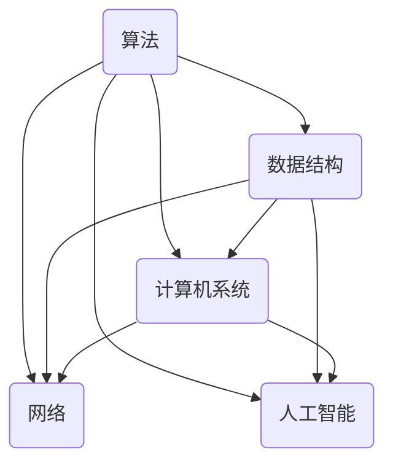

                 

关键词：计算机科学基础，AI开发者，核心概念，算法原理，数学模型，项目实践，未来展望

摘要：本文将深入探讨计算机科学基础，特别是AI开发者必备的知识。我们将从背景介绍、核心概念与联系、核心算法原理、数学模型和公式、项目实践、实际应用场景、工具和资源推荐以及未来发展趋势与挑战等方面进行全面解析，旨在帮助读者深入了解计算机科学基础，掌握AI开发的关键技能。

## 1. 背景介绍

随着人工智能（AI）技术的迅速发展，AI开发者已经成为当今科技界最为热门的职业之一。然而，成为一名成功的AI开发者并不仅仅依赖于编程技能，还需要深入理解计算机科学的基础知识。计算机科学基础涵盖了计算机系统、算法、数据结构、数学模型等多个领域，是AI开发者不可或缺的知识储备。

本文将围绕计算机科学基础，探讨AI开发者必备的知识点，帮助读者从宏观角度理解计算机科学，为未来的AI开发之路打下坚实的基础。

## 2. 核心概念与联系

计算机科学的核心概念包括算法、数据结构、计算机系统、网络、人工智能等。这些概念相互关联，共同构成了计算机科学的基础。

以下是一个简单的Mermaid流程图，展示了这些核心概念及其之间的联系：



### 2.1 算法

算法是计算机科学的核心概念之一，它指的是解决问题的步骤和方法。算法可以应用于各种领域，如排序、查找、优化等。

### 2.2 数据结构

数据结构是指数据在计算机中的组织形式，如数组、链表、树、图等。数据结构的选择直接影响算法的效率和性能。

### 2.3 计算机系统

计算机系统包括硬件和软件两个部分。硬件指的是计算机的物理组件，如CPU、内存、硬盘等；软件则包括操作系统、编译器、编程语言等。

### 2.4 网络

网络是指计算机之间的连接，如局域网、广域网、互联网等。网络技术是实现分布式计算、数据共享和通信的关键。

### 2.5 人工智能

人工智能（AI）是指计算机模拟人类智能的过程。人工智能领域包括机器学习、深度学习、自然语言处理等子领域。

## 3. 核心算法原理 & 具体操作步骤

在AI开发中，算法的选择和实现至关重要。本节将介绍几种核心算法的原理和具体操作步骤。

### 3.1 算法原理概述

以下是一些常用的核心算法及其原理：

- 排序算法：用于将一组数据按照特定顺序排列。常见的排序算法包括冒泡排序、选择排序、插入排序等。
- 查找算法：用于在数据集合中找到特定元素。常见的查找算法包括二分查找、顺序查找等。
- 优化算法：用于找到最优解或近似最优解。常见的优化算法包括遗传算法、模拟退火算法等。
- 机器学习算法：用于从数据中学习规律和模式，实现预测和分类。常见的机器学习算法包括线性回归、决策树、支持向量机等。

### 3.2 算法步骤详解

以下以冒泡排序算法为例，介绍其具体操作步骤：

1. 从第一个元素开始，比较相邻的两个元素，如果它们的顺序错误就交换它们。
2. 对每一对相邻元素做同样的工作，从开始第一对到结尾的最后一对。
3. 重复以上的步骤，除了最后一对。
4. 重复步骤1-3，直到排序完成。

### 3.3 算法优缺点

冒泡排序算法的优点是简单易懂，实现代码简单。然而，它的缺点是时间复杂度为O(n^2)，对于大数据集性能较差。

### 3.4 算法应用领域

冒泡排序算法主要应用于小型数据集的排序，如实验数据、测试数据等。在实际应用中，更倾向于使用更高效的排序算法，如快速排序、归并排序等。

## 4. 数学模型和公式 & 详细讲解 & 举例说明

数学模型和公式是计算机科学和人工智能领域的重要工具。本节将介绍几种常用的数学模型和公式，并详细讲解其推导过程和举例说明。

### 4.1 数学模型构建

数学模型构建是计算机科学和人工智能领域的重要环节。以下是一个简单的线性回归模型构建过程：

1. 确定自变量和因变量：假设我们想要预测房价，自变量可以是房屋面积、地理位置等，因变量是房价。
2. 收集数据：收集大量房屋数据和相应的房价数据。
3. 数据预处理：对数据进行清洗、归一化等处理，使其适合建模。
4. 构建模型：选择合适的数学模型，如线性回归模型，建立模型方程。

### 4.2 公式推导过程

线性回归模型的公式推导如下：

1. 假设我们的模型可以表示为：y = ax + b，其中y是因变量，x是自变量，a和b是模型参数。
2. 通过最小二乘法求解a和b，使得实际数据与模型预测数据的误差最小。
3. 最小二乘法公式为：$$\min_{a,b} \sum_{i=1}^{n} (y_i - (ax_i + b))^2$$
4. 对a和b分别求偏导数，并令偏导数为0，解得a和b的值。

### 4.3 案例分析与讲解

以下是一个线性回归模型的案例分析：

假设我们想要预测某城市未来一年的平均温度，自变量是当前的气温，因变量是未来一年的平均温度。

1. 收集数据：收集当前气温和未来一年平均温度的历史数据。
2. 数据预处理：对数据进行清洗、归一化等处理。
3. 构建模型：使用线性回归模型建立模型方程。
4. 模型训练：使用历史数据训练模型，求解参数a和b。
5. 模型预测：使用训练好的模型预测未来一年的平均温度。

## 5. 项目实践：代码实例和详细解释说明

本节将提供一个实际项目实践的代码实例，帮助读者更好地理解计算机科学基础在AI开发中的应用。

### 5.1 开发环境搭建

1. 安装Python编程环境。
2. 安装必要的库，如NumPy、Pandas、Scikit-learn等。

### 5.2 源代码详细实现

以下是一个简单的线性回归模型的Python代码实现：

```python
import numpy as np
import pandas as pd
from sklearn.linear_model import LinearRegression

# 读取数据
data = pd.read_csv("data.csv")
X = data.iloc[:, :-1].values
y = data.iloc[:, -1].values

# 模型训练
model = LinearRegression()
model.fit(X, y)

# 模型预测
predictions = model.predict(X)

# 输出结果
print("Predictions:", predictions)
```

### 5.3 代码解读与分析

这段代码首先导入了必要的库，然后读取了数据，接下来使用线性回归模型进行训练，最后进行预测并输出结果。

### 5.4 运行结果展示

运行这段代码后，我们将得到一组预测结果，这组结果将帮助我们了解线性回归模型在预测未来一年平均温度方面的性能。

## 6. 实际应用场景

计算机科学基础在AI开发的实际应用场景非常广泛，以下是一些典型的应用领域：

- 机器学习：机器学习算法广泛应用于分类、预测、聚类等领域，如金融风控、智能家居、医疗诊断等。
- 自然语言处理：自然语言处理技术广泛应用于语音识别、机器翻译、文本分类等，如智能客服、智能音箱等。
- 计算机视觉：计算机视觉技术广泛应用于图像识别、目标检测、人脸识别等领域，如自动驾驶、安防监控等。

## 7. 工具和资源推荐

为了更好地掌握计算机科学基础，以下是一些建议的学习资源和开发工具：

- 学习资源：
  - 《计算机科学基础教程》
  - 《机器学习实战》
  - 《深度学习》
- 开发工具：
  - Python
  - Jupyter Notebook
  - TensorFlow
  - PyTorch

## 8. 总结：未来发展趋势与挑战

计算机科学基础在AI开发中扮演着至关重要的角色。随着AI技术的不断发展，计算机科学基础的重要性将进一步凸显。然而，这也带来了新的挑战：

- 数据隐私和安全：随着数据量的爆炸性增长，如何保护数据隐私和安全成为一大挑战。
- 模型解释性：许多AI模型具有很好的预测性能，但缺乏解释性，如何提高模型的可解释性成为亟待解决的问题。
- 伦理道德：AI技术的应用需要遵循伦理道德标准，如何确保AI技术的公平、透明和可控成为重要的伦理问题。

总之，计算机科学基础是AI开发者必备的知识储备，未来发展趋势将更加注重数据隐私、模型解释性和伦理道德等方面。面对这些挑战，AI开发者需要不断提升自己的专业素养和创新能力。

## 9. 附录：常见问题与解答

### 9.1 什么是算法？

算法是一系列解决问题的步骤和方法，用于指导计算机执行特定任务。

### 9.2 什么是数据结构？

数据结构是指数据在计算机中的组织形式，用于提高数据的存储效率和访问速度。

### 9.3 什么是机器学习？

机器学习是人工智能的一个分支，通过训练模型从数据中学习规律和模式，实现预测和分类。

### 9.4 什么是深度学习？

深度学习是机器学习的一个子领域，通过多层神经网络模型实现自动特征提取和预测。

### 9.5 什么是计算机系统？

计算机系统包括硬件和软件两个部分，硬件包括CPU、内存、硬盘等，软件包括操作系统、编译器、编程语言等。

### 9.6 什么是网络？

网络是指计算机之间的连接，如局域网、广域网、互联网等，用于实现分布式计算、数据共享和通信。

### 9.7 什么是人工智能？

人工智能是指计算机模拟人类智能的过程，包括机器学习、深度学习、自然语言处理等多个子领域。

### 9.8 如何搭建开发环境？

安装Python编程环境，并安装必要的库，如NumPy、Pandas、Scikit-learn等。

### 9.9 如何进行数据预处理？

对数据进行清洗、归一化等处理，使其适合建模。

### 9.10 如何进行模型训练和预测？

使用机器学习库（如Scikit-learn）中的相应函数进行模型训练和预测。

### 9.11 如何评估模型性能？

使用准确率、召回率、F1值等指标评估模型性能。

### 9.12 如何提高模型性能？

通过特征工程、模型调参等方法提高模型性能。

### 9.13 如何保护数据隐私和安全？

采用加密、匿名化等手段保护数据隐私和安全。

### 9.14 如何确保AI技术的公平、透明和可控？

遵循伦理道德标准，建立透明的模型评估机制，确保AI技术的公平、透明和可控。

---

作者：禅与计算机程序设计艺术 / Zen and the Art of Computer Programming
----------------------------------------------------------------

以上就是本文的完整内容。希望本文能够帮助您更好地理解计算机科学基础，掌握AI开发的核心技能。在未来的AI开发之路上，祝您取得更大的成就！

