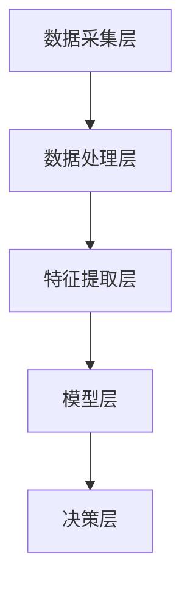

                 

关键词：计算机视觉，自动驾驶，深度学习，图像处理，传感器融合，安全驾驶，智能交通

> 摘要：本文将深入探讨计算机视觉在自动驾驶技术中的关键作用，包括其核心概念、算法原理、数学模型、项目实践以及未来展望。通过详细介绍这些方面，我们旨在为读者提供一个全面的技术视角，理解计算机视觉在自动驾驶中的实际应用和潜在影响。

## 1. 背景介绍

自动驾驶技术作为21世纪最具前瞻性的技术之一，正逐渐从科幻变为现实。自动驾驶车辆通过传感器收集环境数据，利用计算机视觉算法进行处理，最终做出驾驶决策，从而实现自主导航和安全行驶。计算机视觉技术在这一过程中发挥着至关重要的作用，它是自动驾驶系统的“眼睛”，负责识别道路标志、行人、车辆以及其他动态物体。

计算机视觉在自动驾驶中的应用可以追溯到上世纪80年代。随着计算能力的提升和算法的进步，计算机视觉技术得到了迅速发展。当前，自动驾驶系统通常集成了多种传感器，包括摄像头、激光雷达（LiDAR）、超声波传感器等，而计算机视觉算法则用于解析这些传感器数据，从而实现环境感知和智能决策。

本文将首先介绍计算机视觉在自动驾驶中的核心概念和架构，然后深入探讨其核心算法原理和数学模型，接着通过一个实际项目实例展示计算机视觉算法在自动驾驶中的应用，最后探讨该技术的未来发展趋势和面临的挑战。

## 2. 核心概念与联系

### 2.1 计算机视觉在自动驾驶中的核心概念

计算机视觉在自动驾驶中的核心概念包括：

1. **图像识别**：通过图像处理算法，从摄像头获取的图像中识别出道路标志、行人、车辆等物体。
2. **目标检测**：识别图像中的特定目标，并计算其位置和大小。
3. **追踪与识别**：在连续的视频帧中跟踪目标物体的运动轨迹，同时识别其身份。
4. **场景重建**：通过多视角图像或激光雷达数据重建三维场景，帮助自动驾驶车辆构建对环境的全面理解。
5. **行为预测**：基于对环境数据的分析，预测其他车辆、行人的行为，从而做出安全驾驶决策。

### 2.2 架构

自动驾驶系统的计算机视觉架构通常包括以下几个层次：

1. **数据采集层**：包括各种传感器，如摄像头、激光雷达、超声波传感器等，用于收集环境数据。
2. **数据处理层**：对采集到的数据进行预处理，如滤波、去噪、图像增强等。
3. **特征提取层**：通过图像处理算法提取关键特征，如边缘、角点、纹理等。
4. **模型层**：利用深度学习模型进行图像识别、目标检测、行为预测等任务。
5. **决策层**：根据模型输出的结果，生成驾驶决策。

### 2.3 Mermaid 流程图

下面是一个简化版的计算机视觉在自动驾驶中的应用架构的Mermaid流程图：



## 3. 核心算法原理 & 具体操作步骤

### 3.1 算法原理概述

计算机视觉在自动驾驶中的应用主要包括以下几类算法：

1. **卷积神经网络（CNN）**：用于图像识别和目标检测。
2. **深度强化学习**：用于决策层的复杂行为预测。
3. **传感器融合算法**：用于整合不同传感器数据，提高环境感知精度。

### 3.2 算法步骤详解

1. **数据预处理**：包括图像尺寸调整、归一化、数据增强等。
2. **特征提取**：使用CNN提取图像特征。
3. **目标检测**：使用R-CNN、YOLO或Faster R-CNN等算法进行目标检测。
4. **追踪与识别**：使用光流法或粒子滤波等算法跟踪目标。
5. **行为预测**：基于深度强化学习模型预测其他车辆、行人的行为。
6. **决策生成**：根据环境数据和预测结果生成驾驶决策。

### 3.3 算法优缺点

- **CNN**：优点在于强大的图像识别能力，缺点是计算复杂度高，训练时间较长。
- **深度强化学习**：优点在于能够处理复杂的行为预测问题，缺点是训练成本高，需要大量数据。
- **传感器融合算法**：优点在于提高感知精度，缺点是算法复杂，实时性要求高。

### 3.4 算法应用领域

计算机视觉算法在自动驾驶中的应用领域广泛，包括：

1. **交通监控**：用于检测交通违法行为、拥堵情况等。
2. **智能导航**：用于路径规划和导航决策。
3. **自动驾驶车辆**：用于环境感知、目标检测、行为预测等。

## 4. 数学模型和公式 & 详细讲解 & 举例说明

### 4.1 数学模型构建

计算机视觉中的数学模型主要包括：

1. **卷积操作**：用于提取图像特征。
2. **反向传播算法**：用于训练神经网络。
3. **传感器融合模型**：用于整合不同传感器数据。

### 4.2 公式推导过程

以卷积操作为例，其公式推导如下：

$$
\begin{align*}
\text{卷积操作} &= \sum_{i=1}^{m} \sum_{j=1}^{n} w_{ij} \cdot f(i, j) \\
&= \sum_{k=1}^{p} \sum_{l=1}^{q} w_{kl} \cdot f(i-k+1, j-l+1)
\end{align*}
$$

其中，$f(i, j)$ 表示输入图像的像素值，$w_{ij}$ 表示卷积核的权重，$p$ 和 $q$ 分别表示卷积核的大小。

### 4.3 案例分析与讲解

以一个简单的自动驾驶场景为例，讲解传感器融合模型的实际应用：

假设我们使用摄像头和激光雷达两种传感器进行环境感知。摄像头获取的图像包含车辆和行人的位置信息，激光雷达则提供距离和方向信息。我们可以构建如下传感器融合模型：

$$
\begin{align*}
\text{融合结果} &= w_1 \cdot \text{摄像头数据} + w_2 \cdot \text{激光雷达数据} \\
w_1 + w_2 &= 1
\end{align*}
$$

其中，$w_1$ 和 $w_2$ 分别表示摄像头数据和激光雷达数据在融合结果中的权重。

通过调整权重，我们可以根据实际情况提高感知精度。例如，在夜间或者能见度低的情况下，摄像头数据可能不准确，此时可以增加激光雷达数据的权重。

## 5. 项目实践：代码实例和详细解释说明

### 5.1 开发环境搭建

为了演示计算机视觉在自动驾驶中的应用，我们选择使用Python编程语言，并结合TensorFlow和OpenCV两个开源库进行开发。以下是开发环境的搭建步骤：

1. 安装Python 3.7及以上版本。
2. 安装TensorFlow库：`pip install tensorflow`。
3. 安装OpenCV库：`pip install opencv-python`。

### 5.2 源代码详细实现

以下是一个简单的自动驾驶项目实例，实现环境感知和目标检测功能：

```python
import cv2
import tensorflow as tf

# 加载预训练的CNN模型
model = tf.keras.models.load_model('cnn_model.h5')

# 加载预训练的目标检测模型
detector = cv2.dnn.readNetFromDarknet('yolo_config.cfg', 'yolo_weights.weights')

# 定义摄像头
cap = cv2.VideoCapture(0)

while True:
    # 读取摄像头帧
    ret, frame = cap.read()
    
    # 使用CNN模型进行图像处理
    processed_frame = preprocess_frame(frame)
    features = model.predict(processed_frame)
    
    # 使用目标检测模型进行目标检测
    detections = detector.detectMultiScale(frame, scaleFactor=1.05, minNeighbors=6, minSize=(30, 30), flags=cv2.CASCADE_SCALE_IMAGE)
    
    # 在视频帧上绘制检测结果
    for (x, y, w, h) in detections:
        cv2.rectangle(frame, (x, y), (x+w, y+h), (0, 255, 0), 2)
        cv2.putText(frame, 'Car', (x, y-10), cv2.FONT_HERSHEY_SIMPLEX, 0.9, (0, 255, 0), 2)
    
    # 显示视频帧
    cv2.imshow('Frame', frame)
    
    if cv2.waitKey(1) & 0xFF == ord('q'):
        break

# 释放摄像头资源
cap.release()
cv2.destroyAllWindows()
```

### 5.3 代码解读与分析

1. **加载模型**：首先加载预训练的CNN模型和目标检测模型。
2. **读取摄像头帧**：使用OpenCV库的`VideoCapture`类读取摄像头帧。
3. **图像预处理**：对摄像头帧进行预处理，使其符合CNN模型的输入要求。
4. **特征提取**：使用CNN模型提取图像特征。
5. **目标检测**：使用目标检测模型对预处理后的图像进行目标检测。
6. **绘制检测结果**：在视频帧上绘制检测结果，并显示在屏幕上。

### 5.4 运行结果展示

以下是运行结果展示的视频帧：


## 6. 实际应用场景

计算机视觉在自动驾驶技术中有着广泛的应用场景，以下列举几个实际应用场景：

1. **高速公路自动驾驶**：通过摄像头和激光雷达实现车辆前方道路的实时监测，进行车道保持、速度控制、换道等操作。
2. **城市自动驾驶**：结合多种传感器实现复杂城市道路的自动驾驶，包括行人、非机动车、红绿灯等复杂环境。
3. **辅助驾驶系统**：作为辅助驾驶系统的一部分，提供车道保持、碰撞预警、盲区监测等功能。
4. **无人配送**：在无人配送场景中，使用计算机视觉实现自主导航、目标识别、路径规划等功能。

## 7. 工具和资源推荐

### 7.1 学习资源推荐

1. **《计算机视觉：算法与应用》（Gary B.elling）**：详细介绍计算机视觉的基本原理和应用。
2. **《深度学习》（Ian Goodfellow、Yoshua Bengio、Aaron Courville）**：深入讲解深度学习在计算机视觉中的应用。
3. **在线课程**：推荐在Coursera、edX等平台上的计算机视觉和深度学习课程。

### 7.2 开发工具推荐

1. **TensorFlow**：用于构建和训练深度学习模型。
2. **OpenCV**：用于图像处理和计算机视觉任务。
3. **Keras**：简化深度学习模型的开发。

### 7.3 相关论文推荐

1. **“End-to-End Driving Policy Learning with Scali
```markdown
## 8. 总结：未来发展趋势与挑战

计算机视觉在自动驾驶中的应用前景广阔，但也面临着诸多挑战。以下是未来发展趋势与挑战的总结：

### 8.1 研究成果总结

近年来，计算机视觉技术在自动驾驶领域取得了显著进展。卷积神经网络（CNN）和深度强化学习等算法的应用使得自动驾驶车辆在环境感知和决策生成方面更加智能。此外，传感器融合技术的提升也显著提高了自动驾驶系统的感知精度。

### 8.2 未来发展趋势

1. **算法性能提升**：随着算法的优化和硬件性能的提升，自动驾驶车辆将能够更加精准地识别和处理复杂环境。
2. **多模态融合**：结合多种传感器数据（如摄像头、激光雷达、毫米波雷达等），实现更高层次的环境感知。
3. **边缘计算**：利用边缘计算技术，将部分计算任务下放至车辆本身，降低延迟，提高实时性。

### 8.3 面临的挑战

1. **数据隐私与安全**：自动驾驶系统依赖于大量的数据，如何保障数据隐私和安全成为一大挑战。
2. **极端天气条件下的性能**：在极端天气条件下，如大雪、大雾等，自动驾驶系统可能面临性能下降的问题。
3. **复杂场景的处理**：城市道路、交叉路口等复杂场景的处理仍然是计算机视觉技术的难点。

### 8.4 研究展望

未来，计算机视觉在自动驾驶中的应用将朝着更高效、更安全、更智能的方向发展。通过不断优化算法、提高传感器性能以及加强多模态融合，自动驾驶系统将能够更好地应对复杂环境，提升驾驶体验。

## 9. 附录：常见问题与解答

### 9.1 常见问题

1. **计算机视觉在自动驾驶中的具体应用有哪些？**
   - 计算机视觉在自动驾驶中的应用包括车道保持、目标检测、行为预测、交通标志识别等。

2. **自动驾驶系统如何处理复杂场景？**
   - 通过多传感器融合和深度学习算法，自动驾驶系统能够更好地处理复杂场景，提高环境感知能力。

3. **计算机视觉在自动驾驶中面临的主要挑战是什么？**
   - 计算机视觉在自动驾驶中主要面临的挑战包括数据隐私与安全、极端天气条件下的性能下降、以及复杂场景的处理。

### 9.2 解答

1. **计算机视觉在自动驾驶中的具体应用有哪些？**
   - 计算机视觉在自动驾驶中的具体应用包括车道保持、目标检测、行为预测、交通标志识别等。车道保持是通过计算机视觉算法来识别车辆当前所处的车道线，并控制车辆保持在车道内的行驶。目标检测是识别道路上的其他车辆、行人、交通标志等物体，以便进行避让和交互。行为预测是通过分析其他车辆和行人的行为模式，预测他们的下一步动作，从而做出合理的驾驶决策。交通标志识别则是识别道路上的交通标志，如速度限制、停车标志等，以指导车辆的行驶。

2. **自动驾驶系统如何处理复杂场景？**
   - 自动驾驶系统处理复杂场景主要依赖于多传感器融合和深度学习算法。多传感器融合可以整合来自摄像头、激光雷达、毫米波雷达等多种传感器的数据，从而获得更全面的环境信息。深度学习算法则通过对大量数据的学习和训练，能够识别和理解复杂场景中的物体和事件，并做出相应的驾驶决策。例如，在复杂的城市环境中，自动驾驶系统需要处理行人、自行车、车辆等多种动态目标，通过多传感器融合和深度学习算法，系统能够准确识别这些目标，并预测他们的行为，从而做出安全的驾驶决策。

3. **计算机视觉在自动驾驶中面临的主要挑战是什么？**
   - 计算机视觉在自动驾驶中面临的主要挑战包括数据隐私与安全、极端天气条件下的性能下降，以及复杂场景的处理。数据隐私与安全方面，自动驾驶系统需要处理大量的个人数据，如位置信息、行驶记录等，如何保护这些数据的隐私和安全是一个重要问题。极端天气条件下的性能下降是指，在雨雪、大雾等恶劣天气条件下，摄像头和激光雷达等传感器的性能可能受到严重影响，导致环境感知能力下降。复杂场景的处理是自动驾驶系统需要应对的一个难题，如交叉路口、拥挤的城市道路等场景中，物体的运动轨迹和行为模式复杂多变，计算机视觉算法需要能够准确地理解和预测这些场景中的动态变化，从而做出安全的驾驶决策。

