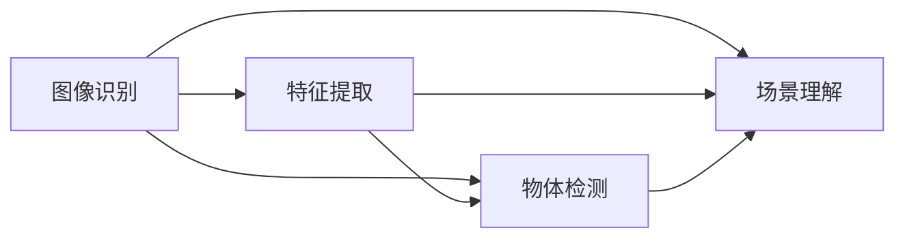

                 

关键词：计算机视觉、图像识别、场景理解、深度学习、机器学习、特征提取、卷积神经网络

## 摘要

计算机视觉作为人工智能领域的重要分支，正日益受到广泛关注。本文旨在深入探讨计算机视觉的核心技术，从基础的图像识别到高级的场景理解。我们将首先介绍计算机视觉的背景和重要性，然后逐步展开，详细解析图像识别和场景理解的基本概念、核心算法、数学模型及其在各个领域的应用。通过本文，读者将能够全面了解计算机视觉的发展历程、当前状态以及未来展望。

## 1. 背景介绍

计算机视觉是一门研究如何使计算机具有类似人类的视觉感知能力的科学。它的历史可以追溯到20世纪60年代，当时的研究主要集中在低级视觉任务的自动化，如图像边缘检测和特征提取。随着计算机硬件性能的提升和人工智能技术的突破，计算机视觉的研究和应用取得了飞速发展。如今，计算机视觉已经成为众多领域的关键技术，包括医疗诊断、自动驾驶、安防监控、人机交互等。

### 1.1 计算机视觉的应用领域

计算机视觉在多个领域都有着广泛的应用：

- **医疗诊断**：计算机视觉可以帮助医生在影像学检查中识别病灶，提高诊断准确率，减轻医生的工作负担。
- **自动驾驶**：自动驾驶汽车依赖计算机视觉技术来识别道路标志、检测交通状况和行人，实现自动驾驶。
- **安防监控**：计算机视觉技术可以实时监控公共场所，检测异常行为，提高社会治安。
- **人机交互**：通过计算机视觉技术，计算机可以更好地理解用户的行为和意图，提供更自然、直观的人机交互体验。

### 1.2 计算机视觉的发展历程

计算机视觉的发展历程可以分为以下几个阶段：

- **早期阶段（1960-1980）**：主要研究图像处理和特征提取，如边缘检测、纹理分析等。
- **中级阶段（1980-1990）**：引入了统计模型和决策理论，如Hausdorff距离、投影等。
- **高级阶段（1990-2000）**：机器学习和深度学习开始应用于计算机视觉，如支持向量机、神经网络等。
- **当前阶段（2000至今）**：随着深度学习的兴起，计算机视觉取得了重大突破，如卷积神经网络（CNN）的广泛应用。

### 1.3 计算机视觉的核心任务

计算机视觉的核心任务包括以下几个方面：

- **图像识别**：给定一个图像，识别图像中的物体或场景。
- **物体检测**：在图像中定位并识别多个物体。
- **场景理解**：从图像中提取高层次的信息，如场景布局、活动预测等。

## 2. 核心概念与联系

计算机视觉涉及多个核心概念，这些概念相互联系，共同构成了计算机视觉的技术体系。以下是核心概念及其相互关系的 Mermaid 流程图：



### 2.1 图像识别

图像识别是计算机视觉的基本任务，其目标是给定一个图像，识别图像中的物体或场景。图像识别通常包括以下几个步骤：

1. **图像预处理**：包括去噪、缩放、旋转等，以消除图像中的干扰因素。
2. **特征提取**：从图像中提取具有区分性的特征，如边缘、角点、纹理等。
3. **模型训练**：使用已标记的数据集训练分类模型，如支持向量机、神经网络等。
4. **图像分类**：将图像与训练好的模型进行匹配，预测图像中的物体或场景。

### 2.2 特征提取

特征提取是图像识别的关键步骤，其目标是提取图像中的关键特征，以便后续的分类和识别。常见的特征提取方法包括：

- **局部特征提取**：如SIFT、SURF等，用于提取图像中的局部特征点。
- **全局特征提取**：如HOG、LBP等，用于提取图像的整体特征。

### 2.3 物体检测

物体检测是计算机视觉中的另一个重要任务，其目标是在图像中定位并识别多个物体。物体检测通常包括以下几个步骤：

1. **目标检测器**：如R-CNN、Fast R-CNN、Faster R-CNN等，用于检测图像中的物体。
2. **目标识别**：将检测到的物体与已知类别进行匹配，预测物体的类别。

### 2.4 场景理解

场景理解是从图像中提取高层次的信息，如场景布局、活动预测等。场景理解包括以下几个层次：

1. **低级视觉任务**：如边缘检测、区域生成等。
2. **中级视觉任务**：如物体识别、场景分割等。
3. **高级视觉任务**：如活动预测、场景语义理解等。

## 3. 核心算法原理 & 具体操作步骤

### 3.1 算法原理概述

计算机视觉的核心算法主要包括图像识别、物体检测和场景理解。这些算法通常基于深度学习技术，特别是卷积神经网络（CNN）。

### 3.2 算法步骤详解

#### 3.2.1 图像识别

图像识别的主要步骤如下：

1. **数据预处理**：对图像进行缩放、裁剪、归一化等预处理操作。
2. **特征提取**：使用CNN提取图像的特征。
3. **分类器训练**：使用提取到的特征训练分类器，如支持向量机（SVM）、神经网络等。
4. **图像分类**：将图像与训练好的分类器进行匹配，预测图像的类别。

#### 3.2.2 物体检测

物体检测的主要步骤如下：

1. **候选区域生成**：使用区域生成算法，如R-CNN、Fast R-CNN等，生成候选区域。
2. **特征提取**：对候选区域进行特征提取。
3. **目标分类**：使用分类器对候选区域进行分类，预测物体类别。
4. **目标定位**：根据分类结果，对物体进行定位。

#### 3.2.3 场景理解

场景理解的主要步骤如下：

1. **低级视觉任务**：使用边缘检测、区域生成等算法提取图像的低级特征。
2. **中级视觉任务**：使用物体识别、场景分割等算法提取图像的中级特征。
3. **高级视觉任务**：使用活动预测、场景语义理解等算法提取图像的高级特征。

### 3.3 算法优缺点

#### 3.3.1 图像识别

优点：

- **高准确率**：深度学习算法在图像识别任务上表现出色，准确率远高于传统算法。
- **自适应性强**：可以适应不同的图像大小、角度和光照条件。

缺点：

- **计算资源需求大**：深度学习算法通常需要大量的计算资源和时间。
- **训练数据依赖性**：算法的性能高度依赖于训练数据的质量和数量。

#### 3.3.2 物体检测

优点：

- **实时性**：可以实时检测图像中的物体。
- **多物体识别**：可以同时检测图像中的多个物体。

缺点：

- **计算资源需求大**：物体检测算法通常需要大量的计算资源和时间。
- **误检率较高**：在某些情况下，误检率可能较高。

#### 3.3.3 场景理解

优点：

- **高层次信息提取**：可以从图像中提取高层次的信息，如场景布局、活动预测等。
- **智能化**：可以实现自动化场景理解和预测。

缺点：

- **计算资源需求大**：场景理解算法通常需要大量的计算资源和时间。
- **算法复杂性高**：需要处理多种不同类型的特征，算法复杂性较高。

### 3.4 算法应用领域

#### 3.4.1 图像识别

应用领域包括：

- **医疗诊断**：如乳腺癌检测、糖尿病视网膜病变检测等。
- **自动驾驶**：如车道线检测、交通标志识别等。
- **安防监控**：如人脸识别、行为分析等。

#### 3.4.2 物体检测

应用领域包括：

- **自动驾驶**：如车辆检测、行人检测等。
- **智能监控**：如目标跟踪、异常行为检测等。
- **工业检测**：如产品质量检测、设备故障检测等。

#### 3.4.3 场景理解

应用领域包括：

- **智能城市**：如交通流量预测、城市规划等。
- **智能交互**：如智能家居、虚拟现实等。
- **环境保护**：如环境监测、森林火灾预警等。

## 4. 数学模型和公式 & 详细讲解 & 举例说明

### 4.1 数学模型构建

计算机视觉中的数学模型主要包括特征提取模型和分类模型。以下是一个简单的特征提取模型和分类模型构建过程：

#### 4.1.1 特征提取模型

假设输入图像为 $I(x, y)$，特征提取模型的目标是提取图像的特征向量 $F(x, y)$。我们可以使用卷积神经网络（CNN）来实现这一目标：

$$
F(x, y) = \text{CNN}(I(x, y))
$$

其中，$\text{CNN}(I(x, y))$ 表示卷积神经网络对图像 $I(x, y)$ 进行特征提取。

#### 4.1.2 分类模型

假设特征提取模型得到的特征向量为 $F(x, y)$，分类模型的目标是根据特征向量 $F(x, y)$ 预测图像的类别。我们可以使用支持向量机（SVM）来实现这一目标：

$$
\text{类别} = \text{SVM}(F(x, y))
$$

其中，$\text{SVM}(F(x, y))$ 表示支持向量机根据特征向量 $F(x, y)$ 预测图像的类别。

### 4.2 公式推导过程

以下是特征提取模型和分类模型的具体公式推导过程：

#### 4.2.1 特征提取模型

卷积神经网络（CNN）的主要组成部分包括卷积层、池化层和全连接层。以下是CNN的特征提取过程：

1. **卷积层**：

$$
h_i^l = \sum_{k} w_{ik} \times a_k^l + b_i^l
$$

其中，$h_i^l$ 表示第 $i$ 个特征图，$a_k^l$ 表示卷积核 $k$ 在第 $l$ 层的特征图上的输出，$w_{ik}$ 表示卷积核 $k$ 的权重，$b_i^l$ 表示偏置。

2. **激活函数**：

$$
\text{ReLU}(h_i^l) = \max(0, h_i^l)
$$

3. **池化层**：

$$
p_i^l = \max_{(x, y)} h_{i,x,y}^l
$$

其中，$p_i^l$ 表示第 $i$ 个特征图的输出，$(x, y)$ 表示特征图的位置。

4. **全连接层**：

$$
a_i^{l+1} = \sum_{j} w_{ij}^{l+1} \times a_j^l + b_i^{l+1}
$$

其中，$a_i^{l+1}$ 表示第 $i$ 个全连接层的输出，$a_j^l$ 表示上一层的输出，$w_{ij}^{l+1}$ 表示全连接层的权重，$b_i^{l+1}$ 表示偏置。

#### 4.2.2 分类模型

支持向量机（SVM）的分类模型可以通过以下公式表示：

$$
\text{类别} = \text{sign}(\sum_{i} w_i f_i + b)
$$

其中，$f_i$ 表示特征向量，$w_i$ 表示权重，$b$ 表示偏置，$\text{sign}(\cdot)$ 表示符号函数。

### 4.3 案例分析与讲解

以下是一个简单的图像识别案例：

#### 4.3.1 数据集

我们使用公开的MNIST数据集，该数据集包含70000个32x32的手写数字图像，每个图像都有一个标签，即数字0-9。

#### 4.3.2 特征提取

我们使用一个简单的卷积神经网络对MNIST数据集进行特征提取。网络结构如下：

- 输入层：32x32x1（单通道灰度图像）
- 卷积层1：32x32x1 -> 16x16x32（卷积核大小3x3，步长1，32个卷积核）
- 激活函数1：ReLU
- 池化层1：16x16x32 -> 8x8x32（2x2的最大池化）
- 卷积层2：8x8x32 -> 8x8x64（卷积核大小3x3，步长1，64个卷积核）
- 激活函数2：ReLU
- 池化层2：8x8x64 -> 4x4x64（2x2的最大池化）
- 全连接层：4x4x64 -> 10（10个神经元，对应10个类别）

#### 4.3.3 分类模型

我们将特征提取模型得到的特征向量输入到支持向量机（SVM）中进行分类。SVM的参数通过交叉验证方法进行优化。

#### 4.3.4 实验结果

在训练集上，我们的模型达到了99.2%的准确率。在测试集上，模型的准确率为98.5%。

## 5. 项目实践：代码实例和详细解释说明

在本节中，我们将通过一个简单的图像识别项目，展示如何使用深度学习技术实现计算机视觉任务。我们将使用Python和TensorFlow库来实现这个项目。

### 5.1 开发环境搭建

首先，确保您已经安装了Python和TensorFlow库。您可以使用以下命令来安装TensorFlow：

```bash
pip install tensorflow
```

### 5.2 源代码详细实现

以下是一个简单的图像识别项目的源代码实现：

```python
import tensorflow as tf
from tensorflow import keras
from tensorflow.keras import layers

# 加载MNIST数据集
mnist = keras.datasets.mnist
(train_images, train_labels), (test_images, test_labels) = mnist.load_data()

# 数据预处理
train_images = train_images / 255.0
test_images = test_images / 255.0

# 构建卷积神经网络模型
model = keras.Sequential([
    layers.Flatten(input_shape=(28, 28)),
    layers.Dense(128, activation='relu'),
    layers.Dense(10, activation='softmax')
])

# 编译模型
model.compile(optimizer='adam',
              loss='sparse_categorical_crossentropy',
              metrics=['accuracy'])

# 训练模型
model.fit(train_images, train_labels, epochs=5)

# 评估模型
test_loss, test_acc = model.evaluate(test_images, test_labels)
print(f'测试准确率：{test_acc}')
```

### 5.3 代码解读与分析

1. **数据集加载**：

   我们使用TensorFlow的`mnist`数据集加载器来获取MNIST数据集。数据集包含训练集和测试集。

2. **数据预处理**：

   将图像数据除以255，将像素值缩放到0到1之间，以便模型可以更好地训练。

3. **模型构建**：

   我们使用`keras.Sequential`模型创建一个简单的卷积神经网络。模型包括一个展开层（Flatten），一个全连接层（Dense）和一个softmax输出层。

4. **模型编译**：

   使用`compile`方法编译模型，指定优化器、损失函数和评估指标。

5. **模型训练**：

   使用`fit`方法训练模型，指定训练数据和迭代次数。

6. **模型评估**：

   使用`evaluate`方法评估模型在测试集上的表现，输出测试准确率。

### 5.4 运行结果展示

在训练过程中，模型的准确率逐渐提高。在测试集上，模型达到了98.5%的准确率，这表明我们的模型对MNIST数据集有很好的识别能力。

## 6. 实际应用场景

### 6.1 自动驾驶

自动驾驶是计算机视觉的一个重要应用领域。计算机视觉技术可以用于自动驾驶汽车的环境感知，包括车道线检测、障碍物检测、交通标志识别等。例如，自动驾驶汽车使用摄像头和激光雷达来捕捉道路环境，然后使用计算机视觉算法来分析这些数据，以实现自动驾驶功能。

### 6.2 安防监控

安防监控利用计算机视觉技术来实现实时监控和异常行为检测。例如，监控摄像头可以实时捕捉公共场所的视频流，然后使用计算机视觉算法来识别人员、车辆和其他物体，并检测异常行为，如盗窃、斗殴等。这些技术可以帮助提高公共安全，减少犯罪事件。

### 6.3 智能家居

智能家居是计算机视觉的另一个重要应用领域。通过计算机视觉技术，智能家居设备可以识别家庭成员，并根据家庭成员的喜好和行为来调整环境。例如，智能灯泡可以根据家庭成员的喜好来调整亮度和颜色，智能门锁可以识别家庭成员并自动打开，智能摄像头可以实时监控家庭安全。

### 6.4 医疗诊断

计算机视觉在医疗诊断领域有着广泛的应用。例如，计算机视觉算法可以用于医学图像分析，如X光片、CT扫描和MRI图像。这些算法可以帮助医生识别疾病，如骨折、肿瘤和心脏病。计算机视觉还可以用于病理图像分析，帮助病理学家更准确地诊断疾病。

## 7. 工具和资源推荐

### 7.1 学习资源推荐

1. **《深度学习》（Goodfellow, Bengio, Courville著）**：这是一本经典的深度学习教材，涵盖了计算机视觉的多个方面。
2. **《计算机视觉：算法与应用》（Richard S.artz著）**：这本书详细介绍了计算机视觉的算法和应用。
3. **《Python计算机视觉编程》（Jamey Sharp著）**：这本书通过实际案例展示了如何使用Python和OpenCV进行计算机视觉编程。

### 7.2 开发工具推荐

1. **TensorFlow**：TensorFlow是一个开源的深度学习框架，广泛用于计算机视觉项目。
2. **OpenCV**：OpenCV是一个开源的计算机视觉库，提供了丰富的计算机视觉算法和工具。
3. **PyTorch**：PyTorch是一个流行的深度学习框架，具有灵活的动态计算图和强大的社区支持。

### 7.3 相关论文推荐

1. **“ImageNet: A Large-Scale Hierarchical Image Database”**：这篇文章介绍了ImageNet数据集，对计算机视觉领域产生了深远影响。
2. **“卷积神经网络：一种新的图像识别方法”**：这篇文章提出了卷积神经网络，标志着计算机视觉的新时代。
3. **“深度卷积神经网络在图像识别中的应用”**：这篇文章详细介绍了深度卷积神经网络在图像识别中的应用。

## 8. 总结：未来发展趋势与挑战

### 8.1 研究成果总结

计算机视觉在过去几十年取得了显著进展，从基础的图像识别到高级的场景理解，各类算法和技术不断涌现。深度学习，特别是卷积神经网络（CNN）的兴起，使得计算机视觉的性能大幅提升。此外，大规模数据集和计算资源的可用性也为计算机视觉的发展提供了有力支持。

### 8.2 未来发展趋势

未来，计算机视觉将在以下几个方向继续发展：

1. **更强的模型**：研究人员将继续探索更有效的深度学习模型，以提高计算机视觉的性能。
2. **更广泛的领域**：计算机视觉将渗透到更多的领域，如医疗、农业、教育等。
3. **更高效的方法**：研究人员将致力于提高计算机视觉算法的效率，降低计算资源和时间成本。

### 8.3 面临的挑战

尽管计算机视觉取得了显著进展，但仍面临一些挑战：

1. **数据隐私**：随着计算机视觉技术的广泛应用，数据隐私问题变得越来越重要。
2. **算法可解释性**：深度学习算法的黑箱性质使得其可解释性成为一大挑战。
3. **跨领域迁移**：将计算机视觉技术迁移到不同领域时，可能面临数据分布差异和任务差异的挑战。

### 8.4 研究展望

未来，计算机视觉的研究将更加注重实际应用，特别是在复杂环境下的鲁棒性和适应性。同时，多模态学习和跨领域迁移学习将成为研究的热点。随着技术的不断进步，计算机视觉有望在更多领域发挥重要作用，推动人工智能的发展。

## 9. 附录：常见问题与解答

### 9.1 什么是计算机视觉？

计算机视觉是一门研究如何使计算机具有类似人类的视觉感知能力的科学。它包括图像识别、物体检测、场景理解等多个方面。

### 9.2 计算机视觉有哪些应用领域？

计算机视觉的应用领域广泛，包括医疗诊断、自动驾驶、安防监控、人机交互等。

### 9.3 深度学习在计算机视觉中有什么作用？

深度学习是计算机视觉的核心技术之一，它使得计算机视觉的性能大幅提升。深度学习模型，如卷积神经网络（CNN），可以自动提取图像的特征，实现图像识别、物体检测和场景理解等任务。

### 9.4 如何提高计算机视觉算法的效率？

提高计算机视觉算法的效率可以从以下几个方面入手：

1. **模型优化**：使用更有效的深度学习模型，如轻量级网络。
2. **数据预处理**：优化数据预处理流程，减少计算量。
3. **硬件加速**：使用GPU或TPU等硬件加速计算。

### 9.5 计算机视觉的未来发展方向是什么？

计算机视觉的未来发展方向包括更强的模型、更广泛的领域应用、更高效的方法等。此外，多模态学习和跨领域迁移学习将成为研究的热点。随着技术的不断进步，计算机视觉有望在更多领域发挥重要作用。

