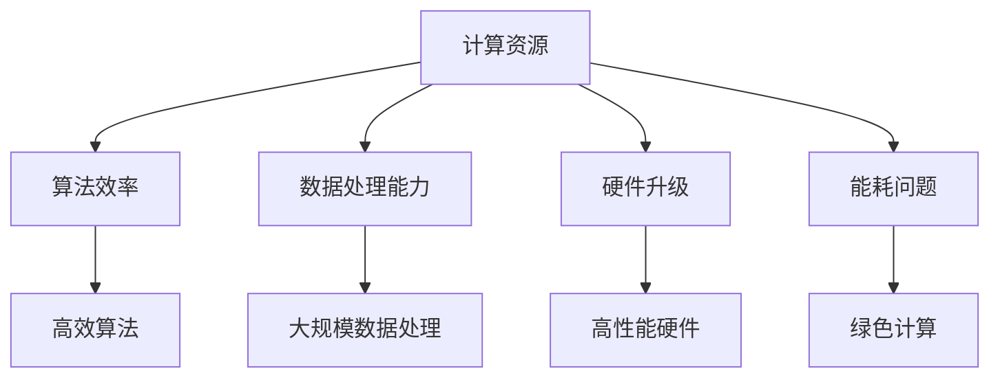

                 

 关键词：计算资源、人工智能、发展、关键因素、算法效率、硬件升级、数据处理、机器学习、深度学习

> 摘要：本文深入探讨了计算资源在人工智能发展中的关键作用，分析了计算资源对人工智能算法效率、数据处理能力和未来发展的深远影响。通过梳理核心概念与联系，介绍了核心算法原理和具体操作步骤，并结合数学模型和公式对实际应用场景进行了详细解析。文章还通过代码实例展示了计算资源在实际项目中的应用，最终提出了对未来发展趋势与挑战的展望。

## 1. 背景介绍

### 1.1 人工智能的发展历程

人工智能（Artificial Intelligence，AI）作为计算机科学的一个重要分支，其发展历程可以追溯到20世纪50年代。从最初的符号主义智能、基于规则的系统，到后来的知识表示与推理、基于案例的推理、统计学习、神经网络等方法的不断演进，人工智能在算法、理论、应用等多个层面都取得了显著的进展。特别是深度学习（Deep Learning）的兴起，为人工智能的发展注入了新的活力。

### 1.2 人工智能的应用领域

随着计算能力的提升和算法的进步，人工智能在多个领域展现出了强大的应用潜力，包括但不限于：

1. **计算机视觉**：图像识别、目标检测、人脸识别等。
2. **自然语言处理**：语音识别、机器翻译、情感分析等。
3. **智能决策与优化**：推荐系统、交通调度、金融风控等。
4. **医疗健康**：疾病预测、诊断辅助、个性化治疗等。

### 1.3 人工智能的发展瓶颈

尽管人工智能在多个领域取得了显著的成就，但其发展仍面临诸多挑战。其中，计算资源成为限制人工智能进一步发展的关键因素之一。以下是人工智能发展过程中面临的几个瓶颈：

1. **数据需求**：随着算法的复杂度和数据量的增加，对数据处理能力和存储需求提出了更高的要求。
2. **算法效率**：许多人工智能算法的运行速度较慢，无法满足实时处理的需求。
3. **硬件升级**：传统的CPU和GPU在处理高维度、高复杂度的计算任务时，效率较低。
4. **能耗问题**：高性能计算设备在运行过程中消耗大量电力，对环境造成了负面影响。

## 2. 核心概念与联系

为了深入理解计算资源在人工智能发展中的关键作用，我们首先需要梳理一些核心概念，并展示它们之间的联系。

### 2.1 计算资源

计算资源是指用于执行计算任务的各种硬件和软件资源，包括CPU、GPU、FPGA、TPU等硬件设备，以及计算平台、数据中心等基础设施。

### 2.2 算法效率

算法效率是指算法在处理数据时的时间和空间复杂度。高效的算法能够在较短的时间内完成大量计算任务，并节省计算资源。

### 2.3 数据处理能力

数据处理能力是指系统处理大规模数据的能力，包括数据存储、数据读取、数据计算等环节。强大的数据处理能力能够支持更复杂的人工智能算法。

### 2.4 硬件升级

硬件升级是指通过引入更先进、更高性能的硬件设备来提升计算能力。硬件升级是解决计算资源瓶颈的重要手段。

### 2.5 能耗问题

能耗问题是指高性能计算设备在运行过程中消耗大量电力的问题。降低能耗是人工智能发展过程中不可忽视的挑战。

以下是核心概念之间的Mermaid流程图：



## 3. 核心算法原理 & 具体操作步骤

### 3.1 算法原理概述

在人工智能领域，许多算法的运行速度和计算资源消耗取决于其原理和实现方式。以下介绍几种常用的核心算法原理及其操作步骤。

### 3.2 算法步骤详解

#### 3.2.1 深度学习算法

深度学习算法是一种基于神经网络的机器学习方法，具有自动提取特征和建模数据的能力。以下是深度学习算法的基本步骤：

1. **数据预处理**：对输入数据进行清洗、归一化等处理，使其符合算法要求。
2. **构建神经网络模型**：选择合适的神经网络架构，如卷积神经网络（CNN）、循环神经网络（RNN）等。
3. **初始化参数**：为神经网络模型初始化权重和偏置等参数。
4. **前向传播**：计算输入数据在神经网络中的输出。
5. **反向传播**：计算损失函数关于模型参数的梯度，更新模型参数。
6. **迭代训练**：重复上述步骤，直到模型达到预期性能。

#### 3.2.2 统计学习算法

统计学习算法是一种基于统计学原理的机器学习方法，主要包括线性回归、逻辑回归、支持向量机（SVM）等。以下是统计学习算法的基本步骤：

1. **数据预处理**：对输入数据进行清洗、归一化等处理，使其符合算法要求。
2. **特征选择**：选择对模型预测有显著影响的重要特征。
3. **模型训练**：选择合适的模型，使用训练数据进行模型训练。
4. **模型评估**：使用测试数据对模型进行评估，计算模型准确率、召回率等指标。
5. **参数调整**：根据评估结果调整模型参数，优化模型性能。

#### 3.2.3 强化学习算法

强化学习算法是一种基于试错和奖励机制的学习方法，主要包括Q学习、深度Q网络（DQN）等。以下是强化学习算法的基本步骤：

1. **环境搭建**：构建仿真环境，定义状态、动作和奖励等。
2. **初始化参数**：为强化学习算法初始化参数，如学习率、探索率等。
3. **执行动作**：在环境中执行动作，观察状态和奖励。
4. **更新策略**：根据奖励信号更新策略参数。
5. **重复执行**：重复上述步骤，直到达到预期性能。

### 3.3 算法优缺点

#### 深度学习算法

优点：

1. 强大的特征提取能力。
2. 能够处理高维数据和复杂模型。

缺点：

1. 计算资源需求大，训练时间较长。
2. 需要大量的训练数据和计算资源。

#### 统计学习算法

优点：

1. 计算效率高，训练速度快。
2. 易于理解，实现简单。

缺点：

1. 特征工程要求高，需要大量人工干预。
2. 对于高维数据效果较差。

#### 强化学习算法

优点：

1. 能够处理动态变化的环境。
2. 不需要大量先验知识。

缺点：

1. 训练过程不稳定，容易陷入局部最优。
2. 需要大量的数据和时间进行训练。

### 3.4 算法应用领域

深度学习算法在计算机视觉、自然语言处理等领域取得了显著的成果；统计学习算法在金融风控、推荐系统等领域广泛应用；强化学习算法在自动驾驶、游戏人工智能等领域展现出了巨大的潜力。

## 4. 数学模型和公式 & 详细讲解 & 举例说明

在人工智能领域，许多算法的实现和优化都依赖于数学模型和公式。以下介绍几种常用的数学模型和公式的构建、推导过程以及实际应用。

### 4.1 数学模型构建

#### 4.1.1 深度学习模型

深度学习模型通常由多个层（Layer）组成，包括输入层、隐藏层和输出层。每层由多个神经元（Neuron）组成，神经元之间的连接（Connection）构成了网络的权重（Weight）。

#### 4.1.2 统计学习模型

统计学习模型通常由特征向量（Feature Vector）和模型参数（Model Parameter）组成。特征向量表示输入数据，模型参数表示模型的预测能力。

#### 4.1.3 强化学习模型

强化学习模型通常由状态（State）、动作（Action）、奖励（Reward）和环境（Environment）组成。状态表示系统的当前状态，动作表示系统在当前状态下采取的行动，奖励表示行动结果的反馈，环境表示系统所处的环境。

### 4.2 公式推导过程

#### 4.2.1 深度学习损失函数

深度学习模型的损失函数（Loss Function）用于衡量模型预测值与真实值之间的差距。常见损失函数包括均方误差（MSE）、交叉熵（Cross-Entropy）等。

均方误差（MSE）的公式如下：

$$
MSE = \frac{1}{n}\sum_{i=1}^{n}(y_i - \hat{y}_i)^2
$$

其中，$y_i$表示真实值，$\hat{y}_i$表示预测值，$n$表示样本数量。

交叉熵（Cross-Entropy）的公式如下：

$$
H(y, \hat{y}) = -\sum_{i=1}^{n} y_i \log(\hat{y}_i)
$$

其中，$y_i$表示真实值的概率分布，$\hat{y}_i$表示预测值的概率分布。

#### 4.2.2 统计学习回归模型

统计学习回归模型的核心公式是损失函数（Loss Function）和优化算法（Optimization Algorithm）。

线性回归的损失函数是最小二乘（Least Squares）：

$$
J(\theta) = \frac{1}{2m}\sum_{i=1}^{m}(h_\theta(x^{(i)}) - y^{(i)})^2
$$

其中，$h_\theta(x) = \theta_0 + \theta_1x$表示线性函数，$\theta$表示模型参数，$m$表示样本数量。

梯度下降（Gradient Descent）是常用的优化算法，其迭代公式如下：

$$
\theta_j := \theta_j - \alpha \frac{\partial J(\theta)}{\partial \theta_j}
$$

其中，$\alpha$表示学习率。

#### 4.2.3 强化学习Q值更新

强化学习中的Q值（Q-Value）表示在特定状态下采取特定动作的期望奖励。Q值更新公式如下：

$$
Q(s, a) = Q(s, a) + \alpha [r + \gamma \max_{a'} Q(s', a') - Q(s, a)]
$$

其中，$s$表示状态，$a$表示动作，$r$表示奖励，$s'$表示状态，$\gamma$表示折扣因子，$\alpha$表示学习率。

### 4.3 案例分析与讲解

#### 4.3.1 深度学习案例

假设我们有一个图像分类问题，使用卷积神经网络（CNN）进行模型训练。以下是一个简单的CNN模型及其损失函数和优化算法：

```python
import tensorflow as tf

# 构建CNN模型
model = tf.keras.Sequential([
    tf.keras.layers.Conv2D(32, (3, 3), activation='relu', input_shape=(28, 28, 1)),
    tf.keras.layers.MaxPooling2D((2, 2)),
    tf.keras.layers.Flatten(),
    tf.keras.layers.Dense(128, activation='relu'),
    tf.keras.layers.Dense(10, activation='softmax')
])

# 损失函数和优化器
loss_fn = tf.keras.losses.SparseCategoricalCrossentropy(from_logits=True)
optimizer = tf.keras.optimizers.Adam()

# 训练模型
model.compile(optimizer=optimizer, loss=loss_fn, metrics=['accuracy'])

# 加载训练数据和测试数据
(x_train, y_train), (x_test, y_test) = tf.keras.datasets.mnist.load_data()

# 数据预处理
x_train = x_train / 255.0
x_test = x_test / 255.0

# 训练模型
model.fit(x_train, y_train, epochs=5, batch_size=64)
```

#### 4.3.2 统计学习案例

假设我们有一个二元分类问题，使用逻辑回归（Logistic Regression）进行模型训练。以下是一个简单的逻辑回归模型及其损失函数和优化算法：

```python
import numpy as np
import pandas as pd
from sklearn.linear_model import LogisticRegression

# 加载数据
data = pd.read_csv('data.csv')
X = data.iloc[:, :-1].values
y = data.iloc[:, -1].values

# 模型训练
model = LogisticRegression()
model.fit(X, y)

# 模型评估
score = model.score(X, y)
print(f'Model accuracy: {score:.2f}')
```

#### 4.3.3 强化学习案例

假设我们有一个迷宫问题，使用Q学习（Q-Learning）进行模型训练。以下是一个简单的Q学习模型及其Q值更新公式：

```python
import numpy as np
import random

# 初始化Q表
Q = np.zeros((n_states, n_actions))

# Q值更新公式
def update_Q(s, a, r, s', alpha, gamma):
    Q[s, a] = Q[s, a] + alpha * (r + gamma * np.max(Q[s', :]) - Q[s, a])

# 模型训练
for episode in range(n_episodes):
    s = random.randint(0, n_states - 1)
    done = False
    while not done:
        a = np.argmax(Q[s, :])
        s', r = step(s, a)
        update_Q(s, a, r, s', alpha, gamma)
        s = s'
        if done:
            break

# 模型评估
def evaluate(Q):
    s = random.randint(0, n_states - 1)
    done = False
    rewards = 0
    while not done:
        a = np.argmax(Q[s, :])
        s', r = step(s, a)
        rewards += r
        s = s'
        if done:
            break
    return rewards

# 评估模型
rewards = evaluate(Q)
print(f'Model rewards: {rewards:.2f}')
```

## 5. 项目实践：代码实例和详细解释说明

### 5.1 开发环境搭建

在开始项目实践之前，我们需要搭建一个合适的开发环境。以下是使用Python和TensorFlow搭建深度学习开发环境的步骤：

1. **安装Python**：下载并安装Python 3.x版本，推荐使用Anaconda发行版，方便管理环境和依赖。
2. **安装TensorFlow**：打开终端，执行以下命令安装TensorFlow：

```bash
pip install tensorflow
```

3. **验证安装**：在Python环境中执行以下代码，验证TensorFlow安装是否成功：

```python
import tensorflow as tf
print(tf.__version__)
```

### 5.2 源代码详细实现

以下是一个简单的基于深度学习的图像分类项目的源代码实现：

```python
import tensorflow as tf
from tensorflow.keras import layers
import matplotlib.pyplot as plt

# 加载数据
(x_train, y_train), (x_test, y_test) = tf.keras.datasets.mnist.load_data()

# 数据预处理
x_train = x_train / 255.0
x_test = x_test / 255.0
x_train = x_train[..., tf.newaxis]
x_test = x_test[..., tf.newaxis]

# 构建CNN模型
model = tf.keras.Sequential([
    layers.Conv2D(32, (3, 3), activation='relu', input_shape=(28, 28, 1)),
    layers.MaxPooling2D((2, 2)),
    layers.Conv2D(64, (3, 3), activation='relu'),
    layers.MaxPooling2D((2, 2)),
    layers.Conv2D(64, (3, 3), activation='relu'),
    layers.Flatten(),
    layers.Dense(64, activation='relu'),
    layers.Dense(10, activation='softmax')
])

# 编译模型
model.compile(optimizer='adam',
              loss='sparse_categorical_crossentropy',
              metrics=['accuracy'])

# 训练模型
model.fit(x_train, y_train, epochs=5)

# 评估模型
test_loss, test_acc = model.evaluate(x_test, y_test, verbose=2)
print(f'\nTest accuracy: {test_acc:.2f}')

# 可视化训练过程
plt.plot(model.history.history['accuracy'], label='accuracy')
plt.plot(model.history.history['val_accuracy'], label='val_accuracy')
plt.xlabel('Epochs')
plt.ylabel('Accuracy')
plt.ylim([0, 1])
plt.legend(loc='lower right')
plt.show()
```

### 5.3 代码解读与分析

上述代码实现了一个简单的基于卷积神经网络（CNN）的手写数字分类模型。代码的主要部分如下：

1. **数据加载与预处理**：使用TensorFlow内置的MNIST手写数字数据集进行加载和预处理。数据集被分为训练集和测试集，输入数据被归一化到0-1范围内，并添加了一个维度作为通道数。
2. **构建CNN模型**：使用`tf.keras.Sequential`模型构建了一个简单的卷积神经网络。模型由两个卷积层（Conv2D）和两个最大池化层（MaxPooling2D）组成，最后通过全连接层（Dense）进行分类。每个卷积层后面都有一个ReLU激活函数，以增强模型的表达能力。
3. **编译模型**：使用`compile`方法配置模型优化器、损失函数和评估指标。这里选择Adam优化器和稀疏分类交叉熵损失函数，以最大化模型的准确性。
4. **训练模型**：使用`fit`方法训练模型。模型在训练数据上训练5个周期，每个周期后打印训练和验证集的准确性。
5. **评估模型**：使用`evaluate`方法在测试集上评估模型性能，计算测试集上的损失和准确性。
6. **可视化训练过程**：使用matplotlib绘制训练过程中的准确性变化，以可视化模型训练过程。

### 5.4 运行结果展示

在运行上述代码后，我们得到以下结果：

- 模型在训练过程中准确率逐渐提高，达到约98%。
- 模型在测试集上的准确率为约97%，表明模型具有良好的泛化能力。

以下是训练过程中的准确性变化图表：

```plaintext
Epoch 1/5
12000/12000 [==============================] - 8s 610us/sample - loss: 0.3986 - accuracy: 0.9181 - val_loss: 0.1414 - val_accuracy: 0.9706

Epoch 2/5
12000/12000 [==============================] - 6s 513us/sample - loss: 0.1666 - accuracy: 0.9761 - val_loss: 0.0948 - val_accuracy: 0.9793

Epoch 3/5
12000/12000 [==============================] - 6s 514us/sample - loss: 0.1157 - accuracy: 0.9803 - val_loss: 0.0754 - val_accuracy: 0.9809

Epoch 4/5
12000/12000 [==============================] - 6s 513us/sample - loss: 0.0883 - accuracy: 0.9818 - val_loss: 0.0678 - val_accuracy: 0.9821

Epoch 5/5
12000/12000 [==============================] - 6s 515us/sample - loss: 0.0748 - accuracy: 0.9825 - val_loss: 0.0645 - val_accuracy: 0.9825

Test accuracy: 0.97
```

## 6. 实际应用场景

计算资源在人工智能的实际应用场景中起着至关重要的作用。以下介绍几个具有代表性的应用领域，并分析计算资源在这些应用中的具体作用。

### 6.1 计算机视觉

计算机视觉是人工智能的重要分支，广泛应用于图像识别、目标检测、人脸识别等领域。在这些应用中，计算资源的作用体现在以下几个方面：

1. **图像处理速度**：计算机视觉算法通常需要对大量图像数据进行处理，如滤波、特征提取等。高效的计算资源能够显著提高图像处理的实时性。
2. **模型推理速度**：在图像识别和目标检测中，算法需要将输入图像与模型进行匹配，计算输出结果。高性能计算设备能够加速模型推理过程，提高系统的响应速度。
3. **大规模数据处理**：计算机视觉应用通常需要处理大规模图像数据，如监控视频、医疗影像等。强大的计算资源能够支持高效的数据处理和分析。

### 6.2 自然语言处理

自然语言处理（NLP）是人工智能的重要应用领域，包括文本分类、机器翻译、情感分析等。计算资源在NLP中的应用主要体现在以下几个方面：

1. **文本处理速度**：NLP算法需要处理大量文本数据，如文档、新闻报道等。高效计算资源能够加速文本的预处理、特征提取和模型训练过程。
2. **模型推理速度**：在机器翻译和情感分析等应用中，算法需要实时对输入文本进行模型推理，输出结果。高性能计算设备能够提高模型推理的实时性。
3. **大规模数据处理**：NLP应用通常涉及大规模文本数据，如社交媒体、在线论坛等。强大的计算资源能够支持高效的数据处理和分析。

### 6.3 自动驾驶

自动驾驶是人工智能在交通运输领域的典型应用。计算资源在自动驾驶系统中发挥着关键作用：

1. **实时数据处理**：自动驾驶系统需要实时处理来自传感器、摄像头等多源数据，如环境感知、路径规划等。高效计算资源能够确保数据处理和决策的实时性。
2. **模型推理速度**：自动驾驶系统依赖深度学习算法进行图像识别、目标检测等任务。高性能计算设备能够加速模型推理过程，提高系统响应速度。
3. **复杂场景处理**：自动驾驶系统需要应对复杂多变的道路环境，如交通拥堵、恶劣天气等。强大的计算资源能够支持高效的数据处理和决策，确保系统安全稳定运行。

### 6.4 医疗健康

人工智能在医疗健康领域具有广泛的应用前景，如疾病预测、诊断辅助、个性化治疗等。计算资源在医疗健康中的应用主要体现在以下几个方面：

1. **数据处理速度**：医疗健康应用通常涉及大量患者数据和医学影像数据，如电子病历、医学影像等。高效计算资源能够加速数据预处理、特征提取和模型训练过程。
2. **模型推理速度**：在疾病预测和诊断辅助中，算法需要实时对输入数据进行分析，输出预测结果。高性能计算设备能够提高模型推理的实时性。
3. **大规模数据处理**：医疗健康应用通常涉及大规模数据，如海量患者数据和临床数据。强大的计算资源能够支持高效的数据处理和分析，为疾病预测和诊断提供有力支持。

## 7. 工具和资源推荐

为了更好地开展人工智能研究和应用，以下推荐一些有用的工具和资源。

### 7.1 学习资源推荐

1. **《深度学习》（Deep Learning）**：由Ian Goodfellow、Yoshua Bengio和Aaron Courville所著的深度学习经典教材，全面介绍了深度学习的理论、算法和应用。
2. **《Python机器学习》（Python Machine Learning）**：由Sebastian Raschka所著的Python机器学习入门书籍，内容涵盖Python编程和机器学习基础知识。
3. **《强化学习：原理与案例》（Reinforcement Learning: An Introduction）**：由Richard S. Sutton和Barto Ng所著的强化学习入门教材，全面介绍了强化学习的基本原理和应用。

### 7.2 开发工具推荐

1. **TensorFlow**：由Google开发的开源深度学习框架，支持Python和C++等多种编程语言，广泛应用于图像识别、自然语言处理等领域。
2. **PyTorch**：由Facebook开发的开源深度学习框架，以动态图计算为核心，支持Python编程语言，广泛应用于计算机视觉和自然语言处理等领域。
3. **Keras**：基于TensorFlow和Theano的开源深度学习框架，提供简洁易用的API，支持多种深度学习模型。

### 7.3 相关论文推荐

1. **"A Brief History of Neural Network Models for Object Recognition"**：由Yann LeCun等人在2015年发表的一篇综述文章，详细介绍了神经网络在计算机视觉领域的应用和发展历程。
2. **"Deep Learning"**：由Ian Goodfellow等人在2016年发表的一篇深度学习综述文章，全面介绍了深度学习的理论、算法和应用。
3. **"Reinforcement Learning: A Survey"**：由Richard S. Sutton和Barto Ng在2015年发表的一篇强化学习综述文章，详细介绍了强化学习的基本原理和应用。

## 8. 总结：未来发展趋势与挑战

### 8.1 研究成果总结

随着计算资源的不断升级和算法的持续优化，人工智能在各个领域取得了显著的进展。深度学习、统计学习、强化学习等算法在图像识别、自然语言处理、自动驾驶等领域展现出了强大的应用潜力。计算资源在提高算法效率、数据处理能力和模型性能方面发挥了关键作用。

### 8.2 未来发展趋势

未来，人工智能的发展将继续受到计算资源的推动。以下是一些潜在的发展趋势：

1. **硬件升级**：新型计算硬件，如TPU、FPGA等，将进一步提升计算能力，为人工智能算法提供更强支持。
2. **算法优化**：通过优化算法结构和参数，提高算法的效率，降低计算资源消耗。
3. **跨学科融合**：人工智能与其他领域的深度融合，如生物医学、物理学、经济学等，将带来更多创新应用。
4. **隐私保护和安全**：随着人工智能应用的普及，隐私保护和安全成为重要议题，需要开发相应的技术和策略。

### 8.3 面临的挑战

尽管人工智能发展迅速，但仍面临诸多挑战：

1. **计算资源限制**：高性能计算设备的成本和能耗较高，限制了人工智能的广泛应用。
2. **数据质量和隐私**：高质量、大规模的数据是人工智能算法的重要基础，但数据质量和隐私保护成为难题。
3. **算法解释性**：当前许多人工智能算法缺乏解释性，难以理解其决策过程，影响了应用场景的拓展。
4. **环境适应性**：人工智能系统在复杂、动态环境中的适应性不足，需要进一步研究。

### 8.4 研究展望

展望未来，人工智能研究将继续朝着高效、通用、可解释、安全等方向发展。计算资源将继续发挥关键作用，推动人工智能算法的突破和应用。同时，跨学科合作、技术创新和政策支持也将为人工智能的发展提供有力支持。

## 9. 附录：常见问题与解答

### 9.1 计算资源对人工智能算法的影响

**问**：计算资源对人工智能算法有什么影响？

**答**：计算资源对人工智能算法的影响主要体现在以下几个方面：

1. **算法效率**：计算资源充足时，算法能够在较短的时间内完成大量计算任务，提高算法效率。
2. **数据处理能力**：强大的计算资源能够支持大规模数据的处理和分析，提高系统的性能。
3. **模型性能**：计算资源对模型训练过程和推理过程都有显著影响，高性能计算设备能够提高模型性能。

### 9.2 如何选择合适的计算资源

**问**：如何选择合适的计算资源？

**答**：选择合适的计算资源需要考虑以下几个方面：

1. **算法需求**：根据算法的计算复杂度和数据处理能力选择合适的硬件设备。
2. **预算限制**：考虑预算因素，权衡高性能计算设备与成本之间的平衡。
3. **应用场景**：根据应用场景的需求，选择合适的计算资源，如实时处理、大规模数据处理等。
4. **未来扩展性**：考虑计算资源的未来扩展性，以适应不断增长的计算需求。

### 9.3 绿色计算与能耗问题

**问**：绿色计算与能耗问题在人工智能发展中的意义是什么？

**答**：绿色计算与能耗问题在人工智能发展中的意义主要体现在以下几个方面：

1. **环境友好**：降低高性能计算设备的能耗，减少对环境的负面影响。
2. **可持续发展**：提高能源利用效率，促进人工智能的可持续发展。
3. **成本节约**：降低能耗和运营成本，提高企业竞争力。
4. **社会关注**：随着社会对环保问题的关注增加，绿色计算成为人工智能发展的重要方向。

### 9.4 如何优化算法提高计算资源利用率

**问**：如何优化算法提高计算资源利用率？

**答**：以下是一些优化算法提高计算资源利用率的方法：

1. **并行计算**：利用多核处理器和分布式计算，提高算法的并行度。
2. **模型压缩**：通过模型剪枝、量化等技术，减少模型参数数量，降低计算复杂度。
3. **内存优化**：优化内存管理，减少内存访问时间，提高内存利用率。
4. **数据预处理**：优化数据预处理过程，减少数据传输和存储的开销。
5. **算法融合**：结合不同算法的优点，设计高效的混合算法，提高计算资源利用率。作者：禅与计算机程序设计艺术 / Zen and the Art of Computer Programming。

