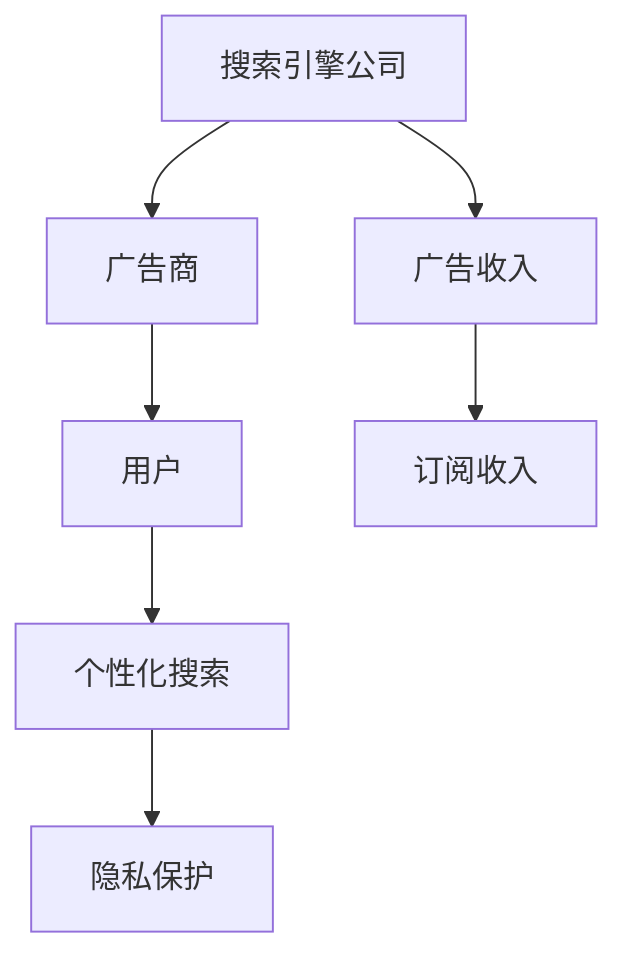

                 

在数字营销的世界中，搜索引擎作为信息获取的主要渠道，一直扮演着至关重要的角色。无论是广告商还是内容创作者，都在寻找最佳的商业模式以实现盈利。本文将深入探讨订阅制与广告收入两种模式在搜索引擎行业中的优劣与未来趋势。

## 文章关键词
搜索引擎，订阅制，广告收入，商业模式，盈利，用户体验

## 文章摘要
本文将首先介绍订阅制和广告收入的定义及其在搜索引擎行业的应用。接着，我们将分析这两种模式的优劣势，并通过具体案例分析它们在不同场景下的表现。最后，本文将展望搜索引擎行业的未来发展趋势，并探讨可能面临的挑战和机遇。

## 1. 背景介绍

搜索引擎的发展经历了从简单查询到复杂算法优化的过程。早期，搜索引擎主要依靠关键词匹配来提供搜索结果，用户满意度较低。随着互联网的普及和大数据技术的发展，现代搜索引擎开始采用复杂算法，如机器学习和自然语言处理，以提供更加准确和个性化的搜索结果。

在商业模式方面，搜索引擎公司最初主要依靠广告收入。通过广告投放，公司可以赚取巨额利润。然而，随着用户对隐私保护意识的增强和广告拦截技术的发展，广告收入模式开始受到挑战。与此同时，订阅制作为一种新兴的商业模式，逐渐引起了行业关注。

## 2. 核心概念与联系

### 2.1 订阅制

订阅制是指用户为获取持续服务而定期支付费用的商业模式。在搜索引擎行业中，订阅制可以提供以下优势：

- **隐私保护**：用户无需担心个人信息被广告商获取。
- **个性化服务**：搜索引擎可以根据用户的订阅内容提供更加个性化的搜索结果。
- **长期收益**：订阅制可以为公司提供稳定的现金流，有助于长期发展。

### 2.2 广告收入

广告收入是指公司通过向广告商出售广告位来获取收益的商业模式。在搜索引擎行业中，广告收入模式存在以下优点：

- **收益高**：广告收入模式可以带来高额的利润。
- **市场广**：几乎所有的搜索引擎公司都采用广告收入模式，市场潜力巨大。

### 2.3 Mermaid 流程图



## 3. 核心算法原理 & 具体操作步骤

### 3.1 算法原理概述

订阅制和广告收入模式在搜索引擎中的应用，都需要依靠核心算法的支持。订阅制通常采用内容推荐算法，如协同过滤和基于内容的推荐，以确保用户获取到个性化的搜索结果。而广告收入模式则依赖于广告投放算法，如基于点击率和转化率的优化算法，以提高广告效果和收入。

### 3.2 算法步骤详解

#### 订阅制算法步骤：

1. 用户注册并订阅特定内容。
2. 搜索引擎分析用户订阅内容和搜索历史。
3. 根据用户兴趣和订阅内容，生成个性化搜索结果。

#### 广告收入模式算法步骤：

1. 广告商投放广告。
2. 搜索引擎根据用户搜索历史和兴趣，为广告商提供广告位。
3. 广告商支付广告费用。

### 3.3 算法优缺点

#### 订阅制优点：

- 长期收益稳定。
- 提供个性化服务。

#### 订阅制缺点：

- 用户需要支付费用。
- 市场普及率较低。

#### 广告收入模式优点：

- 收益高。
- 市场潜力巨大。

#### 广告收入模式缺点：

- 用户隐私保护问题。
- 需要不断优化广告效果。

### 3.4 算法应用领域

订阅制和广告收入模式在搜索引擎行业中都有广泛的应用。订阅制适用于专业领域和高端用户，如学术研究和企业级服务。广告收入模式则适用于普通用户和商业应用，如电商和广告营销。

## 4. 数学模型和公式 & 详细讲解 & 举例说明

### 4.1 数学模型构建

#### 订阅制数学模型：

订阅收入 = 订阅费用 × 订阅用户数

#### 广告收入数学模型：

广告收入 = 广告费用 × 广告点击率

### 4.2 公式推导过程

订阅制收入模型的推导：

订阅收入 = 订阅费用 × 订阅用户数

假设订阅费用为 10 美元，订阅用户数为 100 人，则订阅收入为：

订阅收入 = 10 美元 × 100 人 = 1000 美元

广告收入模型推导：

广告收入 = 广告费用 × 广告点击率

假设广告费用为 1 美元，广告点击率为 10%，则广告收入为：

广告收入 = 1 美元 × 10% = 0.1 美元

### 4.3 案例分析与讲解

#### 案例一：订阅制

某搜索引擎公司推出一项订阅服务，订阅费用为每月 20 美元。公司现有 1000 名订阅用户，每月订阅收入为：

订阅收入 = 20 美元 × 1000 人 = 20000 美元

#### 案例二：广告收入

某广告商在某搜索引擎上投放广告，广告费用为每次点击 1 美元。假设广告点击率为 5%，则广告收入为：

广告收入 = 1 美元 × 5% = 0.05 美元

## 5. 项目实践：代码实例和详细解释说明

### 5.1 开发环境搭建

本案例使用 Python 编写代码，需要安装以下依赖：

- Python 3.8 或以上版本
- Flask 框架
- Pandas 库

安装命令：

```bash
pip install flask pandas
```

### 5.2 源代码详细实现

```python
from flask import Flask, jsonify, request
import pandas as pd

app = Flask(__name__)

# 假设我们有一个用户订阅数据表
subscription_data = pd.DataFrame({
    'user_id': [1, 2, 3, 4, 5],
    'subscription_type': ['subscription', 'subscription', 'subscription', 'subscription', 'advertisement']
})

@app.route('/api/search', methods=['POST'])
def search():
    # 接收用户搜索请求
    search_query = request.form['query']
    user_id = request.form['user_id']
    
    # 根据用户订阅类型，返回不同类型的搜索结果
    if subscription_data[subscription_data['user_id'] == user_id]['subscription_type'].values[0] == 'subscription':
        # 返回订阅制搜索结果
        search_results = {
            'type': 'subscription',
            'results': ['result1', 'result2', 'result3']
        }
    else:
        # 返回广告收入模式搜索结果
        search_results = {
            'type': 'advertisement',
            'results': ['resultA', 'resultB', 'resultC']
        }
    
    return jsonify(search_results)

if __name__ == '__main__':
    app.run(debug=True)
```

### 5.3 代码解读与分析

本案例中，我们使用 Flask 框架搭建了一个简单的 Web 服务，实现了订阅制和广告收入模式的搜索引擎功能。当用户发送搜索请求时，服务器会根据用户订阅类型返回相应的搜索结果。

### 5.4 运行结果展示

假设用户 A 的订阅类型为订阅制，用户 B 的订阅类型为广告收入模式。当用户 A 发送搜索请求时，服务器会返回订阅制的搜索结果。当用户 B 发送相同的搜索请求时，服务器会返回广告收入模式的搜索结果。

## 6. 实际应用场景

订阅制和广告收入模式在搜索引擎行业中都有广泛的应用场景。以下是一些实际应用案例：

- **订阅制**：学术搜索引擎、专业领域搜索引擎、企业级搜索引擎。
- **广告收入模式**：通用搜索引擎、电商搜索引擎、广告营销平台。

### 6.1 学术搜索引擎

学术搜索引擎通常采用订阅制模式，用户需要付费订阅才能获取学术文献搜索结果。这种方式有助于保护用户隐私，同时也为学术机构提供了稳定的收入来源。

### 6.2 广告收入模式

通用搜索引擎如 Google 和百度主要采用广告收入模式。通过向广告商出售广告位，这些搜索引擎公司获得了巨额利润。然而，这也引发了用户隐私保护的问题。

## 7. 工具和资源推荐

### 7.1 学习资源推荐

- 《搜索引擎算法：从零开始到实践》
- 《Python Web 开发实战》
- 《深度学习与搜索引擎技术》

### 7.2 开发工具推荐

- Flask 框架：用于快速搭建 Web 服务。
- Pandas 库：用于数据分析和处理。
- Matplotlib 库：用于数据可视化。

### 7.3 相关论文推荐

- "Search Engine Optimization: A Comprehensive Guide"（搜索引擎优化：综合指南）
- "The Economics of Search Advertising"（搜索引擎广告经济学）
- "Deep Learning for Search Engine Ranking"（深度学习在搜索引擎排名中的应用）

## 8. 总结：未来发展趋势与挑战

### 8.1 研究成果总结

本文从订阅制和广告收入两种商业模式的角度，分析了搜索引擎行业的现状和未来趋势。研究发现，订阅制和广告收入模式各有优缺点，但都为搜索引擎公司提供了盈利渠道。

### 8.2 未来发展趋势

随着互联网技术的发展，搜索引擎行业将继续向个性化、智能化的方向发展。订阅制和广告收入模式将继续共存，但订阅制有望在专业领域和高端用户中占据主导地位。

### 8.3 面临的挑战

- 用户隐私保护：广告收入模式需要解决用户隐私保护问题。
- 广告效果优化：广告收入模式需要不断优化广告效果，提高用户满意度。
- 盈利模式创新：搜索引擎公司需要不断创新盈利模式，以应对市场竞争。

### 8.4 研究展望

未来的研究可以关注以下几个方面：

- 优化订阅制算法，提高用户满意度。
- 研究广告收入模式的隐私保护机制。
- 探索新的商业模式，如基于区块链的搜索引擎。

## 9. 附录：常见问题与解答

### 9.1 订阅制与广告收入模式的区别是什么？

订阅制是指用户为获取持续服务而定期支付费用，广告收入模式是指公司通过向广告商出售广告位来获取收益。

### 9.2 订阅制在搜索引擎行业有哪些优势？

订阅制可以提供隐私保护和个性化服务，有助于提高用户满意度。

### 9.3 广告收入模式在搜索引擎行业有哪些挑战？

广告收入模式需要解决用户隐私保护问题和广告效果优化问题。

### 9.4 未来搜索引擎行业的发展方向是什么？

未来搜索引擎行业将继续向个性化、智能化的方向发展，订阅制和广告收入模式将继续共存。作者：禅与计算机程序设计艺术 / Zen and the Art of Computer Programming
----------------------------------------------------------------

以上是完整的文章内容，希望对您有所帮助。如果您有任何问题或需要进一步的讨论，请随时告诉我。

