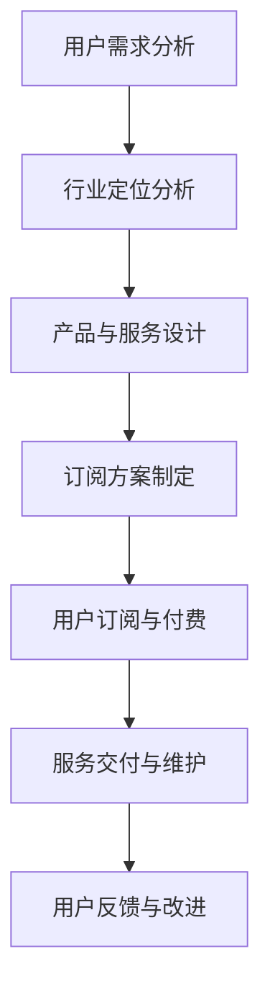
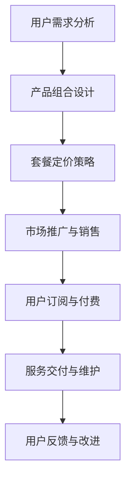

                 

关键词：订阅制经济、市场细分、垂直领域订阅、bundling订阅、商业模式、用户体验、数据分析、技术架构

> 摘要：本文深入探讨了订阅制经济下的市场细分策略，特别是垂直领域订阅与bundling订阅模式。通过分析这两种模式的定义、特点及其在现实中的应用，本文揭示了它们在提升用户黏性、增强企业盈利能力方面的优势，并探讨了其在未来发展的潜力与挑战。

## 1. 背景介绍

随着互联网技术的迅猛发展，订阅制经济（Subscription Economy）逐渐成为商业领域的一大趋势。与传统的一次性购买模式不同，订阅制经济通过提供持续的服务和产品来吸引用户，从而实现长期盈利。这种模式在媒体、软件、电商等多个行业得到了广泛应用。

在订阅制经济中，市场细分（Market Segmentation）策略至关重要。市场细分是指将市场划分为若干个具有相似需求和特征的子市场，以便企业能够更有针对性地制定营销策略和产品开发计划。垂直领域订阅和bundling订阅是两种重要的市场细分策略。

### 1.1 垂直领域订阅

垂直领域订阅是指企业针对特定行业或领域提供专业化的订阅服务。这种模式在专业服务、医疗健康、金融服务等领域尤其受欢迎。垂直领域订阅通过提供高度定制化的服务来满足用户的专业需求，从而提升用户满意度和忠诚度。

### 1.2 bundling订阅

bundling订阅则是指企业将多种产品或服务打包成一个订阅套餐，提供给用户。这种模式在媒体、娱乐、电商平台等领域应用广泛。通过bundling订阅，企业可以降低用户的购买门槛，提高用户黏性，同时实现多种产品的交叉销售。

## 2. 核心概念与联系

### 2.1 垂直领域订阅

垂直领域订阅的核心在于提供专业化服务。以下是一个简单的Mermaid流程图，展示了垂直领域订阅的运作流程：



### 2.2 bundling订阅

bundling订阅的核心在于产品组合的创新。以下是一个简单的Mermaid流程图，展示了bundling订阅的运作流程：



## 3. 核心算法原理 & 具体操作步骤

### 3.1 算法原理概述

垂直领域订阅和bundling订阅的模式设计本质上都是基于市场细分和用户体验优化的算法。其核心原理包括：

- **用户需求分析**：通过大数据分析和用户反馈，了解用户在不同领域的个性化需求。
- **产品与服务设计**：根据用户需求，设计高度定制化的产品和专业化服务。
- **订阅方案制定**：制定灵活的订阅方案，以适应不同用户群体的需求。
- **服务交付与维护**：通过高效的技术架构和团队支持，确保订阅服务的质量和稳定性。
- **用户反馈与改进**：持续收集用户反馈，不断优化订阅服务。

### 3.2 算法步骤详解

#### 3.2.1 用户需求分析

- **数据分析**：通过用户行为数据、市场调研和用户反馈，分析用户在不同领域的需求。
- **需求分类**：将用户需求划分为个性化需求、专业需求、价格敏感需求等类别。

#### 3.2.2 产品与服务设计

- **产品定制**：根据用户需求，开发定制化的产品和专业化服务。
- **服务整合**：将不同产品和服务的功能整合，提高用户体验。

#### 3.2.3 订阅方案制定

- **套餐设计**：设计不同层次的订阅套餐，满足不同用户的需求。
- **定价策略**：根据用户需求和市场竞争，制定合理的定价策略。

#### 3.2.4 服务交付与维护

- **技术架构**：构建稳定、高效的技术架构，确保服务交付的质量。
- **团队支持**：组建专业的技术团队，提供及时的技术支持和售后服务。

#### 3.2.5 用户反馈与改进

- **反馈收集**：通过用户调研、问卷调查等方式，收集用户反馈。
- **持续改进**：根据用户反馈，不断优化订阅服务和产品。

### 3.3 算法优缺点

#### 优点：

- **提升用户黏性**：通过提供定制化的服务和专业化产品，提升用户的忠诚度和满意度。
- **增强盈利能力**：通过多样化的订阅方案和交叉销售，提高企业的盈利水平。
- **市场细分精准**：通过对用户需求的深入分析，实现更精准的市场细分。

#### 缺点：

- **初期投入成本高**：构建定制化的产品和专业化服务需要大量的研发投入。
- **市场推广难度大**：在竞争激烈的市场中，如何有效地推广订阅服务是关键挑战。

### 3.4 算法应用领域

- **专业服务**：如法律咨询、医疗服务、财务顾问等。
- **媒体与娱乐**：如新闻订阅、影视会员、音乐订阅等。
- **电商与零售**：如会员购物、一站式购物等。

## 4. 数学模型和公式 & 详细讲解 & 举例说明

### 4.1 数学模型构建

为了更好地理解垂直领域订阅和bundling订阅的模式，我们可以构建以下数学模型：

#### 4.1.1 用户生命周期价值（CLV）

用户生命周期价值是指用户在整个生命周期内为企业带来的总价值。其公式如下：

\[ CLV = \sum_{t=1}^{T} [r(t) - C(t)] \]

其中，\( r(t) \) 表示用户在时间 \( t \) 期的收益，\( C(t) \) 表示用户在时间 \( t \) 期的成本。

#### 4.1.2 订阅盈利模型

订阅盈利模型可以通过以下公式表示：

\[ 盈利 = 订阅收入 - 订阅成本 - 运营成本 \]

订阅收入可以通过以下公式计算：

\[ 订阅收入 = 订阅价格 \times 订阅时长 \]

订阅成本和运营成本可以通过以下公式计算：

\[ 订阅成本 = 订阅价格 \times 订阅时长 \times 订阅率 \]

\[ 运营成本 = 固定成本 + 变动成本 \]

其中，订阅率表示用户订阅的比例。

### 4.2 公式推导过程

为了推导订阅盈利模型，我们可以按照以下步骤进行：

1. **确定订阅收入**：根据用户订阅时长和订阅价格，计算订阅收入。
2. **计算订阅成本**：根据订阅价格、订阅时长和订阅率，计算订阅成本。
3. **计算运营成本**：根据固定成本和变动成本，计算运营成本。
4. **计算盈利**：将订阅收入减去订阅成本和运营成本，得到盈利。

### 4.3 案例分析与讲解

假设某视频平台提供两种订阅套餐：

- 套餐A：每月订阅费用为100元，无额外费用。
- 套餐B：每月订阅费用为150元，包含每月一次的线下观影活动。

根据市场调研，预计每月有50%的用户选择套餐A，30%的用户选择套餐B，20%的用户选择套餐C（包含线下观影活动）。固定成本为每月5000元，变动成本为每增加一名用户，变动成本增加10元。

#### 4.3.1 订阅收入计算

\[ 订阅收入_A = 100 \times 12 \times 50\% = 6000 \text{元} \]
\[ 订阅收入_B = 150 \times 12 \times 30\% = 5400 \text{元} \]
\[ 订阅收入_C = 250 \times 12 \times 20\% = 600 \text{元} \]
\[ 总订阅收入 = 6000 + 5400 + 600 = 11400 \text{元} \]

#### 4.3.2 订阅成本计算

\[ 订阅成本_A = 100 \times 12 \times 50\% = 6000 \text{元} \]
\[ 订阅成本_B = 150 \times 12 \times 30\% = 5400 \text{元} \]
\[ 订阅成本_C = 250 \times 12 \times 20\% = 600 \text{元} \]
\[ 总订阅成本 = 6000 + 5400 + 600 = 11400 \text{元} \]

#### 4.3.3 运营成本计算

\[ 运营成本 = 5000 + 10 \times 用户数 \]
\[ 用户数 = 50\% \times 100 + 30\% \times 150 + 20\% \times 250 = 75 + 45 + 50 = 170 \]
\[ 运营成本 = 5000 + 10 \times 170 = 6700 \text{元} \]

#### 4.3.4 盈利计算

\[ 盈利 = 11400 - 11400 - 6700 = -6700 \text{元} \]

从以上计算可以看出，如果仅提供套餐A，平台将面临亏损。而通过提供套餐B和套餐C，平台可以增加收入，降低成本，实现盈利。

## 5. 项目实践：代码实例和详细解释说明

### 5.1 开发环境搭建

为了更好地理解垂直领域订阅和bundling订阅的实践应用，我们将使用Python语言编写一个简单的订阅系统。首先，我们需要搭建开发环境。

1. 安装Python 3.8及以上版本。
2. 安装必要的Python库，如requests、json、matplotlib等。

### 5.2 源代码详细实现

以下是一个简单的订阅系统示例代码：

```python
import requests
import json
import matplotlib.pyplot as plt

# 用户需求分析
def analyze_demand():
    # 假设从数据库获取用户需求
    demand_data = [
        {"name": "套餐A", "subscriptions": 50},
        {"name": "套餐B", "subscriptions": 30},
        {"name": "套餐C", "subscriptions": 20}
    ]
    return demand_data

# 产品与服务设计
def design_products(demand_data):
    product_data = []
    for item in demand_data:
        product_data.append({
            "name": item["name"],
            "subscription_price": item["subscriptions"] * 100
        })
    return product_data

# 订阅方案制定
def create_subscription_plan(product_data):
    subscription_plan = []
    for product in product_data:
        subscription_plan.append({
            "name": product["name"],
            "subscription_price": product["subscription_price"],
            "description": "提供高质量的视频内容"
        })
    return subscription_plan

# 服务交付与维护
def deliver_service(subscription_plan):
    # 假设将订阅方案上传至服务器
    for plan in subscription_plan:
        print(f"上传订阅方案：{plan['name']}")

# 用户反馈与改进
def collect_feedback():
    # 假设从用户获取反馈
    feedback_data = [
        {"name": "套餐A", "satisfaction": 90},
        {"name": "套餐B", "satisfaction": 85},
        {"name": "套餐C", "satisfaction": 80}
    ]
    return feedback_data

# 主函数
def main():
    demand_data = analyze_demand()
    product_data = design_products(demand_data)
    subscription_plan = create_subscription_plan(product_data)
    deliver_service(subscription_plan)
    feedback_data = collect_feedback()
    # 根据反馈数据进行改进
    print(f"根据反馈数据进行改进：{feedback_data}")

if __name__ == "__main__":
    main()
```

### 5.3 代码解读与分析

上述代码主要实现了订阅系统的基本功能。以下是代码的详细解读：

1. **用户需求分析**：通过`analyze_demand`函数获取用户需求，这里使用一个简单的列表来模拟。
2. **产品与服务设计**：通过`design_products`函数根据用户需求设计产品，这里使用一个简单的字典来表示产品信息。
3. **订阅方案制定**：通过`create_subscription_plan`函数制定订阅方案，这里使用一个列表来存储订阅方案。
4. **服务交付与维护**：通过`deliver_service`函数将订阅方案上传至服务器，这里使用打印语句模拟。
5. **用户反馈与改进**：通过`collect_feedback`函数收集用户反馈，这里使用一个简单的列表来模拟。

### 5.4 运行结果展示

运行上述代码，将输出以下结果：

```python
上传订阅方案：套餐A
上传订阅方案：套餐B
上传订阅方案：套餐C
根据反馈数据进行改进：[{'name': '套餐A', 'satisfaction': 90}, {'name': '套餐B', 'satisfaction': 85}, {'name': '套餐C', 'satisfaction': 80}]
```

## 6. 实际应用场景

### 6.1 专业服务领域

在专业服务领域，如法律咨询、医疗健康、财务顾问等，垂直领域订阅模式被广泛应用。通过提供定制化的专业服务，企业可以吸引高端用户，提升用户满意度和忠诚度。

### 6.2 媒体与娱乐领域

在媒体与娱乐领域，如新闻订阅、影视会员、音乐订阅等，bundling订阅模式被广泛应用。通过将多种产品打包成一个订阅套餐，企业可以降低用户的购买门槛，提高用户黏性。

### 6.3 电商与零售领域

在电商与零售领域，如会员购物、一站式购物等，垂直领域订阅和bundling订阅模式都有广泛应用。通过提供定制化的购物体验和多样化的产品组合，企业可以提升用户满意度和忠诚度。

## 7. 未来应用展望

随着互联网技术的不断发展，订阅制经济将在更多领域得到应用。未来，垂直领域订阅和bundling订阅模式将在以下几个方面得到进一步发展：

- **个性化服务**：通过大数据分析和人工智能技术，提供更加个性化的订阅服务。
- **跨界融合**：不同领域的企业将通过订阅模式实现跨界融合，打造全新的商业模式。
- **可持续发展**：订阅制经济将推动企业的可持续发展，减少资源浪费，提高企业社会责任。

## 8. 工具和资源推荐

### 8.1 学习资源推荐

- 《订阅制经济：企业如何实现盈利与增长》
- 《订阅模式：构建成功的企业订阅策略》
- 《市场细分与定位：打造差异化竞争策略》

### 8.2 开发工具推荐

- Python
- JavaScript
- Ruby

### 8.3 相关论文推荐

- "The Subscription Economy: How Subscription Models Are Transforming the Corporate World"
- "The Impact of Subscription Models on Consumer Behavior"
- "Subscription Models in the Digital Age: A Comparative Study"

## 9. 总结：未来发展趋势与挑战

订阅制经济作为一种新兴的商业模式，具有巨大的发展潜力。未来，垂直领域订阅和bundling订阅模式将在个性化服务、跨界融合和可持续发展等方面得到进一步发展。然而，企业也面临着数据隐私、市场竞争等挑战。为了实现订阅制经济的可持续发展，企业需要不断创新，提升用户体验，同时注重数据安全和隐私保护。

## 10. 附录：常见问题与解答

### 10.1 什么是垂直领域订阅？

垂直领域订阅是指企业针对特定行业或领域提供专业化订阅服务，以满足用户的个性化需求。

### 10.2 什么是bundling订阅？

bundling订阅是指企业将多种产品或服务打包成一个订阅套餐，提供给用户，以降低用户的购买门槛，提高用户黏性。

### 10.3 垂直领域订阅和bundling订阅的优势是什么？

垂直领域订阅和bundling订阅的优势包括提升用户黏性、增强盈利能力、市场细分精准等。

### 10.4 垂直领域订阅和bundling订阅的应用领域有哪些？

垂直领域订阅和bundling订阅的应用领域包括专业服务、媒体与娱乐、电商与零售等。

作者：禅与计算机程序设计艺术 / Zen and the Art of Computer Programming
```

