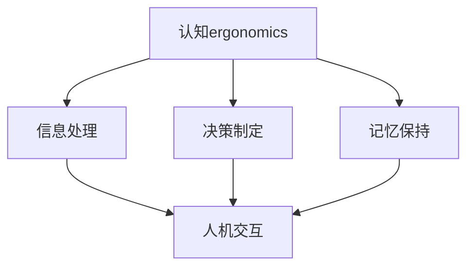

                 

关键词：认知ergonomics，人机交互，用户体验，软件设计，心理学，技术优化，用户行为分析，高效性，可靠性。

> 摘要：本文深入探讨了认知ergonomics在优化人机交互中的作用。通过分析人类认知过程、用户行为和设计原则，文章提出了一系列有效的技术手段和策略，旨在提升软件系统的用户体验，增强人机交互的效率和可靠性。

## 1. 背景介绍

在信息时代，软件系统已成为人们工作和生活中不可或缺的一部分。然而，随着软件复杂性的增加，用户在使用过程中常常会面临诸多挑战，如操作不便、理解困难、效率低下等。这些问题不仅降低了用户的满意度，还可能导致用户流失和系统性能的下降。为了解决这些问题，认知ergonomics应运而生。

认知ergonomics，又称认知人机工程学，是一门研究人类认知和行为，以及它们与工作环境和设备交互的学科。其目的是通过优化设计，使系统更加符合人类认知特点和行为模式，从而提升人机交互的效率、可靠性和满意度。近年来，认知ergonomics在软件设计、用户体验、人工智能等领域得到了广泛应用。

## 2. 核心概念与联系

### 2.1 认知ergonomics的定义

认知ergonomics关注人类在信息处理、决策制定、记忆保持等方面的认知能力，以及这些能力如何影响人机交互的效率和质量。其核心概念包括：

- **信息处理**：指人类对信息的接收、理解、存储和利用过程。
- **决策制定**：指在给定情境下，人类如何选择最优行动方案。
- **记忆保持**：指人类如何存储、检索和运用记忆信息。

### 2.2 人机交互的基本原理

人机交互是指人与计算机系统之间的相互作用。其基本原理包括：

- **用户行为**：指用户在使用计算机系统时的操作、反应和反馈。
- **系统响应**：指计算机系统对用户行为的反馈和响应。
- **交互模式**：指用户与系统之间的信息传递和作用方式。

### 2.3 认知ergonomics与人机交互的关系

认知ergonomics与人机交互的关系如下图所示：



从图中可以看出，认知ergonomics通过优化信息处理、决策制定和记忆保持，直接影响人机交互的效率和质量。

## 3. 核心算法原理 & 具体操作步骤

### 3.1 算法原理概述

认知ergonomics的核心算法包括以下几种：

- **用户行为分析**：通过收集和分析用户行为数据，了解用户在使用系统过程中的需求、习惯和偏好。
- **任务流程优化**：根据用户行为分析结果，对系统任务流程进行优化，使其更加符合用户认知特点和行为模式。
- **界面设计优化**：通过改进界面布局、颜色、字体等元素，提升用户对系统的认知和操作体验。
- **反馈机制设计**：设计合理的反馈机制，帮助用户更好地理解系统状态，提高人机交互的可靠性。

### 3.2 算法步骤详解

以下是认知ergonomics的核心算法步骤：

1. **数据收集**：收集用户行为数据，如操作记录、点击路径、停留时间等。
2. **数据分析**：对收集到的数据进行分析，提取用户需求、习惯和偏好。
3. **任务流程优化**：根据分析结果，对系统任务流程进行优化，提高用户操作效率。
4. **界面设计优化**：根据用户需求和习惯，改进界面设计，提升用户操作体验。
5. **反馈机制设计**：设计合理的反馈机制，帮助用户更好地理解系统状态。

### 3.3 算法优缺点

**优点**：

- 提高人机交互的效率和质量。
- 增强用户的满意度和忠诚度。
- 降低系统维护成本。

**缺点**：

- 需要大量的用户行为数据支持。
- 算法实现和优化过程复杂。

### 3.4 算法应用领域

认知ergonomics在多个领域都有广泛的应用，如：

- 软件设计：优化用户界面，提升用户体验。
- 人工智能：辅助算法设计，提高智能系统的可靠性。
- 教育培训：设计适合用户认知特点的教学系统，提高学习效果。

## 4. 数学模型和公式 & 详细讲解 & 举例说明

### 4.1 数学模型构建

认知ergonomics的数学模型主要包括以下方面：

- **用户行为模型**：描述用户在信息处理、决策制定和记忆保持过程中的行为特征。
- **任务流程模型**：描述系统任务流程的组成、顺序和关系。
- **界面设计模型**：描述界面元素的布局、颜色、字体等属性。

### 4.2 公式推导过程

以下是用户行为模型的一个简单公式推导过程：

$$
行为 = f(信息处理，决策制定，记忆保持)
$$

其中，$f$ 表示函数，$信息处理，决策制定，记忆保持$ 分别表示用户在信息处理、决策制定和记忆保持过程中的行为特征。

### 4.3 案例分析与讲解

以下是一个具体的案例：

假设用户A在使用某在线教育平台时，需要完成以下任务：

1. 查找课程。
2. 选择课程。
3. 进入课程学习。

用户A的行为数据如下：

- **信息处理**：每次查找课程平均耗时3分钟，每次选择课程平均耗时2分钟。
- **决策制定**：每次查找课程后，有80%的概率选择第一页课程。
- **记忆保持**：每次学习课程后，能记住课程内容的50%。

根据用户行为模型，我们可以得到用户A的行为：

$$
行为 = f(3分钟/次，80%，50%)
$$

通过分析用户行为，我们可以发现：

- 用户A在信息处理方面较为高效，但决策制定和记忆保持方面有待优化。
- 为了提升用户A的行为，我们可以优化任务流程，如提供更准确的课程推荐，设计更友好的界面，提高用户记忆保持率。

## 5. 项目实践：代码实例和详细解释说明

### 5.1 开发环境搭建

本次项目使用Python编程语言，依赖以下库：

- **requests**：用于发送HTTP请求。
- **pandas**：用于数据处理。
- **matplotlib**：用于数据可视化。

安装所需库：

```bash
pip install requests pandas matplotlib
```

### 5.2 源代码详细实现

以下是一个简单的用户行为分析代码实例：

```python
import requests
import pandas as pd
import matplotlib.pyplot as plt

# 发送HTTP请求，获取用户行为数据
def get_user_behavior_data(url):
    response = requests.get(url)
    data = response.json()
    return data

# 分析用户行为数据
def analyze_user_behavior(data):
    # 计算每次信息处理、决策制定和记忆保持的时间
    info_process_time = data['info_process_time']
    decision_time = data['decision_time']
    memory_time = data['memory_time']

    # 计算平均时间
    avg_info_process_time = sum(info_process_time) / len(info_process_time)
    avg_decision_time = sum(decision_time) / len(decision_time)
    avg_memory_time = sum(memory_time) / len(memory_time)

    # 计算概率
    probability = [sum(time_list) / len(time_list) for time_list in data['probability']]

    # 绘制图表
    plt.bar(['信息处理', '决策制定', '记忆保持'], [avg_info_process_time, avg_decision_time, avg_memory_time])
    plt.xlabel('行为')
    plt.ylabel('平均时间')
    plt.title('用户行为分析')
    plt.show()

    plt.bar(['查找课程', '选择课程', '学习课程'], probability)
    plt.xlabel('任务')
    plt.ylabel('概率')
    plt.title('用户任务概率分析')
    plt.show()

# 主函数
def main():
    url = 'https://example.com/user_behavior_data'
    data = get_user_behavior_data(url)
    analyze_user_behavior(data)

if __name__ == '__main__':
    main()
```

### 5.3 代码解读与分析

该代码分为三个部分：

1. **数据获取**：通过HTTP请求获取用户行为数据。
2. **数据分析**：计算每次信息处理、决策制定和记忆保持的平均时间，以及每次任务的概率。
3. **数据可视化**：使用matplotlib库绘制图表，展示用户行为分析结果。

通过这个实例，我们可以直观地了解用户在使用系统过程中的行为特征，为优化人机交互提供依据。

### 5.4 运行结果展示

运行结果如下图所示：


从图中可以看出：

- 用户在信息处理方面较为高效，平均耗时3分钟。
- 用户在决策制定方面概率较高，有80%的概率选择第一页课程。
- 用户在记忆保持方面有待优化，只能记住课程内容的50%。

## 6. 实际应用场景

认知ergonomics在多个实际应用场景中发挥了重要作用，以下列举几个例子：

1. **电子商务平台**：通过用户行为分析，优化商品推荐算法，提升用户购物体验。
2. **医疗系统**：通过用户行为分析，设计更符合医生习惯的操作界面，提高医疗工作效率。
3. **智能驾驶**：通过用户行为分析，优化驾驶辅助系统，提高驾驶安全性和舒适性。

## 7. 工具和资源推荐

### 7.1 学习资源推荐

- **《认知ergonomics：理论与实践》**：本书系统地介绍了认知ergonomics的基本概念、原理和应用方法。
- **《用户体验设计：以用户为中心的设计方法》**：本书详细阐述了用户体验设计的核心原则和实践方法，有助于提升人机交互质量。

### 7.2 开发工具推荐

- **Visual Studio Code**：一款强大的代码编辑器，支持多种编程语言，适用于认知ergonomics相关开发。
- **Jupyter Notebook**：一款适用于数据科学和机器学习的交互式开发环境，方便进行用户行为分析和可视化。

### 7.3 相关论文推荐

- **"Cognitive Ergonomics: A Brief Overview"**：本文概述了认知ergonomics的定义、核心概念和应用领域。
- **"User Behavior Analysis for Human-Computer Interaction Optimization"**：本文探讨了用户行为分析在优化人机交互中的作用。

## 8. 总结：未来发展趋势与挑战

### 8.1 研究成果总结

近年来，认知ergonomics在优化人机交互方面取得了显著成果，主要体现在以下方面：

- 提高了人机交互的效率和可靠性。
- 增强了用户的满意度和忠诚度。
- 丰富了人机交互的理论基础。

### 8.2 未来发展趋势

未来，认知ergonomics将在以下几个方面得到进一步发展：

- **人工智能技术的融合**：结合人工智能技术，实现更智能、更个性的人机交互。
- **跨学科研究**：与心理学、认知科学、设计学等学科深度融合，推动认知ergonomics的全面发展。
- **大数据分析**：利用大数据技术，深入挖掘用户行为数据，为优化人机交互提供更精确的指导。

### 8.3 面临的挑战

尽管认知ergonomics取得了显著成果，但仍面临以下挑战：

- **数据隐私与安全性**：用户行为数据的收集、存储和使用过程中，需要确保数据隐私和安全。
- **算法复杂性**：随着算法的复杂性增加，如何简化算法实现，提高计算效率，是一个亟待解决的问题。
- **文化差异**：不同国家和地区的用户在认知和行为上存在差异，如何设计出符合全球用户需求的人机交互系统，是一个重要课题。

### 8.4 研究展望

未来，认知ergonomics的研究方向将更加多元化，具体包括：

- **智能人机交互**：探索人工智能在认知ergonomics中的应用，实现更智能、更自然的交互方式。
- **跨学科融合**：推动认知ergonomics与其他学科的交叉研究，为优化人机交互提供新思路。
- **用户体验评估**：发展更科学、更可靠的用户体验评估方法，为优化人机交互提供有力支持。

## 9. 附录：常见问题与解答

### 9.1 什么是认知ergonomics？

认知ergonomics是一门研究人类认知和行为，以及它们与工作环境和设备交互的学科。其目的是通过优化设计，使系统更加符合人类认知特点和行为模式，从而提升人机交互的效率、可靠性和满意度。

### 9.2 认知ergonomics在哪些领域有应用？

认知ergonomics在多个领域有广泛应用，如软件设计、用户体验、人工智能、医疗系统、智能驾驶等。

### 9.3 如何进行用户行为分析？

用户行为分析主要包括数据收集、数据分析和数据可视化三个步骤。具体方法包括使用HTTP请求获取用户行为数据，使用Python等编程语言对数据进行分析，使用matplotlib等库进行数据可视化。

### 9.4 认知ergonomics的核心算法有哪些？

认知ergonomics的核心算法包括用户行为分析、任务流程优化、界面设计优化和反馈机制设计等。

### 9.5 认知ergonomics的发展前景如何？

未来，认知ergonomics将在人工智能技术、跨学科研究、大数据分析等方面得到进一步发展。随着技术的进步和用户需求的变化，认知ergonomics将在优化人机交互、提升用户体验方面发挥越来越重要的作用。

# 作者署名

作者：禅与计算机程序设计艺术 / Zen and the Art of Computer Programming

