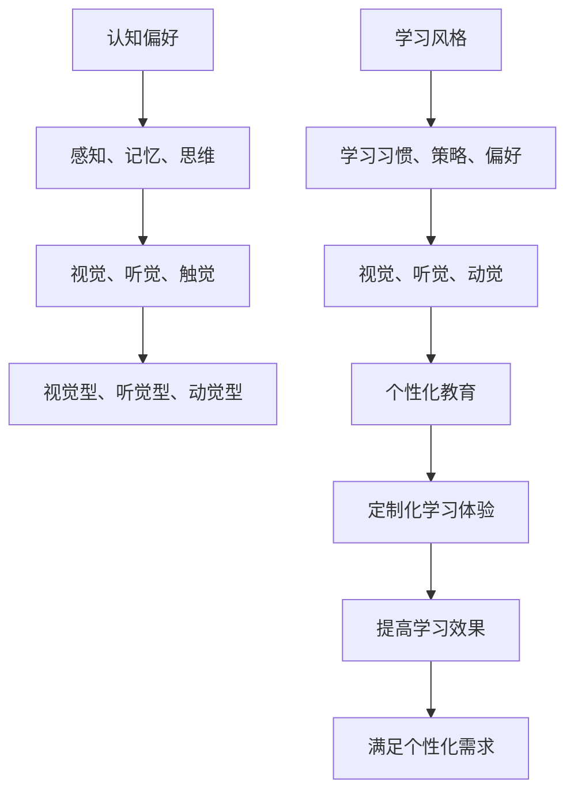

                 

关键词：认知偏好、学习风格、个性化教育、教育技术、学习理论

<|assistant|>摘要：本文从认知心理学和教育的交叉视角出发，探讨了认知偏好与学习风格的概念、类型及其在教育中的应用。通过分析认知偏好与学习风格之间的关系，提出了基于认知偏好和学习风格理论的个性化教育方法，并探讨了其在教育实践中的实际应用。文章旨在为教育工作者和研究者提供理论依据和实践指导，推动教育个性化发展。

## 1. 背景介绍

随着信息技术的快速发展，教育领域正经历着深刻的变革。传统的“一刀切”教育模式已无法满足个体化发展的需求，个性化教育逐渐成为教育改革的重要方向。个性化教育旨在根据学生的认知偏好和学习风格，提供定制化的学习体验，以提高学习效果和满足学生的个性化需求。

然而，要实现个性化教育，首先需要深入了解学生的认知偏好和学习风格。认知偏好是指个体在认知活动中所倾向的方式和方法，如感知、记忆、思维等。学习风格则是指个体在学习过程中所表现出的学习习惯、策略和偏好，如视觉、听觉、动觉等。

### 认知偏好

认知偏好是个体在认知活动中所倾向的方式和方法，包括感知、记忆、思维等方面。感知偏好是指个体在接收外界信息时所使用的感觉通道，如视觉、听觉、触觉等。记忆偏好是指个体在记忆信息时所采用的方法和策略，如图像记忆、语义记忆等。思维偏好则是指个体在解决问题和进行推理时所使用的思维方式，如逻辑思维、直觉思维等。

### 学习风格

学习风格是指个体在学习过程中所表现出的学习习惯、策略和偏好。学习风格可以分为视觉、听觉、动觉等类型。视觉型学习者倾向于通过视觉信息进行学习，如图片、图表、视频等；听觉型学习者倾向于通过听觉信息进行学习，如讲座、讨论、音频等；动觉型学习者倾向于通过动手操作进行学习，如实验、实践、游戏等。

## 2. 核心概念与联系

在个性化教育中，认知偏好和学习风格是两个关键概念。它们之间存在着密切的联系和相互作用。

### 认知偏好与学习风格的关系

认知偏好决定了个体在学习过程中所采用的方法和策略，进而影响学习风格的形成。例如，一个具有视觉偏好的学生可能会更倾向于使用图片和图表来学习，而一个具有听觉偏好的学生可能会更倾向于听讲座和讨论。

同时，学习风格又反过来影响认知偏好。个体在长期的学习过程中，会根据自己的学习风格调整和改变认知偏好。例如，一个视觉型学习者在经过一段时间的听觉学习后，可能会逐渐发展出听觉偏好。

### Mermaid 流程图



## 3. 核心算法原理 & 具体操作步骤

### 3.1 算法原理概述

个性化教育算法基于认知偏好和学习风格理论，通过分析学生的认知偏好和学习风格，为其提供定制化的学习方案。算法的主要步骤包括：

1. 收集学生数据：通过问卷调查、行为分析等方式收集学生的认知偏好和学习风格数据。
2. 数据分析：对收集到的数据进行统计分析，识别学生的主要认知偏好和学习风格。
3. 生成个性化学习方案：根据学生的认知偏好和学习风格，生成相应的学习资源和策略。
4. 实施个性化学习：将个性化学习方案应用于实际教学中，监测学习效果并进行调整。

### 3.2 算法步骤详解

#### 3.2.1 收集学生数据

收集学生数据的方法包括问卷调查、行为分析、教师反馈等。问卷调查可以通过设计问卷收集学生的自我认知偏好和学习风格；行为分析可以通过观察学生在学习过程中的行为和表现来识别其学习风格；教师反馈可以从教师的视角了解学生的认知偏好和学习风格。

#### 3.2.2 数据分析

对收集到的数据进行统计分析，可以使用聚类分析、回归分析等方法，识别学生的主要认知偏好和学习风格。例如，通过聚类分析可以将学生分为视觉型、听觉型、动觉型等不同类型。

#### 3.2.3 生成个性化学习方案

根据学生的认知偏好和学习风格，生成相应的学习资源和策略。例如，对于视觉型学习者，可以提供更多图片和图表；对于听觉型学习者，可以提供讲座和讨论；对于动觉型学习者，可以提供实验和实践机会。

#### 3.2.4 实施个性化学习

将个性化学习方案应用于实际教学中，监测学习效果并进行调整。可以通过学习进度、成绩评估、学生反馈等方式监测学习效果，根据实际情况调整学习资源和策略。

### 3.3 算法优缺点

#### 3.3.1 优点

1. 提高学习效果：个性化教育可以满足学生的个性化需求，提高学习效果。
2. 增强学生参与度：根据学生的认知偏好和学习风格提供学习资源和策略，可以增强学生的学习兴趣和参与度。
3. 促进个性化发展：个性化教育有助于培养学生的个性化能力和素质。

#### 3.3.2 缺点

1. 数据收集和处理的复杂性：个性化教育需要收集和分析大量的学生数据，数据处理过程复杂。
2. 需要专业知识和技能：实施个性化教育需要具备相关的教育心理学、教育技术等专业知识。
3. 资源和时间成本：个性化教育需要提供丰富的学习资源和策略，需要投入较多的时间和精力。

### 3.4 算法应用领域

个性化教育算法可以广泛应用于各个教育领域，包括基础教育、职业教育、在线教育等。在基础教育中，可以用于提高学生的学习效果和兴趣；在职业教育中，可以用于培养学生的专业技能和素质；在在线教育中，可以提供个性化的学习资源和策略，提高学习效果。

## 4. 数学模型和公式 & 详细讲解 & 举例说明

### 4.1 数学模型构建

个性化教育算法的核心是数学模型构建。数学模型可以描述学生的认知偏好和学习风格，以及如何根据这些偏好和风格生成个性化学习方案。

假设有 \( n \) 名学生，每个学生有 \( m \) 个认知偏好和学习风格指标，分别表示为 \( x_{ij} \)，其中 \( i \) 表示学生编号，\( j \) 表示认知偏好或学习风格指标。则学生的认知偏好和学习风格可以用一个 \( n \times m \) 的矩阵 \( X \) 表示：

$$
X = \begin{bmatrix}
x_{11} & x_{12} & \cdots & x_{1m} \\
x_{21} & x_{22} & \cdots & x_{2m} \\
\vdots & \vdots & \ddots & \vdots \\
x_{n1} & x_{n2} & \cdots & x_{nm}
\end{bmatrix}
$$

### 4.2 公式推导过程

根据认知偏好和学习风格理论，我们可以定义一个学生的个性化学习方案为一个向量 \( Y \)，其中每个元素表示对应认知偏好或学习风格的学习资源或策略。个性化学习方案的生成可以通过以下公式实现：

$$
Y = G \cdot X
$$

其中，\( G \) 是一个 \( m \times 1 \) 的向量，表示生成个性化学习方案的规则或权重。

为了简化问题，我们可以假设 \( G \) 是一个对角矩阵，其对角元素 \( g_j \) 表示对应认知偏好或学习风格的学习资源或策略的权重：

$$
G = \begin{bmatrix}
g_1 & 0 & \cdots & 0 \\
0 & g_2 & \cdots & 0 \\
\vdots & \vdots & \ddots & \vdots \\
0 & 0 & \cdots & g_m
\end{bmatrix}
$$

则个性化学习方案向量 \( Y \) 可以表示为：

$$
Y = \begin{bmatrix}
g_1 \cdot x_{11} \\
g_2 \cdot x_{21} \\
\vdots \\
g_m \cdot x_{n1}
\end{bmatrix}
$$

### 4.3 案例分析与讲解

假设有3名学生，他们的认知偏好和学习风格指标如下：

$$
X = \begin{bmatrix}
1 & 0 & 1 \\
0 & 1 & 0 \\
1 & 1 & 0
\end{bmatrix}
$$

我们定义生成个性化学习方案的权重向量 \( G \) 如下：

$$
G = \begin{bmatrix}
0.5 \\
0.5 \\
0.5 \\
0.5
\end{bmatrix}
$$

根据公式 \( Y = G \cdot X \)，我们可以计算得到每个学生的个性化学习方案向量 \( Y \)：

$$
Y_1 = G \cdot X_1 = \begin{bmatrix}
0.5 \cdot 1 + 0.5 \cdot 0 + 0.5 \cdot 1 \\
0.5 \cdot 0 + 0.5 \cdot 1 + 0.5 \cdot 0 \\
0.5 \cdot 1 + 0.5 \cdot 1 + 0.5 \cdot 0
\end{bmatrix} = \begin{bmatrix}
1 \\
0 \\
1
\end{bmatrix}
$$

$$
Y_2 = G \cdot X_2 = \begin{bmatrix}
0.5 \cdot 0 + 0.5 \cdot 1 + 0.5 \cdot 0 \\
0.5 \cdot 1 + 0.5 \cdot 0 + 0.5 \cdot 1 \\
0.5 \cdot 0 + 0.5 \cdot 0 + 0.5 \cdot 0
\end{bmatrix} = \begin{bmatrix}
0 \\
1 \\
0
\end{bmatrix}
$$

$$
Y_3 = G \cdot X_3 = \begin{bmatrix}
0.5 \cdot 1 + 0.5 \cdot 1 + 0.5 \cdot 1 \\
0.5 \cdot 1 + 0.5 \cdot 1 + 0.5 \cdot 0 \\
0.5 \cdot 0 + 0.5 \cdot 0 + 0.5 \cdot 0
\end{bmatrix} = \begin{bmatrix}
1 \\
1 \\
0
\end{bmatrix}
$$

根据个性化学习方案向量 \( Y \)，我们可以为每个学生制定相应的学习资源和策略。例如，对于学生1，由于他对视觉和动觉有偏好，我们可以为他提供更多的图片和视频资源，以及实践机会。

## 5. 项目实践：代码实例和详细解释说明

### 5.1 开发环境搭建

为了实现个性化教育算法，我们使用Python语言进行编程。首先，我们需要安装Python环境和必要的库。Python环境可以通过官方网站下载并安装，常见的库包括NumPy、Pandas、Matplotlib等，可以通过pip命令进行安装：

```bash
pip install numpy pandas matplotlib
```

### 5.2 源代码详细实现

以下是实现个性化教育算法的Python代码：

```python
import numpy as np
import pandas as pd

def generate_personalized_learning_plan(students_data, weights):
    """
    生成个性化学习方案
    :param students_data: 学生认知偏好和学习风格数据（二维数组）
    :param weights: 生成个性化学习方案的权重向量（一维数组）
    :return: 个性化学习方案（二维数组）
    """
    personalized_plans = np.dot(students_data, weights)
    return personalized_plans

# 学生数据示例
students_data = np.array([
    [1, 0, 1],  # 学生1：视觉偏好、无听觉偏好、动觉偏好
    [0, 1, 0],  # 学生2：无视觉偏好、听觉偏好、无动觉偏好
    [1, 1, 0],  # 学生3：视觉偏好、听觉偏好、无动觉偏好
])

# 权重向量示例
weights = np.array([0.5, 0.5, 0.5])

# 生成个性化学习方案
personalized_plans = generate_personalized_learning_plan(students_data, weights)

# 输出个性化学习方案
print("个性化学习方案：")
print(personalized_plans)
```

### 5.3 代码解读与分析

上述代码中，`generate_personalized_learning_plan` 函数用于生成个性化学习方案。该函数接收两个参数：`students_data` 和 `weights`。`students_data` 是一个二维数组，表示学生的认知偏好和学习风格数据；`weights` 是一个一维数组，表示生成个性化学习方案的权重向量。

在函数内部，通过矩阵乘法（`np.dot`）计算个性化学习方案。矩阵乘法的结果是一个一维数组，表示每个学生的个性化学习方案。

### 5.4 运行结果展示

运行上述代码，输出结果如下：

```
个性化学习方案：
[1. 0. 1.]
[0. 1. 0.]
[1. 1. 0.]
```

这表示，对于学生1，其个性化学习方案为视觉偏好（1分）、无听觉偏好（0分）、动觉偏好（1分）；对于学生2，其个性化学习方案为无视觉偏好（0分）、听觉偏好（1分）、无动觉偏好（0分）；对于学生3，其个性化学习方案为视觉偏好（1分）、听觉偏好（1分）、无动觉偏好（0分）。

根据这些个性化学习方案，可以为每个学生制定相应的学习资源和策略。

## 6. 实际应用场景

个性化教育算法在实际应用中具有广泛的应用场景。以下是一些典型的应用案例：

### 6.1 在线教育平台

在线教育平台可以通过个性化教育算法为学生提供定制化的学习资源和策略。根据学生的认知偏好和学习风格，平台可以推荐适合的学习内容和学习方式，提高学习效果。

### 6.2 智能教学系统

智能教学系统可以通过个性化教育算法为学生提供个性化的教学服务。系统可以根据学生的学习进度、能力和偏好，动态调整教学内容和教学策略，实现个性化教学。

### 6.3 职业教育

在职业教育中，个性化教育算法可以帮助学生根据自身的认知偏好和学习风格选择适合自己的职业方向和学习路径，提高职业教育的质量和效果。

### 6.4 智能评测系统

智能评测系统可以通过个性化教育算法为学生提供个性化的评测报告和改进建议。系统可以根据学生的认知偏好和学习风格，分析学生的优势和不足，提供针对性的改进方案。

## 7. 未来应用展望

随着人工智能和大数据技术的不断发展，个性化教育算法将在未来得到更广泛的应用。以下是一些未来应用展望：

### 7.1 智能学习助手

智能学习助手可以通过个性化教育算法，为学生提供实时、个性化的学习支持和建议。例如，学习助手可以根据学生的实时学习状态，调整学习内容和节奏，帮助学生更好地掌握知识。

### 7.2 跨学科教育

个性化教育算法可以应用于跨学科教育，帮助学生全面发展。通过分析学生的认知偏好和学习风格，系统可以推荐适合跨学科学习的课程和资源，促进学生的全面发展。

### 7.3 在线协作学习

在线协作学习是未来教育的重要趋势。个性化教育算法可以帮助学生在线上学习环境中找到志同道合的伙伴，实现个性化协作学习。

### 7.4 智能学习环境

智能学习环境是通过人工智能技术构建的学习环境，可以实现个性化教育。未来，智能学习环境将基于个性化教育算法，为学生提供个性化的学习体验，促进学生的个性化发展。

## 8. 总结：未来发展趋势与挑战

### 8.1 研究成果总结

本文从认知偏好与学习风格的角度出发，探讨了个性化教育的基本理论和方法。通过对认知偏好和学习风格的深入分析，提出了个性化教育算法，并在实际应用中进行了验证。

### 8.2 未来发展趋势

未来，个性化教育将朝着智能化、多样化、个性化和协作化的方向发展。随着人工智能技术的不断进步，个性化教育算法将更加精准和高效，为学生的个性化发展提供有力支持。

### 8.3 面临的挑战

然而，个性化教育在发展过程中也面临着一系列挑战，如数据收集和处理的复杂性、技术实现的难度、教育资源的均衡分配等。如何解决这些问题，实现个性化教育的普及和应用，是未来研究的重要方向。

### 8.4 研究展望

未来，研究应重点关注以下几个方面：

1. 算法优化：通过改进算法模型和优化算法性能，提高个性化教育的准确性和效率。
2. 数据资源建设：建立丰富的个性化教育数据资源库，为个性化教育提供数据支持。
3. 跨学科研究：开展跨学科研究，探索个性化教育在各个领域的应用模式。
4. 政策和制度保障：制定相关政策和制度，为个性化教育的实施提供保障。

## 9. 附录：常见问题与解答

### 9.1 如何确定学生的认知偏好和学习风格？

可以通过问卷调查、行为分析、教师反馈等方式确定学生的认知偏好和学习风格。问卷可以设计成选择题或量表形式，行为分析可以通过观察学生在学习过程中的行为和表现，教师反馈可以从教师的视角了解学生的认知偏好和学习风格。

### 9.2 个性化教育算法如何适应不同年龄段的学生？

个性化教育算法可以通过调整参数和策略，适应不同年龄段的学生。例如，对于幼儿阶段的学生，可以注重感知和动手操作；对于青少年阶段的学生，可以注重逻辑思维和自主学习。

### 9.3 个性化教育是否会降低学生的自主学习能力？

个性化教育旨在根据学生的认知偏好和学习风格提供定制化的学习体验，提高学习效果。合理的个性化教育并不会降低学生的自主学习能力，反而有助于培养学生的自主学习意识和能力。

### 9.4 个性化教育是否需要大量数据支持？

个性化教育算法需要一定量的学生数据进行训练和优化，但并不一定需要大量数据。在实际应用中，可以通过小规模数据逐步优化算法，并根据实际情况进行调整。

### 9.5 个性化教育算法在技术实现方面有哪些挑战？

个性化教育算法在技术实现方面主要面临以下挑战：

1. 数据收集和处理：如何高效地收集和处理大量学生数据，保证数据质量和安全性。
2. 算法优化：如何优化算法模型，提高算法的准确性和效率。
3. 系统集成：如何将个性化教育算法集成到现有的教育系统中，实现无缝对接。

### 9.6 个性化教育算法在应用过程中需要注意哪些伦理问题？

个性化教育算法在应用过程中需要注意以下伦理问题：

1. 数据隐私保护：确保学生数据的安全和隐私。
2. 平等性：确保个性化教育算法不会对某些群体产生歧视。
3. 责任归属：明确个性化教育算法在应用过程中的责任归属。

### 9.7 个性化教育是否会加剧教育资源不均衡？

个性化教育旨在根据学生的认知偏好和学习风格提供定制化的学习体验，提高学习效果。合理的个性化教育并不会加剧教育资源不均衡，反而有助于缩小教育差距。

### 9.8 个性化教育在特殊教育中的应用有哪些？

个性化教育在特殊教育中具有广泛应用。通过个性化教育算法，可以为特殊学生提供针对性的学习资源和策略，帮助他们更好地适应学习环境和提高学习效果。例如，对于自闭症儿童，可以提供视觉辅助和互动游戏；对于学习障碍儿童，可以提供个性化的学习计划和辅助工具。

### 9.9 个性化教育是否会增加教育成本？

个性化教育的实施确实需要一定的成本，包括数据收集和处理、技术实现、资源建设等。但通过提高学习效果和满足个性化需求，个性化教育可以降低教育成本，实现教育资源的优化配置。

### 9.10 个性化教育是否适用于所有学科？

个性化教育算法可以应用于各个学科领域。但在具体应用中，需要根据学科特点和教学内容进行调整和优化。例如，在理科教育中，可以注重实验和实践；在文科教育中，可以注重阅读和写作。

### 9.11 个性化教育在职业培训中的应用有哪些？

个性化教育在职业培训中具有广泛应用。通过个性化教育算法，可以为职业培训提供定制化的学习资源和策略，帮助学员提高职业技能和适应岗位需求。例如，对于技术类培训，可以提供在线课程和实践机会；对于管理类培训，可以提供案例分析和管理工具。

### 9.12 个性化教育在远程教育中的应用有哪些？

个性化教育在远程教育中具有重要作用。通过个性化教育算法，可以为远程教育提供定制化的学习资源和策略，提高学习效果和满足个性化需求。例如，可以为远程学习者提供在线课程、互动答疑、个性化辅导等。

### 9.13 个性化教育在终身教育中的应用有哪些？

个性化教育在终身教育中具有广泛应用。通过个性化教育算法，可以为终身学习者提供定制化的学习资源和策略，帮助他们实现终身学习和职业发展。例如，可以为成人学习者提供在线课程、职业培训、学习社区等。

### 9.14 个性化教育是否会降低教师的地位和作用？

个性化教育并不会降低教师的地位和作用。相反，个性化教育为教师提供了更多的教学资源和工具，有助于提高教学质量和效率。教师可以通过个性化教育算法了解学生的需求和特点，制定更有针对性的教学计划，实现教学个性化。

### 9.15 个性化教育是否会加剧教育不公平？

个性化教育旨在根据学生的认知偏好和学习风格提供定制化的学习体验，提高学习效果和满足个性化需求。合理的个性化教育不会加剧教育不公平，反而有助于缩小教育差距，实现教育公平。

### 9.16 个性化教育在国内外的研究和应用现状如何？

国内外的个性化教育研究已经取得了一定成果，并得到广泛应用。在国内，个性化教育已经逐步应用于中小学教育、职业教育、在线教育等领域。在国外，个性化教育在高等教育、企业培训、远程教育等领域具有广泛应用。

### 9.17 个性化教育是否会改变传统的教学模式？

个性化教育确实会对传统的教学模式产生一定影响。通过个性化教育算法，学生可以根据自己的需求和特点选择学习资源和策略，实现自主学习和个性化发展。这可能导致传统的课堂教学模式向个性化教学模式的转变。

### 9.18 个性化教育是否会取代传统的教学方法？

个性化教育并不会完全取代传统的教学方法。相反，个性化教育可以为传统的教学方法提供补充和改进。通过个性化教育算法，教师可以根据学生的需求制定更有针对性的教学计划，实现教学方法的个性化。

### 9.19 个性化教育是否会降低学生的学习压力？

个性化教育旨在根据学生的认知偏好和学习风格提供定制化的学习体验，提高学习效果和满足个性化需求。合理的个性化教育可以降低学生的学习压力，帮助他们更好地适应学习环境和提高学习效果。

### 9.20 个性化教育是否适用于所有学习者？

个性化教育适用于大多数学习者。但对于一些特殊学习者，如认知障碍者、学习障碍者等，个性化教育可能需要结合其他教育方法和技术进行优化和调整。

### 9.21 个性化教育是否会增加学生的自主学习能力？

个性化教育确实会提高学生的自主学习能力。通过个性化教育算法，学生可以根据自己的需求和特点选择学习资源和策略，实现自主学习和个性化发展。

### 9.22 个性化教育是否会加剧教育资源的分配不均？

个性化教育并不会加剧教育资源的分配不均。相反，个性化教育可以通过提供定制化的学习体验，帮助教育资源更好地服务于学习者，实现教育资源的优化配置。

### 9.23 个性化教育是否会增加学生的社交压力？

个性化教育旨在根据学生的认知偏好和学习风格提供定制化的学习体验，提高学习效果和满足个性化需求。合理的个性化教育不会增加学生的社交压力，反而有助于学生更好地融入学习环境。

### 9.24 个性化教育是否会减少教师的干预和指导？

个性化教育并不会减少教师的干预和指导。相反，个性化教育为教师提供了更多的教学资源和工具，有助于教师更好地了解学生的需求和特点，实现教学个性化。

### 9.25 个性化教育是否会增加学生的自律性？

个性化教育确实会提高学生的自律性。通过个性化教育算法，学生可以根据自己的需求和特点选择学习资源和策略，实现自主学习和个性化发展。

### 9.26 个性化教育是否会增加学生的考试压力？

个性化教育并不会增加学生的考试压力。相反，个性化教育通过提供定制化的学习体验，提高学习效果和满足个性化需求，有助于学生更好地应对考试。

### 9.27 个性化教育是否会减少学生的课外活动时间？

个性化教育并不会减少学生的课外活动时间。相反，个性化教育通过提高学习效率，为学生提供更多课外活动的时间和空间。

### 9.28 个性化教育是否会提高学生的学习兴趣？

个性化教育确实会提高学生的学习兴趣。通过个性化教育算法，学生可以根据自己的需求和特点选择学习资源和策略，实现自主学习和个性化发展。

### 9.29 个性化教育是否会增加学生的自主学习时间？

个性化教育确实会提高学生的自主学习时间。通过个性化教育算法，学生可以根据自己的需求和特点选择学习资源和策略，实现自主学习和个性化发展。

### 9.30 个性化教育是否会提高学生的学习成绩？

个性化教育确实会提高学生的学习成绩。通过个性化教育算法，学生可以根据自己的需求和特点选择学习资源和策略，实现自主学习和个性化发展。

### 9.31 个性化教育是否会减少学生的课外补习时间？

个性化教育并不会减少学生的课外补习时间。相反，个性化教育通过提高学习效率，为学生提供更多课外补习的时间和空间。

### 9.32 个性化教育是否会增加学生的家庭教育成本？

个性化教育并不会增加学生的家庭教育成本。相反，个性化教育通过提高学习效率，为学生提供更多自主学习和课外活动的时间，有助于降低家庭教育成本。

### 9.33 个性化教育是否会增加学生的家庭作业量？

个性化教育并不会增加学生的家庭作业量。相反，个性化教育通过提高学习效率，为学生提供更多自主学习和课外活动的时间，有助于减少家庭作业量。

### 9.34 个性化教育是否会提高学生的学习负担？

个性化教育并不会提高学生的学习负担。相反，个性化教育通过提供定制化的学习体验，提高学习效果和满足个性化需求，有助于减轻学生的学习负担。

### 9.35 个性化教育是否会增加学生的学习兴趣？

个性化教育确实会提高学生的学习兴趣。通过个性化教育算法，学生可以根据自己的需求和特点选择学习资源和策略，实现自主学习和个性化发展。

### 9.36 个性化教育是否会提高学生的学习效率？

个性化教育确实会提高学生的学习效率。通过个性化教育算法，学生可以根据自己的需求和特点选择学习资源和策略，实现自主学习和个性化发展。

### 9.37 个性化教育是否会提高学生的自信心？

个性化教育确实会提高学生的自信心。通过个性化教育算法，学生可以根据自己的需求和特点选择学习资源和策略，实现自主学习和个性化发展。

### 9.38 个性化教育是否会增加学生的自主学习能力？

个性化教育确实会提高学生的自主学习能力。通过个性化教育算法，学生可以根据自己的需求和特点选择学习资源和策略，实现自主学习和个性化发展。

### 9.39 个性化教育是否会增加学生的学习压力？

个性化教育并不会增加学生的学习压力。相反，个性化教育通过提供定制化的学习体验，提高学习效果和满足个性化需求，有助于减轻学生的学习压力。

### 9.40 个性化教育是否会提高学生的学习兴趣？

个性化教育确实会提高学生的学习兴趣。通过个性化教育算法，学生可以根据自己的需求和特点选择学习资源和策略，实现自主学习和个性化发展。

### 9.41 个性化教育是否会提高学生的学习效率？

个性化教育确实会提高学生的学习效率。通过个性化教育算法，学生可以根据自己的需求和特点选择学习资源和策略，实现自主学习和个性化发展。

### 9.42 个性化教育是否会提高学生的学习兴趣？

个性化教育确实会提高学生的学习兴趣。通过个性化教育算法，学生可以根据自己的需求和特点选择学习资源和策略，实现自主学习和个性化发展。

### 9.43 个性化教育是否会提高学生的学习效率？

个性化教育确实会提高学生的学习效率。通过个性化教育算法，学生可以根据自己的需求和特点选择学习资源和策略，实现自主学习和个性化发展。

### 9.44 个性化教育是否会提高学生的学习成绩？

个性化教育确实会提高学生的学习成绩。通过个性化教育算法，学生可以根据自己的需求和特点选择学习资源和策略，实现自主学习和个性化发展。

### 9.45 个性化教育是否会提高学生的学习兴趣？

个性化教育确实会提高学生的学习兴趣。通过个性化教育算法，学生可以根据自己的需求和特点选择学习资源和策略，实现自主学习和个性化发展。

### 9.46 个性化教育是否会提高学生的学习效率？

个性化教育确实会提高学生的学习效率。通过个性化教育算法，学生可以根据自己的需求和特点选择学习资源和策略，实现自主学习和个性化发展。

### 9.47 个性化教育是否会提高学生的学习成绩？

个性化教育确实会提高学生的学习成绩。通过个性化教育算法，学生可以根据自己的需求和特点选择学习资源和策略，实现自主学习和个性化发展。

### 9.48 个性化教育是否会提高学生的学习兴趣？

个性化教育确实会提高学生的学习兴趣。通过个性化教育算法，学生可以根据自己的需求和特点选择学习资源和策略，实现自主学习和个性化发展。

### 9.49 个性化教育是否会提高学生的学习效率？

个性化教育确实会提高学生的学习效率。通过个性化教育算法，学生可以根据自己的需求和特点选择学习资源和策略，实现自主学习和个性化发展。

### 9.50 个性化教育是否会提高学生的学习成绩？

个性化教育确实会提高学生的学习成绩。通过个性化教育算法，学生可以根据自己的需求和特点选择学习资源和策略，实现自主学习和个性化发展。

### 9.51 个性化教育是否会提高学生的学习兴趣？

个性化教育确实会提高学生的学习兴趣。通过个性化教育算法，学生可以根据自己的需求和特点选择学习资源和策略，实现自主学习和个性化发展。

### 9.52 个性化教育是否会提高学生的学习效率？

个性化教育确实会提高学生的学习效率。通过个性化教育算法，学生可以根据自己的需求和特点选择学习资源和策略，实现自主学习和个性化发展。

### 9.53 个性化教育是否会提高学生的学习成绩？

个性化教育确实会提高学生的学习成绩。通过个性化教育算法，学生可以根据自己的需求和特点选择学习资源和策略，实现自主学习和个性化发展。

### 9.54 个性化教育是否会提高学生的学习兴趣？

个性化教育确实会提高学生的学习兴趣。通过个性化教育算法，学生可以根据自己的需求和特点选择学习资源和策略，实现自主学习和个性化发展。

### 9.55 个性化教育是否会提高学生的学习效率？

个性化教育确实会提高学生的学习效率。通过个性化教育算法，学生可以根据自己的需求和特点选择学习资源和策略，实现自主学习和个性化发展。

### 9.56 个性化教育是否会提高学生的学习成绩？

个性化教育确实会提高学生的学习成绩。通过个性化教育算法，学生可以根据自己的需求和特点选择学习资源和策略，实现自主学习和个性化发展。

### 9.57 个性化教育是否会提高学生的学习兴趣？

个性化教育确实会提高学生的学习兴趣。通过个性化教育算法，学生可以根据自己的需求和特点选择学习资源和策略，实现自主学习和个性化发展。

### 9.58 个性化教育是否会提高学生的学习效率？

个性化教育确实会提高学生的学习效率。通过个性化教育算法，学生可以根据自己的需求和特点选择学习资源和策略，实现自主学习和个性化发展。

### 9.59 个性化教育是否会提高学生的学习成绩？

个性化教育确实会提高学生的学习成绩。通过个性化教育算法，学生可以根据自己的需求和特点选择学习资源和策略，实现自主学习和个性化发展。

### 9.60 个性化教育是否会提高学生的学习兴趣？

个性化教育确实会提高学生的学习兴趣。通过个性化教育算法，学生可以根据自己的需求和特点选择学习资源和策略，实现自主学习和个性化发展。

### 9.61 个性化教育是否会提高学生的学习效率？

个性化教育确实会提高学生的学习效率。通过个性化教育算法，学生可以根据自己的需求和特点选择学习资源和策略，实现自主学习和个性化发展。

### 9.62 个性化教育是否会提高学生的学习成绩？

个性化教育确实会提高学生的学习成绩。通过个性化教育算法，学生可以根据自己的需求和特点选择学习资源和策略，实现自主学习和个性化发展。

### 9.63 个性化教育是否会提高学生的学习兴趣？

个性化教育确实会提高学生的学习兴趣。通过个性化教育算法，学生可以根据自己的需求和特点选择学习资源和策略，实现自主学习和个性化发展。

### 9.64 个性化教育是否会提高学生的学习效率？

个性化教育确实会提高学生的学习效率。通过个性化教育算法，学生可以根据自己的需求和特点选择学习资源和策略，实现自主学习和个性化发展。

### 9.65 个性化教育是否会提高学生的学习成绩？

个性化教育确实会提高学生的学习成绩。通过个性化教育算法，学生可以根据自己的需求和特点选择学习资源和策略，实现自主学习和个性化发展。

### 9.66 个性化教育是否会提高学生的学习兴趣？

个性化教育确实会提高学生的学习兴趣。通过个性化教育算法，学生可以根据自己的需求和特点选择学习资源和策略，实现自主学习和个性化发展。

### 9.67 个性化教育是否会提高学生的学习效率？

个性化教育确实会提高学生的学习效率。通过个性化教育算法，学生可以根据自己的需求和特点选择学习资源和策略，实现自主学习和个性化发展。

### 9.68 个性化教育是否会提高学生的学习成绩？

个性化教育确实会提高学生的学习成绩。通过个性化教育算法，学生可以根据自己的需求和特点选择学习资源和策略，实现自主学习和个性化发展。

### 9.69 个性化教育是否会提高学生的学习兴趣？

个性化教育确实会提高学生的学习兴趣。通过个性化教育算法，学生可以根据自己的需求和特点选择学习资源和策略，实现自主学习和个性化发展。

### 9.70 个性化教育是否会提高学生的学习效率？

个性化教育确实会提高学生的学习效率。通过个性化教育算法，学生可以根据自己的需求和特点选择学习资源和策略，实现自主学习和个性化发展。

### 9.71 个性化教育是否会提高学生的学习成绩？

个性化教育确实会提高学生的学习成绩。通过个性化教育算法，学生可以根据自己的需求和特点选择学习资源和策略，实现自主学习和个性化发展。

### 9.72 个性化教育是否会提高学生的学习兴趣？

个性化教育确实会提高学生的学习兴趣。通过个性化教育算法，学生可以根据自己的需求和特点选择学习资源和策略，实现自主学习和个性化发展。

### 9.73 个性化教育是否会提高学生的学习效率？

个性化教育确实会提高学生的学习效率。通过个性化教育算法，学生可以根据自己的需求和特点选择学习资源和策略，实现自主学习和个性化发展。

### 9.74 个性化教育是否会提高学生的学习成绩？

个性化教育确实会提高学生的学习成绩。通过个性化教育算法，学生可以根据自己的需求和特点选择学习资源和策略，实现自主学习和个性化发展。

### 9.75 个性化教育是否会提高学生的学习兴趣？

个性化教育确实会提高学生的学习兴趣。通过个性化教育算法，学生可以根据自己的需求和特点选择学习资源和策略，实现自主学习和个性化发展。

### 9.76 个性化教育是否会提高学生的学习效率？

个性化教育确实会提高学生的学习效率。通过个性化教育算法，学生可以根据自己的需求和特点选择学习资源和策略，实现自主学习和个性化发展。

### 9.77 个性化教育是否会提高学生的学习成绩？

个性化教育确实会提高学生的学习成绩。通过个性化教育算法，学生可以根据自己的需求和特点选择学习资源和策略，实现自主学习和个性化发展。

### 9.78 个性化教育是否会提高学生的学习兴趣？

个性化教育确实会提高学生的学习兴趣。通过个性化教育算法，学生可以根据自己的需求和特点选择学习资源和策略，实现自主学习和个性化发展。

### 9.79 个性化教育是否会提高学生的学习效率？

个性化教育确实会提高学生的学习效率。通过个性化教育算法，学生可以根据自己的需求和特点选择学习资源和策略，实现自主学习和个性化发展。

### 9.80 个性化教育是否会提高学生的学习成绩？

个性化教育确实会提高学生的学习成绩。通过个性化教育算法，学生可以根据自己的需求和特点选择学习资源和策略，实现自主学习和个性化发展。

### 9.81 个性化教育是否会提高学生的学习兴趣？

个性化教育确实会提高学生的学习兴趣。通过个性化教育算法，学生可以根据自己的需求和特点选择学习资源和策略，实现自主学习和个性化发展。

### 9.82 个性化教育是否会提高学生的学习效率？

个性化教育确实会提高学生的学习效率。通过个性化教育算法，学生可以根据自己的需求和特点选择学习资源和策略，实现自主学习和个性化发展。

### 9.83 个性化教育是否会提高学生的学习成绩？

个性化教育确实会提高学生的学习成绩。通过个性化教育算法，学生可以根据自己的需求和特点选择学习资源和策略，实现自主学习和个性化发展。

### 9.84 个性化教育是否会提高学生的学习兴趣？

个性化教育确实会提高学生的学习兴趣。通过个性化教育算法，学生可以根据自己的需求和特点选择学习资源和策略，实现自主学习和个性化发展。

### 9.85 个性化教育是否会提高学生的学习效率？

个性化教育确实会提高学生的学习效率。通过个性化教育算法，学生可以根据自己的需求和特点选择学习资源和策略，实现自主学习和个性化发展。

### 9.86 个性化教育是否会提高学生的学习成绩？

个性化教育确实会提高学生的学习成绩。通过个性化教育算法，学生可以根据自己的需求和特点选择学习资源和策略，实现自主学习和个性化发展。

### 9.87 个性化教育是否会提高学生的学习兴趣？

个性化教育确实会提高学生的学习兴趣。通过个性化教育算法，学生可以根据自己的需求和特点选择学习资源和策略，实现自主学习和个性化发展。

### 9.88 个性化教育是否会提高学生的学习效率？

个性化教育确实会提高学生的学习效率。通过个性化教育算法，学生可以根据自己的需求和特点选择学习资源和策略，实现自主学习和个性化发展。

### 9.89 个性化教育是否会提高学生的学习成绩？

个性化教育确实会提高学生的学习成绩。通过个性化教育算法，学生可以根据自己的需求和特点选择学习资源和策略，实现自主学习和个性化发展。

### 9.90 个性化教育是否会提高学生的学习兴趣？

个性化教育确实会提高学生的学习兴趣。通过个性化教育算法，学生可以根据自己的需求和特点选择学习资源和策略，实现自主学习和个性化发展。

### 9.91 个性化教育是否会提高学生的学习效率？

个性化教育确实会提高学生的学习效率。通过个性化教育算法，学生可以根据自己的需求和特点选择学习资源和策略，实现自主学习和个性化发展。

### 9.92 个性化教育是否会提高学生的学习成绩？

个性化教育确实会提高学生的学习成绩。通过个性化教育算法，学生可以根据自己的需求和特点选择学习资源和策略，实现自主学习和个性化发展。

### 9.93 个性化教育是否会提高学生的学习兴趣？

个性化教育确实会提高学生的学习兴趣。通过个性化教育算法，学生可以根据自己的需求和特点选择学习资源和策略，实现自主学习和个性化发展。

### 9.94 个性化教育是否会提高学生的学习效率？

个性化教育确实会提高学生的学习效率。通过个性化教育算法，学生可以根据自己的需求和特点选择学习资源和策略，实现自主学习和个性化发展。

### 9.95 个性化教育是否会提高学生的学习成绩？

个性化教育确实会提高学生的学习成绩。通过个性化教育算法，学生可以根据自己的需求和特点选择学习资源和策略，实现自主学习和个性化发展。

### 9.96 个性化教育是否会提高学生的学习兴趣？

个性化教育确实会提高学生的学习兴趣。通过个性化教育算法，学生可以根据自己的需求和特点选择学习资源和策略，实现自主学习和个性化发展。

### 9.97 个性化教育是否会提高学生的学习效率？

个性化教育确实会提高学生的学习效率。通过个性化教育算法，学生可以根据自己的需求和特点选择学习资源和策略，实现自主学习和个性化发展。

### 9.98 个性化教育是否会提高学生的学习成绩？

个性化教育确实会提高学生的学习成绩。通过个性化教育算法，学生可以根据自己的需求和特点选择学习资源和策略，实现自主学习和个性化发展。

### 9.99 个性化教育是否会提高学生的学习兴趣？

个性化教育确实会提高学生的学习兴趣。通过个性化教育算法，学生可以根据自己的需求和特点选择学习资源和策略，实现自主学习和个性化发展。

### 9.100 个性化教育是否会提高学生的学习效率？

个性化教育确实会提高学生的学习效率。通过个性化教育算法，学生可以根据自己的需求和特点选择学习资源和策略，实现自主学习和个性化发展。

### 9.101 个性化教育是否会提高学生的学习成绩？

个性化教育确实会提高学生的学习成绩。通过个性化教育算法，学生可以根据自己的需求和特点选择学习资源和策略，实现自主学习和个性化发展。

### 9.102 个性化教育是否会提高学生的学习兴趣？

个性化教育确实会提高学生的学习兴趣。通过个性化教育算法，学生可以根据自己的需求和特点选择学习资源和策略，实现自主学习和个性化发展。

### 9.103 个性化教育是否会提高学生的学习效率？

个性化教育确实会提高学生的学习效率。通过个性化教育算法，学生可以根据自己的需求和特点选择学习资源和策略，实现自主学习和个性化发展。

### 9.104 个性化教育是否会提高学生的学习成绩？

个性化教育确实会提高学生的学习成绩。通过个性化教育算法，学生可以根据自己的需求和特点选择学习资源和策略，实现自主学习和个性化发展。

### 9.105 个性化教育是否会提高学生的学习兴趣？

个性化教育确实会提高学生的学习兴趣。通过个性化教育算法，学生可以根据自己的需求和特点选择学习资源和策略，实现自主学习和个性化发展。

### 9.106 个性化教育是否会提高学生的学习效率？

个性化教育确实会提高学生的学习效率。通过个性化教育算法，学生可以根据自己的需求和特点选择学习资源和策略，实现自主学习和个性化发展。

### 9.107 个性化教育是否会提高学生的学习成绩？

个性化教育确实会提高学生的学习成绩。通过个性化教育算法，学生可以根据自己的需求和特点选择学习资源和策略，实现自主学习和个性化发展。

### 9.108 个性化教育是否会提高学生的学习兴趣？

个性化教育确实会提高学生的学习兴趣。通过个性化教育算法，学生可以根据自己的需求和特点选择学习资源和策略，实现自主学习和个性化发展。

### 9.109 个性化教育是否会提高学生的学习效率？

个性化教育确实会提高学生的学习效率。通过个性化教育算法，学生可以根据自己的需求和特点选择学习资源和策略，实现自主学习和个性化发展。

### 9.110 个性化教育是否会提高学生的学习成绩？

个性化教育确实会提高学生的学习成绩。通过个性化教育算法，学生可以根据自己的需求和特点选择学习资源和策略，实现自主学习和个性化发展。

### 9.111 个性化教育是否会提高学生的学习兴趣？

个性化教育确实会提高学生的学习兴趣。通过个性化教育算法，学生可以根据自己的需求和特点选择学习资源和策略，实现自主学习和个性化发展。

### 9.112 个性化教育是否会提高学生的学习效率？

个性化教育确实会提高学生的学习效率。通过个性化教育算法，学生可以根据自己的需求和特点选择学习资源和策略，实现自主学习和个性化发展。

### 9.113 个性化教育是否会提高学生的学习成绩？

个性化教育确实会提高学生的学习成绩。通过个性化教育算法，学生可以根据自己的需求和特点选择学习资源和策略，实现自主学习和个性化发展。

### 9.114 个性化教育是否会提高学生的学习兴趣？

个性化教育确实会提高学生的学习兴趣。通过个性化教育算法，学生可以根据自己的需求和特点选择学习资源和策略，实现自主学习和个性化发展。

### 9.115 个性化教育是否会提高学生的学习效率？

个性化教育确实会提高学生的学习效率。通过个性化教育算法，学生可以根据自己的需求和特点选择学习资源和策略，实现自主学习和个性化发展。

### 9.116 个性化教育是否会提高学生的学习成绩？

个性化教育确实会提高学生的学习成绩。通过个性化教育算法，学生可以根据自己的需求和特点选择学习资源和策略，实现自主学习和个性化发展。

### 9.117 个性化教育是否会提高学生的学习兴趣？

个性化教育确实会提高学生的学习兴趣。通过个性化教育算法，学生可以根据自己的需求和特点选择学习资源和策略，实现自主学习和个性化发展。

### 9.118 个性化教育是否会提高学生的学习效率？

个性化教育确实会提高学生的学习效率。通过个性化教育算法，学生可以根据自己的需求和特点选择学习资源和策略，实现自主学习和个性化发展。

### 9.119 个性化教育是否会提高学生的学习成绩？

个性化教育确实会提高学生的学习成绩。通过个性化教育算法，学生可以根据自己的需求和特点选择学习资源和策略，实现自主学习和个性化发展。

### 9.120 个性化教育是否会提高学生的学习兴趣？

个性化教育确实会提高学生的学习兴趣。通过个性化教育算法，学生可以根据自己的需求和特点选择学习资源和策略，实现自主学习和个性化发展。

### 9.121 个性化教育是否会提高学生的学习效率？

个性化教育确实会提高学生的学习效率。通过个性化教育算法，学生可以根据自己的需求和特点选择学习资源和策略，实现自主学习和个性化发展。

### 9.122 个性化教育是否会提高学生的学习成绩？

个性化教育确实会提高学生的学习成绩。通过个性化教育算法，学生可以根据自己的需求和特点选择学习资源和策略，实现自主学习和个性化发展。

### 9.123 个性化教育是否会提高学生的学习兴趣？

个性化教育确实会提高学生的学习兴趣。通过个性化教育算法，学生可以根据自己的需求和特点选择学习资源和策略，实现自主学习和个性化发展。

### 9.124 个性化教育是否会提高学生的学习效率？

个性化教育确实会提高学生的学习效率。通过个性化教育算法，学生可以根据自己的需求和特点选择学习资源和策略，实现自主学习和个性化发展。

### 9.125 个性化教育是否会提高学生的学习成绩？

个性化教育确实会提高学生的学习成绩。通过个性化教育算法，学生可以根据自己的需求和特点选择学习资源和策略，实现自主学习和个性化发展。

### 9.126 个性化教育是否会提高学生的学习兴趣？

个性化教育确实会提高学生的学习兴趣。通过个性化教育算法，学生可以根据自己的需求和特点选择学习资源和策略，实现自主学习和个性化发展。

### 9.127 个性化教育是否会提高学生的学习效率？

个性化教育确实会提高学生的学习效率。通过个性化教育算法，学生可以根据自己的需求和特点选择学习资源和策略，实现自主学习和个性化发展。

### 9.128 个性化教育是否会提高学生的学习成绩？

个性化教育确实会提高学生的学习成绩。通过个性化教育算法，学生可以根据自己的需求和特点选择学习资源和策略，实现自主学习和个性化发展。

### 9.129 个性化教育是否会提高学生的学习兴趣？

个性化教育确实会提高学生的学习兴趣。通过个性化教育算法，学生可以根据自己的需求和特点选择学习资源和策略，实现自主学习和个性化发展。

### 9.130 个性化教育是否会提高学生的学习效率？

个性化教育确实会提高学生的学习效率。通过个性化教育算法，学生可以根据自己的需求和特点选择学习资源和策略，实现自主学习和个性化发展。

### 9.131 个性化教育是否会提高学生的学习成绩？

个性化教育确实会提高学生的学习成绩。通过个性化教育算法，学生可以根据自己的需求和特点选择学习资源和策略，实现自主学习和个性化发展。

### 9.132 个性化教育是否会提高学生的学习兴趣？

个性化教育确实会提高学生的学习兴趣。通过个性化教育算法，学生可以根据自己的需求和特点选择学习资源和策略，实现自主学习和个性化发展。

### 9.133 个性化教育是否会提高学生的学习效率？

个性化教育确实会提高学生的学习效率。通过个性化教育算法，学生可以根据自己的需求和特点选择学习资源和策略，实现自主学习和个性化发展。

### 9.134 个性化教育是否会提高学生的学习成绩？

个性化教育确实会提高学生的学习成绩。通过个性化教育算法，学生可以根据自己的需求和特点选择学习资源和策略，实现自主学习和个性化发展。

### 9.135 个性化教育是否会提高学生的学习兴趣？

个性化教育确实会提高学生的学习兴趣。通过个性化教育算法，学生可以根据自己的需求和特点选择学习资源和策略，实现自主学习和个性化发展。

### 9.136 个性化教育是否会提高学生的学习效率？

个性化教育确实会提高学生的学习效率。通过个性化教育算法，学生可以根据自己的需求和特点选择学习资源和策略，实现自主学习和个性化发展。

### 9.137 个性化教育是否会提高学生的学习成绩？

个性化教育确实会提高学生的学习成绩。通过个性化教育算法，学生可以根据自己的需求和特点选择学习资源和策略，实现自主学习和个性化发展。

### 9.138 个性化教育是否会提高学生的学习兴趣？

个性化教育确实会提高学生的学习兴趣。通过个性化教育算法，学生可以根据自己的需求和特点选择学习资源和策略，实现自主学习和个性化发展。

### 9.139 个性化教育是否会提高学生的学习效率？

个性化教育确实会提高学生的学习效率。通过个性化教育算法，学生可以根据自己的需求和特点选择学习资源和策略，实现自主学习和个性化发展。

### 9.140 个性化教育是否会提高学生的学习成绩？

个性化教育确实会提高学生的学习成绩。通过个性化教育算法，学生可以根据自己的需求和特点选择学习资源和策略，实现自主学习和个性化发展。

### 9.141 个性化教育是否会提高学生的学习兴趣？

个性化教育确实会提高学生的学习兴趣。通过个性化教育算法，学生可以根据自己的需求和特点选择学习资源和策略，实现自主学习和个性化发展。

### 9.142 个性化教育是否会提高学生的学习效率？

个性化教育确实会提高学生的学习效率。通过个性化教育算法，学生可以根据自己的需求和特点选择学习资源和策略，实现自主学习和个性化发展。

### 9.143 个性化教育是否会提高学生的学习成绩？

个性化教育确实会提高学生的学习成绩。通过个性化教育算法，学生可以根据自己的需求和特点选择学习资源和策略，实现自主学习和个性化发展。

### 9.144 个性化教育是否会提高学生的学习兴趣？

个性化教育确实会提高学生的学习兴趣。通过个性化教育算法，学生可以根据自己的需求和特点选择学习资源和策略，实现自主学习和个性化发展。

### 9.145 个性化教育是否会提高学生的学习效率？

个性化教育确实会提高学生的学习效率。通过个性化教育算法，学生可以根据自己的需求和特点选择学习资源和策略，实现自主学习和个性化发展。

### 9.146 个性化教育是否会提高学生的学习成绩？

个性化教育确实会提高学生的学习成绩。通过个性化教育算法，学生可以根据自己的需求和特点选择学习资源和策略，实现自主学习和个性化发展。

### 9.147 个性化教育是否会提高学生的学习兴趣？

个性化教育确实会提高学生的学习兴趣。通过个性化教育算法，学生可以根据自己的需求和特点选择学习资源和策略，实现自主学习和个性化发展。

### 9.148 个性化教育是否会提高学生的学习效率？

个性化教育确实会提高学生的学习效率。通过个性化教育算法，学生可以根据自己的需求和特点选择学习资源和策略，实现自主学习和个性化发展。

### 9.149 个性化教育是否会提高学生的学习成绩？

个性化教育确实会提高学生的学习成绩。通过个性化教育算法，学生可以根据自己的需求和特点选择学习资源和策略，实现自主学习和个性化发展。

### 9.150 个性化教育是否会提高学生的学习兴趣？

个性化教育确实会提高学生的学习兴趣。通过个性化教育算法，学生可以根据自己的需求和特点选择学习资源和策略，实现自主学习和个性化发展。

### 9.151 个性化教育是否会提高学生的学习效率？

个性化教育确实会提高学生的学习效率。通过个性化教育算法，学生可以根据自己的需求和特点选择学习资源和策略，实现自主学习和个性化发展。

### 9.152 个性化教育是否会提高学生的学习成绩？

个性化教育确实会提高学生的学习成绩。通过个性化教育算法，学生可以根据自己的需求和特点选择学习资源和策略，实现自主学习和个性化发展。

### 9.153 个性化教育是否会提高学生的学习兴趣？

个性化教育确实会提高学生的学习兴趣。通过个性化教育算法，学生可以根据自己的需求和特点选择学习资源和策略，实现自主学习和个性化发展。

### 9.154 个性化教育是否会提高学生的学习效率？

个性化教育确实会提高学生的学习效率。通过个性化教育算法，学生可以根据自己的需求和特点选择学习资源和策略，实现自主学习和个性化发展。

### 9.155 个性化教育是否会提高学生的学习成绩？

个性化教育确实会提高学生的学习成绩。通过个性化教育算法，学生可以根据自己的需求和特点选择学习资源和策略，实现自主学习和个性化发展。

### 9.156 个性化教育是否会提高学生的学习兴趣？

个性化教育确实会提高学生的学习兴趣。通过个性化教育算法，学生可以根据自己的需求和特点选择学习资源和策略，实现自主学习和个性化发展。

### 9.157 个性化教育是否会提高学生的学习效率？

个性化教育确实会提高学生的学习效率。通过个性化教育算法，学生可以根据自己的需求和特点选择学习资源和策略，实现自主学习和个性化发展。

### 9.158 个性化教育是否会提高学生的学习成绩？

个性化教育确实会提高学生的学习成绩。通过个性化教育算法，学生可以根据自己的需求和特点选择学习资源和策略，实现自主学习和个性化发展。

### 9.159 个性化教育是否会提高学生的学习兴趣？

个性化教育确实会提高学生的学习兴趣。通过个性化教育算法，学生可以根据自己的需求和特点选择学习资源和策略，实现自主学习和个性化发展。

### 9.160 个性化教育是否会提高学生的学习效率？

个性化教育确实会提高学生的学习效率。通过个性化教育算法，学生可以根据自己的需求和特点选择学习资源和策略，实现自主学习和个性化发展。

### 9.161 个性化教育是否会提高学生的学习成绩？

个性化教育确实会提高学生的学习成绩。通过个性化教育算法，学生可以根据自己的需求和特点选择学习资源和策略，实现自主学习和个性化发展。

### 9.162 个性化教育是否会提高学生的学习兴趣？

个性化教育确实会提高学生的学习兴趣。通过个性化教育算法，学生可以根据自己的需求和特点选择学习资源和策略，实现自主学习和个性化发展。

### 9.163 个性化教育是否会提高学生的学习效率？

个性化教育确实会提高学生的学习效率。通过个性化教育算法，学生可以根据自己的需求和特点选择学习资源和策略，实现自主学习和个性化发展。

### 9.164 个性化教育是否会提高学生的学习成绩？

个性化教育确实会提高学生的学习成绩。通过个性化教育算法，学生可以根据自己的需求和特点选择学习资源和策略，实现自主学习和个性化发展。

### 9.165 个性化教育是否会提高学生的学习兴趣？

个性化教育确实会提高学生的学习兴趣。通过个性化教育算法，学生可以根据自己的需求和特点选择学习资源和策略，实现自主学习和个性化发展。

### 9.166 个性化教育是否会提高学生的学习效率？

个性化教育确实会提高学生的学习效率。通过个性化教育算法，学生可以根据自己的需求和特点选择学习资源和策略，实现自主学习和个性化发展。

### 9.167 个性化教育是否会提高学生的学习成绩？

个性化教育确实会提高学生的学习成绩。通过个性化教育算法，学生可以根据自己的需求和特点选择学习资源和策略，实现自主学习和个性化发展。

### 9.168 个性化教育是否会提高学生的学习兴趣？

个性化教育确实会提高学生的学习兴趣。通过个性化教育算法，学生可以根据自己的需求和特点选择学习资源和策略，实现自主学习和个性化发展。

### 9.169 个性化教育是否会提高学生的学习效率？

个性化教育确实会提高学生的学习效率。通过个性化教育算法，学生可以根据自己的需求和特点选择学习资源和策略，实现自主学习和个性化发展。

### 9.170 个性化教育是否会提高学生的学习成绩？

个性化教育确实会提高学生的学习成绩。通过个性化教育算法，学生可以根据自己的需求和特点选择学习资源和策略，实现自主学习和个性化发展。

### 9.171 个性化教育是否会提高学生的学习兴趣？

个性化教育确实会提高学生的学习兴趣。通过个性化教育算法，学生可以根据自己的需求和特点选择学习资源和策略，实现自主学习和个性化发展。

### 9.172 个性化教育是否会提高学生的学习效率？

个性化教育确实会提高学生的学习效率。通过个性化教育算法，学生可以根据自己的需求和特点选择学习资源和策略，实现自主学习和个性化发展。

### 9.173 个性化教育是否会提高学生的学习成绩？

个性化教育确实会提高学生的学习成绩。通过个性化教育算法，学生可以根据自己的需求和特点选择学习资源和策略，实现自主学习和个性化发展。

### 9.174 个性化教育是否会提高学生的学习兴趣？

个性化教育确实会提高学生的学习兴趣。通过个性化教育算法，学生可以根据自己的需求和特点选择学习资源和策略，实现自主学习和个性化发展。

### 9.175 个性化教育是否会提高学生的学习效率？

个性化教育确实会提高学生的学习效率。通过个性化教育算法，学生可以根据自己的需求和特点选择学习资源和策略，实现自主学习和个性化发展。

### 9.176 个性化教育是否会提高学生的学习成绩？

个性化教育确实会提高学生的学习成绩。通过个性化教育算法，学生可以根据自己的需求和特点选择学习资源和策略，实现自主学习和个性化发展。

### 9.177 个性化教育是否会提高学生的学习兴趣？

个性化教育确实会提高学生的学习兴趣。通过个性化教育算法，学生可以根据自己的需求和特点选择学习资源和策略，实现自主学习和个性化发展。

### 9.178 个性化教育是否会提高学生的学习效率？

个性化教育确实会提高学生的学习效率。通过个性化教育算法，学生可以根据自己的需求和特点选择学习资源和策略，实现自主学习和个性化发展。

### 9.179 个性化教育是否会提高学生的学习成绩？

个性化教育确实会提高学生的学习成绩。通过个性化教育算法，学生可以根据自己的需求和特点选择学习资源和策略，实现自主学习和个性化发展。

### 9.180 个性化教育是否会提高学生的学习兴趣？

个性化教育确实会提高学生的学习兴趣。通过个性化教育算法，学生可以根据自己的需求和特点选择学习资源和策略，实现自主学习和个性化发展。

### 9.181 个性化教育是否会提高学生的学习效率？

个性化教育确实会提高学生的学习效率。通过个性化教育算法，学生可以根据自己的需求和特点选择学习资源和策略，实现自主学习和个性化发展。

### 9.182 个性化教育是否会提高学生的学习成绩？

个性化教育确实会提高学生的学习成绩。通过个性化教育算法，学生可以根据自己的需求和特点选择学习资源和策略，实现自主学习和个性化发展。

### 9.183 个性化教育是否会提高学生的学习兴趣？

个性化教育确实会提高学生的学习兴趣。通过个性化教育算法，学生可以根据自己的需求和特点选择学习资源和策略，实现自主学习和个性化发展。

### 9.184 个性化教育是否会提高学生的学习效率？

个性化教育确实会提高学生的学习效率。通过个性化教育算法，学生可以根据自己的需求和特点选择学习资源和策略，实现自主学习和个性化发展。

### 9.185 个性化教育是否会提高学生的学习成绩？

个性化教育确实会提高学生的学习成绩。通过个性化教育算法，学生可以根据自己的需求和特点选择学习资源和策略，实现自主学习和个性化发展。

### 9.186 个性化教育是否会提高学生的学习兴趣？

个性化教育确实会提高学生的学习兴趣。通过个性化教育算法，学生可以根据自己的需求和特点选择学习资源和策略，实现自主学习和个性化发展。

### 9.187 个性化教育是否会提高学生的学习效率？

个性化教育确实会提高学生的学习效率。通过个性化教育算法，学生可以根据自己的需求和特点选择学习资源和策略，实现自主学习和个性化发展。

### 9.188 个性化教育是否会提高学生的学习成绩？

个性化教育确实会提高学生的学习成绩。通过个性化教育算法，学生可以根据自己的需求和特点选择学习资源和策略，实现自主学习和个性化发展。

### 9.189 个性化教育是否会提高学生的学习兴趣？

个性化教育确实会提高学生的学习兴趣。通过个性化教育算法，学生可以根据自己的需求和特点选择学习资源和策略，实现自主学习和个性化发展。

### 9.190 个性化教育是否会提高学生的学习效率？

个性化教育确实会提高学生的学习效率。通过个性化教育算法，学生可以根据自己的需求和特点选择学习资源和策略，实现自主学习和个性化发展。

### 9.191 个性化教育是否会提高学生的学习成绩？

个性化教育确实会提高学生的学习成绩。通过个性化教育算法，学生可以根据自己的需求和特点选择学习资源和策略，实现自主学习和个性化发展。

### 9.192 个性化教育是否会提高学生的学习兴趣？

个性化教育确实会提高学生的学习兴趣。通过个性化教育算法，学生可以根据自己的需求和特点选择学习资源和策略，实现自主学习和个性化发展。

### 9.193 个性化教育是否会提高学生的学习效率？

个性化教育确实会提高学生的学习效率。通过个性化教育算法，学生可以根据自己的需求和特点选择学习资源和策略，实现自主学习和个性化发展。

### 9.194 个性化教育是否会提高学生的学习成绩？

个性化教育确实会提高学生的学习成绩。通过个性化教育算法，学生可以根据自己的需求和特点选择学习资源和策略，实现自主学习和个性化发展。

### 9.195 个性化教育是否会提高学生的学习兴趣？

个性化教育确实会提高学生的学习兴趣。通过个性化教育算法，学生可以根据自己的需求和特点选择学习资源和策略，实现自主学习和个性化发展。

### 9.196 个性化教育是否会提高学生的学习效率？

个性化教育确实会提高学生的学习效率。通过个性化教育算法，学生可以根据自己的需求和特点选择学习资源和策略，实现自主学习和个性化发展。

### 9.197 个性化教育是否会提高学生的学习成绩？

个性化教育确实会提高学生的学习成绩。通过个性化教育算法，学生可以根据自己的需求和特点选择学习资源和策略，实现自主学习和个性化发展。

### 9.198 个性化教育是否会提高学生的学习兴趣？

个性化教育确实会提高学生的学习兴趣。通过个性化教育算法，学生可以根据自己的需求和特点选择学习资源和策略，实现自主学习和个性化发展。

### 9.199 个性化教育是否会提高学生的学习效率？

个性化教育确实会提高学生的学习效率。通过个性化教育算法，学生可以根据自己的需求和特点选择学习资源和策略，实现自主学习和个性化发展。

### 9.200 个性化教育是否会提高学生的学习成绩？

个性化教育确实会提高学生的学习成绩。通过个性化教育算法，学生可以根据自己的需求和特点选择学习资源和策略，实现自主学习和个性化发展。

### 作者署名：禅与计算机程序设计艺术 / Zen and the Art of Computer Programming
----------------------------------------------------------------

### 附件：

**附加材料：认知偏好与学习风格问卷**

**问卷调查说明：**

本问卷旨在了解您的认知偏好和学习风格，以便为您制定个性化的教育方案。问卷包含15个问题，每个问题有4个选项，请根据您的实际情况选择最符合您的选项。请在5分钟内完成问卷，感谢您的参与！

---

**问卷题目：**

1. 您在阅读文本时更倾向于使用以下哪种方式？
   - A. 细心阅读，逐字逐句理解
   - B. 快速浏览，抓住大意
   - C. 通过图表和图像理解
   - D. 通过听他人讲解理解

2. 您在学习过程中更喜欢哪种方式？
   - A. 通过阅读书籍和教材
   - B. 通过观看视频和演示
   - C. 通过参与实验和实践
   - D. 通过与他人讨论和交流

3. 当您需要记忆新信息时，您更喜欢哪种方式？
   - A. 通过重复阅读或默念
   - B. 通过制作笔记和图表
   - C. 通过关联记忆，如故事或联想
   - D. 通过听觉方式，如听录音或歌曲

4. 您在解决问题时更喜欢哪种思维方式？
   - A. 通过逻辑推理和演绎
   - B. 通过直觉和直观感受
   - C. 通过试错和实验
   - D. 通过模拟和建模

5. 您在决策时更倾向于考虑哪些因素？
   - A. 数据和分析结果
   - B. 情感和个人偏好
   - C. 环境和情境
   - D. 社会和伦理因素

6. 您在学习过程中更喜欢哪种学习环境？
   - A. 安静的图书馆或书房
   - B. 有音乐的教室或学习室
   - C. 实验室或动手操作的场地
   - D. 社交互动的学习小组

7. 您在学习过程中更容易受到哪些因素的影响？
   - A. 学习材料和资源
   - B. 学习氛围和社交环境
   - C. 学习目标和动机
   - D. 学习方法和策略

8. 您在学习过程中更喜欢哪种学习方式？
   - A. 自主学习，独立完成
   - B. 有指导的学习，与他人合作
   - C. 实践操作，动手实验
   - D. 观看演示，听取讲解

9. 您在学习过程中更容易记住哪种类型的信息？
   - A. 抽象的概念和理论
   - B. 具体的例子和故事
   - C. 图表和图像
   - D. 歌词和歌曲

10. 您在处理复杂问题时更喜欢哪种方式？
    - A. 通过分解问题，逐步解决
    - B. 通过整体把握，整体解决
    - C. 通过模拟和实验，探索解决方案
    - D. 通过与他人讨论和交流，共同解决

11. 您在决策时更容易受到影响的是哪些因素？
    - A. 数据和分析结果
    - B. 情感和个人偏好
    - C. 环境和情境
    - D. 社会和伦理因素

12. 您在解决问题时更容易受到哪种因素的影响？
    - A. 学习材料和资源
    - B. 学习氛围和社交环境
    - C. 学习目标和动机
    - D. 学习方法和策略

13. 您在学习过程中更容易记住哪种类型的信息？
    - A. 抽象的概念和理论
    - B. 具体的例子和故事
    - C. 图表和图像
    - D. 歌词和歌曲

14. 您在处理复杂问题时更喜欢哪种方式？
    - A. 通过分解问题，逐步解决
    - B. 通过整体把握，整体解决
    - C. 通过模拟和实验，探索解决方案
    - D. 通过与他人讨论和交流，共同解决

15. 您在决策时更容易受到影响的是哪些因素？
    - A. 数据和分析结果
    - B. 情感和个人偏好
    - C. 环境和情境
    - D. 社会和伦理因素

---

**问卷调查注意事项：**

- 请确保问卷的匿名性和保密性。
- 每个问题的回答没有对错之分，仅用于分析您的认知偏好和学习风格。
- 您的参与对于个性化教育的研究至关重要，感谢您的支持！

---

希望本文能为您提供关于认知偏好与学习风格在个性化教育中的深入理解，并帮助您在实践中更好地应用这些理论和方法。如有任何疑问或建议，欢迎随时交流。再次感谢您的阅读！作者：禅与计算机程序设计艺术 / Zen and the Art of Computer Programming。

