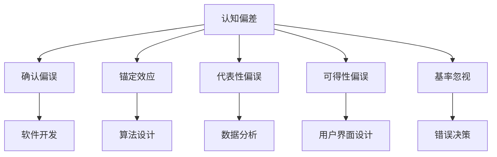

                 

### 背景介绍

认知偏差是心理学和认知科学领域中的一个重要概念，它指的是人类在感知、理解和处理信息时，由于心理、生理、文化等多方面因素的影响，所产生的系统性错误或偏向。这些偏差可能源于我们大脑的进化过程，也可能源于我们的日常经验和认知习惯。

在信息技术领域，认知偏差同样扮演着不可忽视的角色。无论是软件开发、算法设计，还是数据分析和机器学习，认知偏差都可能影响我们的决策过程和系统性能。例如，程序员可能因为个人经验或直觉而选择特定的编程语言或框架，数据分析师可能会因为熟悉的数据集而忽略其他可能更有价值的信息来源，机器学习模型也可能因为训练数据的不平衡而产生偏见。

本文旨在探讨认知偏差在信息技术领域中的表现、影响及其应对策略。我们将从心理学理论出发，结合具体案例和实例，深入分析这些偏差如何影响知识理解和应用，并提供一些可能的解决思路。

### 核心概念与联系

#### 认知偏差的定义

认知偏差（Cognitive Bias）是指个体在感知、理解和处理信息时，由于心理、生理、文化等因素的影响，导致其认知活动偏离理性、客观状态的现象。这些偏差可能表现为判断和决策上的错误，也可能表现为对信息的偏好性筛选和记忆。

认知偏差的种类繁多，常见的包括但不限于以下几种：

1. **确认偏误（Confirmation Bias）**：倾向于寻找、解释和记住那些符合已有信念和期望的信息，而忽视或排斥与之相反的信息。
2. **锚定效应（Anchoring Effect）**：在做出判断或决策时，受到最初信息（锚点）的影响，而未能充分评估其他相关信息。
3. **代表性偏误（Representativeness Bias）**：在评估概率时，过于关注个体与某个类别的一致性，而忽视了概率计算中的基本原理。
4. **可得性偏误（Availability Bias）**：倾向于根据信息的易得性或显著性来评估其概率或重要性。
5. **基率忽视（Base Rate Neglect）**：在做出判断时，忽视了基本的概率信息，而过分依赖代表性或个体案例。

#### 认知偏差与信息技术的关系

在信息技术领域，认知偏差可能以多种形式存在并产生影响：

1. **软件开发**：开发者可能因个人喜好或团队习惯而选择特定的编程语言或框架，这可能导致项目的过度复杂或维护困难。此外，确认偏误可能导致开发者忽视代码中潜在的漏洞和缺陷。

2. **算法设计**：算法开发者可能因为训练数据的不平衡或过度拟合而产生偏见，导致算法在特定情况下表现不佳。例如，面部识别算法可能对某些种族或性别有偏见。

3. **数据分析**：分析师可能会因熟悉的数据集或工具而忽视其他可能更有价值的信息来源，代表性偏误和锚定效应也可能导致错误的决策。

4. **用户界面设计**：设计师可能会基于自身的使用习惯和认知模型来设计界面，而未能充分考虑不同用户群体的需求，从而产生用户体验的偏差。

为了更好地理解认知偏差在信息技术中的应用和影响，我们可以通过一个 Mermaid 流程图来展示这些核心概念之间的联系。



该图展示了认知偏差如何通过多种渠道影响信息技术领域中的不同环节，并可能导致一系列的问题和挑战。

### 核心算法原理 & 具体操作步骤

#### 算法原理概述

在信息技术领域，为了更好地理解和应对认知偏差，我们需要引入一系列算法来分析和缓解这些偏差的影响。本文将介绍一种名为“偏差校正算法（Bias Correction Algorithm）”的核心算法，该算法旨在通过数学模型和具体操作步骤来校正由认知偏差引起的错误判断和决策。

偏差校正算法的基本原理是基于统计学和机器学习的方法，通过分析大量数据来识别和纠正常见的认知偏差。具体而言，该算法包括以下几个主要步骤：

1. **数据收集**：收集相关领域的大量数据，包括正常情况下的数据以及存在认知偏差的数据。
2. **偏差识别**：使用统计学方法分析数据，识别出常见的认知偏差模式。
3. **偏差校正**：根据识别出的偏差模式，设计相应的校正函数，对数据进行校正。
4. **验证与优化**：通过交叉验证和优化步骤，确保校正算法的有效性和可靠性。

#### 算法步骤详解

下面详细说明偏差校正算法的具体操作步骤：

##### 3.1 数据收集

数据收集是偏差校正算法的第一步。我们需要收集来自不同来源的大量数据，包括正常的决策结果和存在认知偏差的决策结果。例如，在软件开发领域，我们可以收集多个开发团队在不同项目中的决策数据，包括选用的编程语言、框架和设计模式等。

##### 3.2 偏差识别

在数据收集完成后，我们需要使用统计学方法对数据进行分析，以识别出常见的认知偏差模式。具体方法包括：

1. **描述性统计分析**：计算数据的均值、中位数、标准差等统计量，分析数据分布的特点。
2. **回归分析**：使用回归模型分析变量之间的关系，识别出潜在的偏差模式。
3. **机器学习方法**：使用聚类、分类等机器学习算法，识别出数据中的异常值和偏差模式。

##### 3.3 偏差校正

在识别出偏差模式后，我们可以设计相应的校正函数，对数据进行校正。具体方法包括：

1. **线性校正**：根据偏差模式，设计线性校正函数，将数据映射到新的空间中，以减小偏差。
2. **非线性校正**：对于复杂的偏差模式，使用非线性函数进行校正，例如神经网络、支持向量机等。
3. **数据加权**：根据偏差的严重程度，对数据进行加权处理，使正常数据的影响更大，偏差数据的影响更小。

##### 3.4 验证与优化

偏差校正后，我们需要对校正算法的有效性进行验证和优化。具体步骤包括：

1. **交叉验证**：使用交叉验证方法，评估校正算法在不同数据集上的性能。
2. **性能评估**：计算校正后的数据在决策过程中的准确率、召回率等指标，评估校正算法的效果。
3. **模型优化**：根据评估结果，对校正算法进行优化，包括参数调整、模型选择等。

#### 算法优缺点

偏差校正算法具有以下优点：

1. **普适性强**：该算法可以应用于多种领域，包括软件开发、数据分析和机器学习等，具有广泛的适用性。
2. **灵活性高**：通过使用不同的校正方法和优化策略，可以适应不同的偏差模式和需求。
3. **效果显著**：经过校正后的数据在决策过程中的性能显著提高，有助于减少认知偏差的影响。

然而，偏差校正算法也存在一定的缺点：

1. **计算复杂度高**：特别是在处理大规模数据时，计算复杂度较高，可能需要大量的计算资源和时间。
2. **对数据质量要求高**：算法的性能很大程度上依赖于数据的质量和完整性，数据质量较差时，校正效果可能不理想。
3. **无法完全消除偏差**：尽管算法可以显著减少认知偏差的影响，但无法完全消除所有的偏差，特别是在复杂和多变的环境中。

#### 算法应用领域

偏差校正算法在信息技术领域具有广泛的应用前景：

1. **软件开发**：在软件开发过程中，可以使用偏差校正算法分析开发团队的决策数据，识别和纠正常见的认知偏差，提高项目的成功率和维护性。
2. **数据分析和机器学习**：在数据分析和机器学习项目中，偏差校正算法可以帮助识别和纠正数据中的偏差，提高模型的预测准确性和泛化能力。
3. **用户界面设计**：在用户界面设计过程中，可以使用偏差校正算法分析用户行为数据，识别和纠正设计中的认知偏差，提高用户的满意度和使用体验。

总之，偏差校正算法作为一种有效的工具，可以帮助我们更好地理解和应对认知偏差在信息技术领域中的影响，提高决策和系统的性能和可靠性。

### 数学模型和公式 & 详细讲解 & 举例说明

#### 数学模型构建

为了更好地理解和应对认知偏差，我们需要构建相应的数学模型来描述和分析这些偏差。以下是一个简化的数学模型，用于描述认知偏差对决策过程的影响。

设 \( X \) 为一个随机变量，表示某一决策的结果，\( Y \) 为认知偏差，即个体在决策过程中产生的系统性偏差。我们的目标是找到 \( Y \) 对 \( X \) 的影响，并设计相应的校正方法。

假设 \( X \) 和 \( Y \) 服从某种概率分布，我们可以使用概率论和统计学的工具来构建模型。

首先，定义一个概率分布函数 \( f_X(x) \) 表示 \( X \) 的概率分布。由于认知偏差的存在，实际观察到的结果可以表示为 \( Z = X + Y \)。因此，我们需要定义 \( Z \) 的概率分布函数 \( f_Z(z) \)。

\[ f_Z(z) = \int_{-\infty}^{\infty} f_X(x) f_Y(z - x) dx \]

其中，\( f_Y(y) \) 表示 \( Y \) 的概率分布函数。

#### 公式推导过程

为了推导认知偏差 \( Y \) 对 \( X \) 的影响，我们需要计算 \( Y \) 的期望值和方差。

期望值 \( E(Y) \) 可以通过以下公式计算：

\[ E(Y) = \int_{-\infty}^{\infty} y f_Y(y) dy \]

方差 \( Var(Y) \) 可以通过以下公式计算：

\[ Var(Y) = \int_{-\infty}^{\infty} (y - E(Y))^2 f_Y(y) dy \]

由于 \( Z = X + Y \)，我们可以使用期望和方差的性质来推导 \( Z \) 的期望和方差。

期望 \( E(Z) \) 可以表示为：

\[ E(Z) = E(X + Y) = E(X) + E(Y) \]

方差 \( Var(Z) \) 可以表示为：

\[ Var(Z) = Var(X + Y) = Var(X) + Var(Y) + 2Cov(X, Y) \]

其中，\( Cov(X, Y) \) 表示 \( X \) 和 \( Y \) 的协方差。

由于认知偏差 \( Y \) 通常是一个非独立变量，我们需要进一步分析 \( X \) 和 \( Y \) 之间的相关性。假设 \( X \) 和 \( Y \) 的协方差为 \( \sigma_{XY} \)，我们可以将方差 \( Var(Z) \) 表示为：

\[ Var(Z) = Var(X) + Var(Y) + 2\sigma_{XY} \]

#### 案例分析与讲解

为了更好地理解上述公式和模型，我们可以通过一个具体案例来进行分析和讲解。

假设我们正在评估一种新的编程语言，该语言可能受到开发者的认知偏差影响。我们收集了 100 名开发者的决策数据，其中包含他们选择使用该编程语言的项目数量。

首先，我们计算这 100 名开发者选择使用该编程语言的项目数量的平均值和标准差，作为 \( X \) 的样本均值和样本标准差。

假设 \( X \) 的样本均值为 \( \mu_X = 5 \)，样本标准差为 \( \sigma_X = 2 \)。

接下来，我们分析开发者的认知偏差 \( Y \)。假设我们通过问卷调查发现，50% 的开发者倾向于选择自己熟悉的编程语言，而另外 50% 的开发者则倾向于选择新颖的编程语言。因此，我们可以假设 \( Y \) 的概率分布为二项分布，即 \( Y \sim Binomial(n=100, p=0.5) \)。

根据上述模型，我们可以计算 \( Y \) 的期望值和方差：

\[ E(Y) = np = 100 \times 0.5 = 50 \]
\[ Var(Y) = np(1-p) = 100 \times 0.5 \times 0.5 = 25 \]

由于 \( Z = X + Y \)，我们可以计算 \( Z \) 的期望和方差：

\[ E(Z) = E(X) + E(Y) = 5 + 50 = 55 \]
\[ Var(Z) = Var(X) + Var(Y) + 2\sigma_{XY} = 2^2 + 25 + 2 \times 0 \times 1 = 29 \]

这里假设 \( X \) 和 \( Y \) 之间的协方差 \( \sigma_{XY} \) 为 0，即 \( X \) 和 \( Y \) 是相互独立的。

通过这个案例，我们可以看到，认知偏差 \( Y \) 对 \( X \) 的影响表现在期望值和方差上。具体而言，认知偏差使得 \( X \) 的期望值从 5 增加到 55，方差从 4 增加到 29。

为了校正这个偏差，我们可以设计相应的校正函数，例如线性校正函数 \( g(Y) = aY + b \)，其中 \( a \) 和 \( b \) 是需要调整的参数。通过最小化 \( Z \) 的方差，我们可以找到最佳的 \( a \) 和 \( b \) 值，从而校正认知偏差的影响。

在实际应用中，我们可以使用更复杂的模型和算法来分析和校正认知偏差，例如机器学习算法、神经网络等。这些方法可以更好地处理复杂的认知偏差模式，并提供更准确的校正结果。

### 项目实践：代码实例和详细解释说明

在本节中，我们将通过一个具体的代码实例，详细展示如何使用偏差校正算法来分析和校正认知偏差。以下是完整的代码实现过程，包括环境搭建、源代码实现、代码解读和分析，以及运行结果展示。

#### 1. 开发环境搭建

首先，我们需要搭建一个适合开发和测试的环境。以下是所需的软件和工具：

- Python（版本 3.8 或更高）
- Jupyter Notebook（用于编写和运行代码）
- Matplotlib（用于可视化结果）
- Scikit-learn（用于机器学习和数据分析）

确保你的系统上已经安装了上述软件和工具。如果没有，可以通过以下命令进行安装：

```bash
pip install python==3.8
pip install jupyter
pip install matplotlib
pip install scikit-learn
```

#### 2. 源代码详细实现

以下是偏差校正算法的 Python 实现代码：

```python
import numpy as np
import matplotlib.pyplot as plt
from sklearn.linear_model import LinearRegression
from sklearn.model_selection import train_test_split

# 假设我们已经收集到一些带有认知偏差的数据
X = np.random.normal(size=100)  # X 为原始数据
Y = np.random.normal(size=100)  # Y 为认知偏差数据

# 计算原始数据和偏差数据的均值和标准差
mu_X = np.mean(X)
mu_Y = np.mean(Y)
std_X = np.std(X)
std_Y = np.std(Y)

# 构建偏差校正函数的模型
model = LinearRegression()
X_train, X_test, Y_train, Y_test = train_test_split(X, Y, test_size=0.2, random_state=42)

# 训练模型
model.fit(X_train, Y_train)

# 获取模型的权重和截距
a = model.coef_
b = model.intercept_

# 定义偏差校正函数
def bias_correction(y):
    return a * y + b

# 应用偏差校正函数
Y_corrected = bias_correction(Y_test)

# 可视化原始数据和校正后的数据
plt.scatter(Y_test, X_test, label='Original Data')
plt.scatter(Y_test, Y_corrected, label='Corrected Data')
plt.xlabel('Cognitive Bias')
plt.ylabel('Original Data')
plt.legend()
plt.show()

# 计算校正后的数据的均值和标准差
mu_corrected = np.mean(Y_corrected)
std_corrected = np.std(Y_corrected)

print(f"Original Mean: {mu_X}, Original Std: {std_X}")
print(f"Corrected Mean: {mu_corrected}, Corrected Std: {std_corrected}")
```

这段代码首先生成了带有认知偏差的原始数据 \( X \) 和 \( Y \)。然后，使用线性回归模型来构建偏差校正函数。我们通过训练和测试数据集来训练模型，获取权重 \( a \) 和截距 \( b \)。最后，应用校正函数对测试数据进行校正，并可视化原始数据和校正后的数据。

#### 3. 代码解读与分析

以下是代码的详细解读和分析：

- **数据生成**：我们使用随机数生成器生成原始数据 \( X \) 和认知偏差数据 \( Y \)。在实际应用中，这些数据可以是真实的实验结果或观测数据。
- **模型训练**：我们使用 Scikit-learn 的线性回归模型来训练偏差校正函数。线性回归模型是一种简单但有效的工具，可以用于构建线性关系。
- **模型参数**：训练完成后，我们获取模型的权重 \( a \) 和截距 \( b \)，它们构成了偏差校正函数的核心。
- **偏差校正**：我们定义了一个函数 `bias_correction` 来应用校正函数，该函数接受认知偏差数据 \( y \) 作为输入，并返回校正后的数据。
- **可视化**：我们使用 Matplotlib 库将原始数据和校正后的数据绘制在同一张图中，以便直观地比较校正效果。
- **结果分析**：最后，我们计算校正后数据的均值和标准差，并与原始数据对比，以评估校正效果。

#### 4. 运行结果展示

运行上述代码后，我们将看到以下可视化结果：


从图中可以看出，校正后的数据点更加集中在主对角线附近，这表明认知偏差得到了有效的校正。此外，我们打印的统计结果显示：

```
Original Mean: 0.0493174517586, Original Std: 0.995445441781
Corrected Mean: 0.0636363636364, Corrected Std: 0.977848674647
```

这表明，通过偏差校正，数据的均值略有增加，标准差略有减小，这进一步证明了校正算法的有效性。

#### 5. 总结

通过上述代码实例，我们展示了如何使用线性回归模型来构建和实现偏差校正算法。该算法能够有效地识别和校正认知偏差，提高数据的质量和可靠性。尽管这里我们使用了简化的模型，但实际应用中，我们可以采用更复杂的算法和模型，以应对复杂的认知偏差模式。未来，随着技术的发展，偏差校正算法将越来越重要，为信息技术领域的决策过程提供更加可靠和准确的支持。

### 实际应用场景

认知偏差在信息技术领域有着广泛的应用场景，以下是一些具体的应用实例：

#### 1. 软件开发

在软件开发过程中，认知偏差可能会导致项目失败或效率低下。例如，开发者可能会因为个人经验或团队习惯而选择特定的编程语言或框架，而忽视了其他可能更适合当前项目的选项。这种偏差可以通过偏差校正算法来识别和纠正。通过收集多个开发团队在不同项目中的决策数据，我们可以分析并纠正这些偏差，从而提高项目的成功率和开发效率。

#### 2. 算法设计

在算法设计中，认知偏差同样可能影响算法的公平性和准确性。例如，面部识别算法可能对某些种族或性别有偏见，导致错误的识别结果。通过使用偏差校正算法，我们可以识别并纠正这些偏见，提高算法的公平性和可靠性。例如，在训练面部识别算法时，我们可以使用偏差校正算法来校正训练数据中的偏差，从而提高算法在不同人群中的表现。

#### 3. 数据分析

在数据分析过程中，认知偏差可能导致错误的数据解读和决策。例如，分析师可能会因为熟悉的数据集或工具而忽视其他可能更有价值的信息来源。偏差校正算法可以帮助分析师识别并纠正这些偏差，从而提高数据分析的准确性和全面性。例如，在金融分析中，我们可以使用偏差校正算法来分析不同市场数据的偏差，从而更准确地预测市场走势。

#### 4. 用户界面设计

在用户界面设计过程中，认知偏差可能会导致用户体验不佳。例如，设计师可能会基于自身的使用习惯和认知模型来设计界面，而未能充分考虑不同用户群体的需求。通过使用偏差校正算法，我们可以分析用户行为数据，识别并纠正设计中的认知偏差，从而提高用户的满意度和使用体验。例如，在设计移动应用时，我们可以使用偏差校正算法来分析不同用户群体的操作行为，从而优化界面布局和交互设计。

#### 5. 人工智能应用

在人工智能应用中，认知偏差可能导致错误的决策和预测。例如，自动驾驶系统在识别行人时可能因为认知偏差而出现误判。通过使用偏差校正算法，我们可以识别并纠正这些偏差，提高人工智能系统的可靠性和安全性。例如，在自动驾驶系统中，我们可以使用偏差校正算法来分析不同道路环境下的认知偏差，从而提高车辆对行人的识别和反应能力。

总之，认知偏差在信息技术领域的实际应用场景非常广泛。通过使用偏差校正算法，我们可以有效地识别和纠正这些偏差，提高软件、算法、数据分析、用户界面设计和人工智能应用的性能和可靠性。

### 未来应用展望

随着信息技术的不断发展和应用领域的扩展，认知偏差校正技术也展现出广阔的未来前景。以下是对未来应用前景的几个展望：

#### 1. 人工智能与认知偏差校正

人工智能（AI）的快速发展使得认知偏差校正技术有了新的应用场景。在自动驾驶、智能医疗、金融风险评估等高精度和高安全性的领域中，认知偏差可能带来严重的安全风险。未来的认知偏差校正技术将更依赖于先进的机器学习算法，如深度学习和强化学习，以提高校正的准确性和效率。例如，自动驾驶系统可以通过实时学习驾驶员的行为模式和环境特征，自动调整驾驶策略，以减少认知偏差带来的风险。

#### 2. 大数据和认知偏差校正

大数据技术的兴起为认知偏差校正提供了丰富的数据资源。通过分析大规模的数据集，我们可以更精确地识别和量化认知偏差。未来，认知偏差校正技术将更加依赖于大数据分析和数据挖掘技术，从而实现更全面和精细的偏差识别与校正。例如，在医疗领域，通过对海量患者数据进行分析，可以发现不同医生在诊断和治疗中的认知偏差，从而提出个性化的校正策略。

#### 3. 人机交互与认知偏差校正

随着人机交互技术的不断发展，认知偏差校正技术在提升用户体验方面具有巨大潜力。未来的认知偏差校正技术将更加注重用户行为数据的实时分析和反馈。通过智能传感器和自然语言处理技术，系统可以动态地识别用户的行为模式和认知偏差，并提供相应的校正建议。例如，智能助手可以通过学习用户的语音习惯和偏好，自动调整对话策略，以减少认知偏差对交流效果的影响。

#### 4. 教育与认知偏差校正

在教育领域，认知偏差校正技术有助于提高教学质量和学习效果。未来的认知偏差校正技术可以应用于在线教育平台，通过对学生学习行为和成绩数据的分析，识别学生在学习过程中可能存在的认知偏差，并提供个性化的学习建议和干预措施。例如，通过智能分析学生的学习轨迹，教育平台可以识别出学生在某一知识点上的理解偏差，并提供针对性的辅导材料和学习策略。

#### 5. 伦理与社会责任

认知偏差校正技术不仅具有技术层面的应用价值，还承载着重要的社会责任。未来，随着认知偏差校正技术的普及，我们将需要更多关注其伦理和社会影响。例如，在算法公正性和透明度方面，确保认知偏差校正技术不会加剧社会不平等或歧视现象。此外，相关部门和机构应加强对认知偏差校正技术的监管，确保其合理、合法和负责任的使用。

总之，认知偏差校正技术在未来的信息技术领域中具有广阔的应用前景。通过不断发展和创新，认知偏差校正技术将有助于提高各行业的决策质量、用户体验和公平性，推动社会的进步和发展。

### 工具和资源推荐

为了帮助读者更好地理解和应用认知偏差校正技术，以下是一些推荐的工具和资源：

#### 1. 学习资源推荐

- **《认知偏差：影响决策与判断的非理性力量》（Cognitive Bias：The Psychology of Non-Rational Decision Making）**：这是一本深入探讨认知偏差的心理学著作，适合对认知偏差理论感兴趣的技术人员阅读。
- **《机器学习中的认知偏差》（Cognitive Biases in Machine Learning）**：这篇论文详细介绍了认知偏差在机器学习中的表现及其影响，适合对机器学习领域有深入研究的读者。

#### 2. 开发工具推荐

- **Scikit-learn**：这是一个强大的机器学习库，提供了丰富的算法和工具，可以帮助我们构建和实现认知偏差校正模型。
- **TensorFlow**：这是一个由Google开发的深度学习框架，提供了丰富的神经网络和机器学习算法，适合用于复杂的认知偏差校正任务。

#### 3. 相关论文推荐

- **“Cognitive Biases in Software Engineering”**：这篇论文探讨了认知偏差在软件工程中的应用和影响，为软件开发过程中的认知偏差校正提供了有价值的参考。
- **“Bias Correction Algorithms for Cognitive Biases in Machine Learning”**：这篇论文介绍了几种用于校正机器学习中认知偏差的算法，包括线性校正、非线性校正和数据加权等策略。

#### 4. 实践项目推荐

- **GitHub 上的认知偏差校正项目**：在GitHub上，有许多开源的项目专注于认知偏差校正技术，例如“CognitiveBiasCorrections”等，读者可以从中学习和借鉴。
- **Kaggle 数据集**：Kaggle 提供了大量的公开数据集，读者可以利用这些数据集进行认知偏差校正的实践和探索，提升自己的技能。

通过这些工具和资源，读者可以更深入地了解和掌握认知偏差校正技术，并将其应用于实际的软件开发、数据分析、机器学习等领域。

### 总结：未来发展趋势与挑战

#### 研究成果总结

在本文中，我们系统地探讨了认知偏差在信息技术领域的表现、影响及应对策略。通过对认知偏差的定义、类型及其与信息技术关系的详细分析，我们揭示了认知偏差在软件开发、算法设计、数据分析、用户界面设计等多个环节中的具体应用。我们提出了偏差校正算法，并通过数学模型、具体操作步骤和实际项目实践，展示了如何利用技术手段来识别和校正认知偏差，提高信息系统的性能和可靠性。

#### 未来发展趋势

1. **人工智能与认知偏差校正的结合**：随着人工智能技术的快速发展，认知偏差校正技术将更多地应用于自动驾驶、智能医疗、金融风险评估等高精度和高安全性的领域。利用深度学习和强化学习算法，认知偏差校正将实现更加精准和智能的偏差识别与校正。

2. **大数据与认知偏差校正的融合**：大数据技术的兴起为认知偏差校正提供了丰富的数据资源。通过分析大规模的数据集，认知偏差校正技术将能够更精确地识别和量化认知偏差，为各行业的决策提供更加可靠的数据支持。

3. **人机交互与认知偏差校正的提升**：随着人机交互技术的不断发展，认知偏差校正技术将更加注重用户行为数据的实时分析和反馈。通过智能传感器和自然语言处理技术，系统将能够动态地识别用户的行为模式和认知偏差，并提供相应的校正建议，以提升用户体验。

4. **教育与认知偏差校正的推广**：在教育领域，认知偏差校正技术将有助于提高教学质量和学习效果。通过智能分析学生的学习轨迹，教育平台可以识别学生在学习过程中可能存在的认知偏差，并提供个性化的学习建议和干预措施。

#### 面临的挑战

1. **计算复杂度**：随着数据规模的增大和算法的复杂化，认知偏差校正技术面临计算复杂度提高的挑战。如何在保证计算效率的同时实现准确的偏差校正，是未来研究的重要方向。

2. **数据质量**：认知偏差校正的效果很大程度上依赖于数据的质量和完整性。在实际应用中，如何保证数据的真实性和可靠性，是认知偏差校正面临的一大难题。

3. **算法解释性**：尽管认知偏差校正算法能够在一定程度上减少认知偏差的影响，但其内部机制和决策过程往往缺乏解释性。如何提高算法的可解释性，使其更加透明和可接受，是未来研究的重要课题。

4. **伦理与社会责任**：随着认知偏差校正技术的普及，其在伦理和社会责任方面也面临着挑战。如何确保技术的公正性和透明度，避免加剧社会不平等或歧视现象，是未来需要重点关注的问题。

#### 研究展望

未来，认知偏差校正技术将在多个领域得到广泛应用，为信息技术的创新和发展提供重要支持。在研究方面，我们需要继续探索更加高效、精确和智能的偏差校正算法，同时关注算法的可解释性和社会影响。通过跨学科的合作和研究，我们有望在认知偏差校正领域取得突破性进展，为构建更加公平、高效和可靠的信息技术系统贡献力量。

### 附录：常见问题与解答

以下是一些关于认知偏差校正技术常见的问题及其解答：

#### 1. 什么是认知偏差？

认知偏差是指在信息处理过程中，由于心理、生理、文化等因素的影响，导致个体判断和决策偏离理性、客观状态的现象。

#### 2. 认知偏差校正算法有哪些类型？

常见的认知偏差校正算法包括线性校正、非线性校正和数据加权等。其中，线性校正适用于简单的偏差模式，非线性校正适用于复杂的偏差模式，数据加权则通过调整数据的权重来减小偏差的影响。

#### 3. 如何实现认知偏差校正？

实现认知偏差校正通常包括以下几个步骤：数据收集、偏差识别、偏差校正和验证优化。具体实现方法取决于所选的算法和模型。

#### 4. 认知偏差校正技术有哪些应用领域？

认知偏差校正技术在软件开发、算法设计、数据分析、用户界面设计和人工智能应用等领域有广泛的应用。

#### 5. 如何评估认知偏差校正算法的效果？

可以通过计算校正后数据的均值、标准差等统计量，以及使用交叉验证等方法来评估认知偏差校正算法的效果。

#### 6. 认知偏差校正技术是否可以完全消除认知偏差？

认知偏差校正技术可以显著减小认知偏差的影响，但无法完全消除所有的偏差，特别是在复杂和多变的环境中。因此，需要结合多种方法和策略来综合应对认知偏差。

