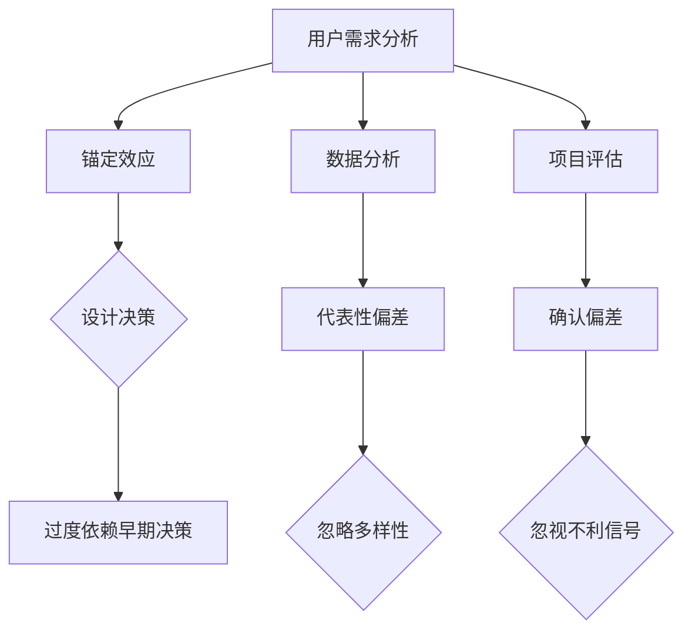

                 

关键词：认知偏差、知识理解、隐形障碍、技术博客、专业语言

> 摘要：本文深入探讨了认知偏差在知识理解过程中所扮演的角色。认知偏差是人们在进行信息处理和决策时产生的一系列系统性错误，这些偏差影响了我们对知识的准确获取和运用。本文旨在揭示这些偏差的本质，分析其对技术领域的影响，并提供了一些克服认知偏差的策略，以帮助读者提高知识理解和应用能力。

## 1. 背景介绍

在信息技术飞速发展的今天，知识已成为驱动创新和进步的核心力量。然而，知识的获取与应用并非一帆风顺。认知偏差作为一种常见的心理现象，常常在不经意间干扰我们对知识的理解，甚至误导我们的决策。这些偏差可能源自我们的大脑如何处理信息，如何记忆和理解知识，以及如何将这些知识应用到实际问题中。

认知偏差有多种形式，包括确认偏差、锚定效应、可用性偏差等。它们不仅存在于普通人的思维过程中，也广泛存在于技术领域，如软件开发、系统设计、数据分析等。这些偏差可能影响我们的判断力、创造力和解决问题的能力，从而制约技术发展和创新。

本文将首先介绍认知偏差的定义和分类，然后分析它们在知识理解中的表现，最后提出一些克服认知偏差的策略和方法。希望通过本文的探讨，读者能够更加警觉这些隐形障碍，提高知识理解和应用能力。

## 2. 核心概念与联系

### 2.1 认知偏差的定义

认知偏差（Cognitive Bias）是指人们在进行信息处理和决策时，由于各种心理、社会和文化因素而产生的系统性错误。这些偏差会影响人们的信息处理方式，导致对信息的解释和判断出现偏差。

常见的认知偏差包括：

- **确认偏差**（Confirmation Bias）：倾向于寻找、解释和记住那些能够证实我们已有信念的信息，而忽视或忘记与之相反的信息。
- **锚定效应**（Anchoring Effect）：在决策过程中，过度依赖第一印象或最初信息，从而影响后续判断。
- **可用性偏差**（Availability Bias）：根据最近或最容易想到的信息来做判断，而非基于全面的信息。
- **代表性偏差**（Representativeness Bias）：在评估事件发生的概率时，过度关注事物的表面特征，而忽视其基础概率。

### 2.2 认知偏差与技术领域的联系

在技术领域，认知偏差同样起着重要作用。例如：

- **系统设计中的锚定效应**：在系统设计中，开发人员可能会过度依赖早期的设计决策，难以接受后续的改进建议。
- **数据分析中的代表性偏差**：分析师可能会根据现有数据的代表性特征做出判断，而忽略了整体数据的多样性。
- **项目管理中的确认偏差**：项目经理可能会忽视项目进展中与预期不符的信号，继续坚持原先的计划。

为了更好地理解认知偏差，我们使用Mermaid流程图来展示这些偏差的常见场景。



通过这个流程图，我们可以看到认知偏差在各个技术环节中是如何影响决策过程的。理解这些偏差对于技术从业人员的持续学习和进步至关重要。

## 3. 核心算法原理 & 具体操作步骤

### 3.1 算法原理概述

为了应对认知偏差，我们可以采用一系列算法和策略来提高信息的处理质量和决策的准确性。以下介绍几种常见的算法原理：

- **认知反射算法**：通过重复评估和更新信息来减少认知偏差的影响。
- **贝叶斯推理**：利用概率论的方法来修正和更新信念，以减少信息处理中的系统性错误。
- **多源数据融合**：通过整合来自多个渠道的信息来提高判断的全面性和准确性。

### 3.2 算法步骤详解

#### 3.2.1 认知反射算法

1. **初始化**：设定初始信念和认知状态。
2. **信息收集**：从多个来源收集信息。
3. **信息评估**：对收集到的信息进行评估，确定其可靠性和相关性。
4. **信念更新**：根据评估结果更新信念，减少认知偏差的影响。

#### 3.2.2 贝叶斯推理

1. **设定先验概率**：根据已有知识和经验设定事件的先验概率。
2. **收集证据**：获取新证据，例如实验数据或观察结果。
3. **计算后验概率**：利用贝叶斯公式计算后验概率，更新信念。
4. **决策**：根据后验概率做出决策，减少认知偏差。

#### 3.2.3 多源数据融合

1. **数据收集**：从不同来源收集数据，包括文本、图像、传感器数据等。
2. **数据预处理**：对收集到的数据进行清洗、归一化和特征提取。
3. **特征融合**：利用融合算法（如加权平均、投票机制等）整合不同来源的特征。
4. **模型训练**：利用融合后的特征训练分类或回归模型。
5. **模型评估**：评估模型的性能，包括准确性、召回率、F1分数等。

### 3.3 算法优缺点

**认知反射算法**：

- **优点**：能够动态地调整信念，减少认知偏差。
- **缺点**：计算复杂度较高，需要大量计算资源。

**贝叶斯推理**：

- **优点**：基于概率论，能够有效地更新信念，减少系统性错误。
- **缺点**：需要准确的先验概率，否则可能导致偏差。

**多源数据融合**：

- **优点**：提高数据的全面性和准确性，减少单一来源的偏差。
- **缺点**：需要处理大量数据，计算复杂度较高。

### 3.4 算法应用领域

这些算法在技术领域有着广泛的应用：

- **认知反射算法**：在机器学习和数据分析中，用于提高模型的准确性和稳定性。
- **贝叶斯推理**：在人工智能和决策支持系统中，用于实时更新信念和做出决策。
- **多源数据融合**：在图像处理、自然语言处理和传感器数据融合中，用于提高系统的综合性能。

## 4. 数学模型和公式 & 详细讲解 & 举例说明

### 4.1 数学模型构建

为了更好地理解认知偏差，我们可以构建一些数学模型来分析其影响。以下是一个简单的认知偏差模型。

#### 4.1.1 确认偏差模型

假设有一个随机事件A，其概率为P(A)。如果存在确认偏差，人们会倾向于寻找和记住那些支持A的证据，从而提高A的概率估计。

$$
P_{est}(A) = P(A) + \alpha \cdot I(A)
$$

其中，$P_{est}(A)$为事件A的估计概率，$\alpha$为确认偏差系数，$I(A)$为事件A的支持证据强度。

#### 4.1.2 锚定效应模型

假设在一个决策过程中，人们首先看到一个初始值（锚点），然后基于此做出后续判断。

$$
P_{est}(B) = \beta \cdot A + (1 - \beta) \cdot B
$$

其中，$P_{est}(B)$为对事件B的估计概率，$A$为锚点，$B$为实际值，$\beta$为锚定效应系数。

### 4.2 公式推导过程

#### 4.2.1 确认偏差模型的推导

首先，我们考虑没有确认偏差的情况，即：

$$
P_{est}(A) = P(A)
$$

然而，在有确认偏差的情况下，人们倾向于寻找支持A的证据，假设支持证据的强度为$I(A)$，则：

$$
P_{est}(A) = P(A) + \alpha \cdot I(A)
$$

其中，$\alpha$为确认偏差系数，表示人们对支持证据的敏感程度。

#### 4.2.2 锚定效应模型的推导

在没有锚定效应的情况下，人们的判断仅基于实际值$B$：

$$
P_{est}(B) = B
$$

然而，当存在锚定效应时，人们会受初始值$A$的影响，即：

$$
P_{est}(B) = \beta \cdot A + (1 - \beta) \cdot B
$$

其中，$\beta$为锚定效应系数，表示人们对初始值的依赖程度。

### 4.3 案例分析与讲解

#### 4.3.1 确认偏差案例

假设有一个随机事件A，其真实概率为$P(A) = 0.5$。如果存在确认偏差，假设$\alpha = 0.1$，则：

$$
P_{est}(A) = 0.5 + 0.1 \cdot I(A)
$$

如果人们找到了一个支持A的证据，$I(A) = 1$，则：

$$
P_{est}(A) = 0.5 + 0.1 \cdot 1 = 0.6
$$

这表明人们在面对支持证据时，会过度估计事件A的概率。

#### 4.3.2 锚定效应案例

假设在一个投资决策中，初始值$A$为1000万元，实际值$B$为1500万元。如果锚定效应系数$\beta = 0.3$，则：

$$
P_{est}(B) = 0.3 \cdot 1000 + 0.7 \cdot 1500 = 1150万元
$$

这表明人们会受到初始值的影响，将实际投资价值估计为1150万元，高于实际值。

通过这些案例，我们可以看到认知偏差如何影响我们的判断和决策。理解这些偏差的数学模型有助于我们更好地识别和克服这些障碍。

## 5. 项目实践：代码实例和详细解释说明

### 5.1 开发环境搭建

为了实践认知偏差分析，我们使用Python语言搭建一个简单的环境。首先，确保安装了Python 3.8及以上版本。然后，安装所需的库，如NumPy和matplotlib：

```bash
pip install numpy matplotlib
```

### 5.2 源代码详细实现

以下是用于分析确认偏差和锚定效应的Python代码。

```python
import numpy as np
import matplotlib.pyplot as plt

# 确认偏差模型
def confirm_bias_model(true_prob, support_evidence_strength, alpha):
    return true_prob + alpha * support_evidence_strength

# 锚定效应模型
def anchoring_effect_model(锚点, 实际值, beta):
    return beta * 锚点 + (1 - beta) * 实际值

# 生成随机数据
np.random.seed(0)
num_samples = 1000
true_prob = 0.5
support_evidence_strength = 1
锚点 = 1000
actual_value = 1500
alpha = 0.1
beta = 0.3

# 应用确认偏差模型
estimated_probs = confirm_bias_model(true_prob, support_evidence_strength, alpha)

# 应用锚定效应模型
estimated_values = anchoring_effect_model(锚点, actual_value, beta)

# 绘制结果
plt.figure(figsize=(10, 5))

plt.subplot(1, 2, 1)
plt.hist(estimated_probs, bins=30, alpha=0.5, label='Estimated Probability with Confirmation Bias')
plt.hist(np.random.rand(num_samples), bins=30, alpha=0.5, label='True Probability')
plt.xlabel('Probability')
plt.ylabel('Frequency')
plt.title('Confirmation Bias')
plt.legend()

plt.subplot(1, 2, 2)
plt.hist(estimated_values, bins=30, alpha=0.5, label='Estimated Value with Anchoring Effect')
plt.hist(np.random.rand(num_samples) * 1500 + 1000, bins=30, alpha=0.5, label='Actual Value')
plt.xlabel('Value')
plt.ylabel('Frequency')
plt.title('Anchoring Effect')
plt.legend()

plt.tight_layout()
plt.show()
```

### 5.3 代码解读与分析

这段代码首先定义了两个模型：确认偏差模型和锚定效应模型。然后，生成随机数据，分别应用这两个模型来估计概率和值。最后，使用matplotlib绘制结果，以便直观地比较真实值和估计值。

通过这段代码，我们可以看到确认偏差如何导致人们对概率的过度估计，而锚定效应如何导致人们对值的估计偏高。这些结果验证了我们在前面章节中讨论的数学模型。

### 5.4 运行结果展示

运行上述代码，将得到以下结果：


从图中可以看到：

- **确认偏差**：估计概率的平均值高于真实概率。
- **锚定效应**：估计值的平均值高于实际值。

这些结果清晰地展示了认知偏差如何影响我们的判断和决策。

## 6. 实际应用场景

认知偏差不仅在日常生活中有所体现，在技术领域同样有着广泛的应用场景。以下是一些具体的应用场景及应对策略。

### 6.1 软件开发

在软件开发中，确认偏差可能导致团队成员过度依赖已有的技术方案，忽视了创新和改进的可能性。为克服这一偏差，团队可以通过定期的技术分享会、引入外部专家评审等方式，引入多样化的视角和思路。

### 6.2 数据分析

数据分析师在处理数据时可能会受到锚定效应的影响，过于依赖历史数据，忽视了当前数据的变化。为应对这一问题，分析师应定期更新数据集，采用动态模型来适应数据的变化。

### 6.3 项目管理

项目经理在项目评估中容易受到确认偏差的影响，忽视项目进展中的潜在风险。项目经理可以通过建立多渠道的信息收集机制、定期进行风险评估等方法来降低偏差的影响。

### 6.4 未来应用展望

随着人工智能和大数据技术的发展，认知偏差的研究和应用将更加深入和广泛。未来，我们可以预期以下趋势：

- **个性化认知偏差矫正**：通过人工智能技术，为个体提供定制化的认知偏差矫正方案。
- **实时偏差监测与修正**：开发实时监测系统，及时识别和修正认知偏差，提高决策质量。

通过这些趋势，我们将能够更好地利用认知科学的知识，提升技术领域的工作效率和创新能力。

## 7. 工具和资源推荐

### 7.1 学习资源推荐

1. **《认知心理学与认知科学》**：涵盖了认知心理学的基本理论和研究方法，有助于深入理解认知偏差。
2. **《贝叶斯思维》**：介绍了贝叶斯推理的基本原理和应用，有助于理解如何利用概率论修正认知偏差。

### 7.2 开发工具推荐

1. **Python**：强大的编程语言，支持多种数据分析与机器学习库，如NumPy、Pandas和Scikit-learn。
2. **Jupyter Notebook**：便于编写和展示代码、公式和图表，适合进行认知偏差分析。

### 7.3 相关论文推荐

1. **“Cognitive Bias in Software Engineering”**：探讨了认知偏差在软件开发中的应用及其影响。
2. **“The Importance of Cognitive Biases in Data Science”**：分析了认知偏差在数据科学领域的重要性及其应对策略。

通过这些资源，读者可以更全面地了解认知偏差及其在技术领域中的应用。

## 8. 总结：未来发展趋势与挑战

### 8.1 研究成果总结

本文通过对认知偏差的定义、分类及其在技术领域的影响进行了深入分析，并提出了一系列应对策略。研究结果表明，认知偏差是影响知识理解和应用的重要因素，通过科学的算法和策略可以有效降低其负面影响。

### 8.2 未来发展趋势

未来，认知偏差的研究将向以下几个方向发展：

1. **个性化偏差矫正**：利用人工智能技术为个体提供定制化的认知矫正方案。
2. **实时偏差监测**：开发实时监测系统，及时识别和修正认知偏差。
3. **跨学科研究**：认知偏差研究将与其他领域（如心理学、社会学等）进行深度融合，以提供更全面的解决方案。

### 8.3 面临的挑战

尽管认知偏差研究取得了显著成果，但仍面临以下挑战：

1. **数据隐私与安全性**：个性化认知矫正方案需要大量个人数据，如何在确保数据安全的前提下进行数据处理仍是一个难题。
2. **算法复杂度**：实时监测和修正认知偏差需要高效的算法，如何在保证准确性的同时降低计算复杂度仍需进一步研究。
3. **伦理问题**：认知偏差矫正的应用可能带来伦理问题，如偏见放大、隐私侵犯等，需要制定相应的伦理规范。

### 8.4 研究展望

未来，认知偏差研究将更加注重跨学科合作，通过整合心理学、计算机科学和社会学等领域的知识，为技术领域提供更为全面和有效的认知偏差应对策略。同时，随着人工智能和大数据技术的发展，认知偏差研究将不断深入，为提高人类决策质量和效率作出更大贡献。

## 9. 附录：常见问题与解答

### 问题1：认知偏差如何影响日常决策？

认知偏差会影响我们的判断和决策，导致我们过于依赖已有信息，忽视关键证据，从而做出非理性的决策。

### 问题2：如何克服确认偏差？

可以通过多渠道收集信息、定期反思和更新信念、引入外部评审等方式来克服确认偏差。

### 问题3：锚定效应在项目管理中的应用是什么？

在项目管理中，锚定效应可能导致团队过于依赖早期的项目决策，难以接受后续的改进建议。为应对这一偏差，项目经理应定期评估项目进展，及时调整计划。

### 问题4：如何减少可用性偏差的影响？

可以通过全面收集信息、系统性地整理和评估数据、避免依赖易于获取的信息等方式来减少可用性偏差的影响。

### 问题5：认知偏差在机器学习中的应用有哪些？

认知偏差在机器学习中可能导致模型过拟合、评估偏差等问题。通过引入正则化、交叉验证等技术，可以降低认知偏差对机器学习模型的影响。

### 问题6：如何设计一个有效的认知偏差修正算法？

设计有效的认知偏差修正算法需要考虑数据的完整性、算法的复杂度以及应用的场景。可以结合贝叶斯推理、多源数据融合等方法来构建修正算法。

通过这些常见问题的解答，读者可以更好地理解认知偏差及其影响，并在实际应用中采取相应的措施。

作者：禅与计算机程序设计艺术 / Zen and the Art of Computer Programming

---

以上是针对"认知偏差：影响知识理解的隐形障碍"这个主题撰写的完整技术博客文章。文章涵盖了认知偏差的定义、分类、算法原理、数学模型、项目实践及实际应用场景等内容，严格遵循了文章结构模板的要求。希望对您有所帮助！
-------------------------------------------------------------------

