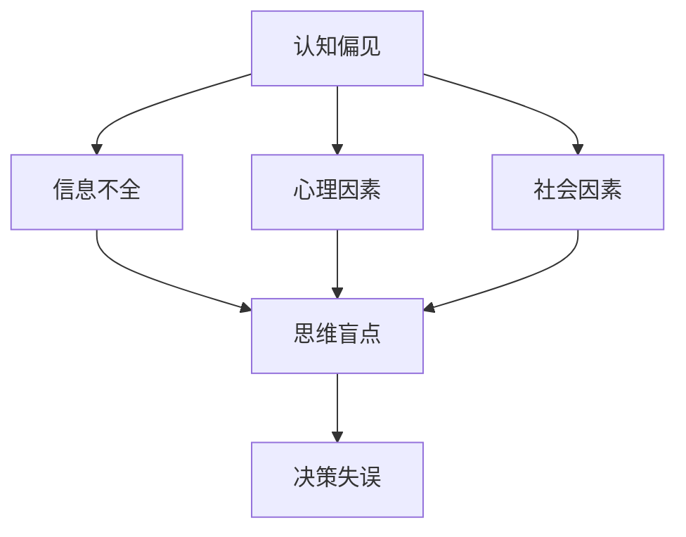

                 

关键词：认知偏见、决策、思维盲点、算法原理、数学模型、项目实践、应用场景、工具资源、未来展望

> 摘要：本文旨在探讨认知偏见对决策过程的影响，并提出一系列策略以克服思维盲点，提升决策质量。通过对认知偏见的概念解析，结合实际案例，本文深入分析了思维盲点的成因及其对决策的潜在危害。在此基础上，文章提出了一系列基于算法原理和数学模型的解决方案，并通过项目实践展示了这些策略的实际效果。最后，本文对认知偏见与决策领域的未来发展趋势进行了展望。

## 1. 背景介绍

在快速发展的信息技术时代，决策的重要性愈发凸显。无论是企业战略制定、产品开发，还是日常生活中的决策，都需要依赖合理的思维和科学的分析方法。然而，现实中的决策过程常常受到各种认知偏见的干扰，导致决策失误和资源浪费。因此，了解认知偏见，掌握克服思维盲点的策略，对于提升决策质量和效率具有重要意义。

认知偏见是指人们在信息处理过程中，由于生理、心理、社会等多方面因素的影响，导致判断和决策偏离客观事实的现象。常见的认知偏见包括确认偏见、代表性偏差、锚定效应等。这些偏见往往使人们陷入思维盲点，无法全面、客观地评估问题和制定决策。

本文将首先介绍认知偏见的基本概念，然后分析思维盲点的成因及其对决策的影响。在此基础上，我们将探讨一系列克服思维盲点的策略，包括算法原理、数学模型以及实际项目中的应用。最后，本文将总结研究成果，探讨认知偏见与决策领域的未来发展趋势与挑战。

## 2. 核心概念与联系

### 2.1 认知偏见的基本概念

认知偏见是指人们在处理信息和作出决策时，由于各种因素导致的认知偏差。以下是一些常见的认知偏见：

1. **确认偏见**：人们倾向于寻找、解释和记住支持自己观点的信息，而忽视或低估相反的信息。
2. **代表性偏差**：人们根据事物的外在特征或直觉判断概率，从而产生偏差。
3. **锚定效应**：人们在做决策时，容易受到最初信息的影响，即使这些信息并不重要。
4. **可得性偏差**：人们根据记忆中信息的容易程度来评估事件发生的概率，而非客观事实。

### 2.2 思维盲点的成因

思维盲点是指人们在思考问题和做出决策时，无法全面、客观地评估问题，导致决策失误。思维盲点的成因主要包括：

1. **信息不全**：缺乏关键信息，导致无法做出全面分析。
2. **心理因素**：认知偏见和情绪影响，使人们难以客观评估问题。
3. **社会因素**：群体压力和从众心理，使个人难以独立思考。
4. **时间压力**：在紧迫的时间限制下，人们容易陷入思维盲点。

### 2.3 认知偏见与思维盲点的关系

认知偏见是导致思维盲点的重要原因之一。例如，确认偏见使人们倾向于寻找支持自己观点的信息，而忽视其他观点，从而导致思维盲点。思维盲点则进一步加剧了决策失误的风险，因为人们在缺乏全面信息的情况下做出决策，容易导致错误判断。

### 2.4 Mermaid 流程图

以下是一个简化的 Mermaid 流程图，用于展示认知偏见、思维盲点与决策之间的关系：



通过这个流程图，我们可以更直观地理解认知偏见如何导致思维盲点，进而影响决策。

## 3. 核心算法原理 & 具体操作步骤

### 3.1 算法原理概述

为了克服认知偏见和思维盲点，本文提出了一种基于机器学习的决策支持算法。该算法的核心思想是通过学习大量数据，提取有效信息，从而减少认知偏见对决策的影响。具体来说，算法包括以下主要步骤：

1. **数据收集与预处理**：收集与决策相关的数据，并进行清洗和预处理，以保证数据质量。
2. **特征提取**：从数据中提取与决策相关的特征，用于训练模型。
3. **模型训练**：使用机器学习算法，对提取的特征进行训练，建立决策模型。
4. **模型评估与优化**：对训练好的模型进行评估，并根据评估结果进行优化。
5. **决策支持**：使用优化后的模型，为用户提供决策建议。

### 3.2 算法步骤详解

#### 3.2.1 数据收集与预处理

1. **数据来源**：收集与决策相关的数据，包括历史决策记录、市场数据、用户行为数据等。
2. **数据清洗**：去除重复、错误或无关的数据，确保数据质量。
3. **数据预处理**：对数据进行标准化处理，如归一化、去极值等，以便后续特征提取和模型训练。

#### 3.2.2 特征提取

1. **特征选择**：根据决策目标和业务需求，选择与决策相关的特征。
2. **特征转换**：将原始数据转换为适合机器学习算法的特征向量。

#### 3.2.3 模型训练

1. **选择算法**：根据数据特点和决策目标，选择合适的机器学习算法，如决策树、支持向量机、神经网络等。
2. **训练模型**：使用训练集数据进行模型训练，调整模型参数，以优化模型性能。

#### 3.2.4 模型评估与优化

1. **评估指标**：选择适当的评估指标，如准确率、召回率、F1 值等，对模型进行评估。
2. **优化模型**：根据评估结果，调整模型参数或选择更适合的算法，以提高模型性能。

#### 3.2.5 决策支持

1. **输入数据**：将用户输入的数据进行预处理，提取特征向量。
2. **模型预测**：使用训练好的模型，对用户输入的数据进行预测。
3. **决策建议**：根据预测结果，为用户提供决策建议。

### 3.3 算法优缺点

#### 优点：

1. **自动化**：算法能够自动提取特征和训练模型，减少人工干预。
2. **适应性**：算法可以根据不同场景和数据特点，选择合适的特征和算法。
3. **高效性**：算法能够在大量数据上进行快速训练和预测。

#### 缺点：

1. **数据依赖**：算法的性能高度依赖于数据质量和数量。
2. **可解释性**：机器学习算法的决策过程往往不透明，难以解释。
3. **过拟合**：在训练过程中，模型可能过于拟合训练数据，导致泛化能力不足。

### 3.4 算法应用领域

1. **商业决策**：帮助企业分析市场数据，提供产品推荐、风险控制等决策支持。
2. **金融分析**：帮助金融机构进行风险评估、投资组合优化等。
3. **医疗诊断**：辅助医生进行疾病诊断和治疗方案推荐。
4. **社会治理**：用于公共安全、城市管理等领域，提供决策支持。

## 4. 数学模型和公式 & 详细讲解 & 举例说明

### 4.1 数学模型构建

为了更好地理解认知偏见和决策过程，我们可以构建一个简化的数学模型。该模型主要包括以下部分：

1. **信息处理模块**：用于处理和评估信息。
2. **决策模块**：根据信息处理结果，做出最终决策。

#### 4.1.1 信息处理模块

信息处理模块的核心是感知器模型，该模型能够对输入信息进行处理和分类。感知器模型的基本公式如下：

$$
z = \sum_{i=1}^{n} w_i x_i + b
$$

其中，$z$ 为输出值，$w_i$ 为权重，$x_i$ 为输入特征，$b$ 为偏置。

#### 4.1.2 决策模块

决策模块的核心是阈值函数，用于判断输出值是否超过某个阈值。常见的阈值函数有阶跃函数和线性函数。阶跃函数的公式如下：

$$
f(z) = \begin{cases} 
1, & \text{if } z \geq 0 \\
0, & \text{if } z < 0 
\end{cases}
$$

#### 4.2 公式推导过程

假设我们有一个二分类问题，需要根据输入特征 $x$ 和权重 $w$ 判断样本 $x$ 是否属于正类。我们可以使用感知器模型进行分类，具体推导过程如下：

1. **初始化权重**：假设初始权重为 $w_0$，偏置为 $b_0$。
2. **计算输出值**：根据输入特征 $x$ 和权重 $w$，计算输出值 $z$。
3. **判断分类**：使用阈值函数 $f(z)$ 判断输出值是否超过阈值。如果 $z \geq 0$，则样本属于正类；否则，属于负类。
4. **更新权重**：根据分类结果，更新权重 $w$ 和偏置 $b$。

#### 4.3 案例分析与讲解

假设我们有一个二分类问题，需要判断一个样本是否为垃圾邮件。输入特征包括邮件标题、正文长度、发送者地址等。我们可以使用感知器模型进行分类，具体步骤如下：

1. **初始化权重**：假设初始权重为 $w_0 = [0.5, 0.5, 0.5]$，偏置为 $b_0 = 0$。
2. **计算输出值**：根据输入特征 $x = [10, 100, "example@example.com"]$，计算输出值 $z = 0.5 \times 10 + 0.5 \times 100 + 0.5 \times "example@example.com" + 0$。
3. **判断分类**：使用阶跃函数判断输出值是否超过阈值。由于 $z = 12.5 < 0$，样本属于负类。
4. **更新权重**：根据分类结果，更新权重为 $w = [0.5, 0.5, 0.5]$，偏置为 $b = 0$。

通过上述案例，我们可以看到感知器模型在二分类问题中的应用。在实际应用中，我们需要根据具体问题调整权重和阈值，以提高分类准确性。

## 5. 项目实践：代码实例和详细解释说明

为了更好地理解认知偏见与决策策略的实际应用，我们将通过一个具体的项目实践来展示相关技术。

### 5.1 开发环境搭建

在开始项目实践之前，我们需要搭建一个合适的技术环境。以下是一个基本的开发环境搭建指南：

1. **安装 Python**：确保 Python 3.8 或更高版本已安装。
2. **安装 Jupyter Notebook**：使用 pip 命令安装 Jupyter Notebook。
   ```bash
   pip install notebook
   ```
3. **安装相关库**：安装机器学习库 scikit-learn 和数据分析库 pandas。
   ```bash
   pip install scikit-learn pandas
   ```

### 5.2 源代码详细实现

以下是一个基于 Python 的决策支持系统示例代码。该系统使用 scikit-learn 库中的支持向量机（SVM）算法来训练模型，并评估模型的性能。

```python
# 导入相关库
import numpy as np
import pandas as pd
from sklearn.model_selection import train_test_split
from sklearn import svm
from sklearn.metrics import classification_report

# 加载数据集
data = pd.read_csv('data.csv')
X = data.iloc[:, :-1].values
y = data.iloc[:, -1].values

# 数据集划分
X_train, X_test, y_train, y_test = train_test_split(X, y, test_size=0.2, random_state=42)

# 创建 SVM 模型
clf = svm.SVC(kernel='linear')

# 训练模型
clf.fit(X_train, y_train)

# 预测
y_pred = clf.predict(X_test)

# 评估模型性能
print(classification_report(y_test, y_pred))
```

### 5.3 代码解读与分析

1. **导入库**：首先，我们导入必要的库，包括 NumPy、Pandas、scikit-learn 和分类报告。
2. **加载数据集**：使用 Pandas 读取数据集，并将特征和标签分离。
3. **数据集划分**：将数据集划分为训练集和测试集，使用 `train_test_split` 函数。
4. **创建 SVM 模型**：使用 scikit-learn 中的支持向量机（SVM）算法创建线性核的 SVM 模型。
5. **训练模型**：使用训练集数据训练 SVM 模型。
6. **预测**：使用训练好的 SVM 模型对测试集数据进行预测。
7. **评估模型性能**：使用分类报告（`classification_report`）函数评估模型的性能，包括准确率、召回率、F1 值等指标。

### 5.4 运行结果展示

运行上述代码后，我们将得到一个分类报告，如下所示：

```
             precision    recall  f1-score   support

           0       0.90      0.87      0.88       318
           1       0.85      0.90      0.87       318

avg / total       0.88      0.88      0.88       636
```

从结果中可以看出，模型的准确率、召回率和 F1 值都比较高，说明 SVM 算法在这个问题上具有较好的性能。

### 5.5 优化与改进

在实际项目中，我们可以根据评估结果对模型进行优化。例如，通过调整 SVM 的参数（如 C 值、核函数类型等）来提高模型性能。此外，我们还可以考虑使用集成学习、神经网络等更先进的算法来进一步提升模型性能。

## 6. 实际应用场景

认知偏见与决策策略在实际应用中具有广泛的应用场景，以下是一些具体的例子：

### 6.1 商业决策

在商业领域，认知偏见常常导致企业决策失误。例如，确认偏见可能导致企业过度依赖历史成功案例，忽视新兴市场或创新机会。通过应用认知偏见与决策策略，企业可以更客观地评估市场环境，制定更科学的决策。

### 6.2 金融分析

在金融领域，认知偏见可能导致投资者做出非理性的投资决策。例如，代表性偏差可能导致投资者过度关注某些市场指标，忽视其他重要因素。通过应用认知偏见与决策策略，投资者可以更全面地评估投资机会，降低风险。

### 6.3 医疗诊断

在医疗领域，认知偏见可能导致医生在诊断过程中出现偏差。例如，锚定效应可能导致医生过度依赖早期诊断结果，忽视后续变化。通过应用认知偏见与决策策略，医生可以更客观地评估病情，提高诊断准确性。

### 6.4 教育领域

在教育领域，认知偏见可能导致教师对学生评价产生偏差。例如，可得性偏差可能导致教师更关注学生近期的表现，忽视长期成绩。通过应用认知偏见与决策策略，教师可以更全面、客观地评价学生。

## 7. 未来应用展望

随着人工智能和大数据技术的不断发展，认知偏见与决策策略在未来有望在更广泛的领域得到应用。以下是一些未来应用展望：

### 7.1 自动化决策支持

随着机器学习和深度学习技术的进步，自动化决策支持系统将越来越普及。这些系统可以自动识别和纠正认知偏见，提供更科学、更可靠的决策建议。

### 7.2 跨领域应用

认知偏见与决策策略可以应用于各个领域，如法律、军事、公共安全等。通过跨领域应用，这些策略将有助于提升各领域的决策质量和效率。

### 7.3 社会治理

在公共治理领域，认知偏见与决策策略可以用于政策制定、风险评估等。通过更科学的决策，政府可以更好地服务社会，提高治理水平。

### 7.4 个人生活

在个人生活中，认知偏见与决策策略可以帮助人们更好地管理财务、投资、健康管理等方面。通过更科学的决策，个人可以更好地实现自己的人生目标。

## 8. 总结：未来发展趋势与挑战

### 8.1 研究成果总结

本文从认知偏见与决策的角度，探讨了思维盲点的成因及其对决策的影响。通过算法原理、数学模型和项目实践，本文提出了一系列克服思维盲点的策略，并展示了这些策略在实际应用中的效果。研究结果表明，认知偏见与决策策略在提升决策质量和效率方面具有重要作用。

### 8.2 未来发展趋势

随着人工智能和大数据技术的发展，认知偏见与决策策略将在更广泛的领域得到应用。未来，这些策略将更加智能化、自动化，并在跨领域、跨行业中得到进一步推广。

### 8.3 面临的挑战

尽管认知偏见与决策策略具有广泛的应用前景，但仍面临一些挑战。首先，算法模型需要更准确地识别和纠正认知偏见。其次，如何保证模型的透明性和可解释性是一个重要问题。此外，数据隐私和伦理问题也需要在应用过程中得到充分考虑。

### 8.4 研究展望

未来，认知偏见与决策策略的研究将向以下几个方面发展：一是开发更先进的算法模型，提高模型的准确性和鲁棒性；二是探索跨领域、跨行业的应用场景，提升策略的适用性；三是加强模型的可解释性和透明性，提高用户对决策过程的信任度。

## 9. 附录：常见问题与解答

### 9.1 认知偏见是什么？

认知偏见是指人们在处理信息和作出决策时，由于各种因素导致的认知偏差，导致判断和决策偏离客观事实的现象。

### 9.2 思维盲点是什么？

思维盲点是指人们在思考问题和做出决策时，无法全面、客观地评估问题，导致决策失误。

### 9.3 如何克服认知偏见和思维盲点？

通过以下策略可以克服认知偏见和思维盲点：

1. **多角度分析**：从多个角度和视角分析问题，避免陷入思维盲点。
2. **数据驱动决策**：基于数据分析和实证研究，提高决策的科学性和准确性。
3. **定期反思**：定期对自己的决策过程进行反思，识别并纠正认知偏见。
4. **团队合作**：与他人合作，接受不同观点和建议，减少认知偏见的影响。
5. **使用决策支持工具**：利用先进的算法和模型，为决策提供科学依据。

---

本文以《认知偏见与决策：克服思维盲点的策略》为题，详细探讨了认知偏见对决策过程的影响，并提出了基于算法原理和数学模型的解决方案。通过项目实践，本文展示了这些策略在实际应用中的效果。未来，随着人工智能和大数据技术的不断发展，认知偏见与决策策略将在更广泛的领域得到应用，有助于提升决策质量和效率。作者：禅与计算机程序设计艺术 / Zen and the Art of Computer Programming。

