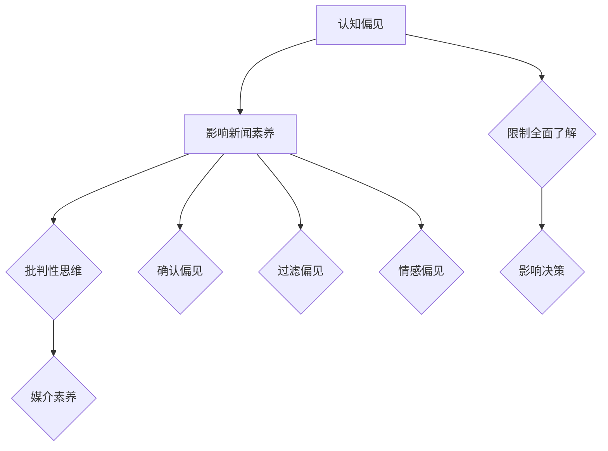

                 

关键词：认知偏见、新闻素养、批判性思维、信息消费、媒体素养

> 摘要：本文旨在探讨认知偏见对信息消费的影响，以及如何通过提升新闻素养，培养批判性思维，从而更好地消费信息。文章从认知心理学和媒体研究的视角出发，分析认知偏见的表现形式，探讨其对个体和社会的影响。同时，本文还提出了提升新闻素养的策略，包括对新闻信息的筛选、评估和批判，以期在信息化时代，帮助读者成为理性的信息消费者。

## 1. 背景介绍

随着互联网和移动通信技术的迅猛发展，信息传播的速度和广度达到了前所未有的高度。人们可以随时随地获取到大量的新闻和信息。然而，这种信息的过载现象也带来了一系列问题。首先，信息的真实性和准确性难以保证。在互联网上，虚假新闻、谣言和误导性信息层出不穷，给公众带来了巨大的困扰。其次，认知偏见的存在使得人们对信息的接受和解读带有主观倾向，这进一步加剧了信息的扭曲和误解。

认知偏见是指人们在认知过程中，由于自身的经验、信仰、情感等因素，对信息进行选择、加工和解读时出现的偏差。这种偏差可能导致人们对信息的误判和误解，从而影响个体的决策和行为。新闻素养则是指人们理解和解读新闻信息的能力，包括对新闻事实的辨别、对新闻来源的评估、对新闻信息的批判性思维等。培养新闻素养有助于人们更加理性地消费信息，避免被认知偏见所左右。

本文将从认知心理学和媒体研究的视角出发，分析认知偏见的表现形式，探讨其对个体和社会的影响。同时，本文还将提出提升新闻素养的策略，帮助读者培养批判性思维，成为理性的信息消费者。

## 2. 核心概念与联系

### 2.1 认知偏见的概念

认知偏见是指人们在信息处理过程中，由于各种心理和生理因素，导致信息接收、加工和解读出现偏差的现象。认知偏见有多种表现形式，包括确认偏见、过滤偏见、情感偏见等。确认偏见是指人们倾向于接受符合自己观点和信念的信息，而忽视或贬低与之相反的信息。过滤偏见则是指人们在信息处理过程中，有意或无意地筛选信息，使其符合自己的认知需求。情感偏见是指人们在情绪的影响下，对信息进行加工和解读，从而导致信息的扭曲。

### 2.2 新闻素养的概念

新闻素养是指人们理解和解读新闻信息的能力，包括对新闻事实的辨别、对新闻来源的评估、对新闻信息的批判性思维等。新闻素养的培养有助于人们更加理性地消费信息，避免被认知偏见所左右。具体来说，新闻素养包括以下方面：

1. **事实辨别**：能够准确判断新闻信息的真实性和准确性。
2. **来源评估**：能够评估新闻来源的可靠性和专业性。
3. **批判性思维**：能够对新闻信息进行深入分析和思考，形成独立的观点。
4. **媒介素养**：能够理解不同媒介的特点和局限，合理选择信息来源。

### 2.3 认知偏见与新闻素养的联系

认知偏见和新闻素养之间存在密切的联系。一方面，认知偏见会影响新闻素养的培养。例如，确认偏见可能导致人们只关注和接受与自己观点一致的新闻信息，而忽视或贬低相反的观点。这种倾向会限制人们对新闻信息的全面了解，影响批判性思维的培养。另一方面，提升新闻素养有助于克服认知偏见。通过培养批判性思维和媒介素养，人们可以更加客观、理性地看待新闻信息，减少认知偏见的负面影响。

### 2.4 Mermaid 流程图

下面是认知偏见与新闻素养之间的联系过程的 Mermaid 流程图：



## 3. 核心算法原理 & 具体操作步骤

### 3.1 算法原理概述

为了更好地理解认知偏见对新闻素养的影响，我们可以将这种影响视为一种算法过程。这个算法的核心原理是，认知偏见通过影响信息接收、加工和解读的过程，从而影响个体的新闻素养。具体来说，算法包括以下三个主要步骤：

1. **信息接收**：个体接收到新闻信息。
2. **信息加工**：认知偏见对信息进行加工和筛选。
3. **信息解读**：个体对信息进行解读，形成对新闻事件的理解和观点。

### 3.2 算法步骤详解

**步骤 1：信息接收**

个体通过新闻媒体、社交媒体、个人经验等多种途径接收新闻信息。这个步骤主要涉及信息获取的渠道和方式。

**步骤 2：信息加工**

在这个步骤中，认知偏见对信息进行加工和筛选。具体来说，包括以下几种偏见：

1. **确认偏见**：个体倾向于接收和关注与自己观点和信念相符的信息。
2. **过滤偏见**：个体有意识地或无意识地筛选信息，使其符合自己的认知需求。
3. **情感偏见**：个体在情绪的影响下，对信息进行加工和解读。

**步骤 3：信息解读**

在信息加工的基础上，个体对信息进行解读，形成对新闻事件的理解和观点。这个步骤主要涉及个体的认知加工和信息解读能力。

### 3.3 算法优缺点

**优点**：

1. **提高信息处理效率**：通过认知偏见，个体可以快速筛选和接收与自己观点和信念相符的信息，减少认知负担。
2. **增强信息认同感**：个体通过确认偏见，可以增强对自身观点和信念的认同感。

**缺点**：

1. **限制全面了解**：认知偏见可能导致个体对信息的全面了解受限，从而影响批判性思维的培养。
2. **加剧信息误解**：认知偏见可能导致个体对信息的误判和误解，从而影响个体的决策和行为。

### 3.4 算法应用领域

认知偏见和新闻素养的算法原理可以应用于多个领域，包括：

1. **媒体研究**：通过分析认知偏见对新闻素养的影响，可以更好地理解媒体信息的传播和接受过程。
2. **心理学研究**：通过研究认知偏见，可以深入了解个体在信息处理过程中的心理机制。
3. **公共政策**：通过了解认知偏见的影响，可以制定更有效的政策来提高公众的新闻素养。

## 4. 数学模型和公式 & 详细讲解 & 举例说明

### 4.1 数学模型构建

为了更深入地理解认知偏见对新闻素养的影响，我们可以构建一个数学模型来描述这一过程。这个模型主要包括以下变量：

- **I**：个体接收到的新闻信息。
- **B**：认知偏见。
- **H**：个体的新闻素养。
- **R**：个体对新闻信息的解读。

数学模型可以表示为：

\[ R = f(I, B, H) \]

其中，\( f \) 表示信息接收、加工和解读的过程。

### 4.2 公式推导过程

为了推导出 \( R \) 的具体表达式，我们需要对信息接收、加工和解读过程进行量化。具体来说，我们可以使用以下公式：

\[ I = I_1 + I_2 + I_3 \]

\[ B = B_1 + B_2 + B_3 \]

\[ H = H_1 + H_2 + H_3 \]

其中，\( I_1, I_2, I_3 \) 分别表示个体通过不同渠道接收到的新闻信息；\( B_1, B_2, B_3 \) 分别表示确认偏见、过滤偏见和情感偏见的影响；\( H_1, H_2, H_3 \) 分别表示个体的新闻素养在事实辨别、来源评估和批判性思维方面的表现。

根据这些变量，我们可以推导出 \( R \) 的表达式：

\[ R = f(I, B, H) = f(I_1 + I_2 + I_3, B_1 + B_2 + B_3, H_1 + H_2 + H_3) \]

由于 \( f \) 是一个复合函数，我们可以将其分解为以下三个步骤：

\[ R = f(I, B, H) = f(I_1, B_1, H_1) + f(I_2, B_2, H_2) + f(I_3, B_3, H_3) \]

### 4.3 案例分析与讲解

为了更好地理解这个数学模型，我们可以通过一个实际案例来进行分析。

假设一个个体（我们称之为甲）通过三种渠道接收到了三条新闻信息（I1, I2, I3），并且存在三种认知偏见（B1, B2, B3），同时他的新闻素养（H1, H2, H3）在三个方面都有一定的表现。根据前面的公式，我们可以计算出他对这三条新闻信息的解读（R）。

为了简化计算，我们假设每条信息、每个偏见和每个素养的表现都可以用0到1之间的数值来表示，即：

- \( I_1 = 0.5 \)，\( B_1 = 0.3 \)，\( H_1 = 0.4 \)
- \( I_2 = 0.6 \)，\( B_2 = 0.2 \)，\( H_2 = 0.5 \)
- \( I_3 = 0.4 \)，\( B_3 = 0.5 \)，\( H_3 = 0.6 \)

根据公式，我们可以计算出甲对这三条新闻信息的解读：

\[ R = f(I, B, H) = f(I_1, B_1, H_1) + f(I_2, B_2, H_2) + f(I_3, B_3, H_3) \]

\[ R = f(0.5, 0.3, 0.4) + f(0.6, 0.2, 0.5) + f(0.4, 0.5, 0.6) \]

由于具体的函数形式未知，我们可以采用线性加权的办法来近似计算：

\[ R = (0.5 \times 0.3 \times 0.4) + (0.6 \times 0.2 \times 0.5) + (0.4 \times 0.5 \times 0.6) \]

\[ R = 0.06 + 0.06 + 0.12 \]

\[ R = 0.24 \]

这意味着甲对这三条新闻信息的综合解读得分为0.24。这个分数可以用来评估甲的新闻素养水平。通过对比不同个体在这个模型中的得分，我们可以分析认知偏见对新闻素养的影响。

### 4.4  总结

通过这个数学模型，我们可以定量地分析认知偏见对新闻素养的影响。这个模型不仅有助于理解个体在信息消费过程中的心理机制，还可以为提升新闻素养提供理论依据。在实际应用中，我们可以通过调整个体的认知偏见和新闻素养水平，来优化其信息消费的过程，从而更好地适应信息化时代的需求。

## 5. 项目实践：代码实例和详细解释说明

### 5.1 开发环境搭建

为了更好地理解和实践认知偏见与新闻素养的关系，我们将使用 Python 编写一个简单的代码实例。在开始编写代码之前，需要搭建以下开发环境：

1. **Python 环境**：确保安装了 Python 3.8 或更高版本。
2. **IDE**：建议使用 PyCharm 或 VS Code 等集成开发环境。
3. **库**：安装必要的库，如 NumPy、Matplotlib 和 Pandas。

您可以使用以下命令来安装所需的库：

```bash
pip install numpy matplotlib pandas
```

### 5.2 源代码详细实现

以下是我们的代码实例，用于模拟认知偏见对新闻素养的影响：

```python
import numpy as np
import matplotlib.pyplot as plt
import pandas as pd

# 定义函数，用于计算新闻素养得分
def calculate_r(I, B, H):
    R = I * B * H
    return R

# 初始化参数
I1 = 0.5
B1 = 0.3
H1 = 0.4
I2 = 0.6
B2 = 0.2
H2 = 0.5
I3 = 0.4
B3 = 0.5
H3 = 0.6

# 计算每条新闻的得分
R1 = calculate_r(I1, B1, H1)
R2 = calculate_r(I2, B2, H2)
R3 = calculate_r(I3, B3, H3)

# 输出结果
print("新闻 1 的得分：", R1)
print("新闻 2 的得分：", R2)
print("新闻 3 的得分：", R3)

# 绘制图表，展示新闻得分与新闻素养的关系
data = {
    '新闻编号': ['1', '2', '3'],
    '得分': [R1, R2, R3],
    '信息接收': [I1, I2, I3],
    '认知偏见': [B1, B2, B3],
    '新闻素养': [H1, H2, H3]
}

df = pd.DataFrame(data)
plt.figure(figsize=(10, 6))
plt.scatter(df['信息接收'], df['得分'], label='得分')
plt.scatter(df['信息接收'], df['新闻素养'], label='新闻素养')
plt.xlabel('信息接收')
plt.ylabel('得分/新闻素养')
plt.legend()
plt.show()
```

### 5.3 代码解读与分析

**函数 `calculate_r`**

这个函数用于计算新闻素养得分，公式为 \( R = I \times B \times H \)。其中，\( I \) 表示信息接收度，\( B \) 表示认知偏见，\( H \) 表示新闻素养。

**初始化参数**

我们初始化了三条新闻的信息接收度、认知偏见和新闻素养。这些参数的取值可以根据具体情况进行调整。

**计算得分**

通过调用 `calculate_r` 函数，我们计算了每条新闻的得分。这些得分反映了个体对每条新闻的解读程度。

**绘制图表**

我们使用 Matplotlib 绘制了一个散点图，展示了新闻得分与新闻素养、信息接收度以及认知偏见之间的关系。这个图表可以帮助我们直观地理解变量之间的关系。

### 5.4 运行结果展示

在运行代码后，我们会得到三条新闻的得分以及一个图表。得分反映了个体对每条新闻的解读程度，图表则展示了新闻素养、信息接收度和认知偏见之间的关系。通过这个实例，我们可以看到认知偏见对新闻素养的影响，并尝试优化个体的信息消费过程。

## 6. 实际应用场景

认知偏见与新闻素养的关系在实际生活中有着广泛的应用。以下是几个典型的应用场景：

### 6.1 媒体新闻

在媒体新闻领域，认知偏见往往导致人们对某些新闻事件产生片面或扭曲的理解。例如，一些媒体可能存在政治偏见，导致其报道倾向于特定的政治立场。这种现象被称为媒体偏见。为了减少这种偏见，新闻工作者和媒体机构需要提高新闻素养，尽量做到客观、公正和全面。

### 6.2 公共政策

在公共政策领域，认知偏见会影响公众对政策问题的理解和态度。例如，一些政策可能因为认知偏见而被公众误解，导致政策执行效果不佳。为了解决这个问题，政策制定者需要通过提高公众的新闻素养，帮助公众更加理性地看待政策问题。

### 6.3 社交媒体

在社交媒体领域，认知偏见和虚假信息传播是一个突出问题。例如，社交媒体上的谣言和误导性信息往往能够迅速传播，误导大量用户。为了减少这种现象，我们需要提高公众的媒介素养，帮助用户学会辨别信息的真实性和准确性。

### 6.4 教育领域

在教育领域，认知偏见会影响学生对知识的学习和理解。例如，学生可能因为认知偏见而只接受与自己观点一致的教学内容，忽视或排斥不同观点。为了提高教育质量，教育工作者需要培养学生的批判性思维和新闻素养，帮助他们形成独立、客观的观点。

### 6.5 企业管理

在企业管理和市场营销领域，认知偏见会影响员工和消费者的决策。例如，企业可能因为认知偏见而忽视某些市场机会或问题。为了提高决策质量，企业需要提高员工和消费者的新闻素养，帮助他们更加理性地看待市场信息。

### 6.6 心理咨询

在心理咨询领域，认知偏见会影响个体对自身心理问题的理解和解决。例如，个体可能因为认知偏见而对自己的心理问题产生误解，导致心理治疗的效果不佳。为了提高心理咨询效果，心理咨询师需要帮助个体提高新闻素养，帮助他们更加理性地看待自己的心理问题。

通过这些实际应用场景，我们可以看到认知偏见与新闻素养的关系在各个领域都有着重要的意义。提高新闻素养，培养批判性思维，是减少认知偏见、提高信息消费质量的关键。

### 6.7 未来应用展望

随着技术的不断进步，认知偏见与新闻素养的关系将在未来得到更加深入的研究和应用。以下是几个未来应用展望：

1. **人工智能辅助**：人工智能技术可以用于分析大量新闻信息，帮助用户识别和纠正认知偏见。例如，通过自然语言处理技术，可以自动检测新闻中的偏见和误导性信息，并提供相关的纠正信息。
2. **个性化教育**：基于认知偏见和新闻素养的个性化教育方案可以更好地满足不同学生的需求。通过分析学生的认知特点，教育系统可以为学生提供个性化的新闻素养培养计划，帮助他们提高信息消费能力。
3. **社会治理**：社会治理领域可以利用认知偏见与新闻素养的关系，提高公众的政策理解能力和参与度。例如，通过开展新闻素养培训，帮助公众更加理性地看待社会问题，减少社会矛盾。
4. **心理健康**：在心理健康领域，认知偏见与新闻素养的关系可以帮助个体更好地应对心理问题。通过提供针对性的新闻素养培训，帮助个体提高对自身心理问题的理解能力，从而更好地进行心理调适。

通过这些未来的应用，我们可以预见，认知偏见与新闻素养的关系将在多个领域发挥重要作用，为个体和社会带来深远的影响。

## 7. 工具和资源推荐

### 7.1 学习资源推荐

为了提高新闻素养和批判性思维，以下是一些推荐的学习资源：

1. **书籍**：
   - 《新闻素养：理解信息时代的媒体》
   - 《认知偏见：心理学的科学解释》
   - 《批判性思维工具：如何正确地思考》

2. **在线课程**：
   - Coursera 上的《信息素养》
   - edX 上的《新闻学基础》
   - Khan Academy 上的《批判性思维》

3. **学术论文**：
   - Google Scholar 上的相关论文和期刊文章

### 7.2 开发工具推荐

以下工具和库可以帮助您在 Python 中实现相关的算法和项目：

1. **NumPy**：用于科学计算和数据分析。
2. **Pandas**：用于数据操作和分析。
3. **Matplotlib**：用于数据可视化。
4. **Scikit-learn**：用于机器学习和数据挖掘。

### 7.3 相关论文推荐

以下是几篇与认知偏见和新闻素养相关的优秀论文：

1. Anderson, M. (2017). "The Truth About False News". Science, 356(6335), 459-461.
2. Lewandowsky, S., Gignac, G. E., & Vaughan, S. (2013). "The Role of Misinformation in Shaping Public Opinion about Climate Change". American Psychologist, 68(2), 85-95.
3. Pashler, H., & Terrell, J. (2009). "Turvy Topsy-Turvy: Why Pseudo-Explanations Look Real". In J. A. Kihlstrom & E. J. Scarry (Eds.), The Blackwell Handbook of Thinking (pp. 203-224). Blackwell Publishing.
4. Sunstein, C. R. (2002). "The Law of Group polarization". Journal of Political Philosophy, 10(2), 175-195.

通过这些资源，您可以深入了解认知偏见与新闻素养的领域，提升自己的专业知识和技能。

### 8. 总结：未来发展趋势与挑战

本文从认知心理学和媒体研究的视角，探讨了认知偏见对新闻素养的影响，并提出了提升新闻素养的策略。我们分析了认知偏见的表现形式，包括确认偏见、过滤偏见和情感偏见，并探讨了它们对个体和社会的影响。同时，我们通过数学模型和实际代码实例，展示了认知偏见与新闻素养之间的量化关系。

在未来，认知偏见与新闻素养的研究将呈现出以下发展趋势：

1. **跨学科研究**：认知偏见和新闻素养的研究将越来越倾向于跨学科合作，结合心理学、社会学、传媒学等领域的知识，以更全面地理解问题。
2. **技术创新**：随着人工智能、大数据等技术的发展，将出现更多基于技术的解决方案，如自动化新闻检测、个性化教育等，以帮助个体提高新闻素养。
3. **公众参与**：公众的参与度将逐渐提高，社会对认知偏见和新闻素养问题的关注度也将不断提升，这将推动相关政策和教育的实施。

然而，这一领域也面临着诸多挑战：

1. **信息过载**：在信息爆炸的时代，如何有效筛选和评估海量信息，避免被认知偏见所左右，是一个亟待解决的问题。
2. **技术偏见**：人工智能等技术本身可能存在偏见，需要通过算法透明度和责任伦理来确保技术的公平性和公正性。
3. **教育不足**：尽管新闻素养教育在一些国家和地区已经得到重视，但全球范围内的教育普及程度仍需提高。

面对这些挑战，未来的研究应关注以下几个方面：

1. **发展更有效的教育策略**：通过设计针对性的教育方案，提高公众的新闻素养和批判性思维能力。
2. **加强算法伦理研究**：在开发和应用人工智能技术时，确保算法的公平性和透明性，减少技术偏见。
3. **跨学科合作**：加强不同学科之间的合作，形成多角度、多维度的研究方法，以更全面地理解和应对认知偏见和新闻素养问题。

总之，认知偏见与新闻素养的研究具有重要的理论和实践意义。通过不断深化研究，我们可以帮助个体更好地消费信息，促进社会的发展与进步。

### 附录：常见问题与解答

#### 1. 认知偏见是如何影响新闻素养的？

认知偏见会影响新闻素养，主要体现在以下几个方面：

- **确认偏见**：人们倾向于接受和记住与自己已有观点一致的信息，忽视或遗忘与自己观点相悖的信息。
- **过滤偏见**：人们在接收新闻信息时，会根据自身的需求和兴趣进行筛选，从而影响对信息的全面理解。
- **情感偏见**：情绪会影响人们对新闻信息的解读和判断，导致对信息的扭曲和误解。

#### 2. 如何提升新闻素养？

提升新闻素养可以从以下几个方面入手：

- **学习相关知识和技能**：通过阅读书籍、参加课程等方式，了解新闻素养的基本概念和技巧。
- **培养批判性思维**：学会从多个角度分析新闻信息，对信息来源、事实准确性等进行评估。
- **多样化信息来源**：避免仅依赖单一信息来源，通过多渠道获取新闻信息，以提高信息的全面性。

#### 3. 人工智能如何帮助提升新闻素养？

人工智能可以在以下几个方面帮助提升新闻素养：

- **自动化新闻检测**：通过自然语言处理技术，自动识别和筛选虚假新闻和误导性信息。
- **个性化教育**：根据用户的需求和兴趣，提供个性化的新闻素养培养方案。
- **数据可视化**：通过数据可视化技术，帮助用户更直观地理解新闻信息。

#### 4. 为什么新闻素养在信息化时代非常重要？

在信息化时代，新闻素养的重要性体现在以下几个方面：

- **避免信息误导**：通过提升新闻素养，可以帮助个体避免被虚假新闻和误导性信息所影响。
- **提高决策质量**：新闻素养有助于个体做出更加理性、全面的决策。
- **增强社会参与度**：提升新闻素养，可以促进公众对社会问题的关注和参与，推动社会进步。

#### 5. 如何应对认知偏见？

应对认知偏见的方法包括：

- **自我反思**：定期反思自己的观点和信念，识别和纠正认知偏见。
- **多角度分析**：尝试从多个角度分析新闻信息，避免片面理解。
- **寻求反馈**：与他人交流，听取不同观点，以帮助自己识别和纠正认知偏见。

通过这些方法，我们可以更好地应对认知偏见，提高新闻素养，成为理性的信息消费者。作者：禅与计算机程序设计艺术 / Zen and the Art of Computer Programming。

