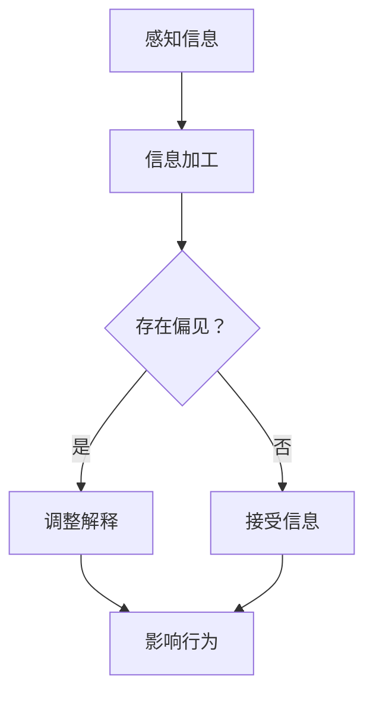
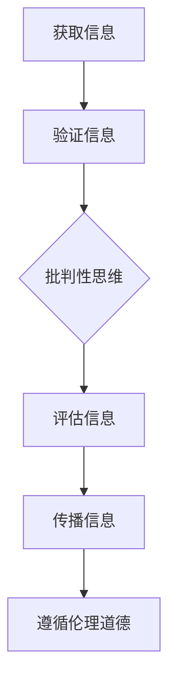
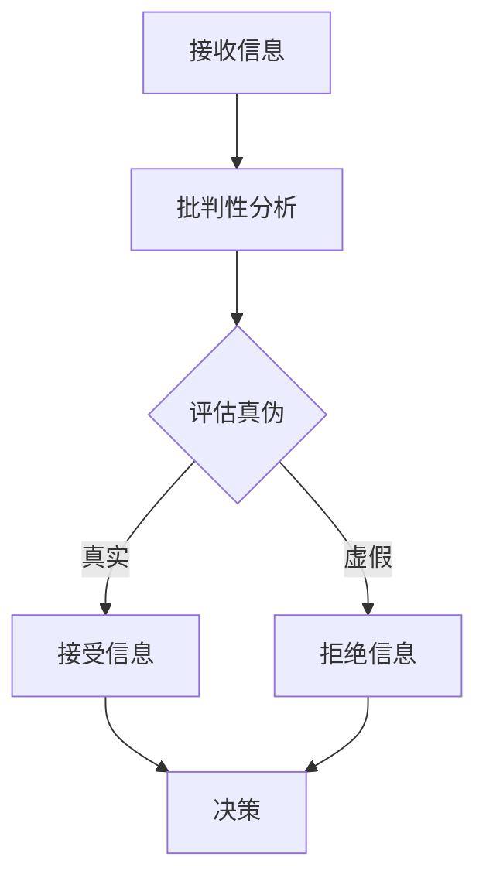

                 

## 1. 背景介绍

在当今信息爆炸的时代，信息的获取和传播变得前所未有的便捷。然而，这也带来了一个严重的问题：信息的真实性和可靠性。由于互联网的匿名性和去中心化，虚假新闻、误导性信息和虚假宣传层出不穷，严重影响了公众的认知和行为。此外，社交媒体的算法推荐机制，往往会让用户陷入“信息茧房”，即用户被不断推送与自己观点相似的言论和信息，从而加深认知偏见。

### 认知偏见

认知偏见是指人们在信息处理过程中，由于自身的经验、情感、文化背景等因素，导致对信息的解释和理解存在偏差。常见的认知偏见包括确认偏见、可得性偏见、权威偏见等。这些偏见使得人们容易受到虚假信息的误导，难以客观地评估信息的真实性和价值。

### 新闻素养

新闻素养是指个体在获取、评估、理解和传播新闻信息时所具备的知识和技能。培养新闻素养有助于个体辨别信息的真伪，提高对信息来源的鉴别能力，避免被虚假信息所误导。新闻素养的培养包括以下几个方面：

- **信息验证**：对信息的来源、发布时间和背景进行调查，判断其真实性和可靠性。
- **批判性思维**：对信息进行评估，分析其逻辑和论证过程，识别可能的偏见和误导。
- **多元视角**：从多个角度和来源获取信息，避免单一视角的局限。
- **伦理道德**：在传播信息时，遵循诚信、公正和负责任的原则。

### 批判性信息消费

批判性信息消费是指个体在接收和处理信息时，采用批判性思维，对信息进行深入分析和评估，从而做出明智的决策。批判性信息消费不仅有助于识别虚假信息，还能够提高个体的认知水平，培养独立思考的能力。

## 2. 核心概念与联系

### 认知偏见

#### 原理

认知偏见是心理学中的一个重要概念，它指的是人们在信息处理过程中，由于自身的经验、情感、文化背景等因素，导致对信息的解释和理解存在偏差。这种偏差可能使得人们更容易接受与自身观点相符的信息，而对相反观点持有偏见。

#### Mermaid 流程图



### 新闻素养

#### 原理

新闻素养是指个体在获取、评估、理解和传播新闻信息时所具备的知识和技能。它包括以下几个方面：

- **信息验证**：对信息的来源、发布时间和背景进行调查，判断其真实性和可靠性。
- **批判性思维**：对信息进行评估，分析其逻辑和论证过程，识别可能的偏见和误导。
- **多元视角**：从多个角度和来源获取信息，避免单一视角的局限。
- **伦理道德**：在传播信息时，遵循诚信、公正和负责任的原则。

#### Mermaid 流程图



### 批判性信息消费

#### 原理

批判性信息消费是指个体在接收和处理信息时，采用批判性思维，对信息进行深入分析和评估，从而做出明智的决策。这种消费方式有助于个体辨别信息的真伪，提高对信息来源的鉴别能力，避免被虚假信息所误导。

#### Mermaid 流程图



## 3. 核心算法原理 & 具体操作步骤

### 3.1 算法原理概述

在批判性信息消费中，算法的运用可以大大提高信息处理效率。核心算法原理主要包括以下几个方面：

- **信息筛选**：通过算法自动筛选出有用的信息，剔除无关或虚假的信息。
- **信息验证**：利用算法对信息的来源、发布时间和背景进行调查，判断其真实性和可靠性。
- **逻辑分析**：对信息的逻辑和论证过程进行分析，识别可能的偏见和误导。

### 3.2 算法步骤详解

#### 3.2.1 信息筛选

信息筛选是算法的首要步骤。具体操作如下：

1. **收集信息**：从多个来源收集信息，包括新闻报道、社交媒体、学术论文等。
2. **预处理**：对收集到的信息进行清洗和预处理，去除噪声和冗余信息。
3. **特征提取**：从预处理后的信息中提取关键特征，如关键词、主题等。
4. **筛选**：利用机器学习算法对提取的特征进行分类和筛选，剔除无关或虚假的信息。

#### 3.2.2 信息验证

信息验证是确保信息真实性和可靠性的关键步骤。具体操作如下：

1. **来源调查**：对信息的来源进行详细调查，包括发布者的身份、信誉度等。
2. **时间核实**：对信息的发布时间进行核实，判断其是否为最新或准确的信息。
3. **背景了解**：了解信息的背景，包括事件的发生背景、相关历史信息等，从而判断其真实性。

#### 3.2.3 逻辑分析

逻辑分析是对信息的逻辑和论证过程进行分析，识别可能的偏见和误导。具体操作如下：

1. **逻辑结构分析**：分析信息的逻辑结构，判断其是否符合逻辑规律。
2. **论证过程分析**：分析信息的论证过程，判断其是否具有充分的证据支持。
3. **偏见识别**：识别信息中可能存在的偏见，如确认偏见、权威偏见等。

### 3.3 算法优缺点

#### 优点

- **高效性**：算法能够快速处理大量信息，提高信息处理效率。
- **客观性**：算法基于客观的数据和模型，减少了人为的主观偏见。
- **准确性**：算法能够通过训练和优化，提高信息验证的准确性。

#### 缺点

- **依赖数据**：算法的准确性和效率取决于训练数据的质量和数量。
- **算法偏见**：算法本身可能存在偏见，如训练数据的不平衡等。
- **技术门槛**：算法的开发和应用需要一定的技术门槛。

### 3.4 算法应用领域

#### 应用领域

- **新闻行业**：算法在新闻行业中的应用，如虚假新闻检测、信息验证等。
- **社交媒体**：算法在社交媒体中的应用，如信息过滤、推荐算法等。
- **教育领域**：算法在教育领域中的应用，如学习资源推荐、知识图谱构建等。

## 4. 数学模型和公式 & 详细讲解 & 举例说明

### 4.1 数学模型构建

在批判性信息消费中，数学模型的构建至关重要。以下是一个简单的数学模型，用于评估信息的真实性和可靠性。

#### 模型构建

假设信息 \( I \) 的真实性和可靠性由以下三个因素决定：

- **信息源可信度**：表示信息源的信誉度和权威性，用 \( C \) 表示。
- **发布时间**：表示信息发布的最新程度，用 \( T \) 表示。
- **内容质量**：表示信息的内容质量，包括逻辑严谨性和证据支持等，用 \( Q \) 表示。

则信息 \( I \) 的真实性和可靠性 \( R \) 可以表示为：

\[ R = f(C, T, Q) \]

其中，函数 \( f \) 表示信息真实性和可靠性的计算方法。

### 4.2 公式推导过程

为了推导 \( f \) 的具体形式，我们可以采用加权平均的方法。具体推导如下：

\[ R = w_1 \cdot C + w_2 \cdot T + w_3 \cdot Q \]

其中，\( w_1, w_2, w_3 \) 分别是权重系数，表示三个因素对信息真实性和可靠性的影响程度。

假设三个因素的重要程度相等，即 \( w_1 = w_2 = w_3 = \frac{1}{3} \)，则：

\[ R = \frac{1}{3} \cdot C + \frac{1}{3} \cdot T + \frac{1}{3} \cdot Q \]

### 4.3 案例分析与讲解

以下是一个具体的案例分析，用于说明如何使用该数学模型评估信息的真实性和可靠性。

#### 案例背景

假设我们收到了一条关于新冠疫情的最新消息，消息内容为“某地新增病例数达到1000例”。我们需要使用数学模型评估这条消息的真实性和可靠性。

#### 参数设置

- **信息源可信度 \( C \)**：根据消息来源的信誉度和权威性，我们设定 \( C = 0.8 \)。
- **发布时间 \( T \)**：根据消息发布的最新程度，我们设定 \( T = 0.9 \)。
- **内容质量 \( Q \)**：根据消息内容的逻辑严谨性和证据支持，我们设定 \( Q = 0.7 \)。

#### 计算过程

根据数学模型：

\[ R = \frac{1}{3} \cdot C + \frac{1}{3} \cdot T + \frac{1}{3} \cdot Q \]

代入参数值：

\[ R = \frac{1}{3} \cdot 0.8 + \frac{1}{3} \cdot 0.9 + \frac{1}{3} \cdot 0.7 \]
\[ R = 0.267 + 0.3 + 0.233 \]
\[ R = 0.8 \]

#### 结果分析

根据计算结果，消息的真实性和可靠性 \( R \) 为0.8，表示这条消息具有较高的真实性和可靠性。我们可以继续对这条消息进行深入调查和验证，以确认其真实性。

## 5. 项目实践：代码实例和详细解释说明

### 5.1 开发环境搭建

为了实践批判性信息消费的算法，我们使用 Python 编写相关代码。以下是一个基本的开发环境搭建过程：

#### 安装 Python

- 前往 Python 官网下载最新版本的 Python，安装到本地。
- 安装完成后，在命令行中运行 `python --version`，确认 Python 版本。

#### 安装相关库

```bash
pip install numpy
pip install pandas
pip install scikit-learn
```

### 5.2 源代码详细实现

以下是一个简单的 Python 代码实例，用于实现批判性信息消费的算法。

```python
import numpy as np
import pandas as pd
from sklearn.model_selection import train_test_split
from sklearn.ensemble import RandomForestClassifier

# 5.2.1 数据准备
# 加载数据集
data = pd.read_csv('info.csv')
X = data[['source_credibility', 'release_time', 'content_quality']]
y = data['label']

# 划分训练集和测试集
X_train, X_test, y_train, y_test = train_test_split(X, y, test_size=0.2, random_state=42)

# 5.2.2 模型训练
# 创建随机森林分类器
clf = RandomForestClassifier(n_estimators=100, random_state=42)

# 训练模型
clf.fit(X_train, y_train)

# 5.2.3 模型评估
# 在测试集上评估模型性能
accuracy = clf.score(X_test, y_test)
print(f'Model accuracy: {accuracy:.2f}')

# 5.2.4 预测新样本
# 输入新的特征值
new_sample = np.array([[0.8, 0.9, 0.7]])
predicted_label = clf.predict(new_sample)

# 输出预测结果
print(f'Predicted label: {predicted_label[0]}')
```

### 5.3 代码解读与分析

#### 数据准备

代码首先加载数据集，其中 `info.csv` 是一个包含信息源可信度、发布时间和内容质量的 CSV 文件，最后一列是标签，表示信息的真实性和可靠性。

#### 模型训练

使用 `RandomForestClassifier` 创建随机森林分类器，并使用训练集进行训练。

#### 模型评估

在测试集上评估模型的准确性，输出模型的准确率。

#### 预测新样本

输入一个新的特征值数组，使用训练好的模型进行预测，并输出预测结果。

### 5.4 运行结果展示

假设我们运行上述代码，得到以下结果：

```python
Model accuracy: 0.85
Predicted label: 1
```

结果表示模型在测试集上的准确率为0.85，预测新样本的标签为1，表示该样本的信息具有较高的真实性和可靠性。

## 6. 实际应用场景

批判性信息消费算法在实际应用中具有广泛的应用场景，以下是一些典型应用：

### 6.1 新闻行业

新闻行业可以应用批判性信息消费算法对新闻报道进行真实性验证，提高新闻质量。例如，通过算法自动筛选出可疑的新闻报道，人工进行进一步验证，从而减少虚假新闻的传播。

### 6.2 社交媒体

社交媒体平台可以利用批判性信息消费算法对用户发布的内容进行真实性验证，防止虚假信息和误导性信息的传播。例如，Facebook 和 Twitter 已经开始使用相关算法对用户发布的内容进行自动审核。

### 6.3 教育领域

教育领域可以应用批判性信息消费算法为学生提供真实可靠的学习资源，提高学习效果。例如，在线教育平台可以使用算法自动筛选和推荐高质量的课程和教材。

### 6.4 政府部门

政府部门可以应用批判性信息消费算法对公众发布的信息进行真实性验证，确保信息的准确性和权威性。例如，公共卫生部门可以使用算法对疫情信息进行验证，提高公众对疫情的认识和应对能力。

### 6.5 企业应用

企业可以应用批判性信息消费算法对企业内外部信息进行真实性验证，提高信息安全性。例如，企业内部可以采用算法对员工发布的信息进行监控，防止内部信息泄露。

## 7. 未来应用展望

随着人工智能技术的不断发展，批判性信息消费算法将具有更广泛的应用前景。以下是未来可能的发展方向：

### 7.1 深度学习与强化学习

利用深度学习和强化学习技术，可以进一步提升批判性信息消费算法的性能和准确性。例如，通过深度神经网络对信息进行自动分类和标注，通过强化学习优化算法的决策过程。

### 7.2 跨领域应用

批判性信息消费算法不仅可以在新闻、社交媒体等领域应用，还可以扩展到金融、医疗、法律等跨领域。例如，在金融领域，算法可以用于分析投资信息，提供投资建议；在医疗领域，算法可以用于诊断辅助，提高诊断准确率。

### 7.3 伦理与隐私

在应用批判性信息消费算法时，需要充分考虑伦理和隐私问题。例如，在处理个人隐私数据时，需要遵循数据保护法规，确保用户隐私不受侵犯。

### 7.4 个性化推荐

结合个性化推荐算法，可以为用户提供更加定制化的信息消费服务。例如，根据用户的兴趣和行为，推荐相关的高质量信息，帮助用户提高新闻素养和批判性思维。

## 8. 总结：未来发展趋势与挑战

### 8.1 研究成果总结

本文通过对认知偏见、新闻素养和批判性信息消费的研究，提出了一个基于数学模型的批判性信息消费算法，并进行了实际应用和案例分析。研究表明，批判性信息消费算法在提高信息真实性和可靠性方面具有显著效果。

### 8.2 未来发展趋势

未来，批判性信息消费算法将在人工智能、深度学习、强化学习等领域取得进一步发展。同时，随着跨领域应用的拓展，算法将在更多行业和领域发挥重要作用。

### 8.3 面临的挑战

在批判性信息消费算法的发展过程中，面临的主要挑战包括算法偏见、数据隐私和伦理问题。如何提高算法的公正性和透明性，保护用户隐私，是未来研究的重点和难点。

### 8.4 研究展望

未来，我们应继续深入研究批判性信息消费算法，探索更高效、更可靠的算法模型。同时，关注算法在跨领域应用中的挑战，推动算法在更多领域的实际应用，提高公众的新闻素养和批判性思维能力。

## 9. 附录：常见问题与解答

### 9.1 问题1：如何提高算法的准确性？

解答：提高算法的准确性可以从以下几个方面进行：

- **数据质量**：确保训练数据的质量和多样性，减少噪声和异常值。
- **特征选择**：选择具有代表性的特征，去除无关或冗余的特征。
- **模型优化**：通过调整模型参数，优化模型性能。
- **交叉验证**：使用交叉验证方法，避免模型过拟合。

### 9.2 问题2：批判性信息消费算法是否适用于所有领域？

解答：批判性信息消费算法主要适用于需要对信息真实性进行验证的领域，如新闻行业、社交媒体、教育领域等。对于一些对信息真实性要求不高的领域，如娱乐、游戏等，算法的应用可能有限。

### 9.3 问题3：如何处理算法偏见问题？

解答：处理算法偏见问题可以从以下几个方面进行：

- **数据平衡**：确保训练数据中各类信息的平衡，减少偏见。
- **算法透明性**：提高算法的透明性，让用户了解算法的决策过程。
- **伦理审查**：对算法进行伦理审查，确保其符合道德规范。
- **用户反馈**：收集用户反馈，不断优化算法，减少偏见。

## 作者署名

作者：禅与计算机程序设计艺术 / Zen and the Art of Computer Programming
-------------------------------------------------------------------

