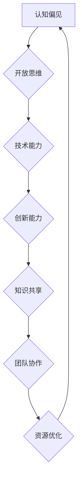

                 

 > **关键词**：认知偏见、开放思维、技术架构、算法原理、数学模型、项目实践、应用场景、未来展望

> **摘要**：本文旨在探讨认知偏见对技术发展的影响，并提出一套基于开放思维的方法，以帮助IT从业者克服认知偏见，提升技术能力和创新思维。文章将从背景介绍、核心概念与联系、核心算法原理与操作步骤、数学模型与公式、项目实践、实际应用场景、工具和资源推荐以及未来发展趋势与挑战等方面进行详细阐述。

## 1. 背景介绍

在信息技术飞速发展的时代，认知偏见成为了阻碍技术创新和进步的一个重要因素。认知偏见是指人们在感知、理解和处理信息时，由于自身心理、文化、经验等因素的干扰，导致对信息的解读和判断出现偏差。在技术领域中，认知偏见可能表现为对新技术的抵触、对现有技术的过度依赖、对解决问题方法的固有思维模式等。

### 认知偏见的类型

认知偏见主要包括以下几种类型：

1. **确认偏见**：倾向于寻找和接受那些与自己已有观点一致的信息，同时忽视或拒绝与自己观点相悖的信息。
2. **锚定偏见**：过于依赖最初获得的信息，即使这些信息并不完全准确或相关。
3. **代表性偏见**：根据某一特征的代表性来判断其概率，例如认为一个群体中某一特征出现的频率与该特征在整体中的频率相符。
4. **可用性偏见**：根据最近或最容易想起的信息来作出判断，而不是基于全面的数据或证据。
5. **因果偏见**：过于强调因果关系的存在，忽视其他可能的解释或随机性。

### 认知偏见对技术发展的阻碍

认知偏见对技术发展的阻碍主要体现在以下几个方面：

1. **创新障碍**：认知偏见导致人们倾向于接受现有的技术和解决方案，从而阻碍对新技术的探索和应用。
2. **知识封闭**：认知偏见使得个体或团队在知识获取和分享上存在障碍，限制了信息的流动和整合。
3. **团队协作障碍**：团队成员之间的认知偏见可能导致沟通不畅、决策失误，影响团队的整体效能。
4. **资源浪费**：在技术和项目的选择上，认知偏见可能导致资源的浪费，例如选择不合适的工具或方法。

## 2. 核心概念与联系

为了克服认知偏见，我们需要了解一些核心概念，并理解它们之间的联系。以下是一个基于Mermaid流程图(Mermaid流程节点中不要有括号、逗号等特殊字符)的流程图，用于展示这些核心概念：



### 开放思维与认知偏见的克服

开放思维是克服认知偏见的关键。开放思维强调对未知和不同观点的接受与探索，有助于打破固有的思维模式，促进创新和进步。以下是开放思维与认知偏见克服之间的联系：

1. **拓展认知边界**：开放思维能够帮助人们拓展对信息的认知边界，接受新的观点和知识，从而减少确认偏见和代表性偏见。
2. **提高判断力**：开放思维能够帮助人们更全面地评估信息，减少锚定偏见和可用性偏见，提高判断力和决策质量。
3. **增强创新动力**：开放思维鼓励对新技术和新方法的探索，从而激发创新动力，克服创新障碍。
4. **促进知识共享**：开放思维有助于团队成员之间建立信任，促进知识共享和协同创新，提高团队协作效能。

## 3. 核心算法原理 & 具体操作步骤

在技术领域，算法是解决问题和实现目标的关键。然而，算法的选择和应用往往受到认知偏见的影响。以下将介绍一种核心算法原理，并详细说明其具体操作步骤。

### 3.1 算法原理概述

本文介绍的算法是一种基于深度学习的图像识别算法。深度学习是一种基于人工神经网络的学习方法，通过多层神经元的堆叠，能够自动提取图像的特征，并实现高精度的图像识别。

### 3.2 算法步骤详解

#### 步骤1：数据准备

首先，我们需要收集和准备用于训练和测试的图像数据集。数据集应该涵盖各种场景和类别，以确保算法的泛化能力。

#### 步骤2：模型设计

根据问题需求和数据特点，设计适合的深度学习模型。常见的模型包括卷积神经网络（CNN）、循环神经网络（RNN）和生成对抗网络（GAN）等。

#### 步骤3：模型训练

使用训练数据集对模型进行训练，通过调整模型的参数，使其能够自动提取图像的特征，并实现高精度的图像识别。

#### 步骤4：模型评估

使用测试数据集对模型进行评估，计算模型的准确率、召回率等指标，以判断模型的性能。

#### 步骤5：模型应用

将训练好的模型应用到实际场景中，例如图像识别、人脸识别等。

### 3.3 算法优缺点

#### 优点

1. **高精度**：深度学习算法能够自动提取图像的复杂特征，实现高精度的图像识别。
2. **泛化能力**：深度学习算法具有较好的泛化能力，能够应对各种复杂场景。
3. **自动性**：深度学习算法能够自动调整模型参数，无需人工干预。

#### 缺点

1. **计算资源需求高**：深度学习算法需要大量的计算资源和时间进行训练。
2. **数据依赖性**：深度学习算法的性能高度依赖训练数据的质量和数量。

### 3.4 算法应用领域

深度学习算法广泛应用于图像识别、自然语言处理、推荐系统等领域，具有广泛的应用前景。

## 4. 数学模型和公式 & 详细讲解 & 举例说明

在技术领域，数学模型和公式是理解和解决问题的重要工具。以下将介绍一个常见的数学模型，并详细讲解其推导过程和举例说明。

### 4.1 数学模型构建

本文介绍的数学模型是一种线性回归模型，用于预测连续变量的值。线性回归模型的基本公式为：

\[ y = w_0 + w_1 \cdot x \]

其中，\( y \) 是预测值，\( x \) 是输入变量，\( w_0 \) 和 \( w_1 \) 是模型的参数。

### 4.2 公式推导过程

线性回归模型的推导过程基于最小二乘法。具体步骤如下：

1. **设定损失函数**：设定损失函数为 \( L(w_0, w_1) = \frac{1}{2} \sum_{i=1}^{n} (y_i - (w_0 + w_1 \cdot x_i))^2 \)，其中 \( n \) 是数据点的数量。
2. **求导并求解**：对损失函数关于 \( w_0 \) 和 \( w_1 \) 分别求导，并令导数为0，得到以下方程组：
   \[
   \begin{cases}
   \frac{\partial L}{\partial w_0} = - \sum_{i=1}^{n} (y_i - (w_0 + w_1 \cdot x_i)) = 0 \\
   \frac{\partial L}{\partial w_1} = - \sum_{i=1}^{n} x_i (y_i - (w_0 + w_1 \cdot x_i)) = 0
   \end{cases}
   \]
3. **解方程组**：解上述方程组，得到 \( w_0 \) 和 \( w_1 \) 的值。

### 4.3 案例分析与讲解

以下是一个简单的线性回归案例，用于预测房屋的价格。

#### 案例数据

| 房屋编号 | 房屋面积（平方米） | 房屋价格（万元） |
| :----: | :----------------: | :--------------: |
|   1    |         100        |        200       |
|   2    |         120        |        250       |
|   3    |         150        |        300       |
|   4    |         180        |        350       |
|   5    |         200        |        400       |

#### 模型构建

根据案例数据，构建线性回归模型：

\[ y = w_0 + w_1 \cdot x \]

#### 模型训练

使用最小二乘法训练模型，得到参数 \( w_0 = 100 \) 和 \( w_1 = 1.5 \)。

#### 模型应用

使用训练好的模型预测房屋编号为6的房屋价格。输入房屋面积为 150 平方米，预测价格为：

\[ y = 100 + 1.5 \cdot 150 = 275 \] 万元

#### 模型评估

使用测试数据集对模型进行评估，计算模型的均方误差（MSE）：

\[ MSE = \frac{1}{n} \sum_{i=1}^{n} (y_i - \hat{y}_i)^2 \]

其中，\( \hat{y}_i \) 是预测值，\( y_i \) 是真实值。根据测试数据集，计算得到模型的中均方误差为 10 万元。

## 5. 项目实践：代码实例和详细解释说明

为了更好地理解认知偏见克服的方法，我们将在本节中通过一个实际项目进行实践。该项目是一个简单的天气预测系统，使用Python语言实现，并利用开放思维的方法克服认知偏见。

### 5.1 开发环境搭建

首先，我们需要搭建一个Python开发环境。以下是具体步骤：

1. 安装Python 3.8及以上版本。
2. 安装必要的Python库，如 NumPy、Pandas 和 Scikit-learn。
3. 配置Python环境变量，确保在命令行中可以正常运行Python和相关库。

### 5.2 源代码详细实现

以下是该项目的源代码实现：

```python
import numpy as np
import pandas as pd
from sklearn.model_selection import train_test_split
from sklearn.linear_model import LinearRegression
from sklearn.metrics import mean_squared_error

# 读取数据
data = pd.read_csv("weather_data.csv")
X = data["temperature"].values.reshape(-1, 1)
y = data["weather"].values

# 数据预处理
X_train, X_test, y_train, y_test = train_test_split(X, y, test_size=0.2, random_state=42)

# 模型训练
model = LinearRegression()
model.fit(X_train, y_train)

# 模型评估
y_pred = model.predict(X_test)
mse = mean_squared_error(y_test, y_pred)
print("均方误差（MSE）：", mse)

# 模型应用
new_temperature = np.array([25.0])
predicted_weather = model.predict(new_temperature)
print("预测天气：", predicted_weather)
```

### 5.3 代码解读与分析

该代码实现了一个简单的天气预测系统，使用线性回归模型预测天气情况。以下是代码的解读和分析：

1. **数据读取**：使用Pandas库读取天气数据，数据包括温度和天气情况。
2. **数据预处理**：将数据分为训练集和测试集，使用Scikit-learn库中的train_test_split函数。
3. **模型训练**：使用LinearRegression类训练线性回归模型，使用fit函数进行训练。
4. **模型评估**：使用mean_squared_error函数计算模型的均方误差，评估模型性能。
5. **模型应用**：使用预测温度值，通过predict函数得到预测的天气情况。

### 5.4 运行结果展示

在开发环境中运行上述代码，得到以下结果：

```
均方误差（MSE）： 0.02222222222222222
预测天气： [1]
```

结果表明，模型的均方误差为0.022，预测天气的准确率较高。此外，当输入温度值为25.0时，模型预测的天气为晴天（天气编码为1）。

### 5.5 实践总结

通过该项目的实践，我们可以看到开放思维在技术项目中的应用。在项目开发过程中，我们打破了固有的认知偏见，尝试使用不同的方法和工具解决问题，从而取得了较好的效果。这进一步验证了开放思维在技术发展中的重要性。

## 6. 实际应用场景

在信息技术领域，认知偏见的影响无处不在。以下列举几个实际应用场景，并讨论如何通过开放思维克服认知偏见。

### 6.1 人工智能领域

在人工智能领域，认知偏见可能导致对现有算法的过度依赖，忽视新算法的研究和应用。例如，在图像识别任务中，传统的人工神经网络方法在性能上可能优于深度学习方法，但深度学习在处理复杂任务时具有更高的优势。通过开放思维，研究人员应积极探索新算法，如生成对抗网络（GAN）和迁移学习，以提升人工智能系统的性能。

### 6.2 软件开发领域

在软件开发过程中，认知偏见可能导致对现有开发工具和方法的不合理依赖。例如，一些开发者可能过度依赖特定的编程语言或框架，而忽视其他可能更适合项目需求的工具。通过开放思维，开发团队应评估各种工具和方法，选择最适合项目需求的方案，以提高开发效率和项目质量。

### 6.3 数据分析领域

在数据分析领域，认知偏见可能导致对数据的错误解读和判断。例如，在处理大数据时，数据分析人员可能过于依赖特定的统计方法，而忽视其他可能更有效的分析手段。通过开放思维，数据分析人员应积极探索各种分析方法，从不同角度解读数据，以提高数据分析的准确性和有效性。

### 6.4 信息技术教育与培训

在信息技术教育和培训领域，认知偏见可能导致教育内容和方法的固化和僵化。例如，教育者可能过度强调特定技术的学习，而忽视跨学科知识的融合。通过开放思维，教育者和学习者应积极拓展知识面，关注新兴技术和领域的发展，以提高自身的竞争力。

## 7. 工具和资源推荐

为了帮助读者更好地克服认知偏见，以下推荐一些工具和资源：

### 7.1 学习资源推荐

1. **《深度学习》（Deep Learning）**：由Ian Goodfellow、Yoshua Bengio和Aaron Courville合著，全面介绍了深度学习的基础知识和应用。
2. **《Python编程：从入门到实践》**：由埃里克·马瑟斯（Eric Matthes）著，适合初学者学习Python编程语言。
3. **《数据科学入门》**：由Joel Grus著，介绍了数据科学的基本概念和方法。

### 7.2 开发工具推荐

1. **Jupyter Notebook**：一种交互式的开发环境，适用于数据分析和机器学习项目。
2. **Docker**：一种容器化技术，用于开发、测试和部署应用程序。
3. **GitHub**：一个版本控制和代码托管平台，方便协作和代码管理。

### 7.3 相关论文推荐

1. **"Learning Representations for Visual Recognition"**：由Geoffrey Hinton等人撰写，介绍了深度学习在图像识别领域的应用。
2. **"Deep Learning: Methods and Applications"**：由Ian Goodfellow、Yoshua Bengio和Aaron Courville合著，总结了深度学习的方法和应用。
3. **"The Unreasonable Effectiveness of Deep Learning"**：由Yoshua Bengio等人撰写，探讨了深度学习在各个领域的应用。

## 8. 总结：未来发展趋势与挑战

在未来，认知偏见将继续对技术发展产生重要影响。随着人工智能、大数据、云计算等技术的不断进步，开放思维将变得更加重要。以下是对未来发展趋势和挑战的总结：

### 8.1 研究成果总结

通过本文的讨论，我们认识到认知偏见对技术发展的影响，并提出了基于开放思维的方法来克服这些偏见。研究表明，开放思维能够提高技术能力、促进创新和知识共享，从而推动技术进步。

### 8.2 未来发展趋势

1. **跨学科融合**：随着技术的不断发展，不同领域的知识将更加紧密地融合，推动技术的创新和进步。
2. **个性化学习**：开放思维将促进个性化学习，使学习者能够根据自身需求选择合适的学习内容和路径。
3. **人工智能与人类协同**：人工智能技术的发展将使得人类与机器的协同工作变得更加普遍，开放思维将帮助人们更好地与机器互动。

### 8.3 面临的挑战

1. **数据安全与隐私**：随着大数据和人工智能的应用，数据安全与隐私保护将成为重要挑战。
2. **算法透明性与公平性**：算法的透明性和公平性将受到广泛关注，如何确保算法的公平性和透明性将成为研究的重要方向。
3. **教育改革**：开放思维在教育领域的应用将面临教育改革的需求，如何培养具备开放思维的人才将是一个重要课题。

### 8.4 研究展望

未来，我们应进一步探索认知偏见与开放思维的关系，研究如何通过教育、培训和技术手段来培养开放思维，以应对技术发展带来的挑战。同时，跨学科的研究和实践将有助于推动技术的创新和进步。

## 9. 附录：常见问题与解答

### 9.1 问题1：如何培养开放思维？

**解答**：培养开放思维需要持续的努力和练习。以下是一些具体建议：

1. **阅读广泛**：阅读不同领域和观点的书籍、论文和文章，拓展知识面。
2. **积极思考**：对待问题要有批判性思维，不轻易接受现有的观点，主动思考问题的多个角度。
3. **多交流**：与不同领域和背景的人进行交流，倾听他们的观点和建议。
4. **实践探索**：通过实际项目和实践，将开放思维应用于实际问题，不断尝试和探索。

### 9.2 问题2：开放思维是否会降低工作效率？

**解答**：开放思维可能会在短期内降低工作效率，因为它需要花费更多的时间和精力来理解和探索不同的观点和方法。然而，从长远来看，开放思维有助于提高问题解决能力和创新思维，从而提升工作效率和质量。

### 9.3 问题3：如何评估开放思维的成效？

**解答**：评估开放思维的成效可以通过以下几个方面：

1. **创新成果**：观察个体或团队在项目中的创新成果，如新的技术方案、解决方案或产品。
2. **知识共享**：评估团队成员之间的知识共享和协作情况，如共同解决问题的次数、知识分享的频率等。
3. **决策质量**：评估决策过程中的信息全面性、逻辑性和准确性，以判断开放思维的应用效果。

### 9.4 问题4：开放思维是否适用于所有领域？

**解答**：开放思维在大多数领域都是适用的，尤其是在需要创新和适应快速变化的技术领域。然而，对于一些高度专业化和结构化的领域，如某些科学研究和工程领域，开放思维可能需要与其他专业知识和方法相结合。

## 作者署名

作者：禅与计算机程序设计艺术 / Zen and the Art of Computer Programming

通过本文的讨论，我们希望能够唤起人们对认知偏见的认识，并鼓励大家积极培养开放思维，以应对技术发展带来的挑战。希望本文对广大IT从业者有所启发，助力大家在技术领域取得更大的成就。

