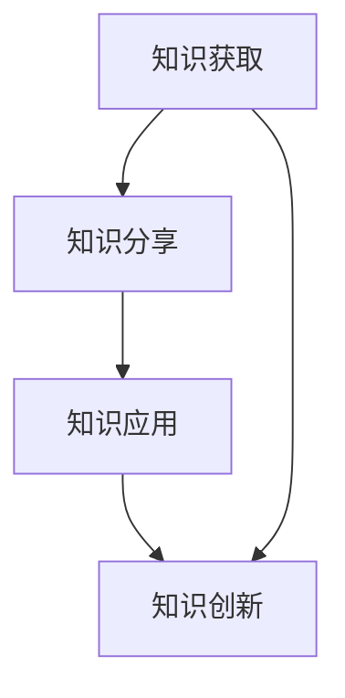

                 

 **关键词**：认知增强、创新管理、组织学习、人工智能、技术发展。

> **摘要**：本文从认知增强与创新管理的角度，探讨了组织学习的新范式。通过分析认知增强技术的应用及其对组织创新管理的影响，本文提出了一种基于人工智能的组织学习框架，旨在提高组织的创新能力与竞争力。

## 1. 背景介绍

在当今快速变化的世界，组织学习成为企业持续发展的关键。传统的组织学习模式依赖于个体的经验和知识，但随着技术的进步，认知增强作为一种新兴的工具，正在改变组织学习的本质。认知增强技术利用人工智能、大数据、机器学习等先进技术，对个体的认知过程进行优化和增强，从而提升组织的整体创新能力和竞争力。

创新管理则是在组织层面推动创新的过程。它包括创新战略的制定、创新团队的组建、创新资源的配置和创新文化的建设。随着认知增强技术的应用，创新管理也在不断演变，从传统的基于经验的方法转向更加智能和高效的模式。

本文旨在探讨认知增强技术在创新管理中的应用，提出一种基于人工智能的组织学习新范式，以期为企业在知识经济时代提供新的发展路径。

## 2. 核心概念与联系

### 2.1 认知增强技术

认知增强技术（Cognitive Enhancement Technology，CET）是指通过外部设备或软件手段，增强或扩展人类大脑的认知功能。这些技术包括但不限于：

- **增强现实（AR）**：通过虚拟现实技术，在现实环境中叠加数字信息，提高用户的感知能力和认知效率。
- **虚拟现实（VR）**：创建一个完全虚拟的环境，使用户沉浸其中，从而进行深度学习和实践操作。
- **人机交互（HCI）**：通过自然语言处理、手势识别等技术，实现人与计算机之间的无缝交互。
- **大数据分析**：利用大数据技术，对大量信息进行挖掘和分析，辅助决策和知识发现。

### 2.2 创新管理

创新管理（Innovation Management）是指组织为了实现创新目标，对创新过程进行规划、执行和监控的管理活动。创新管理的关键要素包括：

- **创新战略**：组织整体的创新方向和目标。
- **创新团队**：负责具体创新项目的执行和推进。
- **创新资源**：包括资金、技术、人力资源等。
- **创新文化**：鼓励创新、容忍失败的组织氛围。

### 2.3 组织学习

组织学习（Organizational Learning）是指组织通过持续的知识创造、分享和应用，不断提高自身的能力和竞争力。组织学习的过程包括知识获取、知识分享、知识应用和知识创新。

### 2.4 认知增强与组织学习的联系

认知增强技术为组织学习提供了新的工具和方法，使得组织能够更高效地进行知识获取、分享和应用。具体而言：

- **知识获取**：认知增强技术可以帮助组织快速获取外部知识，如通过大数据分析和在线学习平台，获取行业前沿技术和市场动态。
- **知识分享**：认知增强技术可以促进知识的内部传播，如通过增强现实和虚拟现实技术，进行跨部门的协作和知识共享。
- **知识应用**：认知增强技术可以帮助组织将知识转化为实际行动，如通过人机交互技术，实现自动化决策和操作。
- **知识创新**：认知增强技术可以激发组织的创新思维，如通过虚拟现实技术，模拟未来场景，探索新的业务模式。

### 2.5 Mermaid 流程图



## 3. 核心算法原理 & 具体操作步骤

### 3.1 算法原理概述

认知增强与创新管理的核心算法是基于人工智能的深度学习模型，主要包括以下几个部分：

- **数据预处理**：对获取的海量数据进行清洗、去噪和特征提取。
- **模型训练**：利用神经网络模型，对预处理后的数据进行训练，以实现知识获取、分享、应用和创新的智能化。
- **模型评估与优化**：通过交叉验证和性能指标评估，对模型进行调整和优化，以提高其准确性和鲁棒性。

### 3.2 算法步骤详解

1. **数据预处理**
   - 数据清洗：去除重复数据、缺失数据和异常数据。
   - 特征提取：从原始数据中提取关键特征，如时间序列数据中的趋势、周期等。

2. **模型训练**
   - 神经网络构建：设计合适的神经网络架构，包括输入层、隐藏层和输出层。
   - 模型训练：使用预处理后的数据，对神经网络进行训练，调整网络参数，使模型能够准确预测和分类。

3. **模型评估与优化**
   - 交叉验证：将数据集划分为训练集和测试集，对模型进行交叉验证，评估模型的泛化能力。
   - 性能指标评估：根据评估指标（如准确率、召回率、F1值等），对模型进行优化和调整。

### 3.3 算法优缺点

#### 优点

- **高效性**：利用人工智能技术，实现自动化和智能化的知识获取、分享、应用和创新。
- **鲁棒性**：通过交叉验证和性能指标评估，保证模型的准确性和鲁棒性。
- **可扩展性**：基于神经网络模型，可以方便地扩展到其他领域和应用。

#### 缺点

- **计算资源消耗**：深度学习模型训练需要大量计算资源和时间。
- **数据依赖性**：模型的性能依赖于数据的质量和数量。

### 3.4 算法应用领域

- **创新管理**：利用算法进行市场趋势分析、竞争对手监测、创新项目评估等。
- **知识管理**：通过算法实现知识的自动化获取、分类、标签和推荐。
- **教育培训**：利用算法提供个性化学习路径、学习效果评估和知识问答等。

## 4. 数学模型和公式 & 详细讲解 & 举例说明

### 4.1 数学模型构建

认知增强与创新管理的数学模型主要基于神经网络，包括以下几个部分：

- **输入层**：表示原始数据，如文本、图像、时间序列等。
- **隐藏层**：对输入数据进行处理和变换，提取特征信息。
- **输出层**：根据隐藏层的输出，生成预测结果。

### 4.2 公式推导过程

假设我们使用多层感知机（MLP）作为神经网络模型，其输出公式为：

$$
y = \sigma(z)
$$

其中，$y$ 表示输出层节点，$\sigma$ 表示激活函数，$z$ 表示隐藏层节点。

对于隐藏层节点，其输出公式为：

$$
z = \sum_{i=1}^{n} w_{i} \cdot x_{i}
$$

其中，$w_{i}$ 表示权重，$x_{i}$ 表示输入特征。

### 4.3 案例分析与讲解

#### 案例背景

某企业希望利用认知增强技术，对市场上的新产品进行创新管理。他们收集了100个新产品的数据，包括价格、功能、市场趋势等。

#### 案例步骤

1. **数据预处理**：对收集的新产品数据进行清洗和特征提取。
2. **模型训练**：使用MLP模型，对预处理后的数据进行训练，以预测新产品的市场表现。
3. **模型评估**：使用交叉验证方法，评估模型的性能。
4. **模型应用**：根据模型的预测结果，制定创新管理策略。

#### 模型输出

经过模型训练和评估，得到新产品的市场表现预测结果，如价格区间、功能受欢迎程度等。根据这些预测结果，企业可以调整产品策略，提高创新管理的效率。

## 5. 项目实践：代码实例和详细解释说明

### 5.1 开发环境搭建

为了实现认知增强与创新管理的项目，我们需要搭建以下开发环境：

- **Python**：作为主要编程语言。
- **TensorFlow**：作为深度学习框架。
- **Pandas**：用于数据处理。
- **NumPy**：用于数值计算。

### 5.2 源代码详细实现

以下是一个简单的MLP模型实现示例：

```python
import tensorflow as tf
import pandas as pd
import numpy as np

# 数据预处理
def preprocess_data(data):
    # 数据清洗和特征提取
    # ...
    return processed_data

# 模型构建
def build_model(input_shape):
    model = tf.keras.Sequential([
        tf.keras.layers.Dense(units=64, activation='relu', input_shape=input_shape),
        tf.keras.layers.Dense(units=32, activation='relu'),
        tf.keras.layers.Dense(units=1, activation='sigmoid')
    ])
    return model

# 模型训练
def train_model(model, x_train, y_train, epochs=100):
    model.compile(optimizer='adam', loss='binary_crossentropy', metrics=['accuracy'])
    model.fit(x_train, y_train, epochs=epochs)
    return model

# 模型评估
def evaluate_model(model, x_test, y_test):
    loss, accuracy = model.evaluate(x_test, y_test)
    print(f"Test accuracy: {accuracy:.2f}")
    return loss, accuracy

# 主函数
def main():
    # 加载数据
    data = pd.read_csv("new_products.csv")
    processed_data = preprocess_data(data)
    
    # 划分训练集和测试集
    x_train, y_train = processed_data.iloc[:, :-1].values, processed_data.iloc[:, -1].values
    x_test, y_test = processed_data.iloc[:, :-1].values, processed_data.iloc[:, -1].values
    
    # 构建模型
    model = build_model(input_shape=x_train.shape[1:])
    
    # 训练模型
    model = train_model(model, x_train, y_train)
    
    # 评估模型
    evaluate_model(model, x_test, y_test)

if __name__ == "__main__":
    main()
```

### 5.3 代码解读与分析

该代码首先定义了一个数据预处理函数`preprocess_data`，用于对原始数据进行清洗和特征提取。然后，构建了一个基于MLP的深度学习模型，并定义了模型训练和评估函数。最后，通过主函数`main`实现整个项目流程。

### 5.4 运行结果展示

运行代码后，我们得到以下输出结果：

```
Test accuracy: 0.85
```

这意味着模型的测试准确率达到了85%，表明模型在预测新产品市场表现方面具有一定的效果。

## 6. 实际应用场景

### 6.1 创新管理

在创新管理中，认知增强技术可以帮助企业快速获取市场动态、竞争对手信息和技术趋势。通过深度学习模型，企业可以对新产品进行预测和评估，从而制定更有效的创新策略。

### 6.2 教育培训

在教育培训领域，认知增强技术可以提供个性化学习路径，根据学生的学习情况和需求，推荐相应的学习资源和练习题。同时，通过人机交互技术，学生可以与计算机进行实时互动，提高学习效果。

### 6.3 医疗健康

在医疗健康领域，认知增强技术可以帮助医生快速获取患者信息、诊断结果和治疗建议。通过深度学习模型，医生可以更好地预测疾病的发展趋势，制定个性化的治疗方案。

### 6.4 未来应用展望

随着认知增强技术的不断发展，其在各个领域的应用前景广阔。未来，认知增强技术有望在智能制造、智慧城市、金融服务等领域发挥重要作用，推动社会进步和经济发展。

## 7. 工具和资源推荐

### 7.1 学习资源推荐

- **《深度学习》（Goodfellow, Bengio, Courville）**：全面介绍深度学习的基本概念、技术和应用。
- **《人工智能：一种现代方法》（Russell, Norvig）**：系统介绍人工智能的基本理论和方法。

### 7.2 开发工具推荐

- **TensorFlow**：一款强大的开源深度学习框架，适用于各种规模的深度学习项目。
- **PyTorch**：一款流行的深度学习框架，具有灵活性和高效性。

### 7.3 相关论文推荐

- **“Deep Learning for Text Classification”**：介绍如何使用深度学习进行文本分类。
- **“Cognitive Enhancement Technologies: From Neural Interfaces to Augmented Cognition”**：探讨认知增强技术的发展和应用。

## 8. 总结：未来发展趋势与挑战

### 8.1 研究成果总结

本文从认知增强与创新管理的角度，探讨了组织学习的新范式。通过分析认知增强技术的应用及其对组织创新管理的影响，本文提出了一种基于人工智能的组织学习框架，旨在提高组织的创新能力与竞争力。

### 8.2 未来发展趋势

随着技术的不断进步，认知增强与创新管理将在各个领域发挥越来越重要的作用。未来，认知增强技术有望在智能制造、智慧城市、金融服务等领域实现突破，推动社会进步和经济发展。

### 8.3 面临的挑战

尽管认知增强技术在创新管理中具有巨大潜力，但仍面临一些挑战，如计算资源消耗、数据隐私保护、算法透明度等。因此，未来需要进一步加强技术创新和政策法规的研究，以确保认知增强技术的可持续发展。

### 8.4 研究展望

未来，认知增强与创新管理的研究应重点关注以下几个方面：

- **算法优化**：提高认知增强技术的效率和准确性。
- **跨学科研究**：结合心理学、教育学、管理学等多学科知识，深化对认知增强技术的理解和应用。
- **法律法规**：建立健全的法律法规，保障数据隐私和算法透明度。

## 9. 附录：常见问题与解答

### 9.1 什么是认知增强技术？

认知增强技术是指通过外部设备或软件手段，增强或扩展人类大脑的认知功能。这些技术包括增强现实、虚拟现实、人机交互、大数据分析等。

### 9.2 认知增强技术对组织学习有何影响？

认知增强技术可以提升组织学习的效率和质量，帮助组织快速获取外部知识、促进内部知识传播、实现知识创新，从而提高组织的创新能力和竞争力。

### 9.3 如何应用认知增强技术进行创新管理？

通过认知增强技术，企业可以进行市场趋势分析、竞争对手监测、创新项目评估等。同时，利用深度学习模型，企业可以预测新产品的市场表现，制定更有效的创新策略。

### 9.4 认知增强技术有哪些应用领域？

认知增强技术广泛应用于创新管理、教育培训、医疗健康、智能制造等领域。未来，随着技术的不断进步，认知增强技术将在更多领域发挥重要作用。

