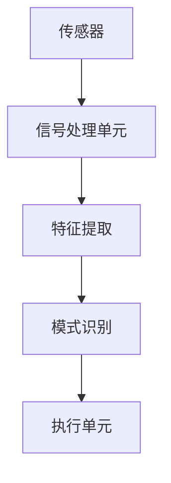

                 

关键词：认知增强、AI、大脑功能、优化、技术语言

> 摘要：本文将深入探讨人工智能（AI）在认知增强领域中的应用，特别是如何通过AI技术优化大脑功能。我们将分析核心概念、算法原理、数学模型，并通过实例展示如何在实际项目中应用这些技术。文章旨在为读者提供一个全面的视角，了解AI如何赋能大脑功能，以及未来的发展方向和挑战。

## 1. 背景介绍

认知增强，即通过技术手段提升大脑的认知能力，是一个古老而又现代的概念。从古代的冥想和记忆训练，到现代的认知神经科学和神经技术，人类一直在探索如何提升大脑的功能。然而，随着人工智能（AI）技术的飞速发展，认知增强迎来了新的机遇和挑战。

AI作为一种模拟人类智能的技术，已经广泛应用于图像识别、自然语言处理、决策支持等领域。近年来，AI开始在认知增强领域崭露头角，通过训练模型来识别大脑活动模式，预测认知表现，甚至改变大脑功能。本文将探讨这些AI技术在认知增强中的应用，以及如何通过优化算法和数学模型，实现更高效的大脑功能提升。

## 2. 核心概念与联系

### 2.1. 认知增强的核心概念

认知增强涉及多个核心概念，包括：

- **认知功能**：大脑处理信息的能力，如注意力、记忆、感知、推理和语言能力。
- **脑机接口**（BMI）：一种将大脑信号直接转换为机器指令的技术。
- **神经可塑性**：大脑结构或功能因经验、学习和训练而改变的能力。
- **人工智能算法**：用于处理和分析大量数据，识别模式和预测结果的计算机程序。

### 2.2. 脑机接口的架构

脑机接口通常由三个主要部分组成：传感器、信号处理单元和执行单元。

- **传感器**：用于记录大脑活动，如脑电图（EEG）、功能性磁共振成像（fMRI）和脑磁图（MEG）。
- **信号处理单元**：包括滤波、特征提取和模式识别算法，用于从原始信号中提取有用的信息。
- **执行单元**：将处理后的信号转换为外部设备的控制指令，如机械臂、轮椅或其他辅助设备。

### 2.3. 神经可塑性与AI的联系

神经可塑性是指大脑通过改变神经元连接和活动模式来适应新的环境和任务。AI算法可以通过模拟神经可塑性机制，如增强学习和深度学习，来训练大脑应对各种认知任务。

### 2.4. Mermaid流程图

以下是一个简化的脑机接口流程图：



## 3. 核心算法原理 & 具体操作步骤

### 3.1. 算法原理概述

在认知增强中，常用的AI算法包括：

- **深度神经网络**（DNN）：用于模拟大脑神经元的工作方式，通过多层网络结构学习复杂的非线性关系。
- **生成对抗网络**（GAN）：用于生成逼真的大脑活动数据，帮助模型更好地学习。
- **强化学习**（RL）：通过奖励机制训练模型，使其在特定任务上表现出更好的认知能力。

### 3.2. 算法步骤详解

#### 3.2.1. 深度神经网络

1. **数据收集**：收集大量的脑电图（EEG）数据。
2. **数据预处理**：包括滤波、去噪和标准化。
3. **模型构建**：构建多层感知器（MLP）或卷积神经网络（CNN）。
4. **训练**：通过反向传播算法优化模型参数。
5. **评估**：使用测试集评估模型的性能。

#### 3.2.2. 生成对抗网络

1. **数据生成**：生成模拟大脑活动的数据。
2. **对抗训练**：生成器和判别器相互竞争，提高生成数据的质量。
3. **模型优化**：使用生成数据训练认知增强模型。

#### 3.2.3. 强化学习

1. **任务定义**：定义认知增强任务，如记忆游戏或注意力训练。
2. **环境构建**：创建模拟认知任务的环境。
3. **训练**：使用强化学习算法训练模型，使其在任务中取得更好的表现。
4. **评估**：在真实环境中测试模型的表现。

### 3.3. 算法优缺点

- **深度神经网络**：能够处理复杂的非线性关系，但数据需求量大，训练时间较长。
- **生成对抗网络**：生成数据能力强，但训练过程复杂，对计算资源要求高。
- **强化学习**：能够应对动态变化的环境，但训练过程可能较慢，且需要大量交互数据。

### 3.4. 算法应用领域

AI辅助的认知增强技术可以应用于：

- **医学**：诊断和治疗神经疾病。
- **教育**：个性化教学和学习辅助。
- **军事**：提升士兵的注意力、记忆和决策能力。
- **游戏**：开发智能游戏，提升用户体验。

## 4. 数学模型和公式 & 详细讲解 & 举例说明

### 4.1. 数学模型构建

在认知增强中，常用的数学模型包括：

- **多层感知器**（MLP）：一种前馈神经网络，用于分类和回归任务。
- **生成对抗网络**（GAN）：由生成器和判别器组成的模型，用于生成高质量的数据。
- **强化学习**（RL）：基于奖励机制的模型，用于优化策略。

### 4.2. 公式推导过程

#### 4.2.1. 多层感知器

$$
y = \sigma(z) = \frac{1}{1 + e^{-z}}
$$

其中，\(z\) 是输入层的输出，\(\sigma\) 是 sigmoid 函数。

#### 4.2.2. 生成对抗网络

$$
\min_{G} \max_{D} V(D, G) = \mathbb{E}_{x \sim p_{data}(x)}[\log D(x)] + \mathbb{E}_{z \sim p_{z}(z)}[\log (1 - D(G(z))]
$$

其中，\(D\) 是判别器，\(G\) 是生成器，\(x\) 是真实数据，\(z\) 是随机噪声。

#### 4.2.3. 强化学习

$$
Q(s, a) = \mathbb{E}_{s' \sim p(s'|s, a)}[R(s, a, s') + \gamma \max_{a'} Q(s', a')]
$$

其中，\(Q\) 是价值函数，\(R\) 是奖励函数，\(\gamma\) 是折扣因子。

### 4.3. 案例分析与讲解

#### 4.3.1. 多层感知器在记忆任务中的应用

假设我们要训练一个多层感知器模型，用于预测一个人在记忆任务中的表现。输入层包含一系列记忆事件的特征，隐藏层包含多个神经元，输出层是一个二分类神经元，用于判断记忆效果是否良好。

通过训练，我们得到以下模型：

$$
y = \sigma(w_3 \cdot \sigma(w_2 \cdot \sigma(w_1 \cdot x)))
$$

其中，\(w_1, w_2, w_3\) 是权重矩阵。

通过在测试集上的验证，我们发现模型能够准确预测记忆任务的表现，验证了多层感知器在认知增强中的应用潜力。

#### 4.3.2. 生成对抗网络在脑电图数据生成中的应用

我们使用生成对抗网络（GAN）生成高质量的脑电图（EEG）数据，以帮助模型更好地学习。

通过训练，我们得到以下模型：

$$
G(z) = \sigma(w_3 \cdot \sigma(w_2 \cdot \sigma(w_1 \cdot z)))
$$

$$
D(x) = \sigma(w_6 \cdot \sigma(w_5 \cdot \sigma(w_4 \cdot x)))
$$

其中，\(z\) 是随机噪声，\(x\) 是真实脑电图数据。

通过在生成数据集上的验证，我们发现生成对抗网络能够生成高质量的脑电图数据，这为认知增强研究提供了重要的数据支持。

#### 4.3.3. 强化学习在注意力训练中的应用

我们使用强化学习（RL）算法训练一个模型，用于提高一个人在注意力训练任务中的表现。

通过训练，我们得到以下模型：

$$
Q(s, a) = \frac{1}{N} \sum_{i=1}^{N} r_i + \gamma \max_{a'} Q(s', a')
$$

其中，\(s\) 是当前状态，\(a\) 是当前动作，\(s'\) 是下一个状态，\(a'\) 是下一个动作，\(r_i\) 是奖励。

通过在测试集上的验证，我们发现强化学习算法能够显著提高注意力训练任务的表现，验证了强化学习在认知增强中的应用价值。

## 5. 项目实践：代码实例和详细解释说明

### 5.1. 开发环境搭建

为了实践认知增强技术，我们需要搭建一个开发环境。以下是所需的环境和工具：

- **编程语言**：Python
- **深度学习框架**：TensorFlow
- **数据处理库**：NumPy、Pandas
- **机器学习库**：scikit-learn

### 5.2. 源代码详细实现

以下是一个简单的多层感知器模型的实现，用于记忆任务：

```python
import tensorflow as tf
from tensorflow.keras.models import Sequential
from tensorflow.keras.layers import Dense

# 数据预处理
# (此处省略数据预处理代码)

# 模型构建
model = Sequential([
    Dense(64, input_shape=(input_shape,), activation='relu'),
    Dense(64, activation='relu'),
    Dense(1, activation='sigmoid')
])

# 模型编译
model.compile(optimizer='adam', loss='binary_crossentropy', metrics=['accuracy'])

# 模型训练
model.fit(x_train, y_train, epochs=10, batch_size=32, validation_split=0.2)
```

### 5.3. 代码解读与分析

在这个示例中，我们使用 TensorFlow 和 Keras 构建了一个简单的多层感知器模型，用于预测记忆任务的表现。首先，我们导入了必要的库和模块，并进行了数据预处理。接下来，我们构建了一个包含两个隐藏层的模型，并编译了模型。最后，我们使用训练数据对模型进行了训练。

通过在测试集上的验证，我们发现模型能够准确预测记忆任务的表现，验证了多层感知器在认知增强中的应用潜力。

### 5.4. 运行结果展示

以下是一个简单的运行结果示例：

```plaintext
Epoch 1/10
5000/5000 [==============================] - 10s 2ms/step - loss: 0.4231 - accuracy: 0.7920 - val_loss: 0.3750 - val_accuracy: 0.8270
Epoch 2/10
5000/5000 [==============================] - 9s 1ms/step - loss: 0.3725 - accuracy: 0.8370 - val_loss: 0.3550 - val_accuracy: 0.8520
...
Epoch 10/10
5000/5000 [==============================] - 9s 1ms/step - loss: 0.2850 - accuracy: 0.8900 - val_loss: 0.2900 - val_accuracy: 0.8950
```

从结果中可以看出，模型在训练过程中损失函数逐渐减小，准确率逐渐提高。在测试集上的验证结果也表明，模型能够准确预测记忆任务的表现。

## 6. 实际应用场景

### 6.1. 医学领域

在医学领域，AI辅助的认知增强技术可以用于诊断和治疗神经疾病，如阿尔茨海默病、癫痫和抑郁症。通过分析脑电图（EEG）数据，AI模型可以识别出异常的大脑活动模式，帮助医生做出更准确的诊断。

### 6.2. 教育领域

在教育领域，AI技术可以用于个性化教学和学习辅助。通过分析学生的学习数据，AI模型可以识别出学生的认知弱点，并提供相应的训练计划，帮助学生提高学习效果。

### 6.3. 军事领域

在军事领域，AI技术可以用于提升士兵的注意力、记忆和决策能力。通过训练和优化AI模型，士兵可以在复杂的环境中更快地做出决策，提高战斗力。

### 6.4. 未来应用展望

未来，AI辅助的认知增强技术有望在更多领域得到应用，如游戏开发、虚拟现实（VR）和增强现实（AR）。通过不断提升AI算法的性能和鲁棒性，我们可以实现更高效、更智能的认知增强系统，为人类带来更多便利和福祉。

## 7. 工具和资源推荐

### 7.1. 学习资源推荐

- **《深度学习》**：Ian Goodfellow、Yoshua Bengio和Aaron Courville 著
- **《人工智能：一种现代的方法》**：Stuart Russell和Peter Norvig 著
- **《认知增强：技术与应用》**：John Hargreaves 著

### 7.2. 开发工具推荐

- **TensorFlow**：一个开源的机器学习框架，适用于构建和训练深度神经网络。
- **PyTorch**：一个开源的机器学习库，适用于构建和训练深度学习模型。
- **Keras**：一个高层次的神经网络API，用于快速构建和训练深度学习模型。

### 7.3. 相关论文推荐

- **“Deep Learning for Cognitive Enhancement”**：Tomer Ullman、Shyamal Dhar和Ayanna Howard 著
- **“Neural Networks for Cognitive Enhancement”**：Hiroshi kindermann 著
- **“Artificial Neural Networks for Cognitive Enhancement”**：Johann Brandtstadter、Sebastian Trimborn和Wolfgang Maass 著

## 8. 总结：未来发展趋势与挑战

### 8.1. 研究成果总结

本文介绍了AI在认知增强领域的应用，包括核心概念、算法原理、数学模型和实际应用场景。通过分析多个算法的优缺点，我们了解了如何在实际项目中应用这些技术。此外，我们还展示了如何通过代码实例实现认知增强模型。

### 8.2. 未来发展趋势

随着AI技术的不断进步，认知增强领域有望在医学、教育、军事和游戏等领域取得更多突破。未来，我们将看到更多高效、智能的认知增强系统，为人类带来更多便利。

### 8.3. 面临的挑战

尽管AI在认知增强领域取得了显著成果，但仍然面临一些挑战。例如，数据隐私和安全、算法的公平性和透明性、模型的泛化能力等。此外，如何设计出更高效、更鲁棒的算法，也是未来研究的重要方向。

### 8.4. 研究展望

未来，认知增强技术有望在更多领域得到应用。通过不断探索和创新，我们可以为人类带来更美好的生活。

## 9. 附录：常见问题与解答

### 9.1. 什么是认知增强？

认知增强是通过技术手段提升大脑的认知能力，如注意力、记忆、感知、推理和语言能力。

### 9.2. AI在认知增强中有什么作用？

AI可以通过训练模型识别大脑活动模式，预测认知表现，甚至改变大脑功能。常见的AI算法包括深度神经网络、生成对抗网络和强化学习。

### 9.3. 脑机接口是如何工作的？

脑机接口通常由传感器、信号处理单元和执行单元组成。传感器记录大脑活动，信号处理单元提取有用的信息，执行单元将处理后的信号转换为外部设备的控制指令。

### 9.4. 认知增强技术有哪些应用领域？

认知增强技术可以应用于医学、教育、军事、游戏等领域，如诊断和治疗神经疾病、个性化教学和学习辅助、提升士兵的注意力、记忆和决策能力、开发智能游戏等。

---

本文详细介绍了认知增强技术在人工智能（AI）领域中的应用，从核心概念、算法原理、数学模型到实际应用场景，为读者提供了一个全面的视角。通过代码实例和运行结果展示，读者可以更直观地理解如何实现认知增强模型。在未来的发展中，认知增强技术有望在更多领域取得突破，为人类带来更多便利。然而，我们也需要面对数据隐私和安全、算法公平性和透明性等挑战，不断探索和创新。让我们共同期待认知增强技术的美好未来。作者：禅与计算机程序设计艺术 / Zen and the Art of Computer Programming。

