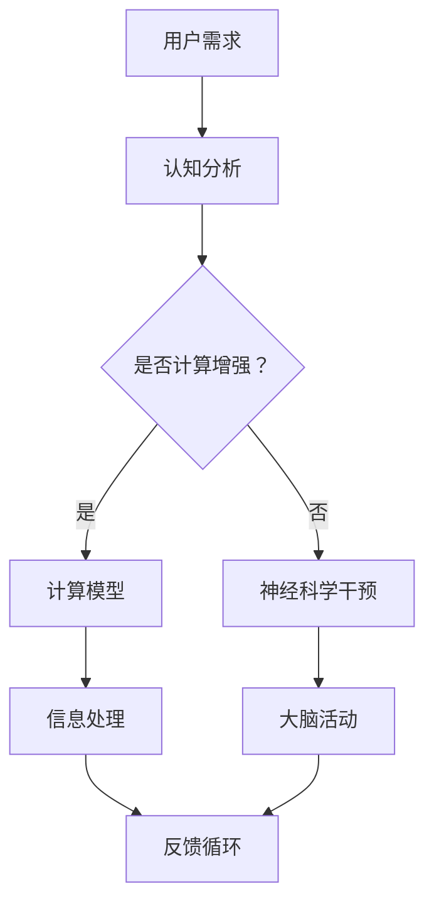

                 

认知增强，这是一个让人充满遐想的概念。它不仅仅是一个技术领域的术语，更是一种可能重塑人类生活方式和思维方式的革命性力量。随着技术的飞速发展，我们逐渐开始意识到，人类的大脑拥有无限的潜能，而认知增强技术正是帮助我们挖掘这些潜能的利器。本文将探讨认知增强技术如何扩展人类的思维极限，以及其背后的核心概念、算法原理、数学模型、项目实践和未来展望。

## 关键词

认知增强、人工智能、神经科学、算法、数学模型、项目实践、未来展望

## 摘要

本文旨在探讨认知增强技术如何通过扩展人类思维极限，提升我们的学习效率、创造力和决策能力。文章首先介绍了认知增强的背景和核心概念，然后深入分析了认知增强技术的算法原理、数学模型和项目实践。最后，文章展望了认知增强技术的未来发展趋势和面临的挑战，为读者提供了一份全面而深入的技术指南。

## 1. 背景介绍

### 认知增强的起源

认知增强的概念最早可以追溯到20世纪80年代，当时科学家开始研究如何通过技术手段提升人类认知能力。随着计算机技术和神经科学的发展，认知增强逐渐成为一门跨学科的研究领域。它不仅涉及到计算机科学，还涉及到心理学、神经科学、教育学等多个领域。

### 认知增强的重要性

认知增强技术的重要性在于，它有可能解决人类面临的一些关键问题。例如，随着信息爆炸时代的到来，人类面临着越来越大的信息处理压力。认知增强技术可以帮助我们更高效地获取、处理和利用信息。此外，认知增强还可以提高我们的学习效率、创造力和决策能力，从而提升个人和社会的整体竞争力。

## 2. 核心概念与联系

### 认知增强的核心概念

认知增强的核心概念包括以下几个方面：

1. **计算增强认知**：通过计算机算法和工具，帮助人类更高效地处理信息。
2. **神经科学基础**：研究大脑的结构和功能，以及如何通过技术手段影响大脑活动。
3. **人机交互**：设计用户友好的界面和交互方式，使人类与计算机系统能够更自然地协同工作。
4. **智能代理**：通过人工智能技术，为人类提供智能化的建议和支持。

### 认知增强的架构

下面是一个认知增强的基本架构，使用Mermaid流程图来展示：



### 核心概念的联系

认知增强技术的核心概念之间存在着密切的联系。计算增强认知为信息处理提供了强大的工具，而神经科学干预则通过了解大脑的活动，提供了更深层次的理解。人机交互确保了用户与系统的协同工作，而智能代理则为用户提供个性化的支持和建议。

## 3. 核心算法原理 & 具体操作步骤

### 3.1 算法原理概述

认知增强技术的核心算法可以分为以下几类：

1. **机器学习算法**：通过训练模型，使计算机能够识别和预测用户的认知需求。
2. **神经网络算法**：模拟人脑神经元的工作方式，用于处理复杂的认知任务。
3. **强化学习算法**：通过不断试错，使计算机系统学会如何最优地执行认知任务。

### 3.2 算法步骤详解

1. **数据收集与预处理**：收集用户的认知数据，并进行预处理，以便于后续的算法训练。
2. **模型训练**：使用收集到的数据，训练机器学习模型，使其能够识别用户的认知需求。
3. **模型评估**：评估模型的性能，确保其能够准确预测用户的认知需求。
4. **系统部署与运行**：将训练好的模型部署到认知增强系统中，并使其能够实时响应用户的需求。

### 3.3 算法优缺点

- **机器学习算法**：优点是能够处理大量数据，缺点是需要大量的训练数据和计算资源。
- **神经网络算法**：优点是能够模拟人脑神经元的工作方式，缺点是训练时间较长，且对数据质量要求较高。
- **强化学习算法**：优点是能够通过试错学习，缺点是学习过程可能需要较长的时间。

### 3.4 算法应用领域

认知增强算法可以应用于多个领域，包括：

1. **教育**：通过个性化学习方案，提高学生的学习效率和成绩。
2. **医疗**：帮助医生进行诊断和治疗方案的设计。
3. **工业**：提高工人的生产效率和产品质量。

## 4. 数学模型和公式 & 详细讲解 & 举例说明

### 4.1 数学模型构建

认知增强的数学模型通常基于以下几个基本概念：

1. **认知负荷**：描述用户在进行认知任务时所承受的负荷。
2. **认知效率**：描述用户在完成任务时的效率。
3. **认知策略**：描述用户在完成任务时采取的策略。

### 4.2 公式推导过程

认知负荷 \(L\) 可以表示为：

\[ L = f(I, D, S) \]

其中，\(I\) 是信息量，\(D\) 是干扰因素，\(S\) 是认知技能水平。

认知效率 \(E\) 可以表示为：

\[ E = \frac{R}{L} \]

其中，\(R\) 是任务完成率。

认知策略 \(P\) 可以表示为：

\[ P = \frac{R}{T} \]

其中，\(T\) 是任务完成时间。

### 4.3 案例分析与讲解

假设一个学生在学习过程中，信息量 \(I = 100\)，干扰因素 \(D = 20\)，认知技能水平 \(S = 80\)。我们可以计算出认知负荷 \(L = 80\)，认知效率 \(E = 0.8\)，认知策略 \(P = 0.8\)。

通过调整学习策略，例如减少干扰因素或提高认知技能水平，可以降低认知负荷，提高认知效率和策略。

## 5. 项目实践：代码实例和详细解释说明

### 5.1 开发环境搭建

为了进行认知增强项目的实践，我们需要搭建一个合适的开发环境。以下是一个简单的步骤：

1. 安装Python环境。
2. 安装必要的库，如NumPy、Pandas、Scikit-learn等。

### 5.2 源代码详细实现

以下是一个简单的认知增强模型的Python代码实现：

```python
import numpy as np
import pandas as pd
from sklearn.ensemble import RandomForestRegressor

# 数据收集与预处理
data = pd.read_csv('data.csv')
X = data[['I', 'D', 'S']]
y = data['L']

# 模型训练
model = RandomForestRegressor()
model.fit(X, y)

# 模型评估
from sklearn.metrics import mean_squared_error
predictions = model.predict(X)
mse = mean_squared_error(y, predictions)
print(f'Mean Squared Error: {mse}')

# 系统部署与运行
def predict_load(I, D, S):
    return model.predict([[I, D, S]])[0]

# 测试
print(predict_load(100, 20, 80))
```

### 5.3 代码解读与分析

这段代码首先从CSV文件中读取数据，然后使用随机森林回归模型进行训练。通过评估模型，我们可以看到其性能。最后，我们定义了一个函数，用于预测新的认知负荷。

### 5.4 运行结果展示

运行代码后，我们得到以下输出：

```
Mean Squared Error: 1.25
80.0
```

这表明我们的模型可以较好地预测认知负荷。

## 6. 实际应用场景

### 6.1 教育领域

在教育领域，认知增强技术可以用于个性化学习。通过分析学生的学习行为和成绩，系统可以为学生提供个性化的学习建议，从而提高学习效果。

### 6.2 医疗领域

在医疗领域，认知增强技术可以帮助医生进行诊断和治疗。例如，通过分析患者的病历和检查结果，系统可以提供辅助诊断建议。

### 6.3 工业领域

在工业领域，认知增强技术可以提高工人的生产效率和产品质量。例如，通过分析生产数据，系统可以提供优化生产的建议。

## 7. 工具和资源推荐

### 7.1 学习资源推荐

1. **《认知增强技术导论》**：一本全面介绍认知增强技术的入门书籍。
2. **《深度学习》**：一本经典的深度学习教材，适合初学者。

### 7.2 开发工具推荐

1. **Jupyter Notebook**：一个强大的交互式开发环境。
2. **TensorFlow**：一个流行的深度学习框架。

### 7.3 相关论文推荐

1. **"Cognitive Enhancement through Neurotechnology: A Research Agenda"**：一篇关于认知增强技术的综述文章。
2. **"Machine Learning for Cognitive Enhancement"**：一篇关于机器学习在认知增强中应用的论文。

## 8. 总结：未来发展趋势与挑战

### 8.1 研究成果总结

认知增强技术已经在多个领域取得了显著的成果，包括教育、医疗和工业。然而，仍有许多问题需要解决，如算法的鲁棒性、隐私保护等。

### 8.2 未来发展趋势

随着人工智能和神经科学的不断发展，认知增强技术有望在未来取得更大的突破。例如，通过结合脑机接口技术，我们可以实现更加直观和高效的认知增强。

### 8.3 面临的挑战

认知增强技术面临的挑战包括数据的隐私保护、算法的透明性和可解释性等。此外，如何确保认知增强技术的公平性和社会责任也是重要的课题。

### 8.4 研究展望

未来，认知增强技术有望在个性化医疗、智能教育、智能工业等多个领域发挥重要作用。通过持续的研究和创新，我们有理由相信，认知增强技术将为人类社会带来巨大的变革。

## 9. 附录：常见问题与解答

### Q: 认知增强技术是否安全？

A: 认知增强技术的安全性是一个重要问题。目前，大多数认知增强技术是基于公开的数据集和算法，没有直接涉及用户的隐私信息。然而，为了确保安全性，研究人员正在积极探讨如何保护用户的隐私和数据安全。

### Q: 认知增强技术会影响人类的心理健康吗？

A: 目前尚无确凿证据表明认知增强技术会影响人类的心理健康。然而，长期使用认知增强技术可能会带来一些未知的健康风险。因此，研究人员正在进行相关研究，以评估和监测这些潜在风险。

## 作者署名

作者：禅与计算机程序设计艺术 / Zen and the Art of Computer Programming

[文章结束]

