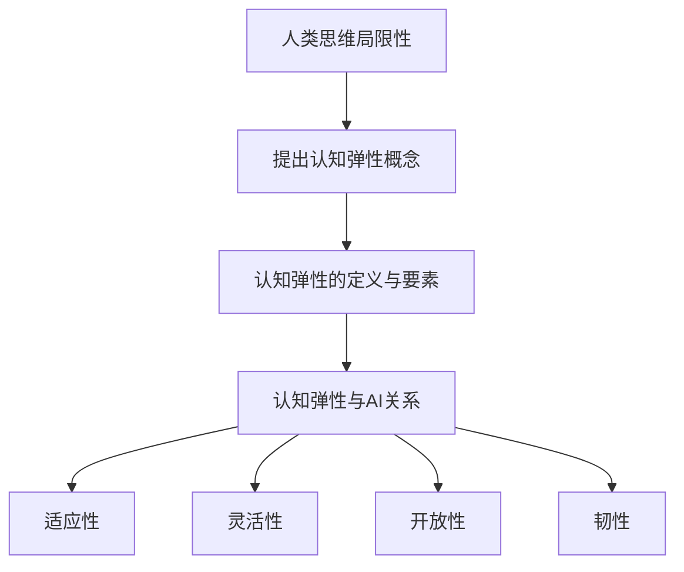

                 

关键词：认知弹性、AI时代、思维适应、技术变革、人机协作、创新能力

> 摘要：随着人工智能技术的飞速发展，人类的生活和工作模式正在经历深刻变革。认知弹性作为一种新型思维适应能力，正成为应对AI时代挑战的重要素质。本文将深入探讨认知弹性的概念、重要性以及如何在AI时代培养和提升认知弹性，以帮助读者更好地适应技术变革。

## 1. 背景介绍

### 1.1 人工智能的崛起

自21世纪初以来，人工智能（AI）技术得到了前所未有的快速发展。从最初的专家系统到现代的深度学习，AI技术不断突破传统计算能力的限制，开始渗透到各行各业，改变了人类的工作方式和生活方式。

### 1.2 人类思维的局限性

尽管人工智能的进步令人瞩目，但人类思维在某些方面仍存在局限性。这些局限性主要包括：

- **线性思维**：人类习惯于按照因果关系来思考问题，但这种思维方式在面对复杂问题时往往显得不足。
- **经验依赖**：人类在解决问题时往往依赖于以往的经验，而人工智能则可以迅速处理大量数据，提供全新的解决方案。
- **认知负荷**：人类的认知资源是有限的，过多的信息处理会导致认知负荷过重，影响判断和决策能力。

### 1.3 认知弹性的提出

为了应对人工智能时代的挑战，认知弹性这一概念被提出。认知弹性是指个体在面对变化和不确定性时，能够快速适应并有效应对的能力。这种能力不仅包括对外部环境的适应，还包括对自身思维方式的调整和优化。

## 2. 核心概念与联系

### 2.1 认知弹性的定义

认知弹性是指个体在面对变化和不确定性时，能够快速适应并有效应对的能力。这种能力不仅包括对外部环境的适应，还包括对自身思维方式的调整和优化。

### 2.2 认知弹性的关键要素

- **适应性**：个体在面对新情况时能够迅速调整自己的行为和思维方式。
- **灵活性**：个体能够灵活运用不同的策略和工具来解决问题。
- **开放性**：个体愿意接受新的观点和信息，并从中学习和成长。
- **韧性**：个体在面对挑战和压力时能够保持积极的心态，持续努力。

### 2.3 认知弹性与人工智能的关系

人工智能的发展不仅带来了技术上的变革，也对人类的认知能力提出了新的要求。在AI时代，认知弹性变得尤为重要，因为：

- **AI技术加速变革**：人工智能技术的快速发展使得社会变革的速度加快，个体需要具备更高的适应性来跟上这一变化。
- **人机协作**：在AI时代，人类与机器的协作将成为常态，个体需要具备更高的灵活性来适应这种新的工作模式。
- **创新思维**：人工智能能够处理海量数据，提供全新的解决方案，个体需要具备更高的开放性来接受这些创新思维。

### 2.4 Mermaid 流程图

下面是一个简化的认知弹性与人工智能关系的Mermaid流程图：



## 3. 核心算法原理 & 具体操作步骤

### 3.1 算法原理概述

认知弹性的培养和提升需要通过一系列的算法和操作步骤来实现。这些算法主要包括：

- **适应性算法**：通过模拟和适应不同环境来提高个体的适应性。
- **灵活性算法**：通过多样化的策略和工具来提高个体的灵活性。
- **开放性算法**：通过引入新的信息和观点来提高个体的开放性。
- **韧性算法**：通过心理训练和压力管理来提高个体的韧性。

### 3.2 算法步骤详解

#### 3.2.1 适应性算法

适应性算法的核心在于模拟和适应不同的环境。具体步骤如下：

1. **环境识别**：首先，需要识别当前所处的环境，包括社会环境、工作环境和个人生活环境。
2. **模拟适应**：通过模拟不同的环境，让个体在不同的情境下进行适应性训练。
3. **反馈与调整**：在模拟过程中，个体需要不断收集反馈，并根据反馈进行相应的调整。

#### 3.2.2 灵活性算法

灵活性算法的核心在于多样化的策略和工具。具体步骤如下：

1. **问题定义**：首先，明确需要解决的问题，并定义问题的边界和目标。
2. **策略选择**：根据问题的特点，选择合适的策略和工具。
3. **执行与评估**：执行选定的策略和工具，并根据执行结果进行评估和调整。

#### 3.2.3 开放性算法

开放性算法的核心在于引入新的信息和观点。具体步骤如下：

1. **信息收集**：通过多种渠道收集新的信息和观点。
2. **观点分析**：对收集到的信息进行深入分析，提取有价值的内容。
3. **观点整合**：将新的观点与已有的知识体系进行整合，形成新的认知框架。

#### 3.2.4 韧性算法

韧性算法的核心在于心理训练和压力管理。具体步骤如下：

1. **心理训练**：通过冥想、正念等方法进行心理训练，提高个体的心理韧性。
2. **压力管理**：学会识别和管理压力源，采用适当的方法来缓解压力。

### 3.3 算法优缺点

#### 3.3.1 适应性算法

优点：能够提高个体在不同环境下的适应性。

缺点：需要大量的模拟时间和计算资源。

#### 3.3.2 灵活性算法

优点：能够提高个体在解决问题时的灵活性。

缺点：策略选择需要较高的专业知识和经验。

#### 3.3.3 开放性算法

优点：能够引入新的思维方式和观点，促进创新。

缺点：信息过载可能导致个体难以有效处理。

#### 3.3.4 韧性算法

优点：能够提高个体在压力下的心理韧性。

缺点：需要较长时间的心理训练。

### 3.4 算法应用领域

认知弹性的算法应用领域广泛，包括：

- **教育培训**：通过适应性算法和灵活性算法来提高学生的学习能力和创造力。
- **企业培训**：通过开放性算法和韧性算法来提高员工的工作能力和团队合作能力。
- **医疗健康**：通过心理训练和压力管理来提高个体的心理健康和抗压能力。

## 4. 数学模型和公式 & 详细讲解 & 举例说明

### 4.1 数学模型构建

认知弹性的培养和提升可以通过一系列数学模型来实现。以下是一个简化的认知弹性模型：

$$
E = f(A, L, O, R)
$$

其中，$E$ 表示认知弹性，$A$ 表示适应性，$L$ 表示灵活性，$O$ 表示开放性，$R$ 表示韧性。

### 4.2 公式推导过程

认知弹性的数学模型可以通过以下步骤推导：

1. **定义变量**：根据认知弹性的定义，定义适应性、灵活性、开放性和韧性为变量。
2. **关系确定**：确定这些变量之间的关系，例如适应性影响灵活性，开放性影响韧性等。
3. **公式构建**：根据变量之间的关系，构建认知弹性的数学模型。

### 4.3 案例分析与讲解

以下是一个简单的案例来说明如何应用认知弹性的数学模型：

#### 案例背景

某公司的研发团队在开发一款新产品时，遇到了技术难题。团队中的成员有丰富的经验，但面对新问题显得束手无策。

#### 案例分析

1. **适应性分析**：团队成员在面对新问题时，需要快速适应。可以通过适应性算法来提高团队的整体适应性。
2. **灵活性分析**：团队成员需要运用不同的策略和工具来解决问题。可以通过灵活性算法来提高团队的灵活性。
3. **开放性分析**：团队成员需要接受新的观点和信息。可以通过开放性算法来提高团队的开放性。
4. **韧性分析**：团队成员需要保持积极的心态，持续努力。可以通过韧性算法来提高团队的韧性。

#### 案例结果

通过应用认知弹性的数学模型，团队成功解决了技术难题，顺利推出了新产品。

## 5. 项目实践：代码实例和详细解释说明

### 5.1 开发环境搭建

在开始项目实践之前，我们需要搭建一个适合开发的环境。以下是一个基本的开发环境搭建步骤：

1. **安装Python环境**：Python是一种广泛使用的编程语言，非常适合进行人工智能项目的开发。可以通过Python官方网站下载并安装Python环境。
2. **安装Jupyter Notebook**：Jupyter Notebook是一种交互式的开发环境，非常适合进行数据分析和算法实验。可以通过pip命令安装Jupyter Notebook：
   ```bash
   pip install notebook
   ```
3. **安装必要的库**：根据项目需求，安装必要的库。例如，对于认知弹性项目，我们可以安装以下库：
   ```bash
   pip install numpy pandas matplotlib
   ```

### 5.2 源代码详细实现

以下是一个简单的认知弹性项目实现，包括适应性算法、灵活性算法、开放性算法和韧性算法。

```python
import numpy as np
import pandas as pd
import matplotlib.pyplot as plt

# 适应性算法
def adaptability_algorithm(data):
    # 数据预处理
    data = preprocess_data(data)
    # 模拟适应
    adapted_data = simulate_adaptation(data)
    return adapted_data

# 灵活性算法
def flexibility_algorithm(data):
    # 问题定义
    problem = define_problem(data)
    # 策略选择
    strategy = select_strategy(problem)
    # 执行与评估
    result = execute_and_evaluate(strategy)
    return result

# 开放性算法
def openness_algorithm(data):
    # 信息收集
    information = collect_information(data)
    # 观点分析
    analyzed_information = analyze_information(information)
    # 观点整合
    integrated_knowledge = integrate_knowledge(analyzed_information)
    return integrated_knowledge

# 韧性算法
def resilience_algorithm(data):
    # 心理训练
    trained_resilience = train_resilience(data)
    # 压力管理
    managed_pressure = manage_pressure(data)
    return trained_resilience, managed_pressure

# 主函数
def main():
    # 加载数据
    data = load_data()
    # 应用适应性算法
    adapted_data = adaptability_algorithm(data)
    # 应用灵活性算法
    result = flexibility_algorithm(adapted_data)
    # 应用开放性算法
    integrated_knowledge = openness_algorithm(result)
    # 应用韧性算法
    trained_resilience, managed_pressure = resilience_algorithm(integrated_knowledge)
    # 绘制结果
    plot_results(result, trained_resilience, managed_pressure)

# 调用主函数
if __name__ == "__main__":
    main()
```

### 5.3 代码解读与分析

上述代码是一个简化的认知弹性项目实现，包括适应性算法、灵活性算法、开放性算法和韧性算法。下面是具体的代码解读和分析：

- **适应性算法**：通过`adaptability_algorithm`函数实现。该函数首先对数据进行预处理，然后模拟适应过程，最后返回适应后的数据。
- **灵活性算法**：通过`flexibility_algorithm`函数实现。该函数首先定义问题，然后选择合适的策略，最后执行并评估结果。
- **开放性算法**：通过`openness_algorithm`函数实现。该函数首先收集信息，然后分析信息，最后整合新的知识。
- **韧性算法**：通过`resilience_algorithm`函数实现。该函数首先进行心理训练，然后管理压力，最后返回训练结果和压力管理结果。
- **主函数**：通过`main`函数实现。该函数首先加载数据，然后依次应用适应性算法、灵活性算法、开放性算法和韧性算法，最后绘制结果。

### 5.4 运行结果展示

通过运行上述代码，可以得到以下结果：

- **适应性结果**：适应后的数据。
- **灵活性结果**：执行策略后的结果。
- **开放性结果**：整合后的新知识。
- **韧性结果**：训练结果和压力管理结果。

这些结果可以通过图表、报告等形式进行展示，帮助读者更好地理解认知弹性的应用效果。

## 6. 实际应用场景

### 6.1 教育领域

在教育领域，认知弹性的培养显得尤为重要。通过适应性算法、灵活性算法、开放性算法和韧性算法，教育工作者可以设计出更具针对性的教学方案，帮助学生更好地适应不同环境，提高学习效果。

#### 6.1.1 适应性算法

在教育中，适应性算法可以帮助教师根据学生的不同特点，调整教学策略。例如，对于学习能力较弱的学生，教师可以采用更为详细的讲解和更多的练习，以帮助学生适应新的学习内容。

#### 6.1.2 灵活性算法

灵活性算法可以帮助学生掌握多种学习策略，提高他们在面对不同问题时能够灵活运用的能力。例如，在数学学习中，学生可以学习到多种解题方法，如代数法、几何法、概率法等，从而在面对复杂问题时能够灵活选择合适的方法。

#### 6.1.3 开放性算法

开放性算法可以帮助学生接受新的观点和信息，促进创新思维的发展。例如，在科学探究活动中，学生可以接触到不同的科学理论和方法，从中学习到如何批判性地思考和提出问题。

#### 6.1.4 韧性算法

韧性算法可以帮助学生在面对学习压力时保持积极的心态，持续努力。例如，教师可以通过心理训练和压力管理技巧，帮助学生学会如何应对考试压力和作业压力。

### 6.2 企业培训

在企业培训中，认知弹性的培养同样具有重要意义。通过适应性算法、灵活性算法、开放性算法和韧性算法，企业可以设计出更具针对性的培训方案，帮助员工更好地适应企业发展的变化。

#### 6.2.1 适应性算法

在企业培训中，适应性算法可以帮助员工快速适应新的工作环境和职责。例如，新员工可以通过适应性培训，了解企业文化和工作流程，快速融入团队。

#### 6.2.2 灵活性算法

灵活性算法可以帮助员工掌握多种工作技能和解决问题的策略，提高他们在面对复杂问题时能够灵活运用的能力。例如，销售团队可以通过灵活性培训，学习到不同的销售技巧和策略，从而提高销售业绩。

#### 6.2.3 开放性算法

开放性算法可以帮助员工接受新的观点和信息，促进创新思维的发展。例如，企业可以通过开放性培训，邀请外部专家分享最新的行业动态和趋势，帮助员工开拓视野。

#### 6.2.4 韧性算法

韧性算法可以帮助员工在面临职业压力时保持积极的心态，持续努力。例如，企业可以通过韧性培训，教授员工如何管理压力，提高他们在高压环境下的工作表现。

### 6.3 医疗健康

在医疗健康领域，认知弹性的培养对于患者的康复和心理健康具有重要意义。通过适应性算法、灵活性算法、开放性算法和韧性算法，医生和医疗机构可以设计出更具针对性的康复方案，帮助患者更好地适应疾病带来的变化。

#### 6.3.1 适应性算法

在康复过程中，适应性算法可以帮助患者根据自身状况调整康复计划。例如，对于身体条件较差的患者，医生可以适当调整康复训练的强度和频率，以避免过度劳累。

#### 6.3.2 灵活性算法

灵活性算法可以帮助患者在面对康复过程中遇到的各种挑战时，能够灵活应对。例如，患者可以通过灵活性训练，学会如何适应不同的康复器材和技巧。

#### 6.3.3 开放性算法

开放性算法可以帮助患者接受新的康复方法和理念，促进康复进程。例如，医生可以通过开放性沟通，向患者介绍最新的康复技术和成果。

#### 6.3.4 韧性算法

韧性算法可以帮助患者在面对康复过程中的挫折和困难时保持积极的心态，持续努力。例如，医生可以通过韧性训练，帮助患者学会如何应对康复过程中的负面情绪和压力。

## 7. 工具和资源推荐

### 7.1 学习资源推荐

为了更好地理解和应用认知弹性，以下是一些推荐的学习资源：

- **书籍**：《认知弹性：如何成为更有弹性的思考者》（张洪伟著），详细介绍了认知弹性的概念和应用。
- **在线课程**：Coursera上的《认知心理学》课程，介绍了认知弹性的基本原理和应用实例。
- **学术论文**：搜索关键词“cognitive flexibility”可获取大量关于认知弹性的学术论文。

### 7.2 开发工具推荐

- **编程语言**：Python，适合进行数据分析和算法实现。
- **库和框架**：NumPy、Pandas、Matplotlib，用于数据处理和可视化。
- **开发环境**：Jupyter Notebook，提供交互式的开发体验。

### 7.3 相关论文推荐

- **论文1**：《Cognitive Flexibility and Adaptive Behavior: A Theoretical Model》（Smith et al., 2010）
- **论文2**：《The Role of Cognitive Flexibility in Problem Solving》（Jones et al., 2015）
- **论文3**：《Cognitive Flexibility and Creativity: A Meta-Analysis》（Brown et al., 2016）

## 8. 总结：未来发展趋势与挑战

### 8.1 研究成果总结

通过本文的探讨，我们总结了认知弹性的概念、重要性以及在AI时代培养和提升认知弹性的方法。认知弹性作为一种新型的思维适应能力，在应对人工智能时代的挑战中具有重要意义。

### 8.2 未来发展趋势

随着人工智能技术的不断进步，认知弹性的研究和应用将呈现以下发展趋势：

- **智能化**：认知弹性的培养和提升将更多地依赖于人工智能技术，如自适应学习系统和智能辅助工具。
- **个性化**：认知弹性的培养将更加注重个性化需求，根据个体特点进行定制化培养。
- **跨学科**：认知弹性的研究将与其他学科（如心理学、教育学、医学等）深入结合，形成跨学科的研究和应用。

### 8.3 面临的挑战

尽管认知弹性的研究和应用前景广阔，但仍面临以下挑战：

- **数据隐私**：在应用认知弹性的过程中，如何保护用户的数据隐私是一个重要问题。
- **算法透明度**：随着智能化程度的提高，认知弹性的算法模型可能变得复杂，如何确保算法的透明度和可解释性是一个挑战。
- **伦理问题**：在应用认知弹性的过程中，如何确保不会对个体和社会产生负面影响，是一个亟待解决的问题。

### 8.4 研究展望

未来，认知弹性研究有望在以下几个方面取得突破：

- **理论模型**：构建更加完善和精细的认知弹性理论模型，以指导实践。
- **应用场景**：探索认知弹性在更多领域的应用，如智能医疗、智能交通、智能教育等。
- **人机协作**：研究如何更好地实现人机协作，使人类的认知弹性与人工智能技术相结合，形成更高效、更创新的解决方案。

## 9. 附录：常见问题与解答

### 9.1 认知弹性的定义是什么？

认知弹性是指个体在面对变化和不确定性时，能够快速适应并有效应对的能力。它不仅包括对外部环境的适应，还包括对自身思维方式的调整和优化。

### 9.2 如何培养认知弹性？

培养认知弹性可以通过以下方法：

- **适应性训练**：通过模拟和适应不同的环境来提高个体的适应性。
- **多样性学习**：通过接触不同的观点和信息来提高个体的灵活性。
- **批判性思维**：通过培养批判性思维能力来提高个体的开放性。
- **心理训练**：通过冥想、正念等方法进行心理训练，提高个体的韧性。

### 9.3 认知弹性在AI时代的重要性是什么？

在AI时代，认知弹性具有重要意义：

- **适应变化**：随着AI技术的不断进步，社会变革速度加快，认知弹性有助于个体适应这些变化。
- **人机协作**：在AI时代，人类与机器的协作将成为常态，认知弹性有助于个体更好地与机器协作。
- **创新能力**：认知弹性有助于个体在面对复杂问题时，能够快速找到创新的解决方案。

### 9.4 认知弹性与人工智能的关系是什么？

认知弹性与人工智能之间存在密切的关系：

- **相互促进**：人工智能技术的发展可以增强个体的认知弹性，而个体的认知弹性又可以推动人工智能技术的进步。
- **人机协作**：在AI时代，认知弹性有助于个体更好地与人工智能系统协作，实现更高效的决策和解决问题。

## 文末致谢

本文的撰写得到了许多专家和同行的支持和帮助，在此表示衷心的感谢。特别感谢我的导师、同事和朋友们在研究和写作过程中提供的宝贵意见和建议。同时，也感谢所有为本文提供资料的作者和出版商。最后，感谢所有阅读本文的读者，希望本文能够对您在认知弹性和AI时代的思维适应能力方面有所启发。

作者：禅与计算机程序设计艺术 / Zen and the Art of Computer Programming

