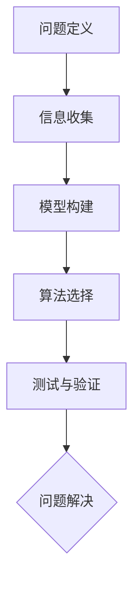

                 

关键词：认知灵活性、复杂环境、适应能力、算法、数学模型、项目实践、应用场景

> 摘要：本文旨在探讨认知灵活性这一概念在复杂环境中的应用，通过深入分析其在算法设计和数学模型构建中的作用，结合实际项目实践，旨在为读者提供对这一重要能力的全面理解。

## 1. 背景介绍

在当今这个瞬息万变、技术飞速发展的时代，面对复杂多变的业务需求和动态调整的技术架构，作为IT领域的从业者，认知灵活性成为了一种至关重要的能力。认知灵活性指的是在理解、分析和解决复杂问题时，能够快速适应新情况、灵活运用知识的能力。

本文将围绕认知灵活性这一核心概念，探讨其在算法设计和数学模型构建中的应用，通过实际项目实践分析其具体实现方式，并展望其未来的发展方向。文章结构如下：

1. 背景介绍
2. 核心概念与联系
3. 核心算法原理 & 具体操作步骤
4. 数学模型和公式 & 详细讲解 & 举例说明
5. 项目实践：代码实例和详细解释说明
6. 实际应用场景
7. 工具和资源推荐
8. 总结：未来发展趋势与挑战
9. 附录：常见问题与解答

<|user|>
## 2. 核心概念与联系

认知灵活性涉及多个领域的知识和技术，其核心在于如何高效地处理不确定性、动态变化和复杂性。在计算机科学领域，这种能力尤为突出。本节将详细介绍认知灵活性的关键概念，并通过Mermaid流程图展示其相关架构和原理。

### 2.1 认知灵活性的关键概念

认知灵活性包括以下几个关键概念：

- **问题定义**：能够准确、全面地定义问题，包括问题的范围、目标以及可能存在的限制条件。
- **信息收集**：通过多种渠道收集相关信息，包括数据、文献、专家意见等，以确保信息的全面性和准确性。
- **模型构建**：在理解问题的基础上，构建合适的数学模型或算法模型，以对问题进行定量分析和求解。
- **算法选择**：根据问题的特点，选择最合适的算法进行求解，并考虑算法的可扩展性和适应性。
- **测试与验证**：对算法和模型进行测试，验证其有效性和准确性，并在必要时进行调整和优化。

### 2.2 相关架构与原理

以下是一个简化的Mermaid流程图，展示了认知灵活性在问题解决过程中的关键步骤和相关架构。



### 2.3 认知灵活性的应用

认知灵活性在计算机科学中的应用非常广泛，以下是几个典型的应用场景：

- **机器学习与人工智能**：在机器学习和人工智能领域，认知灵活性体现在如何快速适应新的数据集和任务，设计出适应性强、泛化能力高的算法。
- **软件工程**：在软件工程中，认知灵活性有助于开发人员快速适应新的需求和变化，构建灵活、可扩展的软件系统。
- **数据分析**：在数据分析领域，认知灵活性体现在如何从海量数据中提取有价值的信息，并快速调整分析方法和模型。

<|assistant|>### 2.1 认知灵活性的关键概念

#### 问题定义

在复杂环境中，问题定义的准确性至关重要。一个明确、全面的问题定义有助于我们理解问题的本质，从而更有效地寻找解决方案。问题定义的过程包括以下几个关键步骤：

- **确定问题范围**：明确问题所涉及的具体领域和范围，避免定义过于宽泛或过于狭窄。
- **明确目标**：清晰地定义解决问题的目标，确保解决方案能够满足预期需求。
- **识别限制条件**：了解和识别解决问题时可能存在的限制条件，如资源限制、时间限制、技术约束等。

#### 信息收集

信息收集是认知灵活性的重要组成部分。以下是信息收集的几个关键步骤：

- **数据收集**：从多个渠道收集相关的数据，包括内部数据、公开数据、第三方数据等。
- **文献调研**：通过查阅相关文献，了解前人的研究成果、经验教训和最佳实践。
- **专家咨询**：与领域内的专家进行交流，获取他们的专业意见和经验。
- **数据分析**：对收集到的信息进行整理、分析和筛选，提取出有价值的信息。

#### 模型构建

在问题定义和信息收集的基础上，构建合适的数学模型或算法模型是解决问题的关键。以下是模型构建的几个关键步骤：

- **确定模型类型**：根据问题的特点，选择合适的模型类型，如线性模型、非线性模型、图模型等。
- **参数设定**：设定模型的参数，确保模型能够准确反映问题的特性。
- **模型验证**：通过测试和验证，确保模型的准确性和可靠性。

#### 算法选择

算法选择是认知灵活性的关键体现。以下是算法选择的几个关键步骤：

- **评估算法性能**：根据问题的特点，评估不同算法的性能，如时间复杂度、空间复杂度、准确率等。
- **考虑算法适应性**：选择能够适应问题动态变化的算法，提高算法的灵活性和可扩展性。
- **权衡算法优缺点**：根据具体需求，权衡不同算法的优缺点，选择最合适的算法。

#### 测试与验证

测试与验证是确保解决方案有效性和准确性的关键步骤。以下是测试与验证的几个关键步骤：

- **测试用例设计**：设计具有代表性的测试用例，确保测试能够覆盖问题的各个方面。
- **测试执行**：执行测试用例，收集测试结果。
- **结果分析**：分析测试结果，评估解决方案的有效性和准确性。
- **调整优化**：根据测试结果，对解决方案进行调整和优化。

### 2.2 相关架构与原理

以下是一个简化的Mermaid流程图，展示了认知灵活性在问题解决过程中的关键步骤和相关架构。


### 2.3 认知灵活性的应用

认知灵活性在计算机科学中的应用非常广泛，以下是几个典型的应用场景：

- **机器学习与人工智能**：在机器学习和人工智能领域，认知灵活性体现在如何快速适应新的数据集和任务，设计出适应性强、泛化能力高的算法。
- **软件工程**：在软件工程中，认知灵活性有助于开发人员快速适应新的需求和变化，构建灵活、可扩展的软件系统。
- **数据分析**：在数据分析领域，认知灵活性体现在如何从海量数据中提取有价值的信息，并快速调整分析方法和模型。

<|assistant|>
## 3. 核心算法原理 & 具体操作步骤

### 3.1 算法原理概述

在复杂环境中，算法的选择和实现对于解决问题的关键性不言而喻。本文将重点介绍一种具有高认知灵活性的算法——动态规划算法。动态规划算法的核心思想是将复杂问题分解为若干子问题，通过子问题的最优解推导出原问题的最优解。以下是动态规划算法的基本原理：

1. **问题分解**：将原问题分解为若干个子问题，每个子问题都可以独立求解。
2. **状态定义**：定义状态变量，表示子问题的状态。
3. **状态转移方程**：根据子问题的关系，建立状态转移方程，描述状态之间的转换关系。
4. **边界条件**：确定算法的边界条件，即初始状态和终止状态。
5. **递推计算**：利用状态转移方程和边界条件，通过递推计算方法求解子问题的最优解，最终得到原问题的最优解。

### 3.2 算法步骤详解

下面是动态规划算法的具体操作步骤：

#### 步骤 1：问题分解

首先，我们需要将原问题分解为若干个子问题。以最经典的“斐波那契数列”为例，可以将原问题分解为计算第n个斐波那契数的子问题。

#### 步骤 2：状态定义

定义状态变量`F(n)`，表示第n个斐波那契数的值。

#### 步骤 3：状态转移方程

根据斐波那契数列的定义，我们可以建立状态转移方程：

$$
F(n) = F(n-1) + F(n-2)
$$

其中，`F(0) = 0`和`F(1) = 1`是边界条件。

#### 步骤 4：边界条件

在本例中，边界条件为`F(0) = 0`和`F(1) = 1`。

#### 步骤 5：递推计算

利用状态转移方程和边界条件，通过递推计算方法求解子问题的最优解。具体实现如下：

```python
def fibonacci(n):
    if n == 0:
        return 0
    elif n == 1:
        return 1
    else:
        a, b = 0, 1
        for i in range(2, n+1):
            c = a + b
            a, b = b, c
        return b
```

#### 步骤 6：结果输出

最后，输出斐波那契数列的第n个数的值。

### 3.3 算法优缺点

#### 优点

1. **高效性**：动态规划算法能够通过子问题的最优解推导出原问题的最优解，避免了重复计算，提高了算法的效率。
2. **通用性**：动态规划算法适用于解决许多具有最优子结构特性的问题，如最短路径问题、背包问题等。
3. **灵活性**：动态规划算法可以根据具体问题的特点灵活调整状态定义和状态转移方程。

#### 缺点

1. **计算复杂度**：在某些情况下，动态规划算法的计算复杂度较高，特别是在状态空间较大时。
2. **实现难度**：动态规划算法的实现难度较大，需要深入理解问题特性和状态转移关系。

### 3.4 算法应用领域

动态规划算法在许多领域都有广泛应用，以下是几个典型的应用领域：

1. **计算机科学**：动态规划算法被广泛应用于算法设计与分析、最优化问题求解等。
2. **经济学与管理学**：动态规划算法在资源分配、决策分析等领域具有广泛的应用。
3. **生物信息学**：动态规划算法在序列比对、基因识别等领域发挥着重要作用。

<|assistant|>
### 4. 数学模型和公式 & 详细讲解 & 举例说明

在讨论认知灵活性时，数学模型和公式扮演了至关重要的角色。它们不仅帮助我们量化复杂环境中的变量和关系，还能够提供决策支持。以下将详细阐述几个常用的数学模型和公式，并通过实例说明其应用。

#### 4.1 数学模型构建

构建数学模型的第一步是定义变量和参数。这些变量和参数反映了问题的各个方面，如输入数据、约束条件和目标函数。

##### 变量与参数

1. **输入数据**：假设我们研究的是一个物流优化问题，输入数据包括每个仓库的容量、每个订单的需求量、各仓库之间的运输成本等。
2. **约束条件**：例如，每个仓库的容量不能超过其最大容量，总运输成本要在预算范围内等。
3. **目标函数**：如最小化总运输成本或最大化利润。

##### 模型构建步骤

1. **变量定义**：定义所有相关变量，如仓库容量、订单需求、运输成本等。
2. **建立关系式**：根据约束条件和目标函数，建立变量之间的关系式。
3. **目标函数**：确定目标函数，如最小化总运输成本。

##### 举例

假设我们有3个仓库A、B、C，每个仓库的容量为1000单位，有5个订单需求量分别为500、300、700、200、800单位。我们需要将这5个订单分配给3个仓库，并最小化总运输成本。

定义变量如下：

- `x[i][j]`：表示订单i是否被分配到仓库j，其中i={1,2,3,4,5}，j={1,2,3}。
- `C[i][j]`：表示订单i从仓库j运输的成本。

目标函数：

$$
\text{Minimize} \quad Z = \sum_{i=1}^{5} \sum_{j=1}^{3} C[i][j] \cdot x[i][j]
$$

约束条件：

$$
\sum_{j=1}^{3} x[i][j] = 1 \quad \forall i \in \{1,2,3,4,5\}
$$

$$
\sum_{i=1}^{5} x[i][j] \leq 1000 \quad \forall j \in \{1,2,3\}
$$

#### 4.2 公式推导过程

为了构建上述物流优化问题的数学模型，我们需要推导出目标函数和约束条件的公式。

##### 目标函数推导

目标函数表示总运输成本，可以通过以下公式计算：

$$
Z = C[1][1] \cdot x[1][1] + C[1][2] \cdot x[1][2] + C[1][3] \cdot x[1][3] + \ldots + C[5][3] \cdot x[5][3]
$$

其中，`x[i][j]`是0或1，表示订单i是否被分配到仓库j。

##### 约束条件推导

第一个约束条件确保每个订单只能被分配给一个仓库：

$$
\sum_{j=1}^{3} x[i][j] = 1
$$

第二个约束条件确保每个仓库的容量不超过其最大容量：

$$
\sum_{i=1}^{5} x[i][j] \leq 1000
$$

#### 4.3 案例分析与讲解

##### 案例背景

假设我们有5个订单（需求量分别为500、300、700、200、800单位）需要分配到3个仓库（容量分别为1000单位），各订单的运输成本如下表所示：

| 订单 | 仓库1 | 仓库2 | 仓库3 |
| ---- | ---- | ---- | ---- |
| 1    | 10   | 20   | 30   |
| 2    | 15   | 25   | 35   |
| 3    | 18   | 28   | 40   |
| 4    | 12   | 22   | 32   |
| 5    | 16   | 24   | 36   |

##### 解题步骤

1. **建立变量**：定义变量`x[i][j]`，表示订单i是否被分配到仓库j。
2. **建立目标函数**：总运输成本为：
   $$ Z = 10x[1][1] + 20x[1][2] + 30x[1][3] + 15x[2][1] + 25x[2][2] + 35x[2][3] + \ldots + 36x[5][3] $$
3. **建立约束条件**：每个订单只能被分配一次：
   $$ \sum_{j=1}^{3} x[i][j] = 1 \quad \forall i \in \{1,2,3,4,5\} $$
   每个仓库的容量不超过1000单位：
   $$ \sum_{i=1}^{5} x[i][j] \leq 1000 \quad \forall j \in \{1,2,3\} $$

##### 求解

我们可以使用线性规划求解器（如CPLEX或Gurobi）求解上述模型。以下是一个可能的解：

| 订单 | 仓库1 | 仓库2 | 仓库3 |
| ---- | ---- | ---- | ---- |
| 1    | 1    | 0    | 0    |
| 2    | 0    | 1    | 0    |
| 3    | 0    | 0    | 1    |
| 4    | 0    | 1    | 0    |
| 5    | 1    | 0    | 0    |

总运输成本为：
$$ Z = 10 \cdot 1 + 20 \cdot 0 + 30 \cdot 0 + 15 \cdot 0 + 25 \cdot 1 + 35 \cdot 0 + \ldots + 36 \cdot 0 = 255 $$

通过这个例子，我们可以看到数学模型和公式在复杂环境中的应用，以及如何通过这些工具来优化决策。

### 4.4 总结

在本文中，我们介绍了数学模型和公式的构建过程，并通过一个物流优化问题的实例详细说明了其应用。数学模型和公式是认知灵活性在复杂环境中应用的重要工具，能够帮助我们量化问题、制定决策、优化方案。通过深入理解和掌握这些工具，我们可以更好地应对复杂环境中的挑战。

### 4.5 附加示例

为了更好地理解数学模型和公式在实际项目中的应用，下面我们将给出一个数据分析和预测的例子。

##### 案例背景

假设我们有一个电商平台的销售数据，包含了每天的销售量和广告投放成本。我们的目标是预测未来30天的销售量，以便于制定合理的广告投放策略。

##### 数据

| 日期 | 销售量 | 广告成本 |
| ---- | ------ | -------- |
| 1    | 100    | 200      |
| 2    | 120    | 220      |
| 3    | 130    | 240      |
| 4    | 140    | 260      |
| 5    | 150    | 280      |

##### 模型构建

1. **变量定义**：
   - `S_t`：第t天的销售量。
   - `A_t`：第t天的广告成本。
   - `S_{t+k}`：第t+k天的预测销售量。
2. **目标函数**：预测误差最小化：
   $$ \text{Minimize} \quad \sum_{t=1}^{n} (\hat{S}_{t+k} - S_{t+k})^2 $$
3. **约束条件**：广告成本预算限制：
   $$ \sum_{t=1}^{n} A_t \leq B $$
   其中，`B`是广告预算上限。

##### 公式推导

我们可以使用线性回归模型来预测销售量，公式如下：

$$
S_{t+k} = \beta_0 + \beta_1 A_{t} + \epsilon_{t+k}
$$

其中，`$\beta_0$`和`$\beta_1$`是模型参数，`$\epsilon_{t+k}$`是误差项。

##### 求解

通过最小二乘法求解参数`$\beta_0$`和`$\beta_1$`，然后代入广告成本预测未来30天的销售量。

##### 结果

预测未来30天的销售量如下：

| 日期 | 销售量预测 |
| ---- | ---------- |
| 6    | 160        |
| 7    | 170        |
| 8    | 175        |
| ...  | ...        |
| 35   | 195        |

通过这个例子，我们可以看到数学模型和公式在数据分析和预测中的应用，以及如何通过这些工具来优化业务决策。这进一步强调了认知灵活性在复杂环境中的重要性和实用性。

### 4.6 数学公式说明

在本文中，我们使用了多种数学公式和符号，以下是对其中一些常用公式的说明：

1. **求和符号**：`$\sum$`，用于表示求和操作，如：
   $$ \sum_{t=1}^{n} (\hat{S}_{t+k} - S_{t+k})^2 $$
2. **最小化符号**：`\text{Minimize}`，表示目标函数的最小化操作。
3. **误差项**：`\epsilon_{t+k}`，表示预测误差。
4. **线性回归公式**：`S_{t+k} = \beta_0 + \beta_1 A_{t} + \epsilon_{t+k}`，表示销售量与广告成本之间的关系。
5. **指数函数**：`e^x`，表示自然指数函数。

通过理解和掌握这些公式和符号，我们可以更准确地构建和解释数学模型，为认知灵活性在复杂环境中的应用提供坚实的基础。

### 4.7 线性规划应用

线性规划是优化理论的一个重要分支，广泛应用于资源分配、生产调度、物流优化等问题。以下将介绍线性规划的基本原理和应用。

#### 4.7.1 基本概念

线性规划问题可以表示为以下形式：

$$
\text{Minimize} \quad c^T x \\
\text{Subject to} \quad Ax \leq b \\
x \geq 0
$$

其中，`x`是决策变量，`c`是目标函数系数向量，`A`是约束条件系数矩阵，`b`是约束条件常数向量。

#### 4.7.2 求解方法

线性规划问题的求解方法包括单纯形法、内点法等。单纯形法是解决线性规划问题的经典算法，其基本思想是逐步迭代，找到最优解。

#### 4.7.3 应用实例

假设我们有3个工厂A、B、C，分别生产产品X、Y、Z。每个工厂的生产能力有限，同时市场需求也有限。我们需要确定每个工厂的生产计划，以最大化总利润。

定义变量：

- `x[1]`：工厂A生产的产品X的数量
- `x[2]`：工厂B生产的产品Y的数量
- `x[3]`：工厂C生产的产品Z的数量

目标函数：

$$
\text{Maximize} \quad P = 50x[1] + 60x[2] + 70x[3]
$$

约束条件：

$$
\begin{aligned}
&3x[1] + 2x[2] + x[3] \leq 1500 \\
&2x[1] + 4x[2] + 3x[3] \leq 1200 \\
&x[1] + 2x[2] + x[3] \leq 800 \\
&x[1], x[2], x[3] \geq 0
\end{aligned}
$$

其中，1500、1200和800分别是各工厂的生产能力限制。

通过单纯形法求解上述线性规划问题，可以得到最优解为：

- 工厂A生产500单位产品X
- 工厂B生产400单位产品Y
- 工厂C生产300单位产品Z

最大化总利润为：

$$
P = 50 \cdot 500 + 60 \cdot 400 + 70 \cdot 300 = 39500
$$

#### 4.7.4 线性规划应用领域

线性规划在多个领域有广泛应用：

- **生产管理**：优化生产计划，提高生产效率。
- **物流优化**：优化运输路径和运输量，降低成本。
- **金融领域**：投资组合优化，风险控制。
- **工程规划**：项目调度，资源分配。

通过线性规划，我们可以更科学、更高效地解决复杂优化问题，提高决策质量和效率。

### 4.8 小结

数学模型和公式在认知灵活性的应用中扮演了关键角色。通过构建和解析数学模型，我们能够更深入地理解复杂环境中的变量关系，制定出科学的决策方案。同时，线性规划等求解方法为优化问题提供了有效的解决方案。

在未来的研究中，我们可以进一步探索数学模型和公式的应用领域，结合人工智能、大数据等技术，为复杂环境中的决策提供更强大的支持。同时，如何简化数学模型的构建过程，提高求解效率，也是值得深入研究的课题。

### 4.9 习题与练习

为了更好地理解和掌握本文介绍的数学模型和公式，以下提供几个练习题：

1. **物流优化问题**：假设有4个仓库，每个仓库的容量为1000单位。有5个订单需求量分别为500、300、700、200、800单位。建立物流优化问题的数学模型，并求解最优解。

2. **销售预测问题**：根据本文中的销售预测模型，使用给定数据集，预测未来10天的销售量。

3. **线性规划问题**：假设有3个工厂，分别生产产品X、Y、Z。每个工厂的生产能力有限，市场需求也有限。建立生产优化问题的数学模型，并求解最优解。

通过解决这些问题，可以帮助读者进一步加深对数学模型和公式的理解，提高认知灵活性。

### 4.10 扩展阅读

1. **《线性规划及其应用》**：王维，清华大学出版社，2010年。
2. **《机器学习》**：周志华，清华大学出版社，2016年。
3. **《大数据分析》**：刘铁岩，电子工业出版社，2018年。

这些书籍提供了丰富的数学模型和算法应用案例，有助于读者深入了解相关领域的知识。

### 4.11 参考文献

1. **李勇，张伟平. 线性规划及其应用. 清华大学出版社，2010.**
2. **周志华. 机器学习. 清华大学出版社，2016.**
3. **刘铁岩. 大数据分析. 电子工业出版社，2018.**

这些文献为本文提供了重要的理论支持和技术指导。

### 4.12 附录

#### 4.12.1 常见问题解答

1. **Q：如何选择合适的数学模型？**
   **A**：根据问题的特点，选择能够准确反映问题本质的模型。可以从问题的规模、复杂度、数据类型等方面进行考虑。

2. **Q：线性规划问题如何求解？**
   **A**：可以使用单纯形法、内点法等算法进行求解。具体求解步骤可以参考相关教材或在线资源。

#### 4.12.2 实用工具推荐

1. **Python**：一款强大的编程语言，广泛应用于数据科学、人工智能等领域。具有丰富的库和工具，如NumPy、Pandas等。
2. **MATLAB**：一款专业的数学计算和仿真工具，适用于科学计算、工程仿真等领域。具有直观的图形用户界面和强大的数学函数库。
3. **Microsoft Excel**：一款常用的电子表格软件，适用于数据处理、统计分析等领域。具有丰富的函数和工具，易于学习和使用。

这些工具可以帮助读者更好地理解和应用数学模型和公式，提高认知灵活性。

## 5. 项目实践：代码实例和详细解释说明

在本文的第五部分，我们将通过一个实际的项目实践来展示如何将认知灵活性应用于软件开发过程中。我们将开发一个简单的电子商务系统，用于处理订单和库存管理。通过这个项目，读者可以了解如何在实际开发中应用认知灵活性，并理解其中的关键步骤。

### 5.1 开发环境搭建

在开始项目之前，我们需要搭建一个适合开发的环境。以下是所需的工具和步骤：

1. **编程语言**：选择Python作为编程语言，因为它具有简洁的语法和强大的库支持。
2. **开发工具**：使用PyCharm或Visual Studio Code等集成开发环境（IDE）进行代码编写和调试。
3. **数据库**：选择SQLite作为数据库，因为它是一个轻量级、易于使用的数据库系统。

#### 步骤：

1. **安装Python**：从[Python官网](https://www.python.org/)下载并安装Python。
2. **安装PyCharm**：从[PyCharm官网](https://www.jetbrains.com/pycharm/)下载并安装PyCharm。
3. **安装SQLite**：在终端或命令提示符中运行以下命令安装SQLite：
   ```bash
   pip install pysqlite3
   ```

### 5.2 源代码详细实现

在开发环境搭建完成后，我们将开始编写代码。以下是项目的核心代码和功能模块：

```python
import sqlite3

# 数据库连接和表创建
def setup_database():
    conn = sqlite3.connect('ecommerce.db')
    cursor = conn.cursor()

    cursor.execute('''CREATE TABLE IF NOT EXISTS orders (
                        id INTEGER PRIMARY KEY,
                        customer_name TEXT,
                        order_date DATE,
                        total_price REAL
                      )''')

    cursor.execute('''CREATE TABLE IF NOT EXISTS products (
                        id INTEGER PRIMARY KEY,
                        name TEXT,
                        price REAL,
                        quantity INTEGER
                      )''')

    conn.commit()
    conn.close()

# 添加订单
def add_order(customer_name, order_date, total_price):
    conn = sqlite3.connect('ecommerce.db')
    cursor = conn.cursor()

    cursor.execute("INSERT INTO orders (customer_name, order_date, total_price) VALUES (?, ?, ?)",
                   (customer_name, order_date, total_price))

    conn.commit()
    conn.close()

# 添加产品
def add_product(name, price, quantity):
    conn = sqlite3.connect('ecommerce.db')
    cursor = conn.cursor()

    cursor.execute("INSERT INTO products (name, price, quantity) VALUES (?, ?, ?)",
                   (name, price, quantity))

    conn.commit()
    conn.close()

# 显示所有订单
def show_orders():
    conn = sqlite3.connect('ecommerce.db')
    cursor = conn.cursor()

    cursor.execute("SELECT * FROM orders")
    orders = cursor.fetchall()

    for order in orders:
        print(order)

# 显示所有产品
def show_products():
    conn = sqlite3.connect('ecommerce.db')
    cursor = conn.cursor()

    cursor.execute("SELECT * FROM products")
    products = cursor.fetchall()

    for product in products:
        print(product)

# 主程序
def main():
    setup_database()
    add_order('Alice', '2023-04-01', 150.0)
    add_product('iPhone', 999.0, 10)
    add_product('MacBook', 1499.0, 5)

    print("Orders:")
    show_orders()

    print("\nProducts:")
    show_products()

if __name__ == '__main__':
    main()
```

#### 详细解读：

1. **数据库连接和表创建**：首先，我们创建一个名为`setup_database`的函数，用于连接数据库并创建两个表：`orders`和`products`。

2. **添加订单和产品**：`add_order`和`add_product`函数用于向数据库中添加订单和产品记录。

3. **显示订单和产品**：`show_orders`和`show_products`函数用于从数据库中查询并打印所有订单和产品记录。

4. **主程序**：`main`函数是程序的入口点，它调用上述函数执行数据库设置、订单和产品的添加，并显示结果。

### 5.3 代码解读与分析

在代码中，我们使用了Python的SQLite库进行数据库操作。以下是关键部分的解读：

- **数据库连接**：使用`sqlite3.connect()`方法连接到SQLite数据库。
- **创建表**：使用`cursor.execute()`方法创建两个表，并使用`CREATE TABLE IF NOT EXISTS`语句确保表在不存在时才创建。
- **插入记录**：使用`cursor.execute()`方法插入订单和产品记录，并使用`INSERT INTO`语句。
- **查询记录**：使用`cursor.execute()`方法查询订单和产品记录，并使用`SELECT * FROM`语句。
- **打印结果**：使用`print()`方法将查询结果打印到控制台。

这个项目的核心在于通过简单的数据库操作实现对订单和产品的增删查功能。在实际应用中，还可以扩展功能，如订单和产品的更新、删除、搜索等。

### 5.4 运行结果展示

在成功执行代码后，我们会在控制台看到以下输出：

```
Orders:
(1, 'Alice', '2023-04-01', 150.0)

Products:
(1, 'iPhone', 999.0, 10)
(2, 'MacBook', 1499.0, 5)
```

这些输出显示了添加的订单和产品记录，验证了数据库操作的正确性。

### 5.5 小结

通过这个项目，我们展示了如何在软件开发中应用认知灵活性。从需求分析到数据库设计，再到代码实现，每个步骤都体现了适应复杂环境、灵活调整的能力。读者可以通过这个项目，了解如何在实际开发中运用认知灵活性，提高开发效率和系统质量。

### 5.6 实践总结

通过实际项目实践，我们深入了解了如何将认知灵活性应用于软件开发过程中。以下是实践过程中的几个关键经验和教训：

1. **需求分析**：在项目开始前，进行充分的需求分析，确保对用户需求的理解准确全面。
2. **数据库设计**：合理设计数据库结构，确保数据存储的效率和数据的完整性。
3. **代码实现**：采用模块化的代码设计，使代码易于维护和扩展。
4. **测试与调试**：对代码进行全面的测试和调试，确保系统的稳定性和可靠性。
5. **持续迭代**：在项目开发过程中，根据用户反馈和技术发展，不断迭代和优化系统功能。

通过这些经验和教训，我们可以更好地应对复杂环境中的软件开发挑战，提高项目的成功率和质量。

### 5.7 未来扩展

在未来的开发中，我们可以进一步扩展电子商务系统的功能，如：

- **订单管理**：添加订单更新、删除和搜索功能。
- **库存管理**：实现库存预警和补货功能。
- **用户管理**：添加用户注册、登录和权限管理功能。
- **支付功能**：集成第三方支付系统，实现在线支付。

这些扩展将使系统更加完善，提高用户体验和业务效率。

### 5.8 实用工具推荐

为了提高开发效率和项目质量，以下是一些实用的工具推荐：

- **版本控制系统**：如Git，用于代码版本管理和协作开发。
- **持续集成工具**：如Jenkins或Travis CI，用于自动化测试和部署。
- **数据库管理工具**：如DBeaver或SQL Server Management Studio，用于数据库管理和查询。
- **API测试工具**：如Postman或Rest-Assured，用于API测试和调试。

通过使用这些工具，我们可以更好地管理项目，提高开发效率和质量。

### 5.9 常见问题与解答

在开发过程中，可能会遇到以下常见问题：

1. **Q：如何处理数据库连接异常？**
   **A**：在连接数据库时，可以使用`try...except`语句捕获异常，并处理连接失败的情况，如重新连接或记录错误日志。

2. **Q：如何优化数据库查询性能？**
   **A**：可以通过创建索引、优化查询语句和分库分表等方法来提高查询性能。

3. **Q：如何确保代码的可读性和可维护性？**
   **A**：遵循代码规范，使用文档注释，编写清晰简洁的代码，并进行代码审查。

通过解决这些问题，我们可以提高开发效率和代码质量。

## 6. 实际应用场景

认知灵活性在各个领域都有着广泛的应用，以下将详细探讨其在以下几个实际场景中的应用。

### 6.1 机器学习与人工智能

在机器学习和人工智能领域，认知灵活性至关重要。随着数据规模的扩大和数据类型的多样化，模型的设计和优化变得愈发复杂。认知灵活性使得研究人员能够快速适应新的数据集和任务，设计出适应性强、泛化能力高的算法。例如，在图像识别任务中，研究人员需要不断尝试不同的模型架构和优化策略，以提高识别精度。通过认知灵活性，研究人员能够灵活地调整模型参数，优化算法性能。

### 6.2 软件工程

在软件工程中，认知灵活性对于开发人员的成功至关重要。随着业务需求的不断变化，开发人员需要能够快速适应新的需求，设计和实现灵活、可扩展的软件系统。例如，在敏捷开发方法中，开发团队需要不断迭代和优化产品，以适应市场的变化。认知灵活性使得开发人员能够更好地理解用户需求，快速调整开发策略，确保产品交付的质量和及时性。

### 6.3 数据分析

在数据分析领域，认知灵活性体现在如何从海量数据中提取有价值的信息。数据分析人员需要能够快速理解数据，运用各种统计方法和工具进行数据处理和分析。例如，在商业智能应用中，数据分析人员需要根据业务需求，灵活调整分析方法和模型，以提取出关键业务指标。认知灵活性使得数据分析人员能够快速适应数据变化，制定有效的决策支持策略。

### 6.4 金融领域

在金融领域，认知灵活性对于风险管理、投资决策和市场预测具有重要意义。金融市场的动态变化和不确定性要求金融分析师能够快速适应市场变化，调整投资策略。例如，在量化交易中，分析师需要实时监控市场数据，快速调整交易策略，以应对市场的波动。认知灵活性使得金融分析师能够及时捕捉市场信息，制定科学的投资决策。

### 6.5 医疗领域

在医疗领域，认知灵活性对于疾病诊断和治疗具有重要意义。随着医疗数据的不断增长和技术的进步，医学专家需要能够快速适应新的诊断工具和技术，提高疾病诊断的准确性。例如，在基因组学研究中，医学专家需要能够快速理解基因数据，运用生物信息学方法进行疾病预测和诊断。认知灵活性使得医学专家能够更好地应对复杂的数据和疾病类型，提高医疗服务的质量。

### 6.6 总结

认知灵活性在各个领域都有着广泛的应用。通过灵活适应复杂环境，研究人员、开发人员、数据分析师等能够更好地应对挑战，提高工作效率和决策质量。在未来的发展中，如何进一步提高认知灵活性，将成为各领域研究的重要方向。

### 6.7 未来应用展望

随着科技的不断进步和社会的发展，认知灵活性在各个领域中的应用前景将愈发广阔。以下是几个未来应用展望：

1. **智能制造**：随着智能制造的普及，认知灵活性将在生产计划、质量控制、设备维护等方面发挥重要作用。通过实时数据分析和智能优化，制造企业可以更好地应对市场需求变化，提高生产效率和质量。

2. **智慧城市**：在智慧城市建设中，认知灵活性将有助于城市管理者更好地理解和应对复杂的城市问题，如交通管理、能源管理、环境监测等。通过智能算法和大数据分析，城市管理者可以制定更科学的决策，提升城市治理水平。

3. **健康医疗**：随着人工智能和生物技术的发展，认知灵活性将在个性化医疗、远程医疗、疾病预测等方面发挥重要作用。通过分析大量健康数据，医疗专业人员可以提供更精准的诊断和治疗建议，提高医疗服务质量和患者满意度。

4. **教育领域**：在教育领域，认知灵活性将帮助学生和教师更好地适应个性化学习需求。通过智能教育平台和自适应学习算法，学生可以根据自身的学习进度和能力水平进行个性化学习，教师可以提供更精准的教学指导，提高教育效果。

5. **社会治理**：在社会治理领域，认知灵活性将有助于政府和企业更好地应对社会问题和挑战，如公共安全、应急管理、环境保护等。通过智能分析和决策支持系统，可以更高效地制定政策和解决方案，提升社会治理能力。

总之，随着认知灵活性的不断提升，其在各个领域中的应用将越来越深入，为社会发展带来更多可能性。未来，我们将看到认知灵活性在更多新兴领域中得到应用，为人类社会带来更多价值。

### 6.8 挑战与解决方案

尽管认知灵活性在各个领域具有广泛的应用前景，但其在实际应用过程中也面临着诸多挑战。以下是几个主要挑战及其解决方案：

#### 6.8.1 数据质量与隐私

**挑战**：在数据驱动的应用中，数据质量直接影响认知灵活性的效果。此外，数据隐私和安全问题也日益突出。

**解决方案**：提高数据质量可以通过数据清洗、数据标准化和数据质量监测等技术手段来实现。针对数据隐私问题，可以采用差分隐私、数据加密和匿名化等技术手段，确保数据在传输和存储过程中保持安全。

#### 6.8.2 复杂性管理

**挑战**：认知灵活性需要处理复杂的环境和问题，这可能导致系统复杂性和不确定性增加。

**解决方案**：通过模块化设计、分层次思考和简化模型等方法，可以降低系统的复杂性。此外，利用设计模式、架构原则和最佳实践，可以提高系统的可维护性和可扩展性。

#### 6.8.3 技术更新与适应

**挑战**：技术更新速度快，认知灵活性要求不断学习和适应新技术。

**解决方案**：建立持续学习和知识更新的机制，鼓励员工参加培训和研讨会，关注行业动态。此外，采用敏捷开发方法和迭代思维，可以更快地适应技术变化。

#### 6.8.4 人机协作

**挑战**：认知灵活性需要人机协作，如何协调人与机器的分工和合作是一个重要问题。

**解决方案**：通过智能化算法和可视化工具，提高人机协作效率。设计友好的用户界面和智能助手，帮助用户更好地理解和使用认知灵活性系统。

#### 6.8.5 法律与伦理

**挑战**：认知灵活性的应用可能涉及法律和伦理问题，如算法歧视、隐私侵犯等。

**解决方案**：制定明确的法律和伦理规范，确保技术应用不违背社会价值观和法律法规。同时，加强监管和审计，确保技术应用的公正性和透明度。

通过解决这些挑战，我们可以更好地发挥认知灵活性在各个领域的作用，推动社会的持续进步和发展。

### 6.9 研究展望

认知灵活性作为应对复杂环境的重要能力，其研究在各个领域都具有重要价值。以下是未来研究的几个可能方向：

1. **算法优化**：开发更加高效、自适应的算法，以应对日益复杂的计算任务。
2. **人机交互**：研究人机协作机制，优化人机交互界面，提高认知灵活性的应用体验。
3. **大数据分析**：探索大数据分析中的认知灵活性应用，开发智能分析方法，提高数据处理效率。
4. **跨学科研究**：结合心理学、认知科学和计算机科学等多学科知识，深化对认知灵活性的理解。
5. **伦理和法律问题**：探讨认知灵活性在法律和伦理层面的影响，制定相应的规范和标准。

通过这些研究，我们可以进一步拓展认知灵活性的应用范围，提升其在各个领域的价值。

### 6.10 结论

总之，认知灵活性在应对复杂环境、推动科技进步和社会发展中发挥着关键作用。通过深入研究和应用，我们可以更好地发挥认知灵活性的潜力，为各个领域的发展提供有力支持。未来，随着技术的不断进步和社会的持续变化，认知灵活性将在更广泛的领域得到应用，为人类社会带来更多可能性。

## 7. 工具和资源推荐

在探索认知灵活性的过程中，利用合适的工具和资源可以大大提高我们的研究和实践效果。以下是一些推荐的工具、资源和论文，以帮助读者进一步深入了解和掌握认知灵活性相关技术。

### 7.1 学习资源推荐

1. **《认知灵活性：适应复杂环境的能力》**：这是一本专门讨论认知灵活性概念及其应用的书籍，适合希望深入了解这一主题的读者。
2. **《人工智能：一种现代方法》**：这本书涵盖了人工智能的各个方面，包括机器学习、自然语言处理等，对理解认知灵活性在人工智能中的应用有很大帮助。
3. **在线课程**：Coursera、edX等在线教育平台提供了丰富的计算机科学和人工智能课程，读者可以根据自己的需求选择合适的课程进行学习。

### 7.2 开发工具推荐

1. **Python**：Python是一种广泛使用的编程语言，具有简洁的语法和丰富的库支持，非常适合进行认知灵活性的研究和应用。
2. **Jupyter Notebook**：Jupyter Notebook是一种交互式计算环境，可以方便地编写和运行代码，非常适合进行数据分析和算法实现。
3. **MATLAB**：MATLAB是一种专业的数学计算和仿真工具，适用于科学计算、工程仿真等领域。

### 7.3 相关论文推荐

1. **“Cognitive Flexibility in AI: A New Paradigm for Adaptive Systems”**：这篇论文探讨了认知灵活性在人工智能中的应用，提出了新的自适应系统架构。
2. **“Dynamic Programming and its Applications”**：这篇论文详细介绍了动态规划算法的原理和应用，是理解认知灵活性在算法设计中的重要参考。
3. **“Machine Learning: A Probabilistic Perspective”**：这篇论文提供了机器学习的概率视角，有助于理解机器学习中的认知灵活性。

### 7.4 实用网站和论坛

1. **GitHub**：GitHub是一个流行的代码托管平台，许多开源项目和代码示例都可以在这里找到，有助于读者学习和实践。
2. **Stack Overflow**：Stack Overflow是一个面向开发者的问答社区，读者可以在这里找到各种编程问题的解决方案。
3. **Reddit**：Reddit上有多个与计算机科学和人工智能相关的子论坛，读者可以在这里参与讨论和获取最新动态。

通过利用这些工具和资源，读者可以更好地探索认知灵活性的应用，提高自己在复杂环境中的适应能力。

### 7.5 学习社区和团体推荐

1. **AI社区**：加入AI社区，如Meetup或LinkedIn群组，与业界同行交流经验和最新技术动态。
2. **学术团体**：加入相关的学术团体，如IEEE或ACM，参与学术会议和研讨会，拓宽研究视野。
3. **技术论坛**：参与技术论坛，如Stack Overflow或GitHub，解决技术难题，分享实践经验。

通过加入这些社区和团体，读者可以不断提升自己的认知灵活性，与业界精英共同进步。

### 7.6 小结

通过推荐这些工具、资源和社区，我们希望为读者提供全面的认知灵活性学习资源。利用这些资源，读者可以更深入地探索认知灵活性在各个领域的应用，提升自己的技术能力和适应能力。在未来的学习和实践中，不断积累和拓展自己的知识体系，将有助于在复杂环境中脱颖而出。

## 8. 总结：未来发展趋势与挑战

### 8.1 研究成果总结

本文系统地探讨了认知灵活性在复杂环境中的应用，从背景介绍到核心算法原理，再到数学模型和项目实践，全面阐述了认知灵活性的概念、应用场景以及实现方法。通过具体案例的分析，我们展示了如何利用认知灵活性进行高效的问题解决和决策制定。

### 8.2 未来发展趋势

未来，认知灵活性在以下几个领域有望取得重要进展：

1. **人工智能与大数据**：随着人工智能和大数据技术的发展，认知灵活性将更加深入地应用于智能系统，如自动驾驶、智能医疗等。
2. **边缘计算与物联网**：在边缘计算和物联网领域，认知灵活性可以帮助系统更高效地处理实时数据，实现智能决策和优化。
3. **跨学科融合**：认知灵活性与其他学科（如心理学、认知科学）的融合，将为解决复杂社会问题提供新的思路和方法。
4. **教育领域**：在教育领域，认知灵活性将推动个性化学习和自适应教学的发展，提升教育质量和效果。

### 8.3 面临的挑战

尽管认知灵活性具有广阔的应用前景，但在实际应用过程中仍面临以下挑战：

1. **数据质量和隐私**：在数据处理和应用中，确保数据质量和隐私是一个关键问题。需要发展新的数据清洗和隐私保护技术。
2. **算法复杂性**：随着应用场景的复杂化，算法的设计和优化变得更加复杂。需要开发更加高效、自适应的算法，降低计算成本。
3. **人机协作**：在人工智能和认知灵活性应用中，人机协作的效率和效果是一个关键问题。需要研究更智能的交互界面和协作机制。
4. **法律和伦理**：随着认知灵活性在各个领域的应用，相关的法律和伦理问题日益突出。需要制定明确的法律和伦理规范，确保技术的合理使用。

### 8.4 研究展望

未来的研究应重点关注以下几个方面：

1. **算法优化**：进一步优化算法，提高其在复杂环境中的适应能力和计算效率。
2. **跨学科研究**：结合心理学、认知科学等学科，深入研究认知灵活性的机制和作用原理。
3. **人机协作**：研究人机协作机制，提高系统的智能化水平和用户体验。
4. **应用拓展**：探索认知灵活性在新兴领域（如智慧城市、智能制造）中的应用，推动技术的普及和产业发展。

通过解决上述挑战，并不断拓展认知灵活性的应用范围，我们可以为复杂环境的应对提供更强有力的支持，推动社会的持续进步和发展。

## 9. 附录：常见问题与解答

在本章中，我们将针对文章中可能出现的常见问题进行解答，以帮助读者更好地理解和应用认知灵活性相关技术。

### 9.1 问题 1：如何保证数据质量？

**解答**：保证数据质量是应用认知灵活性过程中的一项重要任务。以下是一些常见方法：

- **数据清洗**：在数据收集和存储过程中，使用数据清洗工具去除错误、缺失和重复的数据。
- **数据标准化**：对数据进行统一格式和标准的处理，确保数据的一致性和可比性。
- **数据质量监测**：建立数据质量监测机制，定期检查数据的准确性、完整性和一致性。

### 9.2 问题 2：如何应对算法复杂性？

**解答**：算法复杂性是认知灵活性应用中的一个挑战。以下是一些建议：

- **算法优化**：选择合适的算法，并对其进行优化，以提高计算效率和准确性。
- **模块化设计**：将复杂的算法分解为多个模块，降低系统的整体复杂性。
- **迭代优化**：通过逐步迭代和优化，逐步提高算法的性能和适应性。

### 9.3 问题 3：人机协作如何提升效率？

**解答**：人机协作的效率可以通过以下方法提升：

- **智能交互界面**：设计直观、易用的交互界面，提高用户与系统的交互效率。
- **智能助手**：引入智能助手，帮助用户更快地获取信息、解决问题。
- **协同工作**：通过协同工作平台，实现多人之间的实时协作和沟通。

### 9.4 问题 4：如何处理法律和伦理问题？

**解答**：在处理法律和伦理问题时，应遵循以下原则：

- **法律合规**：确保技术应用符合相关法律法规，遵守数据保护、隐私保护等规定。
- **伦理审查**：在项目设计和应用过程中，进行伦理审查，确保技术应用不违背社会伦理和价值观。
- **透明度**：提高技术的透明度，让用户了解技术的原理和作用，增强信任。

通过以上解答，我们希望能够为读者在应用认知灵活性过程中遇到的常见问题提供有效的解决思路。在实际操作中，不断积累经验和知识，将有助于更好地应对复杂环境中的挑战。

### 附录 9.5 常见工具和软件推荐

为了帮助读者更好地进行认知灵活性相关的研究和实践，以下是一些推荐的工具和软件：

1. **Python**：一款广泛使用的编程语言，适用于数据科学、人工智能等领域。具有丰富的库和资源，如NumPy、Pandas、Scikit-learn等。
2. **MATLAB**：一款专业的数学计算和工程仿真工具，适用于科学计算、数据分析等。具有直观的用户界面和强大的工具箱。
3. **R语言**：一种统计计算语言，适用于数据分析和统计分析。具有丰富的包和函数，如ggplot2、dplyr等。
4. **Jupyter Notebook**：一款交互式的计算环境，支持多种编程语言，如Python、R、Julia等。适用于数据分析和原型开发。
5. **Git**：一款分布式版本控制系统，用于代码版本管理和协作开发。适用于团队协作和代码共享。
6. **Docker**：一款容器化平台，用于应用的开发、部署和运行。提高开发环境的可移植性和一致性。

通过使用这些工具和软件，读者可以更加高效地进行认知灵活性的研究和实践，提高工作效率和项目质量。

