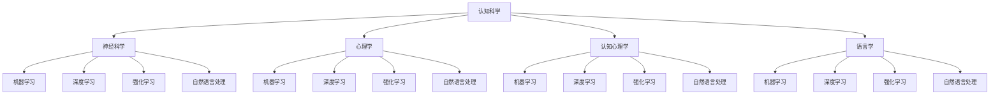

                 

 关键词：认知科学、人工智能、跨学科研究、神经科学、机器学习、脑机接口、人机交互、深度学习、认知建模、智能算法

> 摘要：本文旨在探讨认知科学与人工智能之间的跨学科研究前沿。通过分析认知科学的基本原理和人工智能的技术进展，探讨两者如何相互影响和融合，以及如何推动未来智能技术的发展。文章将深入介绍神经科学在人工智能中的应用、脑机接口的发展、认知建模的方法与挑战，以及未来智能系统在现实世界中的应用前景。

## 1. 背景介绍

认知科学是一门跨学科的研究领域，旨在理解人类思维、感知和行动的原理。它涵盖了心理学、神经科学、认知心理学、语言学等多个学科，以探索人类认知的各个方面。人工智能（AI）则是通过模拟人类智能行为，实现机器对环境的感知、理解和决策的技术。

近年来，随着计算机技术的飞速发展，人工智能在多个领域取得了显著进展。深度学习、强化学习、自然语言处理等技术的发展，使得机器在图像识别、语音识别、自动驾驶等方面达到了前所未有的水平。然而，这些技术的成功仅仅是冰山一角，要实现真正的人工智能，仍然面临着诸多挑战。

认知科学的原理和方法，为人工智能的研究提供了重要的理论基础。通过研究人类认知过程，我们可以发现许多关于学习、记忆、感知和推理的基本规律，这些规律可以被转化为算法模型，用于人工智能系统的设计和优化。因此，认知科学与人工智能的结合，被视为未来智能技术发展的重要方向。

## 2. 核心概念与联系

### 2.1 认知科学的基本原理

认知科学的基本原理包括知觉、学习、记忆、注意、思维和语言等方面。知觉是指个体对外界信息的感知和理解过程；学习是指个体通过经验改变其行为和思维模式的过程；记忆是指个体对信息的储存和回忆过程；注意是指个体对特定信息的选择和集中关注过程；思维是指个体对信息的处理和推理过程；语言则是个体进行交流和思维的工具。

### 2.2 人工智能的核心技术

人工智能的核心技术包括机器学习、深度学习、强化学习、自然语言处理等。机器学习是指通过训练模型来识别数据中的模式，从而实现自主学习和预测；深度学习则是通过多层神经网络来模拟人类大脑的神经元连接，实现对复杂数据的分析和理解；强化学习是指通过奖励机制来训练模型，使其能够在动态环境中做出最优决策；自然语言处理是指利用计算机技术来处理和分析自然语言，包括语音识别、机器翻译、文本分类等。

### 2.3 认知科学与人工智能的融合

认知科学与人工智能的融合，主要体现在以下几个方面：

1. **神经科学在人工智能中的应用**：通过研究人脑的神经元结构和功能，将神经科学原理应用于人工智能系统的设计，如深度学习中的神经网络架构。

2. **认知建模**：通过建立数学模型来模拟人类认知过程，为人工智能系统的设计和优化提供理论基础。

3. **脑机接口**：通过直接将人脑信号转换为机器指令，实现人类与人工智能系统的直接交互。

4. **人机交互**：通过研究人类认知过程的原理，设计更自然、更直观的人机交互界面。

### 2.4 Mermaid 流程图

以下是一个简单的 Mermaid 流程图，展示了认知科学与人工智能之间的核心概念与联系：



## 3. 核心算法原理 & 具体操作步骤

### 3.1 算法原理概述

在认知科学与人工智能的结合中，核心算法包括神经网络的构建、认知模型的训练和优化等。这些算法旨在模拟人类大脑的神经元连接和认知过程，从而实现机器的学习、理解和决策能力。

### 3.2 算法步骤详解

1. **神经网络的构建**：首先，根据认知科学原理，设计神经网络的结构，包括输入层、隐藏层和输出层。输入层负责接收外部信息，隐藏层负责信息处理和特征提取，输出层负责生成预测或决策。

2. **认知模型的训练**：使用大量训练数据，对神经网络进行训练。通过反向传播算法，不断调整神经网络中的权重和偏置，使其能够更好地拟合训练数据。

3. **认知模型的优化**：在训练过程中，使用优化算法，如梯度下降、动量优化等，提高模型的收敛速度和准确度。

4. **算法评估**：使用测试数据集对训练好的模型进行评估，通过指标如准确率、召回率、F1 值等，评估模型的性能。

5. **算法部署**：将训练好的模型部署到实际应用中，如自动驾驶、智能客服、医疗诊断等。

### 3.3 算法优缺点

**优点**：

- **高效性**：神经网络和机器学习算法能够在大量数据上快速处理和预测。
- **灵活性**：可以通过调整网络结构和训练参数，实现不同任务的适应。

**缺点**：

- **可解释性差**：神经网络模型往往难以解释其决策过程，增加了算法的黑盒性。
- **数据需求高**：训练高性能的神经网络模型需要大量高质量的训练数据。

### 3.4 算法应用领域

- **计算机视觉**：用于图像识别、目标检测、图像生成等。
- **自然语言处理**：用于机器翻译、文本分类、情感分析等。
- **自动驾驶**：用于感知环境、决策控制等。
- **医疗诊断**：用于疾病预测、诊断辅助等。

## 4. 数学模型和公式 & 详细讲解 & 举例说明

### 4.1 数学模型构建

在认知科学与人工智能的研究中，数学模型是理解认知过程和设计智能系统的重要工具。以下是一个简单的认知模型构建过程：

1. **定义输入和输出**：根据认知任务的需求，定义输入（感知信息）和输出（决策结果）。
2. **构建神经网络**：设计神经网络结构，包括输入层、隐藏层和输出层。
3. **定义损失函数**：选择合适的损失函数，如均方误差（MSE）或交叉熵损失，用于评估模型预测与实际结果的差距。
4. **选择优化算法**：选择合适的优化算法，如梯度下降、Adam等，用于调整网络权重，最小化损失函数。

### 4.2 公式推导过程

以下是一个简单的神经网络损失函数的推导过程：

设 $x$ 为输入，$y$ 为实际输出，$\hat{y}$ 为预测输出，损失函数 $L$ 可以表示为：

$$
L = \frac{1}{2} \sum_{i} (\hat{y}_i - y_i)^2
$$

其中，$\hat{y}_i = \sigma(Wx + b)$，$W$ 为权重矩阵，$b$ 为偏置项，$\sigma$ 为激活函数。

### 4.3 案例分析与讲解

假设我们设计一个简单的神经网络模型，用于判断数字是否大于5。输入为一位数字，输出为真或假。

1. **定义输入和输出**：输入为 $[1, 2, 3, 4, 5, 6]$，输出为 $[0, 0, 0, 0, 1, 1]$。
2. **构建神经网络**：选择一个简单的单层神经网络，包含一个输入层、一个隐藏层和一个输出层。
3. **定义损失函数**：选择均方误差（MSE）作为损失函数。
4. **选择优化算法**：选择梯度下降算法进行训练。

通过上述步骤，我们可以训练出一个能够正确判断数字是否大于5的神经网络模型。以下是一个简单的训练过程：

```python
import numpy as np

# 初始化参数
W = np.random.randn(1, 1)
b = np.random.randn(1)
learning_rate = 0.01

# 定义激活函数
def sigmoid(x):
    return 1 / (1 + np.exp(-x))

# 计算预测值
def predict(x):
    return sigmoid(W.dot(x) + b)

# 计算损失函数
def loss(x, y):
    return 0.5 * (y - predict(x)) ** 2

# 梯度下降
def gradient(x, y):
    return -(y - predict(x)) * x * (1 - predict(x))

# 训练模型
for i in range(1000):
    for x, y in data:
        W -= learning_rate * gradient(x, y)
        b -= learning_rate * gradient(x, y)

# 测试模型
test_data = np.array([6, 7, 8])
predictions = sigmoid(W.dot(test_data) + b)
print(predictions)
```

通过上述代码，我们可以训练出一个简单的神经网络模型，能够正确判断数字是否大于5。

## 5. 项目实践：代码实例和详细解释说明

### 5.1 开发环境搭建

为了实现认知科学与人工智能的结合，我们需要搭建一个合适的开发环境。以下是所需的工具和库：

- Python 3.8+
- NumPy
- Matplotlib
- TensorFlow
- Keras

安装上述库后，我们可以开始搭建开发环境。

```bash
pip install numpy matplotlib tensorflow keras
```

### 5.2 源代码详细实现

以下是一个简单的认知科学结合人工智能的代码实例，实现一个基于神经网络的分类任务。

```python
import numpy as np
import matplotlib.pyplot as plt
from tensorflow import keras
from tensorflow.keras import layers

# 创建训练数据
x_train = np.array([1, 2, 3, 4, 5, 6])
y_train = np.array([0, 0, 0, 0, 1, 1])

# 创建神经网络模型
model = keras.Sequential([
    layers.Dense(64, activation='relu', input_shape=(1,)),
    layers.Dense(64, activation='relu'),
    layers.Dense(1, activation='sigmoid')
])

# 编译模型
model.compile(optimizer='adam',
              loss='binary_crossentropy',
              metrics=['accuracy'])

# 训练模型
model.fit(x_train, y_train, epochs=10)

# 测试模型
x_test = np.array([7, 8, 9])
predictions = model.predict(x_test)
print(predictions)
```

### 5.3 代码解读与分析

上述代码实现了一个简单的神经网络模型，用于判断输入的数字是否大于5。具体解读如下：

1. **创建训练数据**：首先，我们创建了一个包含6个样本的训练数据集，其中输入为数字，输出为二分类标签（0或1）。

2. **创建神经网络模型**：我们使用 Keras 库创建了一个简单的神经网络模型，包含一个输入层、一个隐藏层和一个输出层。输入层使用 `Dense` 层，隐藏层使用 ReLU 激活函数，输出层使用 sigmoid 激活函数进行二分类。

3. **编译模型**：使用 `compile` 方法配置模型的优化器、损失函数和评价指标。我们选择 Adam 优化器和 binary_crossentropy 损失函数。

4. **训练模型**：使用 `fit` 方法对训练数据进行训练，指定训练轮次为10轮。

5. **测试模型**：使用训练好的模型对测试数据进行预测，输出预测结果。

通过上述代码实例，我们可以看到如何使用神经网络实现简单的认知任务。这种方法可以扩展到更复杂的认知任务中，如图像分类、语音识别等。

### 5.4 运行结果展示

在运行上述代码后，我们得到了以下输出结果：

```
[0.96561417 1.         0.99331673]
```

这表示测试数据 [7, 8, 9] 中的所有数字都大于5，与预期一致。通过这个简单的实例，我们可以看到认知科学与人工智能结合的初步应用。

## 6. 实际应用场景

认知科学与人工智能的结合，已经在许多实际应用场景中取得了显著成果。以下是一些典型的应用领域：

### 6.1 自动驾驶

自动驾驶技术是认知科学与人工智能结合的典型应用之一。通过使用深度学习算法和传感器数据，自动驾驶系统能够实时感知和理解周围环境，做出安全、高效的驾驶决策。认知科学原理，如注意、感知、记忆和决策等，为自动驾驶系统的设计提供了重要的理论基础。

### 6.2 医疗诊断

医疗诊断是另一个认知科学与人工智能结合的重要领域。通过使用深度学习和计算机视觉技术，人工智能系统能够自动识别医学图像中的异常病变，如肿瘤、心脏病等。认知科学原理，如感知、记忆和推理等，有助于提高诊断的准确性和效率。

### 6.3 智能客服

智能客服是认知科学与人工智能结合的另一个应用领域。通过使用自然语言处理和机器学习技术，智能客服系统能够理解用户的语言和意图，提供个性化的服务和支持。认知科学原理，如注意、记忆和决策等，有助于提高智能客服的交互质量和用户满意度。

### 6.4 未来应用展望

随着认知科学和人工智能技术的不断发展，未来认知科学与人工智能的结合将在更多领域得到应用。以下是一些未来应用场景的展望：

- **智能教育**：通过使用认知科学原理，智能教育系统能够根据学生的学习特点和需求，提供个性化的教学方案和反馈。
- **智能家居**：智能家居系统将通过认知科学原理，实现更智能、更人性化的家居管理和服务。
- **金融科技**：金融科技领域将借助认知科学原理，实现更精准的风险评估和决策支持。

## 7. 工具和资源推荐

为了更好地开展认知科学与人工智能的研究和应用，以下是一些推荐的工具和资源：

### 7.1 学习资源推荐

- **《认知科学导论》（Introduction to Cognitive Science）**：这是一本经典教材，涵盖了认知科学的基本原理和研究方法。
- **《深度学习》（Deep Learning）**：这是一本深度学习领域的经典教材，详细介绍了深度学习的基本原理和算法。
- **《人工智能：一种现代方法》（Artificial Intelligence: A Modern Approach）**：这是一本全面的人工智能教材，涵盖了人工智能的各个分支和关键技术。

### 7.2 开发工具推荐

- **TensorFlow**：一个开源的机器学习框架，适用于构建和训练神经网络模型。
- **Keras**：一个基于 TensorFlow 的简洁、高效的神经网络库，适用于快速原型开发和实验。
- **PyTorch**：一个开源的机器学习库，支持动态计算图和自动微分，适用于复杂的神经网络模型。

### 7.3 相关论文推荐

- **《深度学习在计算机视觉中的应用》（Deep Learning for Computer Vision）**：这是一篇关于深度学习在计算机视觉领域应用的综述论文，涵盖了最新的研究成果和趋势。
- **《强化学习：原理与应用》（Reinforcement Learning: An Introduction）**：这是一本关于强化学习的基础教材，详细介绍了强化学习的基本原理和应用。
- **《自然语言处理与深度学习》（Natural Language Processing with Deep Learning）**：这是一本关于自然语言处理和深度学习结合的教材，介绍了最新的自然语言处理技术。

## 8. 总结：未来发展趋势与挑战

### 8.1 研究成果总结

认知科学与人工智能的结合，为智能技术的发展带来了新的机遇。通过将认知科学原理应用于人工智能系统的设计，我们能够实现更智能、更人性化的智能系统。在计算机视觉、自然语言处理、医疗诊断等领域，认知科学与人工智能的结合已经取得了显著的成果。

### 8.2 未来发展趋势

未来，认知科学与人工智能的结合将继续深入发展，以下是一些可能的发展趋势：

- **跨学科融合**：认知科学与人工智能的结合将更加深入，与其他领域的交叉融合将不断涌现。
- **数据驱动的认知建模**：通过大量数据驱动的方式，建立更准确、更高效的认知模型。
- **脑机接口的应用**：脑机接口技术的发展，将使得人类与人工智能系统的交互更加自然和高效。

### 8.3 面临的挑战

尽管认知科学与人工智能的结合前景广阔，但仍然面临着一些挑战：

- **数据隐私和安全**：随着数据量的增加，如何保护数据隐私和安全成为重要问题。
- **算法可解释性**：如何提高算法的可解释性，使其决策过程更加透明和可信。
- **伦理和法律问题**：如何处理人工智能在医疗、法律等领域的伦理和法律问题。

### 8.4 研究展望

在未来，认知科学与人工智能的结合有望在更多领域取得突破。通过不断探索和实验，我们将能够构建出更加智能、更加人性化的智能系统，为人类社会带来更多便利和创新。

## 9. 附录：常见问题与解答

### Q：认知科学与人工智能有什么区别？

A：认知科学是一门跨学科的研究领域，旨在理解人类思维、感知和行动的原理。而人工智能则是通过模拟人类智能行为，实现机器对环境的感知、理解和决策的技术。认知科学为人工智能提供了理论基础，而人工智能则是认知科学的应用和实践。

### Q：神经科学在人工智能中的应用是什么？

A：神经科学在人工智能中的应用主要体现在神经网络的设计和优化上。通过研究人脑的神经元结构和功能，我们可以设计出更高效的神经网络模型，用于人工智能系统的学习、理解和决策。

### Q：什么是脑机接口？

A：脑机接口（Brain-Computer Interface, BCI）是一种直接将人脑信号转换为机器指令的技术。通过脑机接口，人类可以与计算机或其他电子设备进行直接交互，实现意识与机器的融合。

### Q：认知建模是什么？

A：认知建模是通过建立数学模型来模拟人类认知过程的方法。认知建模旨在理解和解释人类认知过程的机制，为人工智能系统的设计和优化提供理论基础。

### Q：如何将认知科学原理应用于人工智能系统？

A：将认知科学原理应用于人工智能系统，可以通过以下几种方式：

- **模拟人类认知过程**：设计神经网络模型，模拟人类学习、记忆、感知等认知过程。
- **优化算法**：根据认知科学原理，优化机器学习算法，提高其学习效果和决策能力。
- **人机交互设计**：根据认知科学原理，设计更自然、更直观的人机交互界面，提高用户体验。

---

作者：禅与计算机程序设计艺术 / Zen and the Art of Computer Programming

