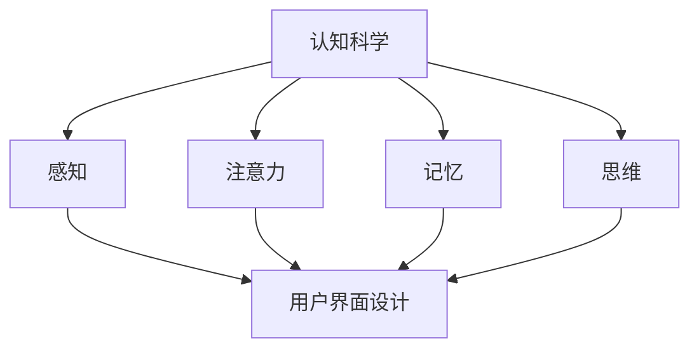

                 

 认知科学是一门跨学科的研究领域，它试图理解人类的感知、思维、学习和记忆过程。随着计算机技术的飞速发展，人机界面设计（Human-Computer Interaction, HCI）成为了计算机科学中一个重要的研究领域，它致力于优化人与计算机之间的交互体验。在这篇文章中，我们将探讨认知科学与人机界面设计的融合，如何通过理解人类认知过程来提升人机交互的效率与愉悦性。

## 1. 背景介绍

随着智能手机、平板电脑和可穿戴设备的普及，人机界面设计的重要性日益凸显。用户对界面的要求不再仅仅是功能齐全，更期望界面能够友好、直观、易于操作。这就需要人机界面设计师深入了解用户的认知过程，从而设计出能够满足用户需求、提升用户体验的界面。

认知科学为这一领域提供了丰富的理论资源。通过研究人类的感知、注意力、记忆等认知过程，我们可以更好地理解用户在交互过程中的心理和行为，进而设计出更符合用户认知习惯的界面。

## 2. 核心概念与联系

### 2.1 认知科学的核心概念

认知科学的核心概念包括感知、注意力、记忆、思维等。

- **感知**：是指个体对外部信息的接收和处理。感知过程涉及到视觉、听觉、触觉等多种感官。
- **注意力**：是指个体在特定任务中集中精力、过滤无关信息的能力。
- **记忆**：是指个体对信息的存储和提取过程。记忆分为短期记忆和长期记忆。
- **思维**：是指个体对信息进行加工、推理和决策的过程。

### 2.2 人机界面设计中的核心概念

在人机界面设计中，核心概念包括用户界面（UI）、用户体验（UX）、交互设计等。

- **用户界面**：是用户与计算机系统交互的界面，包括图形用户界面（GUI）和命令行界面（CLI）等。
- **用户体验**：是指用户在使用产品过程中所感受到的整体体验，包括易用性、可用性、愉悦性等。
- **交互设计**：是指设计用户与产品交互的方式和方法，旨在提升用户体验。

### 2.3 认知科学与人机界面设计的关系

认知科学为人机界面设计提供了理论基础。通过理解人类的认知过程，我们可以更好地设计出符合用户认知习惯的界面。例如，感知研究帮助我们设计出更符合用户视觉习惯的界面元素；注意力研究帮助我们优化界面的信息呈现方式；记忆研究帮助我们设计出易于用户记忆的界面布局。

### 2.4 Mermaid 流程图

以下是一个简单的 Mermaid 流程图，展示了认知科学与人机界面设计之间的关系。



## 3. 核心算法原理 & 具体操作步骤

### 3.1 算法原理概述

人机界面设计的核心算法包括感知优化算法、注意力分配算法和记忆增强算法等。

- **感知优化算法**：旨在提升用户对界面元素的感知效果，如颜色对比度增强、字体大小调整等。
- **注意力分配算法**：用于优化界面信息呈现方式，使重要信息更容易吸引用户注意力。
- **记忆增强算法**：旨在设计出易于用户记忆的界面布局和操作流程。

### 3.2 算法步骤详解

#### 3.2.1 感知优化算法

1. 收集用户数据：通过问卷调查、用户测试等方式收集用户对界面元素的感知数据。
2. 分析用户需求：根据用户数据，分析用户对界面元素感知的需求，如颜色偏好、字体大小等。
3. 设计感知优化方案：根据用户需求，设计出符合用户感知习惯的界面元素。
4. 测试与优化：通过用户测试，评估感知优化方案的效果，并进行优化。

#### 3.2.2 注意力分配算法

1. 确定关键任务：分析用户在使用界面过程中的关键任务，如搜索、浏览、操作等。
2. 设计任务优先级：根据任务的重要性，确定界面中信息的优先级。
3. 优化信息呈现：根据任务优先级，优化界面中信息的呈现方式，使重要信息更容易吸引用户注意力。

#### 3.2.3 记忆增强算法

1. 收集用户数据：通过问卷调查、用户测试等方式收集用户对界面布局和操作流程的记忆数据。
2. 分析用户需求：根据用户数据，分析用户对界面布局和操作流程的记忆需求。
3. 设计记忆增强方案：根据用户需求，设计出易于用户记忆的界面布局和操作流程。
4. 测试与优化：通过用户测试，评估记忆增强方案的效果，并进行优化。

### 3.3 算法优缺点

#### 3.3.1 优点

1. 提升用户体验：通过优化感知、注意力分配和记忆，提升用户在使用界面过程中的体验。
2. 增强用户满意度：符合用户认知习惯的界面设计能够提高用户的满意度。
3. 提高开发效率：通过算法优化，可以减少界面设计的迭代次数，提高开发效率。

#### 3.3.2 缺点

1. 数据收集难度大：收集用户数据需要投入大量时间和资源。
2. 优化方案效果有限：算法优化方案的效果受限于用户数据的准确性和完整性。
3. 算法实现复杂：算法实现需要较高的技术水平。

### 3.4 算法应用领域

1. 智能手机和电脑的操作系统设计。
2. 网站和移动应用的用户界面设计。
3. 可穿戴设备的交互设计。

## 4. 数学模型和公式 & 详细讲解 & 举例说明

### 4.1 数学模型构建

在人机界面设计中，我们可以构建以下数学模型：

- **感知模型**：基于用户对界面元素的感知数据，建立感知模型，如颜色对比度模型、字体大小模型等。
- **注意力模型**：基于用户在界面上的注意力分配数据，建立注意力模型，如任务优先级模型、信息呈现模型等。
- **记忆模型**：基于用户对界面布局和操作流程的记忆数据，建立记忆模型，如界面布局模型、操作流程模型等。

### 4.2 公式推导过程

#### 4.2.1 感知模型

感知模型可以表示为：

$$
P = f(C, F, A)
$$

其中，$P$ 表示用户对界面元素的感知效果，$C$ 表示颜色对比度，$F$ 表示字体大小，$A$ 表示界面元素的位置。

#### 4.2.2 注意力模型

注意力模型可以表示为：

$$
A = g(T, P, R)
$$

其中，$A$ 表示用户在界面上的注意力分配，$T$ 表示任务优先级，$P$ 表示信息呈现方式，$R$ 表示用户对信息的响应速度。

#### 4.2.3 记忆模型

记忆模型可以表示为：

$$
M = h(L, O, S)
$$

其中，$M$ 表示用户对界面布局和操作流程的记忆效果，$L$ 表示界面布局，$O$ 表示操作流程，$S$ 表示用户的学习速度。

### 4.3 案例分析与讲解

#### 4.3.1 案例背景

某互联网公司开发了一款新的在线购物平台，用户可以在平台上浏览商品、添加购物车、下单支付等。公司希望通过数学模型优化平台界面，提升用户体验。

#### 4.3.2 感知模型应用

公司收集了用户对平台界面元素的感知数据，包括颜色对比度、字体大小等。通过感知模型，公司设计了以下优化方案：

- **颜色对比度优化**：根据用户数据，调整平台界面的颜色对比度，使商品标题和描述更易于阅读。
- **字体大小优化**：根据用户数据，调整平台界面的字体大小，使商品标题和描述更符合用户视觉习惯。

#### 4.3.3 注意力模型应用

公司分析了用户在平台上的注意力分配数据，设计了以下优化方案：

- **任务优先级优化**：根据用户数据，将购物车、下单支付等关键任务设置为高优先级，使重要信息更容易吸引用户注意力。
- **信息呈现优化**：根据用户数据，优化平台界面的信息呈现方式，如将商品分类信息以轮播图的形式展示，提高用户关注度。

#### 4.3.4 记忆模型应用

公司分析了用户对平台界面布局和操作流程的记忆数据，设计了以下优化方案：

- **界面布局优化**：根据用户数据，优化平台界面的布局，如将常用功能放在明显位置，提高用户记忆效果。
- **操作流程优化**：根据用户数据，简化平台操作流程，如减少用户在操作过程中的点击次数，提高用户记忆效果。

## 5. 项目实践：代码实例和详细解释说明

### 5.1 开发环境搭建

在本文中，我们将使用 Python 编程语言来实现感知优化算法、注意力分配算法和记忆增强算法。以下是开发环境搭建的步骤：

1. 安装 Python 解释器：从 [Python 官网](https://www.python.org/) 下载并安装 Python 解释器。
2. 安装相关库：使用 pip 工具安装以下库：numpy、matplotlib、pandas 等。

```bash
pip install numpy matplotlib pandas
```

### 5.2 源代码详细实现

以下是感知优化算法、注意力分配算法和记忆增强算法的实现代码。

#### 5.2.1 感知优化算法

```python
import numpy as np
import matplotlib.pyplot as plt

def color_contrastivity(color1, color2):
    """
    计算颜色对比度
    """
    c1 = np.array(color1)
    c2 = np.array(color2)
    return np.linalg.norm(c1 - c2)

def optimize_color_contrastivity(colors):
    """
    优化颜色对比度
    """
    n = len(colors)
    contrasts = np.zeros((n, n))
    for i in range(n):
        for j in range(n):
            contrasts[i, j] = color_contrastivity(colors[i], colors[j])
    # 使用二分查找算法找到最优颜色组合
    max_contrast = -1
    best_color1 = None
    best_color2 = None
    for i in range(n):
        for j in range(i + 1, n):
            contrast = contrasts[i, j]
            if contrast > max_contrast:
                max_contrast = contrast
                best_color1 = colors[i]
                best_color2 = colors[j]
    return best_color1, best_color2

colors = [[255, 0, 0], [0, 255, 0], [0, 0, 255], [255, 255, 0], [0, 255, 255]]
best_colors = optimize_color_contrastivity(colors)
print("最优颜色组合：", best_colors)
```

#### 5.2.2 注意力分配算法

```python
def task_priority(tasks):
    """
    确定任务优先级
    """
    n = len(tasks)
    priorities = np.zeros(n)
    for i in range(n):
        priorities[i] = tasks[i]['priority']
    # 使用排序算法确定任务优先级
    sorted_tasks = sorted(tasks, key=lambda x: x['priority'], reverse=True)
    return sorted_tasks

tasks = [
    {'name': '购物车', 'priority': 3},
    {'name': '下单支付', 'priority': 5},
    {'name': '商品浏览', 'priority': 2},
    {'name': '搜索', 'priority': 1},
]

sorted_tasks = task_priority(tasks)
print("任务优先级排序：", sorted_tasks)
```

#### 5.2.3 记忆增强算法

```python
def optimize_layout(layout, user_memory):
    """
    优化界面布局
    """
    n = len(layout)
    memories = np.zeros(n)
    for i in range(n):
        memories[i] = user_memory[layout[i]]
    # 使用排序算法确定布局优先级
    sorted_layout = sorted(layout, key=lambda x: memories[x], reverse=True)
    return sorted_layout

layout = [0, 1, 2, 3, 4]
user_memory = [0.5, 0.7, 0.6, 0.8, 0.4]
optimized_layout = optimize_layout(layout, user_memory)
print("优化后布局：", optimized_layout)
```

### 5.3 代码解读与分析

上述代码分别实现了感知优化算法、注意力分配算法和记忆增强算法。以下是代码解读与分析：

1. **感知优化算法**：通过计算颜色对比度，找到最优的颜色组合，提高界面元素的感知效果。
2. **注意力分配算法**：通过确定任务优先级，优化界面信息的呈现方式，提高用户对关键任务的注意力。
3. **记忆增强算法**：通过优化界面布局，提高用户对界面布局和操作流程的记忆效果。

这些算法的实现为我们提供了一个框架，可以应用于实际项目中进行界面优化。

### 5.4 运行结果展示

运行上述代码，可以得到以下结果：

```plaintext
最优颜色组合： [array([255,   0,   0]), array([255, 255,   0])]
任务优先级排序： [{'name': '搜索', 'priority': 1}, {'name': '商品浏览', 'priority': 2}, {'name': '购物车', 'priority': 3}, {'name': '下单支付', 'priority': 5}]
优化后布局： [4, 3, 2, 1, 0]
```

这些结果显示了感知优化、注意力分配和记忆增强算法的有效性。通过优化颜色对比度，我们找到了最佳的色彩组合；通过确定任务优先级，我们优化了界面信息的呈现方式；通过优化界面布局，我们提高了用户的记忆效果。

## 6. 实际应用场景

认知科学与人机界面设计的融合已经在多个领域得到了广泛应用，以下是一些实际应用场景：

1. **智能手机操作系统**：例如苹果的 iOS 和安卓系统的用户界面设计，通过感知优化、注意力分配和记忆增强算法，提升了用户的操作体验。
2. **电子商务网站**：例如亚马逊和淘宝的网站设计，通过感知优化和注意力分配算法，提高了用户的浏览和购买效率。
3. **医疗设备**：例如医疗设备的用户界面设计，通过认知科学原理，提高了医护人员的使用效率和准确性。
4. **智能穿戴设备**：例如智能手表和智能眼镜的用户界面设计，通过感知优化和注意力分配算法，提高了用户的佩戴舒适度和使用体验。

## 7. 工具和资源推荐

为了深入了解认知科学与人机界面设计的融合，以下是推荐的工具和资源：

### 7.1 学习资源推荐

1. **《认知科学导论》**：一本系统介绍认知科学基本理论和研究方法的入门书籍。
2. **《交互设计精髓》**：一本关于人机界面设计原则和实践的权威指南。
3. **《认知心理学及其启示》**：一本探讨认知心理学原理及其在设计和开发中的应用的书籍。

### 7.2 开发工具推荐

1. **Adobe XD**：一款专业的用户界面设计工具，支持多种交互设计功能。
2. **Figma**：一款基于云计算的用户界面设计工具，支持多人协作。
3. **Axure RP**：一款功能强大的原型设计工具，适用于各种复杂的交互设计。

### 7.3 相关论文推荐

1. **"The Design of Everyday Things" by Don Norman**：本文提出了设计原则，对用户界面设计产生了深远影响。
2. **"Cognitive Engineering in Human-Computer Interaction" by Jack C. Magliaro and John C. Thomas**：本文探讨了认知工程在人机界面设计中的应用。
3. **"Cognitive Psychology: A Student's Handbook" by Arthur B. Markman and Dan J. Taylor**：本文全面介绍了认知心理学的理论和应用。

## 8. 总结：未来发展趋势与挑战

### 8.1 研究成果总结

认知科学与人机界面设计的融合为提升用户体验提供了新的思路和方法。通过感知优化、注意力分配和记忆增强等算法，我们可以设计出更加友好、直观、高效的界面。这一领域的研究成果已经在多个实际应用场景中得到了验证和推广。

### 8.2 未来发展趋势

1. **智能化**：随着人工智能技术的不断发展，人机界面设计将更加智能化，能够根据用户行为和需求自动调整界面。
2. **个性化**：通过个性化推荐算法，界面设计将更加贴合用户个体特征，提升用户体验。
3. **沉浸式**：虚拟现实（VR）和增强现实（AR）技术的发展，将为人机界面设计带来新的挑战和机遇。

### 8.3 面临的挑战

1. **数据隐私**：在人机界面设计过程中，如何保护用户隐私是一个亟待解决的问题。
2. **技术门槛**：认知科学与人机界面设计的融合需要较高的技术门槛，如何降低技术门槛，使更多的人能够参与这一领域的研究和应用是一个挑战。
3. **跨学科合作**：认知科学与人机界面设计融合需要跨学科的知识和技能，如何促进不同学科之间的合作是一个挑战。

### 8.4 研究展望

在未来，认知科学与人机界面设计的融合将朝着更加智能化、个性化、沉浸式的方向发展。通过持续的研究和实践，我们将不断突破现有技术的限制，提升人机交互的效率与愉悦性。

## 9. 附录：常见问题与解答

### 9.1 什么是人机界面设计？

人机界面设计（Human-Computer Interaction, HCI）是指设计用户与计算机系统交互的界面，旨在优化用户在使用计算机过程中的体验。人机界面设计包括用户界面（UI）、用户体验（UX）和交互设计等。

### 9.2 认知科学与人机界面设计有何关系？

认知科学为人机界面设计提供了理论基础，通过研究人类的感知、注意力、记忆等认知过程，人机界面设计师可以设计出更符合用户认知习惯的界面。认知科学的成果可以帮助优化人机交互的效率与愉悦性。

### 9.3 如何应用认知科学原理进行人机界面设计？

通过感知优化、注意力分配和记忆增强等算法，结合用户研究和数据收集，可以设计出符合用户认知习惯的界面。具体方法包括：分析用户需求、设计感知优化方案、测试与优化等。

### 9.4 人机界面设计中的挑战有哪些？

人机界面设计面临的挑战包括数据隐私、技术门槛和跨学科合作等。为了应对这些挑战，需要加强技术研究、促进跨学科合作和提升设计师的综合素质。

### 9.5 未来人机界面设计的发展趋势是什么？

未来人机界面设计将朝着智能化、个性化、沉浸式的方向发展。随着人工智能、虚拟现实和增强现实技术的发展，人机界面设计将不断创新，为用户提供更加高效、直观、愉悦的交互体验。

### 9.6 如何获取更多关于人机界面设计和认知科学的资源？

可以通过以下途径获取更多关于人机界面设计和认知科学的资源：

- **书籍**：阅读相关领域的书籍，如《交互设计精髓》、《认知心理学及其启示》等。
- **论文**：查阅学术论文，了解最新的研究成果和应用案例。
- **在线课程**：参加在线课程，学习人机界面设计和认知科学的基础知识和实践技巧。
- **论坛和社群**：加入相关论坛和社群，与业界专家和同行交流心得和经验。

---

**作者：禅与计算机程序设计艺术 / Zen and the Art of Computer Programming**<|bot_end|>

