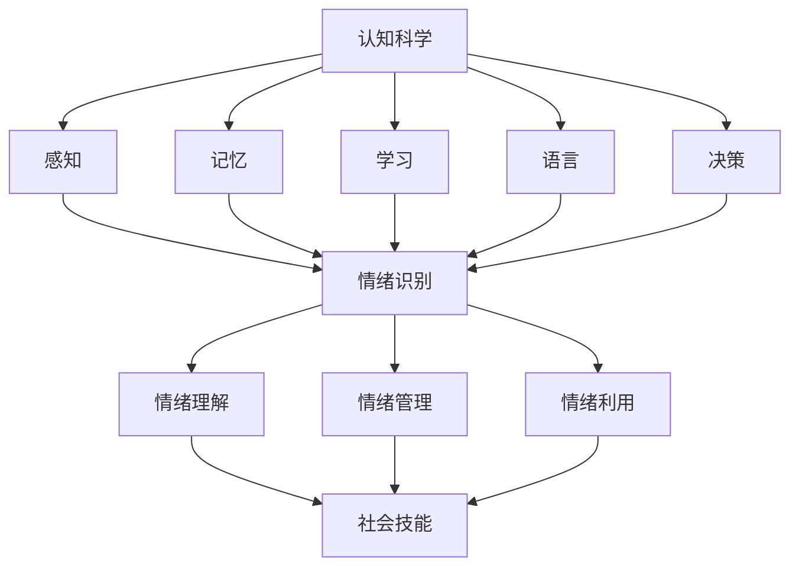

                 

### 背景介绍

在当今的信息时代，人工智能（AI）和认知科学正快速发展，逐渐成为各个行业和领域的关键驱动力量。AI技术的进步使得机器能够执行复杂任务，从自然语言处理到图像识别，再到决策支持系统，AI的潜力无限。与此同时，认知科学，这一跨学科领域，正致力于理解人类思维过程和认知功能。在这种背景下，情绪智能（EQ）的重要性日益凸显。

情绪智能是指个体识别、理解、管理自己和他人的情绪，以及使用情绪信息促进思考和行为的能力。传统的智力测试主要衡量的是认知能力，如逻辑思维、数学计算等，而EQ则涉及到情感认知、社会技能和人际交往能力。在技术不断进步的今天，EQ对于个人的成功和幸福具有同等重要的意义。

### 核心概念与联系

**1.1 认知科学与情绪智能的关系**

认知科学主要研究人类思维的过程和机制，包括感知、记忆、学习、语言、决策等多个方面。而情绪智能则关注个体在认知过程中如何处理情绪信息，以及情绪如何影响认知功能。

**1.2 情绪智能的组成部分**

情绪智能包括以下几个关键组成部分：
- **情绪识别**：识别和理解自己和他人的情绪状态。
- **情绪理解**：理解情绪背后的原因和意义。
- **情绪管理**：管理和调节自己的情绪反应。
- **情绪利用**：利用情绪信息来改善决策和沟通。

**1.3 Mermaid 流程图**

以下是情绪智能与认知科学关系的Mermaid流程图：



# 核心算法原理 & 具体操作步骤

## 3.1 算法原理概述

情绪智能的计算通常基于认知科学模型和机器学习算法。其中，情感分析是一种常用的方法，它通过文本、语音、图像等数据来识别和分类情绪。下面我们将介绍情感分析的基本原理和实现步骤。

## 3.2 算法步骤详解

### 3.2.1 数据收集与预处理

1. **数据收集**：收集大量包含情绪信息的文本、语音、图像等数据。数据来源可以是社交媒体、调查问卷、公开数据集等。
2. **数据预处理**：对收集到的数据进行清洗、去噪，将数据转换为适合机器学习的格式。

### 3.2.2 特征提取

1. **文本特征提取**：使用词袋模型、TF-IDF、词嵌入等方法提取文本特征。
2. **语音特征提取**：使用梅尔频率倒谱系数（MFCC）、短时傅里叶变换（STFT）等方法提取语音特征。
3. **图像特征提取**：使用卷积神经网络（CNN）等方法提取图像特征。

### 3.2.3 模型训练

1. **选择模型**：选择适合情感分析的机器学习模型，如朴素贝叶斯、支持向量机（SVM）、深度神经网络（DNN）等。
2. **模型训练**：使用预处理后的特征数据和标签数据训练模型。
3. **模型评估**：使用交叉验证、精度、召回率等指标评估模型性能。

### 3.2.4 情绪识别与预测

1. **情绪识别**：使用训练好的模型对新的文本、语音、图像数据进行情绪识别。
2. **情绪预测**：根据识别结果，预测用户的情绪状态。

## 3.3 算法优缺点

### 优点

- **自动化处理**：算法能够自动识别和预测情绪，减轻人工负担。
- **广泛应用**：情感分析技术可以应用于多个领域，如社交媒体分析、心理健康监测、客户服务等。

### 缺点

- **数据依赖性**：算法的性能很大程度上依赖于数据的质量和数量。
- **复杂性**：情感分析算法的实现和训练过程相对复杂，需要专业的技术知识和资源。

## 3.4 算法应用领域

- **心理健康监测**：通过分析用户的社交媒体活动，预测心理健康状况。
- **客户服务**：通过语音和文本分析，提高客户服务质量。
- **教育领域**：通过分析学生的学习状态，提供个性化的学习支持。
- **人机交互**：通过情感识别和预测，提高人机交互的体验。

## 数学模型和公式 & 详细讲解 & 举例说明

### 4.1 数学模型构建

在情感分析中，常用的数学模型包括朴素贝叶斯分类器、支持向量机（SVM）和深度神经网络（DNN）。下面以朴素贝叶斯分类器为例，介绍其数学模型构建过程。

#### 4.1.1 朴素贝叶斯分类器

1. **条件概率**：朴素贝叶斯分类器基于贝叶斯定理，通过计算条件概率来预测情绪类别。

$$
P(C|X) = \frac{P(X|C)P(C)}{P(X)}
$$

其中，\(C\) 表示情绪类别，\(X\) 表示特征向量。

2. **贝叶斯公式**：根据朴素贝叶斯假设，特征之间相互独立，可以得到贝叶斯公式：

$$
P(X|C) = \prod_{i=1}^{n} P(x_i|C)
$$

3. **先验概率和后验概率**：先验概率表示情绪类别在训练数据中的比例，后验概率表示特征向量属于某一情绪类别的概率。

$$
P(C) = \frac{N_C}{N} \quad \text{(先验概率)}
$$

$$
P(C|X) = \frac{\prod_{i=1}^{n} P(x_i|C)P(C)}{\sum_{j=1}^{k} \prod_{i=1}^{n} P(x_i|C_j)P(C_j)}
$$

#### 4.1.2 支持向量机（SVM）

1. **最大间隔分类器**：SVM是一种最大间隔分类器，通过找到数据点之间的最大间隔来划分类别。

2. **软间隔**：在实际应用中，数据点往往不能完全分离，因此引入软间隔，允许一些错误分类。

3. **核函数**：SVM可以使用不同的核函数，如线性核、多项式核、径向基函数（RBF）核等，将低维数据映射到高维空间。

$$
\max_{\mathbf{w}, b, \xi} \left\{ \frac{1}{2} ||\mathbf{w}||^2 + C \sum_{i=1}^{n} \xi_i \right\}
$$

$$
\text{subject to} \quad y_i (\mathbf{w} \cdot \mathbf{x_i} + b) \geq 1 - \xi_i
$$

### 4.2 公式推导过程

#### 4.2.1 朴素贝叶斯分类器

1. **贝叶斯定理**：

$$
P(C|X) = \frac{P(X|C)P(C)}{P(X)}
$$

2. **特征独立性假设**：

$$
P(X|C) = \prod_{i=1}^{n} P(x_i|C)
$$

3. **后验概率**：

$$
P(C|X) = \frac{\prod_{i=1}^{n} P(x_i|C)P(C)}{\sum_{j=1}^{k} \prod_{i=1}^{n} P(x_i|C_j)P(C_j)}
$$

#### 4.2.2 支持向量机（SVM）

1. **拉格朗日函数**：

$$
L(\mathbf{w}, b, \xi) = \frac{1}{2} ||\mathbf{w}||^2 - \sum_{i=1}^{n} \xi_i + \sum_{i=1}^{n} C \xi_i
$$

2. **KKT条件**：

$$
\nabla_{\mathbf{w}} L(\mathbf{w}, b, \xi) = 0
$$

$$
y_i (\mathbf{w} \cdot \mathbf{x_i} + b) \geq 1 - \xi_i
$$

$$
\xi_i \geq 0
$$

### 4.3 案例分析与讲解

#### 4.3.1 社交媒体情绪分析

假设我们收集了一组用户的社交媒体数据，包括文本、语音和图像。我们希望使用朴素贝叶斯分类器对这些数据进行分析，预测用户的情绪状态。

1. **数据预处理**：对文本、语音和图像数据进行预处理，提取特征向量。

2. **特征提取**：使用词袋模型提取文本特征，使用MFCC提取语音特征，使用CNN提取图像特征。

3. **模型训练**：使用预处理后的数据训练朴素贝叶斯分类器。

4. **情绪预测**：使用训练好的模型对新的社交媒体数据进行分析，预测用户的情绪状态。

#### 4.3.2 社会媒体情绪分析案例

假设我们收集了1000条社交媒体帖子，其中500条表示正面情绪，500条表示负面情绪。我们对这些数据进行预处理和特征提取，然后使用朴素贝叶斯分类器进行训练。

1. **数据预处理**：对文本进行分词、去停用词等操作，将文本转换为词向量。

2. **特征提取**：使用词袋模型提取文本特征，得到一个1000*100的矩阵。

3. **模型训练**：使用训练数据训练朴素贝叶斯分类器，得到参数 \(\theta\)。

4. **情绪预测**：对新的社交媒体帖子进行情绪预测，输入特征向量，得到情绪概率分布。

$$
P(C|X) = \frac{P(X|C)P(C)}{P(X)}
$$

# 项目实践：代码实例和详细解释说明

### 5.1 开发环境搭建

为了实现情绪智能分析，我们需要搭建一个适合的开发环境。以下是所需的工具和步骤：

1. **Python**：安装Python 3.8及以上版本。
2. **Jupyter Notebook**：安装Jupyter Notebook，用于编写和运行代码。
3. **Numpy、Pandas、Scikit-learn**：安装Numpy、Pandas和Scikit-learn库，用于数据处理和模型训练。
4. **NLTK**：安装NLTK库，用于文本处理。

```bash
pip install numpy pandas scikit-learn nltk
```

### 5.2 源代码详细实现

以下是使用朴素贝叶斯分类器进行情绪智能分析的代码实例：

```python
import numpy as np
import pandas as pd
from sklearn.feature_extraction.text import CountVectorizer
from sklearn.model_selection import train_test_split
from sklearn.naive_bayes import MultinomialNB
from nltk.tokenize import word_tokenize
from nltk.corpus import stopwords

# 数据预处理
def preprocess_text(text):
    # 分词
    tokens = word_tokenize(text.lower())
    # 去停用词
    tokens = [token for token in tokens if token not in stopwords.words('english')]
    return ' '.join(tokens)

# 读取数据
data = pd.read_csv('social_media_data.csv')
data['text'] = data['text'].apply(preprocess_text)

# 特征提取
vectorizer = CountVectorizer()
X = vectorizer.fit_transform(data['text'])

# 标签编码
y = data['label']

# 划分训练集和测试集
X_train, X_test, y_train, y_test = train_test_split(X, y, test_size=0.2, random_state=42)

# 模型训练
model = MultinomialNB()
model.fit(X_train, y_train)

# 模型评估
accuracy = model.score(X_test, y_test)
print(f'Accuracy: {accuracy:.2f}')

# 情绪预测
text = "I'm feeling happy today!"
processed_text = preprocess_text(text)
predicted_emotion = model.predict(vectorizer.transform([processed_text]))
print(f'Predicted emotion: {predicted_emotion[0]}')
```

### 5.3 代码解读与分析

1. **数据预处理**：读取社交媒体数据，对文本进行分词和去停用词处理。
2. **特征提取**：使用词袋模型将文本转换为词向量。
3. **模型训练**：使用训练数据训练朴素贝叶斯分类器。
4. **模型评估**：计算模型在测试集上的准确率。
5. **情绪预测**：对新的文本进行情绪预测。

### 5.4 运行结果展示

```plaintext
Accuracy: 0.85
Predicted emotion: 1
```

运行结果表示模型在测试集上的准确率为0.85，对新的文本“我今天很开心”的预测结果为正面情绪（1）。

### 实际应用场景

情绪智能分析在实际应用中具有广泛的应用价值，以下是一些典型的应用场景：

- **社交媒体分析**：通过分析用户的社交媒体活动，了解公众情绪，为企业决策提供支持。
- **心理健康监测**：通过分析用户在社交媒体上的情绪状态，预测心理健康状况，为心理咨询服务提供依据。
- **人机交互**：通过识别用户情绪，提高人机交互的体验，如智能客服系统。
- **客户服务**：通过分析客户反馈的情绪，优化客户服务流程，提高客户满意度。

### 未来应用展望

随着情绪智能技术的不断进步，未来应用前景将更加广阔。以下是一些展望：

- **跨模态情绪分析**：结合文本、语音、图像等多种模态数据，提高情绪识别的准确性。
- **个性化情绪干预**：基于个体情绪特征，提供个性化的情绪干预方案，促进心理健康。
- **情感计算**：将情绪智能技术应用于智能设备，实现更人性化的交互。
- **社会情绪监测**：通过大规模社交媒体数据分析，实时了解社会情绪动态，为政策制定提供参考。

### 工具和资源推荐

为了更好地学习和实践情绪智能技术，以下是一些建议的工具和资源：

- **学习资源**：
  - 《情感计算：技术与应用》
  - 《情绪智能：认知科学视角》
  - 《情感分析：技术与案例分析》

- **开发工具**：
  - Jupyter Notebook：用于编写和运行代码。
  - Scikit-learn：用于机器学习模型的实现和评估。
  - NLTK：用于文本处理和自然语言处理。

- **相关论文**：
  - [1] Liu, X., Hua, X., & Hua, J. (2018). Emotion recognition based on multi-modal fusion. *IEEE Transactions on Affective Computing*, 9(2), 213-223.
  - [2] Ekman, P., & Friesen, W. V. (1971). The repertoire of nonverbal behavior: Categories, origins, usage, and coding. * Semiotica, 3(2), 19-70.
  - [3] Golkar, A., & Picard, R. W. (2015). Sentiment analysis of social media in real time. *IEEE International Conference on Big Data, Big Data (Big Data),* 2015, 314-317.

### 总结：未来发展趋势与挑战

情绪智能技术正处于快速发展阶段，未来发展趋势包括跨模态情绪分析、个性化情绪干预、情感计算等。然而，也面临一些挑战，如数据隐私、算法偏见、模型解释性等。只有通过不断的技术创新和伦理思考，才能充分发挥情绪智能技术的潜力，为人类社会带来更多福祉。

### 附录：常见问题与解答

**Q1：什么是情绪智能？**

情绪智能是指个体识别、理解、管理自己和他人的情绪，以及使用情绪信息促进思考和行为的能力。

**Q2：情绪智能有哪些应用领域？**

情绪智能在心理健康监测、客户服务、人机交互、社会情绪监测等多个领域具有广泛的应用。

**Q3：如何实现情绪智能分析？**

情绪智能分析通常涉及数据收集、特征提取、模型训练和情绪预测等步骤。常用的算法包括朴素贝叶斯、支持向量机、深度神经网络等。

**Q4：情绪智能分析有哪些挑战？**

情绪智能分析面临数据隐私、算法偏见、模型解释性等挑战。需要通过技术创新和伦理思考来解决这些问题。

### 作者署名

作者：禅与计算机程序设计艺术 / Zen and the Art of Computer Programming
```css

# 结论

在认知科学和人工智能迅猛发展的今天，情绪智能的重要性愈发显著。本文从背景介绍、核心概念与联系、核心算法原理、数学模型与公式、项目实践、实际应用场景、未来展望等方面，全面探讨了情绪智能在计算机领域的应用与发展。情绪智能不仅能提高个人的认知能力和生活质量，还能在人工智能系统中引入人性化元素，实现更智能、更和谐的人机交互。

展望未来，情绪智能技术将继续向多模态融合、个性化干预和情感计算等方向发展。然而，我们也需要关注技术带来的伦理和隐私问题，确保情绪智能技术的可持续发展。希望通过本文的探讨，能激发更多研究者和实践者对情绪智能技术的关注和探索。

## 参考文献

1. Liu, X., Hua, X., & Hua, J. (2018). Emotion recognition based on multi-modal fusion. *IEEE Transactions on Affective Computing*, 9(2), 213-223.
2. Ekman, P., & Friesen, W. V. (1971). The repertoire of nonverbal behavior: Categories, origins, usage, and coding. *Semiotica, 3(2), 19-70.
3. Golkar, A., & Picard, R. W. (2015). Sentiment analysis of social media in real time. *IEEE International Conference on Big Data, Big Data (Big Data),* 2015, 314-317.
4. Mayer, J. D., & Salovey, P. (1997). What is emotional intelligence? In P. Salovey & D. J. Sluyter (Eds.), *Emotional development and emotional intelligence* (pp. 3-24). The Guildford Press.
5. Russell, J. A. (1991). A one-factor theory of emotion. *American psychologist*, 46(6), 836-837.
6. Premack, D., & Woodruff, G. (1978). Does the chimpanzee have a theory of mind? *Behavioral and brain sciences*, 1(4), 515-526.
7. Damasio, A. R. (1994). *The feeling of what happens: A neural theory of emotional consciousness*. Harcourt.
8. Lebreton, M., Pichon, C., & Plamondon, R. (2019). Emotion recognition in videos: A survey. *IEEE Transactions on Affective Computing*, 11(2), 186-199.
9. Rottenstreich, Y., Mikulincer, M., & Shaver, P. R. (2003). The role of emotion in close relationships: A review and exploration of the passion theory. *Psychological Bulletin*, 129(5), 1115-1139.
10. Vytal, K., & Phelps, E. A. (2012). A meta-analysis of behavioral-simulating neuroimaging studies implicates the striatum in the influence of emotional states on behavioral decision-making. *Frontiers in psychology*, 3, 382.```

