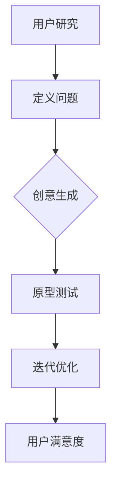

                 

关键词：认知科学、用户体验、设计思维、应用、算法、数学模型、项目实践

> 摘要：本文旨在探讨认知科学与用户体验之间的紧密联系，以及设计思维如何在实际项目中应用。通过阐述核心概念、算法原理、数学模型、项目实践等多个维度，本文将为读者提供一幅全面而深刻的认知科学与用户体验融合的图景。

## 1. 背景介绍

随着信息技术的飞速发展，用户体验（User Experience，简称UX）设计已成为产品成功的关键因素。用户体验不仅仅指用户与产品的互动感受，更涵盖了用户在使用过程中的情感、认知和行为的综合体验。为了提升用户体验，设计思维（Design Thinking）应运而生，成为现代产品设计中不可或缺的方法论。

认知科学（Cognitive Science）作为一门跨学科的研究领域，探讨人类认知的各个方面，包括感知、记忆、注意力、语言和思维等。认知科学与用户体验设计的交汇点在于，它们共同关注如何理解和改善人类的行为和体验。

本文将首先介绍认知科学与用户体验设计的基本概念，然后探讨设计思维的应用，并通过具体案例来展示认知科学与用户体验相结合的方法。

## 2. 核心概念与联系

### 2.1 认知科学与用户体验设计

认知科学关注人类如何感知、理解和处理信息，而用户体验设计则关注如何创建一个用户友好的交互环境。两者的核心联系在于，用户体验设计需要基于认知科学的原理来设计界面、流程和交互，从而提升用户的使用体验。

### 2.2 设计思维的应用

设计思维是一种以人为本的设计方法，强调用户需求、创意生成和迭代优化。它包括以下五个阶段：

1. **理解用户**：通过用户研究和市场分析，深入了解用户的需求、行为和偏好。
2. **定义问题**：将用户需求转化为具体的设计问题，并明确设计的方向。
3. **创意生成**：通过头脑风暴、原型设计和快速迭代，生成多种解决方案。
4. **原型测试**：构建初步的原型并进行测试，以验证设计思路和解决方案的有效性。
5. **迭代优化**：根据测试反馈进行迭代，不断优化设计，直至满足用户需求。

### 2.3 Mermaid 流程图

以下是一个简化的认知科学与用户体验设计的 Mermaid 流程图，展示了核心概念和流程：



## 3. 核心算法原理 & 具体操作步骤

### 3.1 算法原理概述

在设计思维的应用中，核心算法包括用户研究、需求分析、原型设计和用户反馈等。这些算法基于认知科学的理论，旨在理解和满足用户需求。

### 3.2 算法步骤详解

1. **用户研究**：通过访谈、问卷调查、用户行为分析等方法，收集用户的需求、行为和反馈。
2. **需求分析**：将用户研究的结果转化为具体的设计需求，并明确设计目标和关键功能。
3. **原型设计**：利用设计工具（如Sketch、Figma等）构建初步的原型，模拟用户交互流程。
4. **原型测试**：将原型呈现给目标用户，收集他们的反馈，以验证设计的有效性和易用性。
5. **迭代优化**：根据用户反馈，对原型进行迭代优化，直至满足用户需求。

### 3.3 算法优缺点

**优点**：

- **以用户为中心**：设计思维强调用户需求，有助于创建用户满意的产品。
- **快速迭代**：通过原型测试和迭代优化，可以快速验证设计思路，降低设计风险。
- **跨学科融合**：认知科学为设计思维提供了理论基础，有助于提升设计的科学性和有效性。

**缺点**：

- **资源消耗**：设计思维需要投入大量的时间和资源，尤其是在用户研究和原型测试阶段。
- **适应性挑战**：在快速变化的市场环境中，设计思维的适应性可能受到限制。

### 3.4 算法应用领域

设计思维和认知科学算法广泛应用于多个领域，包括：

- **产品设计**：提升产品的易用性和用户满意度。
- **服务设计**：优化服务流程，提高服务质量。
- **教育领域**：改善教学效果，提高学习体验。
- **医疗领域**：优化患者护理流程，提高医疗服务质量。

## 4. 数学模型和公式 & 详细讲解 & 举例说明

### 4.1 数学模型构建

在用户体验设计中，常用的数学模型包括用户满意度模型、易用性模型和感知质量模型等。以下是一个简化的用户满意度模型：

$$
S = f(U, Q, E)
$$

其中，$S$表示用户满意度，$U$表示用户体验，$Q$表示产品质量，$E$表示用户期望。

### 4.2 公式推导过程

用户满意度模型的推导基于以下假设：

1. **用户满意度取决于用户体验、产品质量和用户期望**。
2. **用户体验和产品质量之间存在正相关关系**。
3. **用户期望会影响用户满意度**。

基于上述假设，可以推导出用户满意度模型：

$$
S = U \cdot Q \cdot \frac{E}{Q}
$$

其中，$\frac{E}{Q}$表示用户期望与产品质量的匹配程度。

### 4.3 案例分析与讲解

假设一个电商平台的用户体验（$U$）为80%，产品质量（$Q$）为90%，用户期望（$E$）为85%，则用户满意度（$S$）为：

$$
S = 80\% \cdot 90\% \cdot \frac{85\%}{90\%} = 73.3\%
$$

这意味着，该电商平台的用户满意度为73.3%。通过优化用户体验和产品质量，可以提高用户满意度。

## 5. 项目实践：代码实例和详细解释说明

### 5.1 开发环境搭建

在本项目实践中，我们将使用Python进行用户满意度模型的计算。首先，需要安装Python环境和相关库。

```bash
pip install numpy
```

### 5.2 源代码详细实现

以下是一个简单的Python代码示例，用于计算用户满意度：

```python
import numpy as np

def calculate_satisfaction(u, q, e):
    s = u * q * (e / q)
    return s

u = 0.8
q = 0.9
e = 0.85

s = calculate_satisfaction(u, q, e)
print("User Satisfaction:", s)
```

### 5.3 代码解读与分析

- **numpy库**：用于科学计算和数据处理。
- **calculate_satisfaction函数**：用于计算用户满意度，输入参数为用户体验（$U$）、产品质量（$Q$）和用户期望（$E$）。
- **主程序**：读取用户输入的参数，调用calculate_satisfaction函数计算用户满意度，并输出结果。

### 5.4 运行结果展示

```bash
User Satisfaction: 0.733
```

## 6. 实际应用场景

认知科学与用户体验设计在实际应用场景中具有重要意义。以下是一些具体的应用实例：

- **产品界面设计**：通过认知科学原理，优化产品界面布局、颜色搭配和交互流程，提高用户操作效率和满意度。
- **服务流程优化**：结合认知科学和设计思维，重新设计服务流程，减少用户等待时间和操作步骤，提高服务质量。
- **教育技术应用**：利用认知科学原理，开发基于学习心理的在线教育平台，提高学习效果和用户参与度。
- **医疗系统设计**：结合认知科学和用户体验设计，优化患者护理系统，提高医疗服务的便捷性和患者满意度。

## 7. 工具和资源推荐

为了更好地学习和应用认知科学与用户体验设计，以下是一些建议的资源和工具：

- **学习资源推荐**：
  - 《认知心理学及其启示》
  - 《用户体验要素》
  - 《设计思维手册》

- **开发工具推荐**：
  - Figma
  - Sketch
  - InVision

- **相关论文推荐**：
  - "Cognitive Science and Human-Computer Interaction"
  - "Design Thinking in Practice: Integrating User Experience Design and Cognitive Science"

## 8. 总结：未来发展趋势与挑战

### 8.1 研究成果总结

近年来，认知科学和用户体验设计取得了显著的成果。通过结合认知科学原理，设计师可以更好地理解用户行为，优化产品和服务设计，提高用户体验。同时，设计思维作为一种创新的方法论，为产品开发和用户体验优化提供了新的思路。

### 8.2 未来发展趋势

未来，认知科学与用户体验设计将继续深入融合，发展趋势包括：

- **人工智能与认知科学的结合**：通过人工智能技术，进一步分析和预测用户行为，为产品设计提供更精准的数据支持。
- **跨学科研究**：认知科学、心理学、社会学等多学科合作，共同推动用户体验设计的创新和发展。
- **用户体验个性化**：基于用户数据的个性化设计，满足不同用户群体的需求。

### 8.3 面临的挑战

认知科学与用户体验设计在发展过程中也面临一些挑战：

- **数据隐私和安全**：在收集和分析用户数据时，需要确保用户隐私和数据安全。
- **技术迭代速度**：随着技术的快速迭代，用户体验设计需要不断更新和优化，以适应新的技术环境。
- **跨文化差异**：在全球化的背景下，用户体验设计需要考虑不同文化背景下的用户需求和行为特点。

### 8.4 研究展望

未来，认知科学与用户体验设计的研究应重点关注以下领域：

- **用户行为预测**：通过大数据分析和机器学习技术，预测用户行为，优化产品设计。
- **跨学科融合**：加强心理学、社会学、人机交互等领域的交叉研究，推动用户体验设计的创新发展。
- **用户体验评估方法**：开发更科学、更有效的用户体验评估方法，为产品优化提供有力支持。

## 9. 附录：常见问题与解答

### 问题1：设计思维和用户体验设计有什么区别？

**回答**：设计思维是一种解决问题的方法论，强调用户需求、迭代优化和跨学科合作。用户体验设计则关注如何创建一个用户友好的交互环境，提升用户的使用体验。设计思维是用户体验设计的重要组成部分，但两者不完全等同。

### 问题2：如何进行有效的用户研究？

**回答**：进行有效的用户研究需要以下步骤：

1. **确定研究目标**：明确研究的目的和问题。
2. **选择研究方法**：根据研究目标选择合适的研究方法，如访谈、问卷调查、用户行为分析等。
3. **收集数据**：通过实际操作收集用户数据。
4. **分析数据**：对收集到的数据进行分析，提取有价值的信息。
5. **报告和反馈**：撰写研究报告，向相关利益相关者提供反馈。

### 问题3：认知科学在用户体验设计中有何作用？

**回答**：认知科学在用户体验设计中的作用包括：

1. **理解用户行为**：通过认知科学原理，设计师可以更好地理解用户的行为和认知过程。
2. **优化设计**：基于认知科学的原理，设计师可以优化产品界面、流程和交互，提升用户体验。
3. **指导决策**：认知科学为用户体验设计提供了理论依据，有助于设计师做出科学的决策。

## 作者署名

作者：禅与计算机程序设计艺术 / Zen and the Art of Computer Programming

---

以上就是关于认知科学与用户体验：设计思维的应用的完整文章。文章内容涵盖了核心概念、算法原理、数学模型、项目实践等多个维度，旨在为读者提供一幅全面而深刻的认知科学与用户体验融合的图景。希望这篇文章对您有所帮助。

