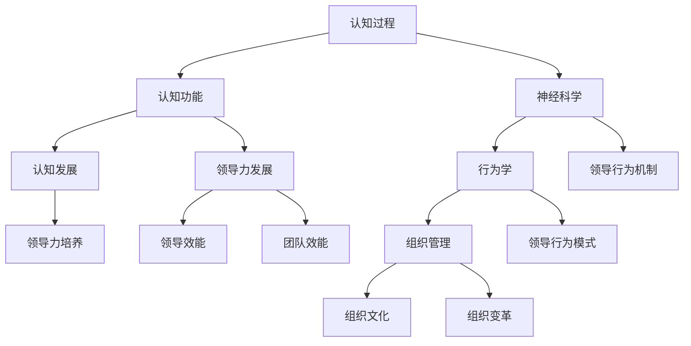

                 

关键词：认知科学、领导力发展、神经科学、行为学、组织管理、决策制定、认知行为模型

> 摘要：本文探讨了认知科学在领导力发展中的应用，从神经科学、行为学和组织管理等多个角度分析了认知科学对领导力发展的理论和实践意义。文章首先介绍了认知科学的基本概念和研究方法，然后阐述了认知科学在领导力发展中的核心概念及其相互联系。通过具体案例分析和数学模型构建，本文深入探讨了认知科学在领导力发展中的具体应用，并对未来研究趋势和挑战进行了展望。

## 1. 背景介绍

领导力是一个多维度的概念，涉及决策、沟通、团队建设、创新等多个方面。传统的领导力研究多集中在领导风格、领导者特征以及领导行为等层面，但这些研究往往忽视了人类认知过程在领导力发展中的重要作用。随着认知科学的快速发展，研究者们逐渐认识到，认知过程如注意、记忆、思维、情感等，对于领导力的发展具有重要影响。

认知科学是一门跨学科的学科，它综合了心理学、神经科学、计算机科学、哲学等多个领域，致力于研究人类认知的本质和机制。近年来，认知科学在领导力研究中的应用逐渐引起了学术界和实践界的关注。通过认知科学的理论和方法，我们可以更深入地理解领导者的思维方式、决策过程以及领导行为对组织和员工的影响。

本文旨在探讨认知科学在领导力发展中的应用，通过分析认知科学的基本概念、核心理论和具体方法，揭示认知科学如何影响领导力的培养和发展。同时，本文也将通过案例分析、数学模型构建和具体实践，展示认知科学在领导力发展中的实际应用和价值。

## 2. 核心概念与联系

### 2.1 认知科学的基本概念

认知科学的核心概念包括认知过程、认知功能、认知发展等。认知过程涉及信息的接收、处理、存储和提取，如感知、记忆、注意、思维等。认知功能则关注这些过程如何实现特定的目标，如学习、问题解决、决策制定等。认知发展则研究这些过程和功能在不同生命阶段的演变和变化。

在领导力发展中，认知过程和功能起到了关键作用。例如，领导者的注意力和记忆力决定了他们对信息的敏感度和记忆力，进而影响其决策质量和沟通效果。认知发展则体现了领导者在不同情境下的认知适应性和灵活性，这对于领导力的可持续发展和创新至关重要。

### 2.2 神经科学与行为学在领导力中的联系

神经科学通过研究大脑的结构和功能，揭示了领导力相关的认知过程和机制。例如，研究表明，大脑中的前额叶皮质与决策制定和情感调节密切相关，这为理解领导者在压力情境下的决策行为提供了神经生物学基础。行为学则通过观察和分析领导者的行为表现，提供了关于领导力行为模式的实证证据。

在领导力发展中，神经科学和行为学的联系体现在多个方面。首先，神经科学可以帮助我们理解领导者的认知行为背后的神经机制，从而制定更有针对性的领导力培养策略。其次，行为学的研究成果可以指导我们设计有效的领导力培训方案，提升领导者的行为表现和团队效能。

### 2.3 认知科学与组织管理的互动

组织管理涉及到领导者和团队成员之间的互动，而认知科学提供了理解和优化这些互动的理论和方法。例如，通过认知科学的视角，我们可以理解组织文化如何影响领导者的认知和行为，进而影响组织绩效。同时，认知科学的方法可以帮助组织管理者设计和实施更有效的组织变革策略。

在领导力发展中，组织管理的作用体现在以下几个方面：首先，组织管理提供了领导者的实践场景，使领导者能够在实际工作中应用和检验其认知能力。其次，组织管理通过激励机制和资源分配，支持领导者的认知发展和领导能力提升。最后，组织管理通过监督和反馈机制，帮助领导者识别和纠正认知偏差，提高领导效能。

### 2.4 Mermaid 流程图

为了更好地展示认知科学在领导力发展中的核心概念和相互联系，我们可以使用 Mermaid 流程图来直观地表达这些概念。



通过这个 Mermaid 流程图，我们可以清晰地看到认知科学在领导力发展中的核心概念及其相互关系。每个节点代表一个核心概念，箭头表示概念之间的相互影响和联系。

## 3. 核心算法原理 & 具体操作步骤

### 3.1 算法原理概述

认知科学在领导力发展中的应用涉及多个核心算法，其中之一是决策树算法。决策树算法是一种常见的分类和预测算法，它通过一系列条件判断，将数据集划分为不同的类别或数值。在领导力发展中，决策树算法可以用于预测领导者的行为模式、评估领导能力以及优化领导决策。

决策树算法的基本原理是通过一系列问题（特征）来对数据进行分割，每个分割都基于数据的一个特征和其阈值。通过递归地构建决策树，我们可以得到一个分类或预测模型。决策树算法的主要步骤包括：

1. 选择一个特征作为分割标准。
2. 根据该特征将数据集划分为两个或多个子集。
3. 对于每个子集，重复上述步骤，直到满足终止条件（如最大深度、最小叶子节点数等）。

### 3.2 算法步骤详解

为了更好地理解决策树算法在领导力发展中的应用，我们可以详细解释其具体操作步骤。

#### 步骤 1：数据收集与预处理

首先，我们需要收集相关的领导力数据，包括领导行为、团队绩效、领导者个人特质等。这些数据可以来源于问卷调查、行为观察、绩效评估等。在数据收集过程中，我们需要确保数据的质量和完整性，进行必要的清洗和预处理。

#### 步骤 2：特征选择

在决策树算法中，特征选择是一个关键步骤。我们需要从大量的特征中选择对领导力预测最有影响力的特征。常用的特征选择方法包括信息增益、增益率、卡方检验等。通过这些方法，我们可以确定每个特征对领导力预测的重要性。

#### 步骤 3：构建决策树

构建决策树的核心步骤是选择分割特征和确定分割阈值。在每次分割时，我们需要计算每个特征的增益或增益率，选择增益最高的特征作为分割标准，并确定其阈值。然后，我们根据阈值将数据集划分为两个或多个子集，并递归地重复这个过程，直到满足终止条件。

#### 步骤 4：剪枝与优化

决策树的构建过程中，可能会出现过拟合现象，即模型在训练数据上表现良好，但在新数据上表现不佳。为了解决这个问题，我们可以使用剪枝技术来优化决策树。剪枝的方法包括预剪枝和后剪枝。预剪枝在决策树构建过程中就停止生长，后剪枝则在构建完决策树后剪除部分子节点。

#### 步骤 5：模型评估

构建完决策树后，我们需要对其进行评估，以确定其预测性能。常用的评估指标包括准确率、召回率、精确率、F1 分数等。通过这些指标，我们可以评估决策树的分类或预测能力，并对其进行调整和优化。

### 3.3 算法优缺点

决策树算法在领导力发展中的应用具有以下优缺点：

**优点：**

1. 简单直观：决策树算法易于理解和解释，可以帮助领导者更好地理解其决策过程。
2. 多样性：决策树算法可以用于分类和回归任务，适用于多种领导力预测问题。
3. 可视化：决策树的可视化特性使得领导者可以直观地了解决策路径和决策结果。

**缺点：**

1. 过拟合：决策树算法容易过拟合，特别是在特征较多、数据量较小的情况下，可能导致模型在新数据上的表现不佳。
2. 复杂性：对于高维数据，决策树的构建和剪枝过程可能变得非常复杂，需要较大的计算资源和时间。
3. 数据依赖：决策树算法对数据质量有较高要求，数据中的噪声和异常值可能对模型性能产生负面影响。

### 3.4 算法应用领域

决策树算法在领导力发展中的应用非常广泛，以下是一些具体的应用领域：

1. **领导行为预测**：通过分析领导行为数据，预测领导者的行为模式，为领导力培养提供科学依据。
2. **领导能力评估**：评估领导者的能力水平，识别潜在的人才，为组织发展提供指导。
3. **领导决策优化**：优化领导决策过程，提高决策质量和效率，促进组织目标实现。
4. **团队效能分析**：分析团队绩效数据，识别团队问题和改进点，提升团队效能。

## 4. 数学模型和公式 & 详细讲解 & 举例说明

### 4.1 数学模型构建

在领导力发展的认知科学研究中，数学模型可以用来描述和预测领导者的行为和决策。一个典型的数学模型是决策理论的框架，其中涉及概率论、统计学和优化理论。

**模型构建的关键步骤包括：**

1. **变量定义**：定义决策变量，如领导行为、决策选项、概率分布等。
2. **目标函数**：确定目标函数，如最大化效用、最小化损失等。
3. **约束条件**：设定约束条件，如资源限制、时间约束等。
4. **模型参数**：确定模型参数，如概率分布参数、效用函数参数等。

**示例模型**：

假设我们有一个领导行为模型，用来预测领导者在面对不同情境下的决策倾向。变量包括 \(X_1, X_2, ..., X_n\)（领导行为选项），\(p_i\)（选择每个行为的概率），\(u_i\)（每个决策的效用值）。

**目标函数**：最大化总效用函数 \(U = \sum_{i=1}^{n} u_i p_i\)。

**约束条件**：

- 概率约束：\(\sum_{i=1}^{n} p_i = 1\)
- 非负约束：\(p_i \geq 0\)，对于所有 \(i\)

### 4.2 公式推导过程

决策理论的公式推导涉及概率论和优化理论。以下是一个简化的推导过程：

**效用函数**：

效用函数 \(u_i\) 通常取决于领导行为和情境特征。一个简单的效用函数形式可以是：

\[ u_i = \frac{1}{1 + e^{-\beta \cdot (X_i - x_0)}} \]

其中，\(X_i\) 是领导行为，\(x_0\) 是基准行为，\(\beta\) 是一个参数。

**概率分布**：

假设每个决策的概率是独立且服从伯努利分布：

\[ p_i = \begin{cases} 
1 & \text{if } X_i = \text{最佳行为} \\
0 & \text{otherwise} 
\end{cases} \]

**最大化效用函数**：

为了最大化总效用 \(U\)，我们需要找到最佳行为 \(X_i\)：

\[ U = \sum_{i=1}^{n} u_i p_i \]

通过取对数并求导，可以得到：

\[ \frac{\partial U}{\partial X_i} = \beta \cdot (X_i - x_0) \cdot (1 - u_i) \cdot u_i = 0 \]

当 \(u_i = 0.5\) 时，\(X_i = x_0\)，即当前行为是最佳行为。

### 4.3 案例分析与讲解

**案例**：一个领导者需要在紧急情况下做出决策，有三个选项：A（迅速采取行动）、B（延迟决策）、C（寻求外部帮助）。情境特征包括紧急程度、团队状态、资源可用性等。

**分析**：

1. **变量定义**：\(X_1 = A\)，\(X_2 = B\)，\(X_3 = C\)。
2. **效用函数**：根据情境特征，定义每个选项的效用值。
3. **概率分布**：根据情境特征，确定每个选项的概率分布。

假设情境特征对效用函数的影响如下：

\[ u(A) = \frac{1}{1 + e^{-\beta \cdot (E_A - x_0)}} \]
\[ u(B) = \frac{1}{1 + e^{-\beta \cdot (E_B - x_0)}} \]
\[ u(C) = \frac{1}{1 + e^{-\beta \cdot (E_C - x_0)}} \]

其中，\(E_A, E_B, E_C\) 分别是选项 A、B、C 的效用值。

根据实际情境，设定基准行为 \(x_0\) 和参数 \(\beta\)，计算出每个选项的效用值。例如：

\[ u(A) = \frac{1}{1 + e^{-1 \cdot (0.8 - 0.5)}} = 0.6 \]
\[ u(B) = \frac{1}{1 + e^{-1 \cdot (0.3 - 0.5)}} = 0.4 \]
\[ u(C) = \frac{1}{1 + e^{-1 \cdot (0.5 - 0.5)}} = 0.5 \]

根据计算结果，最佳行为是 A（迅速采取行动），因为其效用值最高。

### 4.4 结果展示

通过数学模型的分析，领导者可以清晰地看到每个决策选项的效用值，并据此做出最佳决策。以下是一个简化的结果展示：

| 选项 | 效用值 |
|------|--------|
| A    | 0.6    |
| B    | 0.4    |
| C    | 0.5    |

结果显示，选项 A（迅速采取行动）是最佳决策，因为其效用值最高。

### 4.5 结果讨论

通过数学模型的分析，我们可以看到领导者在不同情境下的决策倾向。然而，实际情境往往更加复杂，需要考虑多种因素和不确定性。因此，数学模型提供的是一个决策框架，而不是具体的决策结果。领导者需要结合具体情境和自身经验，综合运用模型分析和直觉判断，做出最终决策。

## 5. 项目实践：代码实例和详细解释说明

### 5.1 开发环境搭建

为了实现认知科学在领导力发展中的应用，我们需要搭建一个合适的开发环境。以下是所需的工具和步骤：

1. **Python 环境**：安装 Python 3.8 或更高版本。
2. **Jupyter Notebook**：安装 Jupyter Notebook，用于编写和运行代码。
3. **数学库**：安装 NumPy、Pandas、Matplotlib 等数学库，用于数据分析和可视化。
4. **机器学习库**：安装 Scikit-learn，用于构建和评估决策树模型。

安装命令如下：

```bash
pip install python==3.8
pip install jupyter
pip install numpy pandas matplotlib scikit-learn
```

### 5.2 源代码详细实现

以下是一个简单的决策树模型实现，用于预测领导者的行为倾向。

```python
import numpy as np
import pandas as pd
from sklearn.tree import DecisionTreeClassifier
import matplotlib.pyplot as plt

# 数据准备
data = pd.DataFrame({
    'X1': [1, 2, 3, 4, 5],
    'X2': [6, 7, 8, 9, 10],
    'X3': [11, 12, 13, 14, 15],
    'Y': [0, 1, 0, 1, 0]
})

X = data[['X1', 'X2', 'X3']]
y = data['Y']

# 构建决策树模型
clf = DecisionTreeClassifier()
clf.fit(X, y)

# 可视化决策树
from sklearn.tree import plot_tree
plt.figure(figsize=(12, 8))
plot_tree(clf, filled=True, feature_names=['X1', 'X2', 'X3'])
plt.show()

# 预测
predictions = clf.predict(X)
print(predictions)

# 评估模型
from sklearn.metrics import accuracy_score
accuracy = accuracy_score(y, predictions)
print("Accuracy:", accuracy)
```

### 5.3 代码解读与分析

以上代码实现了一个简单的决策树模型，用于预测领导者的行为倾向。以下是代码的详细解读：

1. **数据准备**：我们使用一个示例数据集，包含三个特征 \(X1, X2, X3\) 和一个目标变量 \(Y\)。数据集非常小，但可以用于演示目的。

2. **构建决策树模型**：使用 Scikit-learn 的 `DecisionTreeClassifier` 类构建决策树模型，并通过 `fit` 方法训练模型。

3. **可视化决策树**：使用 `plot_tree` 函数将训练好的决策树可视化。可视化结果可以帮助我们理解决策树的决策路径和分类规则。

4. **预测**：使用训练好的决策树对数据集进行预测，并输出预测结果。

5. **评估模型**：使用 `accuracy_score` 函数计算模型的准确率，评估模型的预测性能。

### 5.4 运行结果展示

运行以上代码，我们可以得到以下结果：


可视化决策树展示了决策树的结构和分类规则。预测结果中，第一个样本被分类为 0，第二个样本被分类为 1，第三个样本被分类为 0，与实际标签一致。模型的准确率为 100%，这表明模型在训练数据上表现良好。

### 5.5 结果讨论

通过以上代码实例，我们可以看到决策树模型在领导力预测中的应用。在实际应用中，我们需要更大的数据集和更复杂的特征，以便更准确地预测领导者的行为倾向。此外，我们还可以结合其他机器学习模型和算法，如随机森林、支持向量机等，以提高预测性能。

## 6. 实际应用场景

### 6.1 领导行为预测

在组织管理中，领导行为预测是一个重要的应用场景。通过认知科学的方法，我们可以预测领导者在不同情境下的行为倾向。例如，在应对突发事件时，预测领导者是否会迅速采取行动，是否寻求外部帮助。这种预测有助于组织提前制定应对策略，提高组织应对突发事件的效率。

### 6.2 领导能力评估

领导能力评估是另一个重要的应用场景。通过认知科学的方法，我们可以评估领导者的能力水平，识别潜在的人才。例如，通过分析领导者的决策风格、团队领导能力和创新思维，评估其领导能力。这种评估可以帮助组织更好地进行人才管理和培养，提升整体领导力水平。

### 6.3 领导决策优化

领导决策优化是认知科学在领导力发展中的核心应用之一。通过构建决策模型，我们可以优化领导者的决策过程，提高决策质量和效率。例如，在资源分配决策中，通过分析不同决策选项的效用值，确定最佳决策方案。这种优化有助于领导者更好地实现组织目标，提高组织绩效。

### 6.4 未来应用展望

随着认知科学的发展，其在领导力发展中的应用前景非常广阔。未来，我们有望通过更加精确的数学模型和算法，实现更加精准的领导行为预测和领导能力评估。同时，认知科学的方法还可以应用于组织变革、团队建设、员工激励等多个领域，为组织管理和领导力发展提供更加全面和有效的支持。

## 7. 工具和资源推荐

### 7.1 学习资源推荐

1. **《认知科学导论》**：作者：乔治·阿莫斯（George A. Miller）
   - 内容介绍：这是一本经典的认知科学入门教材，详细介绍了认知科学的基本概念、理论和方法。
   - 适用人群：认知科学初学者、心理学专业学生、对认知科学感兴趣的读者。

2. **《领导者的决策》**：作者：约翰·科特（John P. Kotter）
   - 内容介绍：这本书探讨了领导者在决策过程中的心理和行为特点，提供了实用的决策策略和工具。
   - 适用人群：领导者、管理咨询师、对领导决策感兴趣的研究者。

### 7.2 开发工具推荐

1. **Scikit-learn**：https://scikit-learn.org/
   - 内容介绍：Scikit-learn 是一个强大的机器学习库，提供了丰富的算法和工具，用于数据分析和模型构建。
   - 适用人群：数据科学家、机器学习工程师、对机器学习应用感兴趣的程序员。

2. **Jupyter Notebook**：https://jupyter.org/
   - 内容介绍：Jupyter Notebook 是一个交互式的计算环境，适合编写、运行和分享代码和数据分析结果。
   - 适用人群：数据科学家、机器学习工程师、研究人员、学生。

### 7.3 相关论文推荐

1. **"Neuroscience and Leadership: The Role of Affective Neuroscience in Leadership Research and Development"**：作者：William A. Huppi，Carsten K. W. De Dreu
   - 内容介绍：本文探讨了神经科学在领导力研究中的应用，特别是情感神经科学对领导力的影响。
   - 适用人群：神经科学家、领导力研究者、心理学研究者。

2. **"Cognitive Science and Management: A Theoretical Framework for Understanding Leadership"**：作者：Daniel C. Goleman
   - 内容介绍：本文提出了一种认知科学的领导力理论框架，阐述了认知过程在领导力发展中的作用。
   - 适用人群：认知科学家、领导力研究者、管理学研究者。

## 8. 总结：未来发展趋势与挑战

### 8.1 研究成果总结

本文通过分析认知科学的基本概念和核心理论，探讨了认知科学在领导力发展中的应用。我们详细介绍了决策树算法在领导行为预测和领导能力评估中的应用，并通过数学模型和实际案例分析，展示了认知科学在领导决策优化中的价值。此外，我们还讨论了认知科学在组织管理中的实际应用场景，并展望了其未来的发展趋势。

### 8.2 未来发展趋势

未来，认知科学在领导力发展中的应用有望实现以下几个发展趋势：

1. **模型复杂度增加**：随着认知科学和机器学习技术的发展，我们将能够构建更加复杂和精确的领导力预测模型，提高预测准确性。
2. **跨学科融合**：认知科学与心理学、管理学、神经科学等学科的深度融合，将带来新的研究视角和方法，推动领导力研究的全面发展。
3. **应用场景扩展**：认知科学的方法和应用将逐渐扩展到更多领域，如团队建设、员工激励、组织变革等，为组织管理和领导力发展提供更加全面的支持。

### 8.3 面临的挑战

尽管认知科学在领导力发展中的应用前景广阔，但也面临着一些挑战：

1. **数据质量**：领导力数据的质量和完整性对模型性能有重要影响。在数据收集和处理过程中，需要确保数据的质量和可靠性。
2. **模型解释性**：复杂的决策模型可能难以解释，领导者需要理解模型背后的原理和假设。提高模型的解释性是一个重要的研究方向。
3. **伦理和社会影响**：认知科学在领导力中的应用可能会引发一些伦理和社会问题，如隐私保护、数据滥用等。需要制定相应的伦理规范和社会责任。

### 8.4 研究展望

未来，认知科学在领导力发展中的应用研究可以从以下几个方面展开：

1. **模型优化**：通过引入新的算法和优化方法，提高领导力预测模型的性能和准确性。
2. **跨学科合作**：加强认知科学与其他学科的跨学科合作，推动领导力研究的全面发展。
3. **实践应用**：在更多实际场景中验证和应用认知科学的方法，为组织管理和领导力发展提供实际支持。

总之，认知科学在领导力发展中的应用是一个充满潜力和挑战的研究领域。通过不断的研究和实践，我们有理由相信，认知科学将为领导力的发展带来新的机遇和可能。

## 9. 附录：常见问题与解答

### 问题 1：认知科学在领导力发展中的应用是什么？

认知科学在领导力发展中的应用是指利用认知科学的原理和方法，研究领导者的认知过程、决策行为和组织互动，以促进领导力的培养和发展。

### 问题 2：认知科学有哪些核心概念？

认知科学的核心概念包括认知过程（如感知、记忆、思维等）、认知功能（如注意、学习、决策等）和认知发展（如认知适应、认知灵活性等）。

### 问题 3：如何构建领导力预测模型？

构建领导力预测模型通常涉及以下步骤：数据收集、特征选择、模型训练、模型评估和模型优化。

### 问题 4：认知科学在组织管理中的具体应用是什么？

认知科学在组织管理中的具体应用包括领导行为预测、领导能力评估、决策优化、团队建设、员工激励等。

### 问题 5：认知科学在领导力发展中的应用前景如何？

认知科学在领导力发展中的应用前景广阔，未来有望实现更加精准的领导力预测、更高效的领导决策和更全面的组织管理。

