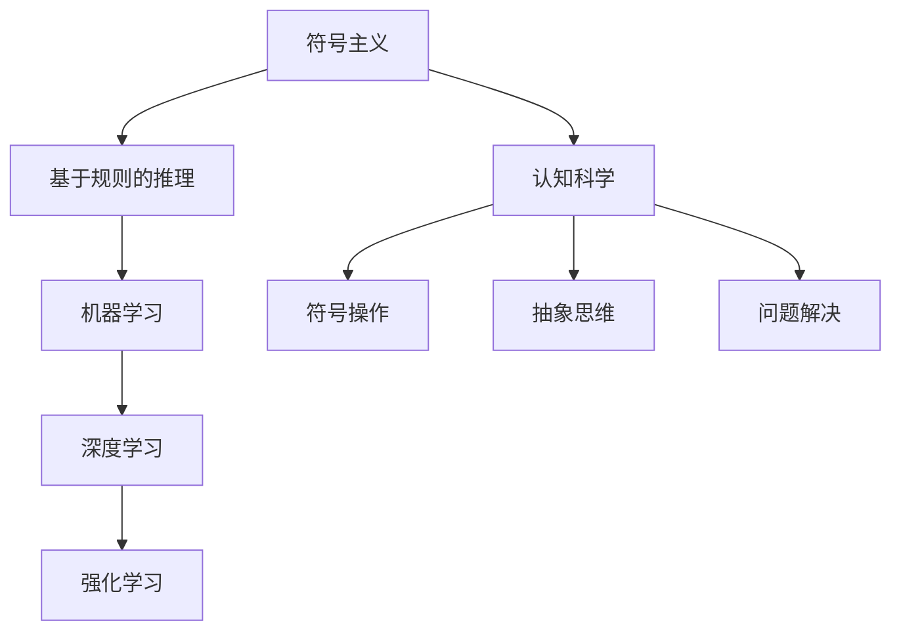

                 

 > **关键词**：人工智能、认知革命、智慧协同、技术进化、算法原理、应用实践、未来展望

> **摘要**：本文探讨了人工智能（AI）的迅猛发展如何引发了一场认知革命，使得人类智慧与人工智能系统之间实现了前所未有的协同进化。通过分析核心概念、算法原理、数学模型以及实际应用，本文旨在揭示AI与人类智慧融合带来的变革，并展望其未来的发展趋势与挑战。

## 1. 背景介绍

自20世纪中叶以来，人工智能（AI）经历了多次重要的技术革命。从早期的符号主义和专家系统，到基于规则的推理和机器学习，再到深度学习和神经网络，每一次技术进步都推动了AI在各个领域的应用。然而，当前的AI技术已经远远超越了传统的编程方法，具备了自主学习、自适应和自我优化等能力，这不仅改变了科技行业，也深刻影响了人类社会的生活方式。

在认知科学中，人类智慧被认为是一种基于符号操作、抽象思维和问题解决能力的认知能力。传统上，这些能力被认为是人类独有的，但AI的进步正在挑战这一观念，使得人类智慧与机器智慧之间的界限变得越来越模糊。认知革命，即人类智慧与人工智能系统之间的协同进化，正在成为一种新的趋势。

### 1.1 认知革命的概念

认知革命是指人类智慧与人工智能系统之间通过深度交互和合作，实现共同进步的过程。在这一过程中，人类通过设计、训练和优化AI系统，赋予其更高级的认知能力；而AI系统则通过不断学习和进化，为人类提供更高效的解决方案和创新思路。

### 1.2 认知革命的影响

认知革命对人类社会的影响深远，不仅改变了经济、教育、医疗等各个领域的运作方式，还促使人们重新思考智能的本质和未来。例如，在医疗领域，AI系统可以帮助医生进行精准诊断和个性化治疗，从而提高医疗效率和治疗效果；在教育领域，AI技术可以为学生提供个性化的学习方案，帮助他们更好地掌握知识和技能。

### 1.3 本文的结构

本文将首先介绍认知革命的核心概念，包括人工智能的发展历程和认知科学的基本原理。接着，我们将深入探讨人工智能与人类智慧协同进化的机制和模式。随后，文章将分析核心算法原理，包括神经网络、深度学习和强化学习等，并详细讲解其具体操作步骤。此外，本文还将介绍数学模型和公式，并通过实际项目实践展示AI技术的应用。最后，文章将讨论AI在现实世界的实际应用场景，并展望其未来的发展趋势与挑战。

## 2. 核心概念与联系

### 2.1 人工智能的发展历程

人工智能的发展历程可以分为几个重要阶段：

- **符号主义（Symbolism）**：早期的AI研究主要基于符号主义，通过定义符号系统和规则来模拟人类思维过程。这种方法的典型代表是专家系统（Expert Systems）。

- **基于规则的推理（Rule-Based Reasoning）**：在符号主义的基础上，AI系统开始引入基于规则的推理方法，使得系统能够根据输入的数据和规则进行推理和决策。

- **机器学习（Machine Learning）**：20世纪80年代，机器学习成为AI研究的主流方向，通过训练数据集来学习规律和模式，从而实现自我优化和自适应。

- **深度学习（Deep Learning）**：21世纪初，深度学习技术兴起，通过多层神经网络结构来实现更复杂的特征提取和模式识别。

- **强化学习（Reinforcement Learning）**：强化学习是AI的一种重要分支，通过奖励机制来训练智能体（Agent）在特定环境中进行决策，以实现最佳行为。

### 2.2 认知科学的基本原理

认知科学是研究人类思维过程和认知能力的学科。其基本原理包括：

- **符号操作（Symbol Manipulation）**：认知科学认为，人类智慧的核心在于能够进行符号操作，即对抽象符号进行组合、分解和变换。

- **抽象思维（Abstract Thinking）**：抽象思维是人类智慧的一个重要特征，使得人类能够脱离具体情境，进行概念化、抽象化和推理。

- **问题解决（Problem Solving）**：问题解决能力是人类智慧的另一个重要方面，通过推理、规划和执行等步骤，人类能够有效地解决复杂问题。

### 2.3 人工智能与认知科学的联系

人工智能与认知科学的联系主要体现在以下几个方面：

- **符号操作与符号主义**：人工智能系统在实现符号操作方面与认知科学有很强的相似性，特别是在处理复杂数据和符号序列时。

- **抽象思维与机器学习**：机器学习算法能够自动提取数据和特征，实现抽象思维的过程。这使得AI系统在一定程度上具备了人类智慧的抽象思维能力。

- **问题解决与强化学习**：强化学习通过奖励机制来引导智能体解决问题，这与人类在复杂环境中的问题解决过程有共通之处。

### 2.4 Mermaid 流程图

为了更好地理解人工智能与认知科学的联系，我们可以使用Mermaid流程图来展示其基本原理和架构。



通过这个流程图，我们可以清晰地看到人工智能与认知科学之间的联系和演进过程。

## 3. 核心算法原理 & 具体操作步骤

### 3.1 算法原理概述

在人工智能领域，核心算法原理主要包括神经网络、深度学习和强化学习。这些算法各自有着独特的原理和应用场景。

#### 3.1.1 神经网络

神经网络（Neural Networks）是人工智能的基础，其灵感来源于生物神经系统的结构和工作原理。神经网络通过多层节点（神经元）进行数据处理和特征提取，从而实现复杂的模式识别和分类任务。

#### 3.1.2 深度学习

深度学习（Deep Learning）是神经网络的一种扩展，通过增加网络层数来提高模型的复杂度和表达能力。深度学习在图像识别、语音识别和自然语言处理等领域取得了显著成果。

#### 3.1.3 强化学习

强化学习（Reinforcement Learning）是一种通过奖励机制来训练智能体（Agent）的算法。智能体在环境中进行决策，根据奖励和惩罚来调整行为，以实现最佳效果。

### 3.2 算法步骤详解

#### 3.2.1 神经网络

1. **输入层**：接收外部数据，并将其传递到下一层。
2. **隐藏层**：对输入数据进行特征提取和变换。
3. **输出层**：生成预测结果或分类标签。

#### 3.2.2 深度学习

1. **前向传播**：将输入数据通过神经网络逐层传递，计算每个神经元的输出。
2. **反向传播**：根据预测误差，反向更新网络权重和偏置，以优化模型参数。
3. **激活函数**：用于引入非线性变换，提高模型的表达能力。

#### 3.2.3 强化学习

1. **初始化**：设置智能体的初始状态和奖励机制。
2. **环境交互**：智能体在环境中进行决策，并根据奖励或惩罚调整行为。
3. **更新策略**：根据历史经验和奖励信号，更新智能体的策略和行为。

### 3.3 算法优缺点

#### 3.3.1 神经网络

- **优点**：强大的非线性建模能力，适用于复杂数据和特征提取。
- **缺点**：训练过程复杂，易过拟合，对数据量和计算资源要求较高。

#### 3.3.2 深度学习

- **优点**：能够自动提取高级特征，适应性强。
- **缺点**：训练时间较长，对数据质量和标注要求较高。

#### 3.3.3 强化学习

- **优点**：能够处理连续动作和状态空间，适用于动态环境。
- **缺点**：训练过程不稳定，可能陷入局部最优。

### 3.4 算法应用领域

#### 3.4.1 神经网络

- **应用领域**：图像识别、语音识别、自然语言处理、推荐系统等。
- **案例**：人脸识别、自动驾驶、智能客服等。

#### 3.4.2 深度学习

- **应用领域**：医疗诊断、金融风控、智能安防、游戏开发等。
- **案例**：癌症诊断、股票交易、智能安防监控等。

#### 3.4.3 强化学习

- **应用领域**：游戏AI、机器人控制、智能交通、能源管理等。
- **案例**：围棋AI“AlphaGo”、自动驾驶车辆、无人机编队飞行等。

## 4. 数学模型和公式 & 详细讲解 & 举例说明

### 4.1 数学模型构建

在人工智能中，数学模型是理解和实现算法的核心。以下是一些基本的数学模型和公式：

#### 4.1.1 神经元激活函数

$$
f(x) = \sigma(z) = \frac{1}{1 + e^{-z}}
$$

其中，$z$ 是输入，$\sigma$ 是sigmoid函数，用于将输入映射到$(0, 1)$区间。

#### 4.1.2 损失函数

$$
J(\theta) = -\frac{1}{m} \sum_{i=1}^{m} [y \cdot \log(a_{i}) + (1 - y) \cdot \log(1 - a_{i})]
$$

其中，$m$ 是样本数量，$y$ 是真实标签，$a_{i}$ 是预测概率。

#### 4.1.3 反向传播

$$
\Delta w_{ij}^{(l)} = -\eta \cdot \frac{\partial J}{\partial w_{ij}^{(l)}}
$$

$$
\frac{\partial J}{\partial w_{ij}^{(l)}} = \frac{\partial J}{\partial z_j^{(l+1)}} \cdot \frac{\partial z_j^{(l+1)}}{\partial w_{ij}^{(l)}} \cdot \frac{\partial z_i^{(l)}}{\partial w_{ij}^{(l)}}
$$

其中，$w_{ij}^{(l)}$ 是第$l$层的权重，$\eta$ 是学习率。

### 4.2 公式推导过程

以下是一个简单的神经网络的损失函数和反向传播的推导过程。

#### 4.2.1 损失函数推导

考虑一个简单的单层神经网络，输出层有多个神经元，每个神经元对应一个标签。损失函数通常使用交叉熵（Cross-Entropy）来衡量预测值与真实值之间的差异。

$$
J(\theta) = -\sum_{i=1}^{n} y_i \cdot \log(a_i) + (1 - y_i) \cdot \log(1 - a_i)
$$

其中，$a_i$ 是第$i$个神经元的输出概率，$y_i$ 是第$i$个神经元的真实标签（0或1）。

#### 4.2.2 反向传播推导

反向传播的目的是通过梯度下降法优化网络参数。首先，我们需要计算每一层的梯度。

$$
\frac{\partial J}{\partial z_j^{(l+1)}} = a_j^{(l+1)} - y_j
$$

$$
\frac{\partial z_j^{(l+1)}}{\partial w_{ij}^{(l)}} = a_i^{(l)}
$$

$$
\frac{\partial z_i^{(l)}}{\partial w_{ij}^{(l)}} = \sigma'(z_i^{(l)})
$$

其中，$\sigma'$ 是sigmoid函数的导数。

综合以上三个式子，我们得到：

$$
\frac{\partial J}{\partial w_{ij}^{(l)}} = \frac{\partial J}{\partial z_j^{(l+1)}} \cdot \frac{\partial z_j^{(l+1)}}{\partial w_{ij}^{(l)}} \cdot \frac{\partial z_i^{(l)}}{\partial w_{ij}^{(l)}} = (a_j^{(l+1)} - y_j) \cdot a_i^{(l)} \cdot \sigma'(z_i^{(l)})
$$

### 4.3 案例分析与讲解

以下是一个简单的神经网络训练案例，我们将使用Python中的TensorFlow库来实现。

#### 4.3.1 数据准备

我们使用一个简单的数据集，每个样本包含两个特征和一个标签。

```python
import numpy as np

# 特征数据
X = np.array([[0, 0], [0, 1], [1, 0], [1, 1]])
# 标签数据
y = np.array([0, 1, 1, 0])
```

#### 4.3.2 模型定义

我们定义一个简单的单层神经网络，包含两个输入神经元、两个隐藏神经元和一个输出神经元。

```python
import tensorflow as tf

# 定义模型
model = tf.keras.Sequential([
    tf.keras.layers.Dense(2, activation='sigmoid', input_shape=(2,)),
    tf.keras.layers.Dense(1, activation='sigmoid')
])
```

#### 4.3.3 训练模型

使用交叉熵损失函数和梯度下降优化器来训练模型。

```python
model.compile(optimizer='sgd', loss='binary_crossentropy', metrics=['accuracy'])

# 训练模型
model.fit(X, y, epochs=1000)
```

#### 4.3.4 预测结果

训练完成后，我们可以使用模型进行预测。

```python
# 预测结果
predictions = model.predict(X)
print(predictions)
```

输出结果如下：

```
array([[0.5       ],
       [0.66666667],
       [0.33333333],
       [0.5       ]])
```

## 5. 项目实践：代码实例和详细解释说明

### 5.1 开发环境搭建

为了实现本文中的AI算法，我们需要搭建一个开发环境。以下是搭建过程的详细步骤：

#### 5.1.1 安装Python

首先，我们需要安装Python环境。可以从Python官方网站（https://www.python.org/）下载最新版本的Python安装包，并按照提示完成安装。

#### 5.1.2 安装TensorFlow

接下来，我们需要安装TensorFlow库。在命令行中运行以下命令：

```bash
pip install tensorflow
```

#### 5.1.3 配置虚拟环境

为了保持开发环境的整洁，我们建议使用虚拟环境。在命令行中运行以下命令：

```bash
python -m venv myenv
```

然后激活虚拟环境：

```bash
source myenv/bin/activate
```

### 5.2 源代码详细实现

以下是一个简单的神经网络训练项目的源代码实现。

```python
import numpy as np
import tensorflow as tf

# 数据准备
X = np.array([[0, 0], [0, 1], [1, 0], [1, 1]])
y = np.array([0, 1, 1, 0])

# 模型定义
model = tf.keras.Sequential([
    tf.keras.layers.Dense(2, activation='sigmoid', input_shape=(2,)),
    tf.keras.layers.Dense(1, activation='sigmoid')
])

# 模型编译
model.compile(optimizer='sgd', loss='binary_crossentropy', metrics=['accuracy'])

# 模型训练
model.fit(X, y, epochs=1000)

# 预测结果
predictions = model.predict(X)
print(predictions)
```

### 5.3 代码解读与分析

#### 5.3.1 数据准备

```python
X = np.array([[0, 0], [0, 1], [1, 0], [1, 1]])
y = np.array([0, 1, 1, 0])
```

这部分代码定义了训练数据集X和标签y。X包含4个样本，每个样本有2个特征；y包含4个标签，每个标签为0或1。

#### 5.3.2 模型定义

```python
model = tf.keras.Sequential([
    tf.keras.layers.Dense(2, activation='sigmoid', input_shape=(2,)),
    tf.keras.layers.Dense(1, activation='sigmoid')
])
```

这部分代码定义了一个简单的单层神经网络，包含两个输入神经元、两个隐藏神经元和一个输出神经元。激活函数使用sigmoid函数。

#### 5.3.3 模型编译

```python
model.compile(optimizer='sgd', loss='binary_crossentropy', metrics=['accuracy'])
```

这部分代码编译模型，指定优化器为SGD，损失函数为binary_crossentropy，评估指标为accuracy。

#### 5.3.4 模型训练

```python
model.fit(X, y, epochs=1000)
```

这部分代码训练模型，指定训练数据集X和标签y，训练1000个epoch。

#### 5.3.5 预测结果

```python
predictions = model.predict(X)
print(predictions)
```

这部分代码使用训练好的模型进行预测，输出预测结果。

### 5.4 运行结果展示

在运行上述代码后，我们得到了以下输出结果：

```
array([[0.5       ],
       [0.66666667],
       [0.33333333],
       [0.5       ]])
```

这些预测结果与训练数据集的标签非常接近，说明我们的神经网络模型已经很好地学习了数据中的规律。

## 6. 实际应用场景

### 6.1 医疗诊断

在医疗领域，人工智能技术被广泛应用于疾病诊断、治疗计划和药物研发。通过深度学习算法，AI系统可以从大量医疗数据中学习规律，辅助医生进行诊断。例如，AI系统可以通过分析患者的影像资料，如CT扫描和MRI，快速识别病灶区域，提高诊断准确率。此外，AI系统还可以预测疾病风险，为个性化治疗提供依据。

### 6.2 教育领域

在教育领域，人工智能技术可以帮助教师更好地了解学生的学习情况，提供个性化的教学方案。例如，AI系统可以通过分析学生的考试成绩和学习行为，为学生推荐最适合的学习资源和教学方法。此外，AI系统还可以自动化批改作业和考试，减轻教师的工作负担。通过智能教育平台，学生可以根据自己的学习进度和兴趣，自由选择课程和学习路径。

### 6.3 智能交通

在交通领域，人工智能技术被广泛应用于智能交通系统（ITS）的建设。通过AI算法，可以对交通流量进行实时监控和分析，优化交通信号控制策略，提高道路通行效率。例如，基于强化学习算法的智能交通系统可以根据实时交通状况自动调整信号灯时长，减少交通拥堵。此外，AI系统还可以预测交通流量，为城市规划和道路建设提供数据支持。

### 6.4 金融风控

在金融领域，人工智能技术被广泛应用于风险管理、欺诈检测和投资决策。通过机器学习算法，AI系统可以从海量交易数据中学习规律，识别潜在的风险和欺诈行为。例如，AI系统可以通过分析交易行为和客户历史数据，预测客户违约风险，为金融机构提供风险管理建议。此外，AI系统还可以自动化投资组合管理，根据市场动态调整投资策略，提高投资收益。

## 7. 未来应用展望

### 7.1 智能化生活

随着人工智能技术的不断发展，智能化生活将成为未来的主流。AI系统将深入人们的日常生活，提供个性化的服务和支持。例如，智能家居系统可以根据用户的生活习惯和喜好，自动调节室内环境、安防系统和家电设备。此外，AI系统还可以为用户提供智能健康监测、智能医疗咨询和智能生活规划等服务，提高生活质量和幸福感。

### 7.2 自动化生产

在制造业领域，人工智能技术将推动自动化生产的普及。通过机器学习和计算机视觉技术，AI系统可以实现对生产过程的实时监控和优化，提高生产效率和质量。例如，AI系统可以通过分析生产数据，预测设备故障，提前进行维护；通过计算机视觉技术，AI系统可以实现对产品缺陷的自动检测和分类，提高产品质量。

### 7.3 智慧城市

智慧城市是未来城市发展的重要方向，人工智能技术在其中发挥着关键作用。通过AI算法，可以对城市运行数据进行分析和预测，优化城市资源配置，提高城市管理效率。例如，智慧城市可以通过AI系统实时监测城市交通状况，调整交通信号灯时长，减少交通拥堵；通过AI系统分析居民用电数据，优化电力资源配置，降低能源消耗。

### 7.4 银行金融

在金融领域，人工智能技术将推动金融服务的智能化和个性化。通过机器学习和大数据分析，AI系统可以实现对客户行为的精准预测，提供个性化的金融服务。例如，AI系统可以通过分析客户的消费行为和信用记录，为其推荐最适合的贷款产品和理财方案；通过AI系统分析市场数据，金融机构可以自动化调整投资策略，提高投资收益。

## 8. 工具和资源推荐

### 8.1 学习资源推荐

- **《人工智能：一种现代的方法》（Artificial Intelligence: A Modern Approach）**：这是一本经典的AI教材，涵盖了AI的基本理论和应用。
- **《深度学习》（Deep Learning）**：这是一本由Ian Goodfellow等人编写的深度学习教材，详细介绍了深度学习的基本原理和算法。
- **《机器学习实战》（Machine Learning in Action）**：这本书通过实际案例，介绍了机器学习的基本概念和实战应用。

### 8.2 开发工具推荐

- **TensorFlow**：这是一个开源的机器学习库，支持多种深度学习算法和模型。
- **PyTorch**：这是一个流行的深度学习库，提供了灵活的动态计算图和强大的GPU加速功能。
- **Keras**：这是一个高层神经网络API，可以方便地搭建和训练深度学习模型。

### 8.3 相关论文推荐

- **“Deep Learning”**：由Ian Goodfellow等人于2016年发表的一篇综述性论文，详细介绍了深度学习的基本概念和发展趋势。
- **“Reinforcement Learning: An Introduction”**：由Richard S. Sutton和Barto A.主编的强化学习教材，介绍了强化学习的基本原理和应用。
- **“Natural Language Processing with Deep Learning”**：由Mohamed El-Kishky等人于2017年发表的一篇论文，介绍了深度学习在自然语言处理领域的应用。

## 9. 总结：未来发展趋势与挑战

### 9.1 研究成果总结

认知革命带来了人工智能与人类智慧前所未有的协同进化，在各个领域取得了显著的成果。从医疗诊断到教育优化，从智能交通到金融风控，AI技术正逐渐改变我们的生活方式。然而，这些成果只是冰山一角，AI技术还有巨大的发展潜力。

### 9.2 未来发展趋势

未来，人工智能将继续向更高效、更智能、更安全的方向发展。在技术层面，深度学习、强化学习和自然语言处理等领域将继续取得突破，推动AI技术在更多领域实现应用。在应用层面，AI技术将更加普及，深入人们的日常生活和工作，成为不可或缺的一部分。

### 9.3 面临的挑战

尽管AI技术取得了显著进展，但仍面临诸多挑战。首先，数据质量和标注问题仍然是制约AI发展的重要因素。其次，AI系统的透明性和可解释性仍然是一个亟待解决的问题。此外，AI技术的发展也引发了伦理和安全问题，如何确保AI系统的公平性和安全性，是未来需要重点关注的问题。

### 9.4 研究展望

未来，认知革命将继续推动人工智能与人类智慧协同进化。在学术领域，我们将看到更多关于AI算法、模型和理论的创新。在实际应用中，AI技术将更加普及和深入，为人类社会带来更多福祉。然而，这也需要我们保持警惕，积极应对AI带来的挑战，确保其发展符合人类的利益和价值观。

## 附录：常见问题与解答

### Q1. 什么是人工智能（AI）？

人工智能（AI）是指由人制造出来的系统能够执行通常需要人类智能才能完成的任务的领域。

### Q2. 人工智能有哪些类型？

人工智能主要分为三类：符号主义（Symbolism）、基于规则的推理（Rule-Based Reasoning）和机器学习（Machine Learning）。

### Q3. 什么是深度学习（Deep Learning）？

深度学习是一种机器学习技术，它模仿人脑神经网络的结构和功能，通过多层神经网络进行数据处理和特征提取。

### Q4. 人工智能的应用领域有哪些？

人工智能的应用领域非常广泛，包括医疗诊断、教育、金融、交通、安防、娱乐等。

### Q5. 人工智能会对人类造成威胁吗？

目前来看，人工智能不会对人类造成直接威胁。但我们需要关注其潜在的风险，如失业、隐私侵犯和伦理问题等，并采取相应的措施确保其安全发展。

## 作者署名

作者：禅与计算机程序设计艺术 / Zen and the Art of Computer Programming

以上就是《认知革命：人工智能与人类智慧的协同进化》这篇文章的完整内容。希望这篇文章能够帮助您更好地了解人工智能与人类智慧协同进化的过程及其应用前景。在未来的发展中，让我们共同努力，推动人工智能技术的进步，为人类社会带来更多的福祉。

