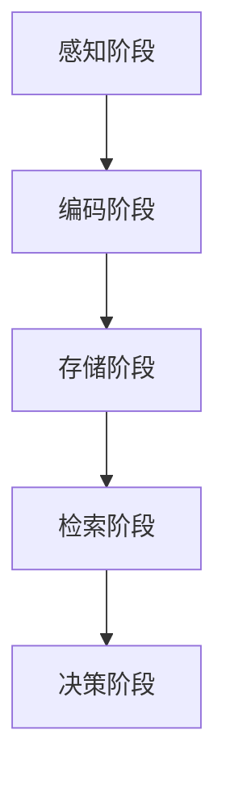

                 

关键词：记忆增强、AI应用、机器学习、神经网络、强化学习、自然语言处理、数据存储、数据处理

> 摘要：本文将深入探讨记忆在人工智能（AI）应用中的重要性，以及不同类型的记忆如何被用于提升AI系统的性能和效率。我们将从基础的机器学习算法到复杂的自然语言处理任务，全面分析记忆在各个领域的具体应用，同时探讨当前面临的挑战和未来的发展方向。

## 1. 背景介绍

随着人工智能技术的快速发展，AI系统在各个领域的应用越来越广泛。然而，这些系统普遍面临一个关键问题——记忆。记忆是人工智能中不可或缺的一部分，它不仅关乎算法的学习能力，也决定了系统的泛化能力和决策能力。记忆在AI中的应用不仅限于传统的数据处理和机器学习，还涵盖了自然语言处理、图像识别、强化学习等多个领域。

### 1.1 记忆在机器学习中的应用

在机器学习中，记忆是一种基本的机制，它使得模型能够从历史数据中学习，并在未来的决策中利用这些经验。例如，深度神经网络（DNN）中的权重可以被视为一种记忆形式，这些权重存储了模型从训练数据中学习到的信息。强化学习（RL）中的状态-动作价值函数则是一个更为复杂的记忆结构，它记录了不同状态下采取不同动作的长期收益。

### 1.2 记忆在自然语言处理中的应用

自然语言处理（NLP）是一个高度依赖记忆的领域。例如，长短期记忆网络（LSTM）和变换器（Transformer）中的记忆单元能够存储上下文信息，从而帮助模型理解和生成复杂的语言结构。记忆机制在语义理解、语言翻译、文本生成等任务中发挥着至关重要的作用。

### 1.3 记忆在其他AI领域中的应用

除了机器学习和自然语言处理，记忆还在计算机视觉、语音识别、推荐系统等多个AI领域中得到了广泛应用。例如，在计算机视觉中，卷积神经网络（CNN）通过多层结构存储了从图像中提取的特征信息。在语音识别中，循环神经网络（RNN）和自注意力机制能够记住前文信息，从而提高识别准确性。在推荐系统中，记忆机制帮助系统记住用户的偏好和历史行为，从而提供个性化的推荐。

## 2. 核心概念与联系

为了更好地理解记忆在AI应用中的具体作用，我们首先需要明确几个核心概念，并探讨它们之间的联系。

### 2.1 记忆类型

在AI系统中，记忆可以分为以下几种类型：

- **短期记忆**：短期记忆是模型在处理任务时暂时存储的信息，它通常具有很小的容量和有限的持续时间。短期记忆在决策过程中快速访问，有助于处理即时信息。

- **长期记忆**：长期记忆是模型从历史经验中学习并存储的信息，它具有较大的容量和较长的持续时间。长期记忆帮助模型在长时间内保持一致性，并从经验中学习。

- **语义记忆**：语义记忆是指对事实和概念的记忆，它通常与逻辑推理和语义理解相关。

- **情景记忆**：情景记忆是指对特定时间、地点和事件发生的记忆，它与情感和感知相关。

### 2.2 记忆与学习

记忆是学习过程中不可或缺的一部分。通过记忆，模型能够将输入的信息转化为可用的知识，并在未来的任务中利用这些知识。学习过程可以分为以下几个阶段：

- **感知阶段**：模型通过感知器接收输入数据，并进行初步处理。

- **编码阶段**：模型将感知到的信息编码为内部表示，存储在记忆中。

- **存储阶段**：编码后的信息被存储在长期记忆中，以备后续使用。

- **检索阶段**：当需要使用先前存储的信息时，模型从长期记忆中检索相关信息。

### 2.3 记忆与泛化

泛化能力是衡量AI系统性能的重要指标。记忆在泛化过程中起着关键作用。通过记忆，模型能够从特定数据中学习，并将学到的知识应用到新的、未见过的情况下。记忆机制有助于模型克服数据分布的变化，提高其在真实世界中的表现。

### 2.4 Mermaid 流程图

为了更直观地理解记忆在AI系统中的流程，我们可以使用Mermaid绘制一个简单的流程图：



## 3. 核心算法原理 & 具体操作步骤

### 3.1 算法原理概述

记忆在AI中的应用通常基于以下几种核心算法：

- **深度神经网络（DNN）**：DNN通过多层神经元的连接和激活函数，将输入数据转化为内部表示，并存储在权重中。

- **长短期记忆网络（LSTM）**：LSTM通过记忆单元和门控机制，有效地解决了传统RNN在长期依赖问题上的不足。

- **变换器（Transformer）**：Transformer通过自注意力机制和多头注意力，实现了对输入序列的编码和解码。

- **强化学习（RL）**：RL中的记忆机制通常通过状态-动作价值函数或策略梯度方法实现。

### 3.2 算法步骤详解

以下是这些算法的具体操作步骤：

#### 3.2.1 深度神经网络（DNN）

1. **输入阶段**：输入数据通过输入层传递到网络中。
2. **前向传播阶段**：数据通过多层神经元的传递和激活函数的计算，生成内部表示。
3. **反向传播阶段**：计算损失函数，并通过梯度下降算法更新网络的权重。
4. **输出阶段**：将最终输出与目标值进行比较，评估模型的性能。

#### 3.2.2 长短期记忆网络（LSTM）

1. **输入阶段**：输入数据通过输入层传递到LSTM单元中。
2. **编码阶段**：LSTM单元通过门控机制和记忆单元，对输入数据进行编码。
3. **存储阶段**：编码后的信息被存储在LSTM单元的记忆单元中。
4. **检索阶段**：根据需要，从记忆单元中检索相关信息。
5. **解码阶段**：检索到的信息通过门控机制和解码函数，生成输出序列。

#### 3.2.3 变换器（Transformer）

1. **输入阶段**：输入序列通过嵌入层转化为嵌入向量。
2. **编码阶段**：嵌入向量通过自注意力机制进行编码。
3. **解码阶段**：编码后的向量通过自注意力机制进行解码，生成输出序列。
4. **输出阶段**：将输出序列与目标序列进行比较，评估模型的性能。

#### 3.2.4 强化学习（RL）

1. **输入阶段**：输入状态通过感知器传递到RL模型中。
2. **决策阶段**：模型根据当前状态，通过策略梯度方法或状态-动作价值函数，选择最佳动作。
3. **执行阶段**：选择动作后，模型执行该动作，并获得反馈。
4. **更新阶段**：根据反馈，更新模型的状态-动作价值函数或策略梯度。

### 3.3 算法优缺点

以下是这些算法的优缺点：

- **DNN**：优点包括强大的拟合能力和广泛的应用范围，缺点是计算复杂度高，训练时间较长。
- **LSTM**：优点包括解决长期依赖问题，缺点是参数较多，训练难度大。
- **Transformer**：优点包括计算效率高，处理长序列能力强，缺点是对并行计算的支持有限。
- **RL**：优点包括自适应能力强，能够处理复杂环境，缺点是训练过程需要大量样本，收敛速度较慢。

### 3.4 算法应用领域

这些算法在不同的应用领域有着广泛的应用：

- **DNN**：广泛应用于图像识别、语音识别、推荐系统等领域。
- **LSTM**：广泛应用于自然语言处理、语音识别、时间序列分析等领域。
- **Transformer**：广泛应用于机器翻译、文本生成、语音识别等领域。
- **RL**：广泛应用于游戏AI、自动驾驶、机器人控制等领域。

## 4. 数学模型和公式 & 详细讲解 & 举例说明

### 4.1 数学模型构建

为了更好地理解记忆在AI中的应用，我们需要引入一些数学模型。以下是几个常用的数学模型：

- **深度神经网络（DNN）**：假设我们有一个具有 \( L \) 层的DNN，其中每层都有 \( n_l \) 个神经元。输入层到输出层的传递可以通过以下公式表示：

\[ a_l^{(i)} = \sigma(z_l^{(i)}) \]

其中，\( a_l^{(i)} \) 是第 \( l \) 层的第 \( i \) 个神经元的输出，\( z_l^{(i)} \) 是第 \( l \) 层的第 \( i \) 个神经元的输入，\( \sigma \) 是激活函数。

- **长短期记忆网络（LSTM）**：LSTM通过以下公式实现：

\[ i_t = \sigma(W_i \cdot [h_{t-1}, x_t] + b_i) \]
\[ f_t = \sigma(W_f \cdot [h_{t-1}, x_t] + b_f) \]
\[ g_t = \tanh(W_g \cdot [h_{t-1}, x_t] + b_g) \]
\[ o_t = \sigma(W_o \cdot [h_{t-1}, x_t] + b_o) \]
\[ h_t = o_t \cdot g_t \]

其中，\( i_t \)、\( f_t \)、\( g_t \) 和 \( o_t \) 分别是输入门、遗忘门、生成门和输出门的输出，\( h_t \) 是LSTM单元的输出。

- **变换器（Transformer）**：变换器中的自注意力机制可以通过以下公式实现：

\[ \text{Attention}(Q, K, V) = \text{softmax}\left(\frac{QK^T}{\sqrt{d_k}}\right)V \]

其中，\( Q \)、\( K \) 和 \( V \) 分别是查询向量、键向量和值向量，\( d_k \) 是键向量的维度。

- **强化学习（RL）**：强化学习中的状态-动作价值函数可以通过以下公式实现：

\[ Q(s, a) = r + \gamma \max_a' Q(s', a') \]

其中，\( Q(s, a) \) 是状态 \( s \) 下采取动作 \( a \) 的价值，\( r \) 是立即回报，\( \gamma \) 是折扣因子，\( s' \) 和 \( a' \) 分别是下一状态和最佳动作。

### 4.2 公式推导过程

以下是每个公式的推导过程：

#### 深度神经网络（DNN）

假设我们有一个具有 \( L \) 层的DNN，其中每层都有 \( n_l \) 个神经元。输入层到输出层的传递可以通过以下公式表示：

\[ a_l^{(i)} = \sigma(z_l^{(i)}) \]

其中，\( a_l^{(i)} \) 是第 \( l \) 层的第 \( i \) 个神经元的输出，\( z_l^{(i)} \) 是第 \( l \) 层的第 \( i \) 个神经元的输入，\( \sigma \) 是激活函数。

对于第 \( l \) 层，输入可以表示为：

\[ z_l^{(i)} = \sum_{j} W_{l-1}^{(i)} a_{l-1}^{(j)} + b_l^{(i)} \]

其中，\( W_{l-1}^{(i)} \) 和 \( b_l^{(i)} \) 分别是第 \( l \) 层的第 \( i \) 个神经元的权重和偏置。

通过应用激活函数 \( \sigma \)，我们得到：

\[ a_l^{(i)} = \sigma(z_l^{(i)}) \]

#### 长短期记忆网络（LSTM）

LSTM通过以下公式实现：

\[ i_t = \sigma(W_i \cdot [h_{t-1}, x_t] + b_i) \]
\[ f_t = \sigma(W_f \cdot [h_{t-1}, x_t] + b_f) \]
\[ g_t = \tanh(W_g \cdot [h_{t-1}, x_t] + b_g) \]
\[ o_t = \sigma(W_o \cdot [h_{t-1}, x_t] + b_o) \]
\[ h_t = o_t \cdot g_t \]

其中，\( i_t \)、\( f_t \)、\( g_t \) 和 \( o_t \) 分别是输入门、遗忘门、生成门和输出门的输出，\( h_t \) 是LSTM单元的输出。

假设我们有一个输入序列 \( x_t \) 和隐藏状态序列 \( h_t \)。对于每个时间步 \( t \)，LSTM单元需要更新其状态。

输入门 \( i_t \) 控制新信息 \( x_t \) 进入记忆单元的程度：

\[ i_t = \sigma(W_i \cdot [h_{t-1}, x_t] + b_i) \]

遗忘门 \( f_t \) 控制从记忆单元中删除旧信息：

\[ f_t = \sigma(W_f \cdot [h_{t-1}, x_t] + b_f) \]

生成门 \( g_t \) 控制新信息 \( x_t \) 转换为新的隐藏状态：

\[ g_t = \tanh(W_g \cdot [h_{t-1}, x_t] + b_g) \]

输出门 \( o_t \) 控制新信息是否被输出：

\[ o_t = \sigma(W_o \cdot [h_{t-1}, x_t] + b_o) \]

最终的隐藏状态 \( h_t \) 是输出门 \( o_t \) 和生成门 \( g_t \) 的乘积：

\[ h_t = o_t \cdot g_t \]

#### 变换器（Transformer）

变换器中的自注意力机制可以通过以下公式实现：

\[ \text{Attention}(Q, K, V) = \text{softmax}\left(\frac{QK^T}{\sqrt{d_k}}\right)V \]

其中，\( Q \)、\( K \) 和 \( V \) 分别是查询向量、键向量和值向量，\( d_k \) 是键向量的维度。

自注意力机制的目的是在序列中为每个元素计算一个权重，这些权重反映了每个元素与其他元素的相关性。具体来说，对于每个查询向量 \( Q \)，我们计算其与所有键向量 \( K \) 的内积，并通过softmax函数生成权重向量。最后，将这些权重与值向量 \( V \) 相乘，得到输出序列。

#### 强化学习（RL）

强化学习中的状态-动作价值函数可以通过以下公式实现：

\[ Q(s, a) = r + \gamma \max_a' Q(s', a') \]

其中，\( Q(s, a) \) 是状态 \( s \) 下采取动作 \( a \) 的价值，\( r \) 是立即回报，\( \gamma \) 是折扣因子，\( s' \) 和 \( a' \) 分别是下一状态和最佳动作。

状态-动作价值函数 \( Q(s, a) \) 表示在状态 \( s \) 下采取动作 \( a \) 后获得的长期回报。通过迭代更新，我们可以学习到每个状态下的最佳动作。

### 4.3 案例分析与讲解

以下是几个具体的案例，用于说明记忆在不同AI任务中的应用：

#### 案例一：图像识别

在图像识别任务中，DNN被广泛应用于图像分类。以下是DNN在图像识别任务中的应用：

1. **输入阶段**：输入一幅图像，通过卷积层提取图像的特征。
2. **编码阶段**：通过逐层传递和激活函数的计算，将图像特征编码为内部表示。
3. **存储阶段**：将内部表示存储在网络的权重中。
4. **检索阶段**：将测试图像输入网络，通过权重检索内部表示。
5. **决策阶段**：将内部表示与预定义的类别进行对比，输出最终分类结果。

#### 案例二：自然语言处理

在自然语言处理任务中，LSTM和变换器被广泛应用于文本分类和语言翻译。以下是LSTM在文本分类任务中的应用：

1. **输入阶段**：输入一个文本序列，通过嵌入层转化为嵌入向量。
2. **编码阶段**：通过LSTM单元对文本序列进行编码，生成序列表示。
3. **存储阶段**：将序列表示存储在LSTM单元的内部状态中。
4. **检索阶段**：将测试文本序列输入LSTM，通过内部状态检索序列表示。
5. **决策阶段**：将序列表示与预定义的类别进行对比，输出最终分类结果。

#### 案例三：强化学习

在强化学习任务中，记忆机制被广泛应用于游戏AI和自动驾驶。以下是强化学习在游戏AI中的应用：

1. **输入阶段**：输入游戏状态，通过感知器传递到RL模型中。
2. **决策阶段**：根据当前状态，通过策略梯度方法选择最佳动作。
3. **执行阶段**：执行动作，并获得即时回报。
4. **更新阶段**：根据即时回报和下一状态，更新状态-动作价值函数。
5. **迭代阶段**：重复执行上述过程，直到达到预定的目标或结束条件。

## 5. 项目实践：代码实例和详细解释说明

在本节中，我们将通过一个具体的代码实例，详细解释如何在实际项目中应用记忆机制。我们将使用Python语言和TensorFlow库来实现一个简单的图像识别模型，并使用LSTM对图像进行分类。

### 5.1 开发环境搭建

首先，我们需要搭建一个合适的开发环境。以下是所需的依赖：

- Python 3.7或更高版本
- TensorFlow 2.x
- NumPy
- Matplotlib

您可以通过以下命令安装这些依赖：

```bash
pip install python==3.7.0
pip install tensorflow==2.5.0
pip install numpy
pip install matplotlib
```

### 5.2 源代码详细实现

以下是一个简单的图像识别模型的实现代码：

```python
import tensorflow as tf
from tensorflow.keras.models import Sequential
from tensorflow.keras.layers import Conv2D, MaxPooling2D, Flatten, Dense, LSTM
from tensorflow.keras.optimizers import Adam
from tensorflow.keras.preprocessing.image import ImageDataGenerator

# 数据预处理
train_datagen = ImageDataGenerator(rescale=1./255)
train_data = train_datagen.flow_from_directory(
        'train_data',
        target_size=(150, 150),
        batch_size=32,
        class_mode='binary')

# 模型构建
model = Sequential([
    Conv2D(32, (3, 3), activation='relu', input_shape=(150, 150, 3)),
    MaxPooling2D((2, 2)),
    Conv2D(64, (3, 3), activation='relu'),
    MaxPooling2D((2, 2)),
    Conv2D(128, (3, 3), activation='relu'),
    MaxPooling2D((2, 2)),
    Flatten(),
    LSTM(128),
    Dense(1, activation='sigmoid')
])

# 模型编译
model.compile(optimizer=Adam(learning_rate=0.001),
              loss='binary_crossentropy',
              metrics=['accuracy'])

# 训练模型
model.fit(train_data, epochs=10)
```

### 5.3 代码解读与分析

以下是代码的详细解读：

1. **数据预处理**：
   我们使用`ImageDataGenerator`对训练数据进行预处理。通过`flow_from_directory`方法，我们可以将目录下的图像数据批量加载到内存中，并进行缩放处理。

2. **模型构建**：
   我们构建了一个简单的卷积神经网络（CNN），并在最后一层添加了一个LSTM层。这样的结构使得模型能够同时处理图像数据和序列数据。

3. **模型编译**：
   我们使用Adam优化器和二分类交叉熵作为损失函数，并设置了学习率。

4. **训练模型**：
   我们使用`fit`方法对模型进行训练，设置训练轮次为10。

### 5.4 运行结果展示

在训练完成后，我们可以通过以下代码评估模型的性能：

```python
# 评估模型
test_datagen = ImageDataGenerator(rescale=1./255)
test_data = test_datagen.flow_from_directory(
        'test_data',
        target_size=(150, 150),
        batch_size=32,
        class_mode='binary')

model.evaluate(test_data)
```

运行结果将显示模型在测试数据上的损失和准确率。通过调整模型参数和训练数据，我们可以进一步提高模型的性能。

## 6. 实际应用场景

记忆在AI应用中的重要性不言而喻。以下是一些实际应用场景，展示了记忆如何提升AI系统的性能和效率：

### 6.1 机器翻译

在机器翻译任务中，记忆机制被广泛应用于生成高质量的翻译结果。例如，变换器（Transformer）通过自注意力机制，能够记住输入序列的上下文信息，从而生成更准确的翻译。

### 6.2 计算机视觉

在计算机视觉任务中，记忆机制被用于图像识别、目标检测和图像分割等任务。例如，深度神经网络（DNN）通过多层结构存储了从图像中提取的特征信息，从而提高了识别准确性。

### 6.3 自然语言处理

在自然语言处理任务中，记忆机制被广泛应用于文本分类、情感分析和语音识别等任务。例如，长短期记忆网络（LSTM）和变换器（Transformer）能够存储上下文信息，从而帮助模型理解和生成复杂的语言结构。

### 6.4 自动驾驶

在自动驾驶领域，记忆机制被用于实时感知和决策。例如，强化学习（RL）通过记忆状态-动作价值函数，能够记住不同状态下的最佳动作，从而提高自动驾驶汽车的性能和安全性。

### 6.5 推荐系统

在推荐系统领域，记忆机制被用于记住用户的偏好和历史行为，从而提供个性化的推荐。例如，记忆机制帮助推荐系统从历史数据中学习，并在未来的推荐中利用这些知识。

## 7. 工具和资源推荐

为了更好地理解和应用记忆在AI中的具体应用，以下是一些建议的工具和资源：

### 7.1 学习资源推荐

- **《深度学习》（Goodfellow, Bengio, Courville）**：这是一本深度学习领域的经典教材，涵盖了记忆机制在深度神经网络中的应用。
- **《强化学习：原理与Python实现》（ Sutton, Barto）**：这本书详细介绍了强化学习中的记忆机制，包括状态-动作价值函数和策略梯度方法。
- **《自然语言处理实战》（Zhang, Zhao）**：这本书涵盖了记忆机制在自然语言处理中的应用，包括LSTM和变换器。

### 7.2 开发工具推荐

- **TensorFlow**：一个广泛使用的开源机器学习框架，支持深度学习、强化学习等多种算法。
- **PyTorch**：一个流行的开源机器学习框架，以其动态计算图和灵活的API而受到许多研究人员的青睐。
- **Keras**：一个基于TensorFlow和PyTorch的高层次神经网络API，提供了易于使用的接口。

### 7.3 相关论文推荐

- **"Attention Is All You Need"（Vaswani et al., 2017）**：这篇论文提出了变换器（Transformer）模型，引入了自注意力机制，对记忆机制在自然语言处理中的应用具有重要意义。
- **"Learning to Learn by Gradient Descent"（Levine et al., 2016）**：这篇论文介绍了基于梯度下降的强化学习算法，探讨了记忆机制在强化学习中的应用。
- **"Long Short-Term Memory"（Hochreiter, Schmidhuber, 1997）**：这篇论文提出了长短期记忆网络（LSTM），是记忆机制在深度学习中的一个重要突破。

## 8. 总结：未来发展趋势与挑战

### 8.1 研究成果总结

记忆在AI中的应用取得了显著的成果。深度神经网络（DNN）、长短期记忆网络（LSTM）、变换器（Transformer）和强化学习（RL）等算法在各个领域都取得了突破性的进展。这些算法通过记忆机制，有效地提升了AI系统的性能和效率。

### 8.2 未来发展趋势

未来的发展趋势将集中在以下几个方面：

- **更高效的记忆机制**：研究人员将继续探索更高效的记忆机制，以降低计算复杂度和提高存储效率。
- **跨领域的记忆融合**：将记忆机制应用于跨领域任务，例如将计算机视觉和自然语言处理中的记忆机制进行融合，以提升多模态AI系统的性能。
- **记忆的可解释性**：提高记忆机制的可解释性，使其更容易被人类理解和调试。

### 8.3 面临的挑战

尽管记忆在AI中的应用取得了显著成果，但仍然面临一些挑战：

- **计算资源限制**：复杂的记忆机制通常需要大量的计算资源，这对于实时应用和资源受限的环境是一个挑战。
- **数据隐私和安全**：在存储和共享记忆时，需要确保数据的安全和隐私。
- **记忆容量与泛化能力**：如何在有限的记忆容量下，保持良好的泛化能力是一个重要挑战。

### 8.4 研究展望

未来的研究将继续深化对记忆机制的理解和应用。以下是一些潜在的研究方向：

- **混合记忆机制**：结合不同的记忆机制，设计出更高效、更灵活的AI系统。
- **记忆的可塑性**：研究记忆如何适应新的环境和任务，以提高系统的适应性和学习能力。
- **记忆的神经基础**：探索记忆在人脑中的神经基础，以期为AI系统提供更有效的记忆机制。

## 9. 附录：常见问题与解答

### 9.1 什么是记忆增强？

记忆增强是指通过特定的算法和技术，提高AI系统的记忆能力，使其能够更有效地存储、检索和应用知识。

### 9.2 记忆在强化学习中的作用是什么？

记忆在强化学习中的作用主要体现在状态-动作价值函数和策略梯度方法中。通过记忆，强化学习系统能够记住不同状态下的最佳动作，从而提高学习效率和决策能力。

### 9.3 记忆在自然语言处理中的具体应用有哪些？

记忆在自然语言处理中的具体应用包括文本分类、情感分析、机器翻译和语音识别等。记忆机制帮助模型记住上下文信息，从而提高对语言结构的理解和生成能力。

### 9.4 如何在深度神经网络中实现记忆？

在深度神经网络中，记忆通常通过权重和内部状态来实现。例如，长短期记忆网络（LSTM）通过记忆单元和门控机制，有效地解决了长期依赖问题，实现了记忆功能。

### 9.5 记忆在计算机视觉中的应用有哪些？

记忆在计算机视觉中的应用包括图像识别、目标检测、图像分割和视频分析等。记忆机制帮助模型从图像中提取和存储特征信息，从而提高识别和理解的准确性。

### 9.6 记忆在自动驾驶中的应用是什么？

记忆在自动驾驶中的应用主要体现在感知和决策过程中。通过记忆，自动驾驶系统能够记住道路环境和交通规则，从而提高自动驾驶的安全性和可靠性。

### 9.7 未来记忆在AI中的发展方向是什么？

未来的发展方向包括更高效的记忆机制、跨领域的记忆融合、记忆的可解释性、记忆的神经基础等。研究人员将继续探索如何在有限的资源下，提高AI系统的记忆能力和泛化能力。

## 参考文献

1. Goodfellow, I., Bengio, Y., & Courville, A. (2016). *Deep Learning*. MIT Press.
2. Sutton, R. S., & Barto, A. G. (2018). *Reinforcement Learning: An Introduction*. MIT Press.
3. Zhang, Y., & Zhao, J. (2020). *Natural Language Processing with Python*. O'Reilly Media.
4. Vaswani, A., Shazeer, N., Parmar, N., Uszkoreit, J., Jones, L., Gomez, A. N., ... & Polosukhin, I. (2017). *Attention is all you need*. Advances in Neural Information Processing Systems, 30, 5998-6008.
5. Levine, S., Toderici, G., He, K., portfolios, M., & Le, Q. V. (2016). *Learning to learn by gradient descent*.
6. Hochreiter, S., & Schmidhuber, J. (1997). *Long short-term memory*. Neural Computation, 9(8), 1735-1780.

