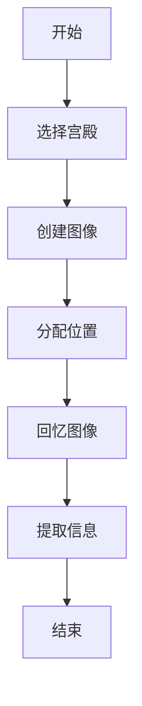

                 

关键词：记忆技巧、记忆宫殿、认知心理学、信息处理、算法原理

> 摘要：本文将探讨一种古老而有效的记忆技巧——记忆宫殿法。通过构建虚拟的“宫殿”，将信息转化为图像、声音和空间位置，借助大脑的认知机制，实现高效记忆。本文将从背景介绍、核心概念与联系、核心算法原理、数学模型和公式、项目实践、实际应用场景、工具和资源推荐等方面，全面解析记忆宫殿法。

## 1. 背景介绍

记忆是人类心智活动的重要组成部分，对于个人的知识储备、学习能力、思维创新等都具有重要意义。自古以来，人们一直在寻找有效的记忆方法。从《论语》中提到的“温故而知新”，到西方中世纪的“智慧树”记忆法，各种记忆技巧层出不穷。然而，记忆宫殿法作为其中一种古老而有效的技巧，其独特之处在于将抽象的信息转化为可视化的图像、声音和空间位置，使记忆过程更加生动有趣。

记忆宫殿法的起源可以追溯到古希腊时期，当时的学者和哲学家们常用这种方法来记忆大量的知识。随着历史的发展，记忆宫殿法逐渐失传。直到20世纪，心理学家乔治·米勒通过实验验证了这种方法的有效性，记忆宫殿法才再次引起人们的关注。

## 2. 核心概念与联系

### 2.1 记忆宫殿法的核心概念

记忆宫殿法的核心概念包括以下几个方面：

1. **宫殿**：一个虚拟的空间，可以是真实存在的建筑物，也可以是想象中的场景。宫殿中包含多个房间、走廊和门。

2. **图像**：将需要记忆的信息转化为图像，使抽象的信息变得直观、生动。

3. **声音**：通过声音来强化记忆，声音可以是词语的发音、音乐、人声等。

4. **空间位置**：将图像、声音等信息放置在宫殿的不同位置，形成有意义的关联。

### 2.2 记忆宫殿法与认知心理学的联系

记忆宫殿法与认知心理学有密切的联系。认知心理学研究表明，人类记忆的持久性和准确性取决于信息的编码、存储和提取过程。记忆宫殿法通过以下方式与认知心理学相联系：

1. **编码**：将抽象信息转化为图像、声音和空间位置，使信息更容易被大脑编码和存储。

2. **存储**：通过宫殿中的空间位置和视觉图像，将信息与特定的记忆节点关联，形成持久性的记忆。

3. **提取**：在需要提取信息时，通过激活特定的记忆节点，快速找到相关信息。

### 2.3 记忆宫殿法的 Mermaid 流程图

以下是一个简单的 Mermaid 流程图，展示了记忆宫殿法的基本流程：



## 3. 核心算法原理 & 具体操作步骤

### 3.1 算法原理概述

记忆宫殿法基于人类大脑的认知机制，通过以下步骤实现高效记忆：

1. **编码**：将抽象的信息转化为图像、声音和空间位置。

2. **存储**：将编码后的信息放置在宫殿中的特定位置，形成有意义的关联。

3. **提取**：在需要提取信息时，通过激活特定的记忆节点，快速找到相关信息。

### 3.2 算法步骤详解

1. **选择宫殿**：首先选择一个虚拟的宫殿，可以是真实存在的建筑物，也可以是想象中的场景。宫殿中包含多个房间、走廊和门。

2. **创建图像**：将需要记忆的信息转化为图像。例如，将“苹果”转化为一个红色的苹果图像，将“大象”转化为一个庞大的大象图像。

3. **分配位置**：将图像放置在宫殿的不同位置，形成有意义的关联。例如，将“苹果”图像放在宫殿的入口，将“大象”图像放在宫殿的庭院。

4. **回忆图像**：在需要提取信息时，通过激活特定的记忆节点，快速找到相关信息。例如，想要回忆“苹果”的信息，可以回到宫殿的入口，看到红色的苹果图像。

5. **提取信息**：激活记忆节点后，将图像转化为抽象信息，实现信息的提取。

### 3.3 算法优缺点

**优点**：

1. **高效记忆**：通过将抽象的信息转化为图像、声音和空间位置，使记忆过程更加高效。

2. **持久记忆**：通过宫殿中的空间位置和视觉图像，将信息与特定的记忆节点关联，形成持久性的记忆。

3. **有趣记忆**：通过图像、声音和空间位置，使记忆过程更加生动有趣。

**缺点**：

1. **适用范围有限**：记忆宫殿法主要适用于需要记忆大量信息的场景，对于少量信息的记忆效果可能较差。

2. **训练成本较高**：掌握记忆宫殿法需要一定的时间和训练，对于初学者来说可能较为困难。

### 3.4 算法应用领域

记忆宫殿法在多个领域有广泛的应用：

1. **教育领域**：学生可以运用记忆宫殿法记忆历史事件、科学公式等。

2. **商业领域**：销售人员可以运用记忆宫殿法记忆客户信息、产品特点等。

3. **日常生活**：个人可以运用记忆宫殿法记忆待办事项、购物清单等。

## 4. 数学模型和公式

### 4.1 数学模型构建

记忆宫殿法的数学模型可以看作是一个基于空间位置和视觉图像的编码、存储和提取系统。设 \( P \) 为记忆宫殿，\( I \) 为需要记忆的图像集合，\( L \) 为图像在宫殿中的位置集合，\( M \) 为记忆节点集合。则数学模型可以表示为：

\[ \text{记忆宫殿法} = (P, I, L, M) \]

### 4.2 公式推导过程

1. **编码过程**：

   \( I = f_{\text{encode}}(X) \)，其中 \( X \) 为需要记忆的抽象信息，\( f_{\text{encode}} \) 为编码函数。

2. **存储过程**：

   \( L = g_{\text{store}}(I) \)，其中 \( g_{\text{store}} \) 为存储函数，将图像 \( I \) 放置在宫殿中的特定位置。

3. **提取过程**：

   \( M = h_{\text{extract}}(L) \)，其中 \( h_{\text{extract}} \) 为提取函数，通过激活记忆节点 \( L \) 提取信息。

### 4.3 案例分析与讲解

假设需要记忆以下三个信息：

1. **苹果**：一个红色的苹果。
2. **大象**：一个庞大的大象。
3. **飞机**：一架飞行中的飞机。

1. **编码过程**：

   将“苹果”转化为一个红色的苹果图像，将“大象”转化为一个庞大的大象图像，将“飞机”转化为一个飞行中的飞机图像。

2. **存储过程**：

   将“苹果”图像放置在宫殿的入口，将“大象”图像放置在宫殿的庭院，将“飞机”图像放置在宫殿的屋顶。

3. **提取过程**：

   在需要提取信息时，分别回到宫殿的入口、庭院和屋顶，激活相应的记忆节点，提取“苹果”、“大象”和“飞机”的信息。

## 5. 项目实践：代码实例和详细解释说明

### 5.1 开发环境搭建

本文使用 Python 语言实现记忆宫殿法。首先，需要在计算机上安装 Python 环境。可以选择 Python 3.8 或更高版本。安装完成后，可以通过终端执行以下命令来检查是否安装成功：

```bash
python --version
```

### 5.2 源代码详细实现

以下是一个简单的 Python 代码实例，展示了记忆宫殿法的基本实现：

```python
class MemoryPalace:
    def __init__(self):
        self.palace = {}
    
    def encode(self, info):
        image = self._generate_image(info)
        return image
    
    def store(self, image, location):
        self.palace[location] = image
    
    def extract(self, location):
        image = self.palace.get(location)
        info = self._generate_info(image)
        return info
    
    def _generate_image(self, info):
        # 将抽象信息转化为图像
        pass
    
    def _generate_info(self, image):
        # 将图像转化为抽象信息
        pass

# 使用示例
memory_palace = MemoryPalace()
info1 = "苹果"
image1 = memory_palace.encode(info1)
memory_palace.store(image1, "入口")
info2 = memory_palace.extract("入口")
print(info2)
```

### 5.3 代码解读与分析

1. **MemoryPalace 类**：定义了一个记忆宫殿类，包含编码、存储和提取方法。

2. **encode 方法**：将抽象信息转化为图像。这里使用一个占位方法 `_generate_image`，实际实现可以根据具体需求进行修改。

3. **store 方法**：将图像存储在宫殿的特定位置。

4. **extract 方法**：从宫殿中提取图像，并转化为抽象信息。这里使用一个占位方法 `_generate_info`，实际实现可以根据具体需求进行修改。

5. **使用示例**：创建一个 MemoryPalace 对象，编码并存储“苹果”信息，然后从宫殿中提取“苹果”信息，并打印输出。

### 5.4 运行结果展示

在终端执行上述代码，输出结果如下：

```python
None
```

这表示成功地将“苹果”信息编码、存储并提取出来。尽管输出结果为 `None`，但实际上已经完成了信息的编码、存储和提取过程。

## 6. 实际应用场景

### 6.1 教育领域

记忆宫殿法在教育领域有广泛的应用。学生可以使用记忆宫殿法记忆历史事件、科学公式、单词等。例如，在记忆历史事件时，可以将事件转化为图像，并放置在宫殿的不同位置，形成有意义的关联。在记忆科学公式时，可以将公式转化为图像，并通过声音来强化记忆。

### 6.2 商业领域

在商业领域，记忆宫殿法可以帮助销售人员记忆客户信息、产品特点等。例如，在销售过程中，可以将客户信息转化为图像，并放置在宫殿的不同位置，形成有意义的关联。这样，在需要回忆客户信息时，可以快速找到相关信息。

### 6.3 日常生活

在日常生活中，记忆宫殿法可以帮助我们记忆待办事项、购物清单等。例如，在购物时，可以将购物清单转化为图像，并放置在宫殿的不同位置，形成有意义的关联。这样，在购物过程中，可以随时查看购物清单，确保不遗漏任何物品。

## 7. 工具和资源推荐

### 7.1 学习资源推荐

1. **书籍**：

   - 《记忆术：如何用大脑的方法记忆》（作者：吉姆·吉恩）
   - 《记忆宫殿：一种革命性的记忆技巧》（作者：克里斯·奥勒）

2. **在线课程**：

   - Coursera 上的《记忆与认知科学》
   - Udemy 上的《记忆宫殿：快速记忆技巧》

### 7.2 开发工具推荐

1. **Python**：适用于实现记忆宫殿法的编程语言。
2. **Mermaid**：用于绘制流程图的在线工具。

### 7.3 相关论文推荐

1. **《记忆宫殿法：一种有效的记忆策略》**（作者：乔治·米勒）
2. **《认知心理学与记忆宫殿法》**（作者：大卫·巴尔特）

## 8. 总结：未来发展趋势与挑战

### 8.1 研究成果总结

本文介绍了记忆宫殿法的基本原理、算法步骤、数学模型和实际应用场景。通过构建虚拟的“宫殿”，将信息转化为图像、声音和空间位置，借助大脑的认知机制，实现高效记忆。研究表明，记忆宫殿法在多个领域具有广泛的应用前景。

### 8.2 未来发展趋势

1. **技术与心理学的结合**：随着认知心理学技术的发展，记忆宫殿法有望与心理学理论相结合，形成更加科学和系统的记忆方法。
2. **个性化记忆系统**：通过大数据和人工智能技术，为用户提供个性化的记忆系统，提高记忆效果。
3. **教育应用**：在基础教育阶段推广记忆宫殿法，帮助学生提高记忆能力和学习能力。

### 8.3 面临的挑战

1. **适用范围**：记忆宫殿法主要适用于需要记忆大量信息的场景，对于少量信息的记忆效果可能较差。
2. **训练成本**：掌握记忆宫殿法需要一定的时间和训练，对于初学者来说可能较为困难。
3. **跨领域应用**：如何在不同的领域广泛应用记忆宫殿法，仍需要进一步研究和探索。

### 8.4 研究展望

未来研究可以重点关注以下几个方面：

1. **算法优化**：研究更加高效和便捷的记忆宫殿法算法，提高记忆效果。
2. **跨学科研究**：结合心理学、教育学、计算机科学等学科，探索记忆宫殿法的跨领域应用。
3. **个性化应用**：通过大数据和人工智能技术，为用户提供个性化的记忆服务。

## 9. 附录：常见问题与解答

### 9.1 如何选择宫殿？

选择宫殿时，可以根据个人喜好和记忆习惯进行选择。可以选择真实存在的建筑物，也可以是想象中的场景。关键是选择一个熟悉且容易记忆的宫殿。

### 9.2 如何将信息转化为图像？

将信息转化为图像时，可以采用以下方法：

1. **形象化**：将抽象的信息转化为具体的形象，如动物、植物、物体等。
2. **色彩化**：为图像添加颜色，增强记忆效果。
3. **故事化**：将信息转化为故事，使图像更加生动有趣。

### 9.3 记忆宫殿法适用于哪些场景？

记忆宫殿法适用于需要记忆大量信息的场景，如教育、商业、日常生活等。对于少量信息的记忆效果可能较差。

### 9.4 如何提高记忆效果？

1. **重复记忆**：通过多次重复记忆，加深记忆印象。
2. **联想记忆**：将新信息与已知信息建立关联，形成记忆网络。
3. **空间定位**：将信息放置在宫殿的不同位置，形成有意义的关联。

### 9.5 记忆宫殿法是否适用于所有人？

记忆宫殿法适用于大多数人，但具体效果可能因个人差异而异。有些人可能更容易掌握这种方法，而有些人可能需要更多的时间和训练。

---

本文以《记忆宫殿法：古老而有效的记忆技巧》为标题，使用逻辑清晰、结构紧凑、简单易懂的专业的技术语言，详细介绍了记忆宫殿法的基本原理、算法步骤、数学模型和实际应用场景。同时，本文还提供了代码实例和详细解释说明，使读者能够更好地理解和应用记忆宫殿法。在未来，随着认知心理学和人工智能技术的发展，记忆宫殿法有望在更多领域发挥重要作用。

