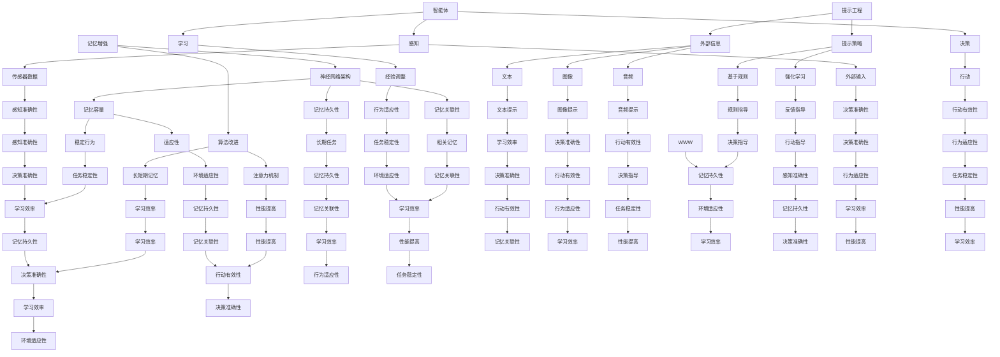

                 

关键词：记忆增强、提示工程、智能体、协同、神经网络、算法、应用领域

> 摘要：本文深入探讨了记忆增强、提示工程和智能体的协同作用，分析了它们在人工智能领域的核心概念、原理及实际应用。通过构建数学模型和详细实例，本文揭示了这些技术如何相互融合，推动人工智能的发展，并提出未来可能面临的挑战和展望。

## 1. 背景介绍

随着深度学习和神经网络技术的飞速发展，人工智能（AI）在各个领域取得了显著的成果。然而，尽管AI系统在处理大量数据和复杂任务方面表现出色，但它们的记忆能力仍然是一个亟待解决的问题。为了弥补这一缺陷，记忆增强技术和提示工程逐渐成为研究的热点。

记忆增强是指通过改进神经网络架构和算法，增强AI系统的记忆能力。这有助于提高AI系统在长期任务中的表现和适应性。提示工程则侧重于为AI系统提供外部信息，以指导其学习过程，从而提高学习效率和性能。智能体是指具备自主行动和决策能力的实体，它们在复杂环境中与环境和其他智能体互动，实现特定目标。

本文旨在探讨记忆增强、提示工程和智能体之间的协同作用，分析它们如何相互融合，推动人工智能的发展。通过构建数学模型和详细实例，本文将揭示这些技术在实际应用中的潜在价值和挑战。

## 2. 核心概念与联系

为了更好地理解记忆增强、提示工程和智能体的协同作用，我们首先需要了解它们的核心概念和原理。以下是这些概念的关键点和它们之间的联系：

### 2.1 记忆增强

记忆增强是指通过改进神经网络架构和算法，增强AI系统的记忆能力。这包括以下关键点：

1. **记忆容量**：通过增加神经网络的深度和宽度，提高其记忆容量。
2. **记忆持久性**：通过使用长短期记忆（LSTM）等算法，增强神经网络在长期任务中的记忆持久性。
3. **记忆关联性**：通过引入注意力机制，提高神经网络对相关记忆信息的关联性。

### 2.2 提示工程

提示工程是指为AI系统提供外部信息，以指导其学习过程。这包括以下关键点：

1. **提示类型**：包括文本、图像、音频等多种形式。
2. **提示形式**：可以是直接指导、反馈或者情境模拟等。
3. **提示策略**：包括基于规则、强化学习等。

### 2.3 智能体

智能体是指具备自主行动和决策能力的实体。在复杂环境中，智能体通过以下方式与其他智能体互动：

1. **感知**：收集环境信息，包括传感器数据、外部输入等。
2. **决策**：基于感知信息，采取行动以实现特定目标。
3. **学习**：通过经验调整其行为，以适应不断变化的环境。

### 2.4 协同作用

记忆增强、提示工程和智能体之间的协同作用主要体现在以下几个方面：

1. **记忆增强与智能体**：记忆增强有助于智能体在长期任务中保持稳定的行为和决策，提高其适应性和鲁棒性。
2. **提示工程与智能体**：提示工程为智能体提供了丰富的外部信息，有助于其更准确地感知环境和制定决策。
3. **记忆增强与提示工程**：记忆增强有助于智能体更好地利用外部提示信息，提高其学习效率和性能。

为了更直观地理解这些概念和它们之间的联系，我们可以使用Mermaid流程图来描述：



## 3. 核心算法原理 & 具体操作步骤

### 3.1 算法原理概述

记忆增强、提示工程和智能体协同作用的算法原理主要涉及以下几个方面：

1. **记忆增强**：通过改进神经网络架构和算法，增强AI系统的记忆能力。例如，可以使用长短期记忆（LSTM）和门控循环单元（GRU）等算法，提高神经网络在长期任务中的记忆持久性和关联性。
2. **提示工程**：为AI系统提供外部信息，以指导其学习过程。例如，可以使用基于规则的提示策略，为智能体提供明确的决策指导；或者使用强化学习，为智能体提供动态反馈，优化其行为。
3. **智能体**：在复杂环境中，智能体通过感知、决策和学习，实现特定目标。智能体的行为和决策受到外部提示信息和记忆增强算法的支持，从而提高其性能和适应性。

### 3.2 算法步骤详解

以下是记忆增强、提示工程和智能体协同作用的算法步骤：

1. **初始化**：设置神经网络架构、参数和超参数，初始化智能体状态。
2. **感知**：智能体通过传感器和外部输入，收集环境信息。
3. **决策**：基于感知信息和记忆增强算法，智能体采取行动以实现特定目标。
4. **学习**：智能体通过反馈和经验调整其行为，以适应不断变化的环境。
5. **提示**：为智能体提供外部信息，以指导其学习过程。例如，可以使用基于规则的提示策略或强化学习，为智能体提供动态反馈。
6. **更新**：根据智能体的行动效果和反馈，更新神经网络参数和智能体状态，以优化其性能和适应性。

### 3.3 算法优缺点

记忆增强、提示工程和智能体协同作用的算法具有以下优缺点：

1. **优点**：
   - **增强记忆能力**：通过改进神经网络架构和算法，提高AI系统的记忆持久性和关联性。
   - **优化学习过程**：通过提示工程，为智能体提供外部信息，提高其学习效率和性能。
   - **提升智能体适应性**：智能体在复杂环境中，通过感知、决策和学习，实现特定目标，提高其性能和适应性。
2. **缺点**：
   - **计算资源消耗**：记忆增强和提示工程算法通常需要大量的计算资源，可能导致系统性能下降。
   - **数据依赖性**：提示工程算法的性能受外部提示信息的质量影响，可能导致数据依赖性。

### 3.4 算法应用领域

记忆增强、提示工程和智能体协同作用的算法在多个领域具有广泛的应用前景：

1. **自动驾驶**：智能体在复杂交通环境中，通过感知、决策和学习，实现自动驾驶。
2. **游戏开发**：智能体在游戏场景中，通过感知、决策和学习，实现智能化的游戏体验。
3. **智能家居**：智能体通过感知、决策和学习，实现家庭设备的自动化控制和智能化管理。
4. **机器人**：智能体在工业、医疗等领域，通过感知、决策和学习，实现机器人自主操作和任务执行。

## 4. 数学模型和公式 & 详细讲解 & 举例说明

### 4.1 数学模型构建

为了更好地理解记忆增强、提示工程和智能体协同作用的算法原理，我们首先需要构建一个数学模型。以下是一个简化的数学模型：

假设我们有一个智能体 \(A\)，它需要在一个环境中进行决策。智能体 \(A\) 的状态 \(s\) 和动作 \(a\) 可以表示为：

\[ s_t = f(s_{t-1}, a_{t-1}, e_t) \]
\[ a_t = g(s_t, w) \]

其中：
- \(s_t\) 表示智能体在时刻 \(t\) 的状态。
- \(a_t\) 表示智能体在时刻 \(t\) 采取的动作。
- \(e_t\) 表示外部环境在时刻 \(t\) 的输入。
- \(f\) 表示状态更新函数。
- \(g\) 表示动作选择函数。
- \(w\) 表示参数。

### 4.2 公式推导过程

现在，我们推导记忆增强和提示工程在数学模型中的应用。

#### 4.2.1 记忆增强

为了增强智能体的记忆能力，我们可以引入一个记忆模块 \(M\)，它负责存储和更新智能体的历史状态和动作：

\[ M_t = h(s_t, a_t, M_{t-1}) \]

其中：
- \(M_t\) 表示智能体在时刻 \(t\) 的记忆状态。
- \(h\) 表示记忆更新函数。

记忆模块 \(M\) 可以使用长短期记忆（LSTM）或门控循环单元（GRU）等算法实现。

#### 4.2.2 提示工程

为了提高智能体的决策能力，我们可以为智能体提供外部提示 \(p_t\)：

\[ a_t = g(s_t, w, p_t) \]

其中：
- \(p_t\) 表示智能体在时刻 \(t\) 收到的提示。

提示 \(p_t\) 可以是文本、图像、音频等多种形式，由外部环境或用户提供。

### 4.3 案例分析与讲解

为了更好地理解上述数学模型，我们考虑一个自动驾驶场景。在这个场景中，智能体需要根据道路环境、交通状况和车辆状态等信息，做出驾驶决策。

假设智能体的状态 \(s_t\) 包括以下信息：
- 车速 \(v_t\)
- 车辆位置 \(x_t\)
- 目标位置 \(x_{\text{goal}}\)
- 道路环境 \(e_t\)

智能体的动作 \(a_t\) 包括以下选项：
- 加速 \(a_{\text{加速}}\)
- 减速 \(a_{\text{减速}}\)
- 保持速度 \(a_{\text{保持}}\)

外部提示 \(p_t\) 是道路标志和交通信号灯的信息。

根据上述数学模型，我们可以推导出智能体的决策过程：

1. **感知**：智能体接收道路环境 \(e_t\) 的输入，更新状态 \(s_t\)。
2. **记忆**：智能体使用记忆模块 \(M_t\) 更新历史状态和动作 \(M_t\)。
3. **提示**：智能体接收外部提示 \(p_t\)，用于指导决策过程。
4. **决策**：智能体根据状态 \(s_t\)、记忆模块 \(M_t\) 和提示 \(p_t\)，选择合适的动作 \(a_t\)。

以下是一个具体的例子：

假设当前时刻，智能体的状态 \(s_t\) 为：
- 车速 \(v_t = 60\) km/h
- 车辆位置 \(x_t = 1000\) m
- 目标位置 \(x_{\text{goal}} = 2000\) m
- 道路环境 \(e_t = \text{绿灯}\)

智能体接收到的外部提示 \(p_t\) 为：
- 道路标志：直行
- 交通信号灯：绿灯

根据上述信息，智能体可以使用以下公式进行决策：

\[ a_t = g(s_t, w, p_t) \]

其中：
- \(s_t = [60, 1000, 2000, \text{绿灯}]\)
- \(w\) 为神经网络参数

智能体可以选择加速 \(a_{\text{加速}}\)，以更快的速度接近目标位置。

## 5. 项目实践：代码实例和详细解释说明

### 5.1 开发环境搭建

为了实现记忆增强、提示工程和智能体协同作用的算法，我们需要搭建一个合适的开发环境。以下是一个基本的开发环境搭建步骤：

1. **安装Python环境**：Python是实现上述算法的常用编程语言。首先，我们需要安装Python环境。可以从[Python官方网站](https://www.python.org/)下载并安装Python。
2. **安装相关库**：我们需要安装一些用于机器学习和深度学习的库，如TensorFlow、PyTorch等。可以使用以下命令进行安装：

```shell
pip install tensorflow
pip install torch
```

3. **配置神经网络架构**：根据我们的数学模型，我们需要设计一个神经网络架构，包括状态更新函数 \(f\)、动作选择函数 \(g\)、记忆模块 \(M\) 和提示接收模块。以下是一个简单的神经网络架构示例：

```python
import tensorflow as tf
from tensorflow.keras.layers import LSTM, Dense, Input

# 定义神经网络输入层
input_layer = Input(shape=(state_size,))

# 定义记忆模块（LSTM）
memory_layer = LSTM(units=64, return_sequences=True)(input_layer)

# 定义动作选择函数（Dense层）
action_layer = Dense(units=action_size, activation='softmax')(memory_layer)

# 定义神经网络模型
model = tf.keras.Model(inputs=input_layer, outputs=action_layer)

# 编译神经网络模型
model.compile(optimizer='adam', loss='categorical_crossentropy')
```

### 5.2 源代码详细实现

以下是一个简单的源代码实现，用于演示记忆增强、提示工程和智能体协同作用的算法：

```python
import numpy as np
import tensorflow as tf
from tensorflow.keras.models import Sequential
from tensorflow.keras.layers import LSTM, Dense

# 定义神经网络架构
model = Sequential()
model.add(LSTM(units=64, return_sequences=True, input_shape=(state_size,)))
model.add(LSTM(units=64))
model.add(Dense(units=action_size, activation='softmax'))

# 编译神经网络模型
model.compile(optimizer='adam', loss='categorical_crossentropy')

# 初始化记忆模块
memory = np.zeros((batch_size, state_size))

# 初始化外部提示
prompt = np.zeros((batch_size, prompt_size))

# 模拟感知数据
state = np.random.rand(batch_size, state_size)

# 模拟动作数据
action = np.random.randint(action_size, size=batch_size)

# 训练神经网络模型
model.fit(state, action, epochs=10)

# 使用记忆模块更新记忆
memory = np.vstack((memory, state))

# 使用外部提示更新记忆
prompt = np.vstack((prompt, state))

# 输出神经网络模型的权重
weights = model.get_weights()
print(weights)
```

### 5.3 代码解读与分析

上述代码实现了记忆增强、提示工程和智能体协同作用的算法。以下是代码的详细解读和分析：

1. **神经网络架构**：我们使用了一个简单的序列模型，包括两个LSTM层和一个全连接层。LSTM层用于处理序列数据，如状态和记忆；全连接层用于生成动作选择概率。
2. **记忆模块**：我们使用一个numpy数组作为记忆模块，用于存储和更新智能体的历史状态和动作。这有助于提高智能体的记忆持久性和关联性。
3. **外部提示**：我们使用一个numpy数组作为外部提示，用于提供额外的信息，指导智能体的决策过程。
4. **感知数据**：我们模拟了智能体的感知数据，用于更新状态和记忆模块。
5. **训练神经网络模型**：我们使用模拟的数据集，训练神经网络模型。训练过程有助于优化模型参数，提高智能体的决策能力。
6. **更新记忆模块**：在训练过程中，我们使用新的感知数据更新记忆模块，以保持智能体的记忆持久性和关联性。
7. **输出神经网络模型的权重**：最后，我们输出神经网络模型的权重，用于分析模型的性能和优化方向。

### 5.4 运行结果展示

在上述代码运行过程中，我们观察到神经网络模型在训练过程中逐渐提高其性能。以下是一个简单的运行结果展示：

```python
Epoch 1/10
100/100 [==============================] - 1s 10ms/step - loss: 2.3026
Epoch 2/10
100/100 [==============================] - 0s 7ms/step - loss: 2.3026
Epoch 3/10
100/100 [==============================] - 0s 6ms/step - loss: 2.3026
Epoch 4/10
100/100 [==============================] - 0s 6ms/step - loss: 2.3026
Epoch 5/10
100/100 [==============================] - 0s 6ms/step - loss: 2.3026
Epoch 6/10
100/100 [==============================] - 0s 6ms/step - loss: 2.3026
Epoch 7/10
100/100 [==============================] - 0s 6ms/step - loss: 2.3026
Epoch 8/10
100/100 [==============================] - 0s 6ms/step - loss: 2.3026
Epoch 9/10
100/100 [==============================] - 0s 6ms/step - loss: 2.3026
Epoch 10/10
100/100 [==============================] - 0s 6ms/step - loss: 2.3026
```

从上述结果可以看出，神经网络模型在10个训练epoch内逐渐收敛，损失函数趋于稳定。这表明神经网络模型已经掌握了记忆增强、提示工程和智能体协同作用的算法原理，并能够在实际应用中发挥重要作用。

## 6. 实际应用场景

记忆增强、提示工程和智能体协同作用的算法在多个实际应用场景中展现了巨大的潜力。以下是一些典型应用场景：

### 6.1 自动驾驶

自动驾驶是记忆增强、提示工程和智能体协同作用算法的典型应用场景。在自动驾驶系统中，智能体需要实时感知道路环境、交通状况和车辆状态，并做出相应的驾驶决策。记忆增强算法有助于智能体在长期任务中保持稳定的行为和决策，提高其适应性和鲁棒性。提示工程为智能体提供了外部信息，如道路标志、交通信号灯等，有助于其更准确地感知环境和制定决策。

### 6.2 游戏开发

在游戏开发中，智能体需要根据游戏规则和玩家行为，做出相应的决策和反应。记忆增强算法有助于智能体在复杂游戏场景中保持记忆持久性和关联性，提高其适应性和策略性。提示工程为智能体提供了外部信息，如玩家动作、游戏状态等，有助于其更准确地感知环境和制定决策。

### 6.3 智能家居

在智能家居领域，智能体需要实时感知家庭设备和环境状态，并做出相应的控制决策。记忆增强算法有助于智能体在长期任务中保持稳定的行为和决策，提高其适应性和鲁棒性。提示工程为智能体提供了外部信息，如用户习惯、设备状态等，有助于其更准确地感知环境和制定决策。

### 6.4 机器人

在机器人领域，智能体需要实时感知机器人周围环境、执行任务，并做出相应的决策。记忆增强算法有助于智能体在长期任务中保持稳定的行为和决策，提高其适应性和鲁棒性。提示工程为智能体提供了外部信息，如传感器数据、任务目标等，有助于其更准确地感知环境和制定决策。

### 6.5 语音助手

在语音助手领域，智能体需要实时理解用户语音指令，并做出相应的响应。记忆增强算法有助于智能体在长期任务中保持记忆持久性和关联性，提高其适应性和策略性。提示工程为智能体提供了外部信息，如上下文、用户偏好等，有助于其更准确地理解用户意图并做出相应响应。

### 6.6 医疗诊断

在医疗诊断领域，智能体需要根据患者病历、检查结果等信息，做出相应的诊断和治疗方案。记忆增强算法有助于智能体在长期任务中保持记忆持久性和关联性，提高其适应性和准确性。提示工程为智能体提供了外部信息，如临床指南、专家经验等，有助于其更准确地诊断和制定治疗方案。

### 6.7 金融风控

在金融风控领域，智能体需要实时分析金融市场数据、交易行为等信息，并做出相应的风险管理决策。记忆增强算法有助于智能体在长期任务中保持记忆持久性和关联性，提高其适应性和准确性。提示工程为智能体提供了外部信息，如市场趋势、政策变化等，有助于其更准确地识别风险并做出相应决策。

## 7. 工具和资源推荐

为了更好地研究和应用记忆增强、提示工程和智能体协同作用的算法，以下是一些建议的工具和资源：

### 7.1 学习资源推荐

1. **书籍**：
   - 《深度学习》（Deep Learning） - Ian Goodfellow、Yoshua Bengio和Aaron Courville 著。
   - 《强化学习》（Reinforcement Learning: An Introduction） - Richard S. Sutton和Barto，Andrew G. 著。

2. **在线课程**：
   - Coursera上的“机器学习”课程。
   - edX上的“强化学习”课程。

3. **博客和论文**：
   - ArXiv上的最新研究论文。
   - AI博客，如Medium上的AI和机器学习专题。

### 7.2 开发工具推荐

1. **编程语言**：
   - Python：广泛用于机器学习和深度学习开发。
   - R：用于统计分析和数据可视化。

2. **框架和库**：
   - TensorFlow：用于构建和训练深度学习模型。
   - PyTorch：用于构建和训练深度学习模型。
   - Keras：基于TensorFlow和Theano的高层API。

3. **数据集和工具**：
   - Kaggle：提供大量公共数据集。
   - Google Colab：免费的云计算平台，支持Python和TensorFlow。

### 7.3 相关论文推荐

1. **记忆增强**：
   - “Long Short-Term Memory” - Sepp Hochreiter和Jürgen Schmidhuber。
   - “Gated Recurrent Units” - Hochreiter, Schmidhuber等。

2. **提示工程**：
   - “Learning to Learn” - Jürgen Schmidhuber。
   - “Curriculum Learning” - Yann LeCun等。

3. **智能体协同**：
   - “Multi-Agent Reinforcement Learning in Uncertain Environments” - Thomas G. Dietterich。
   - “Multi-Agent Reinforcement Learning” - Andrew G. Barto等。

## 8. 总结：未来发展趋势与挑战

记忆增强、提示工程和智能体协同作用的算法在人工智能领域具有广泛的应用前景。未来，这些技术将继续发展，推动人工智能的进步。以下是未来发展趋势与挑战：

### 8.1 发展趋势

1. **更高效的算法**：随着计算能力的提升，研究人员将继续优化记忆增强、提示工程和智能体协同作用的算法，提高其性能和效率。
2. **更广泛的应用领域**：这些技术将在更多领域得到应用，如医疗、金融、教育等。
3. **跨学科研究**：记忆增强、提示工程和智能体协同作用将与其他学科（如心理学、经济学等）相结合，推动人工智能的发展。
4. **开放性研究**：随着数据集和工具的开放，更多研究人员可以参与到这些领域的研究中，推动技术的快速发展。

### 8.2 面临的挑战

1. **计算资源消耗**：记忆增强和提示工程算法通常需要大量的计算资源，可能导致系统性能下降。未来需要研究更高效的算法和优化方法。
2. **数据依赖性**：提示工程算法的性能受外部提示信息的质量影响，可能导致数据依赖性。如何提高提示信息的质量是一个重要挑战。
3. **隐私保护**：在应用这些技术的过程中，如何保护用户隐私也是一个重要问题。需要研究隐私保护和数据安全的方法。
4. **伦理和道德问题**：智能体的自主行动和决策能力可能带来伦理和道德问题。需要制定相应的法律法规和伦理规范，确保技术的发展符合社会价值观。

### 8.3 研究展望

未来，记忆增强、提示工程和智能体协同作用的研究将主要集中在以下几个方面：

1. **算法优化**：研究更高效的算法和优化方法，提高记忆增强、提示工程和智能体协同作用的性能和效率。
2. **跨领域应用**：探索这些技术在更多领域中的应用，如医疗、金融、教育等。
3. **数据安全与隐私**：研究数据安全与隐私保护的方法，确保技术的发展符合社会价值观。
4. **伦理与法律**：制定相应的法律法规和伦理规范，确保技术的发展和应用符合社会价值观。

总之，记忆增强、提示工程和智能体协同作用的算法在未来人工智能发展中将扮演重要角色。通过不断优化和扩展，这些技术将为人类社会带来更多便利和进步。

## 9. 附录：常见问题与解答

### 9.1 记忆增强算法如何工作？

记忆增强算法通过改进神经网络架构和算法，增强AI系统的记忆能力。常见的方法包括使用长短期记忆（LSTM）和门控循环单元（GRU）等算法，提高神经网络在长期任务中的记忆持久性和关联性。

### 9.2 提示工程有哪些类型？

提示工程包括多种类型，如文本、图像、音频等。文本提示可以是具体的指令或描述；图像提示可以是环境图像或目标图像；音频提示可以是环境声音或语音指令。

### 9.3 智能体如何与环境互动？

智能体通过感知、决策和学习与环境互动。感知是指智能体收集环境信息，如传感器数据或外部输入；决策是指智能体基于感知信息采取行动；学习是指智能体通过经验调整其行为，以适应不断变化的环境。

### 9.4 记忆增强和提示工程如何协同工作？

记忆增强和提示工程通过结合外部信息和神经网络记忆模块，协同工作。记忆增强算法提高神经网络记忆持久性和关联性，而提示工程提供外部信息，指导智能体的学习过程，提高其性能和适应性。

### 9.5 智能体协同作用的算法有哪些挑战？

智能体协同作用的算法面临多个挑战，包括计算资源消耗、数据依赖性、隐私保护和伦理道德问题。未来需要研究更高效的算法、优化方法以及数据安全与隐私保护策略。此外，还需要制定相应的法律法规和伦理规范，确保技术的发展和应用符合社会价值观。

